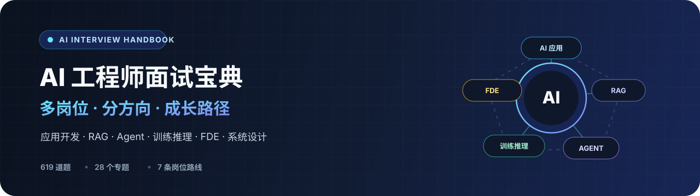
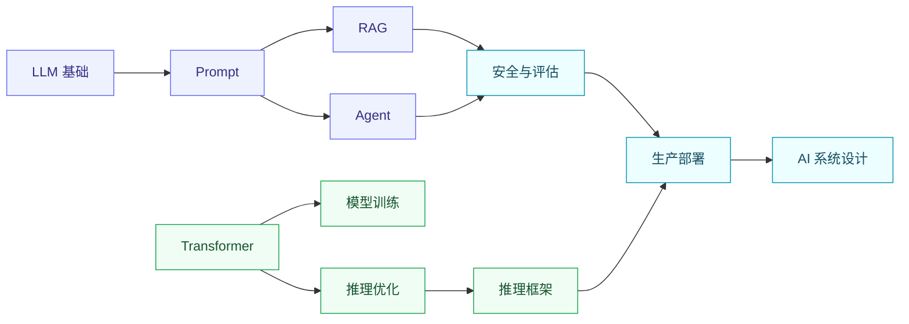

  <b>简体中文</b> ·
  <a href="README_EN.md">English</a> ·
  <a href="README_JA.md">日本語</a> ·
  <a href="README_KO.md">한국어</a> ·
  <a href="README_PT-BR.md">Português do Brasil</a> ·
  <a href="README_ES.md">Español</a> ·
  <a href="README_ID.md">Bahasa Indonesia</a>

  

<h3 align="center">一份面向 AI 全岗位的系统化面试宝典</h3>

  岗位路线全覆盖 · 核心考点图文化 · 工程取舍可复述 · 内容质量可校验

  <a href="#quick-start"><b>快速开始</b></a> ·
  <a href="#roadmap"><b>学习路线</b></a> ·
  <a href="#catalog"><b>题库导航</b></a> ·
  <a href="#learning-materials"><b>配套课件</b></a> ·
  <a href="CONTENT_QUALITY.md"><b>质量规范</b></a> ·
  <a href="ILLUSTRATION_GUIDE.md"><b>插画规范</b></a> ·
  <a href="#support"><b>支持项目</b></a>

  
  
  
  

> [!TIP]
> **先选岗位，再走路线；先看图建立记忆，再用答案组织表达。** 这不是只为某一个职位准备的题库。无论你面试 AI 应用、RAG、Agent、模型训练与推理、FDE、多模态还是安全评测，都可以找到对应的专题组合、成长路线和高频考点。

## ✨ 这份指南有什么不同

<table>
  <tr>
    <td width="50%" valign="top">
      <h3>🧭 AI 岗位全覆盖</h3>
      
覆盖 AI 应用、RAG、Agent、模型训练与推理、FDE、多模态、安全评测等主流方向。不同岗位选择不同专题组合，不必从头盲目刷到尾。

    </td>
    <td width="50%" valign="top">
      <h3>🖼️ 图文双通道记忆</h3>
      
把抽象原理、系统流程、概念对比和常见误区转成动漫知识图。先用画面建立记忆锚点，再结合文字答案形成可复述的面试表达。

    </td>
  </tr>
  <tr>
    <td width="50%" valign="top">
      <h3>⚖️ 回答强调工程取舍</h3>
      
不止解释“是什么”，还会继续回答为什么这样选、如何验证，以及质量、延迟、成本、安全、复杂度和替代方案之间如何权衡。

    </td>
    <td width="50%" valign="top">
      <h3>🧪 内容可以持续校验</h3>
      
697 道题按 28 个专题组织，并用自动审计检查失效链接、重复题和缺少条件的数据；题目质量优先于单纯堆数量。

    </td>
  </tr>
</table>

## 🧠 看得懂，才能记得住、说得出

这里的插画不是装饰图。每张图都会先通读完整题目和答案，再提炼出<strong>核心机制、工程流程、易错认知和一句话记忆点</strong>。面试前可以先看图快速唤醒知识结构，再展开文字答案复习细节。

<table>
  <tr>
    <td width="33%" valign="top" align="center">
      
       <b>LLM 基础图解</b> 
      把 Token、解码、Attention、KV Cache 等抽象概念画成可理解的机制图。
    </td>
    <td width="33%" valign="top" align="center">
      
       <b>RAG 系统图解</b> 
      从知识入库、检索重排到生成评测，建立完整的生产系统全景。
    </td>
    <td width="33%" valign="top" align="center">
      
       <b>Transformer 架构图解</b> 
      用结构分解和数据流理解 Attention、位置编码、归一化与架构演进。
    </td>
  </tr>
  <tr>
    <td width="33%" valign="top" align="center">
      
       <b>Agent 系统图解</b> 
      把规划、工具调用、记忆、反思和风险边界串成可复述的工作流。
    </td>
    <td width="33%" valign="top" align="center">
      
       <b>训练与推理图解</b> 
      理解微调、对齐、量化、KV Cache、批处理以及吞吐延迟取舍。
    </td>
    <td width="33%" valign="top" align="center">
      
       <b>安全与生产图解</b> 
      从安全评测、网关和限流走到可观测、发布与生产可靠性。
    </td>
  </tr>
</table>

<b>01–28 共 28 个专题、697 道题，现已全部完成逐题配图。</b>

  <a href="docs/01-basic-concepts/">01 LLM 基础</a> ·
  <a href="docs/02-prompt-engineering/">02 Prompt</a> ·
  <a href="docs/03-rag-system/">03 RAG</a> ·
  <a href="docs/04-transformer-architecture/">04 Transformer</a> ·
  <a href="docs/05-ai-agent-basics/">05 Agent</a> 
  <a href="docs/06-vector-index-optimization/">06 向量检索</a> ·
  <a href="docs/07-model-training/">07 模型训练</a> ·
  <a href="docs/08-inference-optimization/">08 推理优化</a> ·
  <a href="docs/09-ai-safety-evaluation/">09 安全评测</a> ·
  <a href="docs/10-production-deployment/">10 生产部署</a> 
  <a href="docs/11-multimodal-ai/">11 多模态 AI</a> ·
  <a href="docs/12-frameworks-tools/">12 框架工具</a> ·
  <a href="docs/13-multi-agent-systems/">13 多 Agent</a> ·
  <a href="docs/14-mcp-skill-systems/">14 MCP / Skills</a> ·
  <a href="docs/15-advanced-topics/">15 进阶专题</a> 
  <a href="docs/16-resume-interview-tips/">16 简历与面试</a> ·
  <a href="docs/17-ai-coding-tools/">17 AI 编程工具</a> ·
  <a href="docs/18-big-tech-interview-questions/">18 大厂面试题</a> ·
  <a href="docs/19-inference-frameworks/">19 推理框架</a> ·
  <a href="docs/20-rag-advanced-optimization/">20 RAG 高级优化</a> 
  <a href="docs/21-multimodal-agents/">21 多模态 Agent</a> ·
  <a href="docs/22-agent-planning-reflection/">22 规划与反思</a> ·
  <a href="docs/23-agent-observability/">23 Agent 可观测性</a> ·
  <a href="docs/24-python-engineering/">24 Python 工程</a> 
  <a href="docs/25-system-design-ai/">25 AI 系统设计</a> ·
  <a href="docs/26-forward-deployed-engineer/">26 FDE</a> ·
  <a href="docs/27-project-experience/">27 项目经验</a> ·
  <a href="docs/28-test-harness-evaluation/">28 测试 Harness</a>

## 📚 配套学习课件：Dive into LLMs

除了 673 道面试题，仓库还收录了 **11 份、495 页**的《动手学大模型》系列课件。它们不是单纯的书单链接，而是一套从基础方法、动手实验走到安全与 Agent 前沿的课程型 PDF，适合在刷题后继续补原理、看案例和设计复现实验。

> [!NOTE]
> GitHub 支持 PDF 预览，但文件较大或结构复杂时可能出现 `Unable to render`。“在线阅读”通过返回标准 `application/pdf` 的 jsDelivr 打开；“GitHub”使用仓库预览；“下载”获取 Raw 原文件。第一份课件已从 10.9 MB 优化到 10 MB 以下，以提高 GitHub 预览成功率。

| # | 课件 | 内容简介 | 对应面试方向 | 阅读入口 |
|---:|------|----------|--------------|----------|
| 01 | 大模型技术与发展 | 从模型演进、预训练与微调讲到推理部署，建立训练、验证、发布的完整链路 | LLM 基础、模型训练、生产部署 | [在线阅读](https://cdn.jsdelivr.net/gh/guocong-bincai/ai-interview-guide@main/ai-books-online/01-finetuning-and-deployment.pdf) · [GitHub](ai-books-online/01-finetuning-and-deployment.pdf) · [下载](https://raw.githubusercontent.com/guocong-bincai/ai-interview-guide/main/ai-books-online/01-finetuning-and-deployment.pdf) |
| 02 | Prompt 与思维链 | Prompt 设计、上下文学习、Few-shot 与 Chain-of-Thought 的方法和边界 | Prompt Engineering、推理能力 | [在线阅读](https://cdn.jsdelivr.net/gh/guocong-bincai/ai-interview-guide@main/ai-books-online/02-prompting-and-cot.pdf) · [GitHub](ai-books-online/02-prompting-and-cot.pdf) · [下载](https://raw.githubusercontent.com/guocong-bincai/ai-interview-guide/main/ai-books-online/02-prompting-and-cot.pdf) |
| 03 | 大模型知识编辑 | 讲清参数知识如何定位、修改与评估，并对比微调、RAG 和机器遗忘 | ROME、MEMIT、MEND、知识更新 | [在线阅读](https://cdn.jsdelivr.net/gh/guocong-bincai/ai-interview-guide@main/ai-books-online/03-knowledge-editing.pdf) · [GitHub](ai-books-online/03-knowledge-editing.pdf) · [下载](https://raw.githubusercontent.com/guocong-bincai/ai-interview-guide/main/ai-books-online/03-knowledge-editing.pdf) |
| 04 | LLM 数学推理 | 围绕推理数据构造、过程监督、蒸馏与评测理解数学能力如何获得 | CoT、推理蒸馏、过程评估 | [在线阅读](https://cdn.jsdelivr.net/gh/guocong-bincai/ai-interview-guide@main/ai-books-online/04-math-reasoning.pdf) · [GitHub](ai-books-online/04-math-reasoning.pdf) · [下载](https://raw.githubusercontent.com/guocong-bincai/ai-interview-guide/main/ai-books-online/04-math-reasoning.pdf) |
| 05 | LLM 文本水印 | 水印嵌入、统计检测、质量影响，以及改写和翻译下的鲁棒性 | 内容溯源、安全评测、KGW | [在线阅读](https://cdn.jsdelivr.net/gh/guocong-bincai/ai-interview-guide@main/ai-books-online/05-text-watermark.pdf) · [GitHub](ai-books-online/05-text-watermark.pdf) · [下载](https://raw.githubusercontent.com/guocong-bincai/ai-interview-guide/main/ai-books-online/05-text-watermark.pdf) |
| 06 | 越狱攻击与防御 | 梳理越狱攻击类型、自动化攻击编排、评估器与防御验证 | 红队 Harness、Guardrail、安全测试 | [在线阅读](https://cdn.jsdelivr.net/gh/guocong-bincai/ai-interview-guide@main/ai-books-online/06-jailbreak.pdf) · [GitHub](ai-books-online/06-jailbreak.pdf) · [下载](https://raw.githubusercontent.com/guocong-bincai/ai-interview-guide/main/ai-books-online/06-jailbreak.pdf) |
| 07 | LLM 文本隐写 | 通过受控 Token 选择隐藏信息，分析容量、自然度、可恢复性与检测性 | 隐写与水印辨析、模型安全 | [在线阅读](https://cdn.jsdelivr.net/gh/guocong-bincai/ai-interview-guide@main/ai-books-online/07-text-steganography.pdf) · [GitHub](ai-books-online/07-text-steganography.pdf) · [下载](https://raw.githubusercontent.com/guocong-bincai/ai-interview-guide/main/ai-books-online/07-text-steganography.pdf) |
| 08 | 多模态大模型 | 多模态模型的架构、数据、训练范式、能力演进与评估框架 | VLM、视觉语言对齐、多模态评测 | [在线阅读](https://cdn.jsdelivr.net/gh/guocong-bincai/ai-interview-guide@main/ai-books-online/08-multimodal-llms.pdf) · [GitHub](ai-books-online/08-multimodal-llms.pdf) · [下载](https://raw.githubusercontent.com/guocong-bincai/ai-interview-guide/main/ai-books-online/08-multimodal-llms.pdf) |
| 09 | GUI Agent | 从页面感知、元素定位、动作空间讲到数据构造、评测与人工接管 | Computer Use、GUI 自动化、Agent | [在线阅读](https://cdn.jsdelivr.net/gh/guocong-bincai/ai-interview-guide@main/ai-books-online/09-gui-agent.pdf) · [GitHub](ai-books-online/09-gui-agent.pdf) · [下载](https://raw.githubusercontent.com/guocong-bincai/ai-interview-guide/main/ai-books-online/09-gui-agent.pdf) |
| 10 | 大模型智能体安全 | 关注 Agent 在多步工具调用中的风险行为、攻击面、轨迹评测和阻断策略 | Agent Safety、行为评测、权限控制 | [在线阅读](https://cdn.jsdelivr.net/gh/guocong-bincai/ai-interview-guide@main/ai-books-online/10-agent-safety.pdf) · [GitHub](ai-books-online/10-agent-safety.pdf) · [下载](https://raw.githubusercontent.com/guocong-bincai/ai-interview-guide/main/ai-books-online/10-agent-safety.pdf) |
| 11 | RLHF 大模型对齐 | 串联 SFT、奖励建模、PPO、KL 约束及奖励黑客等对齐问题 | RLHF、DPO、模型对齐 | [在线阅读](https://cdn.jsdelivr.net/gh/guocong-bincai/ai-interview-guide@main/ai-books-online/11-rlhf.pdf) · [GitHub](ai-books-online/11-rlhf.pdf) · [下载](https://raw.githubusercontent.com/guocong-bincai/ai-interview-guide/main/ai-books-online/11-rlhf.pdf) |

完整来源、页数和实验 Notebook 映射见 [课件资料页](ai-books-online/) 与 [课件和实验阅读索引](docs/references/dive-into-llms-reading-list.md)。

## 🚀 快速开始

根据你的目标选择入口：

- **第一次系统学习**：先看下方岗位路线，按顺序完成核心专题。
- **面试前快速查漏**：直接进入 [面试题来源整理](docs/18-big-tech-interview-questions/)，再回到薄弱专题。
- **准备项目深挖**：重点练习 [项目经验](docs/27-project-experience/) 与 [AI 系统设计](docs/25-system-design-ai/)。
- **准备 FDE 岗位**：进入 [FDE 专题](docs/26-forward-deployed-engineer/)，练习开放问题拆解、客户交付与生产 AI 系统。
- **参与内容维护**：阅读 [内容质量规范](CONTENT_QUALITY.md) 与 [面试题插画生产规范](ILLUSTRATION_GUIDE.md)，并按规范人工检查链接、题号、标题和来源。
- **继续动手实验**：查看 [《动手学大模型》课件与实验阅读索引](docs/references/dive-into-llms-reading-list.md)，按知识编辑、水印、推理蒸馏、红队与 GUI Agent 路线复现。

每道题建议练成三个回答版本：

1. **30 秒版**：先给结论和核心判断；
2. **3 分钟版**：补充原理、方案比较与工程取舍；
3. **追问版**：说明如何验证、失败如何处理、为什么不用另一种方案。

## 🗺️ 选择你的 AI 岗位路线

<b>AI 应用 / LLM 应用工程师</b> · 从模型能力走到可上线的业务系统

 

[LLM 基础](docs/01-basic-concepts/) → [Prompt Engineering](docs/02-prompt-engineering/) → [RAG 系统](docs/03-rag-system/) → [Agent 基础](docs/05-ai-agent-basics/) → [生产部署](docs/10-production-deployment/) → [AI 系统设计](docs/25-system-design-ai/)

<b>RAG 工程师</b> · 从召回链路走到评测与生产治理

 

[LLM 基础](docs/01-basic-concepts/) → [RAG 系统](docs/03-rag-system/) → [向量索引优化](docs/06-vector-index-optimization/) → [RAG 高级优化](docs/20-rag-advanced-optimization/) → [安全与评估](docs/09-ai-safety-evaluation/) → [Agent 可观测性](docs/23-agent-observability/)

<b>Agent 工程师</b> · 从工具调用走到规划、协作与治理

 

[Prompt Engineering](docs/02-prompt-engineering/) → [Agent 基础](docs/05-ai-agent-basics/) → [规划与反思](docs/22-agent-planning-reflection/) → [多 Agent 系统](docs/13-multi-agent-systems/) → [MCP 与 Skills](docs/14-mcp-skill-systems/) → [Agent 可观测性](docs/23-agent-observability/)

<b>模型训练与推理工程师</b> · 从架构原理走到吞吐与部署

 

[Transformer 架构](docs/04-transformer-architecture/) → [模型训练](docs/07-model-training/) → [推理优化](docs/08-inference-optimization/) → [推理框架](docs/19-inference-frameworks/) → [生产部署](docs/10-production-deployment/)

<b>Forward Deployed Engineer</b> · 从开放问题走到客户生产结果

 

[项目经验](docs/27-project-experience/) → [Python 工程](docs/24-python-engineering/) → [AI 系统设计](docs/25-system-design-ai/) → [生产部署](docs/10-production-deployment/) → [FDE 专题](docs/26-forward-deployed-engineer/)

<b>多模态 AI 工程师</b> · 从多模态理解走到视觉工具与实时交互

 

[Transformer 架构](docs/04-transformer-architecture/) → [多模态 AI](docs/11-multimodal-ai/) → [多模态 Agent](docs/21-multimodal-agents/) → [推理优化](docs/08-inference-optimization/) → [生产部署](docs/10-production-deployment/)

<b>AI 安全与评测工程师</b> · 从评测方法走到风险控制与线上监测

 

[LLM 基础](docs/01-basic-concepts/) → [Prompt Engineering](docs/02-prompt-engineering/) → [安全与评估](docs/09-ai-safety-evaluation/) → [Agent 可观测性](docs/23-agent-observability/) → [生产部署](docs/10-production-deployment/)

## 📚 题库导航

共 **28 个专题、697 道题**。点击分类展开完整目录。

<b>🧠 基础与模型</b> · 6 个专题 / 174 道题

 

- [01 · LLM 基础](docs/01-basic-concepts/) — Token、解码、Embedding、训练阶段、模型结构基础
- [02 · Prompt Engineering](docs/02-prompt-engineering/) — Prompt、上下文设计、结构化输出与评测
- [Transformer 架构](docs/04-transformer-architecture/) — Attention、位置编码、归一化与架构演进
- [07 · 模型训练](docs/07-model-training/) — LoRA、数据、训练、对齐与评估
- [08 · 推理优化](docs/08-inference-optimization/) — KV Cache、量化、批处理与推测解码
- [19 · 推理框架](docs/19-inference-frameworks/) — vLLM、SGLang、TensorRT-LLM 与基准方法

<b>🔎 RAG 与检索</b> · 3 个专题 / 64 道题

 

- [03 · RAG 系统](docs/03-rag-system/) — 文档处理、检索、生成与常见问题
- [06 · 向量索引优化](docs/06-vector-index-optimization/) — ANN 索引、混合检索、Rerank 与调参
- [20 · RAG 高级优化](docs/20-rag-advanced-optimization/) — 自适应检索、评估、权限和生产治理

<b>🤖 Agent 与协议</b> · 5 个专题 / 132 道题

 

- [05 · Agent 基础](docs/05-ai-agent-basics/) — 工具调用、状态、记忆、循环与人工确认
- [13 · 多 Agent 系统](docs/13-multi-agent-systems/) — 协作模式、任务分配、通信与故障处理
- [14 · MCP 与 Skills](docs/14-mcp-skill-systems/) — MCP 原语、能力发现、JSON-RPC 错误码、Root 访问控制、Transport 选型、多 Server 编排、规范演进、可观测性
- [22 · Agent 规划与反思](docs/22-agent-planning-reflection/) — 规划、重规划、验证、反思和终止
- [23 · Agent 可观测性](docs/23-agent-observability/) — Trace、指标、评估、告警与成本归因

<b>🏗️ 工程与系统设计</b> · 7 个专题 / 141 道题

 

- [09 · 安全与评估](docs/09-ai-safety-evaluation/) — 内容安全、Prompt 注入、隐私、红队和评测
- [10 · 生产部署](docs/10-production-deployment/) — 网关、限流、流式输出、可靠性与发布
- [12 · 框架与工具](docs/12-frameworks-tools/) — 框架抽象、选型、测试和迁移
- [24 · Python 工程](docs/24-python-engineering/) — 异步、类型、测试、重试和性能排查
- [25 · AI 系统设计](docs/25-system-design-ai/) — 客服、知识库、网关、任务系统和审核系统
- [26 · FDE 工程师](docs/26-forward-deployed-engineer/) — 问题拆解、客户交付、生产 AI 系统与现场工程
- [28 · 测试 Harness 与评测](docs/28-test-harness-evaluation/) — Test Harness、mock/stub/fake/spy、LLM Eval Harness 与灰度评测

<b>🔭 多模态与前沿方向</b> · 4 个专题 / 103 道题

 

- [11 · 多模态 AI](docs/11-multimodal-ai/) — 图像、音频、视频与多模态检索
- [15 · 高级专题](docs/15-advanced-topics/) — 尚未完全稳定的研究和工程方向
- [17 · AI 编程工具](docs/17-ai-coding-tools/) — Coding Agent、代码评测、上下文和团队治理
- [21 · 多模态 Agent](docs/21-multimodal-agents/) — GUI、文档、视频和视觉工具调用

<b>💼 面试准备</b> · 3 个专题 / 53 道结构化训练题

 

- [16 · 简历与面试技巧](docs/16-resume-interview-tips/) — 简历、项目表达、行为面试与追问
- [18 · 面试题来源整理](docs/18-big-tech-interview-questions/) — 按公司整理面试考点，使用时注意来源可信度
- [27 · 项目经验](docs/27-project-experience/) — 项目说明、指标、技术取舍和事故复盘

## 🧭 高效使用这套题库

- **先说判断，再讲知识**：面试官通常更关心你如何选择，而不是能否背出定义。
- **用真实数据替换示例**：延迟、吞吐、成本和准确率必须来自你的实验或项目记录。
- **主动补充边界条件**：说明方案何时有效、何时失效，以及如何监控和回滚。
- **检查时效性信息**：产品版本、论文数据和性能结论可能变化，优先核对官方文档与原论文。

## ☕ 支持项目

这份面经会持续免费开放。整理、筛选、校对和维护内容需要投入不少时间；如果它帮你节省了备战时间，欢迎请作者喝一杯奶茶。每一份支持都会成为继续更新题库、核对资料和优化答案的动力。

> [!NOTE]
> 打赏完全自愿，不会解锁额外内容。不方便打赏也没关系，点一个 **Star**、分享项目或提交真实面试反馈，都是很大的支持。

<b>🥤 请作者喝杯奶茶（微信 / 支付宝）</b>

 

<table>
  <tr>
    <th align="center">微信支付</th>
    <th align="center">支付宝</th>
  </tr>
  <tr>
    <td align="center">
      
    </td>
    <td align="center">
      
    </td>
  </tr>
</table>

点击二维码可查看原图 · 感谢你的支持 ❤️

## 🤝 内容质量与贡献

本项目坚持“**题目质量优先于数量**”。新增或修改题目前，请先阅读 [内容质量规范](CONTENT_QUALITY.md)。本仓库不接受无来源的精确效果数字、虚构的一线面试标签或第一人称项目战绩。

提交前请按规范人工检查失效链接、页内锚点、题号、重复标题和来源。

发现错误，欢迎提交 [Issue](https://github.com/guocong-bincai/ai-interview-guide/issues)；想补充考点或优化答案，欢迎提交 [Pull Request](https://github.com/guocong-bincai/ai-interview-guide/pulls)。

如果这个项目对你有帮助，欢迎点一个 **Star**，也欢迎把你的真实面试反馈沉淀回来，让题库持续变好。

## 📄 License

[MIT](LICENSE)
