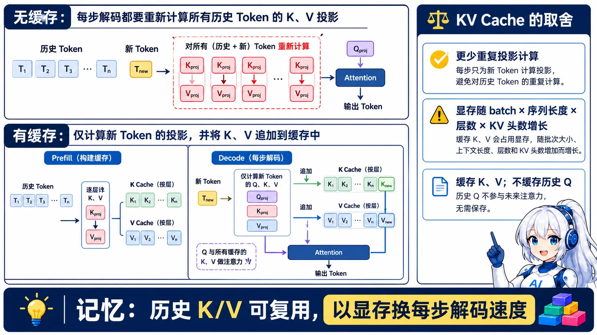
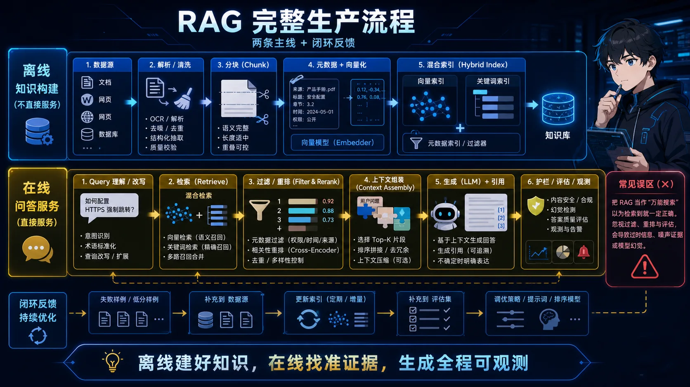
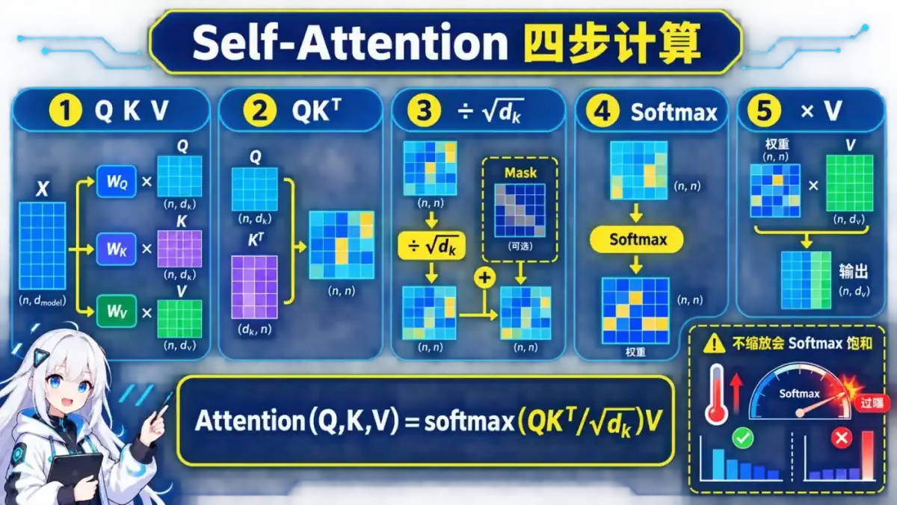
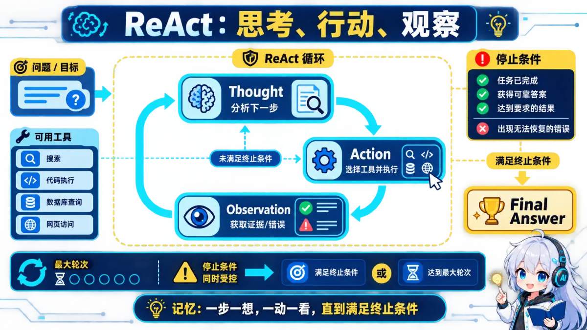

  <a href="README.md">简体中文</a> ·
  <b>English</b> ·
  <a href="README_JA.md">日本語</a> ·
  <a href="README_KO.md">한국어</a> ·
  <a href="README_PT-BR.md">Português do Brasil</a> ·
  <a href="README_ES.md">Español</a> ·
  <a href="README_ID.md">Bahasa Indonesia</a>

# AI Engineer Interview Handbook

> A structured interview guide for AI application, RAG, Agent, model training and inference, FDE, multimodal, and AI safety roles.

**662 questions · 28 topics · 7 role-based learning paths**

> [!IMPORTANT]
> This page is a translated project introduction. The full question bank and answers are currently maintained in Simplified Chinese. Topic links below open the Chinese content; technical terms and code remain broadly readable.

## Why this repository

- **Built for real roles:** topics follow recurring responsibilities in AI engineering jobs rather than isolated trivia.
- **Engineering trade-offs first:** answers discuss quality, latency, cost, safety, complexity, and alternatives.
- **Quality-controlled:** repository audits check broken links, duplicate questions, unsupported precise metrics, and one-to-one illustration coverage.

## Visual learning

All 28 topics and 662 questions now include a dedicated, clickable 16:9 teaching illustration. The visuals summarize mechanisms, workflows, trade-offs, boundaries, and a retellable memory cue. They currently use Chinese labels, matching the source-of-truth question bank, while standard technical terms remain recognizable.

<table>
  <tr>
    <td width="33%" align="center"> <b>LLM Fundamentals</b></td>
    <td width="33%" align="center"> <b>RAG Systems</b></td>
    <td width="33%" align="center"> <b>Transformer</b></td>
  </tr>
  <tr>
    <td width="33%" align="center"> <b>AI Agents</b></td>
    <td width="33%" align="center"> <b>Training & Inference</b></td>
    <td width="33%" align="center"> <b>Safety & Production</b></td>
  </tr>
</table>

<b>28 topics · 662 questions · complete one-question-one-illustration coverage</b>

## Choose your path

| Role | Recommended path |
|---|---|
| AI / LLM Application Engineer | [LLM Basics](docs/01-basic-concepts/) → [Prompt Engineering](docs/02-prompt-engineering/) → [RAG](docs/03-rag-system/) → [Agent Basics](docs/05-ai-agent-basics/) → [Production](docs/10-production-deployment/) → [AI System Design](docs/25-system-design-ai/) |
| RAG Engineer | [LLM Basics](docs/01-basic-concepts/) → [RAG](docs/03-rag-system/) → [Vector Search](docs/06-vector-index-optimization/) → [Advanced RAG](docs/20-rag-advanced-optimization/) → [Safety & Evaluation](docs/09-ai-safety-evaluation/) → [Observability](docs/23-agent-observability/) |
| Agent Engineer | [Prompt Engineering](docs/02-prompt-engineering/) → [Agent Basics](docs/05-ai-agent-basics/) → [Planning & Reflection](docs/22-agent-planning-reflection/) → [Multi-Agent](docs/13-multi-agent-systems/) → [MCP & Skills](docs/14-mcp-skill-systems/) → [Observability](docs/23-agent-observability/) |
| Training & Inference Engineer | [Transformer](docs/04-transformer-architecture/) → [Model Training](docs/07-model-training/) → [Inference Optimization](docs/08-inference-optimization/) → [Inference Frameworks](docs/19-inference-frameworks/) |
| Forward Deployed Engineer | [Project Deep Dives](docs/27-project-experience/) → [Python Engineering](docs/24-python-engineering/) → [AI System Design](docs/25-system-design-ai/) → [FDE](docs/26-forward-deployed-engineer/) |
| Multimodal AI Engineer | [Transformer](docs/04-transformer-architecture/) → [Multimodal AI](docs/11-multimodal-ai/) → [Multimodal Agents](docs/21-multimodal-agents/) → [Production](docs/10-production-deployment/) |
| AI Safety & Evaluation Engineer | [LLM Basics](docs/01-basic-concepts/) → [Prompt Engineering](docs/02-prompt-engineering/) → [Safety & Evaluation](docs/09-ai-safety-evaluation/) → [Test Harness & Evaluation](docs/28-test-harness-evaluation/) → [Observability](docs/23-agent-observability/) → [Production](docs/10-production-deployment/) |

## Topic map

- **Foundations and models:** LLM basics, Transformer architecture, training, inference optimization, and inference frameworks.
- **RAG and retrieval:** RAG systems, vector index optimization, and advanced production RAG.
- **Agents and protocols:** Agent fundamentals, multi-agent systems, MCP/Skills, planning, and observability.
- **Engineering and system design:** safety evaluation, production deployment, frameworks, Python, AI system design, FDE, and [Test Harness & Evaluation](docs/28-test-harness-evaluation/).
- **Multimodal and emerging topics:** multimodal AI, multimodal agents, AI coding tools, and advanced topics.
- **Interview preparation:** resumes, interview-source notes, and project deep dives.

See the [complete topic catalog in the Chinese README](README.md#catalog).

## How to practice

Prepare three versions of every answer:

1. **30 seconds:** state the decision and the core reasoning.
2. **3 minutes:** explain principles, alternatives, and trade-offs.
3. **Follow-up depth:** explain validation, failure handling, and why you rejected another approach.

Replace all example metrics with evidence from your own work. Product behavior, prices, and benchmark results can change; verify time-sensitive claims against official documentation or original papers.

## Contributing

Read the [content quality policy](CONTENT_QUALITY.md) before adding or changing questions. Translation improvements are welcome, but the Chinese question bank remains the source of truth until a maintained full translation exists.

Open an [Issue](https://github.com/guocong-bincai/ai-interview-guide/issues) to report a problem or submit a [Pull Request](https://github.com/guocong-bincai/ai-interview-guide/pulls) with a correction.

## License

[MIT](LICENSE)
