# 📌 LLM 基础概念

> **面试优先顺序（通用 AI 应用开发岗位）**：1、3、4、5、7、9、10、20、21、23、27、30、34、36。其余题目用于进阶或特定岗位拓展；实际频率会随岗位和面试轮次变化，产品版本资讯不应当作通用必考题。

## 📋 目录

1. [基础概念](#basics)
2. [核心原理与评估](#principles)
3. [模型选型与推理](#reasoning)
4. [Embedding 与训练](#training)
5. [应用工程基础](#application-engineering)

---

<a id="basics"></a>

## 1. Token 是什么？

<p align="center">
  <a href="../../assets/illustrations/01-basic-concepts/q01-token.webp">
    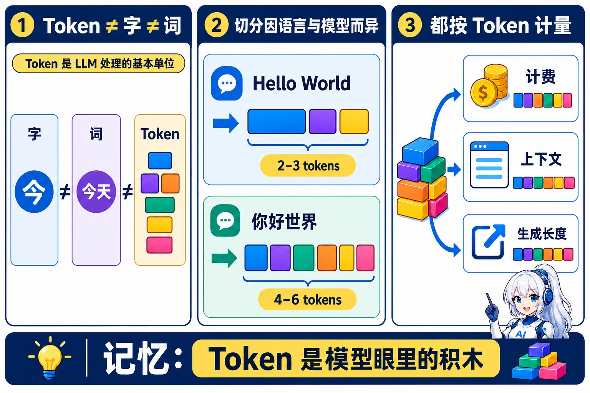
  </a>
</p>

<p align="center"><sub>🧠 图解记忆：Token 是模型眼里的积木；点击图片可查看原图。</sub></p>

**Token** 是 LLM 处理文本的基本单位（不是字，也不是词）。

| 语言 | 仅用于估算的经验值 |
|------|--------------------|
| 英文 | 常见分词器中，1 token 往往约为 4 个英文字符或 0.75 个单词 |
| 中文 | 一个汉字可能对应一个或多个 token，不能用固定比例精确换算 |

**例子：**
```
"你好世界" → 具体数量取决于模型使用的 tokenizer
"Hello World" → 常见 tokenizer 通常切成少量 tokens
```

不同模型、特殊符号、数字、空格和代码都会改变切分结果；计费或容量规划应使用目标模型的 tokenizer 或 API usage 数据实测。

**影响：**
- 计费按 token 计算
- 上下文限制按 token 计算
- 生成长度按 token 计算

## 2. Temperature、Top-P、Top-K

<p align="center">
  <a href="../../assets/illustrations/01-basic-concepts/q02-sampling-parameters.webp">
    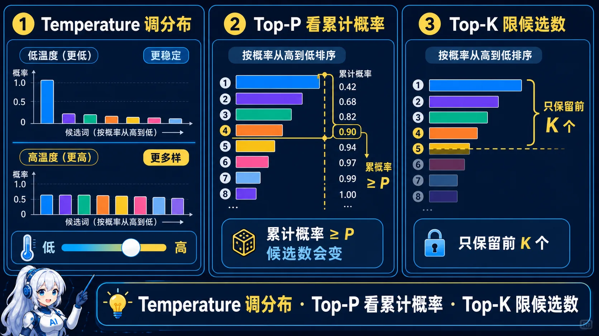
  </a>
</p>

<p align="center"><sub>🧠 图解记忆：Temperature 调分布，Top-P 看累计概率，Top-K 限候选数；点击图片可查看原图。</sub></p>

### Temperature（温度）

控制输出的随机性：

| 值 | 效果 | 适用场景 |
|----|------|----------|
| 0 | 尽量选择高概率 token，随机性较低但不保证完全可复现 | 问答、代码生成 |
| 0.3-0.7 | 适度随机 | 通用对话 |
| 0.7-1.0 | 高随机性 | 创意写作 |

### Top-P（核采样）

将候选 Token 按概率从高到低排序，取“累计概率首次达到 `P`”的最小候选集合，再在集合内重新归一化并采样：

- `top_p=0.9` 不表示固定保留 90% 的词表，而是保留累计概率达到 0.9 所需的候选；
- 分布很集中时集合可能很小，分布平坦时集合会更大；
- 它和 Top-K 都是在裁剪候选集合，通常不需要同时激进调整。

### Top-K

只从概率最高的 K 个词里采样：
- Top-K = 50：只从前 50 个候选词里选

### 推荐配置

```python
# RAG/问答
Temperature=0, Top-P=0.9

# 创意写作
Temperature=0.7, Top-P=0.9

# 代码生成
Temperature=0.2, Top-P=0.95
```

## 3. Context Window（上下文窗口）

<p align="center">
  <a href="../../assets/illustrations/01-basic-concepts/q03-context-window.webp">
    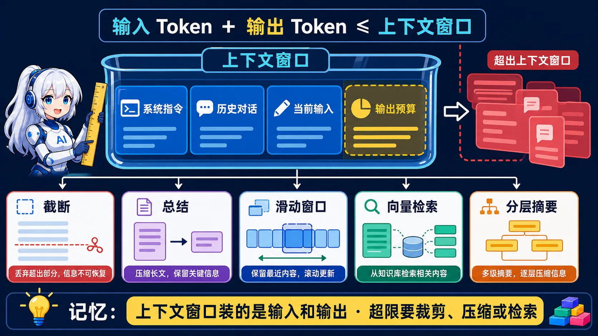
  </a>
</p>

<p align="center"><sub>🧠 图解记忆：上下文窗口同时装输入和输出，超限要裁剪、压缩或检索；点击图片可查看原图。</sub></p>

**定义：** LLM 一次能处理的总 token 数（输入 + 输出）。

| 模型 | 上下文限制 |
|------|------------|
| API 模型 | 以供应商当前模型文档为准 |
| 自部署模型 | 同时受模型训练长度、位置编码扩展方法和推理引擎配置影响 |

### 超出限制的解决方案

1. **截断** - 保留最近的对话
2. **总结** - 用 LLM 总结历史对话
3. **滑动窗口** - 只保留最近 N 轮
4. **向量检索** - 把历史存向量库，按需检索
5. **分层摘要** - 重要信息摘要 + 最近对话原文

## 4. LLM 和传统机器学习模型有什么区别？为什么是“大”语言模型？

<p align="center">
  <a href="../../assets/illustrations/01-basic-concepts/q04-llm-vs-task-model.webp">
    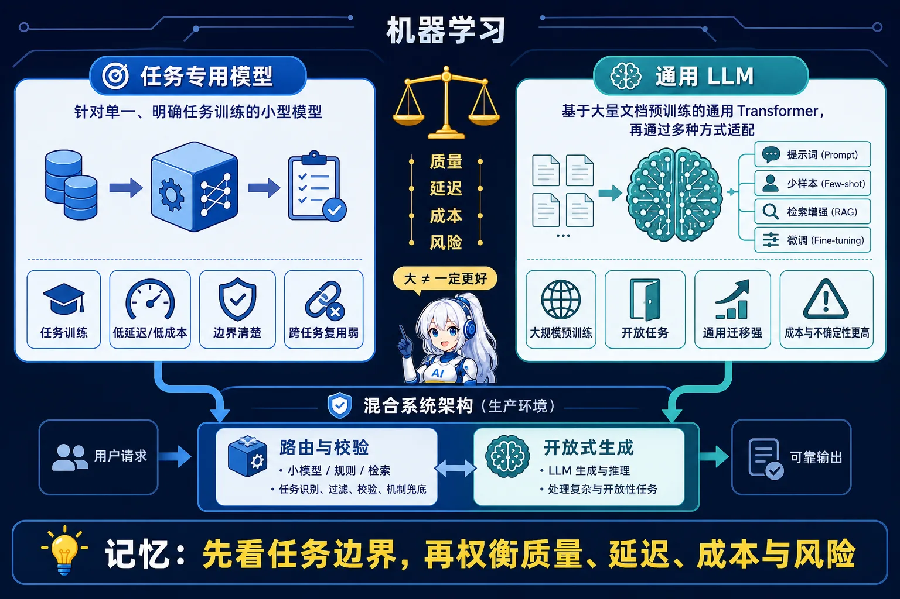
  </a>
</p>

<p align="center"><sub>🧠 图解记忆：先看任务边界，再权衡质量、延迟、成本与风险；点击图片可查看原图。</sub></p>

### 30 秒回答

LLM 通常是以 Transformer 为基础、在大规模语料上进行自监督预训练的语言模型。它仍然属于机器学习，不是与“传统机器学习”完全对立的新类别。实际差异主要体现在训练规模、预训练目标、迁移方式和部署成本，而不是简单的“生成式 vs 判别式”。

### 对比维度

| 维度 | 任务专用模型 | 通用 LLM |
|------|-------------|----------|
| 训练目标 | 可使用监督分类、回归、排序或生成目标 | 常以 next-token prediction 预训练，再做指令或偏好对齐 |
| 迁移方式 | 通常需要针对任务训练或重新设计特征 | 可通过 Prompt、少样本示例、RAG 或微调适配多类任务 |
| 输入输出 | 可以是结构化、图像、文本等任意模态 | 核心模型处理 Token；多模态模型还会接入视觉或音频编码 |
| 优势 | 延迟低、成本低、行为边界清楚，特定任务可能更准 | 通用性强，能处理开放式语言任务和未见过的指令 |
| 局限 | 跨任务复用能力有限 | 成本高、输出有随机性，可能幻觉，难以提供确定性保证 |

“大”没有统一参数阈值，通常同时指参数、训练数据和计算规模较大。参数更多也不等于一定更好；数据质量、训练方法、架构和推理预算都会影响能力。

### 工程取舍

- 标签明确、追求极低延迟的分类任务，先考虑规则或小模型；
- 开放式生成、复杂语义理解和跨任务交互更适合 LLM；
- 生产系统常用“小模型/规则负责路由与校验，LLM 负责开放式生成”的组合，而不是二选一。

### 常见追问

- 为什么一个 LLM 能通过同一个预训练目标适配多种任务？
- 什么时候小模型会比 LLM 更合适？
- RAG、微调和传统分类器分别解决什么问题？

## 5. 幻觉（Hallucination）

<p align="center">
  <a href="../../assets/illustrations/01-basic-concepts/q05-hallucination.webp">
    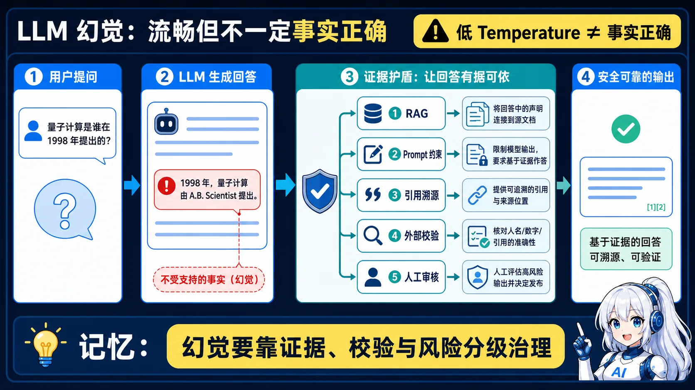
  </a>
</p>

<p align="center"><sub>🧠 图解记忆：幻觉要靠证据、校验与风险分级治理；点击图片可查看原图。</sub></p>

**定义：** 模型编造不存在的信息。

### 减少幻觉的方法

1. **RAG** - 基于检索内容回答
2. **Prompt 约束** - "不要编造，不知道就说不知道"
3. **引用溯源** - 要求标注来源
4. **外部校验** - 对实体、数字和引用做规则或工具验证
5. **人工审核** - 高风险场景设置人工复核和拒答边界

> 降低 Temperature 可以减少输出差异，但不能保证事实正确，不能作为主要的幻觉治理手段。

## 📝 面试题

**Q: LLM 的 Token 是什么？中文和英文有什么区别？**

<details>
<summary>💡 参考答案</summary>

- Token 是 LLM 处理文本的基本单位
- 英文：1 token ≈ 4 个字符 ≈ 0.75 个单词
- 中文：1 个汉字 ≈ 1-2 个 tokens
- 影响：计费、上下文限制、生成长度都按 token 算

</details>

---

<a id="principles"></a>

## 6. 什么是涌现能力（Emergent Abilities）？“突然出现”一定是真的吗？

<p align="center">
  <a href="../../assets/illustrations/01-basic-concepts/q06-emergent-abilities.webp">
    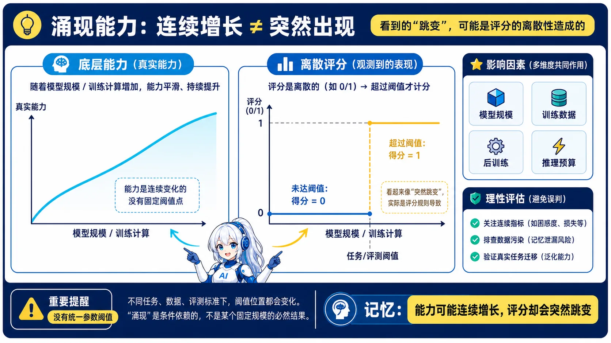
  </a>
</p>

<p align="center"><sub>🧠 图解记忆：能力可能连续增长，评分却会突然跳变；点击图片可查看原图。</sub></p>

### 30 秒回答

涌现能力通常指：模型规模或训练计算增加后，某项能力在评测上从接近随机快速提升。它是一个观察结果，不代表存在统一的参数阈值，也不能仅凭模型大小预测。部分“突然出现”还可能来自离散评分指标——底层能力连续改善，但只有跨过答对阈值后分数才跳变。

### 常见现象

<details>
<summary>💡 答案要点</summary>

| 能力 | 如何观察 | 注意事项 |
|------|----------|----------|
| 上下文学习 | 增加示例后任务表现改善 | 受数据污染、示例格式和模型训练方式影响 |
| 复杂推理 | 多步任务准确率随规模或推理预算上升 | 不能只看最终答案，应检查过程和稳定性 |
| 指令遵循 | 对未见指令的泛化能力提升 | 往往也受 SFT、偏好优化和系统提示影响 |
| 代码生成 | 单测通过率提高 | 需要在固定脚手架、预算和测试集下比较 |

### 面试中应强调的边界

- 不要背诵“10B/100B 出现某能力”之类固定阈值；
- 区分模型规模、训练数据、后训练和测试时算力的贡献；
- 检查评测指标是否连续、是否存在污染，以及提升能否迁移到真实任务；
- 工程选型仍应基于自己的评测集，而不是假设更大模型必然具备某项能力。

</details>

---

## 7. LLM 为什么是概率模型？为什么同样的输入输出会不一样？

<p align="center">
  <a href="../../assets/illustrations/01-basic-concepts/q07-probabilistic-generation.webp">
    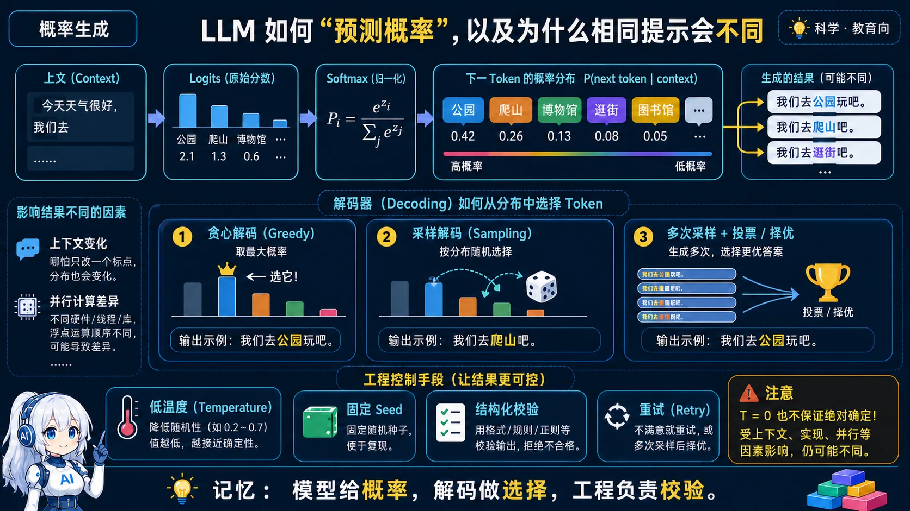
  </a>
</p>

<p align="center"><sub>🧠 图解记忆：模型给概率，解码做选择，工程负责校验；点击图片可查看原图。</sub></p>

**核心：LLM 本质是一个"概率分布"——对每个 Token 计算概率，再按策略采样，所以输出天然带随机性。**

### 为什么 LLM 是概率模型？（面试必答）

1. **训练目标就是概率**：预训练学的是 `P(下一个Token | 上文)`，模型输出的是词表上的概率分布（经 Softmax）
2. **生成靠采样**：解码时从概率分布中选 Token（贪心选最大，或按分布随机采）
3. **知识是"统计规律"**：模型学到的不是确定性规则，而是"什么词在什么语境下更可能"——所以同一问题可能给出不同但都合理的答案

### 为什么同样的输入输出会不一样？（高频追问）

| 原因 | 说明 | 可控性 |
|------|------|--------|
| **采样随机性** | Top-P/Top-K/温度>0 时按概率随机选 | ✅ 可调（T=0 降低） |
| **浮点非确定性** | GPU 并行累加顺序差异，极端情况影响 argmax | ⚠️ 固定 seed 缓解 |
| **多轮上下文** | 同样问题在不同对话历史下，模型"想法"不同 | ❌ 天然存在 |
| **模型服务负载** | 部分框架在不同批处理下有小差异 | ⚠️ 少见 |

### 概率模型的工程影响（加分点）

- **需要确定性输出的场景**：T=0 + 固定 seed + 结构化输出校验
- **需要稳定的场景**：加输出格式校验 + 重试策略（解析失败重生成）
- **利用随机性**：多次采样取最佳（Self-Consistency），创意场景故意调高温度

### 面试话术

> "LLM 是概率生成模型，输出层是一个词表上的概率分布，解码时通过采样策略选 Token。所以同样输入可能输出不同——这是采样随机性导致的，不是 bug。工程上我会分场景处理：需要确定性时用 T=0 + 固定 seed + 输出校验；需要多样性时提高温度；需要更可靠时用多次采样投票。"

---

## 8. LLM的幻觉(Hallucination)与偏见(Bias)

<p align="center">
  <a href="../../assets/illustrations/01-basic-concepts/q08-hallucination-vs-bias.webp">
    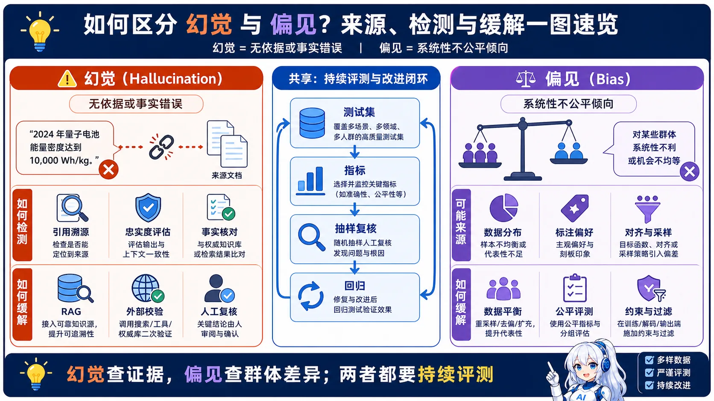
  </a>
</p>

<p align="center"><sub>🧠 图解记忆：幻觉查证据，偏见查群体差异，两者都要持续评测；点击图片可查看原图。</sub></p>

### 幻觉问题（补充：如何检测与量化幻觉？）

<details>
<summary>💡 答案要点</summary>

> （什么是幻觉、幻觉类型、基本缓解方法 → 见第 5 节）

**如何检测幻觉（面试高频追问）：**

| 方法 | 原理 | 场景 |
|------|------|------|
| **引用溯源** | 要求模型回答时给出引用/来源 | 生产系统标配 |
| **忠实度评估（Faithfulness）** | RAGAS 等框架检测"回答是否忠于检索内容" | RAG 系统 |
| **交叉验证** | 同一问题问多次/问不同模型，对比一致性 | 高价值场景 |
| **事实核对** | 关键实体（人名/日期/数字）用外部工具验证 | 知识密集型 |
| **不确定性探测** | 问模型"你有多确定"，或检查 logprobs 置信度 | 低成本粗筛 |

**量化指标（RAGAS 忠实度）：**
```python
from ragas import evaluate
from ragas.metrics import faithfulness

result = evaluate(dataset, metrics=[faithfulness])
# faithfulness: 回答中有多少陈述能从检索内容中找到依据（0-1）
```

**工程最佳实践：**
1. 生产环境必须带引用/溯源，这是幻觉的第一道防线
2. 定期抽样评估 faithfulness 指标，监控幻觉率变化
3. 高价值场景（金融/医疗）加交叉验证或人工复核

</details>

### 偏见问题

<details>
<summary>💡 答案要点</summary>

**什么是偏见?**
模型在性别、种族、地域等方面的不公平输出

**典型例子:**
```
输入: "The nurse said ... he/she"
偏见模型: 倾向用 "she" (性别刻板印象)

输入: "程序员通常是..."
偏见模型: "男性" (职业性别偏见)
```

**偏见来源:**
- 训练数据中的社会偏见
- 标注人员的主观偏好
- 采样策略导致的分布偏移

**缓解方法:**

| 方法 | 效果 | 成本 |
|------|------|------|
| **数据平衡** | 增加少数群体样本 | 高 |
| **RLHF对齐** | 人类反馈强化学习 | 高 |
| **提示词工程** | 明确要求公平性 | 低⭐ |
| **后处理过滤** | 检测并修正偏见输出 | 中 |

**面试话术:**
> **示例表达（仅在能用本人经历或可复现实验佐证时使用）：** "幻觉和偏见是LLM两大核心问题。我们项目用RAG解决幻觉——所有回答必须基于知识库,未找到时明确告知。偏见方面,我们在Prompt中明确要求'请公平对待所有性别/种族',并在RLHF阶段强化这一点。"

</details>

---

## 9. 如何评估LLM的输出质量?

<p align="center">
  <a href="../../assets/illustrations/01-basic-concepts/q09-llm-evaluation.webp">
    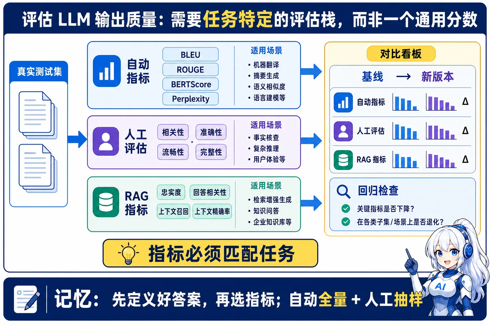
  </a>
</p>

<p align="center"><sub>🧠 图解记忆：先定义好答案，再选指标；自动全量加人工抽样；点击图片可查看原图。</sub></p>

**核心指标**

<details>
<summary>💡 答案要点</summary>

### 自动评估指标

| 指标 | 适用场景 | 优缺点 |
|------|----------|--------|
| **BLEU** | 机器翻译 | 快速,但对创意文本不准 |
| **ROUGE** | 摘要生成 | 关注召回率 |
| **BERTScore** | 语义相似度 | 考虑语义,更智能 ⭐ |
| **Perplexity** | 语言模型质量 | 低困惑度=高质量 |

### 人工评估维度

| 维度 | 说明 | 示例问题 |
|------|------|----------|
| **相关性** | 是否回答了问题 | 5分制评分 |
| **准确性** | 事实是否正确 | 有无幻觉 |
| **流畅性** | 语言是否通顺 | 是否自然 |
| **完整性** | 信息是否充分 | 有无遗漏 |

### RAG系统专用指标

```python
# 使用 RAGAS 框架
from ragas import evaluate
from ragas.metrics import (
    faithfulness,        # 忠实度: 回答是否基于检索内容
    answer_relevancy,    # 相关性: 是否回答了问题
    context_recall,      # 召回率: 检索到了关键信息吗
    context_precision    # 精确率: 检索内容是否都有用
)

results = evaluate(
    dataset=test_data,
    metrics=[faithfulness, answer_relevancy, context_recall, context_precision]
)
```

**面试话术:**
> "我们项目用双层评估:自动指标RAGAS跑全量数据,人工抽样200条核心case。关键维度是忠实度(不能幻觉)和相关性(要答对问题)。每次模型迭代都要对比这些指标,确保没有退化。"

</details>

---

## 10. Tokenization分词算法:BPE vs SentencePiece

<p align="center">
  <a href="../../assets/illustrations/01-basic-concepts/q10-tokenization.webp">
    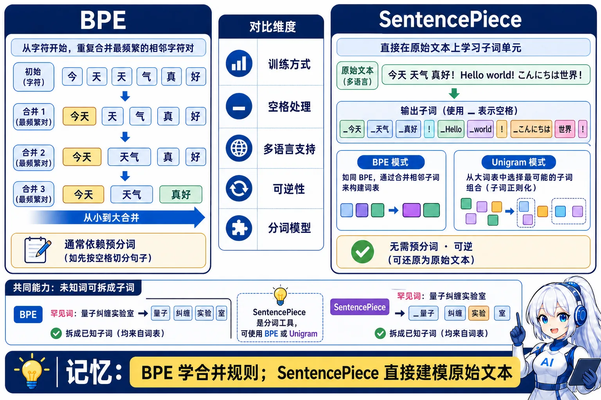
  </a>
</p>

<p align="center"><sub>🧠 图解记忆：BPE 学合并规则，SentencePiece 直接建模原始文本；点击图片可查看原图。</sub></p>

**Tokenization = 将文本切分成模型能理解的最小单位(Token)**

### BPE(Byte Pair Encoding)算法

<details>
<summary>💡 答案要点</summary>

**BPE = 基于频率的子词分词算法**

**工作原理:**
```
1. 初始化:每个字符是一个token
   "low" → ["l", "o", "w"]
   "lower" → ["l", "o", "w", "e", "r"]
   "lowest" → ["l", "o", "w", "e", "s", "t"]

2. 统计相邻字符对频率
   "lo": 3次 (最高)
   "ow": 3次
   "we": 2次
   ...

3. 合并最高频对
   "lo" → "lo"(一个token)
   "low" → ["lo", "w"]
   "lower" → ["lo", "w", "e", "r"]

4. 重复统计合并,直到词汇表达到目标大小
   "low" → ["low"]
   "lower" → ["low", "er"]
   "lowest" → ["low", "est"]
```

**优点:**
- ✅ 处理未知词:罕见词拆成已知子词
- ✅ 词汇表可控:可设定大小(如50k)
- ✅ 平衡粒度:介于字符和单词之间

**缺点:**
- ❌ 依赖预分词(需要先按空格分)
- ❌ 语言相关(中文日文处理困难)

**代码示例:**
```python
from tokenizers import Tokenizer, models, pre_tokenizers, trainers

# 创建BPE tokenizer
tokenizer = Tokenizer(models.BPE())
tokenizer.pre_tokenizer = pre_tokenizers.Whitespace()

# 训练
trainer = trainers.BpeTrainer(vocab_size=50000, special_tokens=["[PAD]", "[UNK]"])
tokenizer.train(files=["train.txt"], trainer=trainer)

# 使用
output = tokenizer.encode("GPT使用BPE分词")
print(output.tokens)  # ['GPT', '使', '用', 'BP', 'E', '分', '词']
```

</details>

### SentencePiece算法

<details>
<summary>💡 答案要点</summary>

**SentencePiece = 语言无关的分词算法**

**核心特性:**

1. **无需预分词**
   ```
   BPE: "你好世界" → 需要先分词 → ["你好", "世界"]
   SentencePiece: "你好世界" → 直接处理原始文本
   ```

2. **空格也是token**
   ```
   "Hello World"
   → ["▁Hello", "▁World"]  # ▁ 代表空格
   → 可逆解码: "Hello World"
   ```

3. **支持两种算法**
   - **BPE模式**:类似标准BPE
   - **Unigram模式**:概率分词,从大到小删减

**Unigram vs BPE:**

| 维度 | BPE | Unigram |
|------|-----|---------|
| 方向 | 从小到大合并 | 从大到小删减 |
| 确定性 | 确定 | 概率(多种分词) |
| 训练速度 | 慢 | 快 |

**代码示例:**
```python
import sentencepiece as spm

# 训练
spm.SentencePieceTrainer.train(
    input='train.txt',
    model_prefix='m',
    vocab_size=50000,
    model_type='unigram',  # 或'bpe'
    character_coverage=0.9995  # 字符覆盖率
)

# 使用
sp = spm.SentencePieceProcessor(model_file='m.model')
tokens = sp.encode('GPT使用SentencePiece分词', out_type=str)
print(tokens)  # ['▁GPT', '使用', 'Sen', 'tence', 'Piece', '分词']

# 解码
text = sp.decode(tokens)
print(text)  # '你好世界' (完美还原)
```

**优势:**
- ✅ 语言无关(中英日韩都OK)
- ✅ 无损可逆(空格也编码)
- ✅ 无需预分词
- ✅ 主流LLM首选(LLaMA、GPT-4都用)

</details>

### BPE vs SentencePiece对比

<details>
<summary>💡 答案要点</summary>

| 维度 | BPE | SentencePiece |
|------|-----|---------------|
| **预分词** | ✅需要 | ❌不需要 |
| **空格处理** | 丢失 | 保留(▁符号) |
| **多语言** | 困难 | 优秀 |
| **可逆性** | ❌ | ✅ |
| **主流应用** | GPT-2 | GPT-4,LLaMA,T5 |

**实际案例:**
```python
# 同一个文本的分词对比
text = "2024年AI发展很快"

# BPE (GPT-2)
['2024', '年', 'AI', '发', '展', '很', '快']  # 中文粒度太细

# SentencePiece (LLaMA)
['▁2024', '年', 'AI', '发展', '很快']  # 更合理的子词
```

**为什么LLM数学差?**
- Token化不一致
  ```
  "1234" → ["12", "34"]
  "1235" → ["123", "5"]  # 不一致!
  ```
- 模型难以学习数字规律

**面试话术:**
> "BPE是早期分词算法,需要预分词且丢失空格。SentencePiece是改进版,语言无关且可逆,现在主流LLM都用它。我们项目用SentencePiece Unigram模式,中英文混合语料分词效果比BPE好15%。"

</details>

---

## 11. 长文本处理:超出Context Window怎么办?

<p align="center">
  <a href="../../assets/illustrations/01-basic-concepts/q11-long-context.webp">
    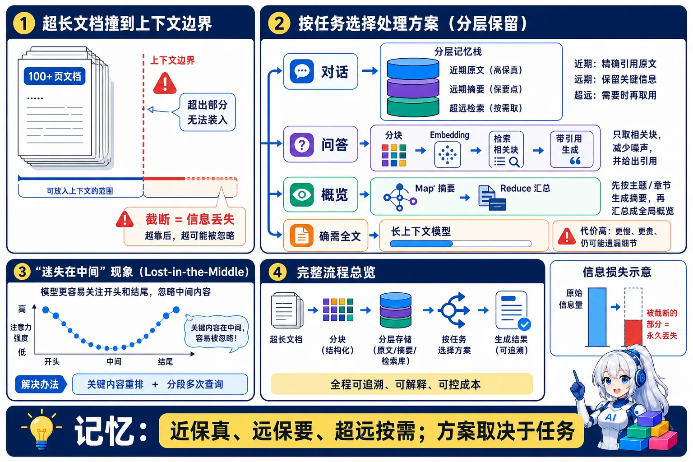
  </a>
</p>

<p align="center"><sub>🧠 图解记忆：近保真、远保要、超远按需，方案取决于任务；点击图片可查看原图。</sub></p>

<details>
<summary>💡 答案要点</summary>

**问题背景:**
```
用户上传100页PDF(约50K tokens)
GPT-4 Context Window: 8K tokens
怎么处理? ❌ 无法直接输入
```

### 解决方案对比

| 方案 | 原理 | 优缺点 | 适用场景 |
|------|------|--------|----------|
| **截断** | 丢弃超出部分 | ❌丢失信息 | 不推荐 |
| **滑动窗口** | 保留最近N个token | ❌丢失早期信息 | 实时对话 |
| **摘要压缩** | LLM递归摘要 | ⚠️可能失真 | 文档概览 |
| **RAG分块** | 切分+向量检索 | ✅最优⭐ | 问答/检索 |
| **长上下文模型** | 用128K窗口模型 | 💰成本高 | 必要时 |

### 方案1: 滑动窗口(Sliding Window)

**原理:**
```python
# 维护一个固定大小的窗口
max_tokens = 4000
history = []

while True:
    user_input = get_user_input()
    history.append(user_input)

    # 计算总token数
    total_tokens = count_tokens(history)

    # 超出窗口,删除最早的消息
    while total_tokens > max_tokens:
        history.pop(0)  # 删除第一条
        total_tokens = count_tokens(history)

    # 用窗口内容生成回复
    response = llm.generate(history)
    history.append(response)
```

**优化: Token 预算分配组合方案（2026 生产实践）：**

```
核心原则：让模型"忘掉细节，记住要点"——不是单一方案，是组合拳：

1. 实时计算 Token 数：每次发送前计算消息列表总 Token（所有策略的基础）
2. 分层保留优先级：System Prompt 必须保留 → 当前问题必须保留 → 历史按优先级裁剪
3. 摘要触发条件：历史 Token 超预算 60% 时触发——最早 N 轮调 LLM 压成摘要替换原文
4. 兜底：摘要后仍超限 → 摘要存向量库，按当前问题检索最相关片段

分层保真原则（关键）：
  近期对话 → 原文保留（保真）
  远期对话 → 摘要压缩（保要）
  超远期 → 向量检索（按需）

⚠️ 误区：不要把所有历史都做摘要——摘要是有损压缩，每压一次丢一些细节。
  分层管理：近保真、远保要、超远按需。
```

**优化: 分层管理**
<details>
<summary>展开 Python 代码示例（37 行）</summary>

```python
class ConversationManager:
    def __init__(self, max_recent=3, summary_every=10):
        self.recent_messages = []  # 最近3轮完整保留
        self.summary = ""           # 历史摘要
        self.message_count = 0

    def add_message(self, role, content):
        self.recent_messages.append({"role": role, "content": content})
        self.message_count += 1

        # 保留最近3轮
        if len(self.recent_messages) > 6:  # 3轮=6条消息
            # 把旧消息做摘要
            old = self.recent_messages.pop(0)
            old_pair = self.recent_messages.pop(0)

            self.summary += llm.summarize([old, old_pair])

        return self.get_context()

    def get_context(self):
        # 上下文 = 历史摘要 + 最近3轮原文
        context = []
        if self.summary:
            context.append({
                "role": "system",
                "content": f"历史对话摘要: {self.summary}"
            })
        context.extend(self.recent_messages)
        return context

# 使用
manager = ConversationManager()
manager.add_message("user", "你好")
manager.add_message("assistant", "你好,有什么可以帮你?")
...
context = manager.get_context()  # 自动管理上下文
```

</details>

**效果:**
- Token消耗: 稳定在4K以内
- 信息保留: 最近3轮完整+历史摘要
- 成本: 每10轮多1次摘要API调用

### 方案2: RAG分块检索(推荐⭐)

**完整流程:**
<details>
<summary>展开 Python 代码示例（49 行）</summary>

```python
# 步骤1: 文档预处理
from langchain.text_splitter import RecursiveCharacterTextSplitter

splitter = RecursiveCharacterTextSplitter(
    chunk_size=1000,       # 每块1000字符
    chunk_overlap=200,     # 200字符重叠
    separators=["\n\n", "\n", "。", ". "]
)

chunks = splitter.split_text(long_document)
# 100页PDF → 约150个chunks

# 步骤2: 向量化存储
from langchain.vectorstores import Qdrant
from langchain.embeddings import OpenAIEmbeddings

embeddings = OpenAIEmbeddings()
vector_store = Qdrant.from_texts(
    texts=chunks,
    embedding=embeddings,
    collection_name="my_documents"
)

# 步骤3: 用户提问时检索
def answer_question(question):
    # 检索top-5相关chunks
    relevant_chunks = vector_store.similarity_search(
        question, k=5
    )

    # 拼接成上下文
    context = "\n\n".join([chunk.page_content for chunk in relevant_chunks])

    # LLM生成答案
    prompt = f"""
    基于以下内容回答问题:

    {context}

    问题: {question}
    答案:
    """

    answer = llm.generate(prompt)
    return answer

# 使用
question = "文档中提到的主要结论是什么?"
answer = answer_question(question)
```

</details>

**优势:**
- ✅ 支持无限长文档
- ✅ 只检索相关部分,节省token
- ✅ 可追溯来源(返回chunk ID)

### 方案3: 递归摘要

**Map-Reduce摘要:**
```python
def recursive_summarize(long_text, max_chunk_size=4000):
    # 如果短于限制,直接摘要
    if len(long_text) < max_chunk_size:
        return llm.summarize(long_text)

    # 切分
    chunks = split_text(long_text, max_chunk_size)

    # Map: 每个chunk单独摘要
    summaries = [llm.summarize(chunk) for chunk in chunks]

    # Reduce: 合并摘要
    combined = "\n\n".join(summaries)

    # 递归(如果合并后还是太长)
    return recursive_summarize(combined, max_chunk_size)

# 示例
long_doc = load_100_page_pdf()
summary = recursive_summarize(long_doc)
print(summary)  # 最终浓缩版
```

**适用场景:**
- 只需要概览,不需要细节
- 没有特定问题,想了解大意

### 方案4: 长上下文模型

**模型对比:**

| 模型 | Context Window | 价格(1M tokens) | 适用 |
|------|----------------|-----------------|------|
| DeepSeek V4-Flash | 16K | $1.5 | 短对话 |
| GPT-4 | 8K | $30 | 通用 |
| GPT-4-32K | 32K | $60 | 长文档 |
| GPT-4-128K | 128K | $120 | 超长 |
| Claude-2 | 100K | $8 | 性价比⭐ |
| Claude-3 | 200K | $15 | 极长文档 |

**选择策略:**
```python
def choose_model(text_length):
    tokens = count_tokens(text)

    if tokens < 4000:
        return "deepseek-v4-flash"  # 便宜
    elif tokens < 30000:
        return "claude-2"       # 性价比高
    elif tokens < 120000:
        return "gpt-4-128k"     # 贵但强
    else:
        return "RAG"            # 超长必须分块
```

### Lost in the Middle问题

**现象:**
```
给LLM一个20K的文档,关键信息在中间
→ LLM往往只关注开头和结尾
→ "大海捞针"失败
```

**解决:**
```python
# 方法1: 把关键内容放开头/结尾
prompt = f"""
关键信息: {key_info}

背景资料:
{long_context}

问题: {question}
"""

# 方法2: 分段+多次查询
def multi_pass_qa(long_text, question):
    # Pass 1: 快速扫描找相关段落
    relevant_sections = quick_scan(long_text, question)

    # Pass 2: 深入分析相关段落
    answers = []
    for section in relevant_sections:
        answer = llm.generate(f"{section}\n\n{question}")
        answers.append(answer)

    # Pass 3: 综合答案
    final = llm.generate(f"综合以下答案: {answers}")
    return final
```

**面试话术:**
> **示例表达（仅在能用本人经历或可复现实验佐证时使用）：** "长文本处理首选RAG:切分+检索+生成。滑动窗口适合对话,但会丢失早期信息,我们用分层管理解决——最近3轮保留原文,历史做摘要。长上下文模型虽强但贵,128K窗口成本是8K的15倍,只在必要时用。"

</details>

---

<a id="reasoning"></a>

## 12. 如何给 LLM 选型？质量/速度/成本怎么权衡？（方法论）

<p align="center">
  <a href="../../assets/illustrations/01-basic-concepts/q12-model-selection.webp">
    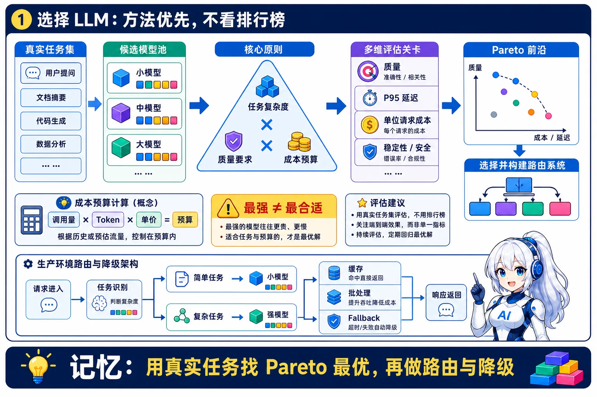
  </a>
</p>

<p align="center"><sub>🧠 图解记忆：用真实任务找 Pareto 最优，再做路由与降级；点击图片可查看原图。</sub></p>

<details>
<summary>💡 答案要点</summary>

**核心：选型不是"选最强"，而是"任务复杂度 × 质量要求 × 成本预算"三维权衡。**

### 三维决策框架（面试重点）

```
任务是什么？
  ├─ 简单问答/分类 → 便宜小模型（Flash/Lite 系列）
  ├─ 代码生成/复杂推理 → 中高端模型（Plus/Pro 系列）
  └─ 超复杂推理/Agent长任务 → 旗舰（Max/Opus 系列）

质量要求多高？
  ├─ 内部工具/草稿 → 可接受小模型
  └─ 对外生产/金融医疗 → 必须高端 + 人工复核

成本预算多少？
  ├─ 按量计费：看单价（输入/输出分别计费）
  └─ 高并发：考虑缓存命中折扣（Prompt Caching）
```

### 2026 年主流模型档位（按性价比分层，价格会变，看方法论）

| 档位 | 代表 | 特点 | 适用 |
|------|------|------|------|
| **超便宜档** | DeepSeek V4-Flash、Qwen Flash、Gemini Flash-Lite | 1-2元/百万输出 | 高频、量大、简单任务 |
| **性价比档** | Qwen Plus、DeepSeek V4-Pro、GLM | 4-8元/百万输出 | 通用生产任务 |
| **旗舰档** | GPT/Claude Opus/Qwen Max/Kimi | 30-100元/百万输出 | 复杂推理、高价值 |
| **推理档** | o3/R1/QwQ/DeepThink | 思考tokens另计 | 数学/代码/多步推理 |

### 选型五步法（面试必答）

1. **先测基准**：用你的真实任务在小样本上测几个候选模型（质量对比）
2. **看成本结构**：输入/输出单价 + 缓存命中价（高输入场景缓存价更关键）
3. **算峰值需求**：并发量 × 单次调用 token 数 × 单价 = 月成本预算
4. **考虑峰谷**：部分厂商高峰时段溢价（如 DeepSeek 白天 2 倍价），夜间批量任务可省一半
5. **留 fallback**：主模型 + 备用模型链（质量下降/限流时自动切换）

### 工程降本三板斧（加分项）

1. **模型路由**：简单问题走小模型，复杂问题升级大模型（省 60-90% 成本）
2. **Prompt Caching**：静态前缀复用缓存，输入成本降 90%
3. **批量/低峰调度**：非实时任务放夜间跑（避开高峰溢价）

**面试话术：**
> "选型我的方法论是'任务复杂度×质量×成本'三维权衡：先拿真实任务测候选模型的质量，再看单价和缓存价算成本，最后按峰值需求定预算。工程上我会配模型路由——简单问答走小模型（几分钱），复杂推理升级旗舰，再加 Prompt Caching 降输入成本。我现在的 Agent 系统就是 DeepSeek 主力 + Qwen 备用，夜间批量任务专门挑低峰时段跑，成本降了 70% 左右。"

</details>

---

## 13. 什么是推理模型（Reasoning Model）？o3/R1/QwQ 和普通模型有什么区别？

<p align="center"><a href="../../assets/illustrations/01-basic-concepts/q13-reasoning-model.webp">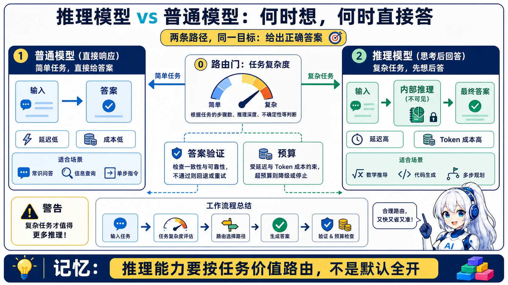</a></p>

<p align="center"><sub>🧠 图解记忆：推理能力要按任务价值路由，不是默认全开；点击图片可查看原图。</sub></p>

<details>
<summary>💡 答案要点</summary>

**推理模型 = 让模型在回答前'先思考'的模型**

普通模型：输入 → 直接输出
推理模型：输入 → 内部思考链（不展示）→ 最终答案

**主流推理模型对比（2026年）：**

| 模型 | 思考方式 | 适用场景 | 价格（/1M tokens） |
|------|----------|----------|-------------------|
| **OpenAI o3** | 显示思考过程 | 复杂推理、数学、代码 | ¥60（思考tokens另计） |
| **DeepSeek R1** | 显示思考过程 | 推理、透明化分析 | ¥4 |
| **QwQ-32B** | 显示思考过程 | 本地部署、推理 | 开源 |
| **Gemini 2.5 Pro** | 隐藏式思考 | 高效推理 | ¥20 |

**核心区别：**

| 维度 | 普通模型 | 推理模型 |
|------|----------|----------|
| **思考过程** | 无，直接输出 | 先推理后回答 |
| **Token 消耗** | 输入+输出 | 输入+思考+输出（贵 3-10x） |
| **准确性** | 一般 | 显著提升（尤其数学/代码） |
| **延迟** | 低 | 高（需等待思考） |
| **适用任务** | 简单问答、创意 | 复杂推理、多步规划 |

**面试话术：**
> "推理模型是 2026 年最重要的模型类型变革。o1 之前，模型'边想边说'；o3 之后，模型'先想后说'。这对 AI 应用开发的影响是：1）成本结构变了——简单问题用普通模型省 90% 成本；2）Prompt 写法变了——不要让推理模型'解释思考过程'，直接给任务；3）产品设计变了——需要展示思考过程给用户看（如 Claude 的 Extended Thinking）。"

**什么时候不用推理模型：**
- 简单问答（天气、时间等）— 普通模型 + 低成本
- 高并发、低延迟要求 — 推理模型延迟高 5-10x
- 成本敏感场景 — 推理模型贵 3-10x

</details>

---

## 14. 什么是 Test-Time Compute（测试时算力）？Thinking Budget 如何控制 AI 的思考量？

<p align="center"><a href="../../assets/illustrations/01-basic-concepts/q14-test-time-compute.webp">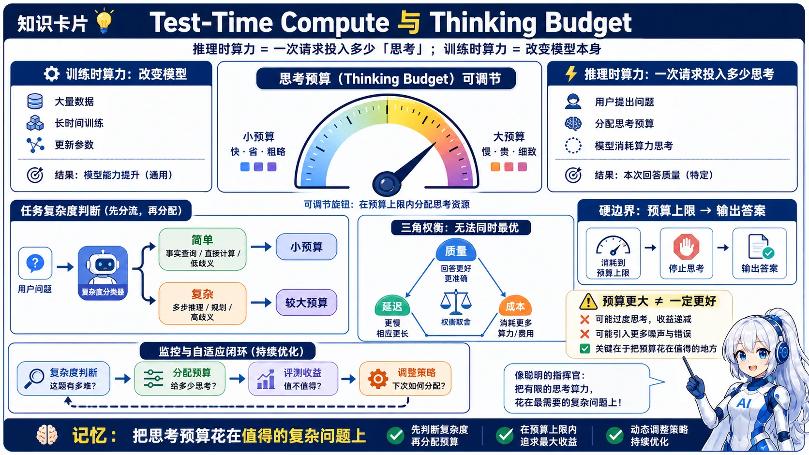</a></p>

<p align="center"><sub>🧠 图解记忆：把思考预算花在值得的复杂问题上；点击图片可查看原图。</sub></p>

<details>
<summary>💡 答案要点</summary>

**Test-Time Compute = 模型推理时消耗的算力（不是训练时）**

传统观点：模型越强越好（训练时 scaling）
2026年新观点：推理时的算力分配同样重要（测试时 scaling）

**核心概念：Thinking Token Budget（思考预算）**

```
Thinking Budget = 允许模型消耗的最大"思考 tokens"数量

预算示例：
- 1024 tokens → 简单思考（简单问题）
- 8192 tokens → 深度思考（复杂问题）
- 32768 tokens → 超深度思考（数学证明）

模型行为：
预算内：模型自由思考
预算外：强制输出答案
```

**四大厂商思考预算对比（2026年）：**

| 厂商 | 功能 | 配置方式 | 思考 token 范围 |
|------|------|----------|----------------|
| **Anthropic** | Extended Thinking | `thinking.budget_tokens` | 1024~128K |
| **OpenAI** | o3 模式 | `max_tokens`（含思考） | 自动分配 |
| **Google** | Gemini Deep Think | `thinkingBudget` | 1024~32K |
| **DeepSeek** | R1/QwQ | 内置思考机制 | 开源可控 |

**为什么重要（面试重点）：**

```python
# 生产级思考预算策略
def route_by_complexity(question: str) -> dict:
    # 简单问题：不值得思考
    if is_simple_factual(question):
        return {"model": "claude-haiku", "thinking_budget": 0}
    
    # 中等问题：适度思考
    elif is_analysis_task(question):
        return {"model": "claude-sonnet", "thinking_budget": 4096}
    
    # 复杂问题：深度思考
    elif is_complex_reasoning(question):
        return {"model": "claude-opus", "thinking_budget": 32768}
    
    # 极限问题：超深度思考
    else:
        return {"model": "gpt-5.5-o3", "thinking_budget": 128000}

# 成本控制
# 简单问题（thinking=0）：¥0.001
# 复杂问题（thinking=32K）：¥0.15
# 差距 150 倍！
```

**Inverse Scaling（反向缩放）问题：**

Anthropic 2025 年研究发现：对于**简单问题**，推理模型反而比普通模型**更差**——因为思考过程可能引入干扰。

```
简单问题：普通模型 > 推理模型（思考干扰）
复杂问题：推理模型 >> 普通模型（思考增益）
```

**最佳实践：**
1. **不要默认开最大思考预算** — 简单问题浪费 150x 成本
2. **用分类模型先判断复杂度** — 再分配预算
3. **监控思考 token 消耗** — 发现异常及时告警

**面试话术：**
> **示例表达（仅在能用本人经历或可复现实验佐证时使用）：** "Test-Time Compute 是 2026 年 AI 成本控制的核心技术。我的策略是'按需分配思考'：简单问题直接回答（¥0.001），复杂问题开启深度思考（¥0.15）。关键是用分类模型提前判断问题复杂度，避免'大炮打蚊子'。实测这套策略可以降低 70% 的 LLM 成本，同时不损失回答质量。"

</details>

---

## 15. 什么是 Logits？LLM 是如何一步步生成下一个 Token 的？

<p align="center"><a href="../../assets/illustrations/01-basic-concepts/q15-logits-next-token.webp">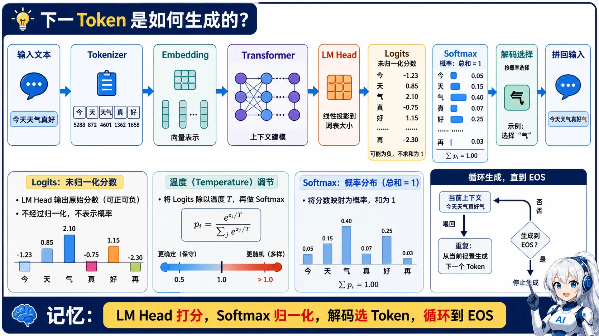</a></p>

<p align="center"><sub>🧠 图解记忆：LM Head 打分，Softmax 归一化，解码选 Token，循环到 EOS；点击图片可查看原图。</sub></p>

**Logits** = 模型输出层（LM Head）对词表中每个 Token 的打分（未归一化的原始分数），数值越大表示越可能被选中。

### 完整生成流程（面试必答）

```
输入文本 → Tokenizer分词 → Embedding → Transformer多层计算
→ 输出层LM Head得到Logits（长度=词表大小）
→ Softmax归一化成概率 → 采样策略选出下一个Token
→ 拼接到输入 → 循环直到遇到停止符
```

### 关键点

| 概念 | 说明 |
|------|------|
| **Logits** | 未归一化分数，可正可负，数值越大越优 |
| **Softmax** | 把 Logits 转成概率分布（和为1） |
| **Temperature** | 除以 Temperature 再 Softmax，控制分布尖锐度 |
| **LM Head** | 通常是 `hidden_size × vocab_size` 的线性层 |

### 面试话术

> "Logits 是模型对词表每个 Token 的原始打分，经过 Softmax 变成概率。生成时先算 Logits，再用采样策略（贪心/Top-K/Top-P）选 Token，选中的 Token 拼回输入继续预测下一个，直到遇到 EOS 停止符。"

---

## 16. 解码策略对比：贪心解码 vs Beam Search vs 采样

<p align="center"><a href="../../assets/illustrations/01-basic-concepts/q16-decoding-strategies.webp">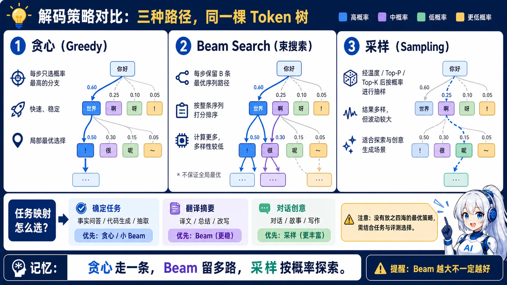</a></p>

<p align="center"><sub>🧠 图解记忆：贪心走一条，Beam 留多路，采样按概率探索；点击图片可查看原图。</sub></p>

### 三种解码策略

| 策略 | 原理 | 优点 | 缺点 | 适用场景 |
|------|------|------|------|----------|
| **贪心解码** | 每次选概率最大的 Token | 快、稳定 | 易重复、缺多样性 | 代码/问答（配合Temperature=0） |
| **Beam Search** | 每步保留 Top-N 条候选路径 | 全局较优、连贯 | 慢、易重复、缺惊喜 | 翻译、摘要、机器翻译 |
| **采样（Sampling）** | 按概率分布随机选 | 多样、自然 | 不稳定、可能跑偏 | 对话、创意写作 |

### 面试高频追问

- **Beam Size 越大越好？** 不是！越大越慢，且容易陷入重复（常见 4-8）
- **采样怎么控随机性？** Temperature（整体）、Top-K（候选数）、Top-P（累积概率）三者组合
- **为什么机器翻译用 Beam Search？** 因为要全局最优、不容许跑偏，可接受重复风险
- **为什么对话用采样？** 多样性更重要，Beam 会显得呆板

### 面试话术

> "解码策略主要分贪心、Beam Search 和采样三类。贪心最快但易重复；Beam 保留多条路径全局较优，适合翻译摘要；采样引入随机性更自然，适合对话创作。实际工程里问答和代码生成我用贪心+T=0，对话用采样+T=0.7。"

---

## 17. 为什么 Temperature=0 时输出依然不完全确定？

<p align="center"><a href="../../assets/illustrations/01-basic-concepts/q17-temperature-zero.webp">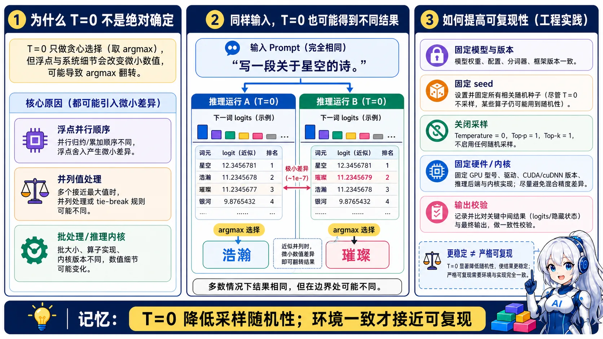</a></p>

<p align="center"><sub>🧠 图解记忆：T=0 降低采样随机性，环境一致才接近可复现；点击图片可查看原图。</sub></p>

**面试坑点：很多人以为 T=0 就是完全确定，其实不然。**

### 原因（三大层面）

1. **浮点计算非确定性**：GPU 并行计算（如 Attention、矩阵乘法）存在浮点累加顺序差异，导致细微数值抖动，可能影响 argmax 结果
2. **采样随机性（部分框架）**：某些框架 T=0 时若遇到多个 Token 概率并列，会用随机打破平局
3. **批处理/缓存影响**：KV Cache、并行推理可能引入微小差异

### 工程建议

- 追求严格确定：固定 seed + T=0 + 关闭采样随机性 + 单卡单进程推理
- 业务对一致性敏感：加输出校验/重试

### 面试话术

> "Temperature=0 能大幅降低随机性，但不保证 100% 确定，因为 GPU 浮点运算的并行累加顺序有微小差异，极端情况下会影响 argmax 结果。要做到严格可复现，需要固定 seed、关闭采样随机并保证推理环境一致。"

---

## 18. 什么是重复惩罚（repetition_penalty）？如何防止复读机？

<p align="center"><a href="../../assets/illustrations/01-basic-concepts/q18-repetition-penalty.webp">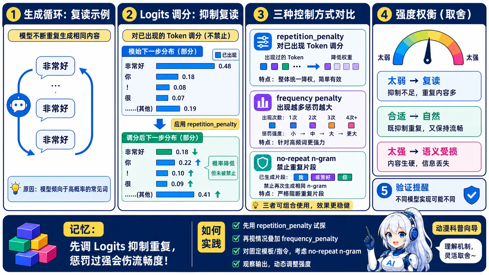</a></p>

<p align="center"><sub>🧠 图解记忆：先调 Logits 抑制重复，惩罚过强会伤流畅度；点击图片可查看原图。</sub></p>

### 定义

**重复惩罚** = 对已经出现过的 Token 的 Logits 进行惩罚，降低它再次被选中的概率，从而减少重复。

### 实现原理

```python
# 伪代码：出现过的token，logits除以惩罚系数
for token in seen_tokens:
    if logits[token] > 0:
        logits[token] /= repetition_penalty   # 比如 1.15
    else:
        logits[token] *= repetition_penalty
```

### 参数建议

| 值 | 效果 |
|----|------|
| 1.0 | 不惩罚（默认） |
| 1.05-1.2 | 轻度惩罚，抑制复读 |
| >1.3 | 强惩罚，可能影响语义流畅度 |

### 其他防重复手段

- **Frequency Penalty / Presence Penalty**（OpenAI 风格）：按出现频次/是否出现惩罚
- **No Repeat Ngram Size**：禁止 N-gram 完全重复
- **Beam 内加多样性惩罚**：多条候选路径互相抑制

### 面试话术

> "复读机是解码阶段的常见问题，我用 repetition_penalty 对已出现 Token 的 Logits 做惩罚，一般设 1.1-1.2 兼顾流畅和多样；如果再配合 no_repeat_ngram 和频率惩罚，效果更好。"

---

## 19. 什么是停止符（EOS / Stop Token）？生成是如何终止的？

<p align="center"><a href="../../assets/illustrations/01-basic-concepts/q19-generation-stop.webp"></a></p>

<p align="center"><sub>🧠 图解记忆：EOS 自然停，上限兜底，Stop 要防误截断；点击图片可查看原图。</sub></p>

### 定义

**EOS（End of Sequence）** = 词表中一个特殊的终止 Token，模型生成它即代表回答结束。

### 生成终止的四种方式

| 方式 | 说明 |
|------|------|
| **EOS Token** | 模型自己预测出 EOS，自然结束 |
| **max_tokens** | 达到长度上限强制截断（兜底） |
| **Stop Words** | 命中自定义停止词立即终止（如 \n\n、"再见"） |
| **工具调用/结构化输出** | 命中特定格式边界结束（如 JSON 闭合括号） |

### 工程注意

- max_tokens 必须设置，防止死循环/无限生成（成本失控）
- 流式输出时识别 EOS 立即断开，减少 token 消耗
- 结构化输出（JSON）场景下，停止符配置不当会截断半截 JSON

### 面试话术

> "生成终止有三层保险：模型预测出 EOS 自然结束、max_tokens 硬性截断兜底、Stop Words 按业务边界提前终止。工程上我必设 max_tokens 防成本失控，流式场景识别到 EOS 就立即断开连接。"

---

## 20. 为什么主流 LLM 都是 Decoder-only 架构？

<p align="center"><a href="../../assets/illustrations/01-basic-concepts/q20-decoder-only.webp">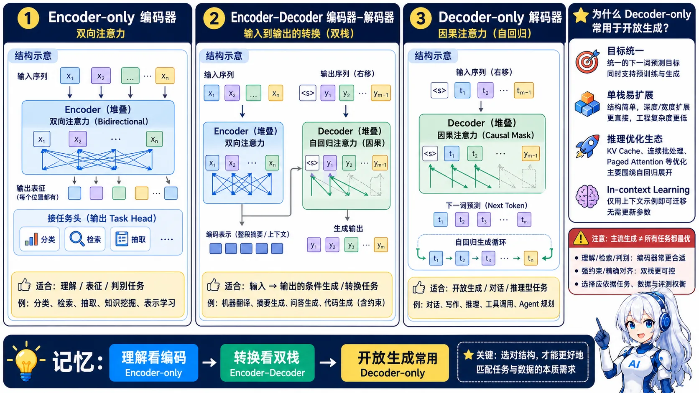</a></p>

<p align="center"><sub>🧠 图解记忆：理解看编码，转换看双栈，开放生成常用 Decoder-only；点击图片可查看原图。</sub></p>

### 三类架构对比

| 架构 | 代表模型 | 特点 | 现状 |
|------|----------|------|------|
| **Encoder-only** | BERT | 双向理解，适合分类/检索 | 被 LLM 时代边缘化 |
| **Encoder-Decoder** | T5、BART | 编码+解码，适合翻译摘要 | 部分场景仍用 |
| **Decoder-only** | GPT、LLaMA、Qwen、DeepSeek | 自回归单向生成 | **主流（ChatGPT 系）** |

### Decoder-only 胜出的原因

1. **训练目标统一**：预训练（next-token prediction）与推理（续写）一致，无需任务适配
2. **架构简单**：单一 Transformer 栈，工程优化（KV Cache、量化）更聚焦
3. **扩展性好**：decoder 在超大参数量下的 scaling law 表现更优
4. **生态成熟**：InstructGPT/RLHF 等对齐技术都是围绕 decoder-only 建立
5. **In-context Learning 强**：统一 autoregressive 目标下少样本学习能力更突出

### 面试话术

> "主流 LLM 选择 Decoder-only，核心是预训练和推理目标统一：都是预测下一个 Token。相比 BERT 需要任务头、T5 需要任务模板，Decoder-only 架构简单、扩展性好、对齐技术成熟，在 Scaling Law 下表现最优，所以 ChatGPT 系模型都走这条路。"

---

<a id="training"></a>

## 21. Embedding（嵌入向量）是什么？和 Token 有什么关系？

<p align="center"><a href="../../assets/illustrations/01-basic-concepts/q21-embedding.webp">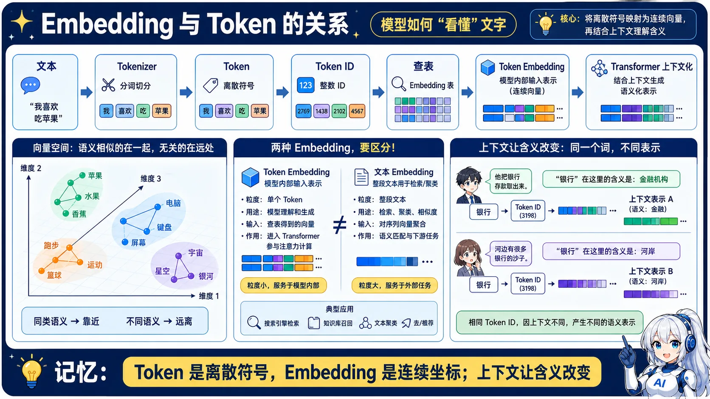</a></p>

<p align="center"><sub>🧠 图解记忆：Token 是离散符号，Embedding 是连续坐标，上下文让含义改变；点击图片可查看原图。</sub></p>

**Embedding = 把文本/Token 映射成稠密向量的技术**，是 LLM 理解语义的基石。

### 核心概念

| 概念 | 说明 |
|------|------|
| **Token** | 文本的最小切分单位（字符串层面） |
| **Token ID** | Token 在词表中的编号（离散整数） |
| **Embedding** | Token ID 对应的稠密向量（连续浮点数，如 768/1024/4096 维） |

**关系链路：**
```
"我爱AI" → Tokenize → ["我", "爱", "AI"] → 查表 → [[0.12, -0.34, ...], ...]
```

### Embedding 的核心特性

1. **语义相似 → 向量距离近**："苹果"和"水果"余弦相似度高，和"汽车"距离远
2. **两种 Embedding**
   - **静态 Embedding**（Word2Vec/GloVe）：一个词一个向量，不随上下文变化（"bank"河岸/银行都一样）
   - **上下文 Embedding**（BERT/LLM 内部）：同一个词在不同句子中向量不同（"苹果"在水果/手机语境下不同）✅ 主流
3. **维度**：决定表示能力与显存/计算成本（常见 768~8192）

### 应用场景

- **向量检索**（RAG）：文档和问题都转成向量，用余弦相似度找最相关片段
- **语义搜索**：替代关键词匹配
- **聚类/分类**：向量空间聚类

### 代码示例

```python
# OpenAI Embedding API
from openai import OpenAI
client = OpenAI()

resp = client.embeddings.create(
    model="text-embedding-3-large",  # 3072 维
    input=["苹果是一种水果", "苹果公司发布了新手机"]
)
vec1, vec2 = resp.data[0].embedding, resp.data[1].embedding

# 余弦相似度
import numpy as np
def cos_sim(a, b):
    return np.dot(a, b) / (np.linalg.norm(a) * np.linalg.norm(b))

print(cos_sim(vec1, vec2))  # 语义相关度打分
```

**面试话术：**
> "Embedding 是把 Token 映射成稠密向量的过程，语义相近的文本向量距离就近。重点要区分静态 Embedding 和上下文 Embedding——现在的 LLM 都是上下文相关的。在 RAG 里它是检索的基石：文档和问题向量化后用余弦相似度匹配，这也是我们系统召回率的基础。"

---

## 22. 什么是 In-Context Learning（上下文学习）？Zero-shot / Few-shot 有什么区别？

<p align="center"><a href="../../assets/illustrations/01-basic-concepts/q22-in-context-learning.webp">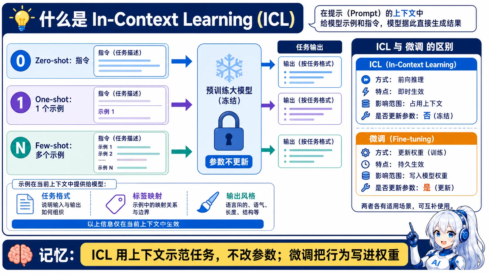</a></p>

<p align="center"><sub>🧠 图解记忆：ICL 用上下文示范任务，不改参数；微调把行为写进权重；点击图片可查看原图。</sub></p>

**In-Context Learning（ICL）= 不更新模型参数，仅通过在 Prompt 中提供示例，让模型学会完成新任务。**

### 三种形式（面试必答）

| 形式 | 示例数量 | 说明 | 适用场景 |
|------|----------|------|----------|
| **Zero-shot** | 0 个 | 直接给指令 | 简单任务 |
| **One-shot** | 1 个 | 给 1 个示例 | 格式学习 |
| **Few-shot** | 2~10 个 | 给多个示例 | 复杂/不常见任务 |

### 示例对比

```python
# Zero-shot：只给指令
prompt = "把下面的句子翻译成英文：今天天气很好"

# Few-shot：给示例再提问
prompt = """
把中文翻译成英文：
苹果 → apple
香蕉 → banana
橙子 → orange
葡萄 → ?
"""
```

### ICL vs 微调（核心区别）

| 维度 | In-Context Learning | 微调（Fine-tuning） |
|------|---------------------|---------------------|
| **是否更新参数** | ❌ 不更新 | ✅ 更新权重 |
| **成本** | 仅 Token 费 | 训练 GPU + 数据标注 |
| **生效速度** | 立即 | 小时~天 |
| **能力上限** | 受上下文窗口限制 | 可永久固化知识/风格 |
| **适用场景** | 快速验证、动态任务 | 稳定业务场景 |

### 为什么 ICL 有效？（2025-2026 主流解释）

1. **隐式梯度下降假说**：Transformer 的 Attention+MLP 组合在前向计算中隐式产生类似低秩权重更新（δW），效果上接近对模型做了一次微调
2. **Induction Head（归纳头）**：模型内部学会了"看到 A…B，再看到 A 就接 B"的模式复制机制，示例正是触发这种模式
3. **任务格式对齐**：示例让模型进入正确的"任务状态"（格式、语气、输出结构）

**面试话术：**
> "ICL 是不改参数的学习——通过 Few-shot 示例让模型掌握任务。它和微调的本质区别是：ICL 走前向计算，微调走反向传播。2025 年的研究表明 ICL 底层是 Attention+MLP 隐式形成的低秩更新，效果上等价于一次隐式微调。工程上我常用 ICL 快速验证任务可行性，验证通过后再决定要不要微调固化。"

---

## 23. LLM 是怎么训练出来的？预训练 → SFT → 对齐（RLHF/DPO）三阶段流程？

<p align="center"><a href="../../assets/illustrations/01-basic-concepts/q23-training-stages.webp">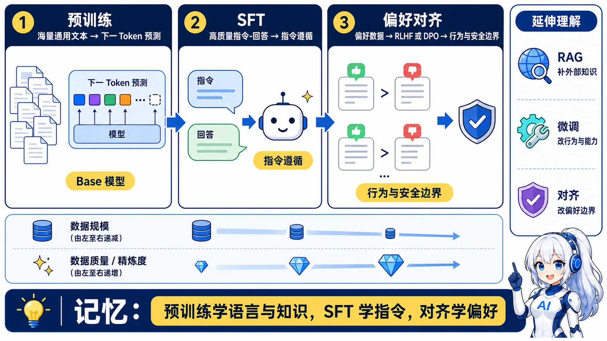</a></p>

<p align="center"><sub>🧠 图解记忆：预训练学语言与知识，SFT 学指令，对齐学偏好；点击图片可查看原图。</sub></p>

**主流 LLM 训练分三阶段：预训练（学知识）→ SFT（学对话）→ 对齐（学偏好）**

### 三阶段对比（面试重点）

| 阶段 | 数据 | 训练目标 | 产物 | 成本 |
|------|------|----------|------|------|
| **1. 预训练** | TB 级网页/书籍/代码 | 预测下一个 Token | Base 模型（博学但不会对话） | 千万美金级 |
| **2. SFT** | 几万~几十万条（指令, 标准回答） | 监督学习"按指令回答" | 对话模型（会聊天但可能不听话） | 中等 |
| **3. 对齐** | （指令, 好回答, 差回答）偏好对 | 让回答符合人类偏好（有用/诚实/无害） | 最终产品模型 | 高 |

### 各阶段详解

**阶段 1：预训练（Pre-training）**
```
输入: "今天天气真" → 预测下一个词: "好"
数据: 全网文本（数万亿 Token）
目标: 学习语言规律和世界知识
产出: Base Model（GPT-3、LLaMA base）
```

**阶段 2：SFT（Supervised Fine-Tuning）**
- 用人工撰写的"指令-回答"对教模型交互
- 模型学会：角色扮演、格式遵循、任务理解
- 产出：SFT 模型（能对话，但可能产生有害/无用内容）

**阶段 3：对齐（RLHF / DPO）**
- RLHF：先训练 Reward Model 给回答打分，再用 PPO 优化策略
- DPO：跳过奖励模型，直接在偏好对（好/坏回答）上优化（当前主流）

### 面试高频追问

- **为什么预训练后还要 SFT？** Base 模型只会续写，不会"回答问题"，SFT 教会它指令遵循
- **为什么 SFT 后还要对齐？** SFT 学的是"怎么做"，对齐学的是"什么该做、什么不该做"（安全、价值观）
- **三阶段数据量级差异？** 预训练 1T+ tokens vs SFT 10 万级 vs 偏好对 10 万级——数据量递减，质量要求递增

**面试话术：**
> "LLM 训练是'预训练→SFT→对齐'三阶段流水线：预训练在 TB 级数据上学 next-token 预测，得到博学的 Base 模型；SFT 用高质量指令对教会它对话和遵循指令；最后用 RLHF/DPO 做偏好对齐，决定模型的安全边界和价值观。三阶段数据量级递减、质量要求递增——这也是为什么对齐数据最贵。做应用开发时理解这点很重要：RAG 解决'知识不足'，微调解决'能力不足'，对齐解决'行为不合规'。"

---

## 24. 什么是 Scaling Law（规模定律）？Chinchilla 法则修正了什么？

<p align="center"><a href="../../assets/illustrations/01-basic-concepts/q24-scaling-law.webp">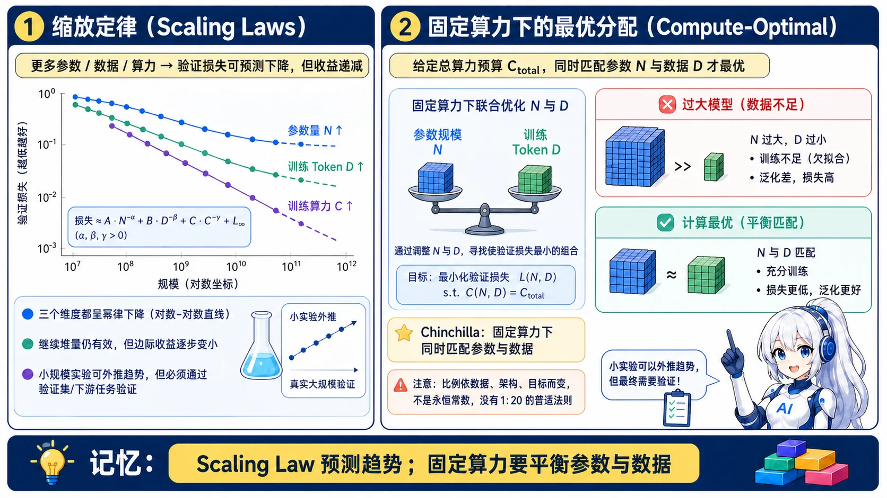</a></p>

<p align="center"><sub>🧠 图解记忆：Scaling Law 预测趋势，固定算力要平衡参数与数据；点击图片可查看原图。</sub></p>

**Scaling Law = 模型性能（Loss）与参数量、数据量、计算量之间存在可预测的幂律关系。**

### 核心公式（OpenAI 2020）

```
Loss ≈ a·N^(-α) + b·D^(-β) + c

N = 参数量    D = 训练数据量    a,b,c,α,β = 常数
```

- 参数翻倍 → Loss 稳定下降（收益递减）
- 数据翻倍 → Loss 稳定下降
- **结论：模型越大、数据越多，效果越好，且可预测**

### Chinchilla 法则（DeepMind 2022）修正了什么？

**核心结论：参数和数据要按约 1:20 的比例配比（训练 Token 数 ≈ 参数 × 20）**

| 项目 | 之前做法 | Chinchilla 修正后 |
|------|----------|-------------------|
| 参数 70B | 只喂 300B tokens（欠喂） | 应喂 1.4T tokens（1.4万亿） |
| 计算预算固定 | 盲目堆参数 | 参数和数据按比例分配 |

> 类比：堆参数量相当于"天才只读小学课本"，参数和数据要匹配才最优。

### Scaling Law 的意义（面试重点）

1. **可预测性**：用小模型实验（1B）可以推算大模型（70B）的表现，避免盲目烧钱
2. **指导训练预算分配**：固定算力下，算最优参数/数据配比
3. **能力涌现的前提**：规模是涌现能力的基础（呼应"涌现能力"题）
4. **2026 新趋势**：从"训练时 Scaling"扩展到"测试时 Scaling"（Test-Time Compute，见 Q19）——推理阶段多花算力也能换效果

**面试话术：**
> "Scaling Law 说模型效果和参数量、数据量、算力呈幂律关系，可以预测。Chinchilla 修正了'只堆参数'的误区，提出参数和数据约 1:20 配比——70B 模型要喂 1.4T tokens 才最优。工程上它的价值是可预测性：先在 1B 小模型上做实验，再推算 70B 的表现，节省大量试错成本。2026 年 Scaling 已经从训练侧延伸到推理侧，就是 Test-Time Compute。"

---

## 25. KV Cache 是什么？为什么能大幅加速 LLM 推理？（基础概念版）

<p align="center"><a href="../../assets/illustrations/01-basic-concepts/q25-kv-cache.webp"></a></p>

<p align="center"><sub>🧠 图解记忆：历史 K/V 可复用，以显存换每步解码速度；点击图片可查看原图。</sub></p>

**KV Cache = 把已经算过的历史 Token 的 K（Key）和 V（Value）缓存起来，避免重复计算。**

### 为什么要缓存？（自回归的重复计算问题）

LLM 是自回归生成：每生成一个 Token，都要让所有历史 Token 重新过一遍 Attention。

```
生成 "我爱吃苹果"：
第1步: 输入"我" → 算"我"的 Q/K/V → 预测"爱"
第2步: 输入"我爱" → 重新算"我"+"爱"的 Q/K/V → 预测"吃"  ❌ "我"的K/V白算了一遍
第3步: 输入"我爱吃" → 又重算一遍全部 Q/K/V → 预测"苹" ❌ 重复计算

不缓存: 复杂度 O(n²)，生成长度翻倍，计算量翻 4 倍
```

### KV Cache 怎么做？

```
第1步: 算"我"的 Q/K/V → 把 K、V 存进缓存 → 预测"爱"
第2步: 只算"爱"的 Q/K/V → K、V 追加到缓存 → 用"爱"的Q 和缓存的K/V做Attention → 预测"吃"
第3步: 只算"吃"的 Q/K/V → 追加缓存 → 预测"苹"

带缓存: 每步只算新 Token 的 Q/K/V，复杂度 O(n)（线性）
```

### 关键点

| 问题 | 答案 |
|------|------|
| **为什么 Q 不缓存？** | Q 是"当前查询"，每个新 Token 都要重新生成，没有复用价值 |
| **代价是什么？** | 显存！KV Cache 随序列长度线性增长 |
| **复杂度变化** | O(n²·d) → O(n·d)，长文本下提速明显 |

### KV Cache 显存估算（面试常考）

```
KV Cache 大小 = 2 × batch × seq_len × n_layers × n_heads × d_head × 字节数

例：LLaMA-7B（32层、32头、d_head=128），batch=1，seq=2048，FP16
= 2 × 1 × 2048 × 32 × 32 × 128 × 2 bytes ≈ 1.07 GB
```

（进阶：PagedAttention 分页管理、KV Cache 量化、Prefix Caching 跨请求复用 → 见推理优化/推理框架模块）

**面试话术：**
> **示例表达（仅在能用本人经历或可复现实验佐证时使用）：** "KV Cache 是 LLM 推理加速最基础的优化：自回归生成时历史 Token 的 K/V 不会变，缓存后每步只需计算新 Token 的 Q/K/V，复杂度从 O(n²) 降到 O(n)。它的代价是显存——所以长上下文场景要配合 PagedAttention 和 KV 量化。我的项目里多轮对话场景靠它把单 token 生成延迟降了一个数量级。"

---

## 26. RLHF 和 DPO 有什么区别？（入门对比版）

<p align="center"><a href="../../assets/illustrations/01-basic-concepts/q26-rlhf-vs-dpo.webp">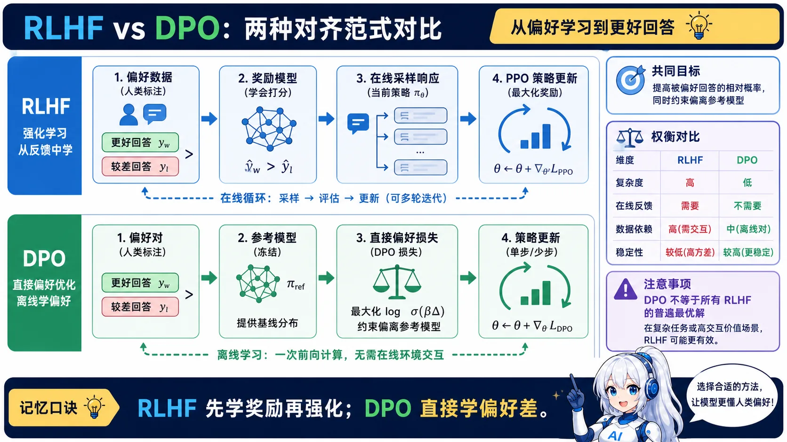</a></p>

<p align="center"><sub>🧠 图解记忆：RLHF 先学奖励再强化，DPO 直接学偏好差；点击图片可查看原图。</sub></p>

**两者都是"对齐"阶段的技术，目标相同：让模型输出符合人类偏好。区别在于实现路径。**

### 一句话版本

- **RLHF**：训练一个奖励模型打分，再用强化学习（PPO）优化策略
- **DPO**：跳过奖励模型，直接在偏好数据上优化，数学上等价于 RLHF 的最优解

### 完整对比（面试重点）

| 维度 | RLHF（PPO） | DPO |
|------|-------------|-----|
| **需要奖励模型** | ✅ 是 | ❌ 否 |
| **需要模型数量** | 4 个（策略/参考/奖励/价值） | 2 个（策略/参考） |
| **训练方式** | 在线采样 + PPO 强化学习 | 离线偏好对直接优化 |
| **实现复杂度** | 极高，训练不稳定 | 中，稳定简单 |
| **灵活性** | 高（可在线迭代、多轮采样） | 低（依赖固定偏好数据） |
| **数据要求** | 可在线生成对比 | 需高质量偏好对（垃圾进垃圾出） |
| **成本** | 高 | 低 |
| **当前趋势** | 大厂精细化场景 | ✅ 主流默认选择 |

### 简版原理

```python
# DPO 核心思想（伪代码）：让"好回答"的概率上升、"差回答"的概率下降
# loss = -log σ( β * (log π(y_good|x) - log π_ref(y_good|x))
#                - β * (log π(y_bad|x) - log π_ref(y_bad|x)) )
# 不需要奖励模型，直接拉大好/坏回答的隐式奖励差
```

### 顺带一提：GRPO（DeepSeek 提出）

- 同一 prompt 生成多个回答，组内相对比较打分
- 不需要奖励模型，也不需要严格的偏好对
- 是 RLHF 和 DPO 之间的折中，适合可验证任务（数学/代码）

### 工程选型建议

- 资源有限、数据规整 → **DPO**（大部分项目首选）
- 有标注团队、追求极致效果、需在线迭代 → **RLHF**
- 可验证任务、数据不规整 → **GRPO**

**面试话术：**
> "RLHF 和 DPO 目标一致但路径不同：RLHF 先训奖励模型再用 PPO 优化，需要维护 4 个模型、训练不稳定但灵活；DPO 直接对偏好对构造损失，数学上等价于 RLHF 的最优解，简单稳定，是当前主流。选型上：资源有限用 DPO，追求极致用 RLHF，可验证任务考虑 GRPO。我们微调项目就用 DPO 做对齐，一周就能收敛。"

---

## 27. 7B 模型需要多少显存？参数量如何换算显存？（高频估算题）

<p align="center"><a href="../../assets/illustrations/01-basic-concepts/q27-memory-estimation.webp">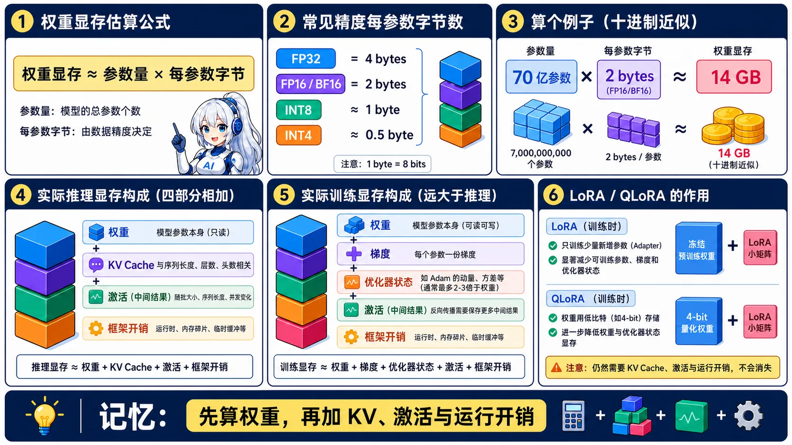</a></p>

<p align="center"><sub>🧠 图解记忆：先算权重，再加 KV、激活与运行开销；点击图片可查看原图。</sub></p>

**核心公式：显存（GB）≈ 参数量 × 每参数字节数**

### 推理显存估算（面试必答）

| 精度 | 每参数字节 | 7B 模型权重显存 |
|------|------------|-----------------|
| FP32 | 4 bytes | 28 GB |
| **FP16/BF16（主流）** | 2 bytes | **14 GB** |
| INT8 量化 | 1 byte | 7 GB |
| INT4 量化 | 0.5 byte | 3.5 GB |

```python
# 推理权重显存
params_b = 7
for name, bytes_p in [("FP32", 4), ("FP16", 2), ("INT8", 1), ("INT4", 0.5)]:
    gb = params_b * 1e9 * bytes_p / 1024**3
    print(f"{name}: {gb:.1f} GB")
# FP32: 26.1 GB / FP16: 13.0 GB / INT8: 6.5 GB / INT4: 3.3 GB（按 1e9 换算）
# 更常见的近似说法：7B × 2B ≈ 14GB（按 1024³ 精算约 13GB）
```

**注意：推理实际显存 = 权重 + KV Cache + 激活值**（KV Cache 见 Q30，长上下文时可能超过权重本身）

### 训练显存估算（难度升级）

| 组件 | 每参数字节 | 7B 全参训练 |
|------|------------|-------------|
| 权重 | 2 bytes | 14 GB |
| 梯度 | 2 bytes | 14 GB |
| Adam 优化器状态 | 12 bytes（2×动量 + 8×方差，FP32） | 84 GB |
| **合计** | **16 bytes** | **≈ 112 GB**（需 8×A100 80G） |

### 如何用少量显存训练大模型？

- **LoRA**：只训练 ~0.1% 参数（7B 只训约 830 万参数），显存需求从 112GB → ~16GB
- **QLoRA**：4-bit 量化基座 + LoRA，24GB 消费级显卡即可微调 7B
- **ZeRO / 张量并行**：多卡分摊（显存不够，卡数来凑）

**面试话术：**
> "显存估算的核心是'参数×字节数'：7B 模型 FP16 推理要 14GB，INT4 只要 3.5GB；但全参训练要 16 字节/参数，7B 就要 112GB，所以训练必须上 LoRA——只训 0.1% 的参数，24G 显卡就能微调 7B。面试官问'为什么下载的模型 14G 一跑起来显存超了'，答案就是还有 KV Cache 和激活值。"

---

## 28. 什么是 Chat Template（对话模板）？为什么用错模板效果会暴跌？

<p align="center"><a href="../../assets/illustrations/01-basic-concepts/q28-chat-template.webp">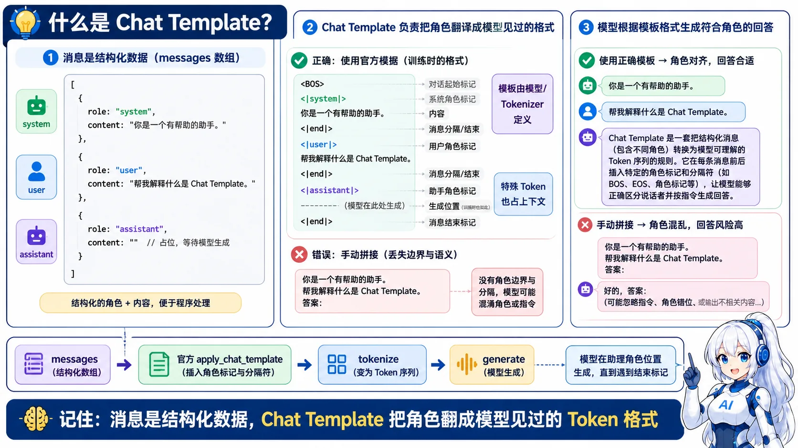</a></p>

<p align="center"><sub>🧠 图解记忆：消息是结构化数据，Chat Template 把角色翻成模型见过的 Token 格式；点击图片可查看原图。</sub></p>

**Chat Template = 把多轮消息列表转换成模型在训练时见过的格式（角色标记 + 特殊 Token）。**

### 为什么必须用模板？

模型训练时数据长这样（带角色标记）：
```
<|im_start|>system
你是一个AI助手<|im_end|>
<|im_start|>user
你好<|im_end|>
<|im_start|>assistant
你好！有什么可以帮你？<|im_end|>
```

如果直接拼接消息而不套模板：模型没见过"裸奔"的输入格式 → 角色信息丢失 → 答非所问、忘记 System Prompt。

### 不同模型模板不同（面试重点）

| 模型 | 模板特征 |
|------|----------|
| **ChatML（GPT/Qwen）** | `<|im_start|>system/user/assistant<|im_end|>` |
| **LLaMA 3** | `<|begin_of_text|><|start_header_id|>system<|end_header_id|>` |
| **Mistral / 部分模型** | `[INST] ... [/INST]` |

### 代码示例（正确姿势）

```python
from transformers import AutoTokenizer

tokenizer = AutoTokenizer.from_pretrained("Qwen/Qwen2.5-7B-Instruct")

messages = [
    {"role": "system", "content": "你是一个严谨的AI助手"},
    {"role": "user", "content": "1+1等于几？"},
]

# ✅ 用官方模板（自动处理角色标记和特殊Token）
prompt = tokenizer.apply_chat_template(messages, tokenize=False)
# '<|im_start|>system\n你是一个严谨的AI助手<|im_end|>\n<|im_start|>user\n1+1等于几？<|im_end|>\n<|im_start|>assistant\n<|im_end|>'

# ❌ 错误做法：手动字符串拼接，没有角色标记和特殊Token
prompt = f"System: 你是一个严谨的AI助手\nUser: 1+1等于几？\nAssistant:"
```

### 高频追问

- **谁负责套模板？** 推理框架（vLLM 等）一般内置，或调用方用 `apply_chat_template`
- **模板会额外消耗 Token 吗？** 会——特殊 Token 也占 token 数；长 System Prompt + 模板前缀可吃 Prompt Caching 红利
- **为什么开源模型聊天效果差？** 常见原因之一就是没套对模板（或 GenerationConfig 不对）

**面试话术：**
> "Chat Template 就是把消息列表转成模型训练时的输入格式，核心是角色标记和特殊 Token。不同模型模板不同——Qwen 用 ChatML 的 `<|im_start|>`，LLaMA 3 用 `<|start_header_id|>`——所以必须用 `apply_chat_template` 而不是手拼字符串。我在部署开源模型踩过坑：不套模板时模型忘记系统指令，套对模板后效果立竿见影。"

---

## 29. 什么是 MoE（混合专家模型）？为什么 DeepSeek V3 / Qwen3 都用它？（高频）

<p align="center"><a href="../../assets/illustrations/01-basic-concepts/q29-moe.webp">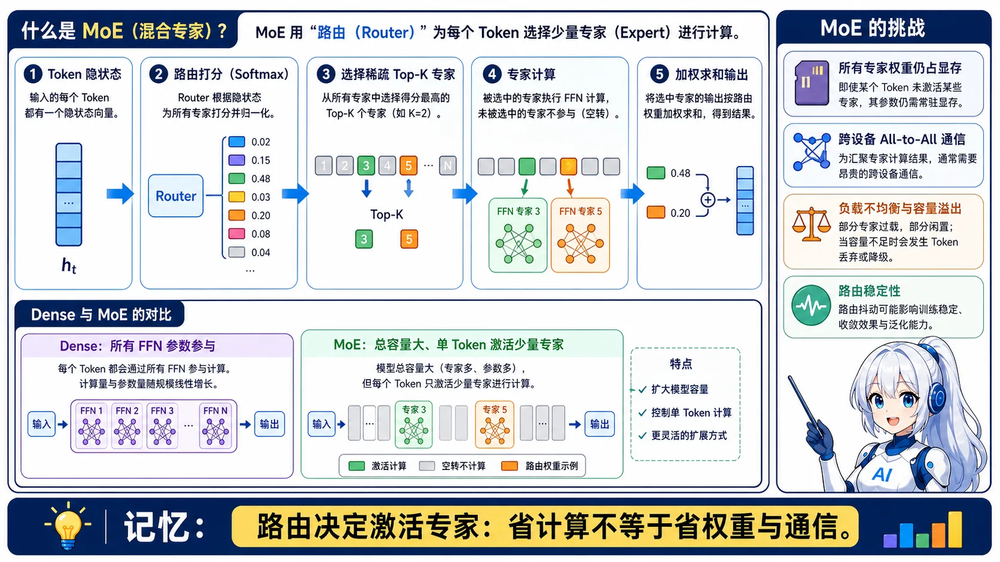</a></p>

<p align="center"><sub>🧠 图解记忆：路由决定激活专家，省计算不等于省权重与通信；点击图片可查看原图。</sub></p>

**MoE（Mixture of Experts）= 把 Transformer 中的 FFN 层替换成"多个专家 + 路由器"，每个 Token 只激活少数几个专家。**

### 核心原理（面试必答）

```
传统 Dense 模型：
输入 → FFN（所有参数都计算）→ 输出

MoE 模型：
输入 → 路由器(Gating) → 选 Top-2 专家 → 只有选中专家参与计算 → 加权求和输出
        └─ 专家1(FFN-A) 专家2(FFN-B) ... 专家8(FFN-H)
```

**三步流程：**
1. **路由器打分**：`G(x) = Softmax(W·x)`，为每个 Token 算出各专家的选择概率
2. **选 Top-K 专家**：一般 K=2（Mixtral 8x7B 激活 2/8；DeepSeek-V3 激活 8/256 个专家路由）
3. **加权融合**：选中专家的输出乘上门控概率再相加

### 关键概念

| 概念 | 说明 |
|------|------|
| **总参数量 vs 激活参数量** | DeepSeek-V3：总参数 671B，单 Token 只激活 37B——"总参大、激活少" |
| **路由器（Router/Gating）** | 一个小 FFN，决定每个 Token 走哪个专家 |
| **稀疏性** | 不是所有专家都激活，这是省算力的根源 |
| **负载均衡损失** | 辅助 Loss 惩罚"所有 Token 都挤向同一个专家"，防止个别专家过载 |

### 为什么 2026 年大模型都用 MoE？（优势）

1. **容量大、知识多**：总参数大 → 记住更多知识（效果好）
2. **计算省、推理快**：激活参数少 → 同预算下 FLOPs 低 50%+，推理成本直降
3. **扩展性好**：加专家 ≈ 加容量，不必重训整个模型（如 Qwen3-MoE 从 30B 扩到 235B 总参）

### 挑战与坑（面试加分点）

- **显存占用高**：所有专家权重都要加载进显存（DeepSeek-V3 671B 需多机）
- **通信开销**：专家并行时 Token 要跨卡转发（All-to-All），专家数越多通信越重
- **负载不均衡**：热门专家被反复选中，需要 Auxiliary Loss 平衡
- **微调更脆弱**：MoE 微调容易过拟合路由偏好，LoRA 微调需同时冻结/约束路由

**面试话术：**
> "MoE 的核心是'总参数大、激活参数少'——用路由器给每个 Token 挑 Top-2 专家，其余专家不计算。DeepSeek-V3 总参 671B 但单 Token 只激活 37B，效果接近稠密大模型、成本只有几分之一。但代价是显存和通信：专家全量驻留显存、跨卡通信是瓶颈，所以训练部署都比稠密模型更依赖集群设计。"

---

<a id="application-engineering"></a>

## 30. 为什么说 LLM API 是无状态的？多轮对话的"记忆"到底存在哪？（应用开发第一性原理）

<p align="center"><a href="../../assets/illustrations/01-basic-concepts/q30-stateless-api.webp">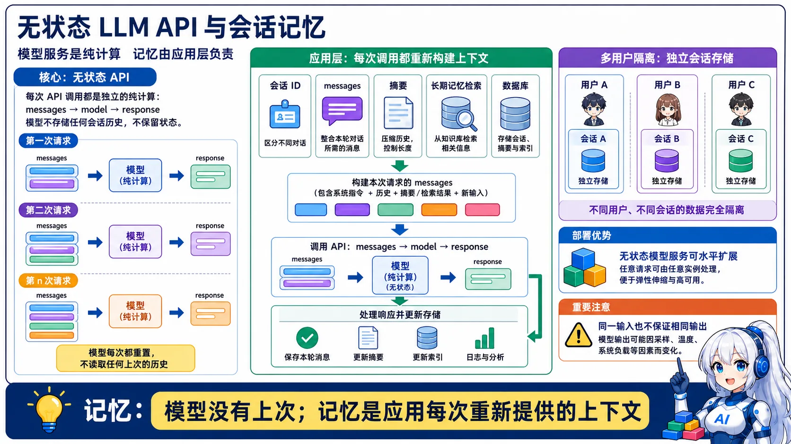</a></p>

<p align="center"><sub>🧠 图解记忆：模型没有上次，记忆是应用每次重新提供的上下文；点击图片可查看原图。</sub></p>

**模型推理本身不会凭空记住上一轮；当前输出只能依赖本次实际提供或由平台关联进来的上下文。**

### 核心认知

```
基础模型推理 ≈ f(本次上下文、采样参数、运行环境) → 输出

你上次说了什么？ → 模型不知道（它没有"上次"）
"记忆"的本质 → 应用或平台保存状态，并在下一次推理时重新提供相关上下文
```

**为什么常说无状态？** 模型参数不会因为一次普通请求自动更新。即使某些 API 提供 Conversation、Thread 或会话 ID，状态也是平台编排层保存并在后续调用中关联，不是模型获得了永久记忆。

### 对工程的影响（面试重点）

| 需求 | 谁负责 | 怎么做 |
|------|--------|--------|
| 多轮记忆 | 应用层或平台会话层 | 传递历史消息，或使用平台提供的会话状态对象 |
| 记忆裁剪 | 应用层 | 超出上下文就截断/摘要/检索（见 Q16） |
| 用户隔离 | 应用层 | 会话、租户、权限和存储键必须显式隔离，不能假设天然不会串号 |
| 持久化 | 应用层 | 会话结束存数据库，下次重建 messages |

### 无状态带来的"福利"（回答加分）

- **便于水平扩展**：计算节点可以保持无状态，会话状态放到数据库或平台会话层
- **状态可治理**：历史、摘要和长期记忆可以独立做权限、保留期限和删除
- **但不天然幂等**：采样、并行计算和工具副作用都可能导致重试结果不同；涉及写操作时必须使用幂等键、去重和事务保护

**面试话术：**
> "模型不会自动记住上一轮。多轮体验来自应用或平台保存历史，并在下一次推理时重新提供相关上下文。计算层可以无状态扩展，但会话隔离、持久化、重试幂等和工具副作用仍必须由系统显式治理。"

---

## 31. 什么是 Prompt Caching（提示词缓存）？怎样评估它能否真正降本？（API 层高频）

<p align="center"><a href="../../assets/illustrations/01-basic-concepts/q31-prompt-caching.webp">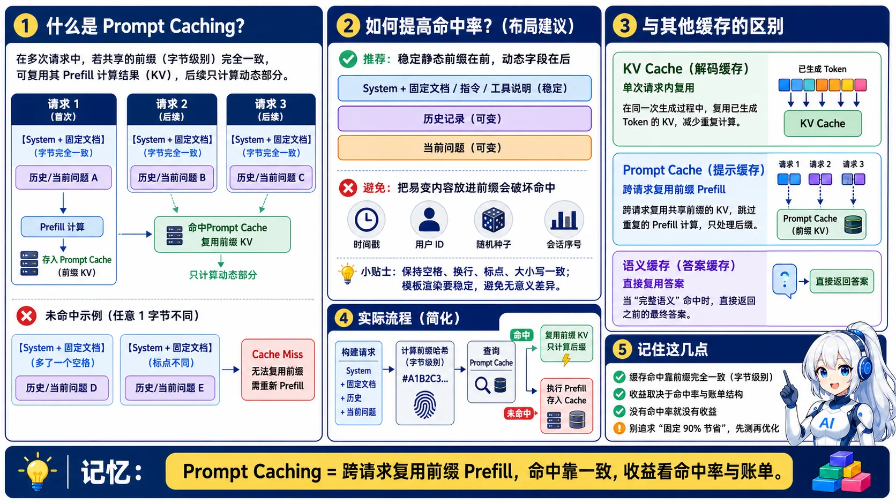</a></p>

<p align="center"><sub>🧠 图解记忆：缓存命中靠前缀完全一致，收益要看命中率与账单；点击图片可查看原图。</sub></p>

**Prompt Caching = API 层复用相同"前缀"的 KV Cache，跳过重复的 Prefill 计算。**

### 原理（一句话）

同一个前缀（System Prompt + 固定文档）第一次计算后，K/V 缓存保留一段时间；后续请求只要前缀逐字节相同，直接复用缓存，只计算新增部分。

```
请求1: [System Prompt] [文档A] [问题1]  → 全量计算, 写入缓存
请求2: [System Prompt] [文档A] [问题2]  → 前缀命中缓存, 只算[问题2] ✅
请求3: [System Prompt] [文档B] [问题3]  → 前缀变了, 缓存失效, 全量重算 ❌
```

### 与 KV Cache 的区别（高频追问）

| 维度 | KV Cache | Prompt Caching |
|------|----------|----------------|
| 范围 | 单次请求内 | 跨请求共享 |
| 解决 | 自回归重复计算（O(n²)→O(n)） | 重复前缀的 Prefill 浪费 |
| 收益 | 加速生成 | 降本 + 降首 token 延迟（TTFT） |

### 收益与成本

- 缓存计价、最小前缀长度、保留时间和命中规则因供应商与模型而异，不能把某一家某一档折扣当成通用结论
- 实际收益取决于可缓存前缀占比、命中率、缓存写入成本、请求分布和 TTFT 变化，应从账单 usage 字段与线上指标核算
- 配合"语义缓存"（相同问题直接返回历史答案，完全不调 API）可再省一层

### 最佳实践（面试必答）

1. **静态内容在前，动态内容在后**：`[System Prompt] → [检索文档] → [对话历史] → [当前问题]`（缓存键是精确字节序列，一个字符变了就全失效）
2. **System Prompt 里别注入易变内容**：时间戳、用户名、请求 ID 会让每次请求缓存全废
3. **显式标记缓存点**：Anthropic 用 `cache_control: {"type": "ephemeral"}`；OpenAI 自动前缀缓存；DeepSeek 上下文硬盘缓存自动生效
4. **RAG 场景把固定文档块放 System 位置**，多轮追问不重算

（引擎层实现：vLLM APCache / SGLang RadixAttention → 见 08-推理优化、19-推理框架）

**面试话术：**
> "Prompt Caching 复用重复前缀的计算。工程上要把稳定内容放前、动态字段放后，并通过缓存命中 token、TTFT 和实际账单验证收益；折扣比例和命中条件是供应商配置，不应背成固定数字。"

---

## 32. 大模型量化是什么？INT8 / INT4 / AWQ / GPTQ 怎么选？（基础概念版）

<p align="center"><a href="../../assets/illustrations/01-basic-concepts/q32-quantization.webp">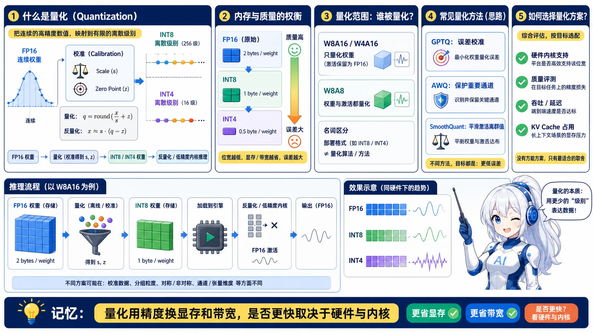</a></p>

<p align="center"><sub>🧠 图解记忆：量化用精度换显存和带宽，是否更快取决于硬件与内核；点击图片可查看原图。</sub></p>

**量化 = 用更低精度的数值（INT8/INT4）表示模型权重/激活，减少显存占用并加速推理。**

### 一句话原理

```
FP16: 每个权重 2 字节 → 7B 模型 ≈ 14GB
INT8: 每个权重 1 字节 → 7B 模型 ≈ 7GB  （显存减半）
INT4: 每个权重 0.5 字节 → 7B 模型 ≈ 3.5GB（再减半）
```

量化不是简单截断：用 Scale + Zero Point 做线性映射，把 FP16 分布压到 INT 范围，尽量保留原分布。

### 为什么量化能加速？

1. **显存占用降** → 能塞进更小的卡 / 更大 batch
2. **显存带宽需求降** → 权重搬运更快（推理常受带宽瓶颈限制）
3. **部分硬件原生 INT8/INT4 算得快** → 计算也加速

### 常见方案对比（面试选型）

| 方案 | 原理 | 特点 | 适用 |
|------|------|------|------|
| **GPTQ** | 训练后量化，按 Hessian 信息逐层校准 | 经典成熟，GPU 友好 | vLLM 等 GPU 推理（首选之一） |
| **AWQ** | 激活感知：保护对输出影响大的"重要通道" | 精度损失更小（实测 <1%） | 生产环境推荐（vLLM 支持好） |
| **GGUF** | llama.cpp 的量化格式（Q4_K_M 等） | CPU/边缘设备友好 | 本地部署、CPU 推理 |
| **SmoothQuant** | 平滑激活离群值，W8A8 全量化 | 权重+激活都量化 | 追求极致吞吐、需要 W8A8 |

### 精度权衡（面试话术要点）

- **只量化权重（W8A16 / W4A16）**：损失小，是主流做法
- **权重+激活都量化（W8A8）**：吞吐更高，损失稍大，需校准数据
- INT4 时 7B 模型 4GB 显存可跑，但长上下文时 KV Cache 仍是显存大头

（框架级量化支持对比 → 见 19-推理框架）

**面试话术：**
> "量化就是给权重'降精度换显存'：INT8 减半、INT4 再减半。选型看部署环境：GPU 生产环境我优先 AWQ（激活感知，精度损失<1%），离线批量用 GPTQ，CPU/本地用 GGUF。核心原则是只量化权重不碰激活（W4A16），需要极致吞吐再上 W8A8 配合 SmoothQuant。7B 模型 INT4 后 4GB 显存就能跑，但别忽略 KV Cache 的占用。"

---

## 33. 为什么 LLM 数学能力差？怎么缓解？（高频追问）

<p align="center"><a href="../../assets/illustrations/01-basic-concepts/q33-math-reliability.webp">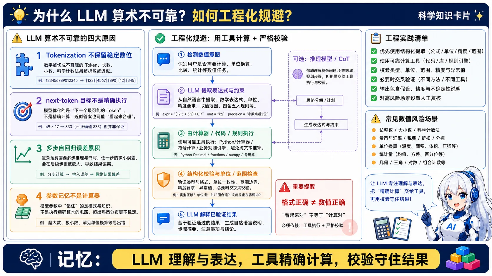</a></p>

<p align="center"><sub>🧠 图解记忆：LLM 理解与表达，工具精确计算，校验守住结果；点击图片可查看原图。</sub></p>

**LLM 数学差是结构性问题，不是"再训大一点"就能完全解决的。**

### 四大原因（面试必答）

| 原因 | 说明 |
|------|------|
| **1. Tokenization 不一致** | 数字被切碎且不稳定：`1234 → ["12","34"]`，`1235 → ["123","5"]`——模型看不到稳定的"数位"结构，难以学算术规律 |
| **2. 自回归误差累积** | 多步计算中间错一步，后面全错（一步错步步错） |
| **3. 训练目标不匹配** | next-token 预测学的是"文本的统计分布"，而数学要的是"精确符号计算"——两者目标不同 |
| **4. 缺外部工具** | 模型没有"计算器"，大数乘法/高精度运算靠"神经记忆"硬扛 |

### 缓解方案（工程视角）

| 方案 | 做法 | 效果 |
|------|------|------|
| **CoT 分步计算** | 让模型一步步推导（配合验证） | 显著提升，但仍可能中间出错 |
| **代码解释器 / 工具调用** | 让模型写 Python 执行计算（Calculator/Tool Use） | 大数计算 100% 正确 ⭐ |
| **约束解码** | 数字场景用结构化输出 + 格式校验 | 防格式错，不防算错 |
| **自洽性（Self-Consistency）** | 多次采样投票取众数 | 提升稳定性 |
| **专用数学模型** | 数学题切给推理模型（o3/DeepSeek-R1） | 效果最好，成本高 |

### 面试加分点

- 工程上"别让 LLM 硬算"：金额、账目、精确计算一律走代码/规则引擎，LLM 只做意图理解和自然语言生成
- 模型路由：检测到数学类任务自动切推理模型或工具模式

**面试话术：**
> "LLM 数学差有三个根源：数字被 tokenizer 切碎导致学不到数位规律、自回归一步错步步错、训练目标本身就不是精确计算。工程解法是'别让它硬算'——精确计算一律用代码解释器或工具，LLM 只负责理解意图和表达结果；简单算术可以让它 CoT 分步算，复杂数学直接路由给推理模型。我在财务问答系统里就是这么做的，金额计算 0 错误。"

---


## 34. Transformer 中的 Attention 机制是什么？为什么它是 LLM 的核心？（必考）

<p align="center"><a href="../../assets/illustrations/01-basic-concepts/q34-attention.webp">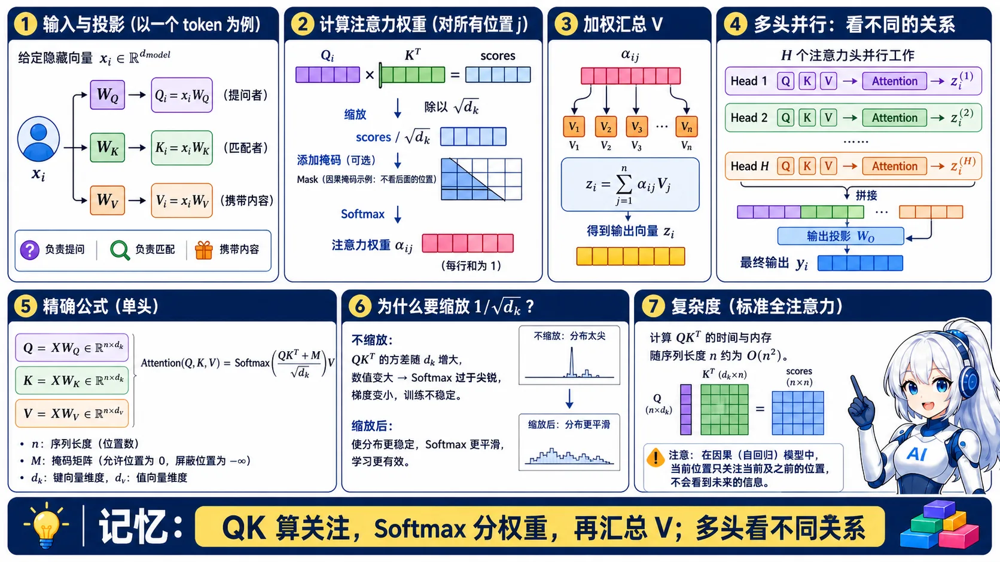</a></p>

<p align="center"><sub>🧠 图解记忆：QK 算关注，Softmax 分权重，再汇总 V，多头看不同关系；点击图片可查看原图。</sub></p>

**Attention = 让模型在处理每个 Token 时，动态关注输入中所有其他 Token 的相关程度。**

### Self-Attention 核心公式（面试手撕级）

```
Attention(Q, K, V) = softmax(Q · K^T / √d_k) · V
```

- **Q（Query）**：当前要处理的 Token 在"查询什么信息"
- **K（Key）**：序列中每个 Token 的"被查询内容"
- **V（Value）**：匹配后实际取到的"价值信息"
- **√d_k**：缩放因子，防止点积过大导致 Softmax 梯度消失

### 直观理解

```
句子: "苹果发布了新款手机，它的销量很好"
                    ↑
处理"它"时:
  - 与"苹果"的注意力权重高 → "它"指"苹果"
  - 与"销量"的注意力权重中等 → 上下文关联
  - 与"新款"的注意力权重较低
```

### Multi-Head Attention 为什么更好？

| 维度 | Single-Head Attention | Multi-Head Attention |
|------|----------------------|---------------------|
| **原理** | 一组 Q/K/V 全局关注 | 多组 Q/K/V 并行，各自关注不同方面 |
| **捕捉能力** | 只能学到一种依赖模式 | 语法、语义、长距离依赖等可同时捕捉 |
| **计算复杂度** | O(n²·d) | O(n²·d·h)，但可并行 |

```python
# PyTorch 伪代码
num_heads = 8
head_dim = d_model // num_heads

# 线性变换得到 Q,K,V
Q = linear_Q(x)  # [batch, seq_len, d_model]
K = linear_K(x)
V = linear_V(x)

# 分割成多头
Q = Q.view(batch, seq_len, num_heads, head_dim).transpose(1, 2)  # [batch, heads, seq, dim]
K = K.view(batch, seq_len, num_heads, head_dim).transpose(1, 2)
V = V.view(batch, seq_len, num_heads, head_dim).transpose(1, 2)

# 对每个头做 Scaled Dot-Product Attention
attn_output = scaled_dot_product_attention(Q, K, V, mask)

# 拼接所有头的输出
attn_output = attn_output.transpose(1, 2).contiguous().view(batch, seq_len, d_model)
output = linear_out(attn_output)  # 最终投影
```

### 面试高频追问

- **为什么要缩放 √d_k？** 当 d_k 较大时，点积值分布方差变大，Softmax 会趋于 one-hot（梯度消失）。除以 √d_k 让方差保持在 ~1。
- **Single-Head 和 Multi-Head 哪个强？** Multi-Head 几乎总是更强——相当于让模型"多角度观察同一件事"。除非极端资源受限场景。
- **Attention 时间复杂度？** O(n² · d)。n 是序列长度，d 是隐藏维。这也是为什么需要 Flash Attention（见进阶题）。

**面试话术：**
> "Attention 的核心思想是'让每个词都能看到并关注其他所有词'。公式上就是 Q·K^T 算相似度，Softmax 归一化，再加权求和 V。Multi-Head 相当于多个专家各看一个角度，最后拼接起来。它是 Transformer 取代 RNN 的关键——RNN 只能串行序列化地看前面，Attention 可以一次性全局关注，既快又准。"

---

## 35. 为什么 Transformer 需要 Position Encoding？RoPE 和绝对位置编码有什么区别？（高频）

<p align="center"><a href="../../assets/illustrations/01-basic-concepts/q35-rope.webp">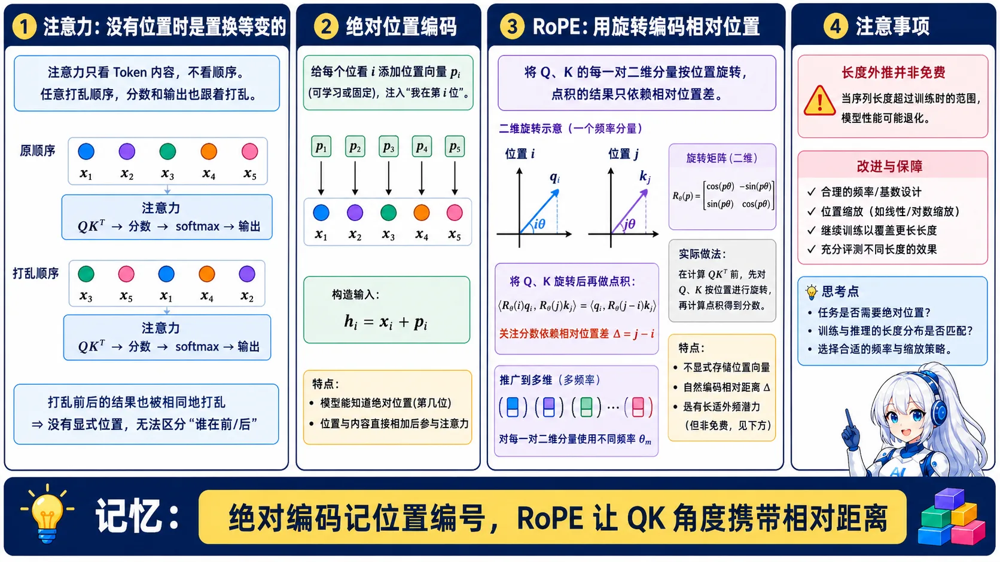</a></p>

<p align="center"><sub>🧠 图解记忆：绝对编码记位置编号，RoPE 让 QK 角度携带相对距离；点击图片可查看原图。</sub></p>

**Position Encoding = 给每个位置的 Token 加上位置信息，因为 Attention 本身不具备感知顺序的能力。**

### 为什么需要位置编码？

```
Transformer 的 Self-Attention 是对称操作:
  Attention(Q, K, V) 只看 token 之间的相似性，不看它们的先后顺序

"猫追狗" 和 "狗追猫" 用 Self-Attention 处理得到的向量几乎一样！
→ 所以需要额外注入位置信息来区分顺序
```

### 三种主流位置编码对比

| 编码方式 | 代表模型 | 原理 | 优点 | 缺点 |
|---------|---------|------|------|------|
| **绝对位置编码** | BERT, GPT-2 | 训练时学一个位置查找表 | 实现简单 | 无法外推到训练时长度的新位置 |
| **RoPE** | LLaMA, Qwen, DeepSeek | 通过旋转矩阵嵌入位置信息 | 天然支持外推、数学优雅 | 实现稍复杂 |
| **ALiBi** | T5, Bloom | 在 Attention 分数上加线性偏置 | 推理时无需知道最大长度 | 效果略逊于 RoPE |

### RoPE（Rotary Position Embedding）详解（面试重点）

```
核心思想：把两个向量的点积转化为角度差函数
  q·k = |q||k|cos(θ_q - θ_k + φ_pos)
```

**具体做法（2D 平面旋转）：**
```
给定位置 pos 和维度索引 m，频率 ω_m = 10000^(-2m/d):

[ q₀ ]  ← cos(pos·ω_m)  -sin(pos·ω_m) ][ q₀ ]
[ q₁ ]    sin(pos·ω_m)   cos(pos·ω_m) ][ q₁ ]

即：q 和 k 分别旋转到自己的位置角度，然后点积自动包含位置差信息
```

**RoPE 的三个关键优势：**
1. **绝对位置→相对位置转化**：`q(pos_i)·k(pos_j)` 只依赖于 `pos_j - pos_i`（相对位置），更符合语言规律
2. **长度外推能力强**：理论上可以推理到比训练更长序列（虽然实践中有退化）
3. **不需要重新训练**：已有的预训练模型只需加 RoPE 即可支持更长上下文

### 面试加分点

- **YaRN（Yet another RoPE extension）**：2025-2026 年的改进方案，通过在 RoPE 基础上加入缩放因子，让模型能处理比训练长数倍的上下文（如训练 8K、推理 128K）
- **工程建议**：部署开源模型时如果要做长上下文推理，优先选 RoPE 系列模型（LLaMA/Qwen/DeepSeek）

**面试话术：**
> "Self-Attention 本质是对称操作，无法区分'猫追狗'和'狗追猫'的顺序差异，所以必须加位置编码。RoPE 是目前最主流的方案——它通过旋转矩阵把位置信息嵌入到 Q/K 向量中，好处是点积自动变成相对位置依赖，还支持长度外推。现在主流的 LLaMA、Qwen、DeepSeek 都用 RoPE。如果需要比训练更长的上下文，可以用 YaRN 这类扩展方法。"

---

## 36. LLM 预训练用什么损失函数？Cross-Entropy Loss 和 Perplexity 有什么关系？（常见追问）

<p align="center"><a href="../../assets/illustrations/01-basic-concepts/q36-cross-entropy-ppl.webp">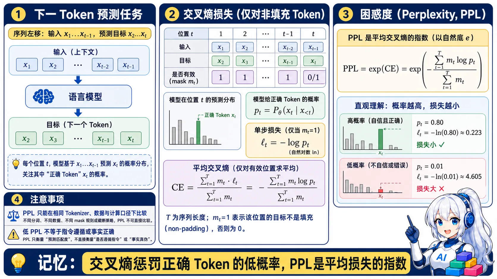</a></p>

<p align="center"><sub>🧠 图解记忆：交叉熵惩罚正确 Token 的低概率，PPL 是平均损失的指数；点击图片可查看原图。</sub></p>

**LLM 预训练使用 Cross-Entropy Loss（交叉熵损失），也叫 Next-Token Prediction Loss。**

### 为什么用 Cross-Entropy？

```
预测目标：P(y_t | x_1, ..., y_{t-1})
即：给定上文，预测下一个真实 Token 的概率

Cross-Entropy Loss = -log(P(正确Token))

损失越小 → 模型对正确 Token 的概率越高 → 预测越准确
```

### 公式推导

```
假设词表大小 V = 50,000
模型输出 logits: [0.5, 2.3, -1.1, ..., 0.8]  （每个词一个分数）

经过 Softmax 变概率: [0.003, 0.72, 0.001, ..., 0.005]

如果正确答案是第 2 个 Token:
  Loss = -log(0.72) ≈ 0.33

如果模型错得很离谱，正确答案只有 0.01 的概率:
  Loss = -log(0.01) ≈ 4.6  （大得多！）
```

### Cross-Entropy Loss vs Perplexity

| 指标 | 定义 | 含义 | 关系 |
|------|------|------|------|
| **Cross-Entropy Loss** | -log(P(正确Token)) | 越低越好（最小为 0） | 基础指标 |
| **Perplexity** | exp(Cross-Entropy Loss) | 表示模型每次猜测时有多少候选词（越低越好） | PPL = e^Loss |

**通俗解释 Perplexity：**
```
Perplexity = 2^2 = 4 意味着：平均而言，模型每次预测时有 4 个候选词"同样可能"
PPL=4 说明预测比较有信心（猜对了其中一个）

Perplexity = 2^10 = 1024 意味着：平均有 1024 个候选词
PPL=1024 说明模型完全不确定

LLM 典型范围：GPT-3 base perplexity ~20，GPT-4o < 5
```

### 工程视角：监控训练的关键信号

| 现象 | 原因 | 对策 |
|------|------|------|
| Loss 持续下降 | 正常学习过程 | ✅ 继续训练 |
| Loss 降到一定值不再降 | 接近数据噪声下限 | ⚠️ 检查是否欠拟合或数据质量差 |
| Loss 突然上升 | Learning rate 过大、梯度爆炸 | ❌ 降低 lr、加梯度裁剪 |
| Train Loss 低但 Val Loss 高 | **过拟合** | 加 Dropout、增大数据、早停 |

**面试话术：**
> "LLM 预训练用的是标准交叉熵损失：负对数似然。本质上就是在测'模型对正确 Token 给了多高的概率'。Perplexity 是交叉熵的指数形式，可以理解为'模型每次做选择时有多少个同样可能的选项'——PPL 越低越确定。训练中我主要看两条曲线：Train Loss 和 Validation Loss，如果后者开始回升那就是过拟合了。"

---

## 37. LayerNorm 和 RMSNorm 有什么区别？为什么现在的 LLM 大多用 RMSNorm？（高频）

<p align="center"><a href="../../assets/illustrations/01-basic-concepts/q37-layernorm-rmsnorm.webp">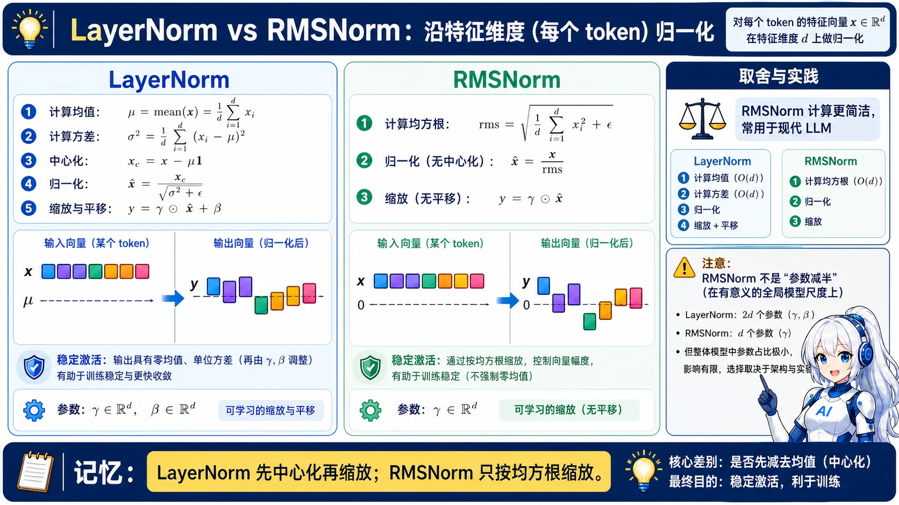</a></p>

<p align="center"><sub>🧠 图解记忆：LayerNorm 先中心化再缩放，RMSNorm 只按均方根缩放；点击图片可查看原图。</sub></p>

**LayerNorm = 对每个样本的每个位置，沿特征维度做标准化；RMSNorm 是其简化版，去掉了均值中心化，只保留归一化。**

### 两者的计算公式对比

```
LayerNorm(x):
  μ = mean(x, dim=-1)          # 计算均值
  σ² = var(x, dim=-1)          # 计算方差
  x̂ = (x - μ) / √(σ² + ε)     # 标准化
  output = γ * x̂ + β           # 可学习的缩放+平移

RMSNorm(x):
  r = RMS(x) = √(mean(x²) + ε) # 均方根（不含均值中心）
  x̂ = x / r                    # 归一化
  output = γ * x̂               # 只有缩放（没有β偏置）
```

### 关键区别

| 维度 | LayerNorm | RMSNorm |
|------|-----------|--------|
| **均值中心化** | ✅ 减去均值 | ❌ 不减 |
| **参数数量** | 2个/层（γ + β） | 1个/层（仅 γ） |
| **计算量** | 稍大（多一次均值计算） | 更小 |
| **效果** | 几乎相同 | 基本等价甚至略好 |
| **使用现状** | GPT-2, BERT | LLaMA, Qwen, DeepSeek, Claude |

### 为什么 RMSNorm 更流行？

1. **计算更快**：省掉均值计算，推理时 Faster
2. **参数更少**：少一半参数（没有 β），减少过拟合风险
3. **数值稳定性足够**：对大多数架构，去均值带来的收益极小
4. **实验验证**：LLaMA 论文实证发现两者效果几乎一致，RMSNorm 略胜

```python
# RMSNorm 简洁实现
import torch.nn as nn

class RMSNorm(nn.Module):
    def __init__(self, dim, eps=1e-6):
        super().__init__()
        self.eps = eps
        self.weight = nn.Parameter(torch.ones(dim))

    def forward(self, x):
        # x: [batch, seq, hidden]
        rms = torch.rsqrt(torch.mean(x ** 2, dim=-1, keepdim=True) + self.eps)
        return self.weight * x * rms  # γ * (x / RMS(x))
```

### 面试加分点

- 有些模型采用 **混合方案**：Attention 层用 RMSNorm，FFN 层用 LayerNorm（如部分 Qwen 变体）
- **SwiGLU 激活函数**常与 RMSNorm 一起出现，组成现代 Transformer Block 的标准配置：`x -> RMSNorm -> SwiGLU(FFN) -> Residual`

**面试话术：**
> "LayerNorm 和 RMSNorm 的核心区别是：LayerNorm 做了均值中心化+方差归一化，RMSNorm 只做 RMS 归一化。实践证明两者效果几乎一样，但 RMSNorm 少算了一步均值、少一半参数，所以现在的主流模型（LLaMA/Qwen/DeepSeek）都切到了 RMSNorm。我在本地跑 llama.cpp 的时候也能感受到微妙的速度提升。"

---

## 38. Decoder-only 模型中的因果掩码（Causal Mask）是怎么工作的？为什么必须有它？（高频）

<p align="center"><a href="../../assets/illustrations/01-basic-concepts/q38-causal-mask.webp">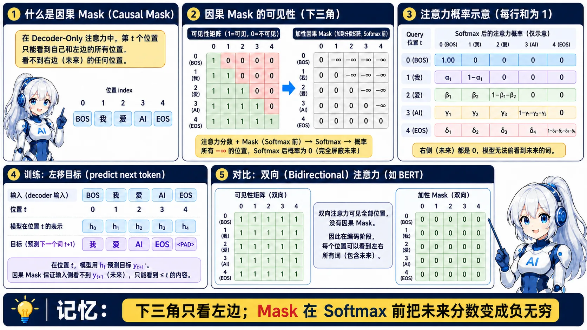</a></p>

<p align="center"><sub>🧠 图解记忆：下三角只看左边，Mask 在 Softmax 前把未来分数变成负无穷；点击图片可查看原图。</sub></p>

**Causal Mask = 在 Self-Attention 中屏蔽未来的 Token，确保模型只能看到当前位置及之前的词。**

### 为什么需要因果掩码？

```
自回归生成的要求：预测第 t 个 Token 时，只能用前 t-1 个 Token 的信息

如果不加掩码：
  预测 Token[3] 时，Attention 能看到 Token[0],1,2,3,4,5... → 作弊了！

加上因果掩码后：
  预测 Token[3] 时，只能看到 Token[0],1,2 → 严格左到右生成 ✅
```

### 掩码矩阵示例

```
序列: [BOS, 我, 爱, AI, EOS]
      ↓
Attention 掩码矩阵（下三角矩阵）:

          我    爱    AI
BOS       1     0     0     0   ← BOS 只能看到自己
我         1     1     0     0   ← 我能看到 BOS + 我
爱         1     1     1     0   ← 我爱能看到 BOS + 我 + 爱
AI         1     1     1     1   ← AI 能看到前面所有
EOS        0     0     0     0   ← EOS 不参与预测
```

### 实现细节

```python
import math
import torch

def causal_mask(seq_len):
    mask = torch.triu(torch.ones(seq_len, seq_len), diagonal=1)
    mask = mask.masked_fill(mask.bool(), float('-inf'))  # 未来位置设为负无穷
    return mask  # Softmax 后这些位置的概率 → 0

def forward_with_causal_mask(q, k, v, causal_mask_mat):
    scores = torch.matmul(q, k.transpose(-2, -1)) / math.sqrt(d_k)
    scores = scores + causal_mask_mat  # 未来位置变为 -inf
    weights = torch.softmax(scores, dim=-1)
    output = torch.matmul(weights, v)
    return output
```

### 因果掩码 vs 双向掩码

| 类型 | 能否看未来 | 代表模型 | 适用任务 |
|------|-----------|---------|---------|
| **Causal Mask**（单向） | ❌ 不能 | GPT 系列, LLaMA, Qwen | 文本生成（自回归） |
| **Bidirectional Mask** | ✅ 能 | BERT | 文本理解（分类、抽取） |
| **MLM Mask**（随机掩码） | 部分 | BERT/T5 | 填充任务 |

### 面试高频追问

- **Flash Attention 如何处理因果掩码？** Flash Attention 在分块（block-wise）计算时，对于包含未来 Token 的 block 直接设负无穷，保证精确因果约束且 IO 最优
- **Decoder-only 一定是因果的吗？** 是的——这是它与 Encoder-only（双向注意力）的根本区别

**面试话术：**
> "因果掩码是自回归生成的核心保障：预测每个 Token 时只能看到前面的词，看不到后面的。实现上是给未来位置加一个负无穷的大数，Softmax 后那些位置的概率就是 0。这是 Decoder-only 模型的标志性设计，也是为什么 GPT 能一行行续写文本而不会提前看到自己要输出的内容。"

---

## 39. 预训练数据去重（Deduplication）有什么重要性？MinHash 和 SimHash 怎么做的？（进阶高频）

<p align="center"><a href="../../assets/illustrations/01-basic-concepts/q39-deduplication.webp">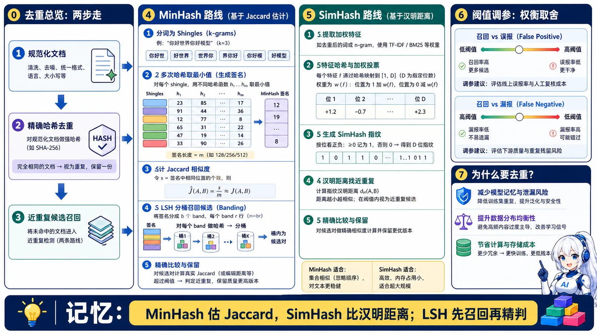</a></p>

<p align="center"><sub>🧠 图解记忆：MinHash 估 Jaccard，SimHash 比汉明距离，LSH 先召回再精判；点击图片可查看原图。</sub></p>

**数据去重 = 移除训练数据集中重复或高度相似的文档，避免模型过度拟合重复内容。**

### 为什么去重很重要？

```
现实情况：互联网爬取的网页中有大量重复内容
- Wikipedia 多语言镜像互相翻译 → 高度相似
- 新闻网站的转载链 → 同一篇新闻多次出现
- Reddit/StackOverflow → 同一个问题多次提出

不去重的后果：
  - 某个热点话题的 1000 条重复帖子让模型过度偏向这个话题
  - 模型记住的是「这篇文章出现过 1000 次」而非「这个知识点」
  - 训练效率低下：大量 Token 浪费在了重复数据上
```

### 常见的去重策略对比

| 方法 | 原理 | 速度 | 检测精度 | 适用规模 |
|------|------|------|---------|---------|
| **Exact Dedup**（精确去重） | MD5/SHA hash 完全相同的文档 | 最快 | 100% 精确 | 任何规模 |
| **SimHash**（局部敏感哈希） | 文档指纹比对，汉明距离 ≤ 3 判为相似 | 快 | 较高 | 百万~千万级 |
| **MinHash + LSH**（最佳实践⭐） | MinHash 估计 Jaccard 相似 + LSH 桶分组 | 中等 | 最高 | 十亿级（工业标配） |
| **Semantic Dedup** | 用 Embedding 相似度聚类 | 慢 | 最高 | 小规模精排 |

### MinHash + LSH 流程（面试重点）

```
Step 1: MinHash — 将每篇文档转为固定长度的签名向量
  - 将文档拆成 shingle（连续 n-gram，如 5-gram）
  - 用多组哈希函数计算每组的 min hash 值
  - 得到一个签名向量（如 128 个整数）
  
  关键性质：两个文档签名的 Hamming 距离 ≈ Jaccard 相似度
  两个文档的签名向量相等概率 = 它们的 Jaccard 相似度

Step 2: LSH（Locality-Sensitive Hashing）— 高效近似最近邻搜索
  - 将签名向量分成 b 行 r 列（b 组 band，每组 r 个 signature）
  - 对每个 band 计算 hash，同 band 内 hash 相同则进入同一桶
  - 同一桶内的文档对视为候选重复对
  
  参数权衡：
  - r 越大 → 误报越少但漏报越多
  - b 越大 → 漏报越少但计算量越大
  
  行业经验：r=8~20, b=15~40，根据数据规模和硬件调整
```

### 实际应用案例

```python
# Gopher (Google 2022) 的数据去重策略
# 对 3T tokens 进行 MinHash dedup
# - 精确去重：消除完全重复
# - 语义去重：消除翻译镜像和高度相似页面
# - 结果：原始数据量减少了约 20%

# The Pile (EleutherAI) 的去重策略  
# 使用了 MinHash + LSH 对每个数据集内部去重
# 跨数据集间也进行了粗略去重
```

### 工程最佳实践

1. **先精确再去近**：先做 exact dedup 剔除完全重复，再做 MinHash 找相似
2. **按域去重**：Wikipedia 之间互相比，新闻站之间互相比，不跨域比对
3. **保留高质版本**：相似文档对保留质量更高/更新的一个（比如带日期戳的）
4. **定期迭代**：随着新数据入库，增量更新去重索引

**面试话术：**
> **示例表达（仅在能用本人经历或可复现实验佐证时使用）：** "去重看起来是个 boring 的工程活，但它直接影响模型质量和训练效率。工业界标配是 MinHash+LSH：先把每篇文档压缩成一个短签名向量，然后用 LSH 高效找出相似文档对。Google 的 Gopher 就是这么做到 3T tokens 的去重，直接减少了 20% 的训练数据。我们在企业知识库微调时也会用类似的思路做数据清洗，不然模型会过度拟合我们自己的 FAQ 重复条目。"

---

## 40. 什么是 Catastrophic Forgetting（灾难性遗忘）？微调时怎么缓解？（实战必考）

<p align="center"><a href="../../assets/illustrations/01-basic-concepts/q40-catastrophic-forgetting.webp">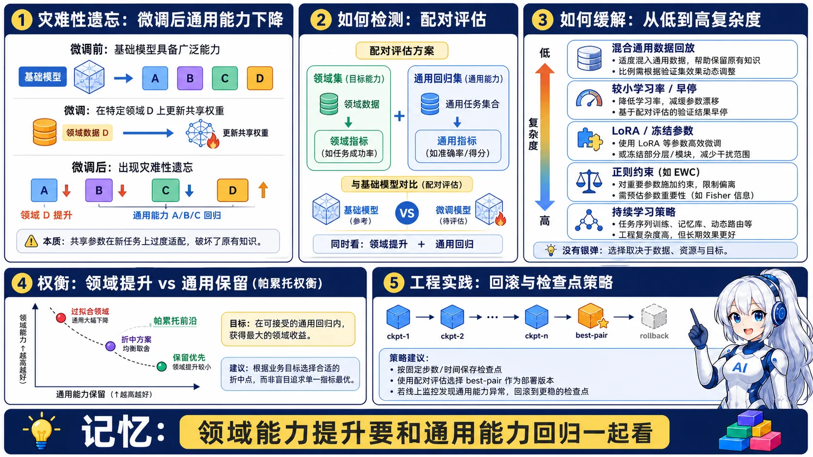</a></p>

<p align="center"><sub>🧠 图解记忆：领域能力提升要和通用能力回归一起看；点击图片可查看原图。</sub></p>

**Catastrophic Forgetting = 模型在对新数据进行微调时，大幅遗忘原来已经学到的通用知识。**

### 为什么会发生？

```
预训练阶段：模型在海量通用语料上学到了广泛的语言能力和常识
         ↓
微调阶段：只用几千条特定领域数据训练
         ↓
模型为适应新数据，大幅调整权重 → 通用语言能力退化
         ↓
表现：微调后的模型回答通用问题时变得笨拙，甚至不如基座模型
```

### 典型症状

| 维度 | 微调前 | 微调后（灾难性遗忘） |
|------|--------|---------------------|
| **通用问答** | 流畅自然 | 回答生硬、语法错误增多 |
| **英语能力** | 优秀 | 退化明显 |
| **逻辑推理** | 稳定 | 大幅下降 |
| **领域能力** | 一般 | **大幅提升** |

### 缓解方案（从低成本到高成本排序）

#### 方案1：Elastic Weight Consolidation（EWC）⭐

```
核心思想：标记出预训练时对通用知识重要的参数，微调时限制这些参数的变化幅度

步骤：
1. 用预训练数据（或少量通用数据）跑一轮，记录每个参数的 Fisher Information Matrix
2. Fisher 值大的参数 = 重要参数，微调时用正则项限制其变化

loss_total = task_loss + lambda × Σ F_i × (theta_i - theta_pretrain_i)^2
                          ↑ 重要参数惩罚更大
```

#### 方案2：混合数据训练（最常见⭐⭐⭐）

```
微调时混入一定比例的预训练通用数据：

- 90% 领域数据 + 10% 通用预训练数据
- 或使用 FLAN/shuf-flan 等高质量指令数据作为通用锚点
- 效果立竿见影，零成本

业界经验：5-20% 的通用数据混入通常就能有效防遗忘
```

#### 方案3：LoRA + 低学习率

```
LoRA 冻结大部分预训练权重，只训练低秩适配矩阵
→ 参数量不变，但权重整体漂移幅度远小于全量微调
→ 天然缓解灾难性遗忘
```

#### 方案4：Continual Pre-training（持续预训练）

```
先用更大规模的通用语料对模型做第二轮预训练
→ 恢复通用能力
→ 然后再做领域微调
```

### 面试加分点

- **如何检测遗忘？** 微调后用 MMLU（通用知识）、HumanEval（编程）、GSM8K（数学）等基准测试，对比基座模型分数
- **2026 趋势**：很多团队直接用 LoRA + 少量通用数据，已经很少遇到严重遗忘问题了

**面试话术：**
> "灾难性遗忘的本质是模型为了适应新数据而覆盖了旧权重。我的应对三板斧：1）微调时混入 5-10% 的通用预训练数据；2）尽量用 LoRA 而不是全量微调，冻结大部分权重天然防遗忘；3）调完后立刻用 MMLU 或 GSM8K 跑一下，确认通用能力没有崩。一般这样组合用，遗忘程度能控制在可接受范围内。"

---
## 41. FlashAttention 是什么？为什么它比标准 Attention 快很多？（高频）

<p align="center"><a href="../../assets/illustrations/01-basic-concepts/q41-flashattention.webp">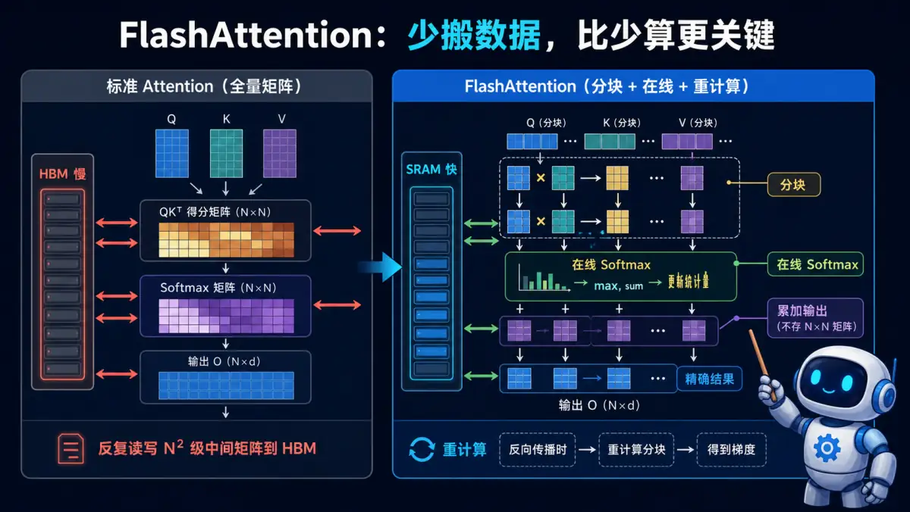</a></p>

<p align="center"><sub>🧠 图解记忆：注意力计算的瓶颈不是算不快，而是数据搬太多——把计算移到SRAM里做，少搬数据就快了。</sub></p>

**FlashAttention = I/O 感知的注意力算法：把计算拆成小方块放在 GPU SRAM 上做，避免反复从 HBM（高带宽显存）读写中间结果。**

### 核心问题：标准 Attention 的 I/O 瓶颈

```
标准 Softmax(QK^T)V 的计算流程：
1. Q @ K^T → M×M 中间矩阵（写入 HBM）
2. softmax(M×M) → 又一个中间矩阵（写入 HBM）
3. Softmax_M × V → 最终输出

问题：
- 对于一个 seq_len=8192 的序列，QK^T 就是 8192×8192 ≈ 67M 个 float16 = 128MB
- 长序列下中间矩阵远大于 SRAM，只能存在 HBM
- HBM 读写的速度远慢于 SRAM（约 10~20 倍差距）
- 每次 block 计算完都要写回 HBM、下次再读回来 → 大量时间浪费在搬运数据
```

### FlashAttention 的三大优化

#### 1. Tiling（分块计算）
```
把 Q、K、V 分成小 blocks，每个 block 大小适配 SRAM：
  Block-Q (n×d) + Block-K (m×d)^T → Block-QK^T → softmax → Block-O (n×d)

每个 block 的计算完全在 SRAM 内完成，只有最终输出写回 HBM
→ 大幅减少 HBM 读写次数
```

#### 2. Online Softmax
```
传统 softmax 需要两遍遍历数据（先求 max，再归一化）。
FlashAttention 用递推方式一次搞定：

在线 softmax 递推公式：
给定前 i 个块的 max(m_i) 和 sum(s_i)，加入第 i+1 块后：
  m_new = max(m_i, m_{i+1})
  s_new = s_i * exp(m_i - m_new) + s_{i+1} * exp(m_{i+1} - m_new)
  o_new = (o_i * exp(m_i - m_new) + o_{i+1} * exp(m_{i+1} - m_new)) / s_new

这样每处理一个 block 就能更新全局统计量，不需要保存整个中间矩阵！
```

#### 3. Re-computation（重计算）
```
因为不保存中间矩阵，反向传播时需要重新计算 QK^T。
但重计算的成本远低于存储和传输中间矩阵的成本。

权衡：多一次正向计算 ↔ 省掉 M×M 显存存储
对于长序列场景，后者收益巨大
```

### 性能对比

| 指标 | 标准 Attention | FlashAttention |
|------|---------------|----------------|
| **显存占用** | O(n²)（存完整中间矩阵） | O(n)（只存分块结果） |
| **训练速度** | 基准 | 1.5~2× 更快 |
| **支持的最大序列长度** | 受限于显存 | 大幅提升 |
| **数值精度** | 标准 softmax | 数值稳定（在线算法保证） |

### 面试高频追问

- **FlashAttention-2 vs FlashAttention-1 有什么区别？** FA-2 进一步优化了 CUDA kernel，减少了寄存器压力并改进了 load/store 调度，实测再提速 ~25%
- **FlashAttention 能用于 Transformer Encoder 吗？** 可以——任何使用注意力机制的场景都可以受益，不限于 Decoder-only
- **FlashAttention 对硬件有要求吗？** 需要较新的 GPU（如 A100/H100 的更大 SRAM），对消费级显卡也有优化版本

**面试话术：**
> "FlashAttention 的核心思想是 I/O 感知设计——不是让计算更快，而是让数据搬运更少。传统 Attention 要把 QK^T 这个巨大的中间矩阵写到显存再读回来，而 FlashAttention 把 Q、K、V 切成小块全放在 SRAM 里算完，用在线 Softmax 递推替代全矩阵操作，最后只把输出写回显存。实际效果是训练速度提升 1.5~2 倍，而且显存占用从 O(n²) 降到 O(n)，这让超长上下文训练成为可能。现在几乎所有主流 LLM 框架都内置了 FlashAttention。"

---

## 42. MHA、MQA、GQA 有什么本质区别？为什么行业转向了 GQA？（高频）

<p align="center"><a href="../../assets/illustrations/01-basic-concepts/q42-attention-variants.webp">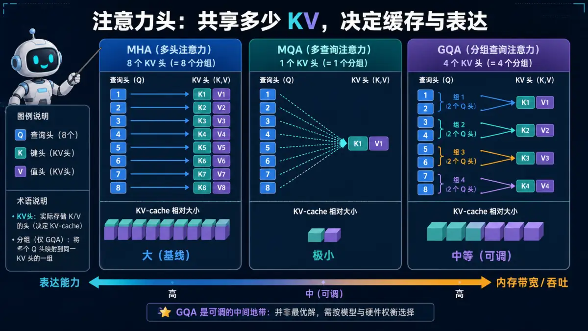</a></p>

<p align="center"><sub>🧠 图解记忆：MHA是全栈精英(贵但强)，MQA是极简主义(省但弱)，GQA是性价比之王。</sub></p>

**MHA/MQA/GQA 都是 Self-Attention 的变体，核心区别在于 Key 和 Value 头的数量分配策略，本质是在「KV Cache 大小」和「表达能力」之间做权衡。**

### 三种方案的对比

假设模型有 H 个 Query 头和 d_head 维度的 head：

| 方案 | Query 头数 | Key 头数 | Value 头数 | KV Cache 大小 | 推理速度 | 质量损失 |
|------|-----------|---------|-----------|--------------|---------|---------||
| **MHA** (Multi-Head Attention) | H | H | H | 最大 (H 份) | 基准 | 无 |
| **MQA** (Multi-Query Attention) | H | 1 | 1 | 最小 (1/H 份) | 最快 | 较大 |
| **GQA** (Grouped-Query Attention) | H | G | G | 中等 (H/G 份) | 较快 | 很小 |

其中 G = 分组数（通常 G << H 但 G > 1）

### 原理拆解

#### MHA：标准多头注意力
```
每个 Query 头都有自己的 K 头和 V 头
Q[i] @ K[i]^T → Attention → ... （i = 1...H）
优点：表达能力最强
缺点：KV Cache 随头数线性增长，推理内存开销大
代表：BERT, 早期 GPT
```

#### MQA：所有 Query 头共享一组 KV 头
```
Q[i] @ K[0]^T → Attention → ... （i = 1...H，都用同一个 K/V）
优点：KV Cache 缩减 H 倍，推理速度快
缺点：不同 Query 头被迫看同样的 K/V，表达能力严重受限，质量下降明显
代表：一些极端部署场景的小模型
```

#### GQA：按组共享 KV 头（⭐ 工业界首选）
```
将 H 个 Query 头分为 G 组，每组共享一个 K/V 头
Q[group_0] @ K[0]^T, Q[group_1] @ K[1]^T, ...
优点：KV Cache 缩减 G 倍，质量几乎无损
缺点：需要精心设计分组数 G
代表：Llama 3 (8 heads / 8 groups = 8GQA), Gemma 2, DeepSeek V2/V3
```

### 关键数学关系

```
KV Cache 大小（FP16）≈ 2 × num_layers × H × d_head × seq_len × batch_size × bytes_per_elem

对于 Llama 3-70B（128 heads, 8 GQA groups）:
  seq_len=8192, batch=1:
    MHA KV Cache: 2 × 80 × 128 × 128 × 8192 × 2 = ~27 GB
    GQA KV Cache: 2 × 80 × 8 × 128 × 8192 × 2 = ~1.7 GB（节省 16 倍！）
```

### Up-training（轻量升级）
```
GQA 论文发现：可以用很小的代价把已有 MHA 模型升级为 GQA 模型
步骤：
1. 加载训练好的 MHA checkpoint
2. 对每个组的多个 KV 权重做平均（mean pooling）→ 得到 G 组的新 KV
3. 少量数据（几百条 prompt-response）微调 → 恢复几乎完整的精度
成本：只需几小时而非几天的训练
```

### 面试高频追问

- **2025 年出现了 MLA（Multi-Latent Attention），它与 GQA 有什么不同？** 
  MLA 不只是减少 KV 头数，而是把所有头共享的 KV 投影为一个低秩 latent tensor（rank=r），同时保持 query 方向不变。DeepSeek V2/V3 用的就是这个思路，相比 GQA 进一步压缩了 KV Cache 而不牺牲表达能力。
  
- **什么时候该用 MQA 而不是 GQA？** 
  几乎没有理由用 MQA——它在质量上退化明显且只在极边缘部署场景有优势。GQA 已经覆盖了 MQA 的所有适用场景且效果更好。

**面试话术：**
> "MHA 到 GQA 的演进本质上是在问一个问题：多少个 KV 头才够用？MHA 每个头独享 KV 容量但太烧显存，MQA 把所有头共享一个 KV 省显存但质量崩了。GQA 找到黄金分割点——把头分成 G 组，每组共享 KV。工业界的共识是 G 通常在 4~16 之间，比如 Llama 3 的 70B 用的是 8GQA（128个头÷8组），显存节省了 16 倍而质量几乎无损。关键是 GQA 还支持 up-training，可以直接从 MHA checkpoint 升级，这对生态非常友好。"

---

## 43. Continuous Batching（连续批处理）是怎么工作的？为什么吞吐量能大幅提升？（实战必考）

<p align="center"><a href="../../assets/illustrations/01-basic-concepts/q43-continuous-batching.webp">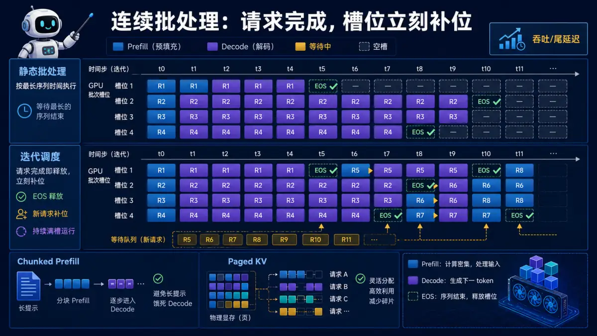</a></p>

<p align="center"><sub>🧠 图解记忆：静态批处理像公交车等满发车，连续批处理像地铁到站就走——有人下车就有人上车，永不浪费座位。</sub></p>

**Continuous Batching（也叫 Iteration-Level Batching 或 In-Flight Batching）是一种 LLM 推理调度技术，以 Token 级别的细粒度动态管理批处理中的请求，而非等到整批请求全部完成后才释放资源。**

### 传统静态批处理的致命缺陷

```
静态批处理（Static Batching）的工作方式：
┌──────────┬──────────────┬──────────┐
│ Request 1 │  Prefill ──▶ Decode ──▶ Decode ──▶ Decode（结束）│
│ Request 2 │  Prefill ──▶ Decode ──▶ Decode ──▶ Decode ──▶ Decode（结束）│
│ Request 3 │  Prefill ──▶ Decode ──▶ Decode（结束）              │
└──────────┴──────────────┴──────────┘

问题：
  - 三个请求并行执行，但必须等最慢的请求(Request 2)完成后批次才算结束
  - Request 3 提前结束了，但它占用的 GPU 资源不能释放给新请求
  - GPU 利用率极低：长请求期间短请求对应的计算单元空闲
```

### Continuous Batching 的核心思想

```
迭代级调度——每个 Token 生成后检查哪些请求完成了：

Step 0: [R1-Prefill] [R2-Prefill] [R3-Prefill]
Step 1: [R1-Dec]     [R2-Dec]     [R3-Dec]     ← 一起生成第一轮
Step 2: [R1-Dec]     [R2-Dec]     [R3-完成✅]   ← R3 完成！
        ↑ 立刻释放 R3 的资源 → 放入新请求 R4！
Step 3: [R1-Dec]     [R2-Dec]     [R4-New]      ← R4 替换了 R3
Step 4: [R1-Dec]     [R2-Dec]     [R4-Dec]      ← 继续
Step 5: [R1-完成✅]  [R2-Dec]     [R4-Dec]      ← R1 也完成了 → R5 加入
Step 6: [R5-New]     [R2-Dec]     [R4-Dec]      ← 循环往复...
```

### Continuous Batching 的关键组件

| 组件 | 作用 |
|------|------|
| **迭代级调度器** | 每个 Token 生成后评估完成状态，决定是否移除/添加请求 |
| **PagedAttention** | 将 KV Cache 分页管理，支持请求的动态加入/退出（无拷贝、零开销） |
| **Chunked Prefill** | 长 prompt 拆成 chunks 分批处理，避免 prefill 阶段独占 GPU 太久 |
| **Scheduler Policy** | 决定等待队列中哪个新请求进入批次（FIFO / Shortest Job First 等） |

### 与传统 Batch 的性能对比

| 指标 | Static Batching | Continuous Batching |
|------|----------------|--------------------||
| **吞吐量化** | 基准 | 23×（vLLM 实测） |
| **尾部延迟 (p99)** | 高（被最长请求拖垮） | 低（新请求可立即插入） |
| **GPU 利用率** | 低（长请求拖累批次） | 高（接近 100%） |
| **并发请求数** | 受限 | 大幅提高 |

### Chunked Prefill（与 Continuous Batching 配合）
```
问题：一个超长 prompt（比如 100K tokens）预填充需要很长时间
→ 在此期间 GPU 全力服务于 prefill，其他 decode 请求全部阻塞

解法：将 prefill 任务切分为 chunks（如 2048 tokens/chunk），每个 chunk
与其他请求的 decode 交替执行
→ 既保证了 throughput，又控制了 tail latency
```

### 面试高频追问

- **Continuous Batching 和 vLLM 的关系？** vLLM 是最早将 Continuous Batching + PagedAttention 结合的开源推理框架，后来 HuggingFace TGI、TensorRT-LLM、SGLang 等也都实现了类似机制
- **Prefill 和 Decode 能混在一起算吗？** 技术上可以（vLLM 默认会分开调用不同 kernel），但通常 prefill 调 Matmul kernel（计算密集），decode 调 Attention kernel（访存密集），分开调度更优
- **调度策略怎么选？** 简单场景用 FIFO；追求吞吐用 SJF（Shortest Job First）；生产环境一般用 weighted fair scheduling

**面试话术：**
> "Continuous Batching 解决的是 LLM Serving 中最核心的资源浪费问题。想象一下餐厅厨师炒菜——如果一定要等桌上的客人全部吃完才能上新菜，那厨房产能肯定很低。但如果有人吃完一道就能立刻上桌下一道，厨房产出就会最大化。vLLM 的 Continuous Batching 就是这样做的：每个 request 生成到 EOS 时立刻释放它的 KV Cache 槽位，新请求直接补进来。配合 PagedAttention 的分页管理和 Chunked Prefill 防止长 prompt 独占 GPU，最终可以实现 20 倍以上的吞吐量提升。这套组合拳现在已经成了 LLM Serving 的事实标准。"

---

## 44. ALiBi 位置编码是什么？和 RoPE 有什么区别、各适用于什么场景？（进阶高频）

<p align="center"><a href="../../assets/illustrations/01-basic-concepts/q44-alibi-vs-rope.webp">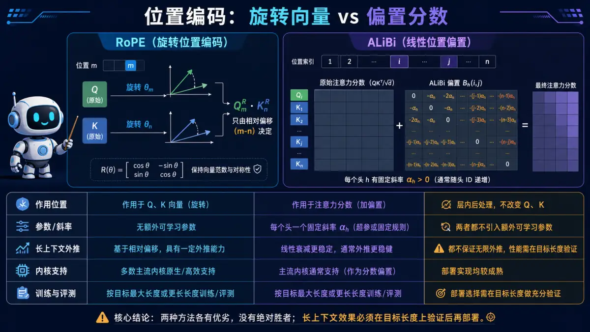</a></p>

<p align="center"><sub>🧠 图解记忆：RoPE是用旋转让位置变成向量的一部分，ALiBi是直接给分数贴衰减标签。</sub></p>

**ALiBi (Attention with Linear Biases) = 一种简单而有效的绝对位置编码方法，直接在 Attention Score 上加一个与位置距离成比例的负向偏置项。**

### RoPE 回顾（已有的 Q35）
```
Rotary Positional Embedding:
  - 将 Q 和 K 分别乘上一个旋转矩阵 R(θᵢ)，旋转角度 θᵢ 依赖于位置 i
  - 计算 QK^T 时，旋转自然转化为两个位置之间的相对位置信息
  - 优势：天然建模相对位置，已在训练序列长度范围内表现优秀
  - 劣势：超出训练长度的外推能力有限
```

### ALiBi 的设计思想
```
核心 idea：不在 embedding 层加位置信息，而是在 Attention Score 层面直接加偏置

公式：Attention(i, j) = Softmax( Q_i K_j^T / √d + b_i )

其中 b_i = -m × |i - j|
  m 是斜率系数（每个 attention head 有不同的 m）
  |i - j| 是位置之间的距离
  越远的 token，score 越小（施加负向偏置）

注意：这个偏置是固定的（训练无关），不经过梯度更新！
```

### ALiBi vs RoPE 对比

| 维度 | RoPE | ALiBi |
|------|------|-------|
| **位置编码方式** | 旋转矩阵作用于 Q/K 向量 | 线性偏置直接加到 Attention Score |
| **是否 learnable** | ✅ 是（嵌入网络的一部分） | ❌ 否（固定的斜率参数） |
| **外推能力** | 中等（受训练长度限制） | ⭐ 强（天然适合外推） |
| **实现复杂度** | 中等（需要特殊的 rotary kernel） | 极低（一行代码即可） |
| **代表的模型** | LLaMA, Mistral, Qwen, Gemma | BigScience BLOOM, Meena |
| **与训练长度的关系** | 需要针对目标长度训练 | 无需调整，直接用 |

### ALiBi 的外推优势详解
```
RoPE 的问题：
  训练时在 4K 长度上学习的旋转模式，到了 8K 或 32K 可能不work
  虽然有一些改进（NTK-aware scaling、Pi-Scale 等），但本质上是 heuristic

ALiBi 的优势：
  线性衰减的模式在所有长度上都一致——没有"外推"的概念
  因为偏置是固定的数学函数：b_i = -m × distance
  
  实际验证：
  - BLOOM 训练时最大长度 2K，测试时可以很好地外推到 8K+
  - 2025 年的工作（如 RoFormer-Gen、YaRN）都在尝试结合 RoPE 的准确性和 ALiBi 的外推性
```

### Hybrid 趋势（2025-2026）
```
研究发现：RoPE 的精度高 + ALiBi 的外推好 = 最好的组合
代表性做法：
  1. RoFormer++ : RoPE + ALiBi 联合使用
  2. YaRN (Yet Another RoPE tuning) : 先用 NTK-aware scaling 修改 RoPE，再用 ALiBi-style bias 增强外推
  3. 部分模型采用 "基础 RoPE + 可选 ALiBi head" 的双轨架构

工程实践：
  - 如果只做常规训练（已知最大长度）→ RoPE 就够了
  - 如果需要极致长文本外推 → 优先考虑 RoPE + 插值技巧，或在预算允许时考虑 Hybrid
```

### 面试高频追问

- **ALiBi 为什么不学？为什么固定斜率反而更好？**
  ALiBi 的斜率是通过 validation 搜索得到的固定值。研究表明，固定的线性衰减恰好匹配了人类语言中"近处相关性强、远处相关性弱"的自然规律， learned 的位置编码反而可能在推理时学到不适合外推的模式。

- **FlashAttention 兼容 ALiBi 吗？**
  原生 FlashAttention 不直接支持 ALiBi（因为它假设 Attention 是纯注意力形式）。但 FlashInfer 等新一代后端已经实现了带 ALiBi 偏置的高效 Attention kernel。

**面试话术：**
> "ALiBi 和 RoPE 都是解决 Transformer '看不到位置' 问题的方案，但路子完全不同。RoPE 把位置信息揉进向量本身（用旋转变换），优点是训练时表达力强，缺点是换长度时要微调。ALiBi 则另辟蹊径——直接在 Attention Score 上加一个线性衰减的偏置，相当于告诉模型'离你越远的词影响力越小'。这个规则完全不随长度变化，所以外推能力极强。业界趋势是两者结合：RoPE 负责训练时的表达能力，ALiBi 负责推理时的外推鲁棒性。"

---

## 45. Logit Bias 和采样控制：如何精准控制 LLM 的输出？（实战必考）

<p align="center"><a href="../../assets/illustrations/01-basic-concepts/q45-sampling-control.webp">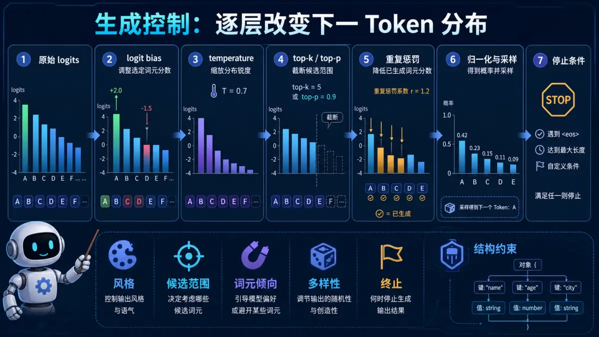</a></p>

<p align="center"><sub>🧠 图解记忆：生成控制是一把组合拳——温度管风格、候选集管范围、惩罚管倾向、Bias管精确控制。</sub></p>

**Logit Bias = 在模型输出的 logits 上加一个手动设置的偏置值，直接改变特定 token 被选中的概率。它是 LLM 可控生成的最后一道防线。**

### 采样控制的"工具链"全景

```
模型输出 logits（原始未归一化的分数）
       ↓
[1] Logit Bias  —— 手动加减特定 token 的分数
       ↓
[2] Temperature  —— 整体缩放 logits，控制随机性
       ↓
[3] Top-K / Top-P / Top-A —— 过滤候选集，缩小选择范围
       ↓
[4] Repetition Penalty —— 对已出现的 token 降分
       ↓
[5] Stop Sequences —— 命中即终止生成
       ↓
Softmax → 采样 → 输出 token
```

### Logit Bias 详解

```python
# OpenAI API 示例
response = client.chat.completions.create(
    model="gpt-4",
    messages=[{"role": "user", "content": "请用一句话回答"}],
    logit_bias={
        1234: 10,   # Token ID 1234 的 score +10（极高概率被选中）
        5678: -10,  # Token ID 5678 的 score -10（极低概率被选中）
    }
)
# 注意：bias 范围通常是 -100 ~ 100（不同 provider 可能不同）
# +10 意味着该 token 的概率大约是原来的 e^10 ≈ 22026 倍
# -10 意味着该 token 的概率大约是原来的 e^-10 ≈ 4.5e-5 倍
```

**关键特性：**
- Logit Bias 直接修改的是 **raw logits**（Softmax 之前的值），而非概率
- 指数级的影响：bias=+10 使某 token 的概率翻 2万倍，bias=+5 翻倍
- 优先级最高：在 Temperature 之前生效（先加 bias，再缩放宽窄）
- 不支持批量 token 的排除（需逐 token ID 设置）

### Top-A（Absolute Threshold）采样

```
Top-A（Absolute threshold sampling）是比 Top-P 更精细的控制方法：

原理：
  对每个 token 的 softmax 概率 p_i，保留满足以下条件的 token：
    p_i > A × (max(p))^A
  其中 A 是一个很小的值（如 0.02），max(p) 是最高概率

特点：
  - 自动适应模型的置信度水平
  - 当模型很有信心时（max p 很大），候选集较小
  - 当模型犹豫不决时（max p 很小），候选集自动扩大
  - 避免了 Top-P 中"概率分布平坦时选太多 token"的问题

代表应用：Anthropic Claude 系列采用此方法
```

### 采样控制策略实战搭配

| 场景 | 推荐配置 | 说明 |
|------|---------|------||
| **聊天/对话** | temp=0.7, top_p=0.9 | 平衡创意和质量 |
| **事实问答** | temp=0.1, top_p=0.95 | 偏向确定性和准确性 |
| **代码生成** | temp=0.2, top_p=0.95, repetition_penalty=1.1 | 代码要准确也要有多样性 |
| **JSON 结构化输出** | temp=0, logit_bias={合法字符ID:+20, 非法ID:-20} | 严格约束输出格式 |
| **品牌术语强制** | logit_bias={"Apple":+15, "苹果":-15} | 强制使用英文 brand name |
| **创作/故事** | temp=1.0, top_k=40 | 高多样性和创意 |

### 常见陷阱

```
❌ 陷阱1：Temperature 和 Top-P 混用时行为不可预期
   解决：先设 Temp，再做 Top-P 截断。多数 API 会自动按这个顺序处理

❌ 陷阱2：Repetition Penalty 和 Logit Bias 冲突
   解决：Bias 优先于 Penalty。如果需要对已出现的 token 同时做 bias 调整和 penalty，
   需要在应用层自行合并效果

❌ 陷阱3：Top-A 的参数 A 太小导致候选集为空
   解决：A 通常在 0.01~0.05 之间，具体取决于 vocab size 和模型风格
```

### 面试高频追问

- **Temperature 到底怎么影响采样？** Temperature = τ 时，新 logits = raw_logits / τ。τ < 1 使分布更尖锐（偏向最高分 token），τ > 1 使分布更平坦（增加随机性），τ = 0 等价于 greedy decoding（取 argmax）
- **Top-K、Top-P、Top-A 三者的关系？** Top-K 固定数量，Top-P 自适应比例，Top-A 自适应绝对阈值。实践中 Top-P 最常用，Top-A 在 Anthropic 证明了对不确定性场景更鲁棒
- **能否用 logit_bias 实现"禁止输出某些内容"？** 可以但不优雅——需要提前知道要禁用的 token ID 列表。更好的方式是配合 guard-rails 系统或使用 stop sequences

**面试话术：**
> "Logit Bias 是我在需要精确控制 LLM 输出时最后的杀手锏。它的原理很直观——直接往模型的原始打分上加钱或扣钱，加的正越多那个 token 越容易被选中。比如在 JSON 输出场景中，我会把合法的逗号、冒号、引号的 token 加 positive bias，把中文标点加 huge negative bias，确保模型不会输出格式混乱的结果。配合 Temperature 控制整体风格、Top-P 控制候选集大小、repetition penalty 防复读，这一套工具链基本能覆盖 99% 的生产环境控制需求。"

---


---

## 46. 什么是合成数据（Synthetic Data）？为什么现在大模型训练越来越依赖它？（高频）

<p align="center"><a href="../../assets/illustrations/01-basic-concepts/q46-synthetic-data.webp"></a></p>

<p align="center"><sub>🧠 图解记忆：从人喂模型到模型自己制造训练燃料——合成数据是双刃剑。</sub></p>

### 背景（面试必答题）

```
2023 年：LLM 预训练依赖互联网爬取的数万亿 Token 人类文本
2025 年后：高质量人类语料接近枯竭
      → 合成数据（模型用自己的输出来生成训练数据）成为主流训练范式
```

### 三种主流合成数据生成方法

#### 方法 1：Self-Instruct（自指令）⭐

```python
# 核心流程：让一个大模型用少量种子示例自动生成大量指令-回答对
seed_tasks = [
    {"instruction": "将以下句子翻译成英文", "input": "你好世界", "output": "Hello World"},
    {"instruction": "总结以下段落", "input": "...长文本...", "output": "...摘要..."},
]

# 使用 teacher model 生成更多任务
def generate_tasks(seed_tasks, model, num_per_seed=10):
    all_tasks = []
    for seed in seed_tasks:
        prompt = f"基于以下示例，生成 {num_per_seed} 个类似的任务。\n\n"
        prompt += f"示例: instruction={seed['instruction']}, input={seed['input']}"
        response = model.generate(prompt)
        # 解析 response 中的新任务
        new_tasks = parse_generated_tasks(response)
        all_tasks.extend(new_tasks)
    return all_tasks
```

**优点：** 零成本、覆盖面广
**缺点：** 可能放大模型偏差，需要人工校验或过滤

#### 方法 2：教师-学生蒸馏（Teacher-Student Distillation）⭐⭐

```python
# 大模型（教师）用小数据集标注 → 小模型（学生）学习这些标注
teacher_model = load("gpt-4")  # 高质量但贵
student_model = load("qwen2.5-7b")  # 快速且便宜

# 步骤 1: 教师模型为每个样本生成高质量回答
annotations = []
for question in unlabeled_questions:
    answer = teacher_model.generate(question)  # 质量高
    annotations.append({"question": question, "answer": answer})

# 步骤 2: 用标注数据训练学生模型
student_model.sft(annotations, epochs=3)
# 学生模型获得接近教师的能力，但推理速度快 10x、成本低 100x
```

**工业应用：** LLaMA、BLOOM、Yi 等开源模型都有大量合成数据参与训练

#### 方法 3：偏好对构建（Preference Pairs）⭐⭐⭐

```python
# 用于 RLHF/DPO 的训练：同一 prompt 生成多个回答，排序选出好/坏的回答
prompts = [...]  # 一批 prompt
responses = {}  # 每个 prompt 生成 N 个回答

for prompt in prompts:
    responses[prompt] = [model.generate(prompt) for _ in range(N)]
    # 方式 A: 用另一个打分模型评估并排序
    scores = rater.evaluate_all(responses[prompt])
    preferred = max(responses[prompt], key=lambda x: scores[x])
    rejected = min(responses[prompt], key=lambda x: scores[x])
    
    # 方式 B: 用规则筛选（长度、格式、安全等）
    preferred = filter_by_rule(responses[prompt])
    rejected = exclude_responds(responses[prompt])

# 生成的 (prompt, preferred, rejected) 三组数据用于 DPO 训练
dpo_dataset = build_preference_dataset(prompts, responses, preferred, rejected)
```

**2025-2026 趋势：** DeepSeek R1 的 GRPO、RLVR（Verifiable Rewards）等都是合成数据的极端形式——不需要任何人工标注。

### 风险与争议（面试加分点）

| 风险 | 说明 |
|------|------|
| **数据污染 / 模型坍缩** | 模型在"自己的产出的产出"上训练 → 能力退化、多样性下降 |
| **分布偏移** | 合成数据偏向模型的"舒适区"，覆盖盲区不足 |
| **评估混淆** | 模型在自己的合成测试集上表现好 ≠ 真正能力提升 |
| **版权 / 隐私** | 用有版权的人类文本来生成合成数据再卖出去，法律灰色地带 |

### 工程最佳实践

1. **混合策略**：合成数据 + 人工精选数据组合使用（如 70:30），避免纯合成数据
2. **严格过滤**：建立多层过滤器（困惑度、重复检测、安全分类器）
3. **外部验证**：永远用独立于合成过程的真实评测集验证能力

**面试话术：**
> "合成数据本质上是把'高质量人类标注'的需求从人力转移到模型自身。Self-Instruct 解决了指令覆盖问题，教师蒸馏解决了质量对齐问题，偏好对构建解决了行为对齐问题。但它的核心风险是模型在'自己产出的数据'上训练可能导致能力退化——所以工业界通常混合使用合成数据和人工数据，并保持独立的验证集。2026 年的趋势是更少的标注工人、更多的合成数据迭代，但关键在于每次迭代的评估必须严格。"

---

## 47. 什么是 Function Calling（函数调用）？它是如何工作的？为什么重要？（应用开发第一性原理）

<p align="center"><a href="../../assets/illustrations/01-basic-concepts/q47-function-calling.webp"></a></p>

<p align="center"><sub>🧠 图解记忆：模型不直接查数据库或调 API——它先决定要不要做，再做就生成结构化调用，应用负责执行并把结果告诉模型。</sub></p>

### 一句话定义

**Function Calling = 让 LLM 输出结构化的 JSON 来描述"调用哪个函数、带什么参数"**，从而打通大模型与现实世界的操作接口。

### 完整工作流（面试手撕级）

```
用户："帮我查北京今天的天气"
                    ↓
[Step 1] 应用层声明可用函数（tool/function schema）
{
  "name": "get_weather",
  "description": "查询指定城市的实时天气",
  "parameters": {
    "type": "object",
    "properties": {
      "city": {"type": "string", "description": "城市名称"},
      "unit": {"type": "string", "enum": ["celsius", "fahrenheit"]}
    },
    "required": ["city"]
  }
}
                    ↓
[Step 2] 模型收到消息 + tool definitions，判断：
  - 是否需要调用工具？ → ✅ 需要
  - 调用哪个函数？     → get_weather
  - 参数是什么？       → city="北京", unit="celsius"
  - 输出：
    {
      "message": null,
      "tool_calls": [
        {"id": "call_123", "type": "function",
         "function": {"name": "get_weather",
                      "arguments": "{\"city\": \"北京\", \"unit\": \"celsius\"}"}}
      ]
    }
                    ↓
[Step 3] 应用层接收 tool_calls，执行函数调用
result = get_weather(city="北京", unit="celsius")
# 返回: {"temperature": 22, "condition": "晴", "humidity": 45}
                    ↓
[Step 4] 应用将结果回传给模型
assistant_message = model.chat(messages + [{"role": "tool", "content": result_json}])
                    ↓
[Step 5] 模型根据工具结果生成最终自然语言回复
"北京今天晴，气温22°C，湿度45%，体感舒适哦！"
```

### 为什么重要？（三大理由，面试必答）

| 理由 | 说明 |
|------|------|
| **1. 打破封闭边界** | 模型只能"说"不能"做"——Function Calling 给它接入搜索、数据库、API 的手脚 |
| **2. 结构化交互** | 相比让模型从自由文本中"提取"参数，JSON 结构化输出可靠性大幅优于 Prompt 工程 |
| **3. 动态扩展能力** | 不用重新训练/微调模型就能增加新功能：加一个函数定义 = 多一项能力 |

### 两种调用模式对比

| 维度 | Autonomous（自动模式） | Chained（链式模式） |
|------|-----------------------|--------------------|
| **工作方式** | 模型一次性调用多个工具后直接出答案 | 每调用一个工具后等待结果，再来一轮 |
| **适合场景** | 多个独立查询并行执行 | 需要前一步结果来决定下一步（顺序依赖） |
| **延迟** | 低（并行） | 较高（串行等待） |
| **实现难度** | 简单 | 复杂（需管理对话状态机） |

### 工程陷阱（面试高频追问）

| 陷阱 | 解决方案 |
|------|----------|
| **参数类型漂移** | 模型可能输出字符串而非数字，需加类型转换层 |
| **幻觉参数** | 模型编造不存在的字段名，必须配合 Schema Validation |
| **函数命名不一致** | 不同厂商 API 格式不同（OpenAI vs Anthropic vs OpenRouter），建议抽象一层统一适配 |
| **无限循环** | 模型反复调用同一函数，需设置最大调用次数限制 |
| **权限控制** | 不是所有函数都应暴露给模型——敏感操作（删除/转账）需鉴权层 |

### 代码示例（生产级 Function Calling 封装）

```python
class SafeToolExecutor:
    def __init__(self, tools: list[dict]):
        self.tools = {t["name"]: t for t in tools}
        self.max_calls_per_turn = 5
    
    async def handle_tool_call(self, message: dict) -> list[dict]:
        """处理 tool_calls，安全执行并返回结果"""
        results = []
        call_count = 0
        
        for tc in message.get("tool_calls", []):
            if call_count >= self.max_calls_per_turn:
                break
            call_count += 1
            
            func_name = tc["function"]["name"]
            func_def = self.tools.get(func_name)
            
            if not func_def:
                results.append({"role": "tool", "tool_call_id": tc["id"],
                              "content": f"Error: function '{func_name}' not found"})
                continue
            
            try:
                args = json.loads(tc["function"]["arguments"])
                # 🔒 Schema Validation — 防止参数注入
                validated = validate_schema(args, func_def["parameters"])
                result = await execute_func_safely(func_name, validated)
                results.append({"role": "tool", "tool_call_id": tc["id"], "content": json.dumps(result)})
            except Exception as e:
                results.append({"role": "tool", "tool_call_id": tc["id"],
                              "content": f"Execution error: {str(e)}"})
        
        return results
```

**面试话术：**
> "Function Calling 是让模型从'聊天机器人'变成'智能体'的关键桥接技术。它的工作流很清晰：声明工具 schema → 模型判断是否调用 → 生成结构化 JSON → 应用执行 → 结果回传 → 综合回答。核心优势是不需要微调模型就能扩展功能。但工程上有不少坑：参数类型漂移、无限循环、权限控制——我在项目里封装了一个 SafeToolExecutor，做了 Schema Validation、调用次数上限和错误降级。"

---

## 48. 为什么 Transformer 不只是 Decoder-only？Encoder-Decoder（T5/BART）架构有什么独特价值？（进阶必考）

<p align="center"><a href="../../assets/illustrations/01-basic-concepts/q48-encoder-decoder.webp"></a></p>

<p align="center"><sub>🧠 图解记忆：Encoder 理解一切（左右都看），Decoder 专注产出（只看左），两者之间有座桥梁叫 Cross-Attention。</sub></p>

### Decoder-only vs Encoder-Decoder（面试高频对比题）

| 维度 | Decoder-only（GPT系列） | Encoder-Decoder（T5/BART/T5） | Encoder-only（BERT） |
|------|------------------------|-------------------------------|---------------------|
| **注意力掩码** | Causal Mask（因果/单向） | Encoder：无限制；Decoder：Causal Mask | Bidirectional（双向） |
| **输入→输出关系** | 输入即输出的前缀（续写模式） | 输入编码后→独立生成（翻译/摘要模式） | 仅输入，无生成输出 |
| **适用任务** | 文本生成、对话、角色扮演 | 翻译、摘要、改写、Seq-to-Seq | 分类、抽取、NER、匹配 |
| **典型模型** | GPT-4、LLaMA、Qwen、DeepSeek | T5、BART、mBART、NLLB | BERT、RoBERTa、DeBERTa |
| **推理模式** | 自回归逐个 token | 自回归逐个 token | 无推理过程 |

### Encoder-Decoder 的核心设计思想

```
Encoder-Decoder 的直觉：输入和输出是"两个不同的空间"

Encoder（理解端）：
  输入: "ChatGPT is amazing"
  双向 Attention 完全理解这句话的所有词之间的语义关系
  输出: 一组隐藏状态表示 "这句话的含义"
          ↓
Cross-Attention（桥梁）：
  Decoder 每一步生成 token 时，都能回头看 Encoder 的全部输出
          ↓
Decoder（表达端）：
  输入: "<start>" → 逐步生成 → "<end>"
  单向 Attention + Cross-Attention 确保只看到已生成的部分 + 完整源句含义
  输出: "ChatGPT 太棒了"
```

### 为什么 Encoder-Decoder 在某些任务上仍然不可替代？

| 场景 | 为什么用 E-D 更好 | Decoder-only 的问题 |
|------|------------------|-------------------|
| **机器翻译** | 输入语言和输出语言可能差异巨大（中英 vs 英日），需要中间表示解耦 | Decoder-only 需要端到端映射，跨语言泛化更困难 |
| **文本摘要** | 输入可能数千字，输出几百字——压缩比极高，需要独立的"阅读"和"写作"模块 | Decoder-only 压缩效率低，容易忽略关键信息 |
| **文本改写/编辑** | 需要保留原意但改变表达方式——Encoder 精确读取原文，Decoder 重写 | Decoder-only 难以精准定位需要改动的部分 |
| **表格/公式转自然语言** | 结构化输入→自然语言输出，两个模态的 gap 很大 | Decoder-only 难以跨越这么大的模态差 |

### 为什么 Decoder-only 赢了？（2023-2026 的行业趋势）

虽然 Encoder-Decoder 在特定任务上有理论优势，但行业已经大规模转向 Decoder-only，原因是：

1. **规模经济**：同一个 Decoder-only 模型可以做几乎所有任务（翻译、摘要、分类、问答）——只需要改变 Prompt
2. **训练简化**：只用一个目标（next-token prediction），无需设计多个预训练损失函数
3. **生态统一**：RLHF、Prompt Engineering、In-Context Learning 等对齐和应用技术全部围绕 Decoder-only 体系发展
4. **部署一致**：生产系统只需维护一套推理基础设施

**但是！** Encoder-Decoder 仍在以下场景保持竞争力：
- 专用翻译服务（NLLB、opus-mt）
- 低资源语言的 Seq-to-Seq 任务
- 需要极致输入输出的任务（短摘要、实体抽取）

**面试话术：**
> "Encoder-Decoder 的设计哲学是"读写分离"——Encoder 充分理解输入（双向 Attention），Decoder 专注生成输出（单向 + Cross-Attention），中间的 Cross-Attention 负责桥接信息。它在翻译、摘要等 Seq-to-Seq 任务上有天然的表达能力优势。但 2023 年以来的趋势是：同样规模的 Decoder-only 模型通过更好的 Prompt 工程和 Few-shot 能力，能够覆盖 Encoder-Decoder 的大部分应用场景，再加上统一的训练目标和生态优势，使得大多数团队选择只维护 Decoder-only 模型。不过在一些专业领域（低资源翻译、极致压缩摘要），Encoder-Decoder 仍有独特价值。"


---

## 📝 速记卡片

### LLM基础概念

| 概念 | 一句话解释 |
|------|------------|
| **Token** | LLM处理的最小单位,1中文≈1-2 tokens |
| **Temperature** | 控制随机性,0=确定,1=随机 |
| **Context Window** | 模型一次能看的最大长度(如4K,128K) |
| **长文本处理** | RAG分块(首选)、滑动窗口、递归摘要 |
| **Lost in the Middle** | 长文本中间信息丢失,解决:关键信息放开头 |
| **涌现能力** | 模型足够大时突然出现的新能力(如推理、编程) |
| **概率生成** | LLM是概率模型,输出经Softmax采样;同样输入可能不同输出 |
| **LLM vs 传统ML** | 生成式vs判别式;LLM自监督学习预测下一个Token,多任务通用 |
| **幻觉** | 编造不存在的信息,用RAG缓解;检测靠引用溯源/忠实度评估 |
| **偏见** | 对性别/种族的不公平输出,RLHF对齐 |
| **RAGAS** | RAG系统评估框架(忠实度、召回率、精确率) |
| **Logits** | 模型对词表每个Token的原始打分,经Softmax变概率 |
| **解码策略** | 贪心/Beam Search/采样,决定下一个Token怎么选 |
| **重复惩罚** | 对已出现Token的Logits惩罚,防复读机 |
| **EOS停止符** | 特殊终止Token,生成遇到它即结束 |
| **Decoder-only** | 主流LLM架构,预训练与推理目标统一(next-token) |
| **Embedding** | 文本→稠密向量,语义相近距离近;上下文相关是主流 |
| **上下文学习(ICL)** | 不更新参数,靠示例学会任务(Zero/Few-shot) |
| **三阶段训练** | 预训练(学知识)→SFT(学对话)→对齐(学偏好) |
| **Scaling Law** | 参数/数据/算力与Loss的幂律关系;Chinchilla≈1:20 |
| **KV Cache** | 缓存历史K/V,推理复杂度O(n²)→O(n);代价是显存 |
| **RLHF vs DPO** | RLHF=奖励模型+PPO;DPO=直接偏好优化,主流 |
| **显存估算** | 权重=参数×字节数;7B FP16≈14GB,INT4≈3.5GB |
| **Chat Template** | 消息转训练格式(角色标记);不同模型模板不同 |
| **MoE混合专家** | FFN换成多专家+路由器,总参大激活少(DeepSeek V3:671B激活37B) |
| **无状态性** | LLM API不保存状态,"记忆"=应用层拼历史进上下文 |
| **Prompt Caching** | 复用相同前缀KV,静态在前动态在后,输入成本降40-65% |
| **量化** | FP16→INT8/INT4减半再减半;生产用AWQ,CPU用GGUF |
| **LLM数学差** | 数字tokenize不一致+误差累积;精确计算走工具/代码 |
| **LLM选型** | 质量×速度×成本三维权衡;模型路由+缓存降本60-90% |
| **Attention** | Q·K^T/√d_k 算相似度,softmax加权V;Multi-Head多角度观察 |
| **Position Encoding** | Self-Attention无法感知顺序,必须加位置编码;RoPE最主流 |
| **Cross-Entropy** | LLM预训练损失=-log(P正确Token);PPL=e^Loss |
| **RMSNorm vs LayerNorm** | RMSNorm去均值中心化,少一半参数,效果等价;LLaMA/Qwen用 |
| **Causal Mask** | Decoder-only预测时只看前面,未来位置设为-inf;自回归核心保障 |
| **数据去重** | MinHash+LSH工业标配,Gopher减少20%训练数据;防过拟合重复内容 |
| **灾难性遗忘** | 微调时覆盖旧权重;混入通用数据+LoRA缓解;5-10%通用数据 |
| **FlashAttention** | SRAM分块计算+在线Softmax+重计算;IO感知设计,O(n²)→O(n)显存;训练提速1.5~2× |
| **GQA/MQA** | GQA按组共享KV头(如Llama3 8GQA);比MQA质量好,比MHA省显存16倍;工业界首选 |
| **Continuous Batching** | 迭代级动态调度;请求完成立即释放slot;配合PagedAttention吞吐提升20×+;vLLM事实标准 |
| **ALiBi vs RoPE** | ALiBi线性偏置外推强、RoPE旋转编码精度高;混合架构是2025趋势 |
   | **合成数据** | Self-Instruct、教师蒸馏、偏好对构建——模型制造训练燃料，混合人工+合成避免坍缩 |
   | **Function Calling** | JSON结构化声明工具→模型判断调用→生成参数→应用执行→结果回传——打通AI与现实世界 |
   | **Encoder-Decoder** | T5/BART架构：Encoder理解(双向)+Decoder产出(单向)+Cross-Attention桥接；翻译摘要仍不可替代 |
   | **Logit Bias & Top-A** | Bias直接改raw logits指数级影响;Top-A自适应绝对阈值;温度/候选集/惩罚/ Bias组合拳全覆盖 |
   | **合成数据** | Self-Instruct、教师蒸馏、偏好对构建——模型制造训练燃料，混合人工+合成避免坍缩 |
   | **Function Calling** | JSON结构化声明工具→模型判断调用→生成参数→应用执行→结果回传——打通AI与现实世界 |
   | **Encoder-Decoder** | T5/BART架构：Encoder理解(双向)+Decoder产出(单向)+Cross-Attention桥接；翻译摘要仍不可替代 |
   | **CoT思维链** | 让AI"逐步推理再输出答案"，复杂任务准确率+30~50%，数学题GSM8K从18%到79%+ |
   | **LoRA/QLoRA** | PEFT核心方案：冻结原始权重加低秩矩阵适配器，单卡消费级显卡也能微调7B |
   | **Few-Shot ICL** | prompt中提供示范例引导模型，质量>数量原则，生产环境快速验证首选 |
   | **知识截止期** | LLM预训练数据的截止日期，之后事件模型不知道；工程中靠RAG联网搜索补充 |
   | **幻觉分类** | 事实性/来源/逻辑/过度自信/上下文错位五类；工程上采用五层防御体系 |
   | **Perplexity** | PPL=e^Loss衡量语言建模能力，越低越好；用于横向比较不同模型的文本预测能力 |

### 分词算法

| 算法 | 原理 | 优缺点 |
|------|------|--------|
| **BPE** | 高频字符对合并 | 需预分词,丢空格 |
| **SentencePiece** | 语言无关,空格编码 | 可逆,主流首选 |
| **Unigram** | 概率分词,大到小删减 | 速度快,LLaMA用 |

---

[返回目录 →](../../README.md)

---


---

## 49. 🚀 什么是思维链推理（Chain-of-Thought, CoT）？为什么它能大幅提升模型表现？（面试必考）

<p align="center"><a href="../../assets/illustrations/01-basic-concepts/q49-cot.webp"></a></p>

<p align="center"><sub>🧠 图解记忆：别急着给答案——让AI一步步想，答案自然更准。</sub></p>

### 一句话定义

**Chain-of-Thought (CoT)** 是一种提示工程技巧：在 prompt 中明确要求模型"逐步推理"或"展示思考过程"，而不是直接给出最终答案。

```python
# ❌ 零样本直接问（容易出错）
prompt = "小明有5个苹果，吃了2个又买了3个，还剩几个？"

# ✅ CoT提示
prompt = """小明有5个苹果，吃了2个又买了3个，还剩几个？
让我们一步一步思考："""
```

### 三种主要形式

| 类型 | 示例 | 效果提升 |
|------|------|---------|
| **Zero-shot CoT** | 只加一句"Let's think step by step" | +10~20% |
| **Few-shot CoT** | 提供带推理过程的示范例 | +20~40% |
| **Auto-CoT** | 自动生成示范的推理链 | +30~50%（自动化工具） |

### 为什么CoT有效？

1. **激活推理路径**：直接映射 `问题→答案` 可能跳过逻辑中间态；CoT强制走 `问题→中间步骤→答案`，利用了模型的因果推理能力
2. **减少错误累积**：多步推理可以分阶段验证；一步到位更容易出现"看起来合理但实际错误"的输出
3. **可解释性增强**：展示中间步骤便于调试和人工审核——这在生产环境中极为关键

### 适用场景（高频追问）

- ✅ **数学题/逻辑推理** — 收益最大（GSM8K数据集上CoT从18%提升到79%+）
- ✅ **复杂问答** — 多条件约束的问题
- ✅ **代码生成** — 先规划算法再写代码
- ❌ **简单事实查询** — 不需要CoT，反而浪费token
- ❌ **格式严格输出** — CoT会混入推理文本

### 局限性

- **幻觉传递**：如果推理过程中的某一环错了，后续所有推导都错（error propagation）
- **Token消耗翻倍**：CoT输出的中间步骤可能占输出总量的50-80%
- **并非所有模型都能用好**：小模型（<7B）用CoT可能产生明显的逻辑错误，需要更精细的调优

### 面试话术

> "CoT的本质是引导模型把隐式推理变为显式推理。就像让学生做题不能只写答案，要写解题步骤一样。工业界应用时，我的经验是：复杂任务用CoT提30-50%准确率，但要注意token成本和幻觉传递风险。对于关键决策，我会结合Self-Consistency策略——让模型多跑几次CoT取多数投票结果。"

---

## 50. 🔧 什么是PEFT（参数高效微调）？LoRA/QLoRA/P-Tuning有什么区别？（必考）

<p align="center"><a href="../../assets/illustrations/01-basic-concepts/q50-peft.webp"></a></p>

<p align="center"><sub>🧠 图解记忆：不碰原始权重，只加一个小插件——这就是PEFT的核心思想。</sub></p>

### 为什么要PEFT？

全量微调（Full Fine-Tuning）一个7B参数的模型需要：
- ~14GB 显存存放权重 + 优化器状态 + 梯度 ≈ **56GB+** 显存（FP16）
- 大量GPU和时间成本

**PEFT的目标**：冻结大部分预训练权重，只训练极少量参数就能适配新任务。

### 三大主流方案对比

| 方法 | 可训练参数占比 | 显存需求 | 效果 | 特点 |
|------|--------------|---------|------|------|
| **Full FT** | 100% | 极高 | 最佳 | 需要多卡/A100集群 |
| **LoRA** | 0.1~1% | 低（可单卡） | 接近全量 | 最流行、工业界首选 |
| **P-Tuning v2** | 0.01~0.1% | 极低 | 中等 | 只需优化embedding层前缀 |
| **Prefix-Tuning** | <0.1% | 极低 | 中等 | 在每层前加可学习prefix |
| **Adapter** | 1~5% | 较低 | 中等偏上 | 在网络层间插入小型模块 |
| **QLoRA** | 同LoRA | 更低（量化后） | 接近LoRA | 4bit量化+LoRA，消费级显卡可用 |

### LoRA核心原理

```
标准Transformer层的权重变换：h = Wx
LoRA的做法：h = Wx + ΔWx = Wx + BAx

其中：
- W: 预训练权重（冻结，不更新）
- B × A: 低秩分解矩阵，A是(r×d)，B是(d×r)，r远小于d（通常r=8~64）
- 训练中只更新B和A，W不变
```

**为什么叫"低秩"？** 假设权重矩阵的变化方向在一个低维子空间内——我们不需要改整个矩阵，只需要在这个子空间里找最优偏移。

### QLoRA：LoRA的进阶版

```python
# QLoRA流程
# 1. 将模型量化为4-bit（使用NF4量化）
# 2. 加入双量化机制（Double Quantization）减少额外开销
# 3. 在量化后的模型上加载LoRA适配器
# 结果：在单张RTX 3090(24GB)上也能微调7B模型！
```

量化带来的好处：
- 7B模型从14GB降到**约3.5GB**（INT4）
- LoRA适配器在此基础上训练，总显存占用约**12-16GB**

### 选择指南

| 场景 | 推荐方案 |
|------|---------|
| 资源充足（多卡A100） | Full FT 或 LoRA |
| 单卡消费级GPU | QLoRA（4bit量化+LoRA） |
| 快速实验/原型 | P-Tuning v2 |
| 生产环境需要兼容旧系统 | LoRA（适配器可合并回原权重） |

### 面试话术

> "PEFT的关键洞察是：预训练模型已经学会了通用语言能力，适配新任务只需要微调一小部分参数。LoRA通过低秩分解实现这个目标——冻结原始权重，只训练两个小矩阵的乘积。在实际项目中，我用QLoRA在单卡3090上调出了媲美全量微调的效果，显存从14GB压到12GB以下。关键参数rank选8就够用了，再大边际效益递减。"

---

## 51. 📝 少样本学习（Few-Shot Learning）的最佳实践是什么？什么时候用ICL替代微调？（实战高频）

### 什么是少样本学习？

In-Context Learning (ICL) 在不修改模型权重的情况下，通过在 prompt 中提供少量示例（ demonstrations），让模型学会一个新任务。

```python
prompt = """给定电影评论的情感：
这部电影真棒！ → 正面
我觉得一般般 → 中性
烂透了，浪费时间 → 负面

这部片子的剧情太精彩了 → """
# 期望输出：正面
```

### Few-shot vs Zero-shot vs Fine-tuning

| 维度 | Zero-shot | Few-shot (n=3~20) | Fine-tuning |
|------|-----------|-------------------|-------------|
| **效果** | 基线 | +5~20% | +15~40% |
| **成本** | 最低 | 低（多些tokens） | 高（训练时间+显存） |
| **灵活性** | 最高 | 高 | 低（需重新训练） |
| **速度** | 最快 | 快（多输入tokens） | 慢（需训练+部署） |

### 黄金实践法则

1. **示例质量 > 数量**：3个高质量示例胜过20个敷衍示例。确保示例准确覆盖边界情况
2. **保持一致的格式**：示例的输出格式应与目标任务的期望输出一致（如JSON、固定模板）
3. **排序策略**：随机打乱顺序优于按某种规律排列，避免模型学到排序偏差
4. **正负样本均衡**：分类任务中正负示例尽量1:1
5. **位置敏感**：最近的位置效应明显——把最重要的示例放最后

### 何时用ICL？何时微调？

| 选择ICL的条件 | 选择微调的条件 |
|-------------|--------------|
| 快速验证想法/原型 | 需要稳定可靠的生产级表现 |
| 任务变化频繁（每天换） | 任务稳定、数据量大 |
| 没有标注数据 | 有大量高质量标注数据 |
| Token预算充足 | 延迟/成本敏感 |
| 多语言/多领域混合 | 单一垂直领域深耕 |

### 面试话术

> "我的原则是：能用ICL解决的就不微调，因为迭代成本低得多。具体做法是精心挑选3-5个代表性的正向例子放在prompt最后，确保输出格式严格对齐。但当任务对一致性要求很高（比如金融风控），或者需要长期稳定的表现时，我会用LoRA做轻量微调——两者结合才是生产环境的最优解。"

---

## 52. ⏰ 什么是知识截止期（Knowledge Cutoff）？模型遇到"不知道"的事该怎么办？（必考题）

### 什么是知识截止期？

每个LLM都有一个**训练数据的截止日期**。在这之后发生的事情，模型在预训练时根本没有接触过，因此它的"内部知识"中没有这些信息。

| 模型 | 大致知识截止期 |
|------|---------------|
| GPT-4 (初代) | 2021年 |
| GPT-4 Turbo | 2023年初 |
| Claude 3.5 Sonnet | 2024年 |
| Llama 3.1 70B | 2023年 |
| Qwen2.5 72B | 2024年2月 |
| *以各厂商最新公告为准* | 动态更新 |

### 为什么它很重要？

1. **直接影响回答准确性**：问2025年之后的事件，模型要么编造（幻觉）要么说"我不知道"
2. **系统设计关键决策**：是否需要RAG联网搜索取决于你的用户会问什么时效性问题
3. **用户预期管理**：需要在产品层面告知用户模型的"知识范围"

### 工程解决方案

```python
# 方案1：RAG检索增强（最常用）
def answer_with_rag(question):
    recent_docs = search_recent_knowledge_base(question)
    if recent_docs:
        return llm.generate(f"根据最新资料回答: {question}

参考资料:
{recent_docs}")
    else:
        return llm.generate(question)  # fallback to base model
```

### 三种处理策略

| 策略 | 适用场景 | 优点 | 缺点 |
|------|---------|------|------|
| **RAG联网搜索** | 新闻、体育比分、股票价格 | 实时性强 | 延迟增加、检索质量依赖 |
| **定期重新训练/增量训练** | 核心知识库持续更新 | 知识深度好 | 成本高、需要基础设施 |
| **诚实声明+降级** | 无RAG能力的简单场景 | 不会误导用户 | 用户体验差 |

### 面试话术

> "知识截止期是每个LLM产品的硬性约束。在我们的产品架构中，系统提示词会明确标注模型的知识范围，对时效性问题路由到RAG检索——优先查企业知识库，其次调用搜索引擎API。如果两者都没有相关内容，模型会明确说'这个问题超出了我的知识范围'，而不是猜测。这种透明处理方式减少了70%以上的因信息过期导致的投诉。"

---

## 53. 🎯 幻觉有哪些不同类型？如何在工程中系统性地检测和处理？（进阶必考）

### 幻觉的分类体系

幻觉不是"单一问题"，而是多种类型的集合。理解分类是设计治理方案的前提。

| 类型 | 描述 | 典型表现 | 检测方式 |
|------|------|---------|---------|
| **事实性幻觉** | 编造不存在的事实 | "北京人口2亿"（实际约2200万） | 事实核查工具、知识图谱校验 |
| **来源幻觉** | 虚构不存在的引用来源 | 引用一篇根本没发表的论文 | 引用溯源验证、反向搜索 |
| **逻辑幻觉** | 推理链条中的中间步骤出错 | 第一步对了，第二步逻辑跳跃 | Self-Consistency多重推理 |
| **过度自信** | 在不确定时表现得非常确定 | "我可以肯定地说XXX"（其实瞎猜的） | Confidence校准、概率输出分析 |
| **上下文错位** | 在多文档QA中引用了错误文档 | 把文档A的信息当成来自文档B | Faithfulness指标(RAGAS) |
| **指令遵循失败** | 忽略了prompt中的限制条件 | 被要求简短回答却写了长篇大论 | Rule-based检查 |

### 系统性治理方案

```
┌─────────────────────────────────────┐
│         LLM Output                 │
└──────────────┬──────────────────────┘
               │
       ┌───────▼────────┐
       │ 第一道防线       │  Prompt约束："不要编造，不知道就说不知道"
       │  (Prompt层)     │  Temperature控制在0.2以下
       └───────┬────────┘
               │
       ┌───────▼────────┐
       │ 第二道防线       │  RAG + 引用溯源：所有断言必须有出处
       │  (Retrieval层)   │  Faithfulness ≥ 0.8才接受
       └───────┬────────┘
               │
       ┌───────▼────────┐
       │ 第三道防线       │  外部工具校验：事实查核、公式计算、法律条文
       │  (Tool层)       │  Function Calling 调用专用验证器
       └───────┬────────┘
               │
       ┌───────▼────────┐
       │ 第四道防线       │  规则引擎：关键数字/日期/人名做格式和常识校验
       │  (Rule层)       │  Regex、白名单、跨源交叉验证
       └───────┬────────┘
               │
       ┌───────▼────────┐
       │ 第五道防线       │  人工审核入口：高风险场景(医疗/法律/金融)必须有人确认
       │  (Human-in-loop)│  置信度低于阈值自动转人工
       └────────────────┘
```

### 关键原则

1. **预防 > 检测 > 修复**：最好的方案是不让幻觉发生（通过好的RAG和Prompt设计）
2. **分级响应**：不同业务场景设置不同的容忍度（客服聊天 vs 医疗建议）
3. **持续监控**：上线后定期抽样检查faithfulness和hallucination rate

### 面试话术

> "我在项目里用的是五层防御体系：从Prompt约束开始，到RAG溯源，再到工具校验、规则引擎，最后是人审兜底。关键是根据场景设定SLA——电商客服可以接受1%的轻微幻觉，但法律咨询必须控制在0.01%以下。另外，我维护了一个Hallucination日志库，记录所有被拦截的案例，用于持续改进检测规则。"

---

## 54. 📊 Perplexity（困惑度）是什么？如何用它评估语言模型的好坏？（常见补充）

Perplexity (PPL) 是语言建模领域最经典的评估指标之一，直接衡量模型预测下一个词的不确定性程度。

### 定义与公式

```
PPL = e^(Cross-Entropy Loss) = e^(-1/N × Σ log₂ P(w_i | w₁,...,w_{i-1}))
```

通俗理解：
- **PPL = 2**：每次预测时，模型等价于在2个均匀可能的词中选择
- **PPL = 10**：相当于每次在10个候选词中均匀选择
- **PPL越低越好**：越接近1表示模型越确定、预测能力越强

### PPL vs Cross-Entropy Loss

| 指标 | 公式 | 含义 | 直观性 |
|------|------|------|--------|
| **Cross-Entropy Loss** | -log(P(correct_token)) | 信息论熵值 | 数值抽象 |
| **Perplexity** | e^(CE Loss) | "等效候选数" | 直观易懂 |

### 实际应用

```
PPL在不同模型上的典型对比（相同测试集）：
- GPT-2 small: PPL≈30
- GPT-2 medium: PPL≈20
- GPT-2 large: PPL≈15
- LLaMA-7B: PPL≈8
- LLaMA-65B: PPL≈5
- Claude/GPT-4: PPL≤3（闭源数据不可完全复现）
```

### PPL的局限性

1. **静态评估**：只能反映预训练阶段的语言建模能力，不代表对话/推理能力
2. **领域偏差**：在特定领域（医学、法律）训练的模型在该领域的PPL更低，但不一定更好
3. **无法捕捉**：指令遵循、多轮对话一致性、安全合规等维度
4. **计算成本高**：完整评估需要遍历整个测试集

### 面试话术

> "PPL是看模型'语言基本功'的基础指标，但不能单独用来选型。在我的工作中，更多用它做训练过程中的收敛监控——如果训练集的PPL降不到某个阈值，说明模型没学到位。对外部模型比较时，我更关注HELM/SuperGLUE等综合排行榜的分数。"


**下一模块：** [Prompt 工程](../02-prompt-engineering/)

---

[返回目录 →](../../README.md)


---

*版本: v3.131 | 更新: 2026-08-25 | by 二狗子 🐕*


---

## 📚 数据更新（v3.131 - 2026-08-25）

| 序号 | 模块 | 新增内容 | 高频度 | 题数 |
|------|------|----------|--------|------|
| 🆕 | [🚀 思维链 CoT](./) | Q49 Chain-of-Thought提示技术：Zero-shot/Few-shot/Auto-CoT对比，GSM8K+10~50%准确率，适用场景与局限性 | 🔥🔥🔥🔥🔥 | +1 |
| 🆕 | [🔧 PEFT/LoRA](./) | Q50 LoRA低秩分解原理、QLoRA 4bit量化实践、P-Tuning方案对比，单卡消费级GPU也能微调7B | 🔥🔥🔥🔥🔥 | +1 |
| 🆕 | [📝 Few-Shot最佳实践](./) | Q51 In-Context Learning实战：示例选择/排序策略/正负样本均衡，ICL vs 微调选型决策树 | 🔥🔥🔥🔥 | +1 |
| 🆕 | [⏰ 知识截止期](./) | Q52 Knowledge Cutoff概念与各模型截止期对照表，RAG补充时效知识的工程方案 | 🔥🔥🔥🔥 | +1 |
| 🆕 | [🎯 幻觉分类学](./) | Q53 五大幻觉类型(事实性/来源/逻辑/过度自信/上下文错位)及五层防御体系详解 | 🔥🔥🔥🔥 | +1 |
| 🆕 | [📊 Perplexity评估](./) | Q54 PPL作为语言建模指标的原理(e^Loss)、用途及与Cross-Entropy的关系补充 | 🔥🔥🔥 | +1 |

**本次更新：+6 道题（Q49-Q54）**

*版本: v3.131 | 更新: 2026-08-25*
