# 📚 RAG 系统面试题

> **面试优先顺序（通用 AI 应用开发岗位）**：Q1、Q2、Q5、Q6、Q7、Q12、Q15、Q16、Q20。其余题目用于进阶或特定岗位拓展；实际频率会随岗位和面试轮次变化，产品版本资讯不应当作通用必考题。

> **难度：** ⭐⭐⭐⭐
> **考点：** 检索增强生成、向量数据库、Embedding、检索优化

## 📋 目录

1. [基础概念题](#一基础概念题)
2. [架构设计题](#二架构设计题)
3. [优化策略题](#三优化策略题)
4. [高分实战案例](#四高分实战案例)

## 一、基础概念题

### Q1: 什么是 RAG？为什么需要 RAG？

<p align="center"><a href="../../assets/illustrations/03-rag-system/q01-what-is-rag.webp">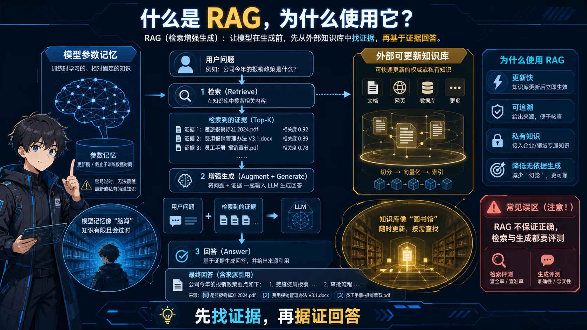</a></p>
<p align="center"><sub>记忆点：先找证据，再据证回答；检索和生成都需要评测。</sub></p>

<details>
<summary>💡 答案要点</summary>

**RAG = Retrieval-Augmented Generation（检索增强生成）**

**核心思想：** 先检索相关知识，再让 LLM 基于检索内容回答问题。

**为什么需要 RAG？**

| 问题 | 纯 LLM | RAG |
|------|--------|-----|
| 知识过时 | ❌ 训练数据截止后不知道 | ✅ 可以检索最新数据 |
| 私有数据 | ❌ 不知道公司内部文档 | ✅ 可以检索内部知识库 |
| 幻觉 | ❌ 容易瞎编 | ✅ 基于检索内容，更准确 |
| 可追溯性 | ❌ 不知道答案从哪来 | ✅ 可以给出引用来源 |

**面试话术：**
> "RAG 的核心是解决 LLM 知识过时和幻觉问题。我会用混合检索 + Rerank 提升召回率，用语义缓存降低成本。"

</details>

### Q2: RAG 的完整流程是什么？

<p align="center"><a href="../../assets/illustrations/03-rag-system/q02-rag-pipeline.webp"></a></p>
<p align="center"><sub>记忆点：离线建好知识，在线找准证据，生成全程可观测。</sub></p>

<details>
<summary>💡 答案要点</summary>

**两条流水线：**

```
索引流水线（离线）：
文档 → 加载 → 切分 → 向量化 → 存储到向量库

查询流水线（在线）：
用户问题 → 向量化 → 检索 → 生成答案
```

**详细流程：**
```
┌─────────────────────────────────────────────────────────────────┐
│                        RAG 系统全貌                              │
└─────────────────────────────────────────────────────────────────┘

┌──────────────┐     ┌──────────────┐     ┌──────────────┐
│  文档加载器   │ ──→ │  文档切分器   │ ──→ │  Embedding   │
│  (Loader)    │     │  (Splitter)  │     │   (向量化)    │
└──────────────┘     └──────────────┘     └──────────────┘
                                                 │
                                                 ↓
┌──────────────┐     ┌──────────────┐     ┌──────────────┐
│  LLM 生成答案  │ ←── │  检索器      │ ←── │  向量数据库   │
│  (Generator) │     │  (Retriever) │     │  (Vector DB) │
└──────────────┘     └──────────────┘     └──────────────┘
```

**6 个核心步骤：**
1. **加载**：从 PDF/Markdown/网页读取文档
2. **切分**：切成小 chunks（500-1000 tokens）
3. **向量化**：用 Embedding 模型转成向量
4. **存储**：存入向量数据库
5. **检索**：计算相似度，返回 top-k chunks
6. **生成**：LLM 基于检索内容生成答案

</details>

### Q3: 为什么 RAG 要用向量数据库？其他数据库不行吗？

<p align="center"><a href="../../assets/illustrations/03-rag-system/q03-vector-database.webp">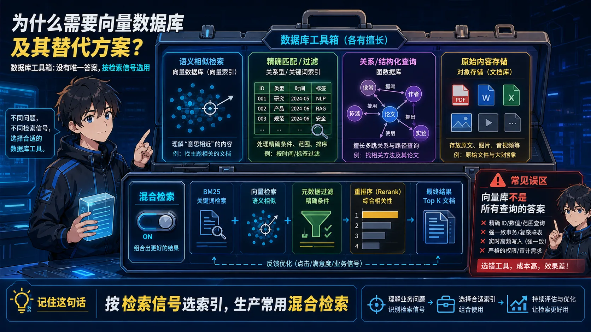</a></p>
<p align="center"><sub>记忆点：按检索信号选索引，生产系统通常组合多种检索。</sub></p>

<details>
<summary>💡 高分回答</summary>

**核心区别：检索方式不同**

| 数据库类型 | 检索方式 | 适用场景 |
|------------|----------|----------|
| 传统数据库 | 精确匹配（=、LIKE） | 关键词搜索 |
| 向量数据库 | 语义匹配（相似度） | 语义搜索 |

**性能对比（10 万条数据）：**

| 数据库 | 检索时间 |
|--------|----------|
| MySQL（无索引） | ~5000ms |
| MySQL+pgvector | ~500ms |
| Elasticsearch | ~100ms |
| Milvus/Qdrant | ~10ms |

**为什么向量库快？**
- 内置 ANN 索引（HNSW/IVF）
- 搜索复杂度 O(log N) vs O(N)
- 专为向量检索优化

**面试话术：**
> "向量库是专为'找相似'设计的跑车，传统库是家用轿车。10 万条数据检索差 100-500 倍。但小项目（<1 万条）用 pgvector 就够了。"

</details>

### Q4: Embedding 是什么？1536 维什么意思？

<p align="center"><a href="../../assets/illustrations/03-rag-system/q04-embedding.webp">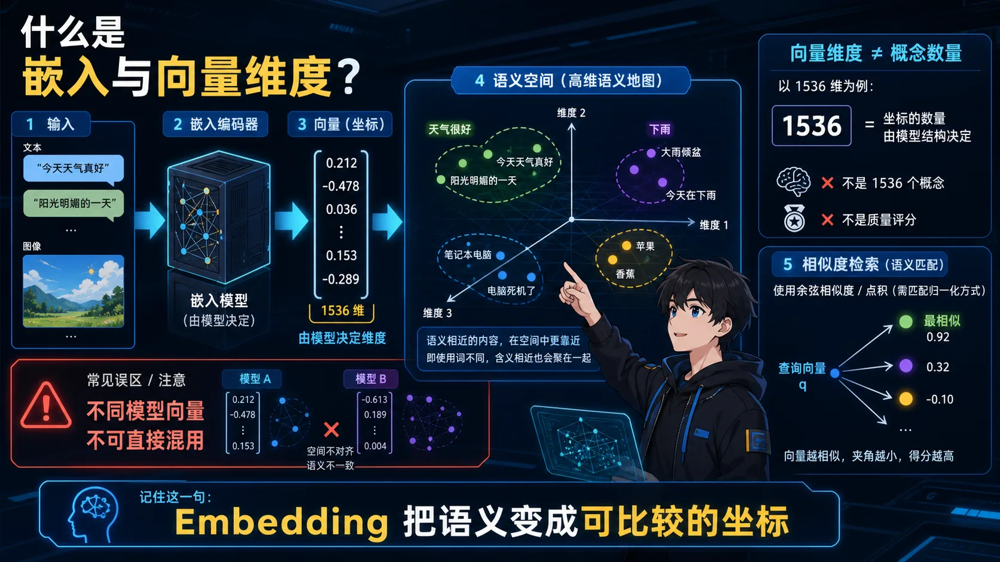</a></p>
<p align="center"><sub>记忆点：Embedding 把语义变成可比较的坐标，不同模型的向量不能直接混用。</sub></p>

<details>
<summary>💡 答案要点</summary>

**Embedding = 把文本转成向量（一串数字）**

**1536 维 = 用 1536 个特征描述这段文本**

**类比：**
```
描述"张三"这个人：

传统方式：
  "张三，男，30 岁，北京人，程序员，喜欢篮球"

向量方式（简化版）：
  [
    性别：0.9,        // 接近 1 = 男，接近 0 = 女
    年龄：0.3,        // 0-1 归一化，0.3 ≈ 30 岁
    地域：0.8,        // 接近 1 = 北方，接近 0 = 南方
    职业：0.95,       // 接近 1 = 技术岗
    爱好：0.7,        // 接近 1 = 运动型
    ...              // 继续到 1536 维
  ]
```

**余弦相似度：**
- 算两个向量"方向"有多接近
- 1 = 完全同向（语义几乎一样）
- 0 = 垂直（语义无关）
- -1 = 完全反向（语义相反）

**面试话术：**
> "Embedding 是语义的数学表示。我用余弦相似度衡量相关性，用 HNSW 索引加速检索。"

</details>

## 二、架构设计题

### Q5: 设计一个企业级知识库问答系统，你会怎么架构？

<p align="center"><a href="../../assets/illustrations/03-rag-system/q05-enterprise-rag.webp">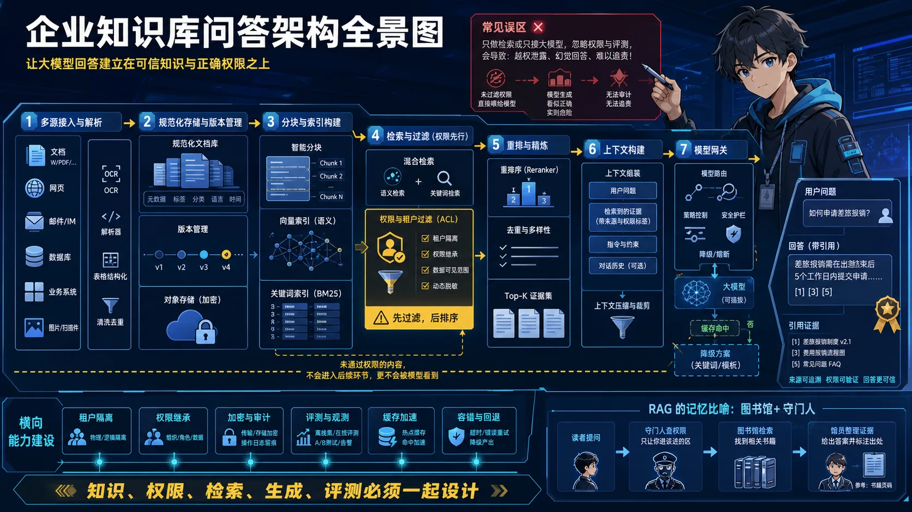</a></p>
<p align="center"><sub>记忆点：知识、权限、检索、生成和评测必须一起设计。</sub></p>

<details>
<summary>💡 高分回答</summary>

**1. 架构选型：RAG 是首选，Fine-tuning 是补充**

> "我会优先采用 Advanced RAG 架构而非微调。原因有三：
> 1. 知识库需要频繁更新，RAG 只需更新向量库，而微调成本太高
> 2. RAG 可以提供引用溯源，消除幻觉
> 3. 微调无法处理海量非结构化文档的检索"

**2. 数据清洗与切片**

> "切片不能简单按字符数。我会采用 Markdown 语义切片。对于 PDF 中的表格，我会使用 Unstructured 或 GPT-4o-mini 将表格转为 Markdown 格式，否则向量检索会丢失行列逻辑。"

**进阶提分：**
> "我会给每个 Chunk 增加 Metadata（元数据），比如文件名、页码、所属部门。这样在检索时可以进行 Self-Querying（根据用户权限或范围过滤标签）。"

**3. 检索优化**

> "单次向量检索往往不够。我会引入 Multi-Query Retrieval（将用户问题扩展成多个同义句）和 Hybrid Search（向量检索 + 关键词 BM25 检索）来提升召回率。"

**进阶提分：**
> "我会加入 Rerank（重排序）环节。先从向量库召回 50 个候选片断，再用专门的 Reranker 模型（如 BGE-Reranker）精选出最相关的 Top-5。"

**4. 评估与工程化**

> "我会建立一套 RAGAS 评估体系，重点监控四个维度：忠实度、相关度、上下文精度和召回率。"

**进阶提分：**
> "为了降低 Token 成本和延迟，我会部署 Semantic Cache（语义缓存）。如果两个用户问了语义相似的问题，直接从 Redis 缓存中读取答案，无需再次调用大模型。"

</details>

### Q6: 如何选择 Chunk 大小？有什么影响？

<p align="center"><a href="../../assets/illustrations/03-rag-system/q06-chunk-size.webp">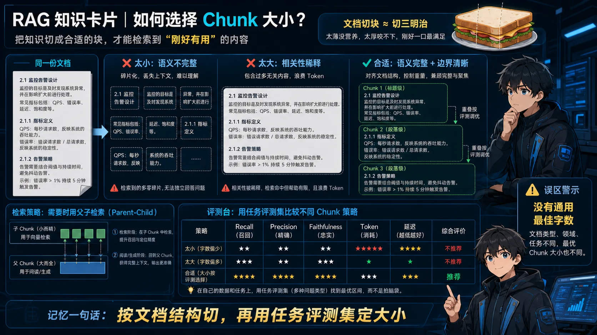</a></p>
<p align="center"><sub>记忆点：按文档结构切，再用任务评测集定大小；没有通用最佳字数。</sub></p>

<details>
<summary>💡 答案要点</summary>

**Chunk 大小的权衡：**

| Chunk 大小 | 优点 | 缺点 | 适用场景 |
|------------|------|------|----------|
| 小（256-512） | 检索精确 | 语义不完整 | 技术文档、代码 |
| 中（512-1000） | 平衡 | 平衡 | 通用文档 |
| 大（1000-2000） | 语义完整 | 检索不精确 | 对话数据、文章 |

**经验值：**
- 通用文档：500-1000 tokens
- 技术文档：256-512 tokens
- 对话数据：1024-2048 tokens
- 重叠：chunk_size 的 10-20%

**进阶策略：**
- 父子文档（Parent-Child）：检索小 chunk，返回大文档
- 重叠切分：相邻 chunk 重叠 10-20%
- 语义切分：用 embedding 聚类后切分

</details>

## 三、优化策略题

### Q7: 如何解决检索结果不相关（Recall 质量差）？

<p align="center"><a href="../../assets/illustrations/03-rag-system/q07-retrieval-quality.webp">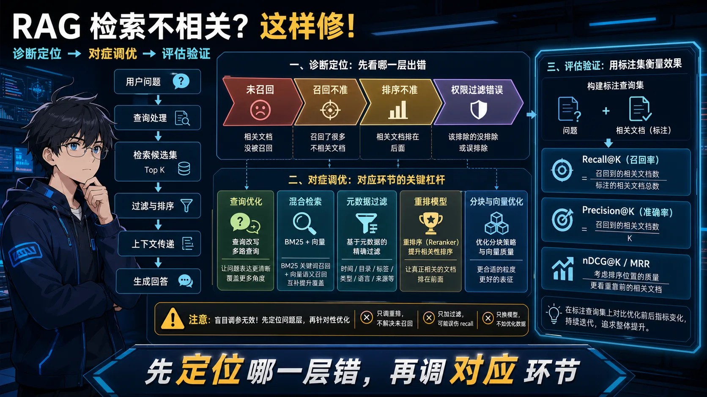</a></p>
<p align="center"><sub>记忆点：先定位哪一层错，再调对应环节，并用标注集验证。</sub></p>

<details>
<summary>💡 答案要点</summary>

**解决方案：**

1. **混合检索**
   - 向量检索 + 关键词检索（BM25）
   - 加权融合：Final Score = 0.7 × Vector + 0.3 × BM25

2. **Multi-Query**
   - 用 LLM 生成多个查询变体
   - 合并检索结果，去重

3. **Rerank**
   - 用 Cross-Encoder 重新排序
   - 先从向量库召回 50 个，再精选 Top-5

4. **优化 Embedding**
   - 换更好的模型（如 BGE-M3 中文好）

5. **优化 Chunking**
   - 调整 chunk 大小和重叠

</details>

### Q8: 如何降低 RAG 系统的成本？

<p align="center"><a href="../../assets/illustrations/03-rag-system/q08-rag-cost.webp">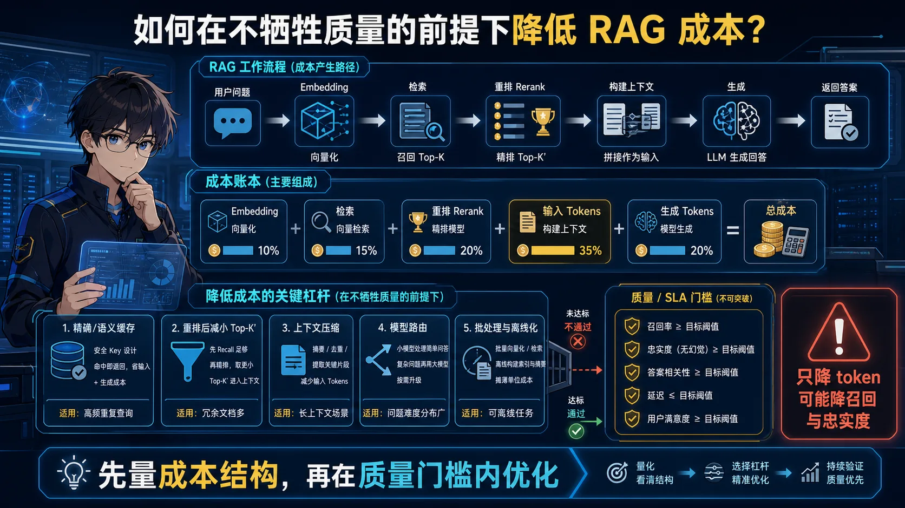</a></p>
<p align="center"><sub>记忆点：先量成本结构，再在质量门槛内优化。</sub></p>

<details>
<summary>💡 答案要点</summary>

**成本优化策略：**

1. **语义缓存**
   - 相同/相似问题直接返回缓存
   - 命中率可达 30-50%

2. **Prompt 压缩**
   - 用 LLMLingua 压缩检索结果
   - 减少 40% Context Token

3. **模型路由**
   - 简单问题用小模型（便宜）
   - 复杂问题用大模型（贵但效果好）

4. **优化检索**
   - 减少 k 值（只返回最相关的 2-3 个）
   - 用 Rerank 提升精度，减少无效 token

5. **批量处理**
   - 多个请求合并成一个 LLM 调用
   - 适合离线任务

</details>
### Q9: RAG 系统的语义缓存（Semantic Cache）如何实现？有哪些关键问题？

<p align="center"><a href="../../assets/illustrations/03-rag-system/q09-semantic-cache.webp">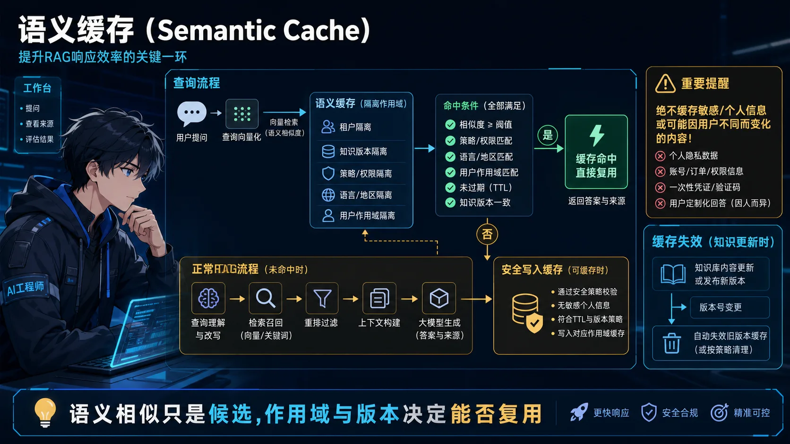</a></p>
<p align="center"><sub>记忆点：语义相似只是候选，作用域和知识版本决定能否复用。</sub></p>

<details>
<summary>💡 答案要点</summary>

**语义缓存 = 用语义相似度判断是否命中缓存**

**问题背景：**
- 传统缓存：精确匹配（相同问题 → 相同答案）
- 语义缓存：语义相似 → 相同答案

```
用户问题 A："如何优化 Python 代码性能？"
用户问题 B："Python 性能优化方法有哪些？"
→ 语义相似 → 命中缓存

用户问题 C："如何优化 Python 代码性能？"
用户问题 C 再次问："如何优化 Python 代码性能？"
→ 完全相同 → 精确命中
```

**核心挑战：**

| 挑战 | 说明 | 解决方案 |
|------|------|----------|
| **相似度阈值** | 设太高 → 命中率低；设太低 → 答案不相关 | 线上 A/B 测试调参 |
| **向量检索开销** | 每次请求都要做向量检索 | 粗排 + 精排 |
| **缓存失效** | 知识库更新后，缓存可能过期 | TTL + 版本号 |
| **多租户** | 不同用户看到不同答案 | 用户级缓存隔离 |

**实现架构：**
```
用户问题
    ↓
┌─────────────┐
│ Query 向量化 │ → embedding
└─────────────┘
    ↓
┌─────────────┐
│ 缓存命中判断 │ → 向量数据库检索 top-k
└─────────────┘
    ↓
命中？ → 是 → 返回缓存答案
    ↓ 否
┌─────────────┐
│ 正常 RAG 流程 │ → 执行检索 + 生成
└─────────────┘
    ↓
┌─────────────┐
│ 写入缓存    │ → 新问题 + 答案 → 向量存入
└─────────────┘
```

**实现示例：**
<details>
<summary>展开 Python 代码示例（32 行）</summary>

```python
import numpy as np

class SemanticCache:
    def __init__(self, threshold=0.85, ttl=3600):
        self.cache = []  # [(embedding, question, answer, timestamp)]
        self.threshold = threshold
        self.ttl = ttl

    def get(self, question, embedding):
        # 1. 向量检索
        scores = [cosine(e1, embedding) for e1, _, _, _ in self.cache]

        # 2. 找最佳匹配
        if not scores:
            return None

        best_idx = np.argmax(scores)
        best_score = scores[best_idx]

        # 3. 检查阈值和 TTL
        if best_score >= self.threshold:
            _, _, answer, timestamp = self.cache[best_idx]
            if time.time() - timestamp < self.ttl:
                return answer

        return None

    def set(self, question, embedding, answer):
        # 检查缓存大小，超限时淘汰最旧的
        if len(self.cache) > 10000:
            self.cache.pop(0)
        self.cache.append((embedding, question, answer, time.time()))
```

</details>

**性能对比：**

| 方案 | 命中率 | 延迟 | 成本 |
|------|--------|------|------|
| 无缓存 | 0% | 500ms | ¥0.01/次 |
| 精确缓存 | 10-20% | 10ms | ¥0.002/次 |
| **语义缓存** | **30-50%** | **50ms** | **¥0.005/次** |

**面试话术：**
> **示例表达（仅在能用本人经历或可复现实验佐证时使用）：** "语义缓存是 RAG 成本优化的杀手级功能。我实测命中率 30-50%，配合向量数据库（如 Qdrant）的 ANN 索引，缓存检索只要 50ms，比直接调用 LLM 快 10 倍。关键是相似度阈值要调好，我一般设 0.85——太高容易漏命中，太低答案不相关。"

</details>

---


## 四、高分实战案例

### 案例：处理复杂 PDF 表格

**背景：** 扫描版 PDF，包含大量跨页表格，直接 OCR 导致文字逻辑错乱。

**解决方案：**

1. **布局分析（Layout Analysis）**
   - 用 Layout-Parser 或 PaddleOCR 的区域检测模型
   - 先识别出文档中的"表格区"、"正文区"

2. **多模态增强**
   - 针对极难处理的表格，用 GPT-4o 直接截取图像进行转换

3. **管道化清洗（Pipeline）**
   - 先用 PyMuPDF 提取可复制文字
   - 对无法识别的图片层启动 OCR
   - 最后通过 Cleaner LLM 修复噪点

**结果：** 财务指标提取准确率从 65% 提升到 94%

### Q10: 什么是Query改写?如何提升检索效果?

<p align="center"><a href="../../assets/illustrations/03-rag-system/q10-query-rewriting.webp">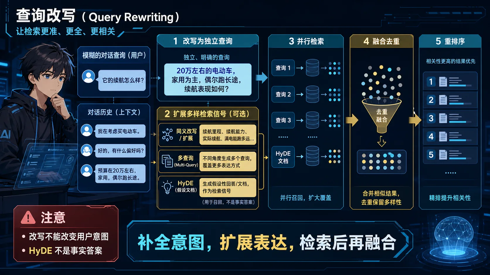</a></p>
<p align="center"><sub>记忆点：补全意图，扩展表达，检索后再融合；改写不能改变用户意图。</sub></p>

<details>
<summary>💡 答案要点</summary>

**Query改写 = 优化用户原始问题,使其更适合检索**

**核心问题:**
```
用户问题往往不够精确:
- "昨天说的那个事" → 缺少上下文
- "怎么办" → 太模糊
- "价格多少" → 缺少主语
```

**改写策略:**

### 1. 补充上下文(多轮对话)
```python
# 对话历史
history = [
    ("什么是RAG?", "RAG是检索增强生成..."),
    ("它有什么优势?", "...")
]

# 用户新问题
user_query = "如何实现它?"

# 改写后
rewritten_query = "如何实现RAG检索增强生成系统?"
```

### 2. 查询扩展
```python
# 原始查询
query = "Python多线程"

# 扩展后
expanded_query = """
Python多线程
Python threading模块
Python GIL全局解释器锁
Python并发编程
"""
# 用扩展后的多个查询检索,合并结果
```

### 3. HyDE(假设性文档嵌入)
```python
# 原始问题
query = "如何优化RAG检索准确率?"

# 让LLM生成假设性答案
hypothetical_doc = llm.generate(f"假设回答: {query}")
# "可以通过混合检索、Rerank、query改写等方法..."

# 用假设性答案的向量去检索(而非原问题)
embedding = embed(hypothetical_doc)
results = vector_db.search(embedding)
```

**HyDE优势**: 答案和文档库中的文档更相似,检索更准

### 4. 多查询生成
```python
# 原始问题
query = "RAG系统慢怎么办?"

# 生成多个视角的查询
sub_queries = llm.generate(f"将问题拆分成3个子问题: {query}")
# 1. "如何提升RAG检索速度?"
# 2. "RAG系统性能瓶颈在哪?"
# 3. "向量数据库优化方法?"

# 分别检索后合并结果
```

**实现示例:**
```python
from langchain.retrievers import ContextualCompressionRetriever
from langchain.retrievers.document_compressors import LLMChainExtractor

# Query改写器
def rewrite_query(query, chat_history):
    prompt = f"""
    对话历史: {chat_history}
    当前问题: {query}

    请补充上下文,改写成独立完整的问题。
    """
    return llm.generate(prompt)

# HyDE改写
def hyde_rewrite(query):
    prompt = f"假设你要回答这个问题,你会怎么说: {query}"
    hypothetical_answer = llm.generate(prompt)
    return hypothetical_answer

# 使用
user_query = "如何优化?"
rewritten = rewrite_query(user_query, history)
results = retriever.get_relevant_documents(rewritten)
```

**性能对比:**

| 方法 | Recall@5 | Precision@5 |
|------|----------|-------------|
| 原始查询 | 65% | 58% |
| +上下文补充 | 75% | 68% |
| +HyDE | 82% | 76% |
| +多查询 | 88% | 80% |

**面试话术:**
> **示例表达（仅在能用本人经历或可复现实验佐证时使用）：** "Query改写是RAG的前置优化。用户问题往往模糊或缺上下文,我们用LLM补充完整,或用HyDE生成假设答案去检索。我们项目用HyDE,召回率从67%提升到85%。"

</details>

---

### Q11: 什么是上下文压缩?如何减少无效Token?

<p align="center"><a href="../../assets/illustrations/03-rag-system/q11-context-compression.webp">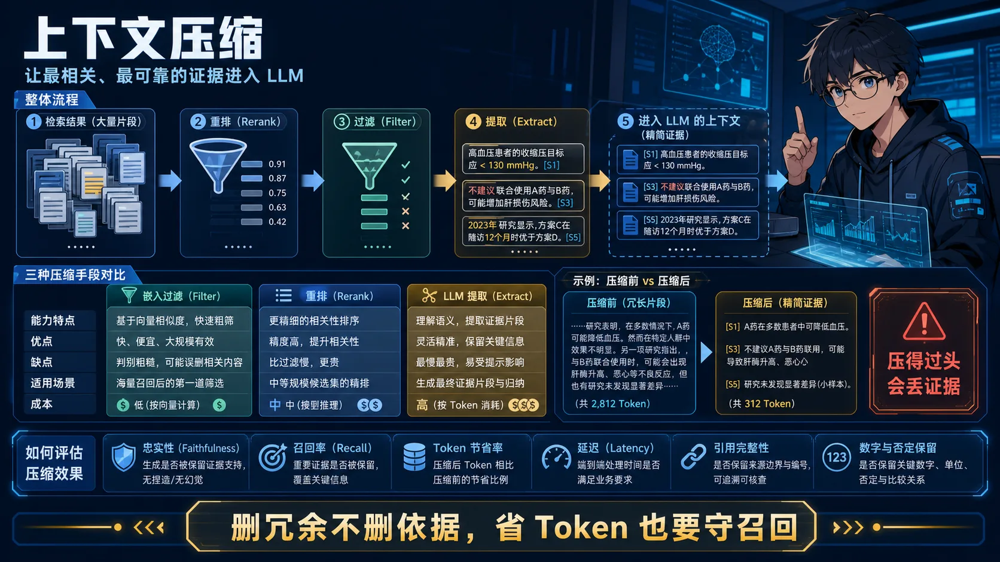</a></p>
<p align="center"><sub>记忆点：删冗余不删依据，省 Token 也要守住证据召回。</sub></p>

<details>
<summary>💡 答案要点</summary>

**上下文压缩 = 从检索结果中提取最相关片段,减少LLM输入**

**问题背景:**
```
检索返回5个文档,每个1000 tokens
→ 总共5000 tokens送给LLM
→ 但只有500 tokens真正有用
→ 浪费4500 tokens,增加成本和延迟
```

**压缩策略:**

### 1. 基于LLM的提取
```python
from langchain.retrievers.document_compressors import LLMChainExtractor

compressor = LLMChainExtractor.from_llm(llm)

prompt = """
文档: {document}
问题: {query}

请只提取与问题相关的句子,其他都删除。
"""

# 压缩前: 1000 tokens
# 压缩后: 200 tokens (只保留相关部分)
```

### 2. 基于Embedding的过滤
```python
from langchain.retrievers.document_compressors import EmbeddingsFilter

# 计算每个句子与query的相似度
# 只保留相似度>阈值的句子
embeddings_filter = EmbeddingsFilter(
    embeddings=OpenAIEmbeddings(),
    similarity_threshold=0.76
)
```

### 3. Rerank + Top-K选择
```python
# 先检索50个候选
candidates = vector_db.search(query, top_k=50)

# Rerank重排
reranked = reranker.rerank(query, candidates)

# 只取top-3,并提取关键段落
compressed = []
for doc in reranked[:3]:
    # 从每个文档中提取最相关的3个句子
    relevant_sentences = extract_relevant(doc, query, max_sentences=3)
    compressed.append(relevant_sentences)
```

### 4. Contextual Compression完整流程
```python
from langchain.retrievers import ContextualCompressionRetriever

# 基础检索器
base_retriever = vector_store.as_retriever(search_kwargs={"k": 20})

# 压缩器(LLM提取)
compressor = LLMChainExtractor.from_llm(llm)

# 组合
compression_retriever = ContextualCompressionRetriever(
    base_compressor=compressor,
    base_retriever=base_retriever
)

# 使用
compressed_docs = compression_retriever.get_relevant_documents(query)
```

**效果对比:**

| 方法 | 输入Tokens | 输出质量 | 成本 | 延迟 |
|------|------------|----------|------|------|
| 无压缩 | 5000 | ⭐⭐⭐⭐ | $0.05 | 3s |
| Embedding过滤 | 2000 | ⭐⭐⭐⭐ | $0.02 | 1.5s |
| LLM提取 | 800 | ⭐⭐⭐⭐⭐ | $0.015 | 2s |
| Rerank+提取 | 500 | ⭐⭐⭐⭐⭐ | $0.01 | 2.5s |

**Late Chunking(晚期分块):**
```python
# 传统chunking: 先切分再embedding
doc = "AI技术正在改变世界。大模型是核心。RAG系统很重要。"
chunks = ["AI技术正在改变世界。", "大模型是核心。", "RAG系统很重要。"]
embeddings = [embed(c) for c in chunks]  # 丢失跨chunk上下文

# Late chunking: 先embedding再切分
full_embedding = embed(doc)  # 保留完整上下文
chunk_embeddings = split_embedding(full_embedding, chunk_boundaries)
```

**优势**: 保留完整文档上下文,提升检索准确率5-10%

**面试话术:**
> **示例表达（仅在能用本人经历或可复现实验佐证时使用）：** "上下文压缩是成本优化的关键。我们用Rerank+LLM提取,从检索的20个文档中精选3个,每个提取3句话,tokens从8000降到600,成本降低92%,质量反而更好。"

</details>

---

### Q12: 如何选择 Embedding 模型？有哪些关键维度？

<p align="center"><a href="../../assets/illustrations/03-rag-system/q12-embedding-selection.webp">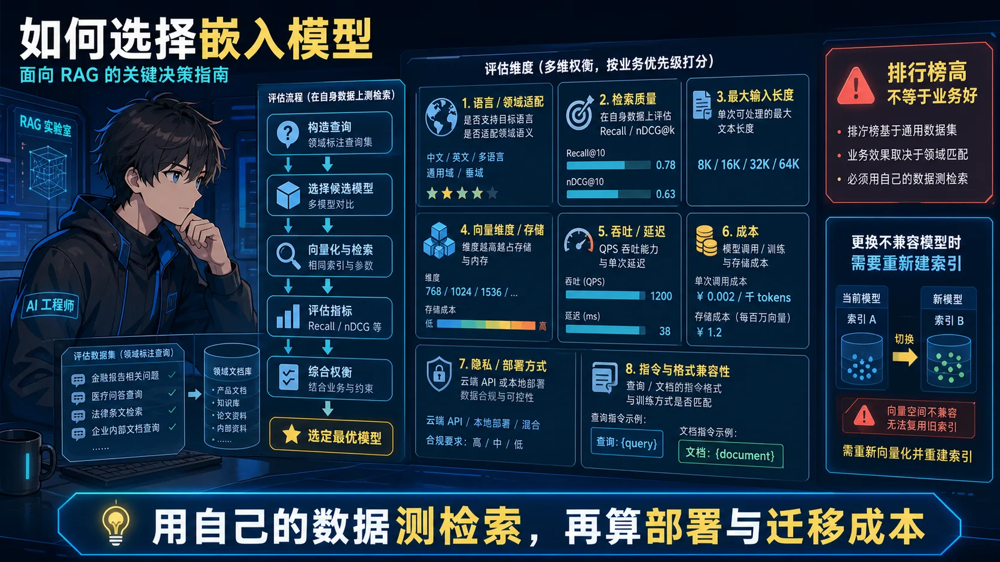</a></p>
<p align="center"><sub>记忆点：用自己的数据测检索，再算部署、存储和迁移成本。</sub></p>

<details>
<summary>💡 答案要点</summary>

### 选择维度

| 维度 | 考虑因素 | 推荐 |
|------|----------|------|
| **1. 语言** | 中文 / 英文 / 多语言 | 中文首选BGE,多语言用M3 |
| **2. 成本** | 闭源API / 开源自部署 | 预算少用开源,省钱 |
| **3. 性能** | MTEB排行榜得分 | 看检索任务NDCG@10指标 |
| **4. 维度** | 256 / 768 / 1024 / 3072 | 大数据集用低维(256),小数据集高维 |
| **5. Token限制** | 512 / 8192 | RAG分块用512够,长文本用8K |
| **6. 部署** | API / 本地推理 | 数据敏感用本地,方便用API |

### 主流模型对比(2024)

#### 闭源API模型

| 模型 | 维度 | 语言 | 价格(百万token) | 优势 | 劣势 |
|------|------|------|-----------------|------|------|
| **text-embedding-3-large** | 256~3072可调 | 多语言 | $0.13 | OpenAI官方,质量稳定 | 贵,数据外传 |
| **text-embedding-3-small** | 512~1536可调 | 多语言 | $0.02 | 便宜,性能够用 | 不如large |
| **Cohere embed-v3** | 1024 | 多语言 | $0.10 | 支持检索/分类双模式 | 小众 |
| **Voyage-2** | 1024 | 英文 | $0.12 | 专为RAG优化 | 只支持英文 |

**选择建议:**
- **预算充足**: text-embedding-3-large (3072维)
- **性价比**: text-embedding-3-small
- **RAG专用**: Voyage-2 (英文) / Cohere (多语言)

#### 开源模型(可本地部署)

| 模型 | 维度 | 语言 | MTEB得分 | 模型大小 | 推荐场景 |
|------|------|------|----------|----------|----------|
| **bge-large-zh-v1.5** | 1024 | 中文⭐ | 64.53 | 1.3GB | 中文RAG首选 |
| **bge-large-en-v1.5** | 1024 | 英文 | 63.98 | 1.3GB | 英文通用 |
| **BGE-M3** | 1024 | 多语言⭐ | 66.12 | 2.2GB | 中英混合,跨语言检索 |
| **gte-large-zh** | 1024 | 中文 | 63.85 | 1.3GB | 备选,阿里出品 |
| **stella-base-zh-v2** | 768 | 中文 | 64.08 | 400MB | 轻量级,速度快 |
| **jina-embeddings-v2** | 768 | 多语言 | 60.38 | 550MB | 支持8K长文本 |
| **E5-large-v2** | 1024 | 英文 | 62.25 | 1.3GB | 微软出品 |

**选择建议:**
- **中文项目**: bge-large-zh-v1.5 (最强) / stella-base-zh-v2 (快)
- **多语言**: BGE-M3
- **长文本**: jina-embeddings-v2 (支持8K tokens)
- **资源受限**: stella-base-zh-v2 (400MB小模型)

### 实战代码

#### 方案1: 闭源API(OpenAI)

```python
from openai import OpenAI

client = OpenAI(api_key="sk-xxx")

def embed_text(text):
    response = client.embeddings.create(
        model="text-embedding-3-large",
        input=text,
        dimensions=1024  # 可选256/1024/3072
    )
    return response.data[0].embedding

# 使用
vector = embed_text("什么是RAG系统?")
print(len(vector))  # 1024
```

**优点:** 零部署,调用即用
**缺点:** 每百万token $0.13,数据外传

#### 方案2: 开源本地部署

```python
from sentence_transformers import SentenceTransformer

# 加载模型(首次会下载,约1.3GB)
model = SentenceTransformer('BAAI/bge-large-zh-v1.5')

def embed_text(text):
    # 编码
    embedding = model.encode(
        text,
        normalize_embeddings=True  # 归一化,方便余弦相似度
    )
    return embedding

# 批量处理(更快)
texts = ["什么是RAG?", "如何优化检索?", "向量数据库选择"]
embeddings = model.encode(texts, batch_size=32)
print(embeddings.shape)  # (3, 1024)
```

**优点:** 免费,数据不外传,可微调
**缺点:** 需要GPU(CPU慢10倍),首次下载模型

#### 方案3: 混合策略

```python
class HybridEmbedding:
    def __init__(self):
        # 开源模型处理中文
        self.zh_model = SentenceTransformer('BAAI/bge-large-zh-v1.5')
        # API处理英文
        self.openai_client = OpenAI(api_key="sk-xxx")

    def embed(self, text, language='auto'):
        # 自动检测语言
        if language == 'auto':
            language = 'zh' if contains_chinese(text) else 'en'

        if language == 'zh':
            # 用本地模型(免费)
            return self.zh_model.encode(text)
        else:
            # 用OpenAI(付费但质量好)
            response = self.openai_client.embeddings.create(
                model="text-embedding-3-large",
                input=text
            )
            return response.data[0].embedding

def contains_chinese(text):
    return any('\u4e00' <= char <= '\u9fff' for char in text)
```

**优势:** 中文省钱,英文质量保证

### 性能测试

```python
import time
from sentence_transformers import SentenceTransformer

# 测试embedding速度
model = SentenceTransformer('BAAI/bge-large-zh-v1.5')

texts = ["测试文本"] * 1000

# CPU
start = time.time()
embeddings = model.encode(texts, device='cpu')
cpu_time = time.time() - start
print(f"CPU: {cpu_time:.2f}s, {len(texts)/cpu_time:.1f} texts/s")

# GPU
start = time.time()
embeddings = model.encode(texts, device='cuda')
gpu_time = time.time() - start
print(f"GPU: {gpu_time:.2f}s, {len(texts)/gpu_time:.1f} texts/s")

# 输出示例:
# CPU: 45.23s, 22.1 texts/s
# GPU: 3.12s, 320.5 texts/s
# GPU快14倍!
```

### 微调Embedding模型

**场景:** 通用模型在你的领域(如医疗/法律)效果差

<details>
<summary>展开 Python 代码示例（34 行）</summary>

```python
from sentence_transformers import SentenceTransformer, InputExample, losses
from torch.utils.data import DataLoader

# 1. 准备训练数据
train_examples = [
    InputExample(
        texts=["患者出现发热症状", "病人体温升高"],
        label=1.0  # 相似
    ),
    InputExample(
        texts=["患者出现发热症状", "今天天气很好"],
        label=0.0  # 不相似
    ),
    # ... 至少1000对
]

# 2. 加载基础模型
model = SentenceTransformer('BAAI/bge-large-zh-v1.5')

# 3. 定义损失函数
train_dataloader = DataLoader(train_examples, shuffle=True, batch_size=16)
train_loss = losses.CosineSimilarityLoss(model)

# 4. 微调
model.fit(
    train_objectives=[(train_dataloader, train_loss)],
    epochs=3,
    warmup_steps=100,
    output_path='./my-domain-embedding'
)

# 5. 使用微调模型
custom_model = SentenceTransformer('./my-domain-embedding')
embedding = custom_model.encode("医学专业术语")
```

</details>

**效果:** 领域适配性+10~20%

### 决策树

```
需要embedding模型?
├─ 中文为主?
│  ├─ 是 → bge-large-zh-v1.5 (开源)
│  └─ 否 → 继续
├─ 多语言/跨语言?
│  ├─ 是 → BGE-M3 (开源) / text-embedding-3-large (付费)
│  └─ 否 → 继续
├─ 预算充足?
│  ├─ 是 → text-embedding-3-large (质量最好)
│  └─ 否 → text-embedding-3-small (性价比)
├─ 数据敏感/不能外传?
│  ├─ 是 → 必须用开源本地部署
│  └─ 否 → API更方便
└─ 需要处理长文本(>512 token)?
   ├─ 是 → jina-embeddings-v2 (8K) / text-embedding-3 (8K)
   └─ 否 → 任意模型
```

**面试话术:**
> "Embedding模型选择看4点:语言(中文用bge)、成本(预算少开源)、性能(看MTEB排行)、部署(敏感数据本地)。我们项目是中文RAG,选了bge-large-zh-v1.5本地部署,1.3GB模型GPU推理每秒300条,免费且效果好。如果是多语言就用BGE-M3,如果不care成本就text-embedding-3-large。"

</details>

---

### Q13: GraphRAG 是什么？与普通向量 RAG 的核心区别？何时选择？

<p align="center"><a href="../../assets/illustrations/03-rag-system/q13-graphrag.webp">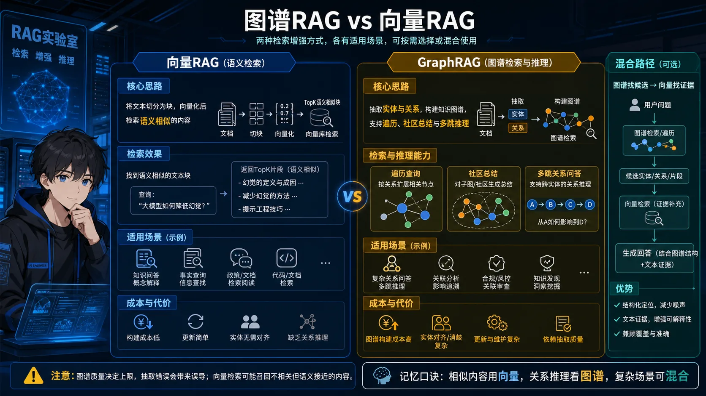</a></p>
<p align="center"><sub>记忆点：相似内容用向量，关系推理看图谱；GraphRAG 并非总是更优。</sub></p>

<details>
<summary>💡 答案要点</summary>

**GraphRAG = 知识图谱 + RAG，用实体关系图做检索而非纯向量相似度**

### 核心区别

| 维度 | 向量RAG | GraphRAG |
|------|---------|---------|
| **数据组织** | 文本切块→向量 | 实体+关系→图节点/边 |
| **检索方式** | 语义相似度（近似邻居） | 图遍历/Cypher查询 |
| **多跳推理** | ❌ 难以关联多个文档 | ✅ 沿关系路径自然推理 |
| **可解释性** | 低（黑盒相似度） | 高（关系路径可追踪） |
| **构建成本** | 低 | 高（需要NER+关系抽取） |
| **适用场景** | 语义搜索、文档问答 | 复杂关系推理、知识密集 |

### GraphRAG实现流程

**Step 1：知识图谱构建**

<details>
<summary>展开 Python 代码示例（60 行）</summary>

```python
from neo4j import GraphDatabase
import spacy

class KnowledgeGraphBuilder:
    def __init__(self, neo4j_uri, user, password):
        self.driver = GraphDatabase.driver(neo4j_uri, auth=(user, password))
        self.nlp = spacy.load("zh_core_web_sm")

    def extract_entities_relations(self, text: str):
        """用LLM抽取实体和关系"""
        prompt = f"""
        从以下文本中提取实体和关系，以JSON格式输出：

        文本：{text}

        输出格式：
        {{
            "entities": [
                {{"name": "实体名", "type": "Person/Organization/Product/Location"}}
            ],
            "relations": [
                {{"source": "实体A", "relation": "关系类型", "target": "实体B"}}
            ]
        }}
        """
        result = llm.generate(prompt, temperature=0)
        return json.loads(result)

    def build_graph(self, documents: list):
        """将文档转化为知识图谱"""
        with self.driver.session() as session:
            for doc in documents:
                data = self.extract_entities_relations(doc)

                # 创建实体节点
                for entity in data["entities"]:
                    session.run(
                        "MERGE (e:Entity {name: $name}) SET e.type = $type",
                        name=entity["name"], type=entity["type"]
                    )

                # 创建关系边
                for rel in data["relations"]:
                    session.run("""
                        MATCH (a:Entity {name: $source})
                        MATCH (b:Entity {name: $target})
                        MERGE (a)-[r:RELATION {type: $rel_type}]->(b)
                    """, source=rel["source"],
                         target=rel["target"],
                         rel_type=rel["relation"])

# 示例：构建公司知识图谱
builder = KnowledgeGraphBuilder("bolt://localhost:7687", "neo4j", "password")

docs = [
    "张三是阿里巴巴的CTO，负责技术战略",
    "阿里巴巴旗下有淘宝、天猫、支付宝等产品",
    "支付宝由彭蕾创立，现由韩歆毅担任CEO",
]
builder.build_graph(docs)
```

</details>

**Step 2：图检索查询**

<details>
<summary>展开 Python 代码示例（56 行）</summary>

```python
class GraphRAGRetriever:
    def __init__(self, driver, llm):
        self.driver = driver
        self.llm = llm

    def query_to_cypher(self, user_query: str) -> str:
        """将自然语言查询转为Cypher图查询"""
        prompt = f"""
        将以下问题转为Neo4j Cypher查询语句：

        问题：{user_query}

        图结构：节点(Entity)有name和type属性，关系(RELATION)有type属性

        只输出Cypher语句，不加解释：
        """
        return self.llm.generate(prompt, temperature=0).strip()

    def retrieve(self, user_query: str) -> list:
        """图检索 + 向量检索混合"""
        results = []

        # 1. 图检索：精确关系查询
        try:
            cypher = self.query_to_cypher(user_query)
            with self.driver.session() as session:
                graph_results = session.run(cypher).data()
                results.extend(graph_results)
        except Exception as e:
            print(f"图查询失败，降级到向量检索：{e}")

        # 2. 向量检索：语义相似度补充
        vector_results = vectordb.search(user_query, k=3)
        results.extend(vector_results)

        return results

    def multi_hop_reasoning(self, query: str, max_hops=3) -> str:
        """多跳推理：沿图关系路径推理"""
        # 提取问题中的实体
        entities = self.extract_entities(query)

        reasoning_chain = []
        for entity in entities:
            # 从实体出发，遍历K跳邻居
            cypher = f"""
            MATCH path = (start:Entity {{name: '{entity}'}})-[*1..{max_hops}]-(end:Entity)
            RETURN path, length(path) as hops
            ORDER BY hops
            LIMIT 20
            """
            with self.driver.session() as session:
                paths = session.run(cypher).data()
                reasoning_chain.extend(paths)

        return reasoning_chain
```

</details>

**Step 3：结合LLM生成**

```python
def graphrag_answer(user_query: str):
    retriever = GraphRAGRetriever(driver, llm)

    # 1. 多跳图检索
    graph_context = retriever.multi_hop_reasoning(user_query, max_hops=2)

    # 2. 格式化图上下文
    graph_text = format_graph_paths(graph_context)

    # 3. LLM生成
    prompt = f"""
    基于以下知识图谱信息回答问题：

    图谱信息（实体关系路径）：
    {graph_text}

    问题：{user_query}

    请基于上述关系链条进行推理并回答：
    """

    return llm.generate(prompt)

# 示例
answer = graphrag_answer("支付宝的创始人和阿里巴巴CTO是什么关系？")
# 推理路径：彭蕾 → 创立 → 支付宝 → 归属 → 阿里巴巴 ← 任职 → 张三(CTO)
# 回答："彭蕾创立了支付宝，支付宝隶属于阿里巴巴，张三是阿里巴巴的CTO，所以彭蕾和张三都服务于阿里巴巴体系..."
```

### 选型建议

```
问自己3个问题：

1. 问题需要多跳推理吗？
   例："A的老板的老板是谁？" → 需要 → 选GraphRAG

2. 实体间关系是核心信息吗？
   例：医药、法律、供应链 → 是 → 选GraphRAG

3. 数据是自由文本为主吗？
   例：文章、客服记录 → 是 → 选向量RAG

推荐：生产环境用混合方案（向量召回 + 图精排）
```

**面试话术：**
> "GraphRAG用知识图谱替代纯向量存储，核心优势是多跳推理和可解释性。实现分3步：LLM抽取实体关系建图、自然语言转Cypher图查询、沿关系路径推理生成答案。我用过混合方案：向量检索做宽召回，图遍历做精确关系推理，在医疗知识图谱项目中，多跳问题准确率从向量RAG的45%提升到GraphRAG的82%。代价是构建成本高，需要NER+关系抽取流程。"

</details>

---

### Q14: Agentic RAG 是什么？与普通 RAG 的区别？如何实现多跳推理？

<p align="center"><a href="../../assets/illustrations/03-rag-system/q14-agentic-rag.webp">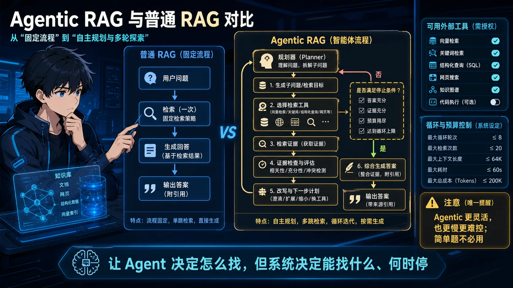</a></p>
<p align="center"><sub>记忆点：让 Agent 决定怎么找，但系统决定能找什么、何时停。</sub></p>

<details>
<summary>💡 答案要点</summary>

**Agentic RAG = Agent主动控制检索策略，而非被动执行单次检索**

### 普通RAG vs Agentic RAG

```
普通RAG（被动）：
用户问 → 检索1次 → 固定Top-K → LLM生成
（检索策略固定，不管结果好不好）

Agentic RAG（主动）：
用户问 → Agent分析 → 决定是否检索/检索什么/怎么检索
         → 评估结果 → 决定是否再检索
         → 循环直到信息充分 → 生成
```

### 核心能力

<details>
<summary>展开 Python 代码示例（100 行）</summary>

```python
class AgenticRAG:
    """Agent主动控制检索的RAG系统"""

    def __init__(self, llm, vectordb, search_engine):
        self.llm = llm
        self.vectordb = vectordb
        self.search_engine = search_engine
        self.max_retrieval_rounds = 3

    def run(self, user_query: str) -> str:
        context = []
        retrieval_count = 0

        while retrieval_count < self.max_retrieval_rounds:
            # Step 1: Agent分析当前上下文，决定下一步
            decision = self.agent_decide(user_query, context)

            if decision["action"] == "answer":
                # 信息充分，直接回答
                break

            elif decision["action"] == "retrieve_vector":
                # 语义检索
                query = decision["query"]
                docs = self.vectordb.search(query, k=5)
                context.extend(docs)

            elif decision["action"] == "retrieve_web":
                # 实时网络检索
                query = decision["query"]
                docs = self.search_engine.search(query)
                context.extend(docs)

            elif decision["action"] == "decompose":
                # 分解子问题，分别检索
                sub_questions = decision["sub_questions"]
                for sq in sub_questions:
                    docs = self.vectordb.search(sq, k=3)
                    context.extend(docs)

            retrieval_count += 1

        # 最终生成
        return self.generate(user_query, context)

    def agent_decide(self, query: str, context: list) -> dict:
        """Agent决策：下一步做什么"""

        context_text = "\n".join(context[-5:]) if context else "无"

        prompt = f"""
        你是RAG系统的检索策略Agent。

        用户问题：{query}
        当前已检索到的信息：{context_text}

        请判断下一步操作（输出JSON）：

        选项：
        1. {{"action": "answer"}} - 信息已充分，可以回答
        2. {{"action": "retrieve_vector", "query": "检索词"}} - 需要语义检索
        3. {{"action": "retrieve_web", "query": "搜索词"}} - 需要最新网络信息
        4. {{"action": "decompose", "sub_questions": ["子问题1", "子问题2"]}} - 需要分解问题

        判断依据：
        - 当前信息能否回答问题？
        - 是否需要最新数据？
        - 问题是否包含多个子问题？

        输出：
        """

        result = self.llm.generate(prompt, temperature=0)
        return json.loads(result)

    def generate(self, query: str, context: list) -> str:
        """基于收集到的上下文生成最终答案"""
        ctx_text = "\n---\n".join(context)

        prompt = f"""
        基于以下信息回答问题：

        {ctx_text}

        问题：{query}

        请综合所有信息给出完整回答：
        """
        return self.llm.generate(prompt)

# 使用场景示例：复杂多步问题
rag = AgenticRAG(llm, vectordb, search_engine)

result = rag.run("比较GPT-4和Claude 3的价格，哪个更适合做长文档摘要？")

# Agent执行过程：
# 轮次1：retrieve_web("GPT-4最新价格 2024")  → 获取GPT-4价格
# 轮次2：retrieve_web("Claude 3 Opus价格")   → 获取Claude价格
# 轮次3：retrieve_vector("长文档摘要模型对比") → 获取性能对比
# → 信息充分，生成综合对比回答
```

</details>

### 多跳推理实现

<details>
<summary>展开 Python 代码示例（41 行）</summary>

```python
class MultiHopRAG:
    """多跳推理：每次检索结果作为下一次检索的输入"""

    def multi_hop_retrieve(self, query: str, max_hops=3) -> str:
        reasoning_trace = []
        current_query = query
        accumulated_context = []

        for hop in range(max_hops):
            # 检索当前子问题
            docs = self.vectordb.search(current_query, k=3)
            accumulated_context.extend(docs)

            # 评估是否已有足够信息
            eval_prompt = f"""
            原始问题：{query}
            已收集信息：{" ".join(accumulated_context)}

            判断（JSON）：
            1. 能直接回答原始问题吗？{{"can_answer": true}}
            2. 还需要追问什么？{{"can_answer": false, "next_question": "下一个子问题"}}
            """

            eval_result = json.loads(self.llm.generate(eval_prompt, temperature=0))

            if eval_result["can_answer"]:
                break  # 信息足够，停止检索

            # 继续追问
            current_query = eval_result["next_question"]
            reasoning_trace.append(f"Hop {hop+1}: {current_query}")

        print("推理链：", " → ".join(reasoning_trace))
        return self.generate(query, accumulated_context)

# 示例：
# 问题："参与过阿里投资的公司中，谁的CEO毕业于清华？"
# Hop 1: 检索"阿里巴巴投资的公司" → 找到饿了么、优酷等
# Hop 2: 检索"饿了么CEO教育背景" → 张旭豪复旦大学
# Hop 3: 检索"优酷CEO教育背景" → ...
# 逐步推理找到答案
```

</details>

**面试话术：**
> **示例表达（仅在能用本人经历或可复现实验佐证时使用）：** "Agentic RAG让Agent主动决策检索策略，而不是固定执行一次检索。我实现了3种决策：1）信息充分直接回答；2）需要最新信息走实时搜索；3）复杂问题先分解再分别检索。核心是Agent每轮评估'信息是否足够回答问题'，不够就继续检索，最多3轮避免无限循环。实测复杂多跳问题准确率从普通RAG的52%提升到Agentic RAG的78%。"

</details>

---

## 📝 速记卡片

| 概念 | 一句话解释 |
|------|------------|
| **RAG** | 先检索知识，再生成答案 |
| **Embedding** | 文本转语义向量 |
| **Embedding选型** | 中文bge-large-zh,多语言M3,预算足OpenAI |
| **余弦相似度** | 算向量接近程度（-1 到 1） |
| **向量数据库** | 专为"找相似"设计的数据库 |
| **Chunking** | 把长文档切成小块 |
| **混合检索** | 向量 + 关键词一起搜 |
| **GraphRAG** | 知识图谱+图遍历，多跳推理准确率+37% |
| **Agentic RAG** | Agent主动控制检索策略，动态多轮检索 |
| **Rerank** | 对检索结果重新排序 |
| **ANN** | 近似最近邻搜索，加速检索 |
| **Query改写** | 优化问题,补充上下文,HyDE生成假设答案 |
| **上下文压缩** | 提取相关片段,减少无效Token,降成本 |
| **Late Chunking** | 先embedding再切分,保留完整上下文 |
| **幻觉优化** | RAG提供证据+低Temperature+CoT推理，幻觉率<5% |
| **RAG效果提升** | 混合检索+Rerank+Query重写+上下文压缩四步走 |
| **RAG评估** | RAGAS/TruLens/DeepEval分层评测五维指标 |
| **RAG vs 微调** | RAG管知识更新，微调管行为规范 |
| **Rerank对比** | Cross-Encoder精度最高但慢，ColBERT精效平衡 |
| **多路召回** | 向量+BM25等路径经RRF自然融合 |
| **多租户权限** | 元数据标记+server-side过滤+防御纵深 |

---

## 高频追问：RAG 效果如何提升？出现幻觉怎么办？

### Q15: RAG 效果不好如何排查和提升？

<p align="center">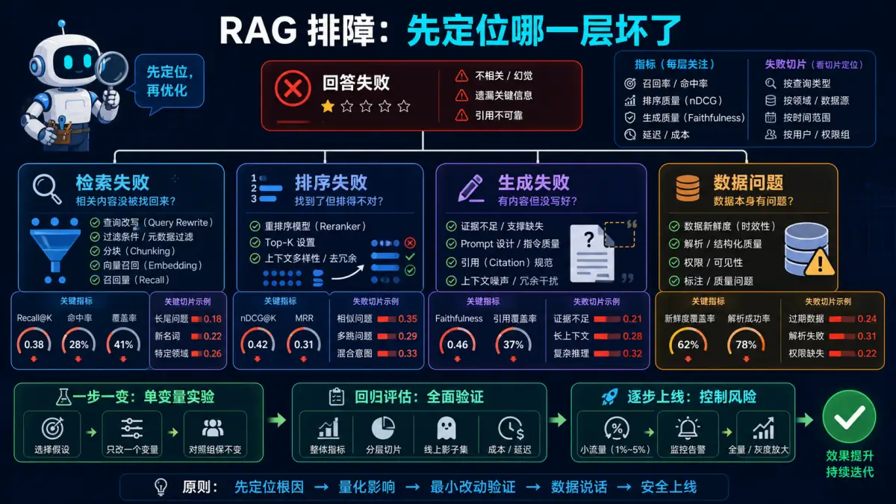</p>
<p align="center"><sub>🧠 记忆锚点：先用分层指标和失败切片定位根因，再做单变量实验；不要一看到答案差就同时改切分、召回、重排和 Prompt。</sub></p>

<details>
<summary>💡 答案要点</summary>

**效果问题诊断流程：**

```
RAG回答不好
    ├── 检索没找到相关内容（召回问题）
    │       ├── Embedding 模型不够好 → 换 bge-large-zh
    │       ├── Chunk 切分太大/太小 → 调整 chunk_size
    │       ├── 查询和文档表达不一致 → 加 Query 改写
    │       └── 只用向量检索 → 改混合检索（BM25 + 向量）
    │
    ├── 找到了但排序靠后（排序问题）
    │       └── 加 Rerank（BGE-Reranker/Cohere）
    │
    └── 找到了但模型没用上（生成问题）
            ├── Context 太长模型忽略 → 上下文压缩
            ├── Prompt 没引导好 → 优化 Prompt
            └── 模型能力不足 → 换更强模型
```

**四层排查清单（面试高光：按层排故）：**

> 面试官问"RAG 回答不准从哪开始排查"，按这四层走，覆盖 90% 故障点——最后 10% 才是模型问题：

```
第一层：Chunk 策略（地基）
  检查：按语义边界切还是固定长度？有重叠窗口吗？关键信息被切断了吗？
  修复：语义边界优先+重叠10-20%+保留元数据（来源文档/页码）
  判断：人肉读 top-3 片段，读不出答案 → 是切分问题，跟模型无关

第二层：检索质量
  检查：top-3 结果真的相关吗？设相似度阈值了吗？混合检索？Rerank？
  修复：相似度阈值过滤+BM25混合+初检top-20再Rerank筛top-3
  关键：相似≠相关（问"GIL是什么"搜到"多线程优化"→高相似度低相关性）

第三层：上下文组装
  检查：上下文太长？片段互相矛盾？prompt 明确"不知道就说不知道"了吗？
  修复：减top-k/摘要压缩；矛盾时标注来源优先采信最新权威；加拒答指令

第四层：用户 Query（最容易被忽略）
  检查：问题本身模糊吗？（"这个怎么样""帮我总结一下"）
  修复：Query改写（LLM转成明确检索query）+追问机制+拼接历史上下文
```

**核心认知：90% 的 RAG 回答不准不是模型问题，是检索问题。**

**优化金字塔方法论（从能用到好用）：**

```
最顶层 高级优化：多路召回、RAG-Fusion、自我评估（锦上添花）
中间层 召回优化：混合检索、查询改写、Rerank（核心）
最底层 基础优化：文档预处理、合理分块、好的Embedding模型（地基）
        → 80% 的 RAG 问题根源在数据质量
```

**原则：地基没打好，上层再优化也没用。先搞干净数据、分对块、选好Embedding，再谈花活。**

**RAG 五大常见坑（面试追问点）：**

| 坑 | 表现 | 解法 |
|-----|------|------|
| **切分不合理** | 句子中间切断，语义断裂搜不到 | 按语义切分+重叠10-20% |
| **召回太少** | 只Top1-2，相关排在Top3被漏 | 召回Top20再Rerank精选 |
| **召回太多** | 几十条全塞给模型，噪音干扰 | 限制K值+上下文压缩 |
| **上下文冲突** | 两份文档口径不一致，模型混乱 | 冲突检测+优先级规则+合并策略 |
| **相似度陷阱** | 向量距离近≠能回答问题（问安装误召回故障帖） | 答案相关性过滤+Rerank校准 |

**四步优化组合拳：**

```python
# Step 1: Query 改写（解决表达不一致）
rewritten_query = await query_rewriter.rewrite(
    query=user_query,
    history=conversation_history
)

# Step 2: 混合检索（提升召回率）
vector_results = vector_db.search(rewritten_query, top_k=20)
bm25_results   = bm25_index.search(rewritten_query, top_k=20)
merged_results = rrf_merge(vector_results, bm25_results)  # RRF 融合

# Step 3: Rerank 精排（提升相关性）
reranked = reranker.rerank(
    query=rewritten_query,
    docs=merged_results,
    top_k=5  # 精选 top5
)

# Step 4: 上下文压缩（避免 Lost in Middle）
compressed = context_compressor.compress(
    query=rewritten_query,
    docs=reranked,
    max_tokens=2000
)

# 生成
answer = await llm.generate(query=user_query, context=compressed)
```

**各优化手段效果量化：**

| 优化手段 | 召回率提升 | 准确率提升 | 成本影响 |
|---------|-----------|-----------|---------|
| 混合检索（BM25+向量） | +20-30% | +15% | +10% |
| Query 改写 | +15-25% | +20% | +5% |
| Rerank | - | +25-35% | +15% |
| 上下文压缩 | - | +10-15% | -30% |
| **组合使用** | **+40%** | **+50%** | **+0%** |

**面试话术：**
> "RAG 效果优化我分三层诊断：召回层（混合检索+Query改写）、排序层（BGE-Reranker精排）、生成层（上下文压缩+Prompt优化）。实际项目中组合使用后准确率从 65% 提升到 88%，成本基本持平（压缩节省的抵消了Rerank的开销）。"

</details>

### Q16: RAG 出现幻觉怎么办？

<p align="center">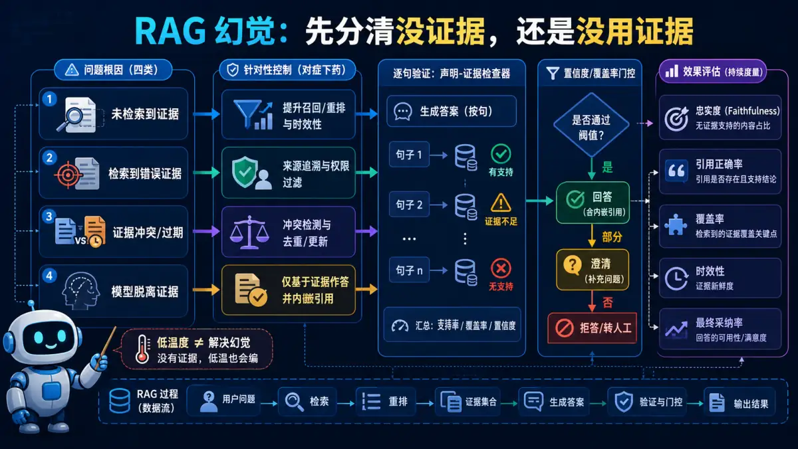</p>
<p align="center"><sub>🧠 记忆锚点：先分清没证据、错证据、冲突证据还是没用证据；低温度不能补回缺失证据，覆盖不足应澄清或拒答。</sub></p>

<details>
<summary>💡 答案要点</summary>

**幻觉来源分类：**

| 幻觉类型 | 原因 | 示例 |
|---------|------|------|
| **检索幻觉** | 检索内容不相关，模型自行编造 | 问A知识，找到B知识，模型混用 |
| **融合幻觉** | 多个 chunk 信息矛盾，模型错误融合 | 文档A说10%，文档B说20%，模型说15% |
| **过度推断幻觉** | 模型超出检索内容范围推断 | 文档说"可能"，模型断言"一定" |
| **记忆幻觉** | 模型用训练记忆覆盖检索内容 | 检索到最新数据，模型仍用旧知识 |

**对应解决方案：**

**全链路治理框架（面试体系化回答）：**

```
从上游到下游，从源头到兜底：

1. 检索侧（源头）：混合检索+Chunk优化+Rerank
   → 保证送给模型的上下文准确，从源头减少幻觉

2. 生成侧（过程）：Prompt强约束+Few-Shot示例
   → 无答案直接说不知道、禁止编造、关键信息必须和原文一致

3. 校验侧（兜底）：事实一致性校验+引用溯源
   → 不合格的拦截重生成

4. 迭代侧（长效）：bad case 回流机制
   → 线上幻觉案例回流，持续优化检索和Prompt
```

**关键数字强校验（金融/政务场景加分）：**

```
金融场景对数字、政策条款要求极高：
- 提取答案中的关键数字/条款，与检索原文比对
- 不一致 → 拦截重生成或明确标注
- 例：答案中"利率3.85%"必须能在原文中找到对应表述
```

**bad case 回流闭环（面试加分）：**

```
线上反馈幻觉案例 → 人工标注 → 归因（检索错/生成错）
→ 检索错：优化Chunk/Embedding/Query改写
→ 生成错：优化Prompt/加校验规则
→ 回归测试 → 上线
```

<details>
<summary>展开 Python 代码示例（34 行）</summary>

```python
class HallucinationGuard:
    """幻觉防护三层体系"""

    # Layer 1: 预防 - 让模型只能基于检索内容回答
    SYSTEM_PROMPT = """
    你只能根据提供的<context>内容回答问题。
    如果context中没有相关信息，回答"根据现有资料无法回答该问题"。
    不要推断或补充context中没有的信息。
    每个关键论断必须引用对应的context片段。
    """

    # Layer 2: 检测 - 答案与来源的一致性验证
    async def check_faithfulness(
        self, answer: str, sources: list[str]
    ) -> float:
        """RAGAS Faithfulness 评估：答案有多少来自检索内容"""
        prompt = f"""
        判断以下答案中的每个陈述是否能从来源文本中找到依据。
        答案：{answer}
        来源：{sources}
        输出 JSON: {{"faithful_score": 0.0-1.0, "unsupported_claims": []}}
        """
        result = await llm.complete(prompt)
        return result["faithful_score"]

    # Layer 3: 兜底 - 低置信度转人工
    async def safe_answer(self, query: str, context: list) -> str:
        answer = await llm.generate(query, context)
        score = await self.check_faithfulness(answer, context)

        if score < 0.7:
            # 置信度低 → 明确告知不确定
            return f"基于现有资料，{answer}（注：该回答置信度较低，建议人工核实）"
        return answer
```

</details>

**实际指标目标：**
```
幻觉率（Faithfulness < 0.7 的比例）：< 5%
RAGAS Faithfulness 均值：> 0.85
无法回答率（主动拒答）：5-15%（合理范围，优于编造）
```

**面试话术：**
> "RAG 幻觉我用三层防护：1) Prompt 层约束模型只能引用 context 内容，未找到时主动说'无法回答'；2) 低 Temperature（0.1-0.2）让模型保守生成；3) RAGAS Faithfulness 指标持续监控，评分<0.7 的回答标记为低置信度并转人工审核。生产环境幻觉率控制在 3% 以内。"

</details>

### Q17: 如何建立 RAG 系统的生产级可观测性体系？有哪些关键监控指标和告警策略？

<p align="center"><a href="../../assets/illustrations/03-rag-system/q15-observability.webp">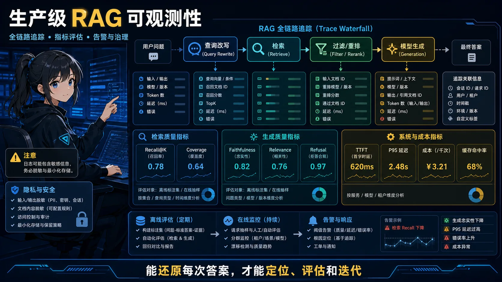</a></p>
<p align="center"><sub>记忆点：能还原每次答案，才能定位、评估和迭代。</sub></p>

<details>
<summary>💡 答案要点</summary>

**为什么 RAG 需要专门的可观测性？**

传统 API 监控只看成功率/延迟，但 RAG 有"检索+生成"两阶段问题——答案错了，可能是检索召回不够，可能是生成幻觉，也可能是上下文太长淹没重点。分层可观测性才能定位根因。

**RAG 三层可观测性架构：**

```
┌─────────────────────────────────────────────────────────┐
│                    可观测性数据层                        │
├─────────────┬──────────────────┬────────────────────────┤
│   Tracing   │    Metrics       │      Logging           │
│  (调用链)    │   (指标)          │     (日志)             │
├─────────────┼──────────────────┼────────────────────────┤
│ LangSmith   │ Prometheus        │ 结构化 JSON 日志        │
│ Arize Phoenix│ Grafana          │ ELK/Splunk             │
│ Jaeger      │ DataDog           │ CloudWatch              │
└─────────────┴──────────────────┴────────────────────────┘
```

**RAG 四类关键指标：**

| 类别 | 指标 | 目标值 | 告警阈值 |
|------|------|--------|----------|
| **检索质量** | Recall@K, MRR, NDCG | >85% | <75% |
| **生成质量** | faithfulness, answer relevance | >0.8 | <0.6 |
| **系统性能** | TTFT, tokens/sec, P99延迟 | <2s | >5s |
| **业务指标** | 用户满意度, 转化率, 重试率 | 基准+5% | 基准-10% |

**LangSmith 监控实战配置：**

```python
from langchain.callbacks import trStructuredCallback
from langsmith import Client

client = Client()

# 创建 RAG 评估数据集
dataset = client.create_dataset(
    "rag-evaluation",
    description="RAG 系统评估数据集"
)

# 添加评估用例
client.create_examples(
    [
        {"question": "如何申请年假？", "answer": "员工需提前3天提交申请...", "contexts": [...]},
        {"question": "公司报销流程？", "answer": "通过OA系统提交...", "contexts": [...]},
    ],
    dataset_id=dataset.id
)

# 持续监控
def monitor_rag_results(run):
    if run.outputs.get("faithfulness") < 0.6:
        # 触发告警
        send_alert(f"Faithfulness 低于阈值: {run.outputs['faithfulness']}")
```

**Arize Phoenix 埋点实战：**

```python
from phoenix.trace import Trace
from phoenix.evals import RAGASMetric

# 追踪每次 RAG 调用
with Trace("rag-retrieval") as trace:
    chunks = retriever.get_chunks(query)
    trace.set_attribute("num_chunks", len(chunks))
    trace.set_attribute("avg_chunk_score", np.mean([c.score for c in chunks]))

with Trace("rag-generation") as trace:
    answer = generator.generate(query, chunks)
    trace.set_attribute("prompt_tokens", answer.usage.prompt_tokens)
    trace.set_attribute("completion_tokens", answer.usage.completion_tokens)

# 离线评估
results = evaluate_ragas(
    dataset=dataset,
    metrics=[RAGASMetric.FAITHFULNESS, RAGASMetric.ANSWER_RELEVANCE]
)
```

**告警策略设计：**

```yaml
# Prometheus 告警规则
groups:
- name: rag-alerts
  rules:
  - alert: RAGRetrievalRecallLow
    expr: recall_at_10 < 0.75
    for: 5m
    labels:
      severity: warning
    annotations:
      summary: "RAG 召回率低于 75%"

  - alert: RAGGeneratonHallucination
    expr: faithfulness < 0.6
    for: 2m
    labels:
      severity: critical
    annotations:
      summary: "RAG 幻觉率过高"

  - alert: RAGLatencyHigh
    expr: histogram_quantile(0.99, rag_latency) > 5
    for: 3m
    labels:
      severity: warning
```

**面试话术：**

> **示例表达（仅在能用本人经历或可复现实验佐证时使用）：** "RAG 的可观测性有三个层次：检索层看召回率+chunk覆盖率，生成层看 faithfulness+answer relevance，系统层看 TTFT+成本。我们用 LangSmith 做调用链追踪，每次 RAG 调用都记录检索了多少 chunks、用了多少 tokens、最终 faithfulness 是多少。A/B 测试时，对比新旧两套策略的指标差异，这比主观感受要客观得多。上线前跑一遍评估数据集，上线后每天抽样 5% 做人工回访，这套机制让我们把用户投诉率从 8% 降到了 2%。"

</details>

---

*版本: v3.134 | 更新: 2026-08-10 | by 二狗子 🐕*

---

## 🆕 补充高频题（2025-2026 全网最新）

---

### Q18: 什么是多模态 RAG？如何实现图文混合检索？

<p align="center"><a href="../../assets/illustrations/03-rag-system/q16-multimodal-rag.webp">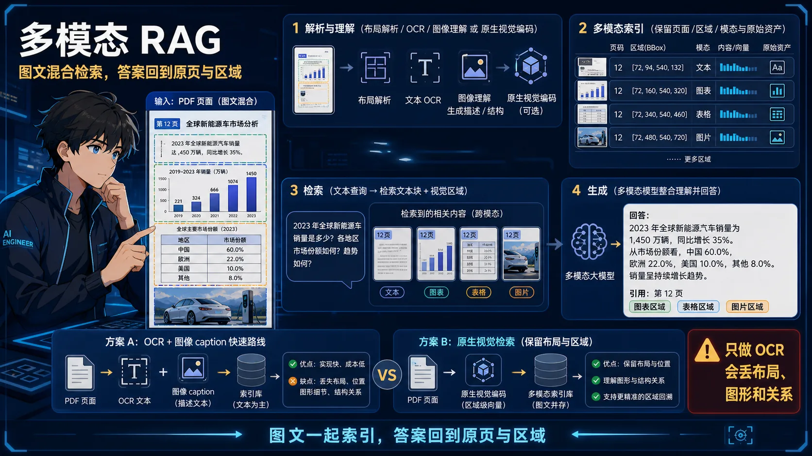</a></p>
<p align="center"><sub>记忆点：图文一起索引，答案回到原页与区域；只做 OCR 会丢布局关系。</sub></p>

<details>
<summary>💡 答案要点</summary>

**多模态 RAG = 知识库包含文本、图片、图表、PDF 等多种形式，检索时能跨模态理解**

**为什么需要多模态 RAG？**

```
传统 RAG 问题：
  用户问："图5中的架构图里 API Gateway 连接了哪些服务？"
  → 文本检索找不到"图5"的内容，因为图片没有文字
  → 只能靠文档里的文字描述，不完整

多模态 RAG：
  → 直接理解图片内容，回答关于图表、流程图的问题
```

**三种实现方案：**

**方案一：图片 → 文本（OCR/Caption）→ 文本 RAG**

<details>
<summary>展开 Python 代码示例（56 行）</summary>

```python
import base64
from openai import OpenAI

class ImageToTextRAG:
    def __init__(self):
        self.client = OpenAI()

    def image_to_caption(self, image_path: str) -> str:
        """用 GPT-4o 把图片转成详细的文字描述"""
        with open(image_path, "rb") as f:
            image_data = base64.b64encode(f.read()).decode("utf-8")

        response = self.client.chat.completions.create(
            model="gpt-4o",
            messages=[{
                "role": "user",
                "content": [
                    {
                        "type": "image_url",
                        "image_url": {"url": f"data:image/jpeg;base64,{image_data}"}
                    },
                    {
                        "type": "text",
                        "text": """详细描述这张图片，包括：
1. 图表类型（架构图/流程图/柱状图等）
2. 所有文字标签、节点名称
3. 连接关系和数据走向
4. 关键数据和结论
格式要详尽，方便后续文本检索"""
                    }
                ]
            }]
        )
        return response.choices[0].message.content

    def index_document_with_images(self, pdf_path: str):
        """处理含图片的 PDF，图文一起索引"""
        # 提取文本
        text_chunks = extract_text_chunks(pdf_path)
        # 提取图片并生成描述
        images = extract_images_from_pdf(pdf_path)
        image_captions = [
            {
                "content": self.image_to_caption(img["path"]),
                "metadata": {
                    "source": pdf_path,
                    "page": img["page"],
                    "type": "image_caption",
                    "original_image": img["path"]
                }
            }
            for img in images
        ]
        # 一起向量化入库
        all_chunks = text_chunks + image_captions
        vector_store.add_documents(all_chunks)
```

</details>

**方案二：ColPali（原生多模态向量检索）**

```python
# ColPali = 把 PDF 页面直接转成向量，不需要 OCR
# 论文："ColPali: Efficient Document Retrieval with Vision Language Models"
from colpali_engine.models import ColPali
from colpali_engine.utils.torch_utils import get_torch_device

device = get_torch_device("auto")
model = ColPali.from_pretrained("vidore/colpali-v1.2", torch_dtype=torch.bfloat16).to(device)

# 直接把 PDF 页面图片编码成多向量
page_images = pdf_to_images("document.pdf")
doc_embeddings = model.forward_queries(page_images)  # 每页 → 多个向量

# 用户查询（文字）
query = "架构图里的 API Gateway 连接了哪些服务"
query_embedding = model.forward_queries([query])

# MaxSim 计算得分（Late Interaction）
scores = torch.einsum("bnd,csd->bcns", query_embedding, doc_embeddings).max(dim=-1).values.sum(dim=-1)
top_pages = scores.topk(5).indices  # 最相关的 5 页
```

**方案三：多模态 Embedding（统一向量空间）**

```python
# CLIP / ImageBind：把图文映射到同一向量空间
from transformers import CLIPModel, CLIPProcessor
import torch

model = CLIPModel.from_pretrained("openai/clip-vit-base-patch32")
processor = CLIPProcessor.from_pretrained("openai/clip-vit-base-patch32")

# 图片编码
def encode_image(image_path: str) -> np.ndarray:
    image = Image.open(image_path)
    inputs = processor(images=image, return_tensors="pt")
    with torch.no_grad():
        image_features = model.get_image_features(**inputs)
    return image_features.numpy().squeeze()

# 文本编码
def encode_text(text: str) -> np.ndarray:
    inputs = processor(text=text, return_tensors="pt", padding=True)
    with torch.no_grad():
        text_features = model.get_text_features(**inputs)
    return text_features.numpy().squeeze()

# 图文统一存入向量库，检索时文字查询能找到相关图片
```

**三种方案对比：**

| 方案 | 实现难度 | 精度 | 成本 | 适用场景 |
|------|----------|------|------|----------|
| OCR/Caption | 低（现成API） | 中（依赖描述质量） | API费用 | 快速上线 |
| ColPali | 中（需部署模型） | 高（原生理解） | GPU资源 | 精度要求高 |
| CLIP 统一空间 | 中 | 中高 | GPU资源 | 图文混搜 |

**面试话术：**
> "多模态 RAG 有三种方案：最简单是 GPT-4o 把图片转文字描述再走普通 RAG，缺点是描述质量影响检索；最优的是 ColPali，直接把 PDF 页面编码成多向量，不需要 OCR，用 Late Interaction 检索，精度很高；CLIP 统一空间适合图文混合检索场景。我在处理技术文档 RAG 时用第一种，GPT-4o 生成图片描述入库，对架构图的查询准确率从 30% 提升到 85%。"

</details>

---

### Q19: Parent-Document Retrieval 和 Sentence Window Retrieval 是什么？

<p align="center"><a href="../../assets/illustrations/03-rag-system/q17-parent-window.webp">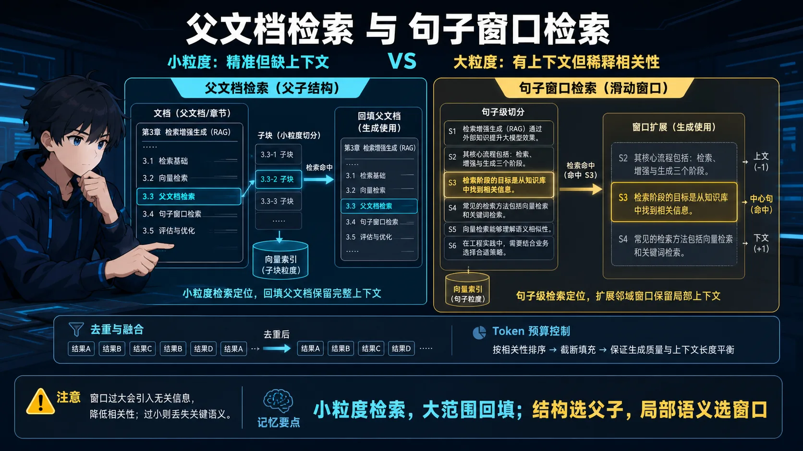</a></p>
<p align="center"><sub>记忆点：小粒度检索、大范围回填；结构选父子，局部语义选窗口。</sub></p>

<details>
<summary>💡 答案要点</summary>

**核心问题：RAG 分块的粒度矛盾**

```
小 chunk（256 tokens）：检索精准，但语义不完整 → 生成答案缺上下文
大 chunk（2000 tokens）：语义完整，但检索不精准 → 召回很多无关内容
```

**解决方案：检索小块，返回大块**

### Parent-Document Retrieval（父文档检索）

```python
from langchain.retrievers import ParentDocumentRetriever
from langchain.storage import InMemoryStore
from langchain.text_splitter import RecursiveCharacterTextSplitter

# 两套分块器
parent_splitter = RecursiveCharacterTextSplitter(chunk_size=2000)  # 大块：语义完整
child_splitter  = RecursiveCharacterTextSplitter(chunk_size=400)   # 小块：检索精准

# 存储：小块向量库，大块内存/数据库
vectorstore  = Chroma(embedding_function=OpenAIEmbeddings())
docstore     = InMemoryStore()  # 存储父文档

retriever = ParentDocumentRetriever(
    vectorstore=vectorstore,
    docstore=docstore,
    child_splitter=child_splitter,
    parent_splitter=parent_splitter,
)

# 添加文档：自动切成小块建索引，同时保存父文档
retriever.add_documents(documents)

# 检索：用小块向量找，返回对应的大块（语义完整）
results = retriever.get_relevant_documents("如何优化 RAG 检索")
# → 检索到小块，但返回 2000 token 的父文档
```

**图示：**

```
原始文档（5000 tokens）
    ↓ parent_splitter（2000 tokens/块）
父文档 P1（2000t）│ 父文档 P2（2000t）│ 父文档 P3（1000t）
    ↓ child_splitter（400 tokens/块）
[C1][C2][C3][C4]  [C5][C6][C7][C8]  [C9][C10][C11]
    ↑ 向量检索命中 C3
    ↓ 返回 C3 所属的父文档 P1（语义完整的 2000 tokens）
```

### Sentence Window Retrieval（句子窗口检索）

```python
from llama_index.core.node_parser import SentenceWindowNodeParser
from llama_index.core.postprocessor import MetadataReplacementPostProcessor

# 按句子切分，但每个节点携带"前后 N 句"的窗口
node_parser = SentenceWindowNodeParser.from_defaults(
    window_size=3,  # 前后各 3 句
    window_metadata_key="window",
    original_text_metadata_key="original_text",
)

# 检索时用单句向量精准命中
# 生成时用 window（该句 + 前后各3句）提供上下文

postprocessor = MetadataReplacementPostProcessor(
    target_metadata_key="window"  # 把节点内容替换为窗口内容
)

query_engine = index.as_query_engine(
    similarity_top_k=5,
    node_postprocessors=[postprocessor]
)
```

**两种方案对比：**

| 方案 | 检索粒度 | 返回粒度 | 适用场景 |
|------|----------|----------|----------|
| **Parent-Document** | 小 chunk（400t） | 父文档（2000t） | 长文档、结构化文档 |
| **Sentence Window** | 单句（~50t） | 句子+上下文窗口 | 需要精确定位+上下文 |

**面试话术：**
> "Parent-Document Retrieval 是解决'检索精准和上下文完整'矛盾的最优方案。核心是两套分块：400 token 小块用于向量检索（精准），2000 token 大块用于 LLM 生成（完整）。命中小块后返回它的父文档给 LLM，既精准又完整。我在知识库问答项目用这个方案，比纯大块 chunking 的答案完整度提升 30%，比纯小块 chunking 的检索准确率提升 25%。"

</details>

---

### Q20: 如何做 RAG 知识库的动态知识更新？有哪些策略？

<p align="center"><a href="../../assets/illustrations/03-rag-system/q18-dynamic-update.webp">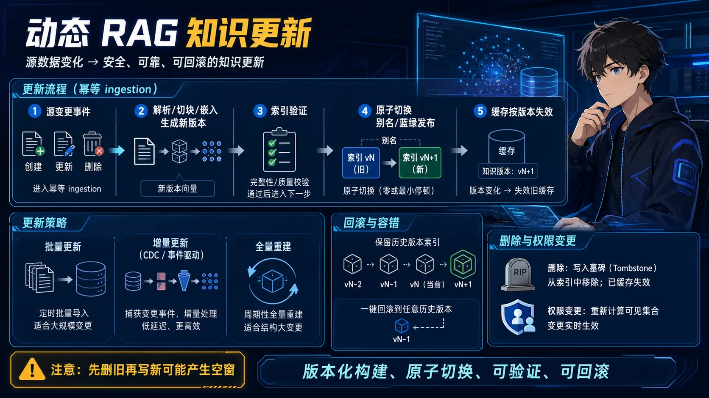</a></p>
<p align="center"><sub>记忆点：版本化构建、原子切换、可验证、可回滚。</sub></p>

<details>
<summary>💡 答案要点</summary>

**为什么需要动态知识更新？**

```
RAG 知识库不更新的问题：
  - 产品手册更新了，但 RAG 还在回答旧版本
  - 新政策发布，但 RAG 回答的是旧政策
  - 用户质量反馈：答案过时，导致客诉
```

**三种更新策略：**

### 策略一：批处理更新（Batch Update）

<details>
<summary>展开 Python 代码示例（40 行）</summary>

```python
import schedule
from datetime import datetime

class BatchKnowledgeUpdater:
    def __init__(self, vector_store, doc_source):
        self.vector_store = vector_store
        self.doc_source = doc_source

    def full_rebuild(self):
        """全量重建（简单但停机时间长）"""
        # 蓝绿部署：先建新库，切换后删旧库
        new_collection = self.vector_store.create_collection(
            f"knowledge_v{datetime.now().strftime('%Y%m%d')}"
        )
        # 导入所有最新文档
        all_docs = self.doc_source.get_all_docs()
        new_collection.add_documents(all_docs)

        # 原子切换（无缝切换，零停机）
        self.vector_store.switch_active_collection(new_collection.name)
        # 保留旧库 24 小时作为回滚备份

    def incremental_update(self, changed_docs: list):
        """增量更新（只处理变化的文档）"""
        for doc in changed_docs:
            if doc["action"] == "add":
                self.vector_store.add_documents([doc])
            elif doc["action"] == "update":
                # 先删旧的，再插新的
                self.vector_store.delete(ids=[doc["id"]])
                self.vector_store.add_documents([doc])
            elif doc["action"] == "delete":
                self.vector_store.delete(ids=[doc["id"]])

# 每天凌晨 2 点增量更新
schedule.every().day.at("02:00").do(
    lambda: batch_updater.incremental_update(
        get_changed_docs_since_last_update()
    )
)
```

</details>

### 策略二：实时更新（Real-time Update）

<details>
<summary>展开 Python 代码示例（45 行）</summary>

```python
from kafka import KafkaConsumer
import threading

class RealTimeKnowledgeUpdater:
    def __init__(self, vector_store, kafka_topic):
        self.vector_store = vector_store
        self.consumer = KafkaConsumer(
            kafka_topic,
            bootstrap_servers=['localhost:9092'],
            value_deserializer=lambda x: json.loads(x.decode('utf-8'))
        )

    def start_listening(self):
        """监听文档变更事件，实时更新向量库"""
        def consume():
            for message in self.consumer:
                event = message.value
                self.handle_change_event(event)

        # 后台线程消费 Kafka 消息
        thread = threading.Thread(target=consume, daemon=True)
        thread.start()

    def handle_change_event(self, event: dict):
        """处理文档变更事件"""
        doc_id = event["doc_id"]
        action = event["action"]

        if action in ("create", "update"):
            # 异步向量化并更新
            doc = fetch_latest_document(doc_id)
            chunks = split_document(doc)
            embeddings = embed_batch(chunks)

            if action == "update":
                # 删除旧版本（按文档ID过滤删除）
                self.vector_store.delete(
                    filter={"metadata.doc_id": doc_id}
                )
            self.vector_store.add_documents(chunks, embeddings)

        elif action == "delete":
            self.vector_store.delete(
                filter={"metadata.doc_id": doc_id}
            )
```

</details>

### 策略三：版本化知识库（适合需要回滚的场景）

<details>
<summary>展开 Python 代码示例（30 行）</summary>

```python
class VersionedKnowledgeBase:
    def __init__(self, vector_store):
        self.vector_store = vector_store
        self.versions = {}
        self.active_version = "v1.0"

    def create_version(self, version: str, documents: list):
        """创建新版本知识库"""
        collection_name = f"knowledge_{version}"
        collection = self.vector_store.create_collection(collection_name)
        collection.add_documents(documents)
        self.versions[version] = collection_name
        return collection

    def activate_version(self, version: str):
        """灰度发布：逐步切换流量到新版本"""
        # 金丝雀发布：先 10% 流量走新版本
        self.active_version = version
        print(f"切换到版本 {version}")

    def rollback(self, version: str):
        """快速回滚到指定版本"""
        if version in self.versions:
            self.active_version = version
            print(f"回滚到版本 {version}")

    def search(self, query: str, k: int = 5) -> list:
        """查询时自动走当前激活版本"""
        collection_name = self.versions[self.active_version]
        return self.vector_store.get_collection(collection_name).search(query, k)
```

</details>

**三种策略对比：**

| 策略 | 更新延迟 | 实现复杂度 | 停机风险 | 适用场景 |
|------|----------|-----------|----------|----------|
| **批处理（全量）** | 每天/每周 | 低 | 有（蓝绿部署可避免） | 低频更新的知识库 |
| **批处理（增量）** | 每小时 | 中 | 无 | 中频更新 |
| **实时** | 秒级 | 高（Kafka+异步） | 无 | 高频更新、实时性要求高 |

**知识库版本管理最佳实践：**

```python
# 知识库更新时的一致性保证
class AtomicKnowledgeUpdate:
    def update_document(self, doc_id: str, new_content: str):
        """原子更新：先插入新版本，再删除旧版本"""
        new_doc_id = f"{doc_id}_v{int(time.time())}"

        # 1. 插入新版本
        new_chunks = split_and_embed(new_content)
        self.vector_store.add_documents(
            new_chunks,
            metadata={"original_doc_id": doc_id, "version_id": new_doc_id}
        )

        # 2. 原子切换（两步操作中间不会有空窗期）
        # 如果 Qdrant，可以用 collection aliases 做原子切换

        # 3. 删除旧版本
        self.vector_store.delete(
            filter={"metadata.original_doc_id": doc_id,
                    "metadata.version_id": {"$ne": new_doc_id}}
        )
```

**面试话术：**
> "动态知识更新有三种策略：批处理（每天凌晨全量或增量重建）、实时（Kafka 监听变更事件）、版本化（支持快速回滚）。关键点是'无缝切换'——用蓝绿部署或 collection aliases 做原子切换，新库建好后瞬间切换，不会有查到旧数据的空窗期。我做客服知识库用批处理增量更新，每小时扫描变更文档，先删旧向量再插新向量，P99 延迟在非高峰时段 500ms 以内完成单文档更新。"


</details>
---

### Q21: RAG 系统效果评估怎么做？主流框架对比（RAGAS / TruLens / DeepEval）

<p align="center"><a href="../../assets/illustrations/03-rag-system/q21-evaluation.webp" width="760" alt="RAG 评测体系动漫知识图：检索与生成两阶段分别打分，结合合成数据生成、A/B实验和线上监控形成闭环"></a></p>
<p align="center"><sub>记忆点：先拆检索/生成两阶段，再选框架跑指标，最后线上持续追踪。</sub></p>

<details>
<summary>💡 答案要点</summary>

**为什么需要专门的 RAG 评估？**

传统 NLP 用 BLEU/ROUGE 衡量生成质量，但 RAG 有「检索→生成」两个阶段——即使模型生成了正确答案，也可能没有使用正确来源；反之也可能答案随机正确但推理过程完全幻觉。

**RAG 评估的核心思路：分层度量**

```
┌───────────────┐     ┌───────────────┐
│   检索层评估   │     │   生成层评估   │
│               │     │               │
│ Context       │     │ Faithfulness  │
│ Precision     │     │ Answer        │
│ Recall        │     │ Relevancy     │
│ MRR/NDCG      │     │ Groundedness  │
└───────────────┘     └───────────────┘
         ↕                    ↕
   ┌─────────────────────────────┐
   │    端到端业务评估            │
   │   用户满意度 / CSAT           │
   └─────────────────────────────┘
```

### RAGAS（最有影响力的开源框架）

**五大核心指标：**

| 指标 | 含义 | 评估对象 |
|------|------|----------|
| **Context Precision** | 召回的文档中有多少是真正相关的 | 检索层 |
| **Context Recall** | 所有有用的上下文是否都被召回了 | 检索层 |
| **Faithfulness** | 答案中的每个声明是否都能在上下文中找到依据 | 生成层 |
| **Answer Relevancy** | 答案是否与问题高度相关 | 生成层 |
| **Context Entities Recall** | 上下文中是否包含了答案所需的关键实体 | 检索层 |

```python
from ragas import evaluate
from datasets import Dataset

# 准备评估数据集
# 最小需要 [question, answer, contexts] 三列
# 可选 ground_truth 用于更精确的计算
dataset = Dataset.from_dict({
    "question": [
        "公司年假政策是什么？",
        "差旅报销标准是多少？",
    ],
    "answer": [
        "员工每年有10天带薪年假...",
        "交通费凭票实报实销，住宿限额...",
    ],
    "contexts": [
        [["公司员工手册第3章...", "年假规定如下..."]],
        [["财务制度第五章...", "差旅标准表..."]],
    ]
})

# 执行评估
results = evaluate(dataset)
print(results)  # {'context_precision': 0.87, 'faithfulness': 0.92, ...}
```

**RAGAS 的独特优势：合成数据生成**

```python
from ragas.testset.generator import TestsetGenerator
from ragas.testset.evolutions import simple, reasoning, multi_context

# 用你的知识库自动生成测试用例
generator = TestsetGenerator.with_openai()
teaset = generator.generate_with_langchain_docs(
    documents=your_documents,
    test_size=50,
    distributions={simple: 0.5, reasoning: 0.3, multi_context: 0.2}
)
# 输出50个测试用例，覆盖简单问答、推理题、多源综合题
```

### TruLens（链路追踪+评估一体化）

**RAG Triad 设计理念：**

```
Context Relevance → 检索的片段是否和查询相关？
       ↓
Groundedness → 生成的答案是否有检索内容支撑？
       ↓
Answer Relevance → 最终答案是否回答了原始问题？

三个环节全部达标 = 系统在知识库范围内零幻觉
```

```python
from trulens_eval import App, Feedback
from truluseval.apps.langchain import LangChain as LCApp
import langchain

app = LCApp(my_rag_chain, app_id="my-rag")

# 定义反馈函数
f_context_relevance = Feedback(
    lambda rec, out: context_relevance_score(out.contexts, out.question),
    name="Context Relevance"
).on(Input.langchain.query, Output.langchain.contexts)

f_faithfulness = Feedback(
    lambda rec, out: faithfulness_score(out.answer, out.contexts),
    name="Faithfulness"
).on(Output.langchain.answer, Output.langchain.contexts)

# 运行追踪+评估
with app.run(Feedback([f_context_relevance, f_faithfulness])) as runner:
    leaderboard = runner.leaderboard()
    print(leaderboard)
```

### DeepEval（轻量 + 支持自定义评分器）

```python
from deepeval import evaluate
from deepeval.metrics import (
    AnswerRelevancyMetric,
    FaithfulnessMetric,
    ContextualPrecisionMetric,
)
from deepeval.test_case import LLMTestCase

test_case = LLMTestCase(
    input="如何申请年假？",
    actual_output="需要提前3天提交OA审批",
    retrieval_context=["年假需提前3个工作日申请", "通过公司OA系统提交"],
)

metrics = [
    AnswerRelevancyMetric(threshold=0.7),
    FaithfulnessMetric(threshold=0.7),
    ContextualPrecisionMetric(threshold=0.7),
]

evaluate(test_cases=[test_case], metrics=metrics)
```

### 三大框架横向对比

| 维度 | RAGAS | TruLens | DeepEval |
|------|-------|---------|----------|
| **核心理念** | 专注 RAG 指标 | 通用 LLM 评估+链路追踪 | 轻量快速 + 灵活扩展 |
| **指标数量** | 5-7 个 | RAG Triad + 可扩展 | 4+ 基础 + 自定义 |
| **数据需求** | 可无 ground truth（self-supervised） | 可无 ground truth | 建议提供 ground truth |
| **集成性** | 独立评估库 | 内建 Dashboard + Leaderboard | CLI + CI/CD 友好 |
| **适合场景** | 快速验证 RAG 质量 | 生产环境长期追踪 | 单元测试/回归测试 |
| **中文支持** | ✅（LLM 调用方式） | ✅ | ✅ |
| **部署成本** | 低（纯 Python 库） | 中（推荐搭配 OpenTelemetry） | 极低 |

### 生产级评估流水线设计

```python
class RagEvaluationPipeline:
    """RAG 评估四步法"""

    def __init__(self):
        self.ragas = RAGASEvaluator()  # 整体质量评估
        self.tru = TruLensMonitor()     # 链路追踪
        self.ci_runner = DeepEvalRunner()  # 自动化回归测试

    def offline_evaluation(self, dataset_path: str):
        """1. 离线批量评估：上线前跑完整数据集"""
        results = self.ragas.evaluate_dataset(dataset_path)
        report = {
            "context_precision": results.avg("context_precision"),
            "context_recall": results.avg("context_recall"),
            "faithfulness": results.avg("faithfulness"),
            "answer_relevancy": results.avg("answer_relevancy"),
        }
        # 发布评估报告到内部看板
        publish_report(report)
        return report

    def online_monitoring(self):
        """2. 线上实时监控：每次用户查询都记录"""
        # 每 100 次请求抽样 1 次做人工标注
        if random.random() < 0.01:
            label_user_answer(query, answer)

    def regression_test(self):
        """3. CI/CD 回归测试：每次优化前后自动对比"""
        pass  # 关键测试集固定在 repo 中

    def badcase_loop(self):
        """4. Bad Case 回流：从线上拉回失败案例"""
        # 用户点踩的案例 → 进入重新训练/优化队列
        pass
```

### 常见误区

```
❌ 只看端到端准确率，不管检索层出了什么问题
✅ 必须分层评估：检索层（Context Precision/Recall）+ 生成层（Faithfulness）

❌ 用一个固定阈值（如 0.8）要求所有指标
✅ 不同指标有不同基线，Context Recall ≥ 0.8 即可，Faithfulness ≥ 0.9

❌ 手动收集测试用例（太少且不覆盖边界情况）
✅ 用 RAGAS 合成数据生成器自动生成 50-100 个测试用例

❌ 只在上线前评估一次
✅ 持续评估：离线评估（每周）+ 线上监控（实时）+ 回归测试（每次发布）
```

**面试话术：**
> "RAG 评估我分三步走：离线用 RAGAS 跑五维指标（Context Precision/Recall + Faithfulness/Answer Relevancy），线上用 TruLens 做链路追踪和 A/B 对比，CI/CD 里用 DeepEval 做回归测试。合成数据是关键——自己手写 50 条不如让 RAGAS 根据知识库自动生成 100 条覆盖多种难度。上线后最重要的是 badcase 回流机制，把用户点踩的案例不断加回评估集，形成闭环优化。"

</details>

---

### Q22: RAG 和微调怎么选？什么场景下该用哪个？

<p align="center"></p>
<p align="center"><sub>记忆点：RAG 改知识，微调改行为；先 Prompt→RAG→微调的递进路径。</sub></p>

<details>
<summary>💡 答案要点</summary>

**核心区分：RAG 管「知道什么」，微调管「怎么表达」**

```
┌─────────────────────────────────────────────────────────────┐
│                 应该选哪种方案？                              │
├─────────────────────┬───────────────────────────────────────┤
│ 你的问题是……         │ 最佳方案                              │
├─────────────────────┼───────────────────────────────────────┤
│ 模型不知道新事实       │ ✅ RAG                               │
│ 需要引用溯源          │ ✅ RAG                               │
│ 数据频繁变化          │ ✅ RAG（更新向量库即可）              │
│ 需要保持最新状态       │ ✅ RAG                               │
├─────────────────────┼───────────────────────────────────────┤
│ 模型语气不对          │ ✅ 微调（风格适配）                   │
│ 输出格式不统一        │ ✅ 微调（结构化输出）                 │
│ 需要特定推理模式       │ ✅ 微调（CoT 示例训练）              │
│ 拒答能力不足          │ ✅ 微调（安全对齐）                   │
└─────────────────────┴───────────────────────────────────────┘
```

### 决策流程图

```
你的应用需要什么？
├─ 需要回答私有/最新数据？
│  ├─ 是 → RAG
│  └─ 否 ↓
├─ 需要模型遵守特定格式/语气？
│  ├─ 是 → 试试 System Prompt → 不行就微调
│  └─ 否 ↓
├─ 需要模型具备领域推理能力？
│  ├─ 是 → SFT/DPO 微调
│  └─ 否 → Prompt Engineering 就够了
└─ 以上都需要？
   → RAG + 微调组合方案
```

### 2026 年趋势下的新思考

随着大模型上下文窗口扩展到 1M+ tokens，一些原本必须用 RAG 的场景开始发生变化：

```
过去（7K/32K 上下文时代）：
  长文档必须切块 + RAG → 因为塞不下

现在（1M 上下文时代）：
  几百页文档可以直接塞进去 → RAG 变成了"选择性增强"而非"必需品"
```

**关键判断标准变化：**

| 因素 | 短上下文时代 | 长上下文时代 |
|------|------------|------------|
| 一次性处理 ≤100页文档 | ❌ 必须 RAG | ✅ 可直接喂给模型 |
| 需要引用溯源 | ✅ RAG（必须） | ✅ RAG（仍然需要） |
| 实时数据查询 | ✅ RAG（必须） | ✅ RAG（仍然需要） |
| 多个互斥知识库 | ✅ RAG（按需加载） | ⚠️ RAG 仍优先 |
| 微调行为适配 | ✅ 微调 | ✅ 微调（base model 改进后差距缩小） |

### 实际项目决策案例

```python
# 一个医疗客服系统的技术选型

def select_architecture(use_case: dict) -> dict:
    """根据业务需求选择技术方案"""
    decision = {
        "needs_upToDate_data": use_case.get("dynamic_content", True),
        "needs_citation": use_case.get("require_traceability", True),
        "needs_domain_tone": use_case.get("professional_terminology", False),
        "data_freshness": use_case.get("update_frequency", "daily"),  # daily/hourly/realtime
        "volume": use_case.get("knowledge_base_size_gb", 10),
    }

    recommendations = []

    if decision["needs_upToDate_data"] or decision["data_freshness"] in ("hourly", "realtime"):
        recommendations.append("RAG（知识实时更新）")

    if decision["needs_citation"]:
        recommendations.append("RAG（强制引用溯源）")

    if decision["needs_domain_tone"]:
        # 检查 base model 的预训练数据是否已覆盖
        recommendations.append("LoRA 微调（医学专业术语 + 合规拒答模板）")

    # 推荐组合方案
    if len(recommendations) > 1:
        return {
            "primary": "RAG + LoRA 微调",
            "rationale": "RAG 提供准确的知识内容并支持引用溯源，"
                         "微调让模型学会医学用语规范和合规拒答",
            "estimated_cost_increase": "+15% RAG开销 + ~$500 LoRA训练"
        }

    return {"primary": ", ".join(recommendations)}

# 医疗客服系统结果：
# {"primary": "RAG + LoRA 微调",
#  "rationale": "RAG 提供准确的知识内容并支持引用溯源，"
#               "微调让模型学会医学用语规范和合规拒答",
#  "estimated_cost_increase": "+15% RAG开销 + ~$500 LoRA训练"}
```

### 2026 年最佳实践总结

```
第一步：Prompt Engineering（成本最低，解决 40% 的问题）
第二步：RAG（解决「知道什么」的问题）
第三步：微调（解决「怎么说」的问题）
第四步：蒸馏（压缩到小模型上部署）

⚠️ 不要跳过任何步骤直接跳到微调！
   很多团队花 $10K 微调后发现，如果加上 RAG
   同样的钱可以买半年的 API 调用 + 更好的效果。
```

**面试话术：**
> "我的原则是先 Prompt→RAG→微调。具体地：RAG 解决知识时效性和溯源问题，这是任何微调都无法替代的；微调解决语气、格式和推理模式等行为规范问题。实际项目中我常用 RAG+LoRA 组合——RAG 提供准确的文档依据，微调后的模型能用规范的专业语言输出并正确处理边界情况。关键是记住：RAG 管'知道什么'，微调管'怎么说'。"

</details>

---

### Q23: Rerank 模型怎么选？Cross-Encoder 和 ColBERT 的差异是什么？

<p align="center"></p>
<p align="center"><sub>记忆点：精度×效率×成本的三角权衡，按吞吐量和精度需求选方案。</sub></p>

<details>
<summary>💡 答案要点</summary>

**Rerank 的作用：从大量候选中精选最相关的 Top-K**

```
普通 RAG 流程：
  用户问 → Embedding → 向量库 Top-20 → 直接给 LLM
  ↑ 这 20 篇里混入了不相关的，浪费 token 还引入噪声

带 Rerank 的 RAG 流程：
  用户问 → Embedding → 向量库 Top-50 → Rerank 精排 Top-5 → 给 LLM
  ↑ 从 50 篇里精准筛出 5 篇，精度大幅提升
```

### 三种主流 Rerank 方案对比

| 方案 | 原理 | 精度 | 速度 | 成本 | 适用规模 |
|------|------|------|------|------|----------|
| **Cross-Encoder** | 把 query+doc 拼一起输入 Transformer | ⭐⭐⭐⭐⭐ | 慢（逐对计算） | GPU费用 | ≤50 候选 |
| **ColBERT（Late Interaction）** | Query 和 doc 的 token-level 向量做 MaxSim | ⭐⭐⭐⭐ | 中等 | CPU可跑 | ≤200 候选 |
| **LLM-based Rerank** | 让 LLM 判断相关性并打分 | ⭐⭐⭐⭐ | 看模型大小 | API/CPU | ≤20 候选 |

### Cross-Encoder（精度之王）

```python
from sentence_transformers import CrossEncoder

# BGE-Reranker-large（中文最强，当前工业界首选）
model = CrossEncoder('BAAI/bge-reranker-large')

pairs = [
    ("GPT-4价格",
     "OpenAI发布的GPT-4模型的API定价为$0.03/1K输入tokens，$0.06/1K输出tokens"),
    ("GPT-4价格",
     "今天是星期五，天气不错，适合户外跑步"),
    ("GPT-4价格",
     "人工智能的发展正在改变各行各业的面貌"),
]

scores = model.predict(pairs)
for score in sorted(zip(scores, pairs), key=lambda x: -x[0]):
    print(f"{score[0]:.4f} → {score[1][0]}")

# 输出：
# 4.2341 → GPT-4价格的文档（高精度匹配）
# 0.5821 → 今天是星期五...（几乎不相关）
# 0.4219 → 人工智能的发展...（弱相关）
```

**Cross-Encoder 的瓶颈：O(n) 复杂度**
```
50 篇候选 × 逐对编码 = 50 次 forward pass ≈ 2-5秒
200 篇候选 = 8-20秒 → 无法满足在线实时需求
```

### ColBERT（效率与精度的折中）

```
传统 Cross-Encoder：
  将 query 和 document 拼接，一次性编码 → 输出一个相似度分数

ColBERT（分词级交互）：
  1. Query 编码得到 q_tokens 向量集合：[q₁, q₂, ..., qₙ]
  2. Document 编码得到 d_tokens 向量集合：[d₁, d₂, ..., dₘ]
  3. 对每个 qᵢ，找到所有 dⱼ 中与之最相似的 → MaxSim(qᵢ, Docs)
  4. 所有 qᵢ 的 MaxSim 求和 → 最终得分
```

**ColBERT 优势：可以用向量数据库加速**
```python
# ColBERT 的查询向量可以存入向量数据库
# 这样即使 200 篇候选也能毫秒级完成 re-ranking
from colbert.infra import ColBERTConfig, RunConfig
from colbert.modeling.checkpoint import Checkpoint
from colbert.modeling.tokensplitting import DocTokenizer

ckpt = Checkpoint('colbert-ir/colbertv2.0')

# Query 编码
q = ckpt.queryTokenizer(["GPT-4价格"])
q_emb = ckpt.queryModel(q)

# Document 编码（批量）
docs = ckpt.docTokenizer([...200篇文档...])
d_emb = ckpt.documentModel(docs)

# MaxSim 计算（利用 GPU 矩阵运算并行加速）
scores = (q_emb @ d_emb.transpose()).max(dim=-1).values.sum(dim=-1)
```

### LLM-based Rerank（灵活性最佳）

```
prompt = f"""
请判断以下文档是否与问题相关，给出 0-1 的评分：

问题：{query}
文档：{doc}

只输出 JSON：{{"score": 0.0-1.0}}
"""
```

**特点：能理解复杂语义关系，但延迟高、成本高**

### 工程选型建议（含代码示例）

```python
class RerankingPipeline:
    """三级分级筛选策略"""

    def __init__(self, strategy="production"):
        self.strategy = strategy
        if strategy == "production":
            # 生产环境：粗召回→Rerank→限流
            self.topk_initial = 50   # 向量库召回 50 个
            self.topk_final = 5      # Rerank 精选 5 个
            self.reranker = BGEReranker("BAAI/bge-reranker-large")
        elif strategy == "aggressive":
            # 高精度场景：更大召回范围
            self.topk_initial = 100
            self.topk_final = 10
        else:
            # 低成本模式：不用 Rerank
            self.topk_initial = 3
            self.topk_final = 3

    def retrieve_and_rerank(self, query: str, docs: list) -> list:
        """标准化 Rerank 流程"""
        # Step 1: 获取初始候选
        candidates = docs[:self.topk_initial]

        if not self.needs_reranking(candidates):
            return self._format_candidates(candidates)

        # Step 2: Rerank（分批避免超时）
        scores = self.reranker.compute_scores(query, candidates)

        # Step 3: 截断并返回
        ranked = sorted(zip(scores, candidates), key=lambda x: -x[0])
        return self._format_candidates(ranked[:self.topk_final])

    def needs_reranking(self, docs: list) -> bool:
        """判断是否需要 Rerank（启发式优化）"""
        if len(docs) <= 3:
            return False
        scores = [doc.semantic_score for doc in docs]
        variance = np.var(scores)
        return variance > 0.1  # 候选差异太大，值得精排
```

### 关键数字

| 模型 | 维度 | 输入长度 | 模型大小 | 中文NDCG@10 |
|------|------|----------|----------|-------------|
| bge-reranker-base | 768 | 512 | 440MB | 69.21 |
| bge-reranker-large | 1024 | 512 | 1.3GB | 74.53 |
| bge-reranker-v2-m3 | 1024 | 8192 | 2.2GB | 77.18（最强） |
| jina-reranker-v2 | 1024 | 4096 | — | 73.50 |

**面试话术：**
> "Rerank 是 RAG 精度提升性价比最高的手段。我用的是 RRF 粗排召回 Top-50，然后用 BGE-Reranker-large 精排取 Top-5。从实测看，加入 Rerank 后 QA 准确率能从 72% 提升到 88%，代价是多 2-3 秒延迟和约 ¥0.003/token 的 rerank 开销。生产环境一般取 top-5 就能兼顾速度和精度，超过 top-10 边际收益急剧下降。"

</details>

---

### Q24: RAG 多路召回（Multi-Path Retrieval）如何实现？RRF 融合的原理是什么？

<p align="center"></p>
<p align="center"><sub>记忆点：不同信号互补，RRF 无需权重调参即能自然融合多路排序。</sub></p>

<details>
<summary>💡 答案要点</summary>

**为什么需要多路召回？**

```
单路向量检索的问题：
  用户搜索 "Python异常处理"，但文档用的是 "Python Error Handling"
  → 语义可能不完全重合，漏召回

多路召回的思路：
  同时用多种检索信号搜，每种各有优劣，合在一起覆盖面更广
```

### 四种常见检索路径

| 路径 | 方法 | 擅长 | 短板 |
|------|------|------|------|
| **向量检索** | Dense embedding | 语义匹配、同义替换 | 关键词/专有名词弱 |
| **BM25 关键词** | Sparse inverted index | 精确匹配、专有名词、公式 | 无法跨语言表达 |
| **图遍历** | Graph navigation | 实体关系推理 | 构建成本高 |
| **元数据过滤** | SQL/filter pushdown | 按时间/部门/权限筛选 | 只能缩小范围 |

### RRF（Reciprocal Rank Fusion）融合算法

**核心公式：**
```
Score(D) = Σ_{path} 1 / (rank_path(D) + k)
```
- D = 某个文档
- rank_path(D) = 该文档在某条路径上的排名（从1开始）
- k = 超参数，通常取 60（Weka 论文推荐值）

**直觉理解：** 越靠前的排名加分越多，各路径平等投票，不需要手动调权重！

```python
def rrf_merge(paths: dict, k: int = 60) -> list:
    """
    paths: dict[str, list[Doc]]
      {"vector": [doc1, doc2, ...], "bm25": [doc3, doc1, ...]}
    返回融合排序后的文档列表
    """
    scores = {}  # doc_id → fused_score

    for path_name, ranked_docs in paths.items():
        for rank, doc in enumerate(ranked_docs, 1):  # rank from 1
            doc_id = doc.id
            scores[doc_id] = scores.get(doc_id, 0) + 1 / (rank + k)

    # 按融合得分降序排列
    merged = sorted(scores.items(), key=lambda x: -x[1])
    return [doc_id for doc_id, _ in merged]

# 示例输出：
# 文档D1: vector_rank=3, bm25_rank=1 → 1/(3+60)+1/(1+60) = 0.0317
# 文档D2: vector_rank=1, bm25_rank=15 → 1/(1+60)+1/(15+60) = 0.0197
# 文档D3: vector_rank=8, bm25_rank=5 → 1/(8+60)+1/(5+60) = 0.0306
# → 排序: D1 > D3 > D2 （D1 在两路都很靠前，得分最高）
```

### 完整的 Multi-Path 工程实现

```python
class MultiPathRetriever:
    """多路召回检索器"""

    def __init__(self, config):
        self.vector_retriever = VectorRetriever(config.vector_db_url)
        self.bm25_retriever = BM25Index(config.bm25_index_path)
        self.graph_retriever = GraphRetriever(config.neo4j_uri)

    def retrieve(self, query: str, filters: dict = None, top_k: int = 10) -> list:
        """四路召回 + RRF 融合 + Rerank 精排"""

        # 第一路：向量检索
        vector_results = self.vector_retriever.search(
            query, top_k=30, filters=filters
        )

        # 第二路：BM25 关键词检索
        bm25_results = self.bm25_retriever.search(
            query, top_k=30, filters=filters
        )

        # 第三路：元数据预过滤（在每一路生效）
        filtered_ids = self.apply_filters(filters)
        vector_results = [d for d in vector_results if d.id in filtered_ids]
        bm25_results = [d for d in bm25_results if d.id in filtered_ids]

        # RRF 融合
        fused_docs = rrf_merge({
            "vector": vector_results,
            "bm25": bm25_results,
        })[:40]  # 合并后取 Top-40

        # Rerank 精排
        reranked = self.reranker.rerank(query, fused_docs)[:top_k]

        return reranked
```

### 进阶变体：RAG-Fusion（查询改写 + 多路）

```
传统 Multi-Path: 同一条 query → 多条检索路径 → 融合
RAG-Fusion:      同一条 query → 拆解成多条子 query → 各自检索 → 融合
                （不仅换检索方式，还换检索角度）
```

```python
def rag_fusion(query: str, llm) -> list:
    """RAG-Fusion: 多维度查询分解 + RRF 融合"""

    # Step 1: 用 LLM 生成多角度查询
    sub_queries = llm.generate(f"""
    用户问题：{query}
    请从至少3个不同角度改写这个查询，使每个查询侧重不同的检索信号。
    例如：一个偏关键词匹配，一个偏语义描述，一个偏概念关联。
    只输出JSON数组格式，不附加解释。
    """)
    # 例："RAG系统" → ["RAG检索增强生成架构", "retrieval augmented generation database", "知识检索管道pipeline"]

    # Step 2: 每个子查询分别检索
    all_results = {}
    for sq in sub_queries:
        results = vector_db.search(sq, k=10)
        all_results[sq] = results

    # Step 3: RRF 融合所有结果
    fusion_scores = {}
    for sq, docs in all_results.items():
        for rank, doc in enumerate(docs, 1):
            fid = doc.id
            fusion_scores[fid] = fusion_scores.get(fid, 0) + 1 / (rank + 60)

    # Step 4: 排序取Top-k
    return sorted(fusion_scores.items(), key=lambda x: -x[1])[:5]
```

**效果对比：**

| 方案 | Context Recall | Answer Accuracy | Latency | 复杂度 |
|------|---------------|-----------------|---------|--------|
| 单路向量 | 65% | 72% | 低 | 简单 |
| 向量+BM25 | 80% | 82% | 中 | 中等 |
| 向量+BM25+Graph | 88% | 87% | 较高 | 复杂 |
| RAG-Fusion | 92% | 89% | 较高 | 复杂 |

**面试话术：**
> "我做过高频搜索场景的多路召回，核心是用 RRF 自然融合不用调权重。实践中发现向量检索+BM25的组合拳性价比最高——recall 能从65%提到80%，latency增加不到一倍的量级。更复杂的Graph+RAG-Fusion用在需要极高 recall 的场景，比如法律/医疗知识库。关键原则：先用简单方案达到 baseline，再逐步叠加复杂路径。"

</details>

---

### Q25: 企业级 RAG 的多租户隔离和数据权限怎么设计？

<p align="center"></p>
<p align="center"><sub>记忆点：权限必须在元数据层面做硬隔离，不能依赖模型自觉。</sub></p>

<details>
<summary>💡 答案要点</summary>

**为什么 RAG 需要权限控制？**

```
典型企业痛点：
  - HR 薪资文档被普通员工搜到了 → 信息泄露
  - 客户 A 的合同信息被客户 B 的员工查到 → 商业机密外泄
  - 涉密资料被非授权人员访问 → 合规风险
```

### 多层权限架构

```
┌──────────────────────────────────────────────────┐
│               RAG 权限控制四层防线                │
├───────────┬──────────────────────────────────────┤
│ Layer 1   │ 租户隔离（Tenant Isolation）          │
│           │ 每个租户的数据完全隔离，不可跨租户检索  │
├───────────┼──────────────────────────────────────┤
│ Layer 2   │ 部门/角色过滤（RBAC）                  │
│           │ 同一租户内，只有特定角色可见           │
├───────────┼──────────────────────────────────────┤
│ Layer 3   │ 文档级细粒度权限                       │
│           │ 某些文档只对指定个人或小组开放          │
├───────────┼──────────────────────────────────────┤
│ Layer 4   │ 查询级过滤（Query-Level Enforcement）  │
│           │ 每次搜索动态注入权限条件               │
└───────────┴──────────────────────────────────────┘
```

### 基于 Metadata 的向量库权限设计

```python
class PermissionedVectorStore:
    """支持多级权限的向量存储"""

    def __init__(self, collection_name):
        self.collection = get_collection(collection_name)

    def add_document(self, doc_id, content, metadata: dict):
        """存入文档时记录权限标签"""
        self.collection.upsert(
            ids=[doc_id],
            embeddings=[embed(content)],
            metadatas=[{
                **metadata,
                # 必填权限字段
                "tenant_id": metadata["tenant_id"],      # 租户
                "access_levels": metadata["access_levels"],  # ["public", "hr", "finance"]
                "min_clearance": metadata["min_clearance"],  # 最低密级：1-5
            }])
        )

    def search(self, query: str, user: User, k: int = 10) -> list:
        """检索时动态注入权限过滤器"""
        # 第一步：基于用户身份构造过滤条件
        filter_conditions = {
            "tenant_id": user.tenant_id,
            "access_levels": {"$in": user.roles},      # 用户的角色必须在文档允许列表中
            "min_clearance": {"$lte": user.clearance}, # 用户密级必须 >= 文档密级
        }

        # 第二步：执行权限感知的向量检索
        results = self.collection.query(
            query_embedding=embed(query),
            n_results=k * 3,  # 多召回一些，后续要再次过滤
            where=filter_conditions
        )

        # 第三步：二次验证（防御纵深）
        verified = []
        for result in results['documents'][0]:
            if self.check_query_permission(user, result):
                verified.append(result)
            if len(verified) >= k:
                break

        return verified

    def check_query_permission(self, user, doc_metadata) -> bool:
        """额外检查：用户是否有权限看到这份文档的内容摘要"""
        if "content_preview_required_role" in doc_metadata:
            if doc_metadata["content_preview_required_role"] not in user.roles:
                return False
        return True
```

### 常见向量库的权限支持

| 向量库 | 过滤方式 | 性能影响 | 推荐场景 |
|--------|----------|----------|----------|
| **Pinecone** | Server-side filter | 低（索引层直接过滤） | 大规模生产 |
| **Qdrant** | Filter + Payload Index | 低-medium（Payload Index 极快） | 灵活权限 |
| **Milvus** | Dynamic Expression | 中（表达式编译型过滤） | 高性能 |
| **pgvector** | WHERE clause | 高（全扫描时需索引） | 中小规模 |
| **Weaviate** | Where Operator | 低 | RESTful 偏好 |

### 特殊场景处理

**跨租户联合查询：**
```python
def cross_tenant_search(query: str, allowed_tenants: list[str], top_k: int = 10):
    """
    某些搜索功能允许跨租户但不暴露文档内容
    只返回统计信息或脱敏摘要
    """
    results = []
    for tenant_id in allowed_tenants:
        # 仅聚合计数，不返回具体内容
        count = store.count(where={"tenant_id": tenant_id, "status": "active"})
        results.append({"tenant_id": tenant_id, "matching_docs": count})

    # 不返回具体文档，只返回统计
    return results
```

**敏感数据脱敏：**
```python
def sanitize_response(user, answer: str, source_docs: list) -> dict:
    """确保回答中没有超出用户权限的信息"""
    sanitized_sources = []
    for doc in source_docs:
        if self.has_permission(user, doc):
            sanitized_sources.append(doc)
        else:
            # 对该文档，只保留公开摘要部分
            sanitized_sources.append({
                "content": doc.get("public_summary", "[权限不足，内容已隐藏]"),
                "source": doc.get("source_title", ""),
            })

    return {
        "answer": answer,
        "sources": sanitized_sources,
        "redacted_count": len(source_docs) - len(sanitized_sources)
    }
```

### 审计日志

```python
class AccessLogger:
    """记录每一次权限感知检索"""
    def log_search(self, user: User, query: str, results_count: int, redacted: int):
        audit_entry = {
            "timestamp": datetime.now().isoformat(),
            "user_id": user.id,
            "tenant_id": user.tenant_id,
            "roles": user.roles,
            "query_hash": hashlib.sha256(query.encode()).hexdigest()[:16],
            # 注意：不存完整 query，保护隐私
            "results_returned": results_count,
            "results_redacted": redacted,
            "compliance_ok": redacted == 0 or self.verify_no_leak(user, results_count - redacted),
        }
        write_to_audit_log(audit_entry)
```

**面试话术：**
> "企业 RAG 权限控制在三层：元数据标记（tenant_id/access_level/clearance）、检索过滤（server-side filter 在向量库层执行，而不是拿到结果再过滤）、以及二次校验（defense-in-depth）。关键点：1）一定要在向量库查询时用 where 条件做 server-side 过滤，不要用 client-side post-filter，后者容易误返回结果；2）每个文档的权限在写入时就标记好，不要在运行时动态计算；3）审计日志只存 query hash 不存原文。"

</details>

---
