# 🏗️ Transformer架构与注意力机制面试题

> **面试优先顺序（通用 AI 应用开发岗位）**：Q1、Q3、Q4、Q5、Q11、Q12、Q13、Q15、Q17。其余题目用于进阶或特定岗位拓展；实际频率会随岗位和面试轮次变化，产品版本资讯不应当作通用必考题。

> **难度：** ⭐⭐⭐⭐
> **更新：** 2026-08-21
> **考点：** Transformer、Self-Attention、BERT、GPT、位置编码

## 📋 目录

1. [Transformer基础](#一transformer基础)
2. [注意力机制](#二注意力机制)
3. [BERT与GPT](#三bert与gpt)
4. [优化技巧](#四优化技巧)
5. [速记卡片](#五速记卡片)

## 一、Transformer基础

### Q1: 什么是Transformer？为什么要引入Transformer？

<p align="center"><a href="../../assets/illustrations/04-transformer-architecture/q01-transformer-vs-rnn.webp">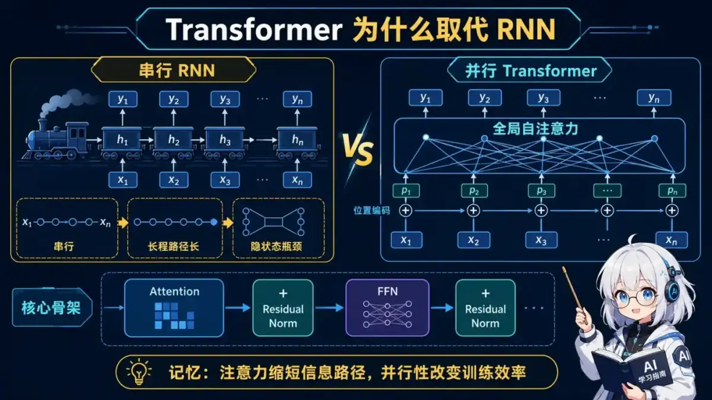</a></p>
<p align="center"><sub>🧠 图解记忆：注意力缩短信息路径，并行性改变训练效率；点击图片可查看原图。</sub></p>

<details>
<summary>💡 答案要点</summary>

**Transformer = 基于自注意力机制的序列到序列模型**

**为什么需要Transformer？**

**RNN/LSTM 的问题：**

| 问题 | 说明 | 影响 |
|------|------|------|
| **串行计算** | 必须逐个处理token | 训练慢，无法并行 |
| **长程依赖** | 梯度消失/爆炸 | 难以捕捉远距离关系 |
| **信息瓶颈** | 所有信息压缩到隐状态 | 信息丢失 |

**Transformer 的优势：**

```
┌─────────────────────────────────────────────────────────┐
│                  Transformer 架构                        │
└─────────────────────────────────────────────────────────┘

输入序列 → Embedding + 位置编码
     ↓
Encoder (N × 6 层)
├── Multi-Head Self-Attention
├── Add & Norm
├── Feed-Forward Network
└── Add & Norm
     ↓
Decoder (N × 6 层)
├── Masked Multi-Head Self-Attention
├── Add & Norm
├── Encoder-Decoder Cross-Attention
├── Add & Norm
├── Feed-Forward Network
└── Add & Norm
     ↓
Linear + Softmax → 输出概率分布
```

**核心创新：**

1. **Self-Attention（自注意力）**
   - 每个token都能直接"看到"所有其他token
   - 复杂度：O(n²)，但可以并行

2. **Multi-Head Attention（多头注意力）**
   - 多个注意力头，捕捉不同维度的关系
   - 8 或 16 个头

3. **位置编码（Positional Encoding）**
   - 注入序列位置信息
   - sin/cos 函数编码

4. **残差连接 + Layer Norm**
   - 解决梯度消失
   - 稳定训练

**性能对比（机器翻译任务）：**

| 模型 | BLEU | 训练时间 | 参数量 |
|------|------|----------|--------|
| LSTM | 25.3 | 10天 | 200M |
| Transformer Base | 27.3 | 12小时 | 65M |
| Transformer Big | 28.4 | 3.5天 | 213M |

**面试话术：**
> "Transformer 通过自注意力机制替代了RNN的串行计算。每个token可以直接关注所有其他token，实现了并行计算，训练速度提升10-100倍。虽然复杂度是O(n²)，但在实际应用中，并行带来的收益远大于复杂度的损失。"

</details>

### Q2: Transformer的Encoder和Decoder有什么区别？

<p align="center"><a href="../../assets/illustrations/04-transformer-architecture/q02-encoder-decoder.webp">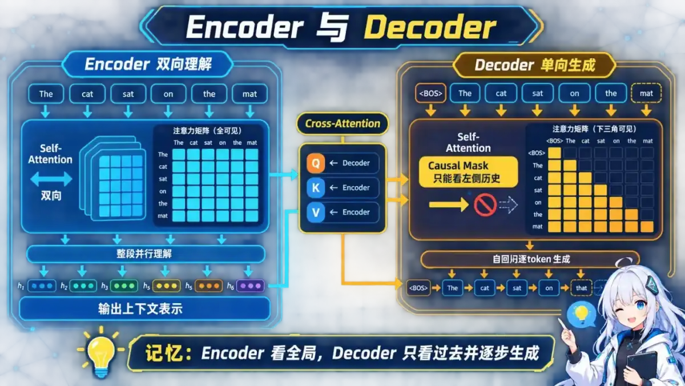</a></p>
<p align="center"><sub>🧠 图解记忆：Encoder 看全局，Decoder 只看过去并逐步生成；点击图片可查看原图。</sub></p>

<details>
<summary>💡 答案要点</summary>

**核心区别：Encoder是双向的，Decoder是单向的**

**Encoder（编码器）：**

```python
# Encoder 结构（重复N次，通常N=6）
for layer in range(N):
    # 1. Multi-Head Self-Attention
    # 可以看到整个输入序列（双向）
    attn_output = MultiHeadAttention(
        Q=x, K=x, V=x  # Query、Key、Value 都来自输入
    )
    x = LayerNorm(x + attn_output)  # 残差 + 归一化

    # 2. Feed-Forward Network
    ffn_output = FeedForward(x)
    x = LayerNorm(x + ffn_output)
```

**特点：**
- ✅ 双向注意力（可以看到前后文）
- ✅ 并行处理所有token
- ✅ 输出：编码后的表示（上下文向量）

**Decoder（解码器）：**

```python
# Decoder 结构（重复N次，通常N=6）
for layer in range(N):
    # 1. Masked Multi-Head Self-Attention
    # 只能看到当前及之前的token（单向）
    masked_attn = MaskedMultiHeadAttention(
        Q=y, K=y, V=y,  # 来自目标序列
        mask=causal_mask  # 上三角mask
    )
    y = LayerNorm(y + masked_attn)

    # 2. Encoder-Decoder Cross-Attention
    # Query来自Decoder，Key和Value来自Encoder输出
    cross_attn = MultiHeadAttention(
        Q=y,  # 来自 Decoder
        K=encoder_output,  # 来自 Encoder
        V=encoder_output   # 来自 Encoder
    )
    y = LayerNorm(y + cross_attn)

    # 3. Feed-Forward Network
    ffn_output = FeedForward(y)
    y = LayerNorm(y + ffn_output)
```

**特点：**
- ⚠️ 单向注意力（Masked，只能看之前的）
- ✅ 包含Cross-Attention（连接Encoder和Decoder）
- ⚠️ 自回归生成（逐个token生成）

**关键差异对比：**

| 维度 | Encoder | Decoder |
|------|---------|---------|
| **Self-Attention** | 双向（无mask） | 单向（有mask） |
| **Cross-Attention** | ❌ 无 | ✅ 有（连接Encoder） |
| **输入** | 源序列（如英文） | 目标序列（如中文） |
| **输出** | 编码表示 | 生成序列 |
| **应用** | BERT（仅Encoder） | GPT（仅Decoder） |

**Mask 机制详解：**

```
# Encoder: 无mask，所有token都能互相看到
Input:  [I, love, AI]
Attention Matrix:
      I   love  AI
I    ✓    ✓    ✓
love ✓    ✓    ✓
AI   ✓    ✓    ✓

# Decoder: Causal Mask，只能看当前及之前
Input:  [我, 喜欢, 人工智能]
Attention Matrix:
        我  喜欢  人工智能
我      ✓   ✗    ✗
喜欢    ✓   ✓    ✗
人工智能 ✓   ✓    ✓
```

**面试话术：**
> "Encoder用双向Self-Attention理解输入，Decoder用单向Masked Attention生成输出。Decoder还有Cross-Attention层，让生成的每个token都能关注Encoder的所有输出。BERT只用Encoder（理解任务），GPT只用Decoder（生成任务）。"

</details>

## 二、注意力机制

### Q3: Self-Attention（自注意力）是如何计算的？

<p align="center"><a href="../../assets/illustrations/04-transformer-architecture/q03-self-attention.webp"></a></p>
<p align="center"><sub>🧠 图解记忆：Q 和 K 算关注权重，缩放稳定 Softmax，再用权重汇总 V；点击图片可查看原图。</sub></p>

<details>
<summary>💡 答案要点</summary>

**Self-Attention = 让序列中的每个元素都能关注其他所有元素**

**数学公式：**

```
Attention(Q, K, V) = softmax(QK^T / √d_k) V
```

**详细步骤：**

**1. 生成 Q、K、V：**
```python
# 输入：X (batch_size, seq_len, d_model)
# 例如：(1, 5, 512)

# 通过线性变换生成 Q、K、V
Q = X @ W_Q  # (batch_size, seq_len, d_k)
K = X @ W_K  # (batch_size, seq_len, d_k)
V = X @ W_V  # (batch_size, seq_len, d_v)

# W_Q, W_K, W_V 是可学习的权重矩阵
# d_k = d_v = d_model / num_heads (通常 64)
```

**2. 计算注意力分数：**
```python
# 点积计算相似度
scores = Q @ K.T  # (batch_size, seq_len, seq_len)
# 例如：(1, 5, 5)

# 缩放（避免点积随维度增大，使 Softmax 过度饱和）
scores = scores / math.sqrt(d_k)

# 应用mask（可选，Decoder用）
if mask is not None:
    scores = scores.masked_fill(mask == 0, -1e9)
```

**3. Softmax归一化：**
```python
# 每一行做softmax，得到注意力权重
attention_weights = softmax(scores, dim=-1)
# (batch_size, seq_len, seq_len)

# 权重和为1
assert attention_weights.sum(dim=-1) == 1.0
```

**4. 加权求和：**
```python
# 用注意力权重加权V
output = attention_weights @ V
# (batch_size, seq_len, d_v)
```

**完整示例（序列长度=3）：**

<details>
<summary>展开 Python 代码示例（31 行）</summary>

```python
# 输入
X = [[1.0, 0.5],  # token 1
     [0.8, 1.0],  # token 2
     [0.5, 0.9]]  # token 3

# 假设 W_Q = W_K = W_V = I（单位矩阵）
Q = K = V = X

# 1. 计算相似度矩阵
scores = Q @ K.T
# [[1.25, 1.3, 0.95],
#  [1.3,  1.64, 1.3],
#  [0.95, 1.3, 1.06]]

# 2. 缩放（假设 d_k=2）
scores = scores / sqrt(2)
# [[0.88, 0.92, 0.67],
#  [0.92, 1.16, 0.92],
#  [0.67, 0.92, 0.75]]

# 3. Softmax
attention_weights = softmax(scores, dim=-1)
# [[0.32, 0.35, 0.33],  # token 1 对 3 个token的注意力
#  [0.28, 0.44, 0.28],  # token 2 对 3 个token的注意力
#  [0.29, 0.37, 0.34]]  # token 3 对 3 个token的注意力

# 4. 加权求和
output = attention_weights @ V
# [[0.77, 0.80],  # token 1的输出
#  [0.76, 0.87],  # token 2的输出
#  [0.74, 0.82]]  # token 3的输出
```

</details>

**为什么要缩放（除以√d_k）？**

```
问题：
  当 d_k 很大时（如512），QK^T 的值会很大
  → Softmax 梯度接近0（饱和）
  → 梯度消失

解决：
  除以 √d_k，将方差缩放到1
  → 保持Softmax输入在合理范围
  → 梯度稳定
```

**面试话术：**
> "Self-Attention 先用 QK^T 计算相关性，再除以 √d_k，避免维度增大时点积过大导致 Softmax 饱和；随后归一化权重并对 V 加权求和。"

</details>

### Q4: Multi-Head Attention（多头注意力）是什么？为什么要用多头？

<p align="center"><a href="../../assets/illustrations/04-transformer-architecture/q04-multi-head-attention.webp">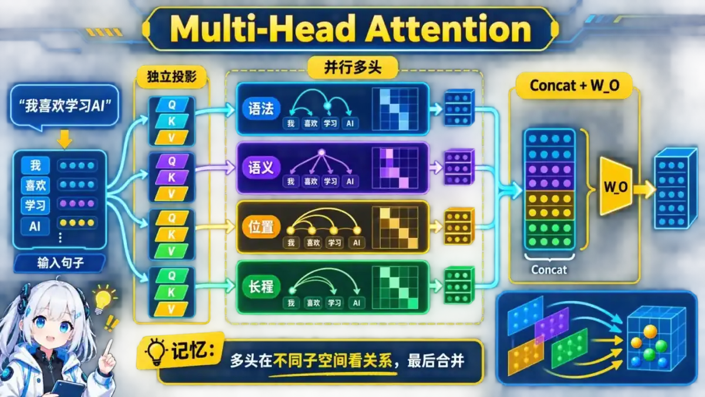</a></p>
<p align="center"><sub>🧠 图解记忆：多头在不同子空间看关系，最后合并；点击图片可查看原图。</sub></p>

<details>
<summary>💡 答案要点</summary>

**Multi-Head Attention = 多个Self-Attention并行，捕捉不同类型的关系**

**为什么需要多头？**

**单头的局限：**
```
单个注意力头只能学习一种模式
例如：
  "我 爱 吃 苹果"

单头可能只关注：
  语法关系："我" ← "爱"（主谓）

但错过了：
  语义关系："吃" ← "苹果"（动宾）
  共指关系："我" → "我"（指代）
```

**多头的优势：**
```
8个头可以学习不同的模式：
  Head 1: 语法关系（主谓宾）
  Head 2: 语义关系（实体-动作）
  Head 3: 位置关系（相邻词）
  Head 4: 长程依赖（句首-句尾）
  ...
  Head 8: 其他模式
```

**架构：**

<details>
<summary>展开 Python 代码示例（46 行）</summary>

```python
class MultiHeadAttention:
    def __init__(self, d_model=512, num_heads=8):
        self.num_heads = num_heads
        self.d_k = d_model // num_heads  # 64

        # 每个头有独立的 Q、K、V 权重
        self.W_Q = nn.Linear(d_model, d_model)
        self.W_K = nn.Linear(d_model, d_model)
        self.W_V = nn.Linear(d_model, d_model)

        # 输出投影
        self.W_O = nn.Linear(d_model, d_model)

    def forward(self, Q, K, V, mask=None):
        batch_size = Q.size(0)

        # 1. 线性变换并分头
        # (batch, seq_len, d_model) → (batch, seq_len, num_heads, d_k)
        Q = self.W_Q(Q).view(batch_size, -1, self.num_heads, self.d_k)
        K = self.W_K(K).view(batch_size, -1, self.num_heads, self.d_k)
        V = self.W_V(V).view(batch_size, -1, self.num_heads, self.d_k)

        # 转置以并行计算多头
        # (batch, num_heads, seq_len, d_k)
        Q = Q.transpose(1, 2)
        K = K.transpose(1, 2)
        V = V.transpose(1, 2)

        # 2. 每个头独立计算注意力
        scores = torch.matmul(Q, K.transpose(-2, -1)) / math.sqrt(self.d_k)

        if mask is not None:
            scores = scores.masked_fill(mask == 0, -1e9)

        attention = F.softmax(scores, dim=-1)
        output = torch.matmul(attention, V)

        # 3. 合并多头
        # (batch, num_heads, seq_len, d_k) → (batch, seq_len, d_model)
        output = output.transpose(1, 2).contiguous()
        output = output.view(batch_size, -1, self.num_heads * self.d_k)

        # 4. 输出投影
        output = self.W_O(output)

        return output
```

</details>

**可视化示例（8个头）：**

```
输入："The cat sat on the mat"

Head 1（主语-谓语）:
  cat → sat (0.9)

Head 2（谓语-宾语）:
  sat → mat (0.8)

Head 3（修饰关系）:
  the → cat (0.7)
  the → mat (0.6)

Head 4（位置关系）:
  on → the (0.9)

...

最终输出 = Concat(Head1, Head2, ..., Head8) @ W_O
```

**参数对比：**

| 方案 | 参数量 | 表达能力 |
|------|--------|----------|
| 单头（d_model=512） | 512² × 3 = 786K | 低 |
| 8头（d_k=64） | 512² × 3 + 512² = 1.05M | **高** |

**实验证明（BLEU分数，机器翻译）：**

| 头数 | BLEU | 说明 |
|------|------|------|
| 1 | 25.8 | 单头 |
| 2 | 26.4 | +0.6 |
| 4 | 27.1 | +1.3 |
| 8 | **27.3** | **最佳** |
| 16 | 27.2 | 过多反而下降 |

**面试话术：**
> "Multi-Head Attention让模型同时学习多种注意力模式。8个头可以分别关注语法、语义、位置等不同维度的关系。虽然参数量略增，但表达能力大幅提升。实验表明8头是最佳选择。"

</details>

### Q5: 位置编码（Positional Encoding）是什么？为什么需要它？

<p align="center"><a href="../../assets/illustrations/04-transformer-architecture/q05-positional-encoding.webp">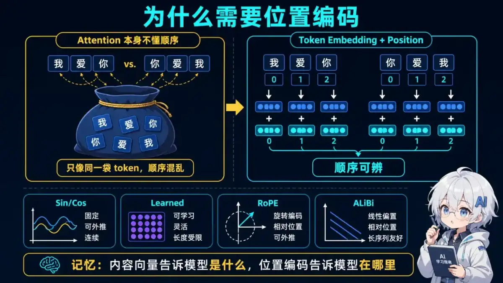</a></p>
<p align="center"><sub>🧠 图解记忆：内容向量告诉模型是什么，位置编码告诉模型在哪里；点击图片可查看原图。</sub></p>

<details>
<summary>💡 答案要点</summary>

**位置编码 = 给每个token注入位置信息**

**为什么需要？**

```
问题：
  Self-Attention 是置换不变的（permutation-invariant）

例子：
  "我 爱 你" 和 "你 爱 我"
  如果没有位置编码，Attention 输出可能相同
  → 无法区分顺序

解决：
  加入位置信息，让模型知道每个token的位置
```

**Transformer 的位置编码（Sinusoidal）：**

**公式：**
```python
PE(pos, 2i)   = sin(pos / 10000^(2i/d_model))
PE(pos, 2i+1) = cos(pos / 10000^(2i/d_model))

其中：
  pos: 位置（0, 1, 2, ...）
  i:   维度索引（0 到 d_model/2）
  d_model: 模型维度（如512）
```

**实现：**
```python
def positional_encoding(max_len, d_model):
    # 创建位置矩阵
    position = torch.arange(max_len).unsqueeze(1)  # (max_len, 1)

    # 创建维度矩阵
    div_term = torch.exp(
        torch.arange(0, d_model, 2) *
        -(math.log(10000.0) / d_model)
    )  # (d_model/2,)

    # 初始化位置编码
    pe = torch.zeros(max_len, d_model)

    # 偶数维度用sin
    pe[:, 0::2] = torch.sin(position * div_term)

    # 奇数维度用cos
    pe[:, 1::2] = torch.cos(position * div_term)

    return pe

# 使用
pe = positional_encoding(max_len=100, d_model=512)
# pe.shape: (100, 512)

# 加到输入上
x = embedding(input_ids) + pe[: input_ids.size(1)]
```

**为什么用sin/cos？**

**优势：**

1. **确定性**：位置固定，不需要学习
2. **可生成任意位置的编码**：公式能计算训练长度之外的位置，但模型在更长序列上的有效能力仍需实测
3. **周期性**：不同位置间有规律的相对关系

**相对位置关系：**
```python
# PE(pos + k) 可以表示为 PE(pos) 的线性组合
# 这让模型能学习相对位置

例如：
  PE(5) 和 PE(10) 的距离
  = PE(1) 和 PE(6) 的距离
  （相对距离都是5）
```

**可视化（前10个位置，前64维）：**

```
位置  维度0  维度1  维度2  维度3  ...
0     0.00   1.00   0.00   1.00
1     0.84   0.54   0.01   1.00
2     0.91  -0.42   0.02   1.00
3     0.14  -0.99   0.03   1.00
...
```

**其他位置编码方案：**

| 方案 | 优点 | 缺点 | 应用 |
|------|------|------|------|
| **Sinusoidal** | 确定性，可计算更长位置 | 训练长度外效果无保证 | Transformer |
| **Learned** | 可学习，灵活 | 超出已训练位置通常需要扩展并继续训练 | BERT |
| **RoPE** | 相对位置，旋转 | 实现复杂 | LLaMA |
| **ALiBi** | 注意力偏置 | 需要重训练 | BLOOM |

**现代改进：RoPE（Rotary Position Embedding）：**

```python
# LLaMA/GPT-NeoX 使用
# 核心思想：在注意力计算时旋转 Q 和 K

def apply_rotary_emb(q, k, cos, sin):
    # 旋转 Q 和 K
    q_rot = rotate_half(q)
    k_rot = rotate_half(k)

    q = q * cos + q_rot * sin
    k = k * cos + k_rot * sin

    return q, k

# 优势：
#   - 相对位置编码
#   - 便于表达相对位置信息
#   - 长度扩展仍需要缩放策略并通过目标任务验证
```

**面试话术：**
> "Transformer 需要额外注入位置信息。Sin/Cos 编码无训练参数且能计算任意位置；RoPE 通过旋转 Q、K 让注意力分数自然携带相对位置信息。两者在训练长度外都不能只凭公式宣称有效，必须做长上下文评测。"

</details>

## 三、BERT与GPT

### Q6: BERT 和 GPT 有什么区别？

<p align="center"><a href="../../assets/illustrations/04-transformer-architecture/q06-bert-vs-gpt.webp">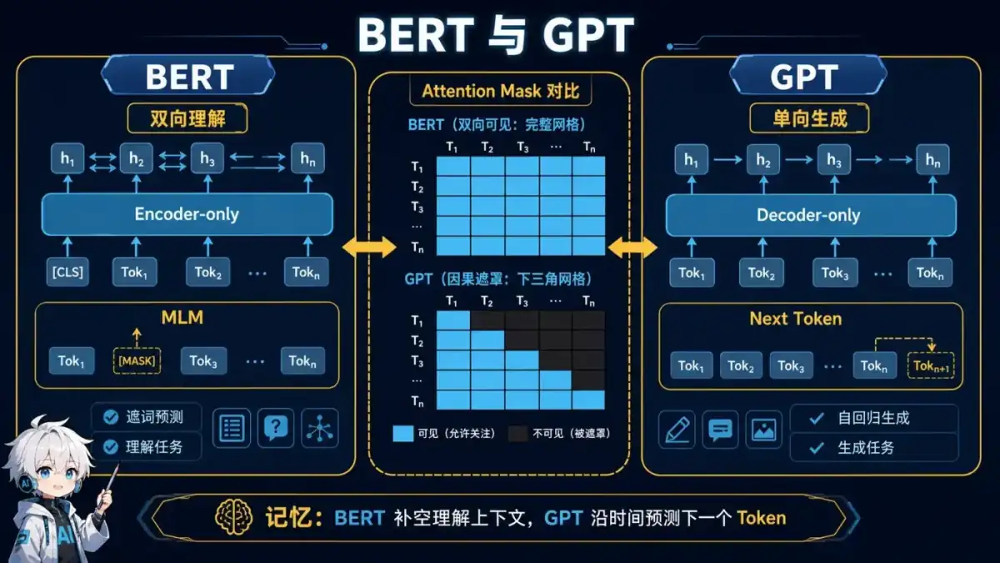</a></p>
<p align="center"><sub>🧠 图解记忆：BERT 补空理解上下文，GPT 沿时间预测下一个 Token；点击图片可查看原图。</sub></p>

<details>
<summary>💡 答案要点</summary>

**核心区别：BERT是双向理解，GPT是单向生成**

**架构对比：**

| 维度 | BERT | GPT |
|------|------|-----|
| **架构** | 仅Encoder | 仅Decoder |
| **注意力** | 双向（无mask） | 单向（causal mask） |
| **训练目标** | MLM + NSP | 自回归语言模型 |
| **任务类型** | 理解（分类、NER） | 生成（文本生成） |
| **参数** | 110M-340M | 117M-175B |

**BERT（Bidirectional Encoder Representations from Transformers）：**

```
┌─────────────────────────────────────────────────────────┐
│                    BERT 架构                             │
└─────────────────────────────────────────────────────────┘

输入："The [MASK] sat on the mat"
  ↓
Embedding + Positional Encoding
  ↓
Transformer Encoder (12/24 层)
├── Multi-Head Self-Attention（双向）
└── Feed-Forward Network
  ↓
输出：每个token的上下文表示
  ↓
任务头（分类/NER/...）
```

**训练目标1：MLM（Masked Language Model）**
```python
# 随机mask 15%的token
原文："The cat sat on the mat"
Mask: "The [MASK] sat on the [MASK]"

# 预测被mask的词
损失 = CrossEntropy(预测, ["cat", "mat"])

# 15%中的策略：
#   80%: 替换为 [MASK]
#   10%: 替换为随机词
#   10%: 保持不变
```

**训练目标2：NSP（Next Sentence Prediction）**
```python
# 判断两句话是否连续
输入：
  A: "The cat sat on the mat."
  B: "It was very comfortable."
  Label: IsNext (1) or NotNext (0)

损失 = BCELoss(预测, Label)
```

**GPT（Generative Pre-trained Transformer）：**

```
┌─────────────────────────────────────────────────────────┐
│                    GPT 架构                              │
└─────────────────────────────────────────────────────────┘

输入："The cat sat on"
  ↓
Embedding + Positional Encoding
  ↓
Transformer Decoder (12/96 层)
├── Masked Multi-Head Self-Attention（单向）
└── Feed-Forward Network
  ↓
输出：下一个token的概率分布
  ↓
预测："the" (概率0.8)
```

**训练目标：自回归语言模型**
```python
# 预测下一个词
输入："The cat sat"
目标："on"

# 训练时并行计算所有位置的损失
损失 = Σ CrossEntropy(预测[i], 目标[i])

# 推理时自回归生成
generated = []
for i in range(max_len):
    next_token = model.predict(generated)
    generated.append(next_token)
```

**能力对比：**

| 任务 | BERT | GPT |
|------|------|-----|
| **文本分类** | ⭐⭐⭐⭐⭐ | ⭐⭐⭐ |
| **命名实体识别** | ⭐⭐⭐⭐⭐ | ⭐⭐ |
| **问答** | ⭐⭐⭐⭐ | ⭐⭐⭐⭐ |
| **文本生成** | ⭐ | ⭐⭐⭐⭐⭐ |
| **摘要** | ⭐⭐ | ⭐⭐⭐⭐⭐ |
| **对话** | ⭐ | ⭐⭐⭐⭐⭐ |

**实际应用：**

**BERT 擅长：**
```python
# 1. 分类
"This movie is great!" → Positive (0.95)

# 2. NER（命名实体识别）
"Apple was founded by Steve Jobs"
→ [Apple: ORG], [Steve Jobs: PER]

# 3. 问答
Context: "Paris is the capital of France."
Question: "What is the capital of France?"
Answer: "Paris" (span: [0, 5])
```

**GPT 擅长：**
```python
# 1. 文本生成
Prompt: "Once upon a time"
Output: "there was a brave knight..."

# 2. 对话
User: "How are you?"
GPT: "I'm doing well, thank you!"

# 3. 代码生成
Prompt: "Write a Python function to sort a list"
Output: "def sort_list(arr): return sorted(arr)"
```

**为什么BERT用双向，GPT用单向？**

```
BERT：
  目标是理解语言
  双向能看到完整上下文
  例如："bank"（银行 vs 河岸）需要前后文判断

GPT：
  目标是生成语言
  必须单向，否则"作弊"
  生成时只能看已生成的部分
```

**面试话术：**
> "BERT 是理解型模型，用双向Encoder + MLM训练，擅长分类、NER。GPT 是生成型模型，用单向Decoder + 自回归训练，擅长文本生成、对话。BERT看完整上下文理解语义，GPT逐个生成token。"

</details>

## 四、优化技巧

### Q7: Transformer 训练时有哪些优化技巧？

<p align="center"><a href="../../assets/illustrations/04-transformer-architecture/q07-training-toolbox.webp">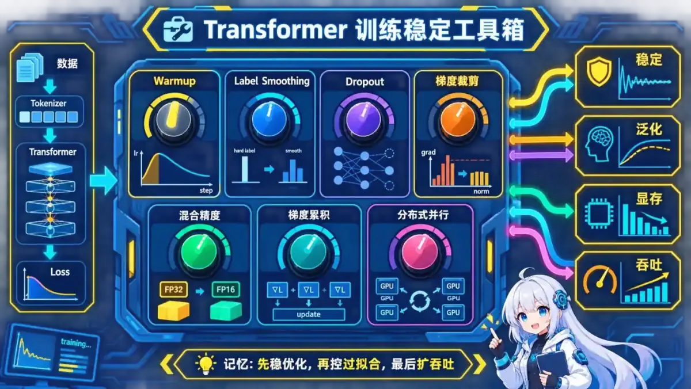</a></p>
<p align="center"><sub>🧠 图解记忆：先稳优化，再控过拟合，最后扩吞吐；点击图片可查看原图。</sub></p>

<details>
<summary>💡 答案要点</summary>

**核心优化方向：**

1. **学习率调度**
2. **正则化**
3. **训练稳定性**
4. **计算效率**

**1. 学习率调度（Warmup + Decay）：**

```python
# Warmup阶段：线性增加学习率
def get_lr(step, d_model, warmup_steps=4000):
    # Transformer 原论文方案
    lr = d_model ** (-0.5) * min(
        step ** (-0.5),
        step * warmup_steps ** (-1.5)
    )
    return lr

# 为什么需要Warmup？
# - 初始时权重随机，梯度不稳定
# - 小学习率让模型"热身"
# - 然后逐渐增大到峰值
# - 最后逐渐衰减

# 典型曲线：
#   0-4K步：线性增加 0 → peak_lr
#   4K步后：按 1/√step 衰减
```

**2. Label Smoothing（标签平滑）：**

<details>
<summary>展开 Python 代码示例（30 行）</summary>

```python
# 问题：Hard Label容易过拟合
hard_label = [0, 0, 0, 1, 0]  # one-hot

# 解决：Label Smoothing
smooth_label = [0.02, 0.02, 0.02, 0.92, 0.02]
# 真实类别：0.92（1 - smoothing）
# 其他类别：0.02（smoothing / (n_classes - 1)）

class LabelSmoothingLoss(nn.Module):
    def __init__(self, n_classes, smoothing=0.1):
        super().__init__()
        self.smoothing = smoothing
        self.n_classes = n_classes

    def forward(self, pred, target):
        # pred: (batch, n_classes)
        # target: (batch,) 类别索引

        confidence = 1.0 - self.smoothing
        smooth_value = self.smoothing / (self.n_classes - 1)

        # 构造smooth label
        smooth_label = torch.full_like(pred, smooth_value)
        smooth_label.scatter_(1, target.unsqueeze(1), confidence)

        # KL散度损失
        loss = -torch.sum(smooth_label * torch.log_softmax(pred, dim=1), dim=1)
        return loss.mean()

# 效果：提升泛化能力，BLEU +0.2
```

</details>

**3. Dropout 策略：**

```python
class TransformerLayer(nn.Module):
    def __init__(self, d_model=512, dropout=0.1):
        super().__init__()
        self.dropout = dropout

    def forward(self, x):
        # 1. Attention Dropout
        attn_output = self.attention(x)
        attn_output = F.dropout(attn_output, p=self.dropout, training=self.training)

        # 2. Residual Dropout
        x = x + attn_output

        # 3. FFN Dropout
        ffn_output = self.ffn(x)
        ffn_output = F.dropout(ffn_output, p=self.dropout, training=self.training)

        x = x + ffn_output

        return x

# 典型配置：
#   Attention Dropout: 0.1
#   Residual Dropout: 0.1
#   FFN Dropout: 0.1
#   Embedding Dropout: 0.1
```

**4. 梯度裁剪（Gradient Clipping）：**

```python
# 防止梯度爆炸
max_grad_norm = 1.0

for batch in dataloader:
    loss = model(batch)
    loss.backward()

    # 裁剪梯度
    torch.nn.utils.clip_grad_norm_(
        model.parameters(),
        max_grad_norm
    )

    optimizer.step()
    optimizer.zero_grad()
```

**5. Mixed Precision Training（混合精度）：**

```python
from torch.cuda.amp import autocast, GradScaler

scaler = GradScaler()

for batch in dataloader:
    optimizer.zero_grad()

    # FP16 前向传播
    with autocast():
        loss = model(batch)

    # 缩放损失，FP16 反向传播
    scaler.scale(loss).backward()

    # 更新权重（FP32）
    scaler.step(optimizer)
    scaler.update()

# 优势：
#   - 速度提升 2-3 倍
#   - 显存节省 50%
#   - 精度损失 < 0.1%
```

**6. 批量大小优化：**

```python
# 问题：GPU显存有限，batch_size受限

# 解决：梯度累积
accumulation_steps = 4
effective_batch_size = batch_size * accumulation_steps

optimizer.zero_grad()
for i, batch in enumerate(dataloader):
    loss = model(batch) / accumulation_steps
    loss.backward()

    if (i + 1) % accumulation_steps == 0:
        optimizer.step()
        optimizer.zero_grad()

# 效果：
#   原来：batch_size=32，每步更新
#   现在：batch_size=32×4=128，每4步更新
#   显存不变，效果更好
```

**7. 并行训练：**

```python
# 数据并行（Data Parallel）
model = nn.DataParallel(model)

# 分布式数据并行（Distributed Data Parallel，推荐）
model = nn.parallel.DistributedDataParallel(model)

# 模型并行（Model Parallel，超大模型）
# 不同层放在不同GPU
class ModelParallel(nn.Module):
    def __init__(self):
        super().__init__()
        self.encoder = nn.Sequential(*layers[:6]).to('cuda:0')
        self.decoder = nn.Sequential(*layers[6:]).to('cuda:1')

    def forward(self, x):
        x = self.encoder(x.to('cuda:0'))
        x = self.decoder(x.to('cuda:1'))
        return x
```

**典型配置（Transformer Base）：**

| 参数 | 值 |
|------|-----|
| d_model | 512 |
| n_heads | 8 |
| d_ff | 2048 |
| n_layers | 6 |
| dropout | 0.1 |
| warmup_steps | 4000 |
| label_smoothing | 0.1 |
| max_grad_norm | 1.0 |
| batch_size | 25K tokens |
| optimizer | Adam(β1=0.9, β2=0.98, ε=1e-9) |

**面试话术：**
> "Transformer 训练的关键优化包括：Warmup学习率调度（先升后降）、Label Smoothing防过拟合、多层Dropout正则化、梯度裁剪防爆炸。工程上用混合精度训练加速2-3倍，梯度累积模拟大batch。"

</details>

### Q8: Q K V矩阵的详细计算过程是什么?

<p align="center"><a href="../../assets/illustrations/04-transformer-architecture/q08-qkv-tensors.webp"></a></p>
<p align="center"><sub>🧠 图解记忆：Q 与 K 决定看谁，权重再聚合 V 的内容；点击图片可查看原图。</sub></p>

<details>
<summary>💡 答案要点</summary>

**Q K V = Query(查询)、Key(键)、Value(值)**

### 生成过程

**步骤1: 输入embedding**
```python
# 输入序列: "我 爱 AI"
input_ids = [101, 234, 567]  # token IDs
embeddings = embedding_layer(input_ids)  # shape: (3, 512)
# 每个token → 512维向量

# 加上位置编码
position_encodings = get_position_encoding(3, 512)
input_repr = embeddings + position_encodings  # shape: (3, 512)
```

**步骤2: 线性变换生成Q K V**
```python
# 3个可学习的权重矩阵
W_Q = nn.Linear(512, 512)  # Query权重
W_K = nn.Linear(512, 512)  # Key权重
W_V = nn.Linear(512, 512)  # Value权重

# 生成Q K V
Q = W_Q(input_repr)  # shape: (3, 512)
K = W_K(input_repr)  # shape: (3, 512)
V = W_V(input_repr)  # shape: (3, 512)
```

**为什么需要3个矩阵?**
- **Q(查询)**: "我想找什么信息?"
- **K(键)**: "我能提供什么信息?"
- **V(值)**: "我包含什么信息?"

**类比搜索引擎:**
```
Q = 用户搜索词 "Python教程"
K = 文档标题 ["Python入门", "Java教程", "Python高级"]
V = 文档内容 [实际的Python教程文本]

步骤:
1. Q与每个K计算相似度 → 注意力分数
2. 用分数加权V → 最终输出
```

### Multi-Head Attention详细计算

**步骤1: 拆分成多个头**
```python
num_heads = 8
d_model = 512
d_k = d_model // num_heads  # 512 / 8 = 64

# 将Q K V reshape成多头
Q_multi = Q.view(batch_size, seq_len, num_heads, d_k)
# shape: (batch, 3, 8, 64)

K_multi = K.view(batch_size, seq_len, num_heads, d_k)
V_multi = V.view(batch_size, seq_len, num_heads, d_k)

# 转置: (batch, num_heads, seq_len, d_k)
Q_multi = Q_multi.transpose(1, 2)  # (batch, 8, 3, 64)
K_multi = K_multi.transpose(1, 2)
V_multi = V_multi.transpose(1, 2)
```

**步骤2: 每个头独立计算Attention**
```python
# Scaled Dot-Product Attention
scores = torch.matmul(Q_multi, K_multi.transpose(-2, -1))
# shape: (batch, 8, 3, 3)
# 3×3矩阵: 每个token对所有token的注意力分数

# 缩放（避免点积过大导致 Softmax 饱和）
scores = scores / math.sqrt(d_k)  # 除以√64 = 8

# Softmax归一化
attention_weights = F.softmax(scores, dim=-1)
# shape: (batch, 8, 3, 3)

# 加权求和
output = torch.matmul(attention_weights, V_multi)
# shape: (batch, 8, 3, 64)
```

**步骤3: 拼接所有头**
```python
# 转置回来
output = output.transpose(1, 2)  # (batch, 3, 8, 64)

# 拼接
output = output.contiguous().view(batch_size, seq_len, d_model)
# shape: (batch, 3, 512)  # 8×64 = 512

# 最终线性变换
output = W_O(output)  # W_O: (512, 512)
```

**完整示例(数值):**
```python
# 假设seq_len=3, d_k=4 (简化)
Q = [[1,0,1,0],   # token1的Query
     [0,2,0,2],   # token2的Query
     [1,1,1,1]]   # token3的Query

K = [[0,1,0,1],   # token1的Key
     [1,1,1,1],   # token2的Key
     [2,2,2,2]]   # token3的Key

# 步骤1: Q × K^T
scores = Q @ K.T
# [[1,2,4],
#  [4,4,8],
#  [2,4,8]]

# 步骤2: 缩放
scores = scores / sqrt(4) = scores / 2
# [[0.5,1,2],
#  [2,2,4],
#  [1,2,4]]

# 步骤3: Softmax
weights = softmax(scores, dim=-1)
# [[0.18, 0.24, 0.58],   # token1关注token3最多
#  [0.12, 0.12, 0.76],   # token2关注token3最多
#  [0.09, 0.24, 0.67]]   # token3关注自己最多

# 步骤4: 加权求和Value
output = weights @ V
```

**面试话术:**
> "Q K V的本质是3种视角看同一个信息。Q是'我要找什么',K是'我能匹配什么',V是'我的内容是什么'。Multi-Head让模型从8个不同角度理解文本,比如一个头关注语法,另一个关注语义。"

</details>

---

### Q9: 位置编码的详细原理是什么?为什么用sin/cos?

<p align="center"><a href="../../assets/illustrations/04-transformer-architecture/q09-sinusoidal-position.webp">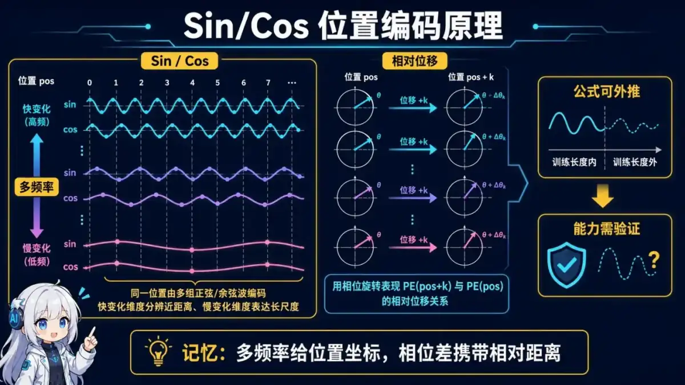</a></p>
<p align="center"><sub>🧠 图解记忆：多频率给位置坐标，相位差携带相对距离；点击图片可查看原图。</sub></p>

<details>
<summary>💡 答案要点</summary>

**位置编码 = 让模型知道token的位置信息**

### 为什么需要位置编码?

**问题：不含位置编码的 Self-Attention 对输入置换是等变的，无法单独区分词序**
```python
# 改变输入顺序会相应改变输出位置，但不会自动知道“第几个 token”的语义
input1 = ["狗", "咬", "人"]
input2 = ["人", "咬", "狗"]

# 若忽略输出位置的同样置换，计算结构本身不含绝对顺序信息
```

**解决: 加入位置信息**
```python
embedding_with_pos = word_embedding + positional_encoding
```

### Sin/Cos位置编码公式

```python
PE(pos, 2i) = sin(pos / 10000^(2i/d_model))
PE(pos, 2i+1) = cos(pos / 10000^(2i/d_model))

其中:
- pos: 位置(0, 1, 2, ...)
- i: 维度索引(0 到 d_model/2)
- d_model: embedding维度(如512)
```

**具体计算示例:**
```python
import numpy as np

def get_positional_encoding(max_len, d_model):
    pe = np.zeros((max_len, d_model))

    for pos in range(max_len):
        for i in range(0, d_model, 2):
            # 偶数维度: sin
            pe[pos, i] = np.sin(pos / (10000 ** (i/d_model)))

            # 奇数维度: cos
            if i+1 < d_model:
                pe[pos, i+1] = np.cos(pos / (10000 ** (i/d_model)))

    return pe

# 示例: max_len=100, d_model=512
pe = get_positional_encoding(100, 512)

# 位置0的编码
print(pe[0])  # [sin(0/1), cos(0/1), sin(0/464), cos(0/464), ...]

# 位置1的编码
print(pe[1])  # [sin(1/1), cos(1/1), sin(1/464), cos(1/464), ...]
```

### 为什么选sin/cos?

**优势1: 表示相对位置**
```python
# 数学性质: sin/cos的线性组合
sin(α + β) = sin(α)cos(β) + cos(α)sin(β)
cos(α + β) = cos(α)cos(β) - sin(α)sin(β)

# 意味着: PE(pos+k)可由PE(pos)线性变换得到
# 模型容易学习相对位置关系
```

**优势2: 泛化到未见过的长度**
```python
# 训练: max_len=512
# 推理: len=1024  # 超出训练长度

# sin/cos是连续函数,可以外推
pe_1024 = get_positional_encoding(1024, 512)  # 依然有效!
```

**优势3: 不同频率捕捉不同范围**
```python
# 低频(i接近0): 变化慢,捕捉长距离关系
PE(pos, 0) = sin(pos / 1)  # 周期短,变化快

# 高频(i接近d_model): 变化快,捕捉近距离关系
PE(pos, 511) = sin(pos / 10000)  # 周期长,变化慢
```

**可视化:**
```
Position 0: [0.00, 1.00, 0.00, 1.00, 0.00, 1.00, ...]
Position 1: [0.84, 0.54, 0.01, 1.00, 0.00, 1.00, ...]
Position 2: [0.91,-0.42, 0.02, 1.00, 0.00, 1.00, ...]
           ↑ 快变化  ↑ 慢变化
```

### 其他位置编码方法

| 方法 | 原理 | 优缺点 | 应用 |
|------|------|--------|------|
| **Sin/Cos** | 固定公式 | ✅泛化好 ❌不可学习 | 原始Transformer |
| **Learned PE** | 可学习embedding | ✅适应任务 ❌不泛化 | BERT |
| **RoPE** | 旋转位置编码 | ✅长文本好 | LLaMA |
| **ALiBi** | 注意力偏置 | ✅超长文本 | MPT |

**RoPE简介(LLaMA使用):**
```python
# 不是加法,而是旋转
# Q和K乘以旋转矩阵
Q_rot = rotate(Q, position)
K_rot = rotate(K, position)

# 优势: 相对位置信息更明确
# LLaMA-2可处理4K→32K上下文
```

**面试话术:**
> "Sin/Cos编码的巧妙之处在于:1)不同频率捕捉不同距离 2)可外推到训练时未见长度 3)相对位置可线性表示。现代LLM如LLaMA改用RoPE,在超长文本上表现更好。我们项目用ALiBi,32K上下文零成本扩展。"

</details>

---

## 五、速记卡片

### Transformer 核心概念

| 概念 | 一句话解释 |
|------|------------|
| **Transformer** | 基于自注意力的序列模型，可并行训练 |
| **Self-Attention** | 每个token关注所有其他token |
| **Multi-Head** | 多个注意力头捕捉不同关系 |
| **Positional Encoding** | sin/cos函数注入位置信息 |

### 注意力机制

| 公式/概念 | 说明 |
|----------|------|
| **Attention(Q,K,V)** | softmax(QK^T/√d_k)V |
| **缩放因子** | √d_k，避免点积过大使 Softmax 饱和 |
| **Causal Mask** | 上三角mask，生成时只看之前 |
| **Cross-Attention** | Q来自Decoder，K/V来自Encoder |

### BERT vs GPT

| 维度 | BERT | GPT |
|------|------|-----|
| **架构** | Encoder only | Decoder only |
| **注意力** | 双向 | 单向(masked) |
| **训练** | MLM + NSP | 自回归LM |
| **任务** | 理解(分类/NER) | 生成(对话/摘要) |

### 优化技巧

| 技巧 | 效果 |
|------|------|
| **Warmup** | 稳定训练，先升后降学习率 |
| **Label Smoothing** | 缓解过度自信；是否有效需按任务验证 |
| **Gradient Clipping** | 限制梯度范数；阈值是超参数 |
| **Mixed Precision** | 降低显存/带宽并利用低精度算力；收益依硬件与算子而定 |
| **Gradient Accumulation** | 模拟大batch，不增显存 |

## 六、进阶架构：Transformer + SSM 混合模型（Mamba）

### Q10: 什么是 SSM（状态空间模型）？它与 Transformer 混合时解决什么问题？

<p align="center"><a href="../../assets/illustrations/04-transformer-architecture/q10-transformer-ssm.webp">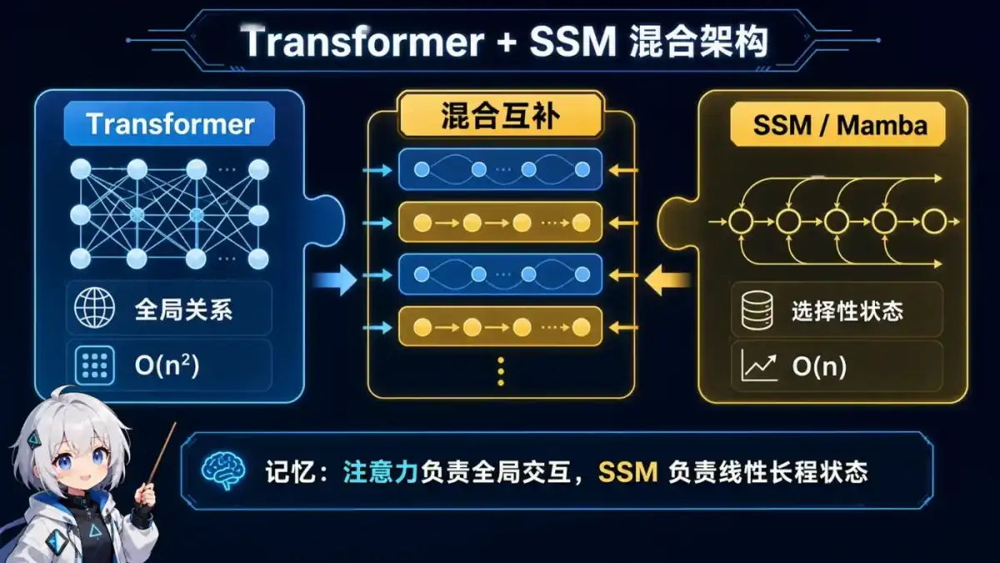</a></p>
<p align="center"><sub>🧠 图解记忆：注意力负责全局交互，SSM 负责线性长程状态；点击图片可查看原图。</sub></p>

<details>
<summary>💡 答案要点</summary>

**为什么值得了解：**

SSM、Mamba 及注意力/SSM 混合架构是长序列建模的重要研究方向。不要把未公开的闭源模型内部结构当作已确认事实；面试重点应放在计算复杂度、状态压缩、并行训练和信息检索能力的取舍。

---

**SSM（状态空间模型）是什么：**

SSM将序列建模视为一个"状态转移系统"：

```
输入序列 x(t) → 状态空间模型 → 输出序列 y(t)
                    ↑
              隐状态 h(t)

核心方程（连续形式）：
  h'(t) = Ah(t) + Bx(t)     ← 状态更新
  y(t)   = Ch(t) + Dx(t)    ← 输出生成

离散化后（实际计算形式）：
  h_t = Ah_{t-1} + Bx_t     ← 线性 recurrence
  y_t = Ch_t
```

| 特性 | Transformer | SSM（Mamba） |
|------|------------|---------------|
| **计算复杂度** | O(n²) 自注意力 | O(n) 线性 recurrence |
| **长序列处理** | 显存瓶颈 | 天然支持长序列 |
| **并行训练** | 容易（矩阵运算） | 需要并行算法优化 |
| **推理速度** | 慢（需要完整注意力） | 快（固定状态转移） |
| **信息访问方式** | 可直接做 token 间内容寻址 | 历史被压入状态，随机回看能力受结构影响 |

---

**Mamba的核心创新：Selection Mechanism（选择性机制）**

传统SSM对所有输入用相同的静态矩阵——这和"不根据输入调整"的CNN一样，限制了表达能力。

Mamba的关键洞察：**让SSM的参数变成输入的函数**

```
静态 SSM：      h_t = Ah_{t-1} + Bx_t     ← A、B 不变
Mamba（选择性）：h_t = A(x_t)h_{t-1} + B(x_t)x_t  ← 输入决定参数

→ 模型能"选择性遗忘"无关信息，"选择性记住"关键信息
→ 类似于LSTM的门控机制，但参数更少
```

---

**为什么需要Transformer + SSM混合架构：**

```
┌─────────────────────────────────────────────────┐
│          2026年大模型混合架构                    │
├─────────────────────────────────────────────────┤
│  Transformer层：擅长全局注意力                   │
│  → 复杂推理、多跳关系、长距离依赖                │
│  → 瓶颈：O(n²) 显存，n越长越贵                  │
├─────────────────────────────────────────────────┤
│  SSM层：擅长线性长程依赖                         │
│  → 简单模式识别、长程记忆、归纳偏置              │
│  → 瓶颈：表达复杂推理关系不如Transformer        │
├─────────────────────────────────────────────────┤
│  混合结果：                                      │
│  → 降低部分长序列层的计算或状态成本              │
│  → 保留若干注意力层的内容寻址能力                │
│  → 效果、吞吐和延迟仍需按模型与硬件验证          │
└─────────────────────────────────────────────────┘
```

---

**判断一个混合架构时要问：**

| 问题 | 原因 |
|------|------|
| 哪些层使用注意力、哪些层使用 SSM？ | 决定全局内容寻址与线性扫描的比例 |
| 训练阶段能否并行扫描？ | 理论复杂度不等于硬件实际吞吐 |
| 推理要保存哪些状态？ | 决定长上下文显存和每 token 带宽 |
| 在检索、复制、长程依赖任务上表现如何？ | 固定大小状态可能形成信息瓶颈 |

---

**面试话术：**

> "SSM 通过递推状态在线性扫描中压缩历史，避免每层都构造完整的两两注意力；注意力则擅长按内容直接访问上下文。混合架构希望兼顾二者，但不能据此保证质量不降或速度必然更快。我会看层配比、状态大小、训练并行算法，并在长程检索与目标硬件上验证。"

---

**⭐ 面试加分项：**
- 能画出Mamba block的结构图（SSM + 线性投影 + 激活函数）
- 理解Mamba的硬件感知并行性（通过并行扫描算法解决recurrence的并行难题）
- 知道SSM和CNN/RNN的本质区别（SSM是连续系统离散化，参数是动态的）

</details>

---

### Q11: MHA、MQA 和 GQA 有什么区别？为什么推理系统常用 GQA？

<p align="center"><a href="../../assets/illustrations/04-transformer-architecture/q11-mha-mqa-gqa.webp">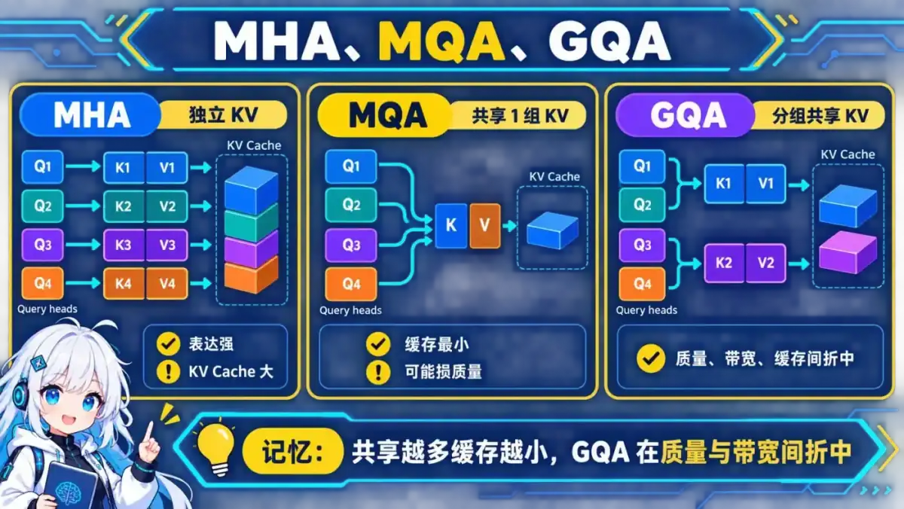</a></p>
<p align="center"><sub>🧠 图解记忆：共享越多缓存越小，GQA 在质量与带宽间折中；点击图片可查看原图。</sub></p>

<details>
<summary>💡 答案要点</summary>

- MHA 为每个 Query head 配置独立的 Key/Value head，表达能力强，但 KV Cache 较大；
- MQA 让所有 Query head 共享一组 Key/Value，显著减少 KV Cache 和内存带宽，可能损失质量；
- GQA 将 Query head 分组，每组共享 Key/Value，是两者之间的折中。

KV Cache 大小与 `层数 × 序列长度 × KV head 数 × head_dim × K/V × dtype` 近似成正比。选型不能只说 GQA 更快，还要比较模型质量、批量大小、长上下文和硬件带宽。

</details>

### Q12: Transformer 的 FFN 做什么？SwiGLU 为什么常见？

<p align="center"><a href="../../assets/illustrations/04-transformer-architecture/q12-ffn-swiglu.webp">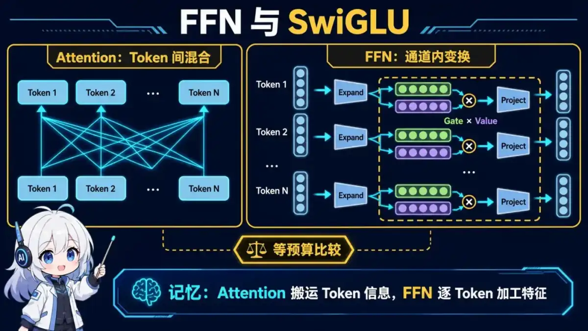</a></p>
<p align="center"><sub>🧠 图解记忆：Attention 搬运 Token 信息，FFN 逐 Token 加工特征；点击图片可查看原图。</sub></p>

<details>
<summary>💡 答案要点</summary>

Attention 在 Token 之间混合信息，FFN 则对每个 Token 的通道维度独立做非线性变换，通常占据模型的大量参数和计算。SwiGLU 使用门控分支控制信息通过，与 ReLU/GELU FFN 相比常能改善训练效果，但参数量和中间维度的比较必须使用等预算设置。

常见追问包括：为什么 FFN 可以逐 Token 并行、门控分支如何计算、MoE 替换的是哪一部分。

</details>

### Q13: Pre-Norm、Post-Norm 和 RMSNorm 有什么关系？

<p align="center"><a href="../../assets/illustrations/04-transformer-architecture/q13-norm-placement.webp">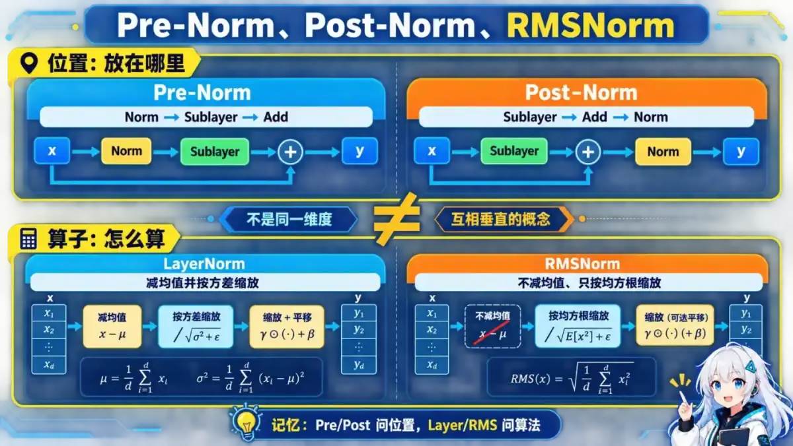</a></p>
<p align="center"><sub>🧠 图解记忆：Pre/Post 问放哪里，Layer/RMS 问怎么算；点击图片可查看原图。</sub></p>

<details>
<summary>💡 答案要点</summary>

Pre/Post 描述归一化在残差分支前还是后；LayerNorm/RMSNorm 描述归一化算子本身，二者不是同一维度。Pre-Norm 通常更容易训练深层网络，因为残差主路径更直接；Post-Norm 是原始 Transformer 形式，但深层训练往往更敏感。RMSNorm 不减均值，只按均方根缩放，计算更简单。

面试中应画出残差公式，并说明训练稳定性结论还受初始化、残差缩放和优化器影响。

</details>

### Q14: RoPE 长度外推为什么会退化？常见扩展方法如何验证？

<p align="center"><a href="../../assets/illustrations/04-transformer-architecture/q14-rope-extrapolation.webp">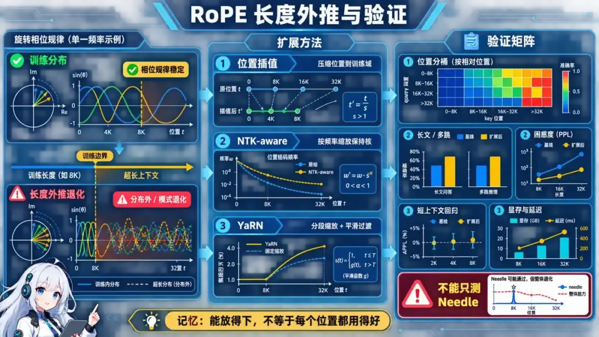</a></p>
<p align="center"><sub>🧠 图解记忆：能放得下，不等于每个位置都用得好；点击图片可查看原图。</sub></p>

<details>
<summary>💡 答案要点</summary>

当推理位置超过训练分布时，旋转频率和相对位置模式发生分布外变化；即使模型接口允许更长上下文，也不代表能稳定利用中间信息。位置插值、NTK-aware scaling、YaRN 等方法通过调整位置或频率降低外推难度，但可能牺牲短上下文表现。

验证不能只做 needle test，还要覆盖长文档问答、多跳检索、位置分桶、困惑度、短上下文回归和显存/延迟。

</details>


---

### Q15: FlashAttention 为什么能加速 Attention 计算？核心优化策略是什么？

<details>
<summary>💡 答案要点</summary>

**FlashAttention 的核心不是近似 Attention，而是在保持精确结果的前提下减少显存 IO。**

**传统 Attention 的瓶颈：**

```
标准 Attention 步骤（每步都要读写 HBM）：

Step 1: S = QK^T      → 产生 N×N 分数矩阵，写回 HBM  (O(N²) 访问)
Step 2: P = softmax(S) → 读入 S，逐行 softmax，写回 P   (O(N²) 访问)
Step 3: O = PV        → 读入 P 和 V，乘积后写回输出    (O(N²) 访问)

总 HBM 访问量: O(Nd + N²)
问题: N 越大，中间矩阵 S/P 越大，GPU 大部分时间在等内存 IO
```

**FlashAttention 优化思路 — IO-Awareness（感知 IO 的算法设计）：**

```
FlashAttention 利用 GPU 的内存层次结构：
  HBM（高带宽慢）→ SRAM（片上快）→ Register（最快但最小）

关键观察:
  - SRAM 容量远小于完整 N×N 矩阵
  - 但单个 block 内的计算完全可以放在 SRAM 中完成
  - 不需要每次都把中间结果写回 HBM
```

**核心优化技术：**

**1. Tiling（分块计算）：**
```
将 Q、K、V 矩阵切分成小 block：
  Q → [Q_0, Q_1, ..., Q_T]     每个 Q_t ∈ R^{n×d}
  K → [K_0, K_1, ..., K_T]     每个 K_t ∈ R^{m×d}
  V → [V_0, V_1, ..., V_T]     每个 V_t ∈ R^{m×d}

逐对计算 (Q_i, K_j, V_j)，所有中间结果留在 SRAM
最终一次写入 HBM
```

**2. Online Softmax（在线归一化）：**
```
问题：softmax 需要整行的最大值才能数值稳定计算

传统做法: 先求全局 max → 再算 exp(x-max) → 最后除以 sum
FlashAttention: 遍历每个 block 时动态维护
  m = 当前行最大值
  l = 归一化因子 Σexp(x-m)
  O = 未归一化的输出累积

每次遇到新 block 用以下公式增量更新:
  m_new = max(m_old, max_of_block)
  l_new = l_old * exp(m_old - m_new) + sum(exp(block - m_new))
  O_new = O_old * exp(m_old - m_new) + weighted_sum(block_V)

这等价于一次性做完整 softmax，但只用 O(1) 额外空间
```

**3. 重计算（Recomputation）代替缓存：**
```
反向传播时，如果保存完整的中间矩阵会消耗大量激活显存

FlashAttention: 只在正向传递时保存必要的标量统计量
               反向传播时重新计算部分分数和 softmax

成本权衡:
  - 正向多读一次 K/V 从 HBM
  - 省下的激活显存可容纳更大 batch 或更长的序列
```

**复杂度分析：**
```
假设序列长度 n, head 维度 d, SRAM 容量 M (M ≥ d):

标准 Attention 的 HBM 访问次数:
  Forward:  O(n·d + n²)
  Backward: O(n·d + n²)
  总计:     O(n²)

FlashAttention 的 HBM 访问次数:
  Forward:  Θ((n²/M) · n·d)  ← 受限于分块数量
  Backward: 类似

当 n >> √M 时，FlashAttention 显著优于标准实现
实际加速比: 2x~4x（取决于硬件和序列长度）
```

**面试话术：**
> "FlashAttention 的本质是 IO-aware 设计——让数据尽量留在 SRAM 而不是反复往返 HBM。通过分块计算和在线 softmax，它避免了存储完整的 N×N 注意力矩阵。结果是显存占用大幅下降（可以从 O(N²) 降到接近线性），同时保持了精确注意力结果。在长序列场景下，速度提升可达 2-4 倍。这不是近似算法，而是同一个数学过程的不同组织方式。"

**⭐ 面试加分项：**
- 能画出 FlashAttention 的分块流程图（外部循环跨 K/V blocks，内部循环处理 Q blocks）
- 理解 online softmax 的增量更新公式推导
- 知道 FlashAttention 2 引入了 persistent kernel 进一步优化
- 了解 FlashAttention 与 KV Cache 配合使用时的效果（推理时同样受益）

</details>

---

### Q16: MoE（Mixture of Experts）的原理、收益和工程代价是什么？

<details>
<summary>💡 答案要点</summary>

**MoE = 让不同的 token 走不同的专家网络，训练成本低但推理能力随专家数线性增长。**

**标准 FFN vs MoE-FFN：**

```
标准 FFN（GPT-4、Llama 等）：
  每个 token 都经过同一组参数（W1 → Gate → W2）
  参数量 = seq_len × batch_size × (d_ff + d_ff) × 2
  → 每个 token 都要算全部参数

MoE FFN（Mixtral、LLaMA-MoE 等）：
  每个 token 只选 Top-K 个专家处理
  参数量 = seq_len × batch_size × num_experts × (d_ff + d_ff) / 路由选择率
  → 总参数多 10 倍，但每个 token 只算 2 个专家
```

**MoE 核心组件：**

```
┌───────────────┐
│ Input Token   │
│ embedding     │
└──────┬────────┘
       ▼
┌───────────────┐
│  Gating Network │  ← 路由决策：哪个 token 去哪些专家
│  Top-K Router   │     通常用带噪声的 softmax
└──────┬────────┘
       ▼
┌───────────────┐    ┌───────────────┐
│ Expert 1 FFN  │◄──►│ Expert 2 FFN  │
└──────┬────────┘    └──────┬────────┘
       ▼                    ▼
┌──────────────────────────┐
│    Weighted Sum + Output  │
└──────────────────────────┘
```

**路由策略详解：**

```python
# 典型实现（Top-2 MoE）
class MoERouter(nn.Module):
    def __init__(self, d_model, num_experts, top_k=2):
        self.gate = nn.Linear(d_model, num_experts)
        self.top_k = top_k

    def forward(self, hidden_states):
        # 原始分数
        raw_logits = self.gate(hidden_states)  # (batch, seq, num_experts)

        # 加噪声负载均衡（防止某些专家被独占）
        noise = torch.randn_like(raw_logits) * 0.01
        noisy_logits = raw_logits + noise

        # Top-K 选择
        gates = F.softmax(noisy_logits, dim=-1)
        top_values, top_indices = torch.topk(gates, self.top_k, dim=-1)

        return top_values, top_indices
```

**2026 年主流 MoE 变体：**

| 方案 | 特点 | 代表模型 |
|------|------|----------|
| **Dense Transformer + MoE FFN** | 仅 FFN 层做 MoE，attention 保持密集 | Mixtral 8x7B、LLaMA-3.1-405B-MoE |
| **Fully Sparse MoE** | 多层甚至 attention 也做 MoE | Gemini Ultra |
| **Switch Transformer** | Top-1 routing，极简路由 | Google 大规模实验 |
| **DeepSeek MoE** | 共享专家 + 专用专家分离 | DeepSeek-V2/V3 |

**MoE 的挑战：**

```
1. 负载均衡（Load Balancing）
   问题：路由器倾向于把样本集中到少数专家
   解决：辅助损失（auxiliary loss）惩罚不平衡
         loss_aux = α × Σ_i f_i × E_i
   
2. 通信开销（Communication）
   在多 GPU 并行时，token 分散到不同设备上的专家
   需要 All-to-All 通信来路由 token
   解决：专家并行（Expert Parallelism）、分组策略

3. 推理延迟
   Top-2 MoE 意味着每个 token 要运行 2 个专家 FFN
   吞吐量 ≈ 同规模 Dense 模型的 0.5x~0.8x
   但每 token 成本更低（总参数量分摊）
```

**性能对比（相同有效参数量）：**

```
| 配置        | 总参数 | 活跃参数 | 每 token 成本 | 吞吐 | 质量 |
|-------------|--------|----------|--------------|------|------|
| Dense 70B   | 70B    | 70B      | 100%         | 100% | 基准 |
| MoE 8×7B    | 56B    | 14B      | 20%          | 60%  | 相当 |
| MoE 64×1B   | 64B    | 2B       | 3%           | 35%  | 略低 |
```

**面试话术：**
> "MoE 的核心思想是'稀疏激活'——每 token 只经过少数专家。Mixtral 8×7B 有 56B 总参数，但每个 token 只激活 14B，相当于用 1/4 的计算成本获得 8 倍的表达能力。2026 年的主流是'Dense Attention + Sparse FFN'混合模式，兼顾推理效率和训练稳定性。关键在于负载均衡——如果路由器把所有样本都推到几个热门专家，MoE 的优势就没了。"

**⭐ 面试加分项：**
- 能解释 MoE 的 auxiliary load balancing loss 公式和设计动机
- 理解 expert parallelism 中的 all-to-all 通信模式
- 知道 Switch Transformer（Top-1）vs Top-2 MoE 的区别
- 能讨论 MoE 在推理时的缓存友好性挑战（KV cache 无法复用专家特征）

</details>

---

### Q17: KV Cache 显存管理难题？PagedAttention 如何解决？

<details>
<summary>💡 答案要点</summary>

**KV Cache 是大模型推理阶段最大的显存瓶颈之一——理解它的管理和优化是生产部署的基本功。**

**KV Cache 基本原理回顾：**

```
自回归生成时，第 t 步需要用到前 t-1 步的所有 KV 对

朴素做法：每一步重新计算历史 KV
  → 每步 O(t) 计算，总 O(n²)

KV Cache：缓存已生成的 K,V
  → 第 t 步只需要计算当前 token 的 K_t, V_t
  → 第 t 步注意力计算: O(t × d_kv)
  → 总计算: O(n² × d_kv)（仍然是二次但常数小很多）
```

**KV Cache 显存占用计算：**

```
单层 KV Cache 大小 = seq_len × d_kv × dtype_bytes

以 Llama-3-70B 为例（d_model=8192, num_heads=64, d_head=128）:
  d_kv_per_head = 128
  KV per layer = 2 × 128 = 256 bytes/head
  总 KV = 256 bytes/head × 64 heads × 80 layers = 1,280 KB/layer
  全模型 KV Cache = 1,280 KB × 64 = ~82 MB/token

实际影响：
  batch_size=64, avg_seq=4096 → 64×4096×82MB ≈ 21 GB
  这就是为什么 vLLM/tensorRT-LLM 必须优化 KV Cache 管理的原因
```

**PagedAttention 的核心思想：类操作系统的虚拟内存分页**

```
传统 KV Cache 的问题（连续分配）：
  ┌────────────────────────────────────────┐
  │ Slot 1: token₁...tokenₙᵢ  (碎片!)      │
  │ Slot 2: token₁...tokenₘⱼ  (碎片!)      │
  │ Slot 3: 空闲                            │
  │ Slot 4: token₁...tokenₖₗ  (碎片!)      │
  └────────────────────────────────────────┘
  碎片率高，物理内存不连续导致无法批量合并

PagedAttention（分页管理）：
  ┌──────────┐  ┌──────────┐  ┌──────────┐
  │ Block 0  │  │ Block 1  │  │ Block 2  │
  │ (物理页)  │  │ (物理页)  │  │ (物理页)  │
  └────┬─────┘  └────┬─────┘  └────┬─────┘
       │              │              │
  ┌────▼─────┐  ┌────▼─────┐
  │ Seq A    │  │ Seq B    │
  │ Block 0  │  │ Block 1  │
  │ Block 2  │  │ Block 0  │
  └──────────┘  └──────────┘
  → 逻辑上不连续的序列可以复用物理页
  → 零碎片
```

**PagedAttention 的关键数据结构：**

```
Block Table（块表）：每 sequence 独立维护
  Sequence A: [Block₀, Block₂, Block₅, Block₇]
  Sequence B: [Block₁, Block₀, Block₃]

Block Size（块大小）：
  通常设为 16~32 个 token
  太小 → 块表过大；太大 → 碎片浪费
  vLLM 默认 16 tokens

KV Memory Pool（统一显存池）：
  预分配固定大小的物理块
  按需分配到 sequence → 类似 RAM 分配
  支持 dynamic batching（动态批处理）
```

**PagedAttention vs 传统方法对比：**

```
| 特性            | 传统分配    | PagedAttention     | vLLM 实际收益     |
|-----------------|------------|--------------------|------------------|
| 显存利用率      | ~60%（碎片）| ~95%+             | 吞吐提升 2-4x    |
| max_batch_size  | 受限于连续块| 无硬性上限         | 可大幅调大       |
| 调度灵活性      | 静态       | 动态插队/换出      | 自适应调度       |
| 并发用户数      | 少         | 多（逻辑隔离）     | 多租户友好       |
```

**进阶：KV Cache 的其他优化方向**

```
1. FP8 KV Cache：压缩半精度 → 显存减半
2. KV Cache 量化：INT4/KV Quantization → 更多上下文
3. Sliding Window KV：只保留最近 N 个 token → 适合长对话
4. Compressed KV：如 DeepSpeed-Ulysses 的梯度压缩式策略
5. Offloading：把冷 KV 交换到 CPU 或 NVMe（牺牲延迟换空间）
```

**面试话术：**
> "KV Cache 是自回归推理的'账本'——每生一个 token 就把它的 K 和 V 存起来供后续使用。问题是它占显存太多，尤其在大 batch 或多用户场景下。PagedAttention 借鉴操作系统分页的思想，把 KV 切成固定大小的 block，逻辑上不连续的序列可以复用相同的物理块，消除了碎片。vLLM 就是基于这个实现了高达 24x 的吞吐提升。"

**⭐ 面试加分项：**
- 能用具体数字估算不同模型规模的 KV Cache 显存
- 理解 block table 和 memory pool 如何协作
- 知道 PagedAttention 与传统连续分配的性能差异数据
- 了解 KV Cache 量化、offloading 等其他优化手段的 trade-off

</details>

---

### Q18: SwiGLU、GLU 和标准 FFN（ReLU/GELU）在 FFN 中的门控机制有什么不同？

<details>
<summary>💡 答案要点</summary>

**Gate 机制的本质：让网络"选择性通"信息，而不是对所有输入一致地变换。**

**三种 FFN 方案对比：**

```
1. 标准 FFN（ReLU/GeLU）—— 最早的方案
   Hidden = Activation(X @ W1) @ W2
   
   X: (batch, seq, d_model) → W1: (d_model, d_ff) → (batch, seq, d_ff)
                                ↓ ReLU/GeLU
                              → W2: (d_ff, d_model) → (batch, seq, d_model)
   
   问题：所有输入维度都受到同样的非线性变换
   没有"门"的概念，不能动态控制信息流

2. GLU（Gated Linear Unit）—— 引入门控概念
   Hidden = SiLU(X @ W_gate) ⊙ (X @ W_project) @ W_out
   
   X @ W_gate:  生成门的信号（sigmoid/silu 输出 0~1）
   X @ W_proj:  要过滤的信号
   ⊙: 逐元素相乘 —— 门为 0 则对应维度完全关闭
   
   好处：通道级选择性地激活
   注意：W_gate 和 W_proj 各需要一半 d_ff 的容量

3. SwiGLU（SiLU + GLU）—— 当前最优
   Hidden = SiLU(X @ W1) ⊙ (X @ W2) @ W3
   
   SiLU(x) = x · sigmoid(x)  （Softplus 的平滑版本）
   
   为什么 SwiGLU 通常比 GeLU-FFN 更好？
   ✓ 门控机制提供更强的非线性表达能力
   ✓ 通道级别的门控让重要特征不被淹没
   ✓ 相比 GeLU 有稍微更好的梯度流动
   ✗ 参数量增加约 50%（3 个矩阵 vs 2 个）
   ✗ 计算量基本相同（矩阵乘法主导）
```

**参数量和计算量对比：**

```
假设 d_model=4096, d_ff=11008（LLaMA-3 比例 d_ff≈2.67×d_model）

标准 GeLU-FFN:
  W1: 4096×11008 = 45.1M 参数
  W2: 11008×4096  = 45.1M 参数
  总计: 90.2M 参数

SwiGLU-FFN:
  W1 (gate): 4096×11008 = 45.1M 参数
  W2 (proj): 4096×11008 = 45.1M 参数
  W3 (out):  11008×4096 = 45.1M 参数
  总计: 135.3M 参数

相对增加: 50%
但实际训练中 SwiGLU 通常能达到更好的收敛和质量
```

**现代 LLM 的 FFN 设计趋势：**

```
| 模型            | FFN 激活    | d_ff/d_model | Gate?   |
|----------------|-----------|---------------|---------|
| GPT-2          | GELU      | 4.0           | No      |
| GPT-3          | GELU      | 4.0           | No      |
| LLaMA 1/2      | SwiGLU    | 2.67          | Yes     |
| LLaMA-3        | SwiGLU    | 2.67          | Yes     |
| Mistral 7B     | SwiGLU    | 2.67          | Yes     |
| Gemma 2        | SwiGLU    | 2.67          | Yes     |
| Yi系列         | SwiGLU    | 2.67          | Yes     |

趋势：SwiGLU 已成为 2024-2026 年几乎所有主流 LLM 的标准配置
```

**追问：MoE 场景下 SwiGLU 用在哪儿？**

```
MoE 中通常 SwiGLU 替换的是 FFN 内部的激活函数

Sparse MoE-FFN:
  For each token:
    experts_selected = router(x)  # Top-2
    output = Σ g_i × SwiGLU_Expert_i(x)
                        ↑
                   每个专家的 FFN 都用 SwiGLU

即 SwiGLU 替代的是标准 FFN 的激活函数，MoE 替换的是 FFN 的整体结构（单一路径 → 多路径选择）
两者作用在不同层面，可以同时组合
```

**面试话术：**
> "标准 FFN 用单一激活函数（GeLU/ReLU）做非线性变换，所有输入通道同等对待。GLU 引入门控：先用一部分权重生成门信号（sigmoid/silu），再和另一部分投影结果逐元素相乘，实现通道级的选择性滤波。SwiGLU 是用 SiLU 作为激活的门控 GLU，是目前最流行的配置。它比 GeLU-FFN 多了约 50% 的参数，但因为门控让信息流动更有选择性，实际训练效果更好。几乎所有现代 LLM 都采用 SwiGLU。"

**⭐ 面试加分项：**
- 能画出三种 FFN 的完整计算流程（含矩阵维度变化）
- 理解 SiLU 相对于 Sigmoid/ReLU 的优势（非饱和区更大、过零点非零）
- 知道 SwiGLU 的参数量是标准 FFN 的 1.5 倍，但计算量几乎不变
- 能解释 MoE 和 SwiGLU 的关系（它们分别在结构层和激活函数层起作用）

</details>

---

### Q19: MLA（Multi-Latent Attention）是什么？为什么 DeepSeek v3 用它替代 GQA？

<details>
<summary>💡 答案要点</summary>

**MLA 是 DeepSeek 提出的新一代注意力范式——用低秩分解替代传统的独立 Q/K/V 投影。**

**GQA 仍然存在的冗余：**

```
GQA 的改进思路：多个 Query head 共享一组 KV head
但本质上是独立的投影矩阵：
  W_Q[i]: d_model → d_head  (独立学习)
  W_K[v]: d_model → d_head  (独立学习)
  W_V[v]: d_model → d_head  (独立学习)

冗余之处：
  每个 head 的 Q/W/Q 都是独立的 d_model × d_head 矩阵
  但这些投影之间可能有高度相关性（都在学类似的注意力映射）
  → 有没有办法"共享知识"同时又能"区分任务"？
```

**MLA 的核心创新：低秩分解 Q/K/V 投影**

```
传统多头注意力（MHA/GQA）：
  W_Q: (num_heads × d_head, d_model)     ← 独立大矩阵
  W_K: (num_kv_heads × d_head, d_model)  ← 独立大矩阵
  W_V: (num_kv_heads × d_head, d_model)  ← 独立大矩阵

MLA（Multi-Latent Attention）：
  第一步：共同压缩
    C_c: (d_model, d_comp)    ← 共同压缩矩阵 (小！)
    c = C_c @ x               把 x 压缩到低维 latent space

  第二步：解耦展开
    W_Q_h: (num_heads × d_head, d_comp)  ← 按头拆分
    W_K_v: (num_kv_heads × d_head, d_comp) ← 按 KV group 拆分
    W_V_v: (num_kv_heads × d_head, d_comp) ← 按 KV group 拆分

  Q_h = W_Q_h @ c
  K_v = W_K_v @ c
  V_v = W_V_v @ c
```

**MLA 与传统方式的对比：**

```
假设 d_model=8192, num_heads=64, d_head=128, num_kv=8, d_comp=512

传统 GQA 的 KV 投影矩阵大小：
  W_K: (8 × 128, 8192) = (1024, 8192) = 8.4M 参数
  W_V: (8 × 128, 8192) = (1024, 8192) = 8.4M 参数

MLA 的 KV 投影矩阵大小：
  压缩: C_kv (512, 8192) = 4.2M 参数
  展开: W_K_v (8×128, 512) = 0.52M 参数
  展开: W_V_v (8×128, 512) = 0.52M 参数
  总计: 5.2M 参数

节省: (16.8M - 5.2M) / 16.8M ≈ 69% 的 KV 投影参数！
```

**KV Cache 的巨大优势：**

```
MLA 的 KV Cache 只有低维 latent 向量 c_v
  而非高维的 K_v 和 V_v

KV Cache 大小对比:
  GQA:  层数 × seq_len × num_kv × d_head × 2 × bytes  (如前面计算的 ~82MB/token)
  MLA:  层数 × seq_len × d_comp × 1 × bytes            (仅存储压缩后的 c_v)

MLA 可以将 KV Cache 压缩到原来的 1/10~1/5
这意味着：
  ✓ 同样的显存可以支持更长上下文
  ✓ 同样的上下文可以支持更大 batch size
  ✓ 长文本推理成本大幅降低
```

**MLA 的完整推理流程：**

```
推理时每步的新 token 处理：
  x_new → C_c (压缩) → c_v (低维 latent) → 存入 KV Cache
  
生成下一个 token:
  c_cache (全部历史的 latent) → W_V_v (展开) → V_cache
  x_new  → C_c (压缩) → c_q (query latent) → W_Q_h (展开) → Q_new
  
注意力: Softmax(Q_new @ K_cache^T / √d) @ V_cache

关键点：K_cache 也是由 c_cache 经 W_K_v 展开得到的
         所以 KV Cache 只需要存 c_v，不用存展开后的 K/V！
```

**为什么 DeepSeek v3 选择 MLA：**

```
Trade-off 分析：

MLA 优点:
  ✓ KV Cache 缩减 5-10x → 长上下文和大批量更易实现
  ✓ KV 投影参数减少 ~70% → 模型更紧凑
  ✓ 低秩表示天然有正则化效果

MLA 缺点:
  d_comp 太小有表达能力瓶颈（经验值 512-1024 比较安全）
  需要额外的 C_c 和 W_h/v 矩阵训练
  理论上可能不如独立投影灵活（受限的秩）

结论：在追求长上下文和高效推理的场景下，MLA 的 trade-off 非常值得。
       DeepSeek 实测发现 d_comp=512 时对性能影响微乎其微
```

**MLA vs GQA 总结对比：**

```
| 维度        | GQA                 | MLA                     |
|-------------|--------------------|------------------------|
| KV Cache    | 中高                | 极低（低秩压缩）        |
| 参数效率    | 中                 | 高（参数减 70%）       |
| 表达能力    | 高（独立投影）      | 中-高（受 d_comp 限制） |
| 实现复杂度  | 低                  | 中                     |
| 适用场景    | 通用推理            | 长上下文、大批量场景    |
| 代表模型    | Llama-3.1 等      | DeepSeek-V3            |
```

**面试话术：**
> "MLA 的核心思想是把 Q/K/V 投影做低秩分解——先用一个共同的压缩矩阵把高维嵌入降到低维 latent，再分别展开成 Q/K/V。这样做的好处是 KV Cache 可以直接存低维 latent，不用存展开后的高维张量，从而把 KV Cache 压缩到原来的十分之一左右。DeepSeek V3 选择 MLA 不是为了刷指标，而是为了在有限的显存下跑更长的上下文和更大的 batch。理论上有微小的表达能力折损，但实践证明 d_comp=512 足够用。"

**⭐ 面试加分项：**
- 能手推 MLA 的矩阵维度变化（特别是低秩分解的形状）
- 理解为什么 KV Cache 只需存 c_v 而不用存 K_v/V_v
- 能定量估算 MLA 带来的 KV Cache 节省比例
- 知道 d_comp 的选择对表达能力的 trade-off

</details>


| 日期 | 版本 | 更新内容 |
|------|------|----------|
| 2026-08-21 | v3.136 | 新增 Q20-Q26（Scaling Laws&Chinchilla、Tokenization/BPE、ALiBi详解、Sliding Window Attention、Causal Decoder-Only主导原因、LayerNorm vs RMSNorm、训练Loss Curve诊断）7 道 |
| 2026-08-14 | v3.135 | 新增 Q15-Q19（FlashAttention、MoE稀疏架构、PagedAttention/KV Cache管理、SwiGLU门控机制、MLA低秩注意力）5 道 |
| 2026-04-13 | 新增 Q10 Transformer+SSM混合架构（Mamba核心原理、2026年主流模型混合策略） |
| 2026-03-05 | 新增 Transformer 架构与注意力机制面试题 7 道 |


---

### Q20: Scaling Laws 是什么？Chinchilla 的 "compute-optimal" 意味着什么？

<p align="center"><a href="../../assets/illustrations/04-transformer-architecture/q20-scaling-laws.webp" alt="Scaling Laws 动漫知识图：损失随参数、数据量、算力以幂律下降，Chinchilla 给出固定算力下参数量与token数的最优配比"></a></p>
<p align="center"><sub>🧠 图解记忆：算力和模型一起放大，损失按幂律下降；别只堆参数不喂数据。</sub></p>

<details>
<summary>💡 答案要点</summary>

**Scaling Laws = 模型能力随规模变化的经验规律**

Loss(N, D, C) ~ a + b * N^(-alpha) + c * D^(-beta)

其中：N=参数量, D=训练 token 数, C=FLOPs~6*N*D*L
关键结论：alpha > beta → 增加数据比增加参数更有效降低 Loss

**Chinchilla 的核心发现（面试必考）：**
传统做法：给定算力→选大模型→有限数据训练（欠训练）
Chinchilla：给定算力→适中N+足够大的D，最优配比~20个token/参数
Chinchilla 70B 训练 1.4T tokens（20:1），超过 PaLM 62B

| 偏离方向 | 表现 | 解释 |
|----------|------|------|
| N太大D太小 | Loss平台期明显 | 有容量但没见过足够模式 |
| N太小D太大 | 后期Loss几乎不降 | 已达表示能力天花板 |
| 偏离 < 2x optimal | 影响可控 | 数据质量优先 |
| 偏离 > 5x optimal | 显著低于预期 | 必须重新分配 |

注意事项：MoE需修正(active vs total params)、inference-aware scaling考虑延迟后最优偏小、高质量文本接近耗尽时需合成数据。

**面试话术：**
> "Scaling Laws 告诉我们损失呈幂律下降。Chinchilla 量化了'欠训练'现象——之前的团队给太多参数却喂太少数据。对固定算力预算，最优方案是让参数量和token数同步增长，约20:1比例。我们应该造小一点但吃饱的模型。"

</details>

---

### Q21: Tokenization 方法有哪些？BPE、WordPiece、SentencePiece 有什么区别？

<p align="center"><a href="../../assets/illustrations/04-transformer-architecture/q21-tokenization.webp" alt="Tokenization方法对比：字级无OOV但冗长，词级高效但有OOV，子词取折中"></a></p>
<p align="center"><sub>🧠 图解记忆：字符不怕没见过的词，但句子太长塞不下上下文。</sub></p>

<details>
<summary>💡 答案要点</summary>

**三种主流方法的本质区别：**
- Character Level: r-u-n-n-i-n-g (7tokens, no OOV, long seq)
- Word Level: running (1token, high OOV, short seq)
- Subword Level: run+ing (2tokens, low OOV, medium seq)

**1. BPE（Byte-Pair Encoding）：**
初始化词汇表→统计相邻pair频率→合并最高频pair→重复直到目标vocab size。
Byte-level BPE从UTF-8 byte起步，任何Unicode文本都不会OOV。
代表模型：GPT-2/3/4 (tiktoken), RoBERTa

**2. WordPiece：**
合并能使语言模型likelihood提升最多的pair→max likelihood。
代表模型：BERT、DistilBERT（vocab:30K，用##标记连续子词）

**3. SentencePiece：**
tokenizer框架而非算法。内部实现Unigram（首选）、BPE等。将标点视为普通字符。
Unigram LM思路：从大候选集迭代去掉最低概率20%直到等于目标大小。
代表模型：T5、LaMDA、PaLM、Gemini系列

**Vocab Size选择权衡：**
| Vocab Size | 优点 | 缺点 | 典型应用 |
|-----------|------|------|---------||
| 32K (LLaMA) | 容纳更多token | 罕见词被拆散 | LLaMA家族 |
| 50K (GPT-2) | 中英混合好 | 显存略增 | GPT-2/3 |
| 100K (GPT-4) | 复杂词直接映射 | 更大embedding | GPT-4 |

**多语言挑战：** CJK一个汉字占3bytes→序列膨胀2-3x→浪费KV Cache。
应对：①为每种语言单独训练tokenizer ②扩大vocab size

**面试加分项：** BPE is adaptive computation、tiktoken O(1)查找、CJK序列膨胀问题

**面试话术：**
> "Tokenization的本质是在OOV风险和序列长度之间找平衡。BPE通过迭代合并高频pair构建子词vocab。Byte-level BPE从根本上消除了OOV。但CJK语言会遇到序列膨胀（一个汉字变3-5个byte token）。目前主流模型多在32K-100K之间选取vocab size。"

</details>

---

### Q22: ALiBi（Attention with Linear Biases）的工作原理？为什么它能零样本外推？

<p align="center"><a href="../../assets/illustrations/04-transformer-architecture/q22-alibi.webp" alt="ALiBi动漫知识图：无需位置编码即注入线性距离惩罚，每个头斜率不同可外推更长序列"></a></p>
<p align="center"><sub>🧠 图解记忆：不在embedding加位置信息，直接在attention score上加距离罚分。</sub></p>

<details>
<summary>💡 答案要点</summary>

**核心思想：不用位置编码，用线性衰减代替**

Sinusoidal/Learned PE把位置加法注入token；RoPE旋转Q/K让dot携带相对位置；ALiBi直接修改注意力分数。

ALiBi注意力：softmax(QK^T/sqrt(d) + m_h * |pos_i - pos_j|)
m_h < 0是每个head的负斜率系数（最近的头衰减最陡看最近邻居，远的头衰减最缓看远距离）。

公式：m_h = -8^{-4h/d}

**为什么能零样本外推？**
Bias只依赖RELATIVE position（pos_i-pos_j），不依赖ABSOLUTE position！训练时pos在[train_len]范围，推理时在[infer_len]范围，任意两个token间的relative distance和bias值都保持不变→不需要微调就能处理更长序列。

| 特性 | ALiBi | RoPE(+NTK/YaRN) | Sinusoidal | Learned |
|------|-------|--------------------|------------|----------|
| Zero-shot外推 | 原生支持 | 需缩放技巧 | 差 | 无定义 |
| 微调后外推极限 | ~8-16x | ~32x+(YaRN) | ~2x | N/A |
| 额外参数 | 0 | 0 | 0 | 需学习 |
| 短上下文 | 略弱于RoPE | 优秀 | 中等 | 优秀 |
| 代表模型 | MPT,BLOOM | LLaMA,Mistral | 原始Transformer | BERT |
| 复杂度 | 极低 | 中 | 低 | 低 |

局限性：缺乏绝对位置感知、短上下文略逊RoPE、强locality prior对跨极远距离精确对齐不利。

**面试加分项：** 写出斜率公式m_h=-8^{-4h/d}、ROPE+YaRN外推超ALiBi（32x+vs8-16x）

**面试话术：**
> "ALiBi完全不改动token embedding，而是在注意力分数上直接加与距离成正比的负偏置。因为偏置只依赖相对距离而非绝对位置，所以可以直接处理比训练时长更久的序列——zero-shot外推。代价是缺少绝对位置感，短上下文略逊RoPE。2026年更多长上下文模型选了RoPE+YaRN组合获得更强外推能力。"

</details>

---

### Q23: Sliding Window Attention（滑动窗口注意力）是什么？它解决了什么问题？

<p align="center"><a href="../../assets/illustrations/04-transformer-architecture/q23-sliding-window.webp" alt="滑动窗口注意力动漫知识图：限制关注窗口内前驱token配合周期性全局层避免二次计算"></a></p>
<p align="center"><sub>🧠 图解记忆：注意力不再是全局两两交互，而是限制在滑动窗口内，节省计算且支持超长序列。</sub></p>

<details>
<summary>💡 答案要点</summary>

**Sliding Window Attention = 限制每个token只能关注前后固定窗口内的token**

标准Self-Attention的问题（长序列L很大时）：
- 计算量O(L²×d)、显存O(L²)、KV Cache O(L×d)
- L=128K时注意力矩阵=1.6×10^10 entries≈32GB仅FP16存储

Sliding Window解决方案：O(L×window_size×d)→从O(L²)降到O(L)

**现代实践：交错滑动窗口+全局层**
纯滑动窗口缺陷：感受野永远受限。解决：交替使用SW层和全局层。

GEMMA2模式（4B/9B）：Layer1-SW(4K)→Layer2-Global→Layer3-SW→Layer4-Global→每两层一次全局交互。
Mistral3系列：Layer1-5-SW(4K)→Layer6-Global→Layer7-11-SW→Layer12-Global→5:1比率。

| 方案 | 复杂度 | 表达能力 | 代表模型 |
|------|--------|----------|----------|
| Full Attention | O(L²) | 最强 | 小序列场景 |
| Sliding Window | O(L×W) | 中等，需全局辅助 | Gemma2,Mistral3 |
| N-Tile/Strided | O(L) | 层越多感受野越大 | Longformer |
| SSM/Mamba | O(L) | 互补路线 | Mamba,Jamba |

优势：长序列推理成本低、硬件友好。
劣势：无法不经全局层做端到端长程跳跃。

**面试加分项：** 解释为什么纯SW不够需要全局层、Gemma2奇偶层交替vs Mistral3的5:1分组

**面试话术：**
> "Sliding Window是一种稀疏注意力——每个token只看前后固定数量的前驱token。这让复杂度从O(L²)降到O(L×W)，大幅节省了计算和KV Cache。但纯SW感受野永远受限，所以主流做法是每隔若干层插一个全局attention层，比如GEMMA2是奇偶层交替，Mistral3是5层SW后跟1层全局。这样既能控制计算量又保持长程建模能力。"

</details>

---

### Q24: 为什么 2026 年的主流 LLM 全部转向 Causal Decoder-Only 架构？

<p align="center"><a href="../../assets/illustrations/04-transformer-architecture/q24-decoder-only-dominance.webp" alt="Decoder-Only统治趋势：统一架构通吃所有任务"></a></p>
<p align="center"><sub>🧠 图解记忆：单一架构通吃所有任务，统一比分裂更高效。</sub></p>

<details>
<summary>💡 答案要点</summary>

**架构演化简史：**
```
2017: Encoder-Decoder → 机器翻译
  +-- Encoder-only (BERT,2018) → NLU称霸
  +-- Decoder-only (GPT,2018) → 文本生成
2020: GPT-3展示scaled-up Decoder-only超越BERT
2022-至今: Decoder-Only全面接管
  LLaMA→Mistral→Qwen→Gemma→Yi→全Decoder-only
```

**五大核心原因：**

1. **统一架构=统一训练**：同一个模型一个prompt覆盖分类/摘要/QA/对话，只需维护一套参数
2. **自回归训练的免费并行信号**：一次forward就获所有位置的监督信号，不需要MLM特殊mask或NSP第二句话任务
3. **In-Context Learning天然载体**：causal mask决定了单向推进模式，非常适合few-shot learning
4. **推理效率优势（流式输出）**：Pre-fill并行计算KV Cache，Decode串行逐token生成速度快
5. **多模态扩展兼容性**：所有模态拼成一条序列用同一decoder处理，GPT-4o/Claude/Gemini都走这条路

**面试加分项：** GPT-3是Decoder-only超越BERT转折点、理解多模态融合的统一性优势

**面试话术：**
> "Decoder-Only之所以成为绝对主流，核心原因是统一——同一个模型用同一个预训练目标覆盖所有任务。加上in-context learning天然适合因果解码、流式体验好、多模态需要一个统一的序列容器，三个优势叠加导致行业加速converged到decoder-only。"

</details>

---

### Q25: LayerNorm 和 RMSNorm 有什么区别？为什么现代 LLM 普遍改用 RMSNorm？

<p align="center"><a href="../../assets/illustrations/04-transformer-architecture/q25-layer_norm_vs_rmsnorm.webp" alt="LayerNorm与RMSNorm对比：前者减均值加仿射变换，后者只除均方根省去了均值计算"></a></p>
<p align="center"><sub>🧠 图解记忆：LayerNorm做完整的标准化，RMSNorm去掉均值只留尺度归一化。</sub></p>

<details>
<summary>💡 答案要点</summary>

**核心区别：是否减去均值**

LayerNorm(Ba et al.2016): mu=mean(x), sigma2=var(x)
  LayerNorm(x)=gamma*(x-mu)/sqrt(sigma2+eps)+beta

RMSNorm(Zhang&Sennrich,2019):
  RMS(x)=sqrt(mean(x^2)+eps)
  RMSNorm(x)=gamma*x/RMS(x)

LayerNorm: mean subtraction+可学习bias beta
RMSNorm:   无mean subtraction+无可学习bias beta，只保留scale gamma

**为什么去掉均值反而够用？**
Mean centering对梯度流动贡献很小，Scale normalization才是关键。去掉mean后训练稳定性和收敛速度几乎不变，用15%计算节省换95%+效果。

**计算效率：** LayerNorm约5x元素操作，RMSNorm约3x→节省40%元素操作，实际收益10-15%运行时间。

**Adoption Timeline:**
2019提出→Gopher首次采用→2022+:LLaMA,Mistral,Gemma,Qwen,Yi全部RMSNorm

**QK-Norm的使用场景：**
不同于LayerNorm/RMSNorm（对整个hidden state归一化），QK-Norm只在attention内部对Q和K向量做归一化以稳定注意力分数。代表：Qwen系列默认启用。

**什么时候还用LayerNorm？**
传统NLP任务(BERT)、迁移已有预训练检查点时、教育场景。但在从头训练的新模型上，2026年几乎没有理由选LayerNorm了。

**面试加分项：** RMSNorm被LLaMA/Mistral/Gemma全系列采用、了解QK-Norm与Pre-LN正交

**面试话术：**
> "RMSNorm和LayerNorm的核心区别是RMSNorm不去减均值也不加偏置。实践中归一化的核心作用是控制尺度而减均值收益有限。RMSNorm省去约40%的元素操作推理加速10-15%，无数实验验证不会牺牲质量。从LLaMA到Mistral到所有主流2024-2026模型都用了RMSNorm替代LayerNorm。"

</details>

---

### Q26: Transformer 的训练过程中 Loss Curve 会出现哪些典型阶段？如何诊断？

<p align="center"><a href="../../assets/illustrations/04-transformer-architecture/q26-loss-curve.webp" alt="训练Loss曲线动漫知识图：Loss经历快速下降、平台期、相变骤降、细粒探索等形态，每一步对应能力跃迁"></a></p>
<p align="center"><sub>🧠 图解记忆：Loss曲线不只是单调下降——平台期后可能有相变骤降。</sub></p>

<details>
<summary>💡 答案要点</summary>

**四个典型阶段：**

```
Log Loss
  |
  | H              Phase 4: Fine exploration(loss波动很小)
  |  HH        __ _ _ _ _ _ _ _ _ _ _
  |   HHH    __
  |    HHH   _                  Phase 3: Phase transition(骤降0.1-0.3nats)
  |     HHH  | plateau
  |      HHH |
  |       HHH| 
  |        HHH__
  |         HHH|
  |          HHH___ jump
  |           HHH____
  |            HHH    Phase 2: Plateau(缓慢阶梯状下降)
  |             HHH
  |              HH               Phase 1: Rapid descent(急速下降2-4nats)
  |               H
  +-------------------------------------> Training Steps
```

**Phase 1: Rapid Descent（快速下降期）**
Step 0~10K，Loss急速下降2-4 nats。模型学token prob基本分布，高频ngram被记住。不降则查LR和数据。

**Phase 2: Plateau（平台期）**
Step 10K~数十万步，Loss缓慢阶梯状下降。学语法结构和常见短语。**不要恐慌——这是预期的。**

**Phase 3: Phase Transition（相变/骤降）**
中后期几十万到百万步，出现明显阶梯式下降(drop 0.1-0.3 nats)。Emergence现象——逻辑推理、数学等新能力突然涌现。

**Phase 4: Fine Exploration（细粒探索期）**
接近训练结束，Loss波动±0.01nats逼近渐近线。Train≈Val→正则化良好。

**常见异常及对策：**
| 现象 | 可能原因 | 对策 |
|------|---------|------|
| Loss不降 | LR太小/梯度消失/数据损坏 | 检查LR/gradient clipping |
| Loss震荡 | LR太大/batch太小 | 降LR或增大batch |
| Train>>Val | Overfitting | 加强dropout |
| 多次骤降 | 数据mix变化 | 正常现象 |

**面试加分项：** 画出四阶段loss curve、phase transition与emergent capabilities关系

**面试话术：**
> "LLM的训练loss曲线不是简单单调下降，它有四个阶段：快速下降、平台期、相变骤降、细粒探索。最关键的是phase transition——loss会在某个点突然掉一大截，对应从零散知识到系统理解的飞跃。最重要的是不要因为平台期恐慌，那只是暴风雨前的宁静。"

</details>

---

**上一模块：** [RAG 系统](../03-rag-system/)
**下一模块：** [AI Agent 基础](../05-ai-agent-basics/)

---

[返回目录 →](../../README.md)

---

*版本: v3.136 | 更新: 2026-08-21 | by 二狗子 🐕*
