# 🎓 大模型微调与训练面试题

> **面试优先顺序（通用 AI 应用开发岗位）**：Q1、Q3、Q4、Q5、Q6、Q7、Q8、Q10、Q13、Q18、Q19、Q20。其余题目用于进阶或特定岗位拓展；实际频率会随岗位和面试轮次变化，产品版本资讯不应当作通用必考题。

> **难度：** ⭐⭐⭐⭐
> **更新：** 2026-09-01
> **考点：** LoRA、RLHF、DPO、微调策略、训练优化、知识编辑、推理蒸馏、TRL v1.0

## 📋 目录

1. [微调基础概念](#一微调基础概念)
2. [LoRA与PEFT](#二lora与peft)
3. [对齐技术](#三对齐技术rlhf与dpo)
4. [训练优化](#四训练优化)
5. [速记卡片](#五速记卡片)
6. [后训练与分布式训练进阶](#六后训练与分布式训练进阶)
7. [知识编辑与推理蒸馏](#七知识编辑与推理蒸馏)
8. [推理模型训练进阶](#八推理模型训练进阶)

## 一、微调基础概念

### Q1: 什么是微调（Fine-tuning）？为什么需要微调？

<p align="center">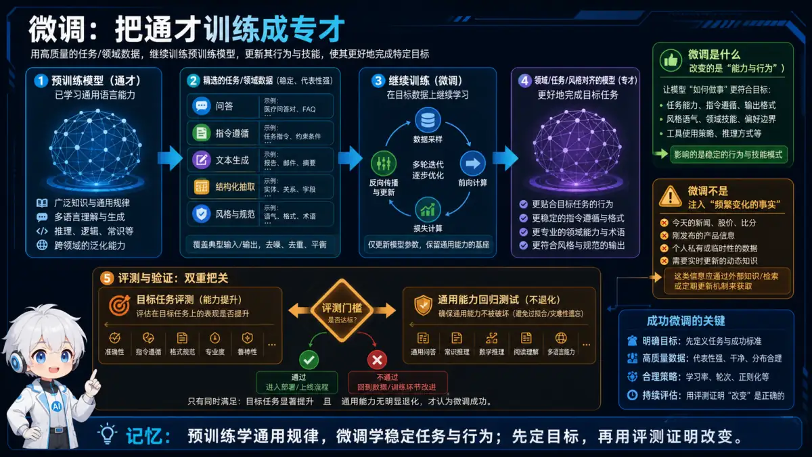</p>
<p align="center"><sub>🧠 记忆锚点：预训练学通用规律，微调学稳定任务与行为；先定目标，再用评测证明改变。</sub></p>
<details>
<summary>💡 答案要点</summary>

**微调 = 在预训练模型基础上，用特定任务数据继续训练**

**为什么需要微调？**

| 场景 | 预训练模型 | 微调后 |
|------|------------|--------|
| **领域适配** | 通用知识 | 专业领域（医疗、法律） |
| **任务优化** | 多任务能力 | 特定任务（分类、摘要） |
| **风格定制** | 标准输出 | 特定风格（客服、助手） |
| **行为对齐** | 可能不安全 | 符合人类价值观 |

**微调 vs 预训练：**

| 维度 | 预训练 | 微调 |
|------|--------|------|
| **数据量** | 海量（TB级） | 较少（GB-MB级） |
| **训练时间** | 数周-数月 | 数小时-数天 |
| **成本** | 极高（数百万美元） | 较低（数千-数万美元） |
| **目标** | 学习通用知识 | 适配特定任务 |

**面试话术：**
> "微调是在预训练模型基础上的二次训练。预训练让模型学会语言，微调让模型学会特定任务。就像通才变专家。"

</details>

### Q2: 全量微调 vs 参数高效微调（PEFT）有什么区别？

<p align="center">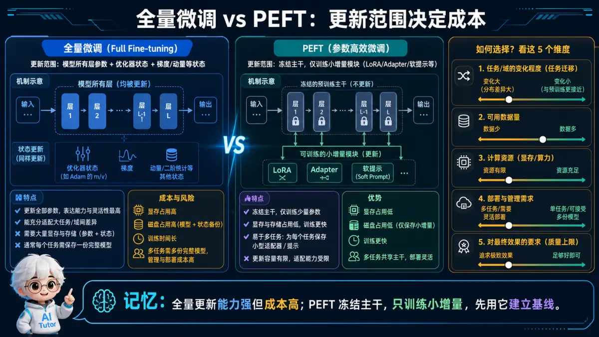</p>
<p align="center"><sub>🧠 记忆锚点：全量更新能力强但成本高；PEFT 冻结主干，只训练小增量，先用它建立基线。</sub></p>
<details>
<summary>💡 答案要点</summary>

**核心区别：更新多少参数**

| 类型 | 更新参数量 | 内存占用 | 训练时间 | 效果 |
|------|------------|----------|----------|------|
| **全量微调** | 100% | 高（需存储全部梯度） | 长 | 最好 |
| **PEFT** | 0.1-1% | 低（只存储少量梯度） | 短 | 接近全量 |

**PEFT 的主要方法：**

```
参数高效微调（PEFT）
├── LoRA（Low-Rank Adaptation）
├── Adapter（适配器层）
├── Prompt Tuning（提示词微调）
├── Prefix Tuning（前缀微调）
└── P-Tuning（混合方法）
```

**资源对比（以 7B 模型为例）：**

| 方法 | 可训练参数 | GPU 显存 | 训练时间 |
|------|------------|----------|----------|
| 全量微调 | 7B（100%） | ~80GB | 10h |
| LoRA | 70M（1%） | ~20GB | 3h |
| Prompt Tuning | 1M（0.01%） | ~16GB | 1h |

**面试话术：**
> **示例表达（仅在能用本人经历或可复现实验佐证时使用）：** "PEFT 是用 1% 的参数达到 95% 的效果。特别是 LoRA，在资源受限时是首选。我在项目中用 LoRA 微调 13B 模型，单卡 A100 就够了。"

</details>

### Q3: 什么时候用微调，什么时候用 RAG？

<p align="center">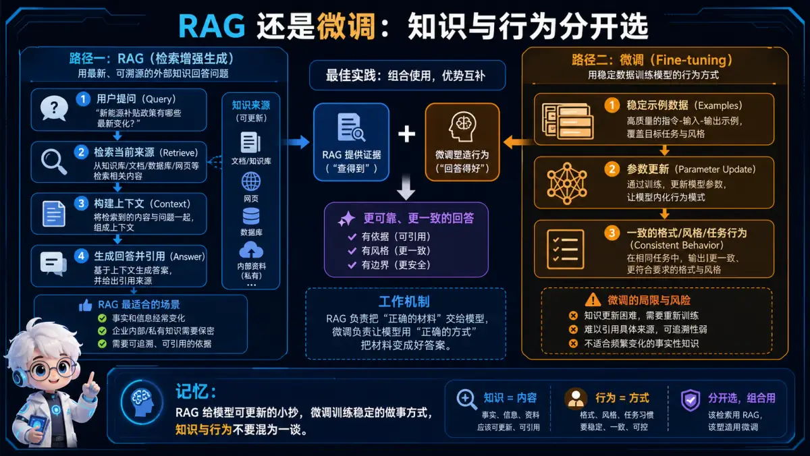</p>
<p align="center"><sub>🧠 记忆锚点：RAG 给模型可更新的小抄，微调训练稳定的做事方式；知识与行为不要混为一谈。</sub></p>
<details>
<summary>💡 答案要点</summary>

**一句话比喻（面试开场）：**

> RAG 是给模型"带小抄"（外部检索），Fine-tuning 是给模型"补课"（参数学习）。一个是外部知识增强，一个是模型参数层面的能力调整。

**工程落地四维度对比（面试加分）：**

| 维度 | RAG | Fine-tuning |
|------|-----|-------------|
| **知识更新成本** | 更新向量库即可，成本低周期短 | 需重新训练/增量训练，成本高周期长 |
| **可解释性** | 可返回引用来源，答案可追溯 | 知识在参数里，难解释来源 |
| **工程复杂度** | 文档解析/切分/Embedding/检索/召回/拼接链路 | 数据质量/训练环境/评估集/模型部署 |
| **成本控制** | 向量库+Embedding+检索+LLM调用 | 训练资源+数据标注+模型托管 |

**选型判断（面试核心）：** 不是看哪个概念火，是看业务——知识频繁更新+需溯源 → RAG；固定风格/专业语言/稳定任务能力 → Fine-tuning。

**选择矩阵：**

| 场景 | 推荐方案 | 原因 |
|------|----------|------|
| **知识库问答** | RAG | 知识更新快，需要引用溯源 |
| **格式输出** | 微调 | 固定格式（JSON、SQL） |
| **风格迁移** | 微调 | 学习特定语言风格 |
| **代码生成** | RAG + 微调 | RAG检索示例，微调学习模式 |
| **客服对话** | RAG + 微调 | RAG检索知识，微调学习话术 |

**决策树：**
```
需要最新知识？
    └── 是 → RAG
    └── 否 → 固定格式输出？
            └── 是 → 微调
            └── 否 → 数据量大（>10K）？
                    └── 是 → 微调
                    └── 否 → RAG + Few-shot
```

**面试话术：**
> **示例表达（仅在能用本人经历或可复现实验佐证时使用）：** "RAG 和微调不是对立的，而是互补的。RAG 解决知识更新问题，微调解决行为和格式问题。我在项目中结合两者：用 RAG 检索知识，用微调优化输出格式。"

</details>

## 二、LoRA与PEFT

### Q4: 什么是 LoRA？它的原理是什么？

<p align="center">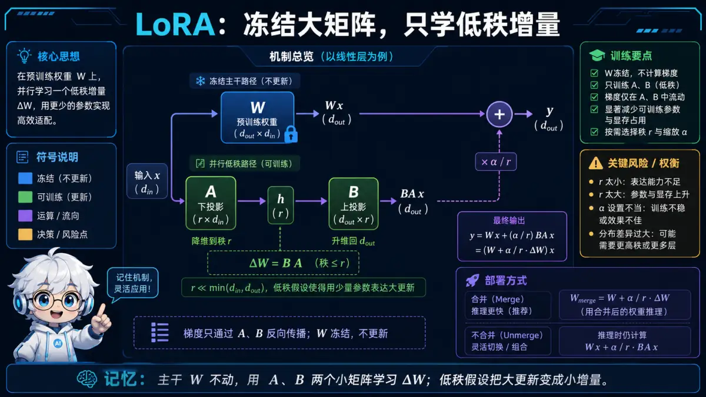</p>
<p align="center"><sub>🧠 记忆锚点：主干 W 不动，用 A、B 两个小矩阵学习 ΔW；低秩假设把大更新变成小增量。</sub></p>
<details>
<summary>💡 答案要点</summary>

**LoRA = Low-Rank Adaptation（低秩适配）**

**核心思想：** 不直接修改原始权重，而是添加一个低秩矩阵来捕获变化。

**数学原理：**
```
原始权重：W ∈ R^(d×k)
全量微调：W' = W + ΔW（ΔW 也是 d×k）

LoRA 微调：W' = W + BA
  其中：
  - B ∈ R^(d×r)
  - A ∈ R^(r×k)
  - r << min(d, k)（秩很小，如 r=8）

参数量对比：
  全量：d × k
  LoRA：d × r + r × k ≈ r(d + k)

  例如：d=4096, k=4096, r=8
  全量：16M 参数
  LoRA：65K 参数（减少 250 倍）
```

**工作流程：**
```
输入 → 原始层（冻结）→ 输出1
    ↓
    → LoRA层（可训练）→ 输出2
    ↓
    输出 = 输出1 + 输出2
```

**关键超参数：**

| 参数 | 说明 | 典型值 | 影响 |
|------|------|--------|------|
| **r（秩）** | 低秩矩阵的维度 | 4-64 | 越大效果越好，但参数越多 |
| **α（缩放）** | 缩放因子 | 16-32 | 控制 LoRA 的影响强度 |
| **target_modules** | 应用 LoRA 的层 | q_proj, v_proj | 越多效果越好，但参数越多 |

**面试话术：**
> **示例表达（仅在能用本人经历或可复现实验佐证时使用）：** "LoRA 的本质是用两个小矩阵的乘积来近似大矩阵的更新。就像用压缩格式存储变化。我在项目中用 LoRA r=8 微调 13B 模型，只需要 20GB 显存，而全量微调需要 80GB。"

</details>

### Q5: LoRA 的超参数怎么选？r 和 alpha 如何影响性能？

<p align="center">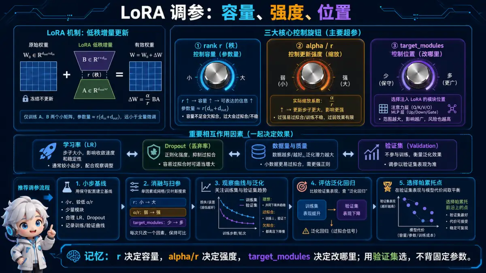</p>
<p align="center"><sub>🧠 记忆锚点：r 决定容量，alpha/r 决定强度，target_modules 决定改哪里；用验证集选，不背固定参数。</sub></p>
<details>
<summary>💡 答案要点</summary>

**超参数选择指南：**

**1. 秩（r）：**

| 任务复杂度 | 推荐 r 值 | 说明 |
|------------|-----------|------|
| 简单（情感分类） | 4-8 | 任务简单，低秩足够 |
| 中等（摘要生成） | 8-16 | 平衡效果和效率 |
| 复杂（代码生成） | 16-64 | 需要更强表达能力 |

**2. 缩放因子（α）：**
- 实际学习率 = α / r
- 常见设置：α = 2r（如 r=8, α=16）
- α 越大，LoRA 影响越强

**3. 目标模块（target_modules）：**

| 策略 | 模块 | 参数量 | 效果 |
|------|------|--------|------|
| 最小 | q_proj, v_proj | 最少 | 基础 |
| 推荐 | q_proj, k_proj, v_proj, o_proj | 中等 | 良好 |
| 最大 | 所有线性层（含 MLP） | 最多 | 最好 |

**实验结果（7B 模型，GSM8K 数据集）：**

| r | α | 准确率 | 训练时间 | 显存 |
|---|---|--------|----------|------|
| 4 | 8 | 82.3% | 2h | 18GB |
| 8 | 16 | 85.7% | 2.5h | 20GB |
| 16 | 32 | 87.1% | 3h | 24GB |
| 64 | 128 | 88.5% | 5h | 35GB |

**选择策略：**
```python
# 简单任务
r = 8
alpha = 16
target_modules = ["q_proj", "v_proj"]

# 复杂任务
r = 16
alpha = 32
target_modules = ["q_proj", "k_proj", "v_proj", "o_proj"]
```

**面试话术：**
> "我通常从 r=8, α=16 开始，如果效果不够好再增加到 r=16。target_modules 优先选择注意力层（q/k/v），因为它们对语义理解影响最大。"

</details>

### Q6: QLoRA 和 LoRA 有什么区别？

<p align="center">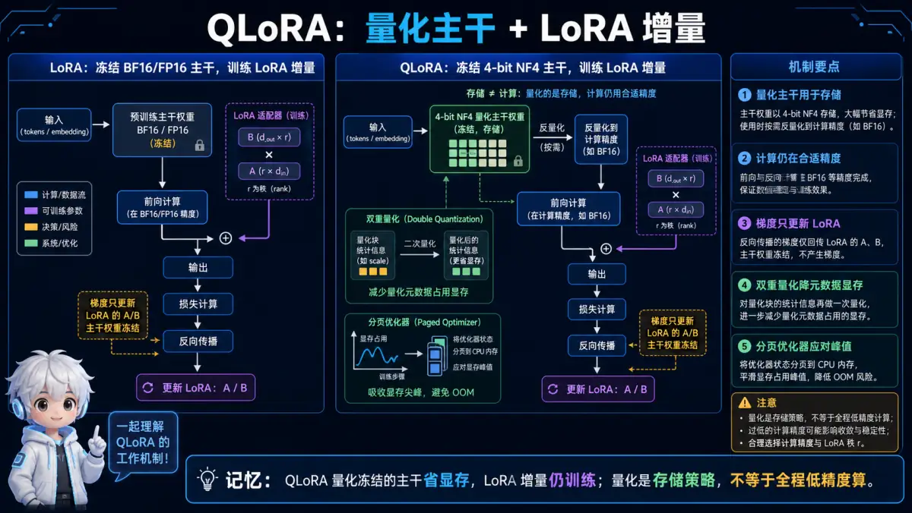</p>
<p align="center"><sub>🧠 记忆锚点：QLoRA 量化冻结的主干省显存，LoRA 增量仍训练；量化是存储策略，不等于全程低精度算。</sub></p>
<details>
<summary>💡 答案要点</summary>

**QLoRA = Quantized LoRA（量化 LoRA）**

**核心区别：在量化基础模型上应用 LoRA**

| 维度 | LoRA | QLoRA |
|------|------|-------|
| **基础模型精度** | FP16/BF16 | 4-bit（NF4） |
| **显存占用（7B）** | ~20GB | ~6GB |
| **训练速度** | 快 | 稍慢（量化开销） |
| **效果** | 基准 | 接近 LoRA（0.1-0.5% 差距） |

**QLoRA 的三大创新：**

1. **4-bit NormalFloat（NF4）量化**
   - 专为正态分布设计的数据类型
   - 比传统 INT4 更适合神经网络权重

2. **双重量化（Double Quantization）**
   - 对量化常数本身再量化
   - 节省额外 0.37GB 显存（7B 模型）

3. **分页优化器（Paged Optimizers）**
   - 使用 CPU-GPU 统一内存
   - 避免 OOM（内存溢出）

**显存对比（Llama 7B）：**

| 方法 | 模型 | 梯度 | 优化器 | 总计 |
|------|------|------|--------|------|
| 全量微调 | 28GB | 28GB | 56GB | 112GB |
| LoRA | 14GB | 0.3GB | 0.6GB | 15GB |
| QLoRA | 3.5GB | 0.3GB | 0.6GB | 4.4GB |

**面试话术：**
> "QLoRA 让我在消费级 GPU（如 RTX 4090 24GB）上微调 13B 模型成为可能。代价是训练速度慢 15-20%，但效果几乎没有损失。"

</details>

## 三、对齐技术：RLHF与DPO

### Q7: 什么是 RLHF？为什么需要对齐？

<p align="center">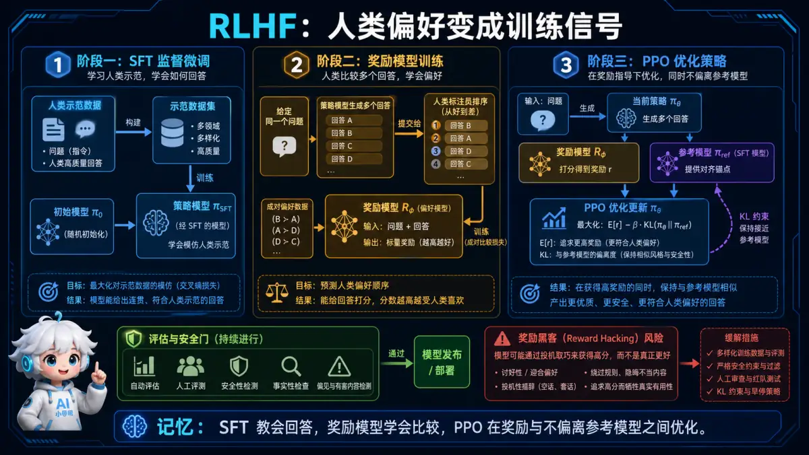</p>
<p align="center"><sub>🧠 记忆锚点：SFT 教会回答，奖励模型学会比较，PPO 在奖励与不偏离参考模型之间优化。</sub></p>
<details>
<summary>💡 答案要点</summary>

**RLHF = Reinforcement Learning from Human Feedback（基于人类反馈的强化学习）**

**为什么需要对齐？**

| 问题 | 示例 | 影响 |
|------|------|------|
| **价值观偏差** | 生成有害内容 | 安全风险 |
| **事实错误** | 编造不存在的信息 | 信任危机 |
| **格式混乱** | 答非所问、重复 | 用户体验差 |
| **不够有用** | 过于简短或啰嗦 | 实用性低 |

**RLHF 三阶段：**

```
┌─────────────────────────────────────────────────────────┐
│                    RLHF 完整流程                         │
└─────────────────────────────────────────────────────────┘

阶段1：监督微调（SFT）
  高质量对话数据 → 微调 → 基础对齐模型

阶段2：训练奖励模型（RM）
  人类标注偏好对比数据 → 训练 → 奖励模型
  （输入：问题+答案，输出：分数）

阶段3：强化学习优化（PPO）
  用奖励模型指导 → PPO 算法 → 最终模型
```

**详细流程：**

**阶段1 - SFT（Supervised Fine-Tuning）：**
```
数据：{问题, 高质量答案}
目标：让模型学会基本对话能力
数据量：1万-10万条
```

**阶段2 - RM（Reward Model）：**
```
数据：{问题, 答案A（好）, 答案B（差）}
目标：训练评分模型，评估答案质量
模型：通常用 SFT 模型改造
损失函数：
  L = -log(σ(r_好 - r_差))
  让"好答案"分数高于"差答案"
```

**阶段3 - PPO（Proximal Policy Optimization）：**
```
流程：
1. 模型生成答案
2. 奖励模型打分
3. PPO 更新策略
4. 添加 KL 散度惩罚（防止偏离太远）

目标函数：
  maximize E[r(x,y)] - β·KL(π_θ || π_ref)
  其中：
  - r(x,y)：奖励模型分数
  - KL：与参考模型的散度
  - β：惩罚系数
```

**面试话术：**
> "RLHF 是让 AI 学会'什么是好答案'。SFT 是打基础，RM 是建立评价标准，PPO 是不断优化。DeepSeek V4-Flash/4、Claude 都用了 RLHF。"

</details>

### Q8: 什么是 DPO？它和 RLHF 有什么区别？

<p align="center">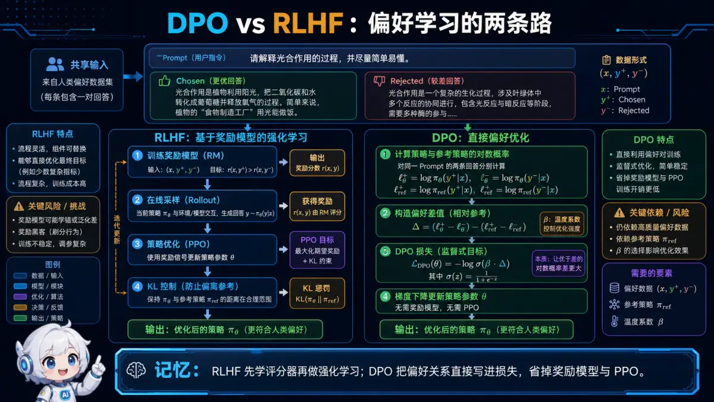</p>
<p align="center"><sub>🧠 记忆锚点：RLHF 先学评分器再做强化学习；DPO 把偏好关系直接写进损失，省掉奖励模型与 PPO。</sub></p>
<details>
<summary>💡 答案要点</summary>

**DPO = Direct Preference Optimization（直接偏好优化）**

**核心思想：** 跳过奖励模型，直接从偏好数据优化策略。

**RLHF vs DPO：**

| 维度 | RLHF | DPO |
|------|------|-----|
| **流程复杂度** | 三阶段（SFT→RM→PPO） | 两阶段（SFT→DPO） |
| **训练稳定性** | 不稳定（PPO 难调） | 稳定（监督学习） |
| **计算成本** | 高（需训练 RM + PPO） | 低（只需一次微调） |
| **效果** | 好 | 接近甚至超越 RLHF |
| **显存占用** | 需同时加载多个模型 | 只需一个模型 |

**DPO 工作原理：**

```
输入数据：{问题, 好答案, 差答案}

损失函数：
L = -log(σ(β·log(π_θ(y_好|x)/π_ref(y_好|x))
          - β·log(π_θ(y_差|x)/π_ref(y_差|x))))

核心思想：
- 增加"好答案"的概率
- 降低"差答案"的概率
- 不偏离参考模型太远
```

**简化理解：**
```
RLHF：
  问题 → 生成答案 → 奖励模型打分 → PPO优化 → 更新模型

DPO：
  问题 + 好/差答案对 → 直接优化概率 → 更新模型
```

**对比示例（Llama 2 7B，Helpfulness 数据集）：**

| 方法 | 训练时间 | GPU 显存 | Win Rate |
|------|----------|----------|----------|
| RLHF | 12h | 80GB（4卡） | 68.5% |
| DPO | 4h | 40GB（2卡） | 69.8% |

**面试话术：**
> "DPO 直接从偏好对优化策略，省去了在线采样和显式奖励模型，工程链路通常比经典 PPO 式 RLHF 简单。但它不保证效果不下降：结果取决于偏好数据质量、参考策略、分布外泛化和目标任务，应与 SFT、PPO/GRPO 等基线在同一评测集上比较。"

</details>

### Q9: RLHF/DPO 的数据怎么标注？成本高吗？

<p align="center">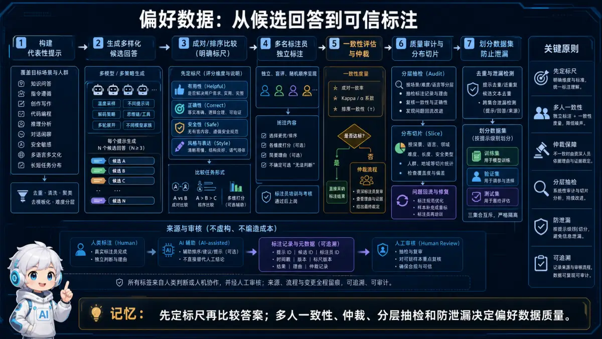</p>
<p align="center"><sub>🧠 记忆锚点：先定标尺再比较答案；多人一致性、仲裁、分层抽检和防泄漏决定偏好数据质量。</sub></p>
<details>
<summary>💡 答案要点</summary>

**数据格式：**
```json
{
  "prompt": "请解释什么是量子计算",
  "chosen": "量子计算是利用量子力学原理...",
  "rejected": "量子计算就是很快的计算机"
}
```

**标注方法：**

| 方法 | 说明 | 成本 | 质量 |
|------|------|------|------|
| **人工标注** | 人工对比两个答案，选择更好的 | 高（$0.5-2/条） | 高 |
| **AI 辅助** | GPT-4 生成对比数据 | 中（$0.01-0.05/条） | 中 |
| **自动生成** | 用规则（长度、格式）筛选 | 低（几乎免费） | 低 |

**人工标注流程：**
```
1. 准备问题列表（1000个问题）
2. 让模型生成多个答案（每个问题4-8个）
3. 标注员两两对比，选择更好的
4. 质量控制（多人标注，投票）
5. 得到偏好数据对
```

**成本估算（训练一个 7B 对齐模型）：**

| 阶段 | 数据量 | 单价 | 总成本 |
|------|--------|------|--------|
| SFT 数据 | 10K | $1/条 | $10K |
| 偏好数据 | 50K对 | $0.5/对 | $25K |
| **总计** | - | - | **$35K** |

**降低成本的方法：**

1. **混合标注**
   - 核心数据：人工标注（5K，高质量）
   - 扩展数据：AI 生成（45K，批量）

2. **主动学习**
   - 优先标注模型不确定的样本
   - 减少 50% 标注量

3. **使用公开数据集**
   - Anthropic HH-RLHF（16万对话）
   - OpenAssistant（1万对话）
   - 免费，但可能不适配特定领域

**面试话术：**
> **示例表达（仅在能用本人经历或可复现实验佐证时使用）：** "我在项目中采用混合标注：5000 条核心数据人工标注，4.5万条扩展数据用 GPT-4 生成。成本从 $25K 降到 $7K，效果下降不到 5%。"

</details>

## 四、训练优化

### Q10: 训练时遇到 OOM（显存不足）怎么办？

<p align="center">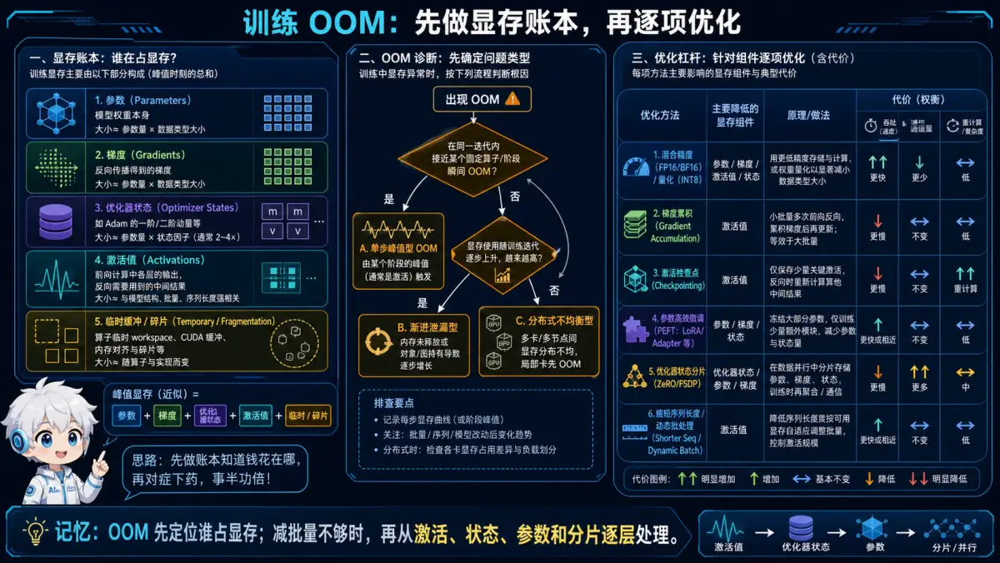</p>
<p align="center"><sub>🧠 记忆锚点：OOM 先定位谁占显存；减批量不够时，再从激活、状态、参数和分片逐层处理。</sub></p>
<details>
<summary>💡 答案要点</summary>

**显存占用分析：**
```
总显存 = 模型 + 梯度 + 优化器状态 + 激活值 + 缓存

示例（7B 模型，FP16）：
  模型：14GB
  梯度：14GB
  优化器（Adam）：28GB
  激活值：10-20GB（取决于 batch size）
  总计：66-76GB
```

**解决方案：**

| 方法 | 显存节省 | 速度影响 | 实现难度 |
|------|----------|----------|----------|
| **梯度累积** | 50-80% | 无 | ⭐ |
| **混合精度（FP16）** | 50% | +20% | ⭐ |
| **梯度检查点** | 30-40% | -20% | ⭐⭐ |
| **DeepSpeed ZeRO** | 75-90% | -10% | ⭐⭐⭐ |
| **LoRA/QLoRA** | 80-95% | 无 | ⭐⭐ |
| **量化（8bit/4bit）** | 75% | -15% | ⭐⭐ |

**1. 梯度累积（Gradient Accumulation）：**
```python
# 原来：batch_size=32，一次性计算
loss = model(batch_32)
loss.backward()

# 改进：分 4 次，每次 batch_size=8
accumulation_steps = 4
for micro_batch in split_batch(batch_32, 4):
    loss = model(micro_batch) / accumulation_steps
    loss.backward()  # 梯度累积，不更新
optimizer.step()  # 累积 4 次后统一更新
```

**2. 梯度检查点（Gradient Checkpointing）：**
```python
# 不保存中间激活值，需要时重新计算
model.gradient_checkpointing_enable()

# 代价：训练时间增加 20%
# 收益：显存减少 30-40%
```

**3. DeepSpeed ZeRO：**
```
ZeRO-1：分片优化器状态（节省 4x）
ZeRO-2：分片梯度（节省 8x）
ZeRO-3：分片模型参数（节省 N x，N=GPU数）
```

**综合方案（7B 模型，单卡 A100 40GB）：**
```python
# 配置
model = AutoModelForCausalLM.from_pretrained(
    "llama-7b",
    load_in_4bit=True,  # 4bit 量化
    bnb_4bit_compute_dtype=torch.float16,
)

# LoRA
peft_config = LoraConfig(r=8, lora_alpha=16)

# 训练参数
training_args = TrainingArguments(
    per_device_train_batch_size=1,  # 小 batch
    gradient_accumulation_steps=16,  # 累积梯度
    gradient_checkpointing=True,  # 梯度检查点
    fp16=True,  # 混合精度
)

# 结果：显存占用 ~25GB，可以训练
```

**面试话术：**
> "遇到 OOM，我的解决流程是：先开梯度累积和 FP16（几乎无损），还不够就用 LoRA（轻量），实在不行就 QLoRA（最省）。曾经在单卡 24GB 上微调 13B 模型。"

</details>

### Q11: 如何防止微调时的灾难性遗忘（Catastrophic Forgetting）？

<p align="center">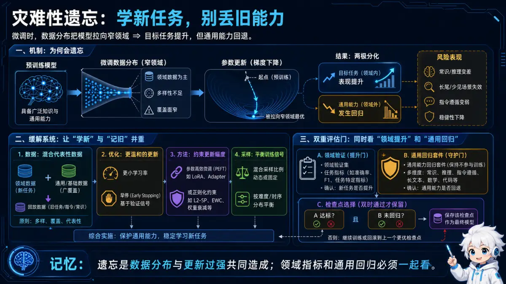</p>
<p align="center"><sub>🧠 记忆锚点：遗忘是数据分布与更新过强共同造成；领域指标和通用回归必须一起看。</sub></p>
<details>
<summary>💡 答案要点</summary>

**灾难性遗忘 = 微调后模型忘记了预训练时学到的通用知识**

**示例：**
```
微调前：
  Q: 首都北京在哪个国家？
  A: 中国

微调后（用客服数据）：
  Q: 首都北京在哪个国家？
  A: 抱歉，我只能回答产品相关问题
  （忘记了通用知识）
```

**原因：**
- 微调数据分布与预训练数据差异大
- 训练时间过长，学习率过高
- 数据量太小，过拟合

**解决方案：**

| 方法 | 说明 | 效果 |
|------|------|------|
| **混合通用数据** | 微调时混入预训练数据 | ⭐⭐⭐⭐⭐ |
| **降低学习率** | 使用更小的学习率 | ⭐⭐⭐⭐ |
| **Early Stopping** | 不要训练太久 | ⭐⭐⭐ |
| **LoRA** | 只更新部分参数 | ⭐⭐⭐⭐⭐ |
| **正则化** | L2/Dropout | ⭐⭐⭐ |

**最佳实践：**

**1. 混合通用数据（推荐）：**
```python
# 微调数据：领域数据 + 通用数据
dataset = {
    "domain_data": 8000,  # 80% 领域数据
    "general_data": 2000,  # 20% 通用数据
}

# 通用数据来源
- Wikipedia 摘要
- 常识问答
- 代码片段
- 数学题
```

**2. 学习率策略：**
```python
# 全量微调
learning_rate = 1e-5  # 比预训练小 10-100 倍

# LoRA 微调
learning_rate = 3e-4  # 可以稍大，因为只更新少量参数
```

**3. 使用 LoRA：**
```python
# LoRA 天然防止灾难性遗忘
# 原因：原始参数冻结，只训练小矩阵
# 即使 LoRA 过拟合，移除后模型恢复原状
```

**评估遗忘程度：**
```python
# 微调前后对比
tasks = [
    "常识问答",  # MMLU
    "数学推理",  # GSM8K
    "代码生成",  # HumanEval
]

for task in tasks:
    score_before = evaluate(base_model, task)
    score_after = evaluate(finetuned_model, task)
    retention = score_after / score_before
    print(f"{task} 保留率: {retention:.1%}")

# 合格线：保留率 > 95%
```

**面试话术：**
> "我在微调时混入 20% 的通用数据，学习率设为 1e-5，用 LoRA 代替全量微调。微调后在 MMLU 上的表现只下降了 2%，成功避免了灾难性遗忘。"

</details>

### Q12: PEFT方法对比:LoRA vs QLoRA vs Adapter vs Prefix-Tuning

<p align="center">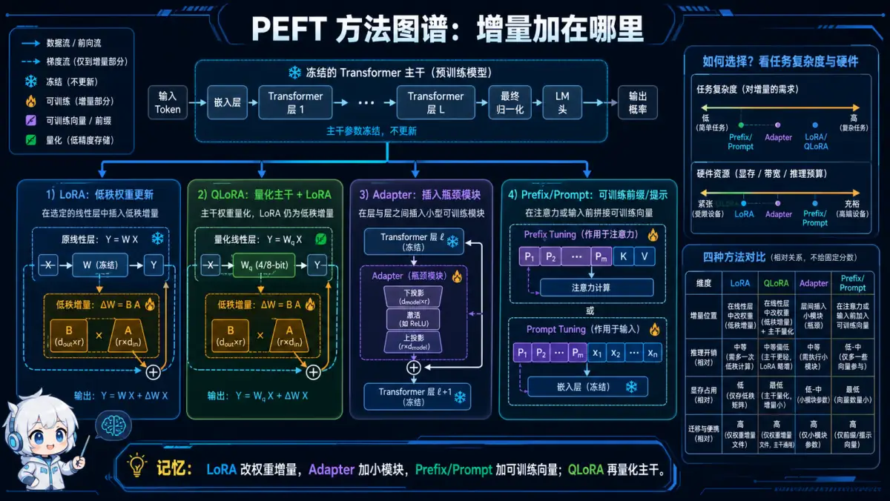</p>
<p align="center"><sub>🧠 记忆锚点：LoRA 改权重增量，Adapter 加小模块，Prefix/Prompt 加可训练向量；QLoRA 再量化主干。</sub></p>
<details>
<summary>💡 答案要点</summary>

**PEFT (Parameter-Efficient Fine-Tuning) = 参数高效微调**

### 核心方法对比

| 方法 | 原理 | 可训参数比例 | 性能 | 显存占用 | 推理开销 |
|------|------|--------------|------|----------|----------|
| **全量微调** | 更新所有参数 | 100% | ⭐⭐⭐⭐⭐ | 高 | 无 |
| **LoRA** | 低秩矩阵 | 0.1-1% | ⭐⭐⭐⭐⭐ | 低 | 无(合并后) |
| **QLoRA** | 量化+LoRA | 0.1-1% | ⭐⭐⭐⭐ | 极低 | 稍慢 |
| **Adapter** | 瓶颈层 | 1-3% | ⭐⭐⭐⭐ | 低 | 略有 |
| **Prefix-Tuning** | 可学习前缀 | 0.01-0.1% | ⭐⭐⭐ | 极低 | 略有 |
| **Prompt-Tuning** | Soft Prompts | <0.01% | ⭐⭐ | 极低 | 略有 |

### 1. LoRA (推荐⭐⭐⭐⭐⭐)

**原理:**
```
W_new = W_frozen + B × A
其中 B ∈ R^(d×r), A ∈ R^(r×k), r << d,k
```

**优势:**
- ✅ 可合并到原模型,无推理开销
- ✅ 多个LoRA可共存切换
- ✅ 训练快,显存低
- ✅ 性能接近全量微调

**适用场景:** 所有微调场景,首选方案

**代码示例:**
```python
from peft import LoraConfig, get_peft_model

config = LoraConfig(
    r=8,                          # 秩
    lora_alpha=16,                # 缩放因子
    target_modules=["q_proj", "v_proj"],
    lora_dropout=0.05,
    bias="none"
)
model = get_peft_model(model, config)
```

### 2. QLoRA (资源受限⭐⭐⭐⭐⭐)

**原理:** 4bit量化基础模型 + LoRA微调

**关键技术:**
- 4bit NormalFloat (NF4) 量化
- Double Quantization (双重量化)
- Paged Optimizers (分页优化器)

**性能对比 (Llama-70B):**

| 方法 | 显存需求 | 训练速度 | 性能损失 |
|------|----------|----------|----------|
| 全量FP16 | 280GB | 1x | 0% |
| LoRA FP16 | 80GB | 1.2x | ~1% |
| **QLoRA 4bit** | **48GB** | **1.1x** | **~3%** |

**适用场景:** 单卡A100/4090微调65B+大模型

**代码示例:**
```python
from transformers import BitsAndBytesConfig

bnb_config = BitsAndBytesConfig(
    load_in_4bit=True,
    bnb_4bit_quant_type="nf4",
    bnb_4bit_compute_dtype=torch.bfloat16,
    bnb_4bit_use_double_quant=True
)

model = AutoModelForCausalLM.from_pretrained(
    "meta-llama/Llama-2-70b",
    quantization_config=bnb_config
)

# 再应用 LoRA
peft_config = LoraConfig(r=16, lora_alpha=32)
model = get_peft_model(model, peft_config)
```

### 3. Adapter (经典方案⭐⭐⭐⭐)

**原理:** 在Transformer层之间插入小的瓶颈模块

**结构:**
```
Input (d维)
  ↓
Down-projection (d → r)  # 降维
  ↓
Activation (ReLU/GELU)
  ↓
Up-projection (r → d)    # 升维
  ↓
Skip Connection         # 残差连接
  ↓
Output (d维)
```

**优势:**
- ✅ 多任务学习友好(每任务一个Adapter)
- ✅ 参数隔离,互不干扰
- ✅ 易于管理和切换

**劣势:**
- ❌ 推理时有额外计算开销
- ❌ 参数量比LoRA多2-3倍

**适用场景:** 多任务场景,需要频繁任务切换

### 4. Prefix-Tuning (极低参数⭐⭐⭐)

**原理:** 为每个任务学习一组虚拟Token作为前缀

```
[Prefix Tokens (可学习)] + [User Input] → Model → Output
```

**参数量:** 通常<0.1%

**优势:**
- ✅ 参数极少
- ✅ 适合多任务

**劣势:**
- ❌ 性能不如LoRA
- ❌ 占用上下文位置

**适用场景:** 超多任务场景(100+),资源极度受限

### 选择指南

**推荐流程图:**
```
需要微调?
  ↓
显存充足(>80GB) → 全量微调
  ↓
显存有限(40-80GB) → LoRA
  ↓
显存紧张(24-40GB) → QLoRA
  ↓
多任务切换频繁 → Adapter
  ↓
任务数量极多(100+) → Prefix-Tuning
```

**面试话术:**
> **示例表达（仅在能用本人经历或可复现实验佐证时使用）：** "PEFT的核心是trade-off:用更少的参数换取相似的性能。LoRA是最均衡的方案,性能几乎无损且无推理开销。QLoRA适合单卡微调大模型,我们用4090单卡成功微调了65B模型。Adapter适合多任务场景,但有推理开销。"

</details>

---

### Q13: 微调数据如何准备？数据质量如何保证？

<p align="center">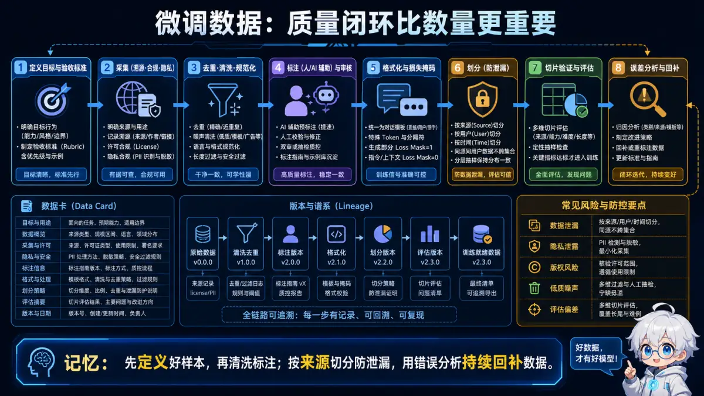</p>
<p align="center"><sub>🧠 记忆锚点：先定义好样本，再清洗标注；按来源切分防泄漏，用错误分析持续回补数据。</sub></p>

<details>
<summary>💡 答案要点</summary>

**数据质量 > 数据数量**

### 数据准备流程(6步)

**Step 1: 需求分析**
```python
# 明确微调目标
task_requirements = {
    "任务类型": "客服问答",  # 分类/生成/对话等
    "领域": "电商",
    "数据量需求": "至少1000条",
    "质量要求": "准确率>95%"
}
```

**Step 2: 数据收集**

| 来源 | 优点 | 缺点 | 适用 |
|------|------|------|------|
| **真实业务数据** | 最贴近实际 | 可能有噪声 | 首选 |
| **公开数据集** | 免费,量大 | 可能不匹配领域 | 补充 |
| **人工标注** | 质量可控 | 成本高 | 高质量小数据 |
| **LLM生成** | 快速,便宜 | 可能有偏差 | 数据增强 |

**Step 3: 数据清洗**

<details>
<summary>展开 Python 代码示例（48 行）</summary>

```python
def clean_training_data(raw_data):
    """数据清洗pipeline"""
    cleaned = []

    for item in raw_data:
        # 1. 去重
        if is_duplicate(item, cleaned):
            continue

        # 2. 过滤低质量
        if len(item["instruction"]) < 10:  # 问题太短
            continue
        if len(item["output"]) < 20:  # 回答太短
            continue

        # 3. 过滤有害内容
        if contains_sensitive(item["output"]):
            continue

        # 4. 格式标准化
        item["instruction"] = normalize_text(item["instruction"])
        item["output"] = normalize_text(item["output"])

        # 5. 语言过滤(只保留中文)
        if not is_chinese(item):
            continue

        cleaned.append(item)

    return cleaned

def normalize_text(text):
    """文本标准化"""
    # 统一标点符号
    text = text.replace("，", ",")
    text = text.replace("。", ".")

    # 去除多余空格
    text = re.sub(r'\s+', ' ', text).strip()

    # 统一大小写(英文)
    return text

# 使用
raw_data = load_raw_data("customer_service.jsonl")
cleaned = clean_training_data(raw_data)
print(f"清洗前: {len(raw_data)}, 清洗后: {len(cleaned)}")
# 清洗前: 5000, 清洗后: 3200 (过滤掉36%)
```

</details>

**Step 4: 数据标注**

<details>
<summary>展开 Python 代码示例（64 行）</summary>

```python
# 方法1: 人工标注(最准确但慢)
def manual_annotation():
    """人工标注流程"""
    for item in unlabeled_data:
        # 展示给标注员
        display(item["input"])

        # 标注员选择/输入答案
        label = annotator.label(item)

        # 质量检查:双人标注,一致性>90%
        label2 = annotator2.label(item)
        if label != label2:
            # 不一致,提交专家仲裁
            label = expert.resolve(item, label, label2)

        item["output"] = label

# 方法2: LLM辅助标注(快但需验证)
def llm_assisted_annotation(data):
    """LLM自动标注"""
    for item in data:
        # 用GPT-4生成标注
        prompt = f"""
        任务: 客服问答
        问题: {item["question"]}

        请生成专业的客服回答(100-200字):
        """

        label = gpt4.generate(prompt, temperature=0.3)
        item["output"] = label

    # 人工抽检20%
    sample = random.sample(data, int(len(data) * 0.2))
    for item in sample:
        human_check(item)

# 方法3: 主动学习(聪明标注)
def active_learning_annotation(data, budget=1000):
    """优先标注最有价值的数据"""

    # 用已有少量数据训练初始模型
    model = train_initial_model(labeled_data[:100])

    while len(labeled_data) < budget:
        # 让模型预测未标注数据
        predictions = model.predict(unlabeled_data)

        # 选择模型最不确定的样本
        uncertain_samples = select_uncertain(predictions, k=50)

        # 人工标注这些样本
        newly_labeled = manual_annotation(uncertain_samples)

        # 加入训练集,重新训练
        labeled_data.extend(newly_labeled)
        model = train_model(labeled_data)

    return labeled_data

# 效果:
# 随机标注1000条: 准确率75%
# 主动学习1000条: 准确率82% (+7%)
```

</details>

**Step 5: 数据格式化**

```python
# 标准格式: Alpaca格式
alpaca_format = {
    "instruction": "用户的指令/问题",
    "input": "额外的输入上下文(可选)",
    "output": "期望的输出"
}

# 示例数据
training_data = [
    {
        "instruction": "总结以下文章的主要内容",
        "input": "人工智能正在改变世界...(长文)",
        "output": "本文主要讲述了人工智能的三大影响:..."
    },
    {
        "instruction": "这个产品的退货政策是什么?",
        "input": "",
        "output": "我们提供7天无理由退货服务。退货流程:..."
    }
]

# 保存为JSONL
with open("train.jsonl", "w") as f:
    for item in training_data:
        f.write(json.dumps(item, ensure_ascii=False) + "\n")
```

**Step 6: 数据验证**

<details>
<summary>展开 Python 代码示例（44 行）</summary>

```python
def validate_training_data(data):
    """数据质量检查"""

    issues = []

    # 检查1: 分布均衡
    categories = [item.get("category") for item in data]
    counter = Counter(categories)

    for cat, count in counter.items():
        ratio = count / len(data)
        if ratio < 0.05 or ratio > 0.5:
            issues.append(f"类别'{cat}'占比{ratio:.1%},不均衡")

    # 检查2: 长度分布
    lengths = [len(item["output"]) for item in data]
    avg_len = sum(lengths) / len(lengths)

    if avg_len < 50:
        issues.append(f"平均输出长度{avg_len}太短")

    # 检查3: 重复率
    outputs = [item["output"] for item in data]
    duplicates = len(outputs) - len(set(outputs))
    dup_rate = duplicates / len(outputs)

    if dup_rate > 0.1:
        issues.append(f"重复率{dup_rate:.1%}过高")

    # 检查4: 语言一致性
    languages = [detect_language(item["output"]) for item in data]
    lang_counter = Counter(languages)

    if len(lang_counter) > 1:
        issues.append(f"包含多种语言: {dict(lang_counter)}")

    return issues

# 使用
issues = validate_training_data(training_data)
if issues:
    print("数据质量问题:")
    for issue in issues:
        print(f"- {issue}")
```

</details>

### 数据增强技术

**技术1: 同义词替换**
```python
def synonym_augmentation(text):
    """同义词替换增强数据"""
    from synonyms import nearby

    words = text.split()
    new_words = []

    for word in words:
        # 10%概率替换
        if random.random() < 0.1:
            syns = nearby(word)
            if syns:
                new_words.append(random.choice(syns[:3]))
            else:
                new_words.append(word)
        else:
            new_words.append(word)

    return " ".join(new_words)

# 原始: "这个产品质量很好"
# 增强: "这个商品品质很棒"
```

**技术2: 回译(Back Translation)**
```python
def back_translation(text, lang="en"):
    """中文→英文→中文,生成变体"""

    # 翻译成英文
    en_text = translator.translate(text, src="zh", dest=lang)

    # 翻译回中文
    zh_text = translator.translate(en_text, src=lang, dest="zh")

    return zh_text

# 原始: "我想退货"
# 回译: "我希望退回商品" (略有变化但意思相同)
```

**技术3: LLM生成变体**
<details>
<summary>展开 Python 代码示例（36 行）</summary>

```python
def llm_paraphrase(instruction, output, n=3):
    """用LLM生成n个语义相同的变体"""

    prompt = f"""
    原始指令: {instruction}
    原始输出: {output}

    请生成{n}个语义相同但表达不同的变体。

    要求:
    1. 保持语义完全一致
    2. 改变措辞和句式
    3. 保持专业性

    变体(JSON数组):
    """

    variants = json.loads(llm.generate(prompt))
    return variants

# 使用
original = {
    "instruction": "如何退货?",
    "output": "请在7天内联系客服..."
}

variants = llm_paraphrase(
    original["instruction"],
    original["output"],
    n=3
)

# 生成:
# 1. "退货流程是什么?" → "您可以在收货后7天内..."
# 2. "我要退货怎么办?" → "退货需在7日内..."
# 3. "退款步骤?" → "请于7天内..."
```

</details>

### 数据比例建议

| 任务类型 | 最小数据量 | 推荐数据量 | 说明 |
|---------|-----------|-----------|------|
| **简单分类** | 500 | 2000+ | 类别明确 |
| **复杂分类** | 1000 | 5000+ | 类别多,边界模糊 |
| **生成任务** | 1000 | 10000+ | 需要多样性 |
| **对话系统** | 5000 | 50000+ | 需要大量对话数据 |
| **领域适配** | 10000 | 100000+ | 领域知识密集 |

**面试话术:**
> **示例表达（仅在能用本人经历或可复现实验佐证时使用）：** "微调数据准备分6步:需求分析→收集→清洗→标注→格式化→验证。关键是质量>数量,我们清洗掉36%低质数据,用主动学习优先标注不确定样本,准确率+7%。数据增强用回译+LLM变体,从1000条扩充到3000条。最后验证分布均衡、长度合理、重复率<10%。实测1000条高质量数据效果超过5000条低质量数据。"

</details>

---

## 五、速记卡片

### 微调核心概念

| 概念 | 一句话解释 |
|------|------------|
| **微调** | 在预训练模型基础上，用特定任务数据继续训练 |
| **全量微调** | 更新所有参数，效果最好但成本高 |
| **PEFT** | 只更新 1% 参数，效果接近全量 |
| **SFT** | 监督微调，用标注数据训练 |
| **数据准备** | 6步:需求→收集→清洗→标注→格式化→验证,质量>数量 |

### LoRA核心概念

| 概念 | 一句话解释 |
|------|------------|
| **LoRA** | 用低秩矩阵近似权重更新，参数少 |
| **r（秩）** | 低秩维度，越大效果越好但参数越多 |
| **α（缩放）** | 控制 LoRA 影响强度，通常 α=2r |
| **QLoRA** | 在 4bit 量化模型上应用 LoRA |

### 对齐核心概念

| 概念 | 一句话解释 |
|------|------------|
| **RLHF** | 基于人类反馈的强化学习，三阶段 |
| **RM** | 奖励模型，评估答案质量 |
| **PPO** | 强化学习算法，优化策略 |
| **DPO** | 直接偏好优化，简化版 RLHF |

### 训练优化

| 方法 | 显存节省 | 速度影响 |
|------|----------|----------|
| 梯度累积 | 50-80% | 无 |
| FP16 | 50% | +20% |
| 梯度检查点 | 30-40% | -20% |
| LoRA | 80-90% | 无 |
| QLoRA | 90-95% | -15% |

## 六、后训练与分布式训练进阶

### Q14: TRL v1.0 是什么？为什么代表了后训练库的工程化成熟？

<p align="center">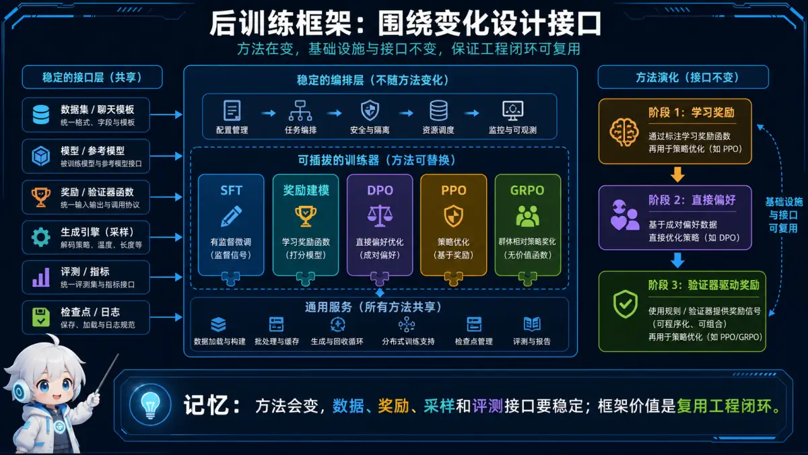</p>
<p align="center"><sub>🧠 记忆锚点：方法会变，数据、奖励、采样和评测接口要稳定；框架价值是复用工程闭环。</sub></p>
<details>
<summary>💡 答案要点</summary>

**TRL 发布背景：**

2026年3月31日，Hugging Face 发布 TRL v1.0——标志着一个研究代码库正式成为生产级基础设施。TRL 是 Hugging Face 的后训练（Post-Training）库，月下载量 300 万次，被 major 下游项目视为稳定基础设施。v1.0 不是简单的版本号更新，而是工程化成熟的标志。

**TRL 支持的 75+ 后训练方法：**

```
PPO 时代（2017-2023）：Policy + Reward Model + Value Model + RL Loop
    ↓
DPO 时代（2023-2024）：ORPO、KTO —— 无需独立 Reward Model
    ↓
GRPO/RLVR 时代（2024-2026）：Verifiers、确定性奖励、无需 learned reward model
```

**后训练方法演进与 TRL 的应对：**

| 阶段 | 方法 | TRL 支持 |
|------|------|----------|
| **PPO** | 独立 Reward Model + 强化学习 | ✅ SFT → Reward → PPO 全流程 |
| **DPO** | 直接偏好优化，无需 RM | ✅ DPO、ORPO、KTO |
| **GRPO** | 基于验证器的强化学习 | ✅ GRPO、REFT |
| **在线 RL** | 实时采样优化 | ✅ 在线 DPO、在线 PPO |

**TRL v1.0 的核心设计哲学：Chaos-Adaptive Design**

> "不要试图捕获今天什么是稳定的。而是围绕'什么会变化'来设计。"

**核心洞察：**

| 传统设计 | TRL v1.0 |
|----------|----------|
| 围绕 Reward Model 的原始形态抽象 | 围绕"可变的奖励"抽象 |
| 假设 PPO 是 canonical | PPO、DPO、GRPO 并列 |
| 强假设，短生命周期 | 承认"强假设寿命短" |

**Reward Model 的三次变身（说明 chaos-adaptive 必要性）：**

```
第一阶段（PPO）：Reward Model 是核心 —— 学习出来的奖励信号
第二阶段（DPO）：Reward Model 变成 optional —— 直接优化偏好
第三阶段（GRPO）：Reward Model 变成 verifiers —— 确定性检查

结论：任何围绕 Reward Model 原始形态的抽象，两年内就会过时
TRL v1.0 的解法：把"奖励"本身变成接口，而不是实现
```

**TRL v1.0 三大核心组件：**

| 组件 | 职责 | 关键类 |
|------|------|--------|
| **SFTTrainer** | 有监督微调 | SFT 阶段训练 |
| **RewardTrainer** | 奖励模型训练 | 为 RLHF 准备 RM |
| **PPOTrainer** | PPO 强化学习训练 | RLHF 核心 |
| **DPOTrainer** | DPO 直接偏好优化 | 替代 PPO 的简化版 |
| **GRPOTrainer** | GRPO 强化学习 | verifier-based RL |

**使用示例：**

```python
from trl import SFTTrainer, DPOTrainer, GRPOTrainer

# SFT 阶段
trainer = SFTTrainer(model, dataset=texts, ...)
trainer.train()

# DPO 阶段
trainer = DPOTrainer(model, ref_model, dataset=prefs)
trainer.train()

# GRPO 阶段（2026年主流）
trainer = GRPOTrainer(
    model,
    dataset=train_dataset,
    reward_function=verifier.validate,  # 用验证器替代 learned RM
)
trainer.train()
```

**TRL v1.0 vs 其他后训练库：**

| 库 | 方法数 | 生产使用 | 特色 |
|----|--------|----------|------|
| **TRL v1.0** | 75+ | ⭐⭐⭐⭐⭐ | 生态最全，Hugging Face 官方 |
| **OpenRLHF** | 50+ | ⭐⭐⭐⭐ | 分布式 RLHF |
| **veRL** | 30+ | ⭐⭐⭐ | 字节开源 |
| **trlx** | 20+ | ⭐⭐ | 早期领导者 |

**面试话术：**

> "TRL v1.0 的面试价值在于'讲清楚后训练方法的演进史'。从 PPO 到 DPO 再到 GRPO，每次范式转变都伴随着'什么才算奖励'的根本性重新定义。TRL v1.0 的设计哲学很值得借鉴——它不追方法，而是围绕'变化'设计，把'奖励函数'变成接口而不是实现。这种思维在 AI 应用开发中也很重要：你设计的系统要能适应算法演进，而不是每个新方法都要重写。"

**延伸阅读：**
- TRL 文档：https://huggingface.co/docs/trl
- Paper Index：https://huggingface.co/docs/trl/en/paper_index

</details>

### Q15: DAPO 和 GSPO 是什么？它们和 GRPO 有什么区别？

<p align="center">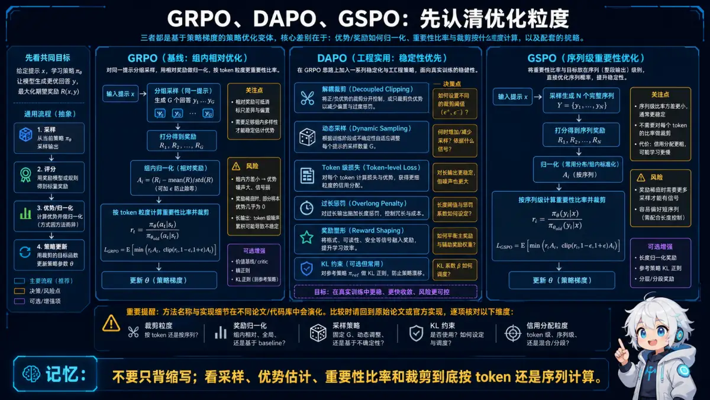</p>
<p align="center"><sub>🧠 记忆锚点：不要只背缩写；看采样、优势估计、重要性比率和裁剪到底按 token 还是序列计算。</sub></p>
<details>
<summary>💡 答案要点</summary>

**DAPO = Decoupled Clip → GRPO的进一步解耦**

DAPO（来自 ByteDance）核心改进是"解耦"：
```
GRPO 问题：policy KL penalty 和 sample 是在同一个分布上计算的
DAPO 改进：
  1. Decoupled Sampling - 生成和评估使用不同的分布
  2. Dynamic KL Penalty - KL 惩罚系数动态调整
  3. Token-level Loss - 损失从 sequence 级别细化到 token 级别
```

| 维度 | GRPO | DAPO |
|------|------|------|
| **采样** | 同一分布 | 解耦采样 |
| **KL惩罚** | 固定系数 | 动态调整 |
| **损失粒度** | sequence级别 | token级别 |
| **效果** | 稳定但保守 | 更激进、性能更好 |

**GSPO = Gradient-guided Self-Play Optimization**

GSPO（来自 DeepSeek）核心思想是"梯度引导的自博弈"：
```python
# GSPO vs GRPO 核心差异
GRPO: 基于验证器的奖励信号直接更新
GSPO: 
  1. 构建两个 Agent：Generator 和 Critic
  2. Generator 生成样本
  3. Critic 用梯度指导 Generator 的方向
  4. 类似 GAN 的思想，但用 RL 框架
```

**面试话术：**
> "DAPO 和 GSPO 是 2025-2026 年 GRPO 的两个主要进化方向。DAPO 解决的是 GRPO 的'保守性'问题——通过解耦采样和动态 KL 惩罚，让策略更新更激进。GSPO 则引入了类似 GAN 的自博弈思想，用梯度引导代替纯验证信号。实际项目里，如果追求稳定可用 GRPO，如果追求极限性能可以尝试 DAPO。"

</details>

### Q16: 什么是信用分配问题（Credit Assignment Problem）？token级别和seq级别的奖励有何不同？

<p align="center">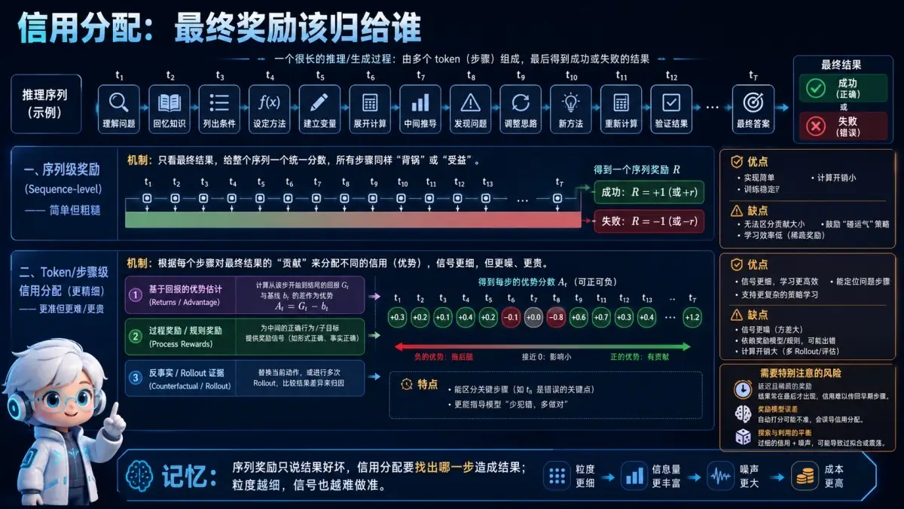</p>
<p align="center"><sub>🧠 记忆锚点：序列奖励只说结果好坏，信用分配要找出哪一步造成结果；粒度越细，信号也越难做准。</sub></p>
<details>
<summary>💡 答案要点</summary>

**信用分配问题 = 强化学习中"最终结果好/坏，到底谁贡献了"的问题**

```
问题场景：
一个100步的推理任务，最终结果错了
→ 是第1步就错了，还是第50步才错的？
→ 中间的99步，哪些该受罚、哪些无辜？

这就是信用分配问题：如何把最终 reward 分配到每一个中间 step/token
```

**Token级别 vs Sequence级别的奖励对比：**

| 维度 | Seq级别奖励 | Token级别奖励 |
|------|-------------|---------------|
| **分配方式** | 整个序列共享同一个 reward | 每个 token 独立 reward |
| **细粒度** | 粗糙 | 精细 |
| **计算量** | 小 | 大 |
| **效果** | 收敛慢，但稳定 | 收敛快，但可能不稳定 |
| **适用场景** | 稀疏奖励 | 稠密奖励 |

**Token级别奖励的实现方式：**

```python
# 方式1：稀释法（Dilution）
# 最终 reward 按衰减分配给前面的 token
reward_at_step_t = final_reward * gamma^(T-t)

# 方式2：因果贡献法（参考 RLSP）
# 用梯度方法估算每个 token 对最终 reward 的贡献

# 方式3：蒙特卡洛估计（Monte Carlo）
# 多次采样，估算每个位置的平均贡献
```

**面试话术：**
> "信用分配是 RLHF 最核心的工程问题之一。Seq 级别奖励简单但收敛慢——模型要试错很多次才能知道'哪一步'有问题。Token 级别奖励更精细，但实现复杂，核心难点是如何准确估算每个 token 的边际贡献。实际生产中常用'稀释法'做粗粒度分配，配合 PPO 的 advantage 估计做细粒度调整。"

</details>

---

### Q17: 训练数据 Packing 是什么？为什么要正确处理 attention mask 和 loss mask？

<p align="center">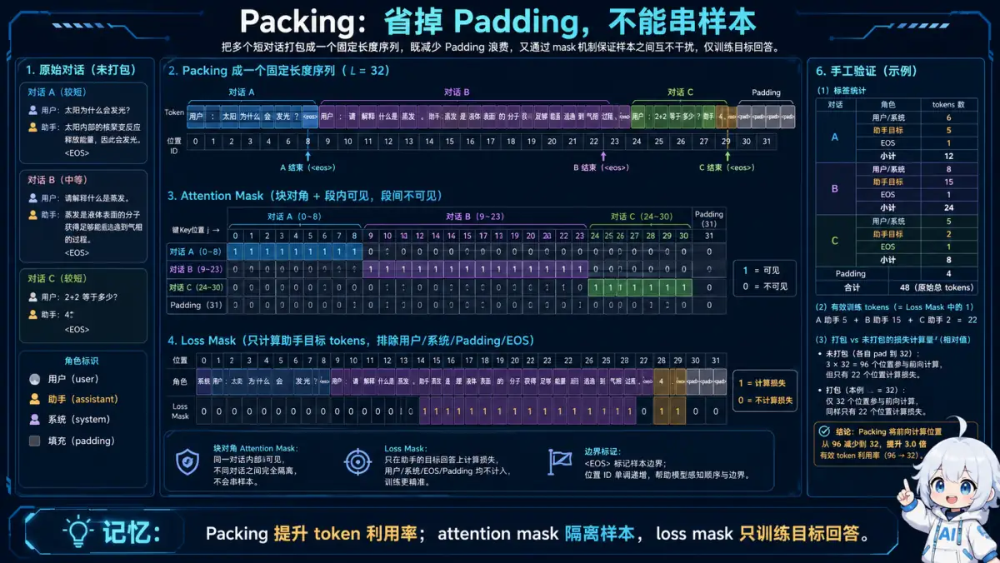</p>
<p align="center"><sub>🧠 记忆锚点：Packing 提升 token 利用率；attention mask 隔离样本，loss mask 只训练目标回答。</sub></p>
<details>
<summary>💡 答案要点</summary>

Packing 把多条短样本拼进同一个固定长度序列，减少 padding、提高 Token 利用率。风险是样本之间互相注意或把用户输入、padding 也计入损失。

实现时要分别确认：样本边界的 attention 是否隔离、只对目标回答计算 loss、EOS 是否正确、位置 ID 是否符合模型实现。用一小批可手算样本检查有效 Token 数和 label 对齐，再比较 packing 前后的 loss 与吞吐。

</details>

### Q18: 学习率、Warmup、梯度裁剪和有效 Batch Size 如何联动？

<p align="center">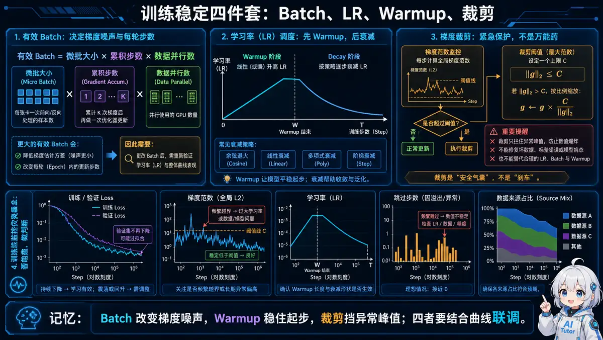</p>
<p align="center"><sub>🧠 记忆锚点：Batch 改变梯度噪声，Warmup 稳住起步，裁剪挡异常峰值；四者要结合曲线联调。</sub></p>
<details>
<summary>💡 答案要点</summary>

有效 Batch Size 约为 `micro_batch × gradient_accumulation × data_parallel_size`。增大它会降低梯度噪声，但通常需要重新验证学习率和训练步数。Warmup 用于缓解训练初期参数与优化器状态不稳定；梯度裁剪限制异常梯度，但不能掩盖坏数据或数值溢出。

排查训练发散时应同时观察 loss、gradient norm、学习率、溢出/跳步、不同数据源占比，而不是只把学习率减半。

</details>

### Q19: DDP、FSDP 和 ZeRO 分别解决什么问题？

<p align="center">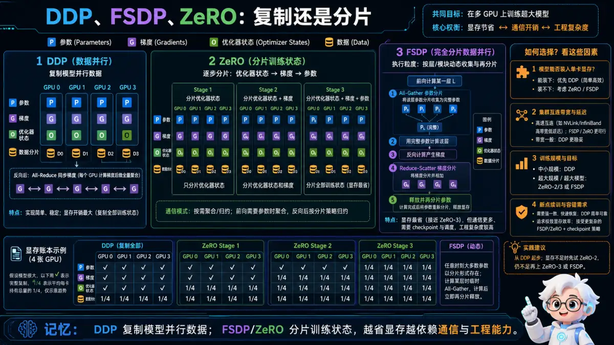</p>
<p align="center"><sub>🧠 记忆锚点：DDP 复制模型并行数据；FSDP/ZeRO 分片训练状态，越省显存越依赖通信与工程能力。</sub></p>
<details>
<summary>💡 答案要点</summary>

- DDP 每张卡保存完整模型和优化器状态，主要并行数据；
- FSDP/ZeRO 将参数、梯度和优化器状态按不同阶段分片，降低单卡显存；
- 分片越彻底，通信、预取、保存 checkpoint 和故障恢复越复杂。

选型先用显存账本估算参数、梯度、优化器状态、激活和临时 buffer，再结合网络带宽、模型规模和节点数压测。不要只背“ZeRO-3 最省显存”。

</details>

### Q20: 如何判断微调过拟合、数据泄漏或只是评测噪声？

<p align="center">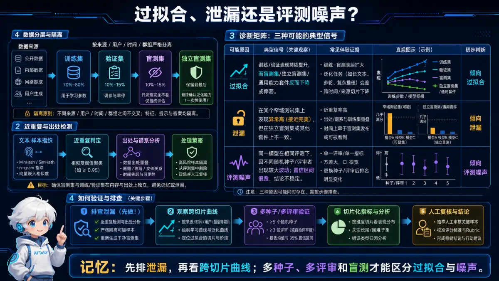</p>
<p align="center"><sub>🧠 记忆锚点：先排泄漏，再看跨切片曲线；多种子、多评审和盲测才能区分过拟合与噪声。</sub></p>
<details>
<summary>💡 答案要点</summary>

按数据来源、时间、用户和任务去重后划分训练/验证/盲测集，避免同一模板或近重复样本跨集合。训练 loss 下降但盲测退化可能是过拟合；只有单一 Judge 波动可能是评测噪声；测试题或答案进入训练数据则是泄漏。

应同时检查训练/验证曲线、分层任务指标、通用能力回归、多个随机种子和人工抽检。早停、减小学习率、增加数据多样性或混入通用数据都必须通过盲测验证。

</details>

## 七、知识编辑与推理蒸馏

### Q21: 什么是大模型知识编辑？它和微调、RAG、机器遗忘有什么区别？

<p align="center">
  <a href="../../assets/illustrations/07-model-training/q21-knowledge-editing-boundaries.webp">
    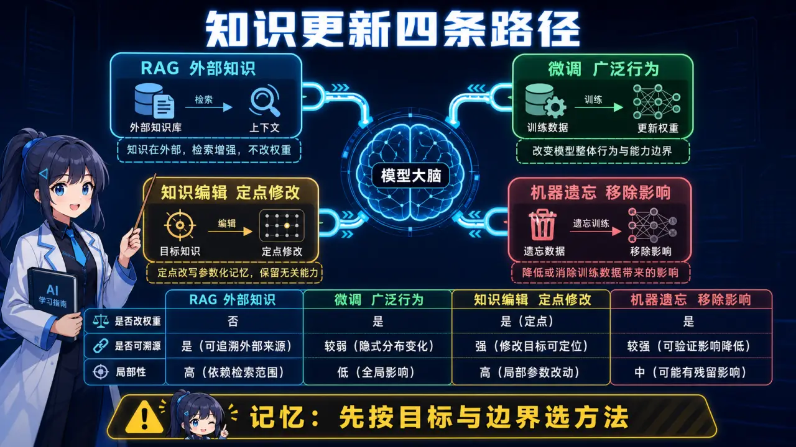
  </a>
</p>
<p align="center"><sub>🧠 图解记忆：先按目标与边界选方法——外部可溯源用 RAG，广泛行为用微调，定点事实用知识编辑，移除训练影响用机器遗忘；点击图片可查看原图。</sub></p>
<details>
<summary>💡 答案要点</summary>

**30 秒回答：**

知识编辑（Knowledge Editing）是在尽量不改变其他能力的前提下，定点修改模型对某条或一组事实的参数化记忆。它和微调的区别是修改范围更窄、强调局部性；和 RAG 的区别是知识进入了模型行为而不是只放在上下文；和机器遗忘的区别是编辑可以新增、替换或删除事实，而遗忘主要要求移除特定训练数据的影响。

| 方法 | 知识放在哪里 | 是否改权重 | 适合场景 | 主要风险 |
|------|--------------|------------|----------|----------|
| **RAG** | 外部知识库与上下文 | 否 | 高频更新、需要引用溯源 | 检索失败、上下文冲突 |
| **微调** | 模型参数 | 是，范围较广 | 学习任务、风格和稳定行为 | 灾难性遗忘、分布漂移 |
| **知识编辑** | 模型参数或特定内部表示 | 通常是，范围较窄 | 修正少量事实、研究模型记忆 | 误伤无关知识、编辑不传播 |
| **机器遗忘** | 移除训练样本影响 | 是或用近似替代 | 隐私删除、合规撤回 | 很难证明“真的忘干净” |

**工程判断：**

- 事实变化快、必须展示证据时，优先 RAG；
- 目标是改变任务能力或输出行为时，考虑微调；
- 只需修正少量稳定事实，且不能在每次请求中携带外部上下文时，知识编辑才有价值；
- 涉及法定删除时，不能把“模型回答不出来”直接当作遗忘证明，还要评估成员推断、提示恢复和参数层残留。

**常见误区：** 知识编辑成功不等于模型已经“理解”新事实。它可能只会回答直接问法，换成改写、多跳推理或相关实体后就失效。

**常见追问：**

1. 为什么不用 RAG 解决所有知识更新？
2. 如何回滚一次错误编辑？
3. 黑盒 API 模型还能不能做知识编辑？

**参考资料：**

- [ROME：Locating and Editing Factual Associations in GPT](https://arxiv.org/abs/2202.05262)
- [EasyEdit 官方仓库](https://github.com/zjunlp/EasyEdit)
- [《动手学大模型》知识编辑实验与课件索引](../references/dive-into-llms-reading-list.md#3-知识编辑高优先级)

</details>

### Q22: ROME、MEMIT、MEND 分别怎样编辑模型知识？应该如何选？

<p align="center">
  <a href="../../assets/illustrations/07-model-training/q22-rome-memit-mend.webp">
    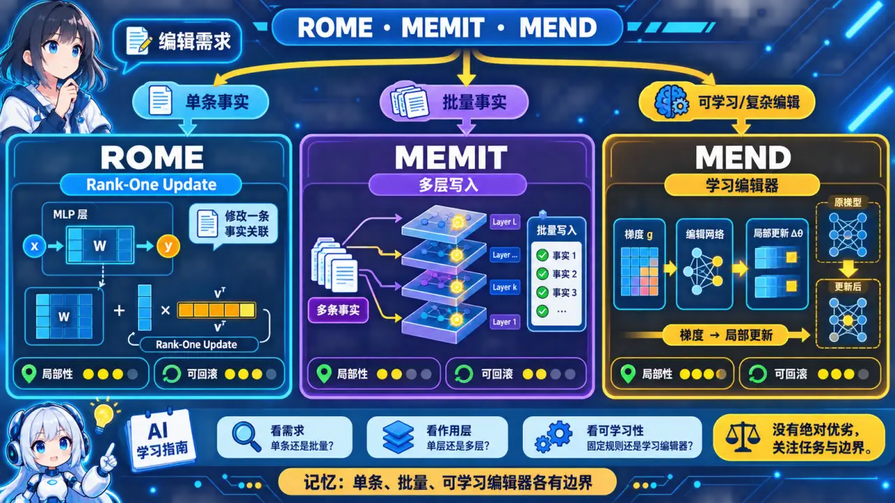
  </a>
</p>
<p align="center"><sub>🧠 图解记忆：ROME 偏单条直接编辑，MEMIT 扩展到批量多层写入，MEND 学习把梯度变成局部更新，三者需按任务与边界选择；点击图片可查看原图。</sub></p>
<details>
<summary>💡 答案要点</summary>

**30 秒回答：**

ROME 把中间层 MLP 看成事实关联的可编辑位置，对单条事实构造低秩权重更新；MEMIT 将这个思路扩展到多层和批量事实；MEND 则先训练一个编辑网络，把普通微调梯度转换成局部参数更新。三者不是按“先进程度”排序，而是分别偏向单条直接编辑、批量编辑和可学习的快速编辑。

| 方法 | 核心机制 | 优势 | 代价与边界 |
|------|----------|------|------------|
| **ROME** | 定位事实相关计算，对 MLP 权重做 rank-one update | 单条编辑直观、无需为每条事实重新训练编辑器 | 批量和连续编辑容易累积干扰 |
| **MEMIT** | 同时更新多个层，将多条 key-value 关联写入权重 | 更适合批量事实编辑 | 编辑规模越大，局部性和模型能力越难保持 |
| **MEND** | 用超网络学习“如何把梯度变成局部更新” | 单次编辑快，可复用编辑器 | 需要先训练编辑器，跨模型和分布泛化受限 |

**选型顺序：**

1. 先明确单条、批量还是持续在线编辑；
2. 确认能否访问模型权重与梯度；
3. 用同一数据集比较编辑成功率、改写泛化、局部性、多跳可用性和连续编辑退化；
4. 需要高频回滚时，保存原始权重差分或使用可撤销的增量层，不要直接覆盖唯一模型副本。

**关键边界：** “某层在因果追踪中与事实召回相关”不等于该层就是唯一知识存储位置，也不保证编辑该层一定最优。知识可能以分布式方式存在，评估结果比结构故事更重要。

**参考资料：**

- [ROME 论文](https://arxiv.org/abs/2202.05262)
- [MEMIT：Mass-Editing Memory in a Transformer](https://arxiv.org/abs/2210.07229)
- [MEND：Fast Model Editing at Scale](https://arxiv.org/abs/2110.11309)

</details>

### Q23: 如何评估一次知识编辑是否真的成功？

<p align="center">
  <a href="../../assets/illustrations/07-model-training/q23-knowledge-editing-evaluation.webp">
    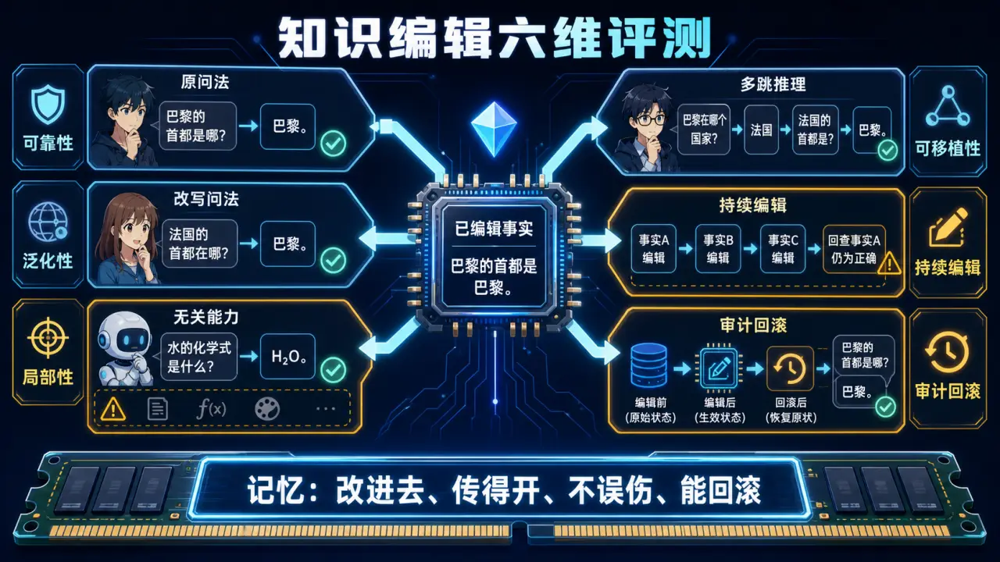
  </a>
</p>
<p align="center"><sub>🧠 图解记忆：知识编辑不仅要改进去，还要在改写和多跳中传得开、不误伤无关能力、连续编辑不退化并且能够审计回滚；点击图片可查看原图。</sub></p>
<details>
<summary>💡 答案要点</summary>

**不能只测原问题的命中率。** 一次合格编辑至少要同时回答“改进去了吗、能迁移吗、误伤了吗、能用于推理吗”。

| 维度 | 要回答的问题 | 示例测试 |
|------|--------------|----------|
| **可靠性 / Efficacy** | 目标提示是否输出新事实 | 原始模板、不同解码设置 |
| **泛化性 / Generality** | 换一种问法还能否召回 | 同义改写、不同上下文 |
| **局部性 / Locality** | 无关事实和通用能力是否保持 | 邻近实体、随机知识、通用基准 |
| **可移植性 / Portability** | 新事实能否进入相关推理链 | 一跳属性、多跳问答、组合推理 |
| **持续性 / Scalability** | 连续或批量编辑后是否退化 | 不同编辑数量和顺序的曲线 |
| **运维性** | 能否审计、回滚和复现 | 权重差分、编辑日志、版本化评测集 |

**最小实验设计：**

1. 为每条事实准备原问法、改写问法、邻近事实和多跳问题；
2. 编辑前保存基线，编辑后逐项比较；
3. 对不同编辑数量、顺序和随机种子重复实验；
4. 单独报告目标成功率与能力保持率，不用一个总分掩盖误伤；
5. 人工抽查“答案对但理由仍使用旧知识”的样本。

CounterFact 适合评估反事实编辑的成功与局部性，MQuAKE 强调编辑后的知识能否参与多跳推理。高直接命中、低多跳准确率通常意味着模型只是学会了局部输出映射，还没有稳定传播新事实。

**参考资料：**

- [CounterFact / ROME 论文](https://arxiv.org/abs/2202.05262)
- [MQuAKE：Assessing Knowledge Editing in Language Models via Multi-Hop Questions](https://arxiv.org/abs/2305.14795)

</details>

### Q24: 如何把强推理模型的能力蒸馏到小模型？为什么不能只收集长思维链做 SFT？

<p align="center">
  <a href="../../assets/illustrations/07-model-training/q24-reasoning-distillation.webp">
    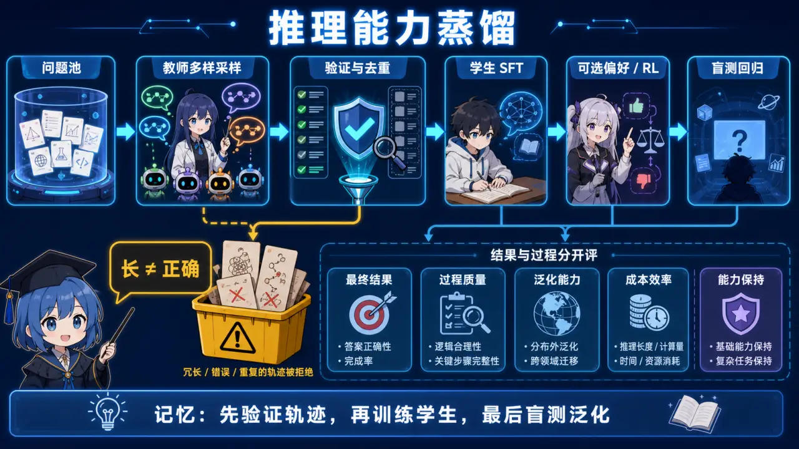
  </a>
</p>
<p align="center"><sub>🧠 图解记忆：教师先多样采样，验证器过滤错误与冗余轨迹，再训练学生并用结果、过程、泛化、成本和能力保持做盲测；点击图片可查看原图。</sub></p>
<details>
<summary>💡 答案要点</summary>

**30 秒回答：**

推理蒸馏通常让教师对同一问题生成多个候选轨迹，用规则、执行器或验证器筛出正确且有信息量的样本，再对学生做 SFT 或与偏好/RL 结合。只收集很长的思维链会把教师的错误、冗余和表达习惯一并复制；学生也可能学会“像在推理”的格式，而不是获得可泛化的推理能力。

```
问题池 → 教师多样采样 → 结果/过程验证 → 去重与难度分层
      → 学生 SFT → 可选偏好或 RL → 盲测与能力回归
```

**数据阶段：**

- 按数学、代码、逻辑和通用任务分层，训练集与评测集做语义去重；
- 对每题生成多个候选，保留最终答案可验证、过程自洽且不过度冗长的轨迹；
- 数学用符号或数值验证器，代码用编译和测试，开放问答用多评审加人工抽检；
- 保留部分失败轨迹做偏好对或过程监督，但不能把未标注错误轨迹当正样本。

**评估阶段：**

| 层次 | 指标与检查 |
|------|------------|
| 最终结果 | Exact Match、pass@1、pass@k、单元测试通过率 |
| 过程质量 | 步骤有效率、验证器通过率、错误定位、人工抽检 |
| 泛化能力 | 未见题型、不同表达、难度分层、多语言迁移 |
| 代价 | 输出 Token、延迟、显存和每题成本 |
| 能力保持 | 通用问答、安全、指令遵循回归集 |

**关键取舍：** 更长轨迹可能提升监督信号，也会增加训练成本和错误暴露；教师最偏好的轨迹未必最适合当前学生。应比较“答案监督”“完整轨迹监督”“压缩轨迹监督”和“轨迹 + 偏好/RL”基线，而不是预设长 CoT 一定最好。

**合规边界：** 使用第三方 API 输出做蒸馏前，必须检查模型许可和服务条款。技术流程相同不代表授权状态相同。

**参考资料：**

- [DeepSeek-R1 论文](https://arxiv.org/abs/2501.12948)
- [DeepSeek-R1 官方仓库](https://github.com/deepseek-ai/DeepSeek-R1)
- [《动手学大模型》数学推理实验与课件索引](../references/dive-into-llms-reading-list.md#4-数学推理蒸馏高优先级)

</details>

---

## 八、推理模型训练进阶

### Q25: RLVR（可验证奖励强化学习）是什么？为什么它能催生推理能力？

<p align="center">
  <a href="../../assets/illustrations/07-model-training/q25-rlvr.webp">
    
  </a>
</p>
<p align="center"><sub>🧠 图解记忆：RLVR 用确定性验证器替代 RM——答案对错能自动判，无需人类标注；点击图片可查看原图。</sub></p>
<details>
<summary>💡 答案要点</summary>

**RLVR = Reinforcement Learning with Verifiable Rewards（可验证奖励强化学习）**

核心思想：**当答案的正确性可以被程序或规则自动验证时，不需要训练独立的 Reward Model（RM），直接用验证器给出的确定性反馈作为奖励。**

```
RLHF 路径：
  生成回答 → 奖励模型(RM)打分 → PPO 更新策略
             ↑
        RM 是神经网络，可能有偏见

RLVR 路径：
  生成回答 → 验证器(Verifier)判定 → GRPO/DPO 更新策略
             ↑
        Verifier 是规则/编译器/求解器，确定性输出
```

**可验证领域及验证方式：**

| 领域 | 验证器类型 | 示例 |
|------|------------|------|
| **数学** | 符号计算引擎（SymPy、MathVerify） | `sympy.solve("2x+3=7") == 2` |
| **代码** | 沙箱执行 + 测试用例 | 运行代码，检查输出是否通过所有 test case |
| **逻辑推理** | 规则引擎 / SAT solver | 检查推理链的逻辑一致性 |
| **科学计算** | 数值校验 + 单位分析 | 检查量纲和单位转换是否正确 |

**DeepSeek R1 的两条路线（RLVR 经典案例）：**

| 路线 | SFT 阶段 | RLVR 阶段 | 特点 |
|------|----------|-----------|------|
| **R1-Zero** | ❌ 无（纯预训练模型） | ✅ GRPO + RLVR | 模型自涌现 CoT 推理行为 |
| **R1** | ✅ 有（800K SFT 数据冷启动） | ✅ GRPO + RLVR | 格式规范，可读性强 |

**R1-Zero 的关键发现：** 即使完全跳过 SFT，仅用 RLVR 在数学/代码/逻辑任务上训练，模型也会自发涌现出 Chain-of-Thought 推理模式——包括自我反思、多路径探索、分步验证等复杂行为。这被称为 **"Aha moment"**。

**RLVR 的工程优势：**

| 维度 | RLVR | RLHF |
|------|------|------|
| **数据标注成本** | 几乎为零（规则验证器） | 高（需人工标注偏好对） |
| **系统复杂度** | 低（省掉 RM 训练） | 高（RM + PPO 两个系统） |
| **扩展性** | 高（每加一个任务只需新写验证器） | 中（每个新领域都要重新标偏好数据） |
| **适用场景** | 可验证任务（数学、代码、逻辑） | 主观判断任务（风格、安全、有用性） |
| **局限性** | 无法处理开放问答等不可验证任务 | 通用但成本高 |

**面试话术：**
> "RLVR 是推理模型时代的标配。它的核心洞察是：不是所有对齐都需要人类标注——当你能用代码跑通测试用例时，你根本不需要奖励模型。DeepSeek R1 的成功证明了两件事：一是 RL 可以自涌现推理能力（R1-Zero），二是 SFT 冷启动能让涌现更可控（R1）。实际工程中，先用 RLVR 做推理增强，再用 DPO 或 RLHF 做一般性偏好对齐，是目前最主流的混合路线。"

</details>

---

### Q26: Post-Training 主流流水线路线有哪些？如何选择 SFT→DPO 还是 SFT→GRPO？

<p align="center">
  <a href="../../assets/illustrations/07-model-training/q26-post-training-pipeline.webp">
    
  </a>
</p>
<p align="center"><sub>🧠 图解记忆：从 SFT→RM→PPO 三阶段一路简化，核心趋势是让工程链路越来越短；点击图片可查看原图。</sub></p>
<details>
<summary>💡 答案要点</summary>

**主流 Post-Training 路线一览：**

| 路线图 | 阶段 | 典型代表 | 适用场景 | 计算成本 |
|--------|------|----------|----------|----------|
| **经典三路** | SFT → RM → PPO | ChatGPT, Claude早期 | 通用对话对齐 | 最高（4个模型同时加载） |
| **DPO简化** | SFT → DPO | Zephyr, Meta-Llama-Chat | 通用偏好对齐 | 低（只需1个模型） |
| **RLVR推理** | SFT → GRPO + RLVR | DeepSeek-R1, Qwen-Math | 推理能力增强 | 中高（需要大量 rollouts） |
| **ORPO一体** | ORPO（SFT+偏好合一） | Zephyr-7B | 资源受限 + 通用对齐 | 最低 |
| **混合路线** | SFT → RLVR → DPO | Tülu 3, Mixtral-Instruct | 推理 + 通用对齐兼顾 | 中高 |

**选择决策树：**

```
你的目标是什么？
├── 让模型学会指令跟随格式 → SFT 就够了（不需要对齐）
│
├── 提升对话质量和有用性 → 
│   ├── 资源充足 → SFT → DPO（稳定、效果好）
│   └── 资源紧张 → ORPO（一步到位，省一次训练）
│
├── 增强推理能力（数学/代码/逻辑）→
│   └── SFT → GRPO + RLVR（唯一已验证的路径）
│
└── 既要推理又要通用对齐 →
    └── SFT → RLVR → DPO（Tülu 3 路线）
```

**关键选型考量：**

1. **任务性质：** 可验证任务（数学/代码）首选 RLVR；主观偏好（风格、安全）首选 DPO/ORPO
2. **资源预算：** GRPO 需要大量 rollout 采样（DeepSeek R1 每一步 32 个问题 × 8 个回复 = 256 样本），显存需求高于 DPO
3. **数据可用性：** DPO 需要高质量的偏好对（good vs bad），如果没有标注数据可以用 Rule-based rejection sampling 自动生成
4. **工程复杂度：** DPO 实现简单（一个 Trainer 类），RLVR 需要维护验证器系统、rollout 调度、奖励聚合

**常见误区：**

- **不要试图用 DPO 提升推理能力。** DPO 只能对齐既有分布内的样本，不能激发新的推理能力。想提升数学/代码推理，必须走 RLVR 路线。
- **不要忽视 SFT 质量。** SFT 的质量决定了后续所有阶段的天花板。垃圾进，垃圾出的对齐毫无意义。
- **不要盲目追求最长路线。** SFT → RLVR → DPO 不一定优于 SFT → DPO。如果任务不包含推理需求，额外的 RLVR 阶段只是在浪费算力。

**面试话术：**
> "我的选型原则很简单：先看任务性质。如果是让模型回答更好听（风格、安全），选 DPO 就够了；如果要让它推理更强（数学、代码、规划），必须走 GRPO + RLVR 路线。大多数工业场景其实是混合需求——先用 RLVR 把推理能力拉上去，再用 DPO 把风格和安全性对齐回来。"

</details>

---

### Q27: RL 训练中常见的训练不稳定问题有哪些？如何排查和解决？

<p align="center">
  <a href="../../assets/illustrations/07-model-training/q27-rl-training-debug.webp">
    
  </a>
</p>
<p align="center"><sub>🧠 图解记忆：训练不稳先从 KL、reward、loss 三条曲线定位；KL 爆炸管约束，reward 异常查验证器，loss 发散看数据；点击图片可查看原图。</sub></p>
<details>
<summary>💡 答案要点</summary>

**RL 训练是后训练中最不稳定的阶段之一，三大常见问题：**

#### 1. KL 散度爆炸（KL Divergence Blowup）

**症状：** KL(policy || reference) 迅速增长超过阈值（通常 > 0.01），policy 严重偏离参考模型

**根因：**
- β 参数太小（KL 惩罚不够强）
- 学习率太高，单步更新幅度大
- 验证器给出的奖励信号过强（reward scale 太大）

**解决方案：**

```python
# 调试步骤
# Step 1: 监控 KL 值
kl = torch.mean((log_prob_policy - log_prob_ref).detach())
print(f"Step {step}: mean_reward={reward:.3f}, kl={kl:.4f}")

# Step 2: 降低 β（加大 KL 惩罚）
beta = 0.04  # 从默认 0.1 提高到 0.04（惩罚更强）

# Step 3: 降低学习率
lr = 1e-6  # 从 1e-5 降到 1e-6

# Step 4: 减少 rollout 数量（每组采样数从 8 降到 4）
group_size = 4
```

**经验法则：** KL 值应该保持在 0.01~0.05 之间。低于 0.01 说明没有学到新东西，高于 0.1 说明失控了。

#### 2. 奖励黑客（Reward Hacking / Advantage Gaming）

**症状：** 模型学习到取巧策略来获得高分，而非真正改进能力。例如：总是输出长答案以获得长度奖励、对每个问题都回答"safety first"以触发安全奖励。

**根因：**
- 奖励函数设计有漏洞（如用输出长度作为质量代理）
- 验证器存在边界情况（edge cases）未被覆盖
- 模型找到了一种"捷径"绕过真实意图

**诊断方法：**
```python
# 检查响应多样性是否下降
response_lengths = [len(resp) for resp in recent_rollouts]
print(f"Response length std: {np.std(response_lengths):.1f}")
# 如果标准差急剧下降，可能出现了模式坍缩

# 检查特殊 token 频率是否异常升高
for special_token in ["sorry", "as an AI"]:
    freq = sum(token in resp.lower() for resp in recent_rollouts) / len(recent_rollouts)
    print(f"{special_token} frequency: {freq:.1%}")
```

**解决方案：**
- **修正奖励函数：** 添加对抗样本惩罚（adversarial penalty），确保取巧策略无法获得高分
- **引入 format reward：** 不仅看结果正确性，也评估推理过程的结构和质量
- **增加环境覆盖率：** 在奖励设计中覆盖更多边界情况和对抗场景
- **响应多样性检查：** 定期评估采样输出的分布是否退化为单一模式

#### 3. 训练 loss 不收敛 / 震荡

**症状：** Loss 持续震荡不下降，或在某一步骤突然飙升

**根因：**
- **梯度爆炸：** 验证器给极端高的奖励值导致 advantage 过大
- **数据泄漏：** rollout 生成的数据混入了训练集又反过来影响采样
- **Reference model 太旧：** 长时间不更新 reference，导致重要性采样比率方差过大

**解决方案：**

```python
# 1. Gradient clipping（如果还没开启）
gradient_clip = 1.0

# 2. 定期替换 reference model
if step % 400 == 0:  # DeepSeek R1 的做法
    reference_model = policy_model.state_dict().copy()

# 3. 限制 reward range
advantage = rewards - baseline
advantage = torch.clamp(advantage, min=-3.0, max=3.0)  # 裁剪极端值

# 4. 减少 rollout 中的 inner epoch 数
# （不要在同一批 rollout 上多次迭代训练）
num_inner_epochs = 1  # 设为 1，避免 overfitting 到同一批数据
```

**综合排查清单：**

| 监控指标 | 正常范围 | 危险信号 |
|---------|----------|----------|
| KL(policy\|\|ref) | 0.01 ~ 0.05 | > 0.1 |
| Mean reward | 平稳上升 | 突增后暴跌 |
| Response diversity | 保持变化 | 所有回复几乎相同 |
| Gradient norm | < 5.0 | > 10.0 |
| Loss | 逐渐下降 | 震荡 / 飙升 |

**面试话术：**
> "RL 训练调试的核心思路就是'看三条线'：KL 曲线决定是否偏过多，reward 曲线反映信号质量，loss 曲线暴露梯度问题。我的经验是先固定 KL 在合理范围内，再逐步放开 reward 信号的强度。遇到奖励黑客，不要只修模型——要先审查验证器的边界条件。最后记住一句话：RL 训练不是调参游戏，是系统工程。好的 experiment tracking（W&B、MLflow）比盲目调 β 重要得多。"

</details>

---

### Q28: 拒绝采样（Rejection Sampling Fine-tuning）的原理是什么？它与 DPO/GRPO 的区别？

<p align="center">
  <a href="../../assets/illustrations/07-model-training/q28-rejection-sampling.webp">
    
  </a>
</p>
<p align="center"><sub>🧠 图解记忆：拒绝采样就是"生成一堆、挑出最好的、拿去训"；比 DPO 简单但比 SFT 强；点击图片可查看原图。</sub></p>
<details>
<summary>💡 答案要点</summary>

**拒绝采样 = Rejection Sampling Fine-tuning（RSFT）**

本质上是"**多轮 self-improvement**"循环：

```
第 N 轮 SFT 模型
     ↓
对每个 prompt 生成 K 个回答（如 K=8）
     ↓
用验证器/RM 筛选出最好的 M 个（如 M=2）
     ↓
用筛选后的数据做下一轮 SFT
     ↓
得到第 N+1 轮更好的模型
```

**核心区别对比：**

| 特性 | 拒绝采样 | DPO | GRPO + RLVR |
|------|----------|-----|-------------|
| **是否需要偏好对** | 不需要（只需好坏过滤） | 需要（chosen/rejected 配对） | 不需要（组内相对排序） |
| **训练范式** | 监督学习（SFT） | 偏好优化（分类损失） | 强化学习（策略梯度） |
| **能否激发新能力** | 否（只在已有分布内学习） | 否（同上） | 是（RL 探索可触发涌现） |
| **工程复杂度** | 极低 | 低 | 高 |
| **数据利用率** | 低（丢弃大部分采样） | 中（每对贡献一个梯度） | 高（每个 rollout 都有梯度信号） |
| **计算效率** | 中（需要多轮迭代） | 高（单次训练即可） | 低（大量 rollout 采样） |

**拒绝采样的关键细节：**

**1. 采样温度策略：**
```python
# 第一层：高温度（temperature=0.9）生成多样候选
candidates = model.generate(prompt, temperature=0.9, top_p=0.95, num_return_sequences=8)

# 第二层：只对评分最高的样本使用低温度重新生成（精炼）
best_candidates = filter_and_rank(candidates, verifier)
polished = [model.generate(c, temperature=0.3) for c in best_candidates]
```

**2. 迭代轮次设计：**
```
Iteration 1: 模型A(SFT基线) → 采样筛选 → 模型B(DPO/SFT)
Iteration 2: 模型B → 更精细筛选 → 模型C(更高质量)
Iteration 3: 模型C → 加入 human-in-the-loop 审核 → 最终发布
```

**3. 何时用拒绝采样 vs DPO：**

| 场景 | 推荐方案 | 原因 |
|------|----------|------|
| 只有验证器（无法生成 bad 样例） | 拒绝采样 | 只需选出好的，不需要构造差的 |
| 偏好数据充足 | DPO | 利用全部信息更高效 |
| 推理能力增强 | GRPO + RLVR | 只有 RL 能激发涌现 |
| 资源有限且快速迭代 | 拒绝采样 + SFT | 最简单，见效快 |

**与 RLVR 的关系：**

拒绝采样常作为 RLVR 的前置步骤：
```
拒绝采样生成高质量推理轨迹 → SFT 训练冷启动 → GRPO + RLVR 进一步提升
```
这就是 DeepSeek-R1 的实际流程（R1-Zero 之后加了一步 SFT 蒸馏）。

**面试话术：**
> "拒绝采样是最朴素的 Self-Improvement 方法——先生成、筛选、再训练。它最大的优点是极其简单：不需要偏好对，不需要 RL 框架，甚至不需要奖励模型（规则验证器就能筛）。但它也有明显的上限：只能在模型已有能力范围内选优，无法激发真正的推理涌现。所以工业实践中，拒绝采样往往作为冷启动手段，后面再接 DPO 或 RLVR 来进一步拔高。"

</details>

---

### Q29: 在线训练闭环（Online Training Loop）如何让模型持续进化？

<p align="center">
  <a href="../../assets/illustrations/07-model-training/q29-online-training-loop.webp">
    
  </a>
</p>
<p align="center"><sub>🧠 图解记忆：模型上线不是终点，而是新一轮数据的起点；线上反馈驱动数据闭环；点击图片可查看原图。</sub></p>
<details>
<summary>💡 答案要点</summary>

**在线训练闭环 = 模型部署 → 收集线上反馈 → 构建训练数据 → 再训练 → 再部署的持续迭代循环。**

核心理念：**模型上线不是终点，而是新一轮数据的起点。**

#### 闭环的四个关键模块：

**1. 数据采集（Observability）**

```
线上交互日志
  ├── 用户评分（thumbs up/down）
  ├── 编辑行为（用户修改了模型回答）
  ├── 引用点击（用户是否查看了引用）
  ├── 工具调用成功率
  ├── 对话完成率
  └── Badcase 标注入口
```

**2. Badcase 挖掘与优先级排序**

```python
# 从海量线上数据中找出需要改进的样本
def prioritize_badcases(logs):
    candidates = []
    
    for log in logs:
        score = 0
        # 用户点踩
        if log.user_feedback == "down": score += 3
        # 用户手动编辑了回答
        if log.edited_by_user: score += 2
        # 对话在第2句就终止了
        if log.turn_count <= 2: score += 1
        # 低置信度回答被采纳
        if log.model_confidence < 0.3: score += 1
        
        if score >= 3:
            candidates.append(log)
    
    # 按分数降序，优先处理最严重的问题
    return sorted(candidates, key=lambda x: x.score, reverse=True)
```

**3. 数据闭环的质量保障**

| 环节 | 方法 | 说明 |
|------|------|------|
| **去重** | Embedding 相似度去重 + 精确匹配 | 避免重复训练 |
| **防泄漏** | 时间线切分 | 确保评测集不会被污染 |
| **质量审计** | 抽检 + 自动化规则检查 | 防止脏数据进入训练集 |
| **标注一致性** | 多人标注 + Cohen's kappa > 0.8 | 保证偏好数据可靠 |

**4. 训练与评估**

```
Badcase 数据集
    ↓
数据清洗 + 增强
    ↓
模型训练（SFT/DPO/GRPO）
    ↓
离线评估（vs 基线）
    ├── 任务准确率 ≥ 基线 + X%？
    ├── 通用能力退化 ≤ Y%？
    └── 安全红线未触碰？
    ↓
    ├── 全通过 → A/B 测试 → 全量上线
    └── 任一不通过 → 退回数据环节
```

#### 工程实践建议：

**1. 版本化管理：**
- 每次迭代的模型和数据集都打上版本标签
- 保留至少 3 个历史版本的 checkpoint（方便回滚）
- 记录每次迭代的 hyperparameters 和 eval metrics

**2. 增量训练策略：**
- **冷启动：** 全新数据集从头训练
- **增量微调：** 仅用新产生的 badcase + 少量通用数据（20%混合比例）
- **知识遗忘防范：** 定期插入通用基准数据，维持模型通用能力

**3. A/B 测试规范：**
- 线上分流比例从 5% 逐步扩大到 100%
- 核心指标对比窗口 ≥ 7 天
- 设置明确的 rollback 阈值（如核心指标下降 > 3% 自动回滚）

#### 与拒绝采样的关系：

在线闭环是拒绝采样的高级形态：
```
拒绝采样：离线多轮循环，数据规模受控
在线闭环：持续从线上获取真实反馈，数据流不间断，规模更大更难管理
```

**面试话术：**
> "我觉得很多工程师面试会卡在这个问题上——以为训练完上线就结束了。实际上模型上线才是开始。好的团队一定有在线数据闭环：线上收集用户真实反馈，自动挖掘 badcase，经过清洗审核后喂给下一次训练。我之前的项目里，我们每周产出一个新版本模型，核心指标持续提升。关键是做好版本管理和 A/B 测试规范，别让迭代变成盲盒抽奖。"

</details>

---

## 📝 更新记录

| 日期 | 更新内容 |
|------|----------|
| 2026-09-01 | 新增 Q25-Q29：RLVR原理与DeepSeek-R1路线、Post-Training流水线选型、RL训练不稳定排查、拒绝采样与DPO/GRPO对比、在线训练闭环 |
| 2026-05-07 | 新增 Q14 DAPO/GSPO（GRPO进化版）、Q15 信用分配问题 |
| 2026-04-15 | 新增 Q13 TRL v1.0（75+后训练方法、chaos-adaptive设计哲学） |
| 2026-03-05 | 新增大模型微调与训练面试题 11 道 |


---

**上一模块：** [向量索引优化](../06-vector-index-optimization/)
**下一模块：** [推理优化](../08-inference-optimization/)

---

[返回目录 →](../../README.md)
