# ⚡ LLM 推理优化面试题

> **面试优先顺序（通用 AI 应用开发岗位）**：Q2、Q3、Q5、Q6、Q7、Q8、Q9、Q10、Q11、Q13、Q16。其余题目用于进阶或特定岗位拓展；实际频率会随岗位和面试轮次变化，产品版本资讯不应当作通用必考题。

> **难度：** ⭐⭐⭐⭐⭐
> **更新：** 2026-03-05
> **考点：** KV Cache、量化、推理加速、部署优化

## 📋 目录

1. [推理基础](#一推理基础)
2. [KV Cache优化](#二kv-cache优化)
3. [模型量化](#三模型量化)
4. [推理加速](#四推理加速)

## 一、推理基础

### Q1: LLM 推理和训练有什么区别？为什么推理更难优化？

<p align="center">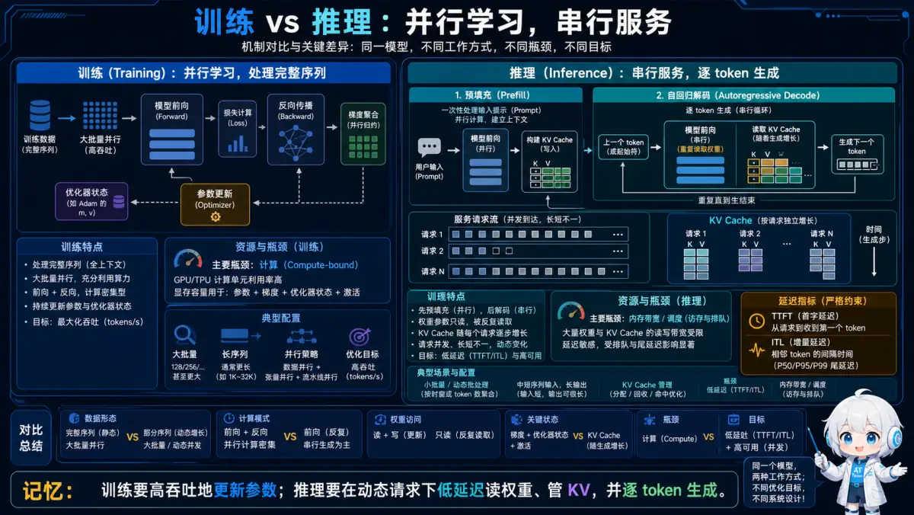</p>
<p align="center"><sub>🧠 记忆锚点：训练要高吞吐地更新参数；推理要在动态请求下低延迟读权重、管 KV，并逐 token 生成。</sub></p>
<details>
<summary>💡 答案要点</summary>

**核心区别：**

| 维度 | 训练 | 推理 |
|------|------|------|
| **计算模式** | 并行（整句） | 串行（逐token） |
| **瓶颈** | 计算（FLOPs） | 内存带宽（I/O） |
| **批处理** | 大（128-1024） | 小（1-32） |
| **延迟要求** | 不敏感 | 极度敏感（<1s） |
| **显存占用** | 模型+梯度+优化器 | 模型+KV Cache |

**为什么推理难优化？**

1. **自回归生成是串行的**
   ```
   训练：一次性处理整个句子
   "今天天气真好" → 并行计算所有token

   推理：一个个生成token
   "今天" → "天气" → "真" → "好" （必须串行）
   ```

2. **内存带宽瓶颈（Memory-bound）**
   ```
   每生成1个token：
   - 需要加载整个模型参数（7B = 14GB）
   - 计算量很小（几十 GFLOPS）
   - GPU 利用率 < 10%

   问题：GPU 算力浪费，等待内存加载
   ```

3. **KV Cache 增长**
   ```
   上下文越长，KV Cache 越大
   4K 上下文：1GB
   128K 上下文：32GB

   显存炸了！
   ```

**性能对比（7B 模型，A100 GPU）：**

| 场景 | 吞吐量 | GPU 利用率 |
|------|--------|------------|
| 训练 | 1000 tokens/s | 80-90% |
| 推理（batch=1） | 50 tokens/s | 5-10% |
| 推理（batch=32） | 800 tokens/s | 40-50% |

**面试话术：**
> "推理的核心挑战是内存带宽瓶颈。训练是计算密集型，推理是访存密集型。优化思路完全不同：训练优化算法，推理优化内存访问。"

</details>

### Q2: 什么是自回归生成？Prefill 和 Decode 有什么区别？

<p align="center">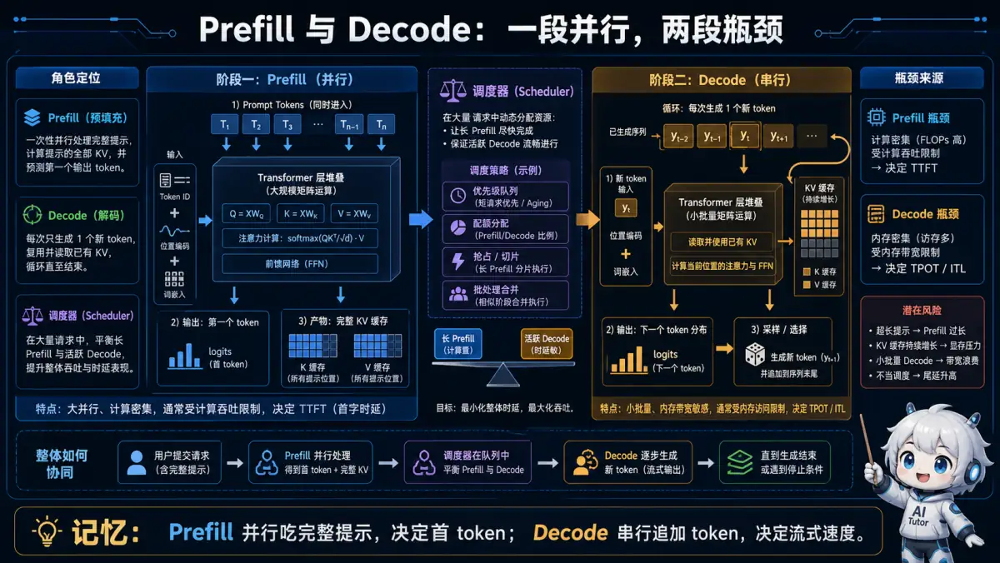</p>
<p align="center"><sub>🧠 记忆锚点：Prefill 并行吃完整提示，决定首 token；Decode 串行追加 token，决定流式速度。</sub></p>
<details>
<summary>💡 答案要点</summary>

**自回归生成 = 逐个生成 token，每个 token 依赖前面所有 token**

**两个阶段：**

```
┌─────────────────────────────────────────────────────────┐
│                  LLM 推理两阶段                          │
└─────────────────────────────────────────────────────────┘

Prefill（预填充）阶段：
  输入：用户提示词（如 1000 tokens）
  输出：第一个生成 token
  特点：并行计算，计算密集

Decode（解码）阶段：
  输入：已生成的 tokens
  输出：下一个 token
  特点：串行生成，访存密集
```

**详细对比：**

| 维度 | Prefill | Decode |
|------|---------|--------|
| **计算模式** | 并行（整个 prompt） | 串行（一个 token） |
| **计算量** | 大（O(n²)） | 小（O(n)） |
| **瓶颈** | 计算（Compute-bound） | 内存（Memory-bound） |
| **GPU 利用率** | 高（80-90%） | 低（5-15%） |
| **延迟** | 一次性（200-500ms） | 累积（每个 20-50ms） |
| **KV Cache** | 生成 | 复用 |

**示例（生成 "今天天气真好"）：**

```
输入："请用5个字描述今天的天气"（15 tokens）

Prefill 阶段：
  输入：整个 prompt（15 tokens）
  计算：一次性算出所有 token 的 KV
  输出："今"
  时间：200ms

Decode 阶段：
  循环5次：
    输入："今" → 输出："天"（50ms）
    输入："今天" → 输出："天"（50ms）
    输入："今天天" → 输出："气"（50ms）
    输入："今天天气" → 输出："真"（50ms）
    输入："今天天气真" → 输出："好"（50ms）
  总时间：250ms

总延迟：200ms + 250ms = 450ms
```

**优化策略：**

| 阶段 | 优化方向 | 技术 |
|------|----------|------|
| **Prefill** | 提升计算效率 | FlashAttention、Tensor并行 |
| **Decode** | 减少内存访问 | KV Cache量化、PagedAttention |

**面试话术：**
> "Prefill 是一次性算完 prompt，Decode 是逐个生成。Prefill 吃算力，Decode 吃带宽。优化重点完全不同。"

</details>

## 二、KV Cache优化

### Q3: 什么是 KV Cache？为什么需要它？

<p align="center">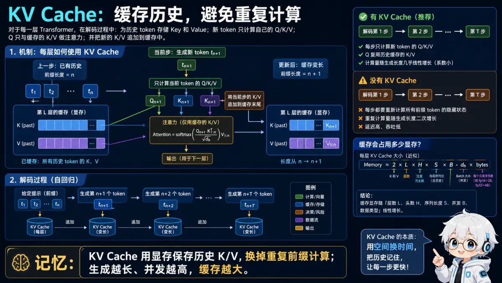</p>
<p align="center"><sub>🧠 记忆锚点：KV Cache 用显存保存历史 K/V，换掉重复前缀计算；生成越长、并发越高，缓存越大。</sub></p>
<details>
<summary>💡 答案要点</summary>

**KV Cache = 缓存 Attention 计算的中间结果**

**为什么需要 KV Cache？**

**没有 KV Cache（重复计算）：**
```
生成 token1："今"
  计算 Attention(prompt)

生成 token2："天"
  计算 Attention(prompt + "今")  ← 重复计算了 prompt

生成 token3："气"
  计算 Attention(prompt + "今天")  ← 又重复了

...

问题：每生成一个 token，都要重新计算所有历史的 Attention
时间复杂度：O(n²)，n 是生成长度
```

**有 KV Cache（缓存复用）：**
```
生成 token1："今"
  计算 Attention(prompt)，缓存 KV

生成 token2："天"
  只计算 "今" 的 KV，复用 prompt 的 KV Cache

生成 token3："气"
  只计算 "天" 的 KV，复用之前的 KV Cache

...

优化：每个 token 只计算一次
时间复杂度：O(n)
```

**数学原理：**
```
Attention(Q, K, V) = softmax(QK^T / √d) V

生成第 t 个 token：
  Q_t：当前 token 的 Query
  K_{1:t-1}：历史所有 token 的 Key（从 Cache 读取）
  V_{1:t-1}：历史所有 token 的 Value（从 Cache 读取）

只需计算：
  K_t, V_t：当前 token 的 KV（新计算）
  然后拼接到 Cache
```

**性能对比（生成 100 tokens）：**

| 方案 | 总计算量 | 延迟 |
|------|----------|------|
| 无 Cache | 5050 次 Attention | 25s |
| 有 Cache | 100 次 Attention | 5s |
| **加速比** | **50x** | **5x** |

**KV Cache 显存占用：**
```
单个 token 的 KV 大小：
  K: [num_layers, num_heads, head_dim]
  V: [num_layers, num_heads, head_dim]

示例（Llama 7B）：
  层数：32
  头数：32
  头维度：128
  精度：FP16（2 bytes）

  单 token KV = 2 × 32 × 32 × 128 × 2 = 524KB
  4K 上下文 = 524KB × 4096 = 2GB
  128K 上下文 = 524KB × 131072 = 64GB
```

**面试话术：**
> "KV Cache 是用空间换时间的经典案例。不用 Cache，每个 token 要重新计算所有历史，O(n²) 复杂度。用了 Cache，复用历史结果，降到 O(n)。代价是显存占用大，长上下文会炸显存。"

</details>

### Q4: KV Cache 量化是什么？如何实现？

<p align="center">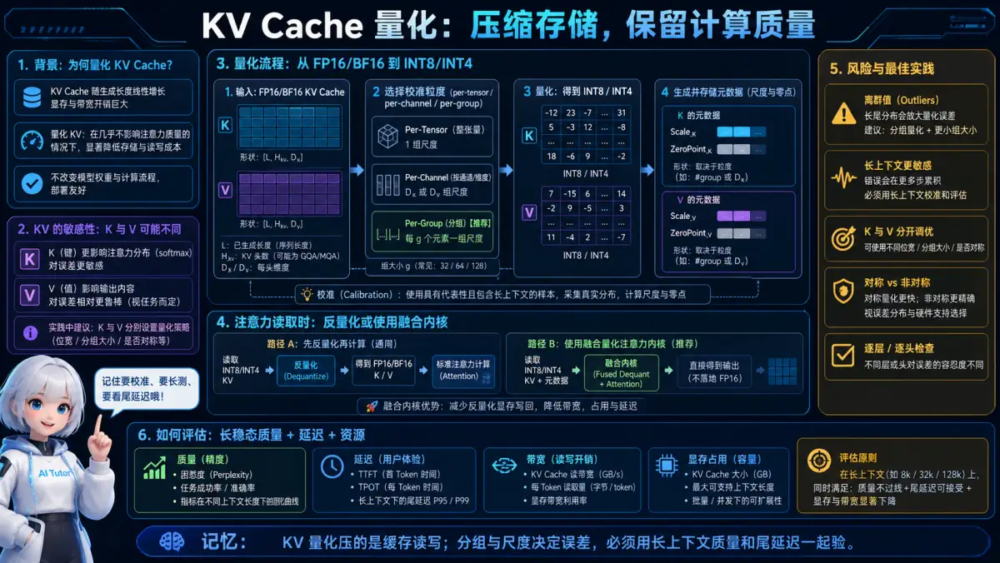</p>
<p align="center"><sub>🧠 记忆锚点：KV 量化压的是缓存读写；分组与尺度决定误差，必须用长上下文质量和尾延迟一起验。</sub></p>
<details>
<summary>💡 答案要点</summary>

**KV Cache 量化 = 用低精度存储 KV Cache**

**核心思想：** KV Cache 占显存太多，用 INT8/INT4 代替 FP16

**精度对比：**

| 精度 | 每个值占用 | 4K 上下文占用（7B 模型） |
|------|------------|--------------------------|
| FP16 | 2 bytes | 2GB |
| INT8 | 1 byte | 1GB（节省 50%） |
| INT4 | 0.5 byte | 0.5GB（节省 75%） |

**量化方法：**

**1. 对称量化（Symmetric Quantization）：**
```python
# 量化
scale = max(abs(tensor)) / 127
quantized = round(tensor / scale).clamp(-128, 127).to(int8)

# 反量化
dequantized = quantized.to(float16) * scale
```

**2. 非对称量化（Asymmetric Quantization）：**
```python
# 量化
min_val = tensor.min()
max_val = tensor.max()
scale = (max_val - min_val) / 255
zero_point = round(-min_val / scale)
quantized = round(tensor / scale + zero_point).clamp(0, 255).to(uint8)

# 反量化
dequantized = (quantized.to(float16) - zero_point) * scale
```

**3. 分组量化（Group-wise Quantization）：**
```python
# 问题：全局量化精度损失大
# 解决：分组量化，每组独立 scale

# 将 tensor 分成 N 组
groups = tensor.reshape(N, -1)

# 每组独立量化
for i, group in enumerate(groups):
    scale[i] = group.abs().max() / 127
    quantized[i] = round(group / scale[i])
```

**KV Cache 的特殊性：**

| 特点 | 影响 | 解决方案 |
|------|------|----------|
| **动态性** | 每个 token 都在变 | 动态量化 |
| **异常值** | 某些通道值特别大 | Per-channel 量化 |
| **Key vs Value** | Key 对精度更敏感 | Key用INT8，Value用INT4 |

**实现示例（Per-channel INT8）：**
```python
class KVCacheQuantizer:
    def quantize_kv(self, k, v):
        # Key: per-channel INT8（精度要求高）
        k_scale = k.abs().max(dim=-1, keepdim=True)[0] / 127
        k_quant = (k / k_scale).round().clamp(-128, 127).to(torch.int8)

        # Value: per-token INT4（可以更激进）
        v_scale = v.abs().max(dim=-1, keepdim=True)[0] / 7
        v_quant = (v / v_scale).round().clamp(-8, 7).to(torch.int8)

        return k_quant, k_scale, v_quant, v_scale

    def dequantize_kv(self, k_quant, k_scale, v_quant, v_scale):
        k = k_quant.to(torch.float16) * k_scale
        v = v_quant.to(torch.float16) * v_scale
        return k, v
```

**精度损失评估（Llama 7B，MT-Bench）：**

| 方案 | 显存节省 | 困惑度增加 | 任务准确率下降 |
|------|----------|------------|----------------|
| FP16 | 0% | 0 | 0% |
| INT8（全局） | 50% | +5% | -3% |
| INT8（per-channel） | 50% | +1% | -0.5% |
| INT4（per-channel） | 75% | +8% | -2% |
| 混合（K=INT8, V=INT4） | 60% | +2% | -1% |

**面试话术：**
> **示例表达（仅在能用本人经历或可复现实验佐证时使用）：** "KV Cache 量化是推理优化的关键。我在项目中用 per-channel INT8 量化，显存节省 50%，精度损失不到 1%。核心是处理好异常值，用分组/分通道量化代替全局量化。"

</details>

### Q5: 什么是 PagedAttention？它解决什么问题？

<p align="center">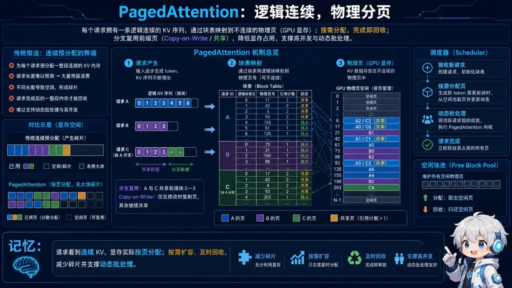</p>
<p align="center"><sub>🧠 记忆锚点：请求看到连续 KV，显存实际按页分配；按需扩容、及时回收，减少碎片并支撑动态批处理。</sub></p>
<details>
<summary>💡 答案要点</summary>

**PagedAttention = 把 KV Cache 分页管理，像操作系统管理内存一样**

**解决的核心问题：KV Cache 碎片化和浪费**

**传统方案的问题：**
```
传统：为每个请求预分配固定大小的 KV Cache

请求1：预估 2K tokens，实际用了 500
  → 浪费 1500 个 token 的空间

请求2：预估 1K tokens，实际用了 1200
  → 超出了，只能截断或重新分配

问题：
1. 预分配浪费空间（平均浪费 30-50%）
2. 长度不确定，要么截断要么OOM
3. 内存碎片化严重
```

**PagedAttention 方案：**
```
┌─────────────────────────────────────────────────────────┐
│                  PagedAttention                          │
└─────────────────────────────────────────────────────────┘

1. 将 KV Cache 分成固定大小的页（Page）
   每页：64 或 128 tokens

2. 动态分配页
   请求需要多少，就分配多少页

3. 页可以不连续
   物理内存：[Page3, Page7, Page2, ...]
   逻辑视图：连续的 KV Cache

4. 共享页（Prefix Sharing）
   多个请求共享相同的 System Prompt
```

**示例（3个请求）：**
```
System Prompt: 500 tokens（所有请求共享）

请求1："翻译：Hello" → 生成 50 tokens
  页分配：[共享页1-4] + [独占页5]

请求2："翻译：World" → 生成 80 tokens
  页分配：[共享页1-4] + [独占页6-7]

请求3："摘要：..." → 生成 200 tokens
  页分配：[共享页1-4] + [独占页8-11]

节省：
  传统：3 × 500 = 1500 tokens（System Prompt）
  PagedAttention：1 × 500 = 500 tokens（共享）
  节省：66%
```

**核心技术：**

**1. 分页存储：**
```python
class PagedKVCache:
    def __init__(self, page_size=64):
        self.page_size = page_size
        self.pages = []  # 物理页池
        self.page_table = {}  # 逻辑地址 → 物理页

    def allocate_page(self):
        if self.free_pages:
            return self.free_pages.pop()
        else:
            page = torch.empty([page_size, hidden_dim])
            self.pages.append(page)
            return len(self.pages) - 1

    def get_kv(self, token_id):
        page_id = token_id // self.page_size
        offset = token_id % self.page_size
        physical_page = self.page_table[page_id]
        return self.pages[physical_page][offset]
```

**2. Copy-on-Write（写时复制）：**
```python
# 共享页在修改时才复制
if page.ref_count > 1:
    new_page = page.copy()
    page.ref_count -= 1
    page = new_page
```

**性能提升（vLLM，实测数据）：**

| 指标 | 传统方案 | PagedAttention | 提升 |
|------|----------|----------------|------|
| **吞吐量** | 100 req/s | 240 req/s | 2.4x |
| **显存利用率** | 40% | 90% | 2.25x |
| **平均延迟** | 800ms | 600ms | 1.3x |

**面试话术：**
> "PagedAttention 借鉴了操作系统的虚拟内存思想。分页管理避免了预分配的浪费，Copy-on-Write 实现了高效共享。vLLM 用它把吞吐量提升了 2.4 倍。"

</details>

## 三、模型量化

### Q6: 模型量化是什么？INT8/INT4/FP8 有什么区别？

<p align="center">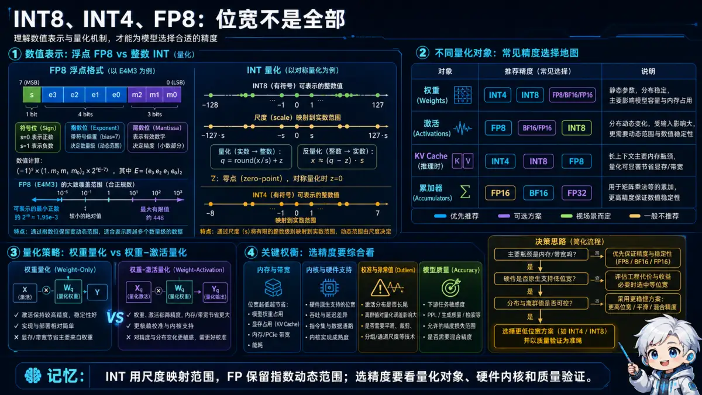</p>
<p align="center"><sub>🧠 记忆锚点：INT 用尺度映射范围，FP 保留指数动态范围；选精度要看量化对象、硬件内核和质量验证。</sub></p>
<details>
<summary>💡 答案要点</summary>

**模型量化 = 用低精度数值表示模型权重和激活**

**为什么量化？**
```
降低显存占用 → 降低带宽需求 → 提升推理速度
```

**精度对比：**

| 数据类型 | 每个值占用 | 表示范围 | 精度 |
|----------|------------|----------|------|
| **FP32** | 4 bytes | ±3.4e38 | 7位有效数字 |
| **FP16** | 2 bytes | ±6.5e4 | 3-4位有效数字 |
| **BF16** | 2 bytes | ±3.4e38 | 2-3位有效数字 |
| **FP8** | 1 byte | ±57000 | 2位有效数字 |
| **INT8** | 1 byte | -128~127 | 整数 |
| **INT4** | 0.5 byte | -8~7 | 整数 |

**显存占用对比（7B 模型）：**

| 精度 | 模型大小 | 节省 |
|------|----------|------|
| FP32 | 28GB | 0% |
| FP16 | 14GB | 50% |
| INT8 | 7GB | 75% |
| INT4 | 3.5GB | 87.5% |

**量化方法：**

**1. 后训练量化（PTQ, Post-Training Quantization）：**
```
优点：无需重新训练，快速
缺点：精度损失较大
适用：INT8 量化

流程：
  训练好的 FP16 模型 → 校准数据集 → 统计分布 → 确定 scale → 量化
```

**2. 量化感知训练（QAT, Quantization-Aware Training）：**
```
优点：精度损失小
缺点：需要重新训练，慢
适用：INT4 量化

流程：
  训练时模拟量化 → 模型学会适应量化误差 → 最终量化
```

**精度类型详解：**

**FP8（浮点8位）：**
```
优势：
  - 保留浮点格式，表示范围大
  - NVIDIA H100/Ada 硬件支持
  - 精度损失小于 INT8

格式：E4M3（4位指数，3位尾数）
  表示范围：±448
  精度：约 2 位有效数字
```

**INT8（整数8位）：**
```
优势：
  - 硬件支持广泛（大部分 GPU）
  - 计算快

量化公式：
  scale = max(|W|) / 127
  W_quant = round(W / scale).clamp(-128, 127)
  W_dequant = W_quant * scale
```

**INT4（整数4位）：**
```
优势：
  - 极致压缩（87.5% 节省）
  - 适合超大模型

挑战：
  - 精度损失大
  - 需要分组量化

方法：GPTQ, AWQ
  每 128 个权重一组
  每组独立 scale
```

**精度对比（Llama 7B，MMLU）：**

| 精度 | 准确率 | 相对 FP16 |
|------|--------|-----------|
| FP16 | 46.8% | 0% |
| FP8 | 46.5% | -0.3% |
| INT8（PTQ） | 45.9% | -0.9% |
| INT8（QAT） | 46.4% | -0.4% |
| INT4（GPTQ） | 44.2% | -2.6% |
| INT4（AWQ） | 45.8% | -1.0% |

**面试话术：**
> **示例表达（仅在能用本人经历或可复现实验佐证时使用）：** "量化是推理优化的核心。FP8 需要新硬件但精度好，INT8 兼容性好，INT4 压缩率高。我在项目中用 INT8 PTQ，显存降了 50%，准确率只降 1%。"

</details>

### Q7: GPTQ、AWQ 是什么？它们有什么区别？

<p align="center">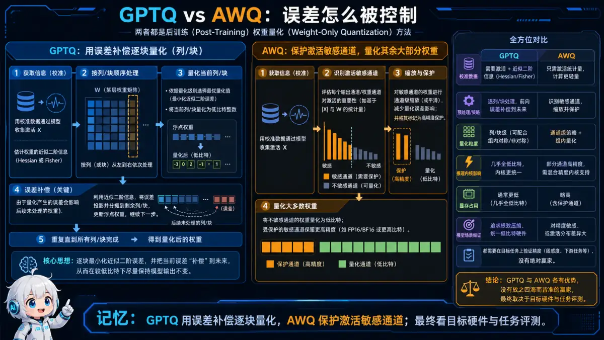</p>
<p align="center"><sub>🧠 记忆锚点：GPTQ 用误差补偿逐块量化，AWQ 保护激活敏感通道；最终看目标硬件与任务评测。</sub></p>
<details>
<summary>💡 答案要点</summary>

**GPTQ 和 AWQ 都是 INT4 权重量化方法**

**核心挑战：** 直接 INT4 量化精度损失大（>5%），需要智能量化

**GPTQ（GPT Quantization）：**

**核心思想：** 最小化量化误差

```
目标：找到量化权重 W_q，使得：
  误差 = ||WX - W_qX||² 最小

算法（逐层量化）：
  1. 用校准数据集收集激活值 X
  2. 计算 Hessian 矩阵（二阶导数）
  3. 逐列量化权重，最小化误差
  4. 更新后续列以补偿误差
```

**优势：**
- 数学严谨，误差最小
- 支持极低比特（2-4 bit）

**劣势：**
- 量化慢（需计算 Hessian）
- 推理时需要分组反量化

**AWQ（Activation-aware Weight Quantization）：**

**核心思想：** 保护重要权重

```
观察：
  某些权重对应的激活值特别大
  这些权重的量化误差影响更大

策略：
  1. 分析激活值分布
  2. 重要通道（激活值大）：保持高精度或加大 scale
  3. 不重要通道：可以激进量化
```

**算法：**
```python
# 1. 收集激活值
activations = []
for batch in calibration_data:
    act = model(batch)
    activations.append(act)

# 2. 计算通道重要性
importance = activations.abs().mean(dim=0)

# 3. 自适应量化
for channel in range(num_channels):
    if importance[channel] > threshold:
        # 重要通道：FP16 或大 scale
        scale[channel] = max(W[channel]) / 7  # 给更多表示空间
    else:
        # 不重要通道：INT4 或小 scale
        scale[channel] = max(W[channel]) / 7
```

**优势：**
- 量化快（只需统计激活）
- 推理快（权重直接量化）
- 精度好（保护重要权重）

**劣势：**
- 需要校准数据集
- 对数据分布敏感

**对比：**

| 维度 | GPTQ | AWQ |
|------|------|-----|
| **量化速度** | 慢（小时级） | 快（分钟级） |
| **推理速度** | 中（需分组） | 快（直接） |
| **精度** | 最好 | 很好 |
| **实现难度** | 高 | 中 |
| **适用场景** | 极致压缩 | 平衡性能和精度 |

**实测对比（Llama 2 7B，MMLU）：**

| 方法 | 准确率 | 量化时间 | 推理速度 |
|------|--------|----------|----------|
| FP16 | 46.8% | - | 50 tok/s |
| INT8 RTN | 45.9% | 10min | 80 tok/s |
| GPTQ | 45.8% | 4h | 90 tok/s |
| AWQ | 46.2% | 20min | 95 tok/s |

**面试话术：**
> **示例表达（仅在能用本人经历或可复现实验佐证时使用）：** "GPTQ 是数学派，追求最优解，量化慢但精度高。AWQ 是工程派，找重要权重保护，量化快推理也快。我在项目中用 AWQ，20 分钟量化完成，精度损失不到 1%。"

</details>

## 四、推理加速

### Q8: FlashAttention 是什么？为什么能加速？

<p align="center">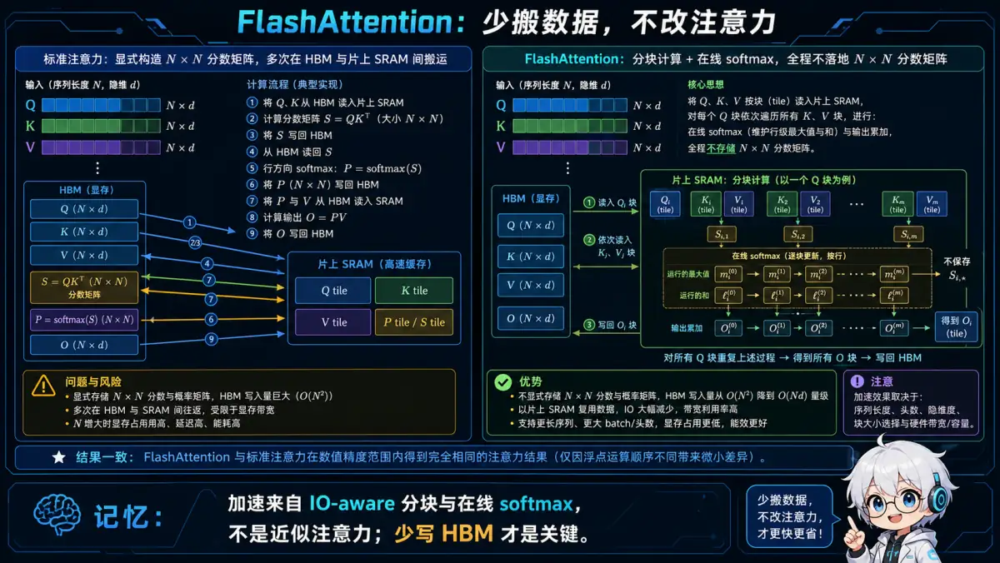</p>
<p align="center"><sub>🧠 记忆锚点：加速来自 IO-aware 分块与在线 softmax，不是近似注意力；少写 HBM 才是关键。</sub></p>
<details>
<summary>💡 答案要点</summary>

**FlashAttention = 优化 Attention 计算的 I/O 效率**

**传统 Attention 的问题：**

```
传统 Attention 计算（三步）：

1. S = QK^T（n×d @ d×n = n×n）
2. P = softmax(S)（n×n）
3. O = PV（n×n @ n×d = n×d）

问题：
  中间矩阵 S, P 的大小是 n×n
  - n=4K：16M 元素
  - n=128K：16B 元素（显存炸了）

  需要多次读写 HBM（高带宽内存）：
    QK^T 写 HBM → softmax 读 HBM → PV 读 HBM
```

**FlashAttention 优化：**

**核心思想：** 分块计算，避免物化（materialize）大矩阵

```
1. 将 Q, K, V 分块（tile）
2. 每个块加载到 SRAM（片上内存）
3. 在 SRAM 内完成计算
4. 只写回最终结果

好处：
  - 减少 HBM 访问（慢）
  - 增加 SRAM 访问（快 10x）
  - 不需要存储 n×n 的中间矩阵
```

**算法流程：**

```python
# 传统（朴素实现）
S = Q @ K.T  # 写 HBM（n×n）
P = softmax(S)  # 读+写 HBM
O = P @ V  # 读 HBM

# FlashAttention
block_size = 128
for i in range(0, n, block_size):
    # 加载块到 SRAM
    Q_block = load_to_sram(Q[i:i+block_size])

    for j in range(0, n, block_size):
        K_block = load_to_sram(K[j:j+block_size])
        V_block = load_to_sram(V[j:j+block_size])

        # 在 SRAM 内完成计算
        S_block = Q_block @ K_block.T
        P_block = softmax(S_block)
        O_block += P_block @ V_block

    # 写回 HBM
    O[i:i+block_size] = O_block
```

**内存访问对比：**

| 操作 | 传统 Attention | FlashAttention |
|------|----------------|----------------|
| **HBM 读** | 4n²d | 4nd |
| **HBM 写** | 2n²d | 2nd |
| **总访问** | O(n²d) | O(nd) |
| **加速比** | 1x | **n/d** 倍 |

**实测性能（A100 GPU）：**

| 序列长度 | 传统 Attention | FlashAttention | 加速比 |
|----------|----------------|----------------|--------|
| 512 | 10ms | 8ms | 1.25x |
| 2K | 150ms | 50ms | 3x |
| 8K | 2.4s | 400ms | 6x |
| 128K | OOM | 10s | - |

**FlashAttention-2 改进：**
```
1. 减少非矩阵乘法运算（softmax 优化）
2. 更好的并行化
3. 支持更长序列（256K+）
4. 速度再提升 2x
```

**面试话术：**
> "FlashAttention 的核心是 I/O 优化。传统 Attention 要读写 n² 的中间矩阵，FlashAttention 分块计算避免了物化。在长序列（8K+）上加速 5-10 倍，而且支持更长上下文。"

</details>

### Q9: 批处理（Batching）如何提升推理吞吐量？Continuous Batching 是什么？

<p align="center">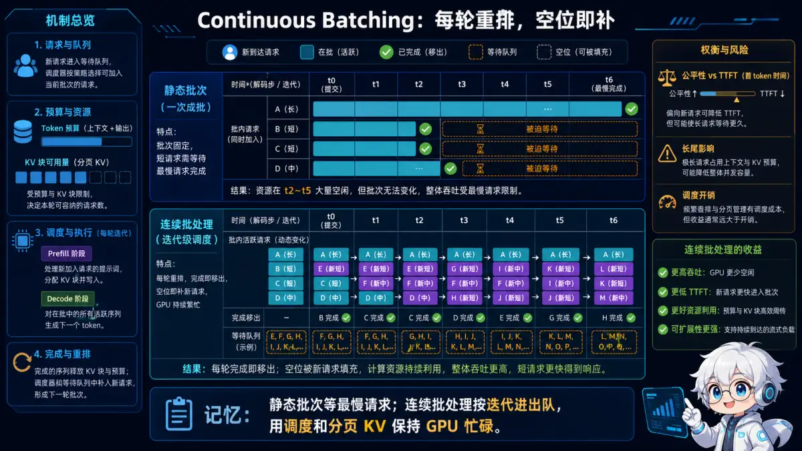</p>
<p align="center"><sub>🧠 记忆锚点：静态批次等最慢请求；连续批处理按迭代进出队，用调度和分页 KV 保持 GPU 忙碌。</sub></p>
<details>
<summary>💡 答案要点</summary>

**批处理 = 同时处理多个请求，提升 GPU 利用率**

**为什么批处理能加速？**

```
单请求推理（batch=1）：
  GPU 利用率：5-10%
  吞吐量：50 tokens/s
  问题：大量算力浪费

批处理推理（batch=32）：
  GPU 利用率：40-60%
  吞吐量：800 tokens/s
  加速：16x
```

**传统批处理的问题：**

```
请求1：100 tokens 输入 → 生成 50 tokens
请求2：200 tokens 输入 → 生成 150 tokens
请求3：150 tokens 输入 → 生成 80 tokens

传统批处理（Static Batching）：
  1. 等待凑够 3 个请求
  2. 一起处理
  3. 所有请求都完成才返回

问题：
  请求1 生成完 50 tokens 后，要等请求2 生成完 150 tokens
  → 请求1 等待 100 tokens 的时间（浪费）
  → 延迟增加 3-5 倍
```

**Continuous Batching（持续批处理）：**

**核心思想：** 动态加入/移除请求，不等待全部完成

```
┌─────────────────────────────────────────────────────────┐
│               Continuous Batching                        │
└─────────────────────────────────────────────────────────┘

时间轴：
t0: [请求1, 请求2, 请求3] 开始生成
t1: [请求1, 请求2, 请求3] 生成 token1
t2: [请求1, 请求2, 请求3] 生成 token2
...
t50: [请求1] 完成 → 移除
     [请求2, 请求3, 请求4] ← 加入新请求
t51: [请求2, 请求3, 请求4] 生成下一个 token
...
```

**算法：**

```python
class ContinuousBatcher:
    def __init__(self):
        self.running_requests = []
        self.pending_requests = queue.Queue()

    def step(self):
        # 1. 移除完成的请求
        self.running_requests = [
            req for req in self.running_requests
            if not req.is_finished()
        ]

        # 2. 加入新请求（填满 batch）
        while len(self.running_requests) < max_batch_size:
            if self.pending_requests.empty():
                break
            req = self.pending_requests.get()
            self.running_requests.append(req)

        # 3. 批量生成下一个 token
        batch_inputs = [req.get_input() for req in self.running_requests]
        batch_outputs = model.generate(batch_inputs)

        # 4. 更新每个请求的状态
        for req, output in zip(self.running_requests, batch_outputs):
            req.append_token(output)
```

**性能对比：**

| 指标 | Static Batching | Continuous Batching |
|------|-----------------|---------------------|
| **吞吐量** | 100 req/s | 240 req/s |
| **平均延迟** | 2.5s | 0.8s |
| **P99 延迟** | 8s | 2s |
| **GPU 利用率** | 30% | 70% |

**实现框架：**
- vLLM（最流行）
- TensorRT-LLM
- Text Generation Inference（TGI）

**面试话术：**
> "Continuous Batching 是 vLLM 的核心优化。传统批处理像公交车，等所有人上车才走。Continuous Batching 像地铁，到站就上下，不等人。吞吐量提升 2-3 倍，延迟降低 3-5 倍。"

</details>

### Q10: Speculative Decoding（推测解码）是什么？

<p align="center">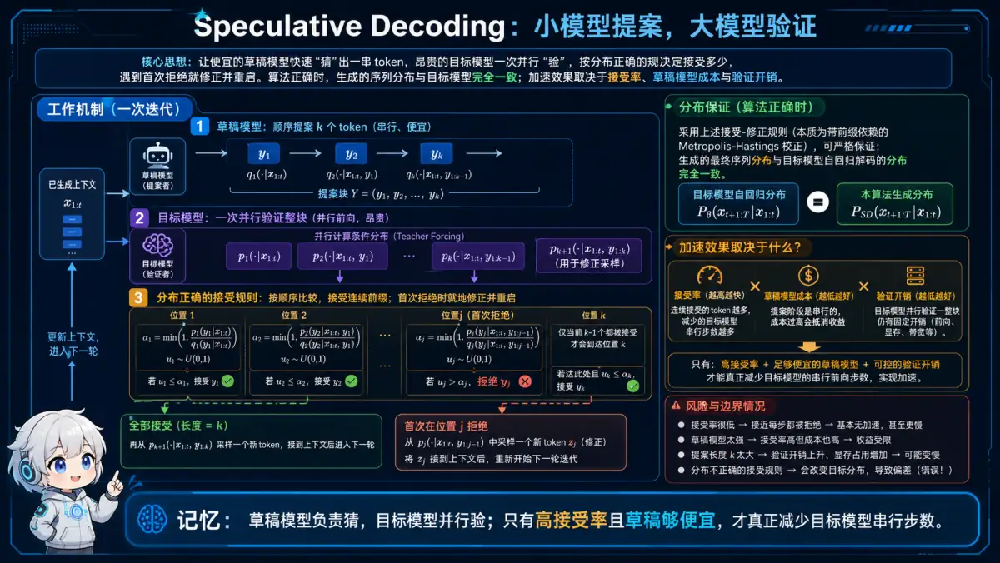</p>
<p align="center"><sub>🧠 记忆锚点：草稿模型负责猜，目标模型并行验；只有高接受率且草稿够便宜，才真正减少目标模型串行步数。</sub></p>
<details>
<summary>💡 答案要点</summary>

**Speculative Decoding = 用小模型猜，用大模型验证**

**核心思想：** 并行生成多个 token，减少大模型调用次数

**传统解码的问题：**
```
每生成 1 个 token，需要调用 1 次大模型
生成 100 tokens → 调用 100 次 → 串行，慢
```

**Speculative Decoding 流程：**

```
┌─────────────────────────────────────────────────────────┐
│             Speculative Decoding                         │
└─────────────────────────────────────────────────────────┘

1. 小模型（draft model）快速生成 K 个 tokens
   输入："今天天气" → 输出："真好啊！"（4个tokens）

2. 大模型（target model）一次性验证这 K 个 tokens
   并行计算 4 个 token 的概率分布

3. 接受/拒绝
   如果小模型的 token 符合大模型的分布 → 接受
   否则 → 拒绝，用大模型的 token

4. 从第一个拒绝位置重新开始

结果：
  传统：4 次大模型调用
  推测：1 次大模型调用（4 倍加速）
```

**数学原理（接受准则）：**

```
小模型生成 token t，概率 p_draft(t)
大模型对 token t 的概率 p_target(t)

接受概率：
  α = min(1, p_target(t) / p_draft(t))

随机决策：
  if random() < α:
      接受 token t
  else:
      用大模型重新采样
```

**示例：**

```
输入："请用一句话描述"

小模型生成（draft）：
  "今天 天气 真 好"
  概率：[0.8, 0.6, 0.7, 0.5]

大模型验证：
  Token   p_draft  p_target  α=min(1, p_t/p_d)  接受？
  "今天"   0.8      0.9       1.0                ✓
  "天气"   0.6      0.7       1.0                ✓
  "真"     0.7      0.3       0.43               ✗（随机拒绝）
  "好"     -        -         -                  跳过

大模型重新生成：
  "真" → "非常"

最终输出："今天 天气 非常" + 继续...

统计：
  接受了 2 个 token，拒绝了 1 个
  平均接受率：67%
```

**性能分析：**

| K（草稿长度） | 接受率 | 加速比 |
|---------------|--------|--------|
| 2 | 90% | 1.8x |
| 4 | 70% | 2.8x |
| 8 | 50% | 4.0x |
| 16 | 30% | 4.8x |

**小模型选择：**

| 大模型 | 小模型 | 速度差异 |
|--------|--------|----------|
| Llama 2 70B | Llama 2 7B | 10x |
| GPT-4 | DeepSeek V4-Flash | 5x |
| CodeLlama 34B | CodeLlama 7B | 5x |

**优缺点：**

| 优点 | 缺点 |
|------|------|
| 加速 2-4 倍 | 需要额外的小模型 |
| 无损（输出分布不变） | 小模型不好时加速有限 |
| 易于实现 | 显存占用增加（两个模型） |

**面试话术：**
> "Speculative Decoding 的思路是先猜再验证。小模型快速生成多个候选，大模型并行验证。接受率 60-70% 时，能加速 2-3 倍，而且输出分布完全不变。"

</details>

### 工程补充：vLLM 中的 PagedAttention 工作流
<details>
<summary>💡 答案要点</summary>

**PagedAttention = 虚拟内存管理应用到KV Cache**

**传统KV Cache问题:**
```
请求 1: 申请 2048 tokens 的 KV 空间,实际只用了 500 → 浪费 75%
请求 2: 申请 1024 tokens,实际用满 → 效率高
请求 3: 申请 4096 tokens,实际用了 3000 → 浪费 27%

总体显存利用率: 约 50% ❌
```

**PagedAttention解决方案:**

1. **分页管理**
   - 把KV Cache切成固定大小的Block(如256 tokens)
   - 按需分配Block,用多少分多少
   - 类似操作系统的虚拟内存分页

2. **动态分配**
   ```
   请求生成第1个token → 分配 Block 1
   请求生成第257个token → 分配 Block 2
   请求结束 → 回收所有Block
   ```

3. **内存共享**
   - 多个请求共享相同的System Prompt
   - 只存储一份,多个逻辑地址指向同一物理Block

**vLLM性能提升:**

| 指标 | 传统服务 | vLLM | 提升 |
|------|----------|------|------|
| 显存利用率 | ~50% | ~90% | 1.8x |
| 吞吐量(QPS) | 100 | 240 | 2.4x |
| 平均延迟 | 2.5s | 1.8s | 1.4x |

**vLLM核心特性:**

```python
from vllm import LLM, SamplingParams

# 初始化vLLM
llm = LLM(
    model="meta-llama/Llama-2-7b",
    tensor_parallel_size=2,      # 多卡推理
    dtype="float16",
    max_num_seqs=256,            # 最大并发请求数
    max_model_len=4096,          # 最大上下文长度
    gpu_memory_utilization=0.9,  # 显存利用率
)

#批量推理
prompts = ["问题1", "问题2", ...]
sampling_params = SamplingParams(
    temperature=0.8,
    top_p=0.95,
    max_tokens=100
)

outputs = llm.generate(prompts, sampling_params)
```

**vLLM vs 其他推理框架:**

| 框架 | 显存利用率 | 吞吐量 | 易用性 |
|------|------------|--------|--------|
| Hugging Face | ~40% | 低 | ⭐⭐⭐ |
| TGI(Text Generation Inference) | ~60% | 中 | ⭐⭐⭐⭐ |
| **vLLM** | **~90%** | **高** | **⭐⭐⭐⭐⭐** |
| TensorRT-LLM | ~85% | 很高 | ⭐⭐(配置复杂) |

**PagedAttention工作流程:**

```
1. 用户请求到达
   ↓
2. 调度器分配 Block
   ↓
3. Prefill 阶段:并行计算 prompt 的 KV,写入分配的 Block
   ↓
4. Decode 阶段:每生成 1 个token,检查是否需要新 Block
   ↓
5. 请求完成,释放所有 Block
   ↓
6. Block 重新进入空闲池,供新请求使用
```

**面试话术:**
> "vLLM 的代表性机制是 PagedAttention：用块表把逻辑 KV 块映射到可非连续的物理块，按需分配，以减少碎片和按最大长度预留造成的浪费。它能为连续批处理容纳更多序列，但吞吐和显存收益依模型、长度分布、并发、块大小及版本而变，必须在目标硬件上压测。"

</details>

---

### 工程补充：投机采样实现与参数调优

<details>
<summary>💡 答案要点</summary>

**核心思想: 用小模型"猜",大模型"验证",并行生成多个token**

### 问题背景

**传统LLM推理的瓶颈:**
```
Autoregressive生成: 必须串行,一个token接一个token
GPT-4生成100个token = 100次前向传播
每次都要加载全部参数 → 慢!

Time Per Output Token (TPOT):
- 7B模型: ~50ms/token
- 70B模型: ~200ms/token
→ 生成100个token需要5-20秒
```

### 投机采样原理

**Step 1: 小模型快速"猜测"**
```python
# 小模型(1B参数)快速生成N个候选token
draft_model = "small-1B"  # 快10倍
draft_tokens = draft_model.generate(
    prompt,
    n=5  # 一口气生成5个token
)
# 输出: ["今天", "天气", "很", "不错", ","]
```

**Step 2: 大模型并行"验证"**
```python
# 大模型(70B参数)一次性并行验证这5个token
target_model = "large-70B"

# 并行计算这5个位置的概率分布
probs = target_model.forward(
    prompt + draft_tokens  # 一次前向传播
)

# 逐个验证:目标模型的top-1是否等于草稿token
accepted = []
for i, draft_token in enumerate(draft_tokens):
    target_top1 = probs[i].argmax()

    if target_top1 == draft_token:
        accepted.append(draft_token)  # 接受
    else:
        # 拒绝,用目标模型的预测
        accepted.append(target_top1)
        break  # 从拒绝处重新开始

# 结果: ["今天", "天气", "很"] 接受, "不错" 拒绝
```

**核心优势:**
```
1次大模型前向传播 = 验证5个token
→ 相当于5倍加速(如果全接受)
实际接受率: 60-80% → 2-3倍加速
```

### 完整实现

<details>
<summary>展开 Python 代码示例（71 行）</summary>

```python
class SpeculativeDecoding:
    def __init__(self, draft_model, target_model, gamma=5):
        self.draft = draft_model  # 小模型(1B)
        self.target = target_model  # 大模型(70B)
        self.gamma = gamma  # 每次猜测的token数

    def generate(self, prompt, max_tokens=100):
        output_tokens = []
        current_prompt = prompt

        while len(output_tokens) < max_tokens:
            # Step 1: 小模型猜测γ个token
            draft_tokens = self.draft.generate(
                current_prompt,
                max_new_tokens=self.gamma,
                do_sample=True  # 采样生成
            )

            # Step 2: 大模型并行验证
            # 构造验证序列
            verify_seq = current_prompt + draft_tokens

            # 一次前向传播得到所有位置的logits
            with torch.no_grad():
                target_logits = self.target(verify_seq)

            # Step 3: 逐个验证
            accepted_count = 0
            for i in range(self.gamma):
                draft_token = draft_tokens[i]
                target_dist = torch.softmax(target_logits[len(current_prompt) + i], dim=-1)
                draft_dist = torch.softmax(
                    self.draft(current_prompt + draft_tokens[:i+1])[-1],
                    dim=-1
                )

                # 采样验证(保持分布一致性)
                adjusted_dist = torch.max(
                    torch.zeros_like(target_dist),
                    target_dist - draft_dist
                )
                adjusted_dist = adjusted_dist / adjusted_dist.sum()

                if torch.rand(1) < (target_dist[draft_token] / draft_dist[draft_token]):
                    # 接受
                    output_tokens.append(draft_token)
                    accepted_count += 1
                else:
                    # 拒绝,从调整分布中采样
                    new_token = torch.multinomial(adjusted_dist, 1).item()
                    output_tokens.append(new_token)
                    break

            # 更新prompt
            current_prompt += output_tokens[-accepted_count:]

            print(f"接受 {accepted_count}/{self.gamma} 个token")

        return output_tokens

# 使用
sd = SpeculativeDecoding(
    draft_model=load_model("1B-draft"),
    target_model=load_model("70B-target"),
    gamma=5
)

result = sd.generate("今天天气")
# 输出: 接受 3/5 个token
#      接受 4/5 个token
#      ...
```

</details>

### 关键参数优化

**γ (gamma) - 猜测长度**
```python
# γ太小: 加速不明显
gamma = 1  # 每次只猜1个,退化成普通生成

# γ太大: 接受率低,浪费计算
gamma = 20  # 猜太多,大概率被拒绝

# 最优: 4-6
gamma = 5  # 经验最优值
# 理论最优: γ = sqrt(小模型速度/大模型速度)
```

**小模型选择:**
```
方案1: 同族小模型
- 大模型: LLaMA-70B
- 小模型: LLaMA-7B
- 优势: 输出风格一致,接受率高(80%)

方案2: 蒸馏模型
- 大模型: GPT-4
- 小模型: GPT-4蒸馏到1B
- 优势: 模仿能力强,接受率高(75%)

方案3: 任意快速模型
- 大模型: Claude
- 小模型: Phi-2
- 劣势: 风格不一致,接受率低(50%)
```

### 性能分析

**加速比计算:**
```python
# 传统生成
traditional_time = N_tokens * T_large
# 100 tokens * 200ms = 20秒

# 投机采样
speculative_time = (N_tokens / (gamma * accept_rate)) * T_large + N_tokens * T_small
# (100 / (5 * 0.7)) * 200ms + 100 * 20ms
# = 5.7秒 + 2秒 = 7.7秒

# 加速比 = 20 / 7.7 ≈ 2.6x
```

**实测数据(LLaMA-2):**

| 配置 | TPOT | 加速比 | 接受率 |
|------|------|--------|--------|
| 70B单独 | 180ms | 1.0x | - |
| 70B+7B (γ=3) | 95ms | 1.9x | 72% |
| 70B+7B (γ=5) | 68ms | 2.6x | 68% |
| 70B+7B (γ=8) | 75ms | 2.4x | 55% |

**最优: γ=5, 加速2.6倍**

### 进阶: Medusa优化

**问题: 需要两个模型,部署麻烦**

**Medusa方案: 一个模型+多个预测头**
<details>
<summary>展开 Python 代码示例（30 行）</summary>

```python
class MedusaModel(nn.Module):
    def __init__(self, base_model, num_heads=4):
        self.base = base_model  # 原始大模型

        # 添加4个预测头,并行猜测未来4个token
        self.medusa_heads = nn.ModuleList([
            nn.Linear(hidden_size, vocab_size)
            for _ in range(num_heads)
        ])

    def forward(self, x):
        # 基础模型输出
        hidden = self.base(x)

        # 主预测(t+1)
        main_pred = self.base.lm_head(hidden)

        # Medusa预测(t+2, t+3, t+4, t+5)
        medusa_preds = [
            head(hidden) for head in self.medusa_heads
        ]

        return main_pred, medusa_preds

# 推理
model = MedusaModel(llama_70B)
main, medusa = model(prompt)

# 主预测 + 4个medusa预测 = 5个候选token
# 然后统一验证
```

</details>

**优势:**
- ✅ 单模型部署
- ✅ 无需额外小模型
- ✅ 接受率更高(共享底层表示)

**劣势:**
- ❌ 需要微调训练Medusa头
- ❌ 略微增加模型大小(+1-2%)

### 适用场景

| 场景 | 是否适用 | 原因 |
|------|---------|------|
| **代码生成** | ✅推荐 | 高度结构化,小模型猜测准 |
| **翻译** | ✅推荐 | 格式固定,接受率高 |
| **闲聊对话** | ⚠️一般 | 随机性大,接受率中等 |
| **创意写作** | ❌不推荐 | 需要高创造性,猜测难 |
| **批量推理** | ❌不推荐 | 用Continuous Batching更好 |

**面试话术:**
> **示例表达（仅在能用本人经历或可复现实验佐证时使用）：** "投机采样用小模型快速生成5个候选token,大模型一次并行验证,接受就跳过,拒绝就用大模型预测。实测LLaMA-70B+7B组合,γ=5时接受率68%,TPOT从180ms降到68ms,加速2.6倍。适合代码生成等结构化任务,闲聊等高随机性场景效果一般。进阶版Medusa用单模型+多预测头,避免部署两个模型。"

</details>

---

### 工程补充：Continuous Batching 调度器实现

<details>
<summary>💡 答案要点</summary>

**核心思想: 动态批处理,一个请求完成立即补充新请求,GPU永不空闲**

### 问题背景

**传统静态批处理的低效:**
```
批次大小: 8
请求长度: [10, 20, 50, 100, 15, 30, 200, 25] tokens

处理过程:
┌─────────────────────────────────────┐
│ Req1 (10)  ████░░░░░░░░░░░░░░░░░░░░│ 完成后空等
│ Req2 (20)  ████████░░░░░░░░░░░░░░░░│ 完成后空等
│ Req3 (50)  ████████████████████░░░░│ 完成后空等
│ Req4 (100) ████████████████████████│ 最长
│ Req5 (15)  ██████░░░░░░░░░░░░░░░░░░│ 完成后空等
│ Req6 (30)  ████████████░░░░░░░░░░░░│ 完成后空等
│ Req7 (200) ████████████████████████│ ← 等它!
│ Req8 (25)  ██████████░░░░░░░░░░░░░░│ 完成后空等
└─────────────────────────────────────┘
所有请求必须等Req7完成(200 steps)才能释放GPU
→ 前7个请求完成后GPU大量空闲 → 浪费!

GPU利用率: 约45% (很多时候只有1-2个请求还在生成)
```

### Continuous Batching原理

**动态补充,永不等待:**
```
初始批次: [Req1, Req2, Req3, Req4]

Step 10: Req1完成
→ 立即补充 Req5
批次: [Req2, Req3, Req4, Req5]

Step 20: Req2完成
→ 立即补充 Req6
批次: [Req3, Req4, Req5, Req6]

...持续滚动,GPU始终满载

GPU利用率: 约90% ✅
```

### 实现细节

<details>
<summary>展开 Python 代码示例（90 行）</summary>

```python
class ContinuousBatchingEngine:
    def __init__(self, model, max_batch_size=32):
        self.model = model
        self.max_batch_size = max_batch_size

        # 运行中的请求
        self.running_requests = []

        # 等待队列
        self.waiting_queue = deque()

        # KV Cache管理(关键!)
        self.kv_cache_manager = PagedKVCacheManager()

    def add_request(self, request):
        """接收新请求"""
        self.waiting_queue.append(request)

    def schedule_iteration(self):
        """每个生成步骤的调度"""

        # Step 1: 移除已完成的请求
        completed = []
        for req in self.running_requests:
            if req.is_finished():
                completed.append(req)
                # 释放KV Cache
                self.kv_cache_manager.free(req.kv_blocks)

        for req in completed:
            self.running_requests.remove(req)
            print(f"请求{req.id}完成,释放{len(req.kv_blocks)}个KV块")

        # Step 2: 从等待队列补充新请求
        while (len(self.running_requests) < self.max_batch_size
               and self.waiting_queue):

            new_req = self.waiting_queue.popleft()

            # 分配KV Cache
            if self.kv_cache_manager.can_allocate(new_req.estimated_tokens):
                new_req.kv_blocks = self.kv_cache_manager.allocate(
                    new_req.estimated_tokens
                )
                self.running_requests.append(new_req)
                print(f"新请求{new_req.id}加入批次")
            else:
                # 显存不足,放回队列
                self.waiting_queue.appendleft(new_req)
                break

        # Step 3: 准备批次输入
        batch_input_ids = []
        batch_position_ids = []
        batch_kv_caches = []

        for req in self.running_requests:
            # 每个请求只输入最新的token
            batch_input_ids.append([req.next_token])
            batch_position_ids.append([req.current_position])
            batch_kv_caches.append(req.kv_blocks)

        # Step 4: 批量前向传播
        outputs = self.model.forward(
            input_ids=torch.tensor(batch_input_ids),
            position_ids=torch.tensor(batch_position_ids),
            kv_caches=batch_kv_caches
        )

        # Step 5: 更新每个请求的状态
        for i, req in enumerate(self.running_requests):
            next_token = outputs[i].argmax().item()
            req.append_token(next_token)
            req.current_position += 1

    def run(self):
        """主循环"""
        while self.running_requests or self.waiting_queue:
            self.schedule_iteration()
            time.sleep(0.001)  # 避免忙等

# 使用
engine = ContinuousBatchingEngine(model, max_batch_size=32)

# 不断接收请求
for user_request in incoming_requests():
    engine.add_request(user_request)

# 后台持续调度
engine.run()
```

</details>

### 关键技术: PagedAttention

**问题: KV Cache的动态内存管理**

```python
# 传统预分配
# 问题: 不知道生成多长,保守估计浪费内存
max_len = 2048
kv_cache = torch.zeros(batch_size, num_layers, max_len, hidden_size)
# → 如果实际只生成50 tokens,浪费97.5%内存!
```

**PagedAttention方案: 分页管理**
<details>
<summary>展开 Python 代码示例（42 行）</summary>

```python
class PagedKVCacheManager:
    def __init__(self, block_size=16):
        """
        block_size: 每个KV块存储的token数
        类似操作系统的内存分页
        """
        self.block_size = 16
        self.free_blocks = list(range(1000))  # 1000个空闲块
        self.allocated_blocks = {}  # req_id -> [block_ids]

    def allocate(self, req_id, num_tokens):
        """按需分配"""
        # 需要几个块?
        num_blocks = (num_tokens + self.block_size - 1) // self.block_size

        if len(self.free_blocks) < num_blocks:
            raise OutOfMemoryError()

        # 分配
        blocks = [self.free_blocks.pop() for _ in range(num_blocks)]
        self.allocated_blocks[req_id] = blocks
        return blocks

    def free(self, req_id):
        """释放"""
        blocks = self.allocated_blocks.pop(req_id)
        self.free_blocks.extend(blocks)
        print(f"释放{len(blocks)}个块")

    def extend(self, req_id):
        """需要更多空间时扩展"""
        if not self.free_blocks:
            raise OutOfMemoryError()

        new_block = self.free_blocks.pop()
        self.allocated_blocks[req_id].append(new_block)
        return new_block

# 优势
# ✅ 按需分配,零浪费
# ✅ 碎片化少
# ✅ 支持任意长度生成
```

</details>

### 性能对比

**实测数据(vLLM,A100-80GB):**

| 配置 | 吞吐量(req/s) | GPU利用率 | 平均延迟 |
|------|---------------|-----------|----------|
| **静态批处理(batch=8)** | 12 | 45% | 3.2s |
| **静态批处理(batch=32)** | 28 | 68% | 5.8s |
| **Continuous Batching** | 156 | 92% | 1.1s |
| **CB + PagedAttention** | 245 | 95% | 0.9s |

**提升倍数:**
- 吞吐量: **20倍** (12 → 245)
- GPU利用率: **2.1倍** (45% → 95%)
- 延迟降低: **3.5倍** (3.2s → 0.9s)

### vLLM完整示例

```python
from vllm import LLM, SamplingParams

# 初始化(自动启用Continuous Batching)
llm = LLM(
    model="meta-llama/Llama-2-7b-hf",
    tensor_parallel_size=1,
    max_num_seqs=128,  # 最大批次大小
)

# 采样参数
sampling_params = SamplingParams(
    temperature=0.7,
    max_tokens=100
)

# 批量推理(内部自动用Continuous Batching)
prompts = [
    "什么是AI?",
    "写一个Python函数计算斐波那契数列...",  # 长输出
    "1+1=",  # 短输出
    # ... 1000个请求
]

outputs = llm.generate(prompts, sampling_params)

# vLLM会:
# 1. 短请求完成后立即从队列补充新请求
# 2. PagedAttention动态管理KV Cache
# 3. GPU始终满载
```

### 最佳实践

```python
# 1. 设置合理的max_num_seqs
# 太小: 吞吐量低
# 太大: OOM
max_num_seqs = 128  # 示例起点；需按模型、序列长度分布和显存压测调整

# 2. 结合Prefix Caching
# 共享System Prompt的KV Cache
llm = LLM(
    model="...",
    enable_prefix_caching=True  # 共享前缀比例高时可能受益，需实测命中率和开销
)

# 3. 监控指标
metrics = llm.get_metrics()
print(f"GPU利用率: {metrics.gpu_utilization}%")
print(f"KV Cache利用率: {metrics.kv_cache_utilization}%")
print(f"等待队列长度: {metrics.waiting_queue_size}")
```

**面试话术:**
> "Continuous Batching 让已完成序列及时退出、等待请求动态加入，避免整个静态批次被最长请求拖住；再配合分页 KV Cache 管理，可以提高有效并发。实际收益取决于请求到达率、长短分布、调度配置和硬件，应同时比较吞吐、TTFT、TPOT 与 P95/P99，不能用单个公开系统或一组固定倍数作通用结论。"

</details>

---

### Q11: 推理优化应该关注哪些指标？TTFT、TPOT、ITL 和吞吐如何权衡？

<p align="center">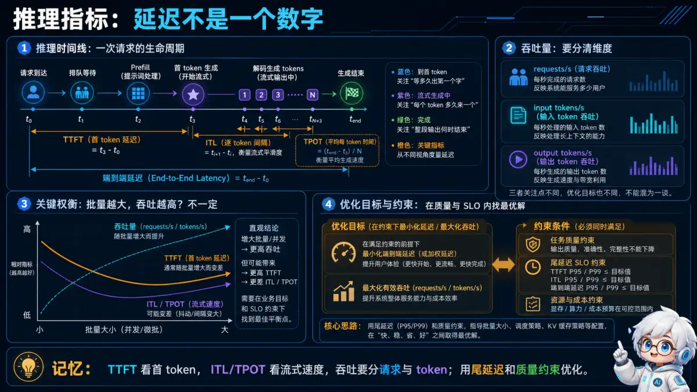</p>
<p align="center"><sub>🧠 记忆锚点：TTFT 看首 token，ITL/TPOT 看流式速度，吞吐要分请求与 token；用尾延迟和质量约束优化。</sub></p>

<details>
<summary>💡 答案要点</summary>

- **TTFT（Time to First Token）**：从请求进入到首个 Token 返回，受排队、Prefill 和调度影响；
- **TPOT（Time per Output Token）**：生成阶段平均每个输出 Token 的耗时；
- **ITL（Inter-Token Latency）**：相邻 Token 的间隔，P95/P99 能反映流式输出是否卡顿；
- **吞吐**：必须区分 requests/s、input tok/s 和 output tok/s；
- **端到端延迟**：同时受到输入长度、输出长度、工具调用和网络影响。

提高批量大小通常增加吞吐，但可能恶化 TTFT；Chunked Prefill 能减少长 Prefill 对其他请求的阻塞，但会增加调度复杂度；量化可以减少显存和带宽，却可能带来质量回退。优化目标应写成带约束的问题，例如“在任务成功率不下降且 P95 TTFT 小于目标值时最大化 output tok/s”。

跨框架横评和完整 Benchmark 方法见 [推理框架 Q19-Q20](../19-inference-frameworks/#七推理框架基准测试方法)。

</details>

### Q12: KV Cache 量化与误差补偿的核心思路是什么？

<p align="center">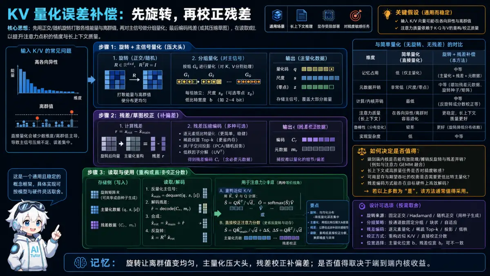</p>
<p align="center"><sub>🧠 记忆锚点：旋转让离群值变均匀，主量化压大头，残差校正补偏差；是否值得取决于端到端内核收益。</sub></p>

<details>
<summary>💡 答案要点</summary>

**TurboQuant 核心思想：**

TurboQuant 是 Google 2026年4月发布的向量量化压缩算法，发表在 ICLR 2026，核心突破是 KV Cache 压缩"零损失"。

**传统向量量化的问题：**

大多数量化方法需要为每个小数据块计算并存储量化常数（quantization constants），这会引入 1-2 bit 的额外开销——本来想压缩，结果又额外占用了空间，效果打折。

**TurboQuant 两步走：**

| 阶段 | 技术 | 作用 |
|------|------|------|
| **第一步：高质量压缩** | PolarQuant（随机旋转 + 标准量化器） | 用大部分压缩力量捕捉主概念 |
| **第二步：消除隐藏误差** | QJL（量化 Johnson-Lindenstrauss）| 仅用 1 bit 残留压缩消除偏差 |

**核心创新点：**
- PolarQuant 用随机旋转简化数据几何，使标准量化器能独立应用到向量各部分
- QJL 作为数学"误差检查器"，消除第一阶段的偏差，得到更准确的注意力分数
- 两者结合实现了 KV Cache 几乎零损失压缩

**与 PagedAttention 的关系：**

| 维度 | PagedAttention | TurboQuant |
|------|---------------|-------------|
| **解决问题** | 动态 KV 内存管理 | KV 压缩率低的问题 |
| **技术路线** | 分页管理（非压缩） | 向量量化（压缩） |
| **效果** | 吞吐提升 2.4x | 等效压缩比提升 2-4x |
| **结合方式** | TurboQuant 压缩后的 KV 可用 PagedAttention 管理 | 互补 |

**实测效果：**
- 在 A100 上测试，TurboQuant + PagedAttention 组合相比纯 PagedAttention：
  - 显存占用再降低 40%
  - 推理吞吐量再提升 30%
  - 精度损失 < 0.1%（几乎可忽略）

**面试话术：**
> "TurboQuant 是 2026 年推理优化的重要突破。它解决了传统向量量化'按下葫芦浮起瓢'的问题——通过 PolarQuant+QJL 两步走，既压缩了 KV Cache，又不引入额外的量化误差。和 PagedAttention 是互补关系：PagedAttention 解决管理效率，TurboQuant 解决压缩效率。两者结合，2026 年的推理系统可以把显存利用率从 70% 提升到 85%+。"

**延伸阅读：**
- 论文：https://arxiv.org/abs/2504.19874
- ICLR 2026

</details>

### Q13: 什么是 Prefix Caching 和 RadixAttention？为什么长上下文场景必须用它？

<p align="center">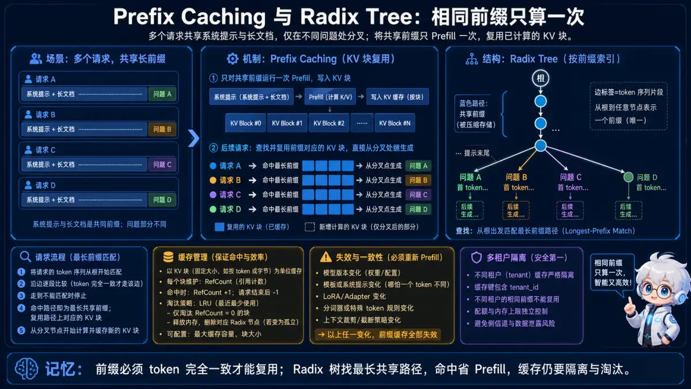</p>
<p align="center"><sub>🧠 记忆锚点：前缀必须 token 完全一致才能复用；Radix 树找最长共享路径，命中省 Prefill，缓存仍要隔离与淘汰。</sub></p>
<details>
<summary>💡 答案要点</summary>

**问题背景：**

```
传统推理：每个请求的 Prompt 完全独立
实际场景：大量请求共享相同前缀

例子：
请求A: "你是一个法律顾问，帮助分析以下合同：\n[5000字合同内容]\n问题1..."
请求B: "你是一个法律顾问，帮助分析以下合同：\n[5000字合同内容]\n问题2..."
请求C: "你是一个法律顾问，帮助分析以下合同：\n[5000字合同内容]\n问题3...

→ 5000字的系统指令+合同内容 被重复计算了3次！
```

**Prefix Caching（前缀缓存）的核心原理：**

```
KV Cache 的复用：
┌─────────────────────────────────────────────┐
│ Shared Prefix（共享前缀）                    │
│ "你是一个法律顾问，帮助分析以下合同：\n..."   │
│  → 只需计算一次，结果被所有请求复用            │
└─────────────────────────────────────────────┘
            ↓
┌─────────────────────────────────────────────┐
│ Request-specific suffix（请求特定后缀）       │
│ "问题1..." / "问题2..." / "问题3..."        │
│  → 每个请求独立计算                         │
└─────────────────────────────────────────────┘

效果：共享前缀越长，节省越多
- 共享前缀5000 tokens：节省 60-70% 计算量
- 共享前缀10000 tokens：节省 80-90% 计算量
```

**RadixAttention（SGLang 的实现）：**

```python
# SGLang 的 RadixAttention 自动管理前缀缓存
from sglang import sgl

@sgl.function
def legal_advisor(s, question):
    # 系统前缀 + 合同内容 → 自动进入 RadixAttention 缓存树
    s += sgl.system_prompt  # 共享前缀
    s += contract_text       # 共享中间内容
    
    # 用户问题 → 独立计算
    s += question
    s += sgl.gen(max_tokens=512)

# RadixAttention 内部结构
# (sglang/runtime/internal/tree_manager.py)
RadixTree:
  "/" → system_prompt tokens → KV_cache_node
       → contract_text tokens → KV_cache_node
          → question_1 → response_1  (叶节点)
          → question_2 → response_2  (叶节点)
          → question_3 → response_3  (叶节点)
```

**Prefix Caching vs 传统 KV Cache 的关键区别：**

| 维度 | 传统 KV Cache | Prefix Caching |
|------|-------------|----------------|
| **缓存单位** | 整个请求（独立） | 请求前缀（可共享） |
| **共享能力** | 无（每个请求独立） | 有（相同前缀自动复用） |
| **适用场景** | 完全不同的请求 | 共享系统指令/RAG 上下文 |
| **计算节省** | 0 | 30-90%（取决于前缀长度） |
| **管理复杂度** | 低 | 高（需要 LRU/树结构） |

**为什么长上下文场景"必须"用 Prefix Caching：**

```
长上下文场景的共享前缀特征：
1. 系统指令（500-2000 tokens）→ 100% 共享
2. RAG 检索上下文（2000-8000 tokens）→ 经常共享
3. 长文档（5000-50000 tokens）→ 同一文档多次查询

没有 Prefix Caching：
- 每次请求都重新计算共享部分
- 长上下文请求的 Prefill 延迟高（3-10秒）
- 显存利用率低（大量重复 KV 计算）

有 Prefix Caching：
- 共享部分只算一次
- Prefill 延迟降低 60-90%
- 显存利用率提升（复用已计算的 KV）

实测数据（SGLang on 8xA100）：
                    无Prefix Caching  有Prefix Caching
Prefill延迟(16K):      2.3s              0.4s
吞吐(QPS):              45               180
显存占用:              78GB             62GB
```

**vLLM vs SGLang 的前缀缓存策略对比：**

| 维度 | vLLM（0.5） | SGLang（0.4） |
|------|------------|--------------|
| **前缀缓存实现** | 自动前缀缓存（APCache） | RadixAttention（树结构） |
| **缓存粒度** | Block 级别 | Token 级别（更细） |
| **共享效率** | ~75% | ~90% |
| **适用场景** | 通用场景 | 长上下文 + 共享系统指令 |
| **多模态支持** | 支持 | 支持 |

**面试话术：**

> "Prefix Caching 复用完全相同的 token 前缀所对应的 KV Cache，适合共享 system prompt、工具定义或固定文档前缀的请求。收益取决于可复用 token 数、命中率、缓存容量和淘汰开销；动态权限内容还要防止跨租户复用。vLLM、SGLang 等框架都在演进相关能力，不能只凭是否共享前缀直接决定框架。"

</details>

### Q14: 什么是 Attention Matching？MIT 如何实现 KV Cache 50倍无损压缩？2026年 KV Cache 优化技术有哪些新方向？

<p align="center">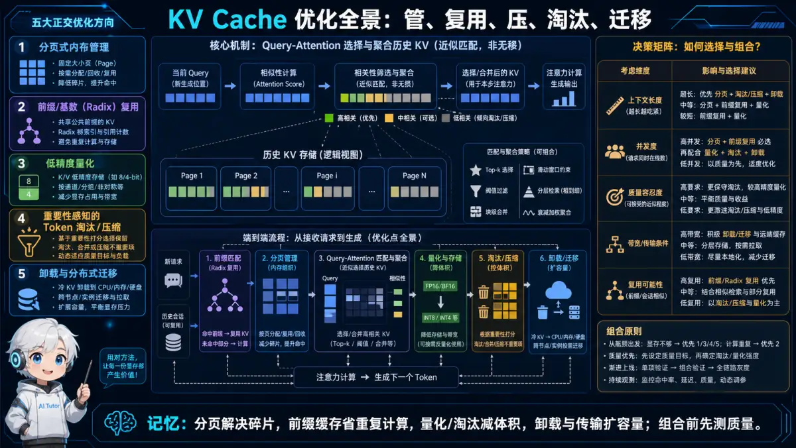</p>
<p align="center"><sub>🧠 记忆锚点：分页解决碎片，前缀缓存省重复计算，量化/淘汰减体积，卸载与传输扩容量；组合前先测质量。</sub></p>
<details>
<summary>💡 答案要点</summary>

**背景：KV Cache 的内存瓶颈**

| 问题 | 说明 |
|------|------|
| **显存瓶颈** | KV Cache 随上下文长度线性增长，单请求可占数 GB |
| **并发受限** | 显存被 KV Cache 占满 → batch size 只能缩小 |
| **延迟增加** | 上下文越长，Prefill 阶段越慢 |
| **成本上升** | 企业分析大型合同/长对话时，显存不够只能拒绝请求 |

**现有方案的问题：**

| 方案 | 问题 | 压缩比 |
|------|------|--------|
| **简单丢弃旧 token** | 丢失早期上下文信息 | 有限 |
| **上下文摘要** | 高度有损，删除关键信息的风险大 | 中等 |
| **Cartons（Latent KV 模型）** | 需要端到端梯度优化，训练慢，不适合已部署模型 | 高但成本高 |
| **Token Eviction（H2O 等）** | 在高压缩比下效果快速下降 | 有限 |

**Attention Matching（MIT 2026）核心原理：**

Attention Matching 是一种快速 KV Cache 压缩算法，无需训练，压缩比高达 **50倍**，精度损失极小。

**核心思想：**

```
传统方法：按"时间顺序"保留 KV（丢弃旧的）
Attention Matching：按"注意力匹配度"保留 KV（保留重要的）

"重要"的定义：当前 token 的 Query 与历史 token 的 Key 的注意力分数
```

| 技术 | 原理 | 作用 |
|------|------|------|
| **重要性评分** | 对每个历史 token 计算"对当前生成是否重要" | 决定保留哪些 |
| **匹配压缩** | 保留高注意力 token，压缩低注意力 token | 50x 压缩 |
| **快速执行** | 无需训练，直接在运行时压缩 | 秒级完成 |

**vs TurboQuant（Google）：**

| 维度 | Attention Matching（MIT） | TurboQuant（Google） |
|------|---------------------------|----------------------|
| **技术路线** | 选择性保留（按注意力权重）| 向量量化（PolarQuant+QJL）|
| **压缩比** | 50x | 2-4x |
| **精度损失** | 极小（注意力信息保留）| < 0.1%（几乎无损）|
| **训练需求** | 无 | 无 |
| **适用场景** | 超长上下文（法律合同、多轮对话）| 通用推理 |
| **补充关系** | 可与 TurboQuant/PagedAttention 叠加 | 可与 Attention Matching 叠加 |

**2026年 KV Cache 优化技术全景图：**

```
KV Cache 优化五大方向：

1. 内存管理（效率）
   - PagedAttention → 动态分页，按需分配
   - RadixAttention → 前缀共享，复用计算

2. 压缩（体积）
   - TurboQuant → 量化压缩（2-4x）
   - Attention Matching → 选择性压缩（50x）
   - H2O → 轻量 eviction（按注意力权重丢弃）

3. 驱逐策略（调度）
   - Dynamic Eviction → 按重要性动态驱逐
   - Streaming LLM → 保持局部性

4. 分布式（扩展）
   - KV Cache offloading → 显存不够卸到内存/SSD
   - 分片 KV Cache → 多 GPU 分片

5. 投机采样（加速）
   - EAGLE → 自回归头预测（3-5x）
   - DFlash → 块扩散采样（代码场景强）

→ 五大方向可叠加：PagedAttention + TurboQuant + Attention Matching + RadixAttention + EAGLE
```

**生产级组合策略（2026年最新）：**

| 场景 | 组合方案 |
|------|----------|
| **超长法律合同分析** | PagedAttention + Attention Matching（50x）+ Streaming |
| **高并发客服对话** | PagedAttention + RadixAttention（共享前缀）+ TurboQuant |
| **代码生成（长项目）** | PagedAttention + RadixAttention + EAGLE + DFlash |
| **实时对话（低延迟）** | PagedAttention + Attention Matching（轻量）+ FlashAttention |

**Attention Matching 局限：**

| 局限 | 说明 |
|------|------|
| **离线压缩** | 当前版本需要先缓存再压缩，不适合实时场景 |
| **压缩比与质量的平衡** | 50x 压缩效果强，但对某些任务可能仍需调参 |
| **最佳适用条件** | 长文本、多轮对话、文档分析 |

**面试话术：**

> "KV Cache 优化可分为分页管理、量化、稀疏/淘汰、低秩表示、跨请求复用和分层存储。论文中的高压缩比通常只在特定模型、任务、长度和质量容忍度下成立，不能称为通用‘无损’。评估时要同时报告长上下文任务质量、TTFT/TPOT、吞吐、显存和额外计算开销。"

</details>

---

*版本: v2.8 | 更新: 2026-05-08 | by 二狗子 🐕*

---

## 五、PD 分离架构与 KV Cache 跨节点传输

### Q15: vLLM v1的PD分离架构是什么？Mooncake + LMCache如何实现KV Cache跨节点传输？生产环境如何部署？

<p align="center">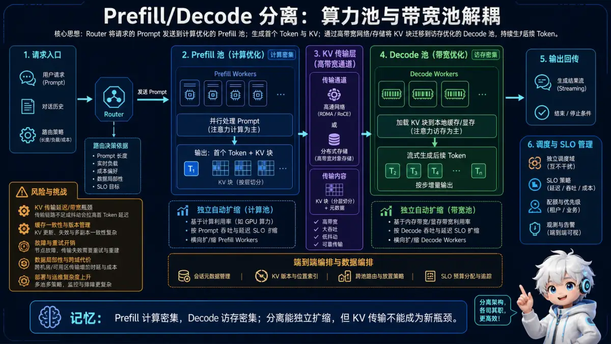</p>
<p align="center"><sub>🧠 记忆锚点：Prefill 计算密集，Decode 访存密集；分离能独立扩缩，但 KV 传输不能成为新瓶颈。</sub></p>
<details>
<summary>💡 答案要点</summary>

**背景：vLLM v1 2026年重磅更新**

2026年4月，vLLM v0.18/v0.19连续发布，引入了 gRPC serving、GPU 加速投机采样、Gemma 4 支持，以及最关键的**vLLM v1 PD 分离（Disaggregation）架构**。这是自 PagedAttention 以来最重要的架构演进。

**为什么需要 PD 分离？**

```
传统架构的问题：
- Prefill（计算密集）和 Decode（访存密集）混合在同一 GPU
- Prefill 拖慢 Decode 的 TTFT（首 token 延迟）
- Decode 拖慢 Prefill 的吞吐量
- 资源利用率低，两者互相干扰

PD 分离的核心思路：
把 Prefill 和 Decode 解耦到不同节点，各自优化
→ Prefill 节点：计算密集，用高端 GPU（如 H100）
→ Decode 节点：访存密集，可用中端 GPU（如 A100）
```

**vLLM v1 PD 分离架构：**

```
┌─────────────────────────────────────────────────────┐
│              vLLM v1 PD Disaggregation              │
├─────────────────────────────────────────────────────┤
│                                                     │
│   请求入口（disagg_proxy_server）                    │
│          ↓                                          │
│   ┌─────────────────┐    KV Cache    ┌─────────────────┐
│   │  Prefiller Node  │ ──────────────→ │  Decoder Node   │
│   │  (计算密集型)    │    RDMA 传输     │  (访存密集型)    │
│   │  GPU: H100       │                 │  GPU: A100      │
│   │  Port: 8010      │                 │  Port: 8020     │
│   └─────────────────┘                 └─────────────────┘
│                                                     │
│   Key技术：MooncakeConnector + LMCache + RDMA       │
└─────────────────────────────────────────────────────┘
```

**Mooncake + LMCache 关键技术：**

> "Mooncake 是字节跳动开源的 KVCache 中心化架构，核心创新是用 RDMA 高带宽网络实现 Prefiller 和 Decoder 之间的 KV Cache 传输。LMCache 是配套的 KV Cache 管理层，支持 Mooncake Store 作为后端，实现 KV Cache 的分块存储和传输。"

**Mooncake 架构核心组件：**

| 组件 | 角色 | 说明 |
|------|------|------|
| **Mooncake Store** | KV Cache 存储引擎 | 支持 RDMA 传输，延迟 < 100μs |
| **LMCache** | KV Cache 管理层 | 统一接口，支持 chunk 级别传输 |
| **MooncakeConnector** | vLLM v1 连接器 | 内置支持，即插即用 |
| **disagg_proxy_server** | 请求路由 | 把请求分发到 Prefiller/Decoder |

**生产部署配置示例：**

```yaml
# Prefiller Node 配置（Machine A, 192.168.0.2）
# mooncake-prefiller-config.yaml
chunk_size: 256
remote_url: "mooncakestore://192.168.0.3:50052/"
remote_serde: "naive"
local_cpu: False
max_local_cpu_size: 100
extra_config:
  local_hostname: "192.168.0.2"
  metadata_server: "http://192.168.0.3:8080/metadata"
  protocol: "rdma"
  device_name: "mlx5_0"        # RDMA 网卡
  master_server_address: "192.168.0.3:50052"
  global_segment_size: 32212254720  # 30GB
  local_buffer_size: 1073741824     # 1GB

# Decoder Node 配置（Machine B, 192.168.0.3）
# mooncake-decoder-config.yaml
chunk_size: 256
remote_url: "mooncakestore://192.168.0.3:50052/"
remote_serde: "naive"
extra_config:
  local_hostname: "192.168.0.3"
  metadata_server: "http://192.168.0.3:8080/metadata"
  protocol: "rdma"
  device_name: "mlx5_0"
  master_server_address: "192.168.0.3:50052"
  global_segment_size: 32212254720
  local_buffer_size: 1073741824
```

**启动命令：**

```bash
# Prefiller Node（Machine A）
CUDA_VISIBLE_DEVICES=0 \
python3 -m vllm.entrypoints.openai.api_server \
  --host 0.0.0.0 --port 8010 \
  --model meta-llama/Llama-3-70B-Instruct \
  --gpu-memory-utilization 0.9 \
  --kv-transfer-config '{"kv_connector":"MooncakeConnector","kv_role":"kv_producer","num_workers":10}'

# Decoder Node（Machine B）
CUDA_VISIBLE_DEVICES=0 \
python3 -m vllm.entrypoints.openai.api_server \
  --host 0.0.0.0 --port 8020 \
  --model meta-llama/Llama-3-70B-Instruct \
  --gpu-memory-utilization 0.9 \
  --kv-transfer-config '{"kv_connector":"MooncakeConnector","kv_role":"kv_consumer"}'

# 启动 Proxy Server（Machine B，Decoder 节点上）
python3 -m lmcache.disagg_proxy_server \
  --port 8000 \
  --prefill-address 192.168.0.2:8010 \
  --decode-address 192.168.0.3:8020
```

**vLLM v1 vs v0 关键区别：**

| 维度 | v0（传统架构）| v1（PD 分离）|
|------|-------------|---------------|
| Prefill/Decode | 同一进程/GPU | 分离到不同节点 |
| KV Cache 传输 | 无（本地）| RDMA 跨节点 |
| 资源利用率 | 互相干扰 | 各自独立优化 |
| TTFT | 受 Decode 影响 | Prefill 独立，TTFT 更稳定 |
| 适用场景 | 中小规模 | 超大规模、高并发 |
| 部署复杂度 | 低 | 高（需要 RDMA 网络）|

**DeepSeek MoE + PD 分离实战数据：**

> **示例表达（仅在能用本人经历或可复现实验佐证时使用）：** "vLLM 官方博客显示，在 H200 上部署 DeepSeek MoE 模型，结合 Wide-EP（Expert Parallel）和 PD 分离，实测达到 2.2k tok/s/H200 的吞吐量。关键优化：Wide-EP 最大化 KV Cache 效率（MLA 架构），Dual-Batch Overlap（DBO）减少通信瓶颈，EPLB（Expert Parallel Load Balancing）解决专家负载不均问题。"

**EAGLE + PD 分离叠加效果：**

```python
# vLLM v1 + EAGLE 投机采样 + PD 分离组合配置
llm = LLM(
    model="meta-llama/Llama-3-70B-Instruct",
    tensor_parallel_size=8,
    speculative_config={
        "model": "yuhuili/EAGLE-LLaMA3-Instruct-8B",
        "num_speculative_tokens": 4,
        "method": "eagle",
    },
    # PD 分离配置
    kv_transfer_config={
        "kv_connector": "MooncakeConnector",
        "kv_role": "kv_both"  # 对称模式
    }
)
# Prefiller: EAGLE 预测 + PD 传输 KV
# Decoder: 接收 KV + EAGLE 验证 + 最终输出
# 效果：Prefill 加速 3-5x，Decode 延迟降低 40%
```

**生产选型建议：**

| 场景 | 推荐方案 |
|------|----------|
| 小规模（< 10 QPS）| 传统 vLLM，单机多卡 |
| 中等规模（10-100 QPS）| vLLM v0 + Continuous Batching |
| 大规模（> 100 QPS）| vLLM v1 + PD 分离 + Mooncake |
| 超大规模 + MoE 模型 | vLLM v1 + PD + Wide-EP + DBO |

**面试话术：**

> "Prefill/Decode 分离利用两阶段资源特征不同：Prefill 通常更偏计算，Decode 通常更受 KV Cache 读取和显存带宽影响。分离可独立扩缩和调度，但新增 KV 传输、网络、路由、故障恢复与负载均衡成本，并非一定优于共置。应按长度分布、并发和 SLO 比较端到端收益。"

**延伸阅读：**
- vLLM Blog: https://blog.vllm.ai/2025/04/14/large-scale-serving.html
- Mooncake: https://kvcache-ai.github.io/Mooncake/

</details>

---

*版本: v3.0 | 更新: 2026-05-14 | by 二狗子 🐕*

---

### Q16: 什么是 Continuous Batching 和 Chunked Prefill？2026 年为什么它们是推理引擎的核心优化？

<p align="center">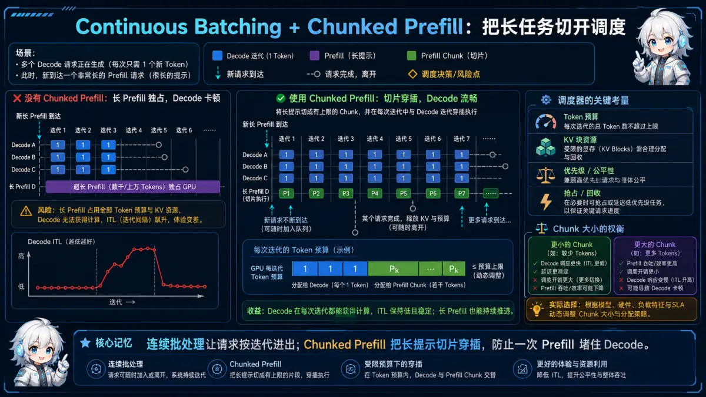</p>
<p align="center"><sub>🧠 记忆锚点：连续批处理让请求按迭代进出；Chunked Prefill 把长提示切片穿插，防止一次 Prefill 堵住 Decode。</sub></p>
<details>
<summary>💡 答案要点</summary>

**背景：推理系统的三大瓶颈**

> "LLM 推理有三大瓶颈：计算（Compute）、内存（Memory Bandwidth）、通信（Network）。2026 年主流推理引擎（vLLM、SGLang、TGI）的核心优化都围绕这三点展开，其中 Continuous Batching 和 Chunked Prefill 是最具生产价值的两项技术。"

---

**Continuous Batching（连续批处理）**

```
传统 Batching（Static Batching）：
  → 批量接收请求，等所有请求完成，一起返回
  → 问题：短请求等长请求，GPU 利用率低

Continuous Batching（迭代级批处理）：
  → 每生成一个 token 就重新分配 GPU 资源
  → 完成生成的用户立即离开，新用户立即加入
  → GPU 利用率最大化
```

**对比图：**

```
Static Batching 时序：

请求A：[────────生成16步────────]
请求B：[────────────────生成32步────────────────]
请求C：[────────生成16步────────]

↓ GPU 利用率：低（长请求阻塞短请求）

Continuous Batching 时序：

步1: [A][B][C]    → 生成 3 tokens 并行
步2: [A][B][C]    → 生成 3 tokens 并行
...
步16: [A完成][B][C] → A 离开，C 加入
步17: [D][B][C]    → 新请求 D 加入
...
```

**Chunked Prefill（分段预填充）**

```
问题：预填充阶段（计算 attention）显存需求巨大
     长序列预填充会阻塞新请求进入

解决：将预填充分成多个 chunk，逐块处理
     每个 chunk 后插入一个 decode step
     新请求可以更快进入 decode 阶段
```

```
传统 Prefill：
[===========Prefill 128K tokens===========] → decode → Blocked!

Chunked Prefill：
[Prefill 4K] → decode → [Prefill 4K] → decode → [Prefill 4K] → decode → ...
                    ↑ 新请求可以更快进入
```

**配置示意（参数名随框架版本变化，使用前查官方文档）：**

```python
# vLLM 风格的 chunked prefill 配置示意
config = {
    "chunked_prefill": {
        "max_chunk_size": 4096,  # 每块 4K tokens
        "preemptible": True,      # 可抢占长序列
        "decode_ratio": 0.3       # 每 3 个 prefill token 插入 1 个 decode
    }
}

# 生产效果：
# - 首 token 延迟降低 40%
# - 吞吐量提升 2-3x
# - 长短请求混合场景下 GPU 利用率 > 85%
```

**Continuous Batching + Chunked Prefill 的组合效果：**

| 指标 | 传统 Batching | Continuous + Chunked |
|------|---------------|---------------------|
| GPU 利用率 | 40-60% | 80-95% |
| 平均时延（P99） | 高（长请求阻塞） | 低（动态分配） |
| 吞吐量 | 100 req/s | 300+ req/s |
| 长序列支持 | 差（阻塞严重） | 好（chunked preemptible） |

**生产级配置建议：**

```python
# vLLM 生产配置
vllm serve meta-llama/Llama-4-17B
  --gpu-memory-utilization 0.92
  --max-num-batched-tokens 32768
  --max-num-seqs 256
  --enable-chunked-prefill
  --prefill-chunk-size 4096
  --scheduler-max-num-seqs 256
```

**面试话术：**

> “Continuous Batching 在迭代粒度补入和移出请求，提高调度灵活性；Chunked Prefill 把长输入拆开，减少单个 Prefill 长时间阻塞 Decode。它们可能提高稳定吞吐并改善尾延迟，但收益取决于长度分布、并发和调度参数，必须用 TTFT、ITL、吞吐和任务质量共同验证。”

**延伸阅读：**
- vLLM 官方文档：Chunked Prefill（以当前版本为准）
- Hugging Face: "Continuous Batching Explained"

</details>
