# 🛠️ AI 框架与运维面试题

> **面试优先顺序（通用 AI 应用开发岗位）**：Q1、Q2、Q3、Q7、Q8、Q9、Q10、Q13、Q14、Q19、Q20、Q21、Q22。其余题目用于进阶或特定岗位拓展；实际频率会随岗位和面试轮次变化，产品版本资讯不应当作通用必考题。

> **难度：** ⭐⭐⭐⭐
> **更新：** 2026-04-23
> **考点：** LangChain、向量数据库、测试评估、部署运维、Dify/Coze/n8n/OpenClaw

## 📋 目录

1. [框架使用题](#一框架使用题)
2. [向量数据库题](#二向量数据库题)
3. [测试评估题](#三测试评估题)
4. [部署运维题](#四部署运维题)

## 一、框架使用题

### Q1: LangChain 的核心组件有哪些？如何使用 Chain？

<a href="../../assets/illustrations/12-frameworks-tools/q01-langchain-chain.webp">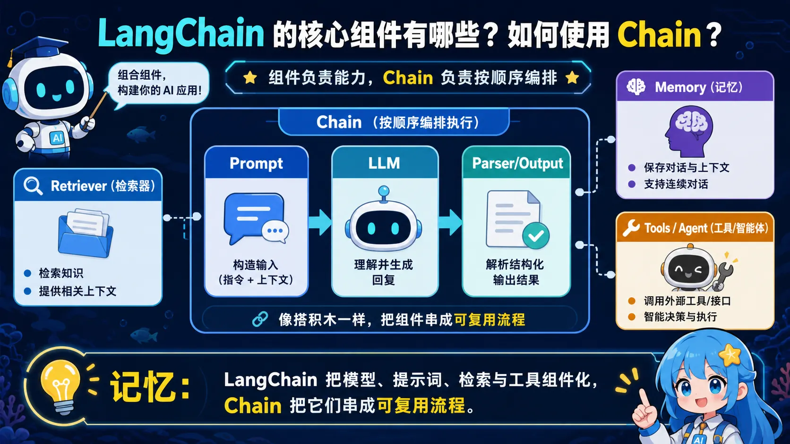</a>

> 🧠 **图解记忆：** LangChain 把模型、提示词、检索与工具组件化，Chain 把它们串成可复用流程。

<details>
<summary>💡 答案要点</summary>

**LangChain 核心组件：**

| 组件 | 作用 | 示例 |
|------|------|------|
| **LLM** | 模型抽象层 | ChatOpenAI、ChatAnthropic |
| **Prompt** | 提示词模板 | ChatPromptTemplate |
| **Chain** | 任务编排 | LLMChain、SequentialChain |
| **Agent** | 自主决策 | AgentExecutor |
| **Memory** | 对话记忆 | ConversationBufferMemory |
| **Retriever** | 文档检索 | VectorStoreRetriever |
| **VectorStore** | 向量存储 | Chroma、Milvus、FAISS |

**Chain 使用示例：**
```python
from langchain.chains import LLMChain
from langchain.prompts import ChatPromptTemplate
from langchain.chat_models import ChatOpenAI

# 1. 定义 Prompt 模板
prompt = ChatPromptTemplate.from_template(
    "你是一个{role}。请回答以下问题：{question}"
)

# 2. 创建 LLMChain
chain = LLMChain(
    llm=ChatOpenAI(model="gpt-4o"),
    prompt=prompt
)

# 3. 执行
result = chain.run(role="客服助手", question="如何退款？")
print(result)
```

**面试话术：**
> "LangChain 的核心价值是抽象和编排。我用 LLMChain 封装了 Prompt + LLM，用 SequentialChain 编排多步任务，用 AgentExecutor 实现自主决策。这样代码更模块化，容易测试和维护。"

</details>

### Q2: LangGraph 和 LangChain 有什么区别？什么时候用 LangGraph？

<a href="../../assets/illustrations/12-frameworks-tools/q02-langgraph-vs-langchain.webp">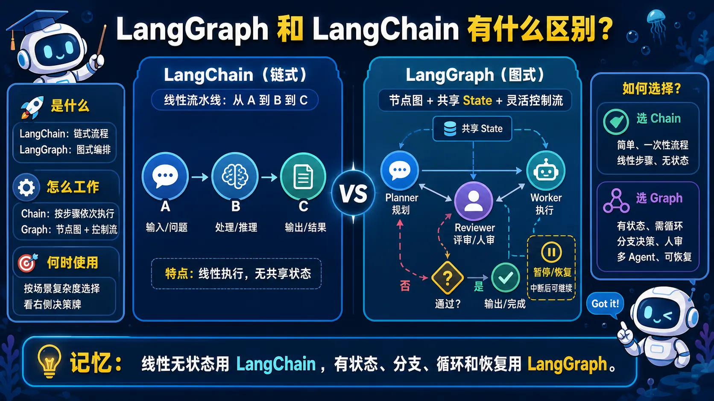</a>

> 🧠 **图解记忆：** 线性无状态用 LangChain，有状态、分支、循环和恢复用 LangGraph。

<details>
<summary>💡 答案要点</summary>

**区别对比：**

| 特性 | LangChain | LangGraph |
|------|-----------|-----------|
| **执行模式** | 线性链式 | 图结构（有环） |
| **适用场景** | 简单任务流 | 复杂多轮对话 |
| **状态管理** | 简单 | 强状态管理 |
| **循环支持** | 不支持 | 支持（StateGraph） |

**LangGraph 适用场景：**
1. 多轮对话（需要记住状态）
2. 条件分支（根据结果走不同路径）
3. 循环执行（直到满足条件）
4. 多 Agent 协作

**LangGraph 示例：**
```python
from langgraph.graph import StateGraph, END

# 1. 定义状态
class State(TypedDict):
    messages: list
    current_step: str

# 2. 创建图
graph = StateGraph(State)

# 3. 添加节点
graph.add_node("research", research_agent)
graph.add_node("write", writer_agent)
graph.add_node("review", reviewer_agent)

# 4. 添加边
graph.add_edge("research", "write")
graph.add_edge("write", "review")
graph.add_conditional_edges(
    "review",
    lambda s: "write" if s["needs_revision"] else END
)

# 5. 编译
app = graph.compile()
```

**面试话术：**
> **示例表达（仅在能用本人经历或可复现实验佐证时使用）：** "LangChain 适合线性任务流，LangGraph 适合复杂的多轮对话和多 Agent 协作。我在项目中用 LangGraph 实现了内容创作系统：Researcher 搜索→Writer 写作→Reviewer 审核，如果审核不通过就返回 Writer 修改，形成闭环。"

</details>

### Q3: 如何使用 LlamaIndex 构建 RAG 系统？和 LangChain 有什么区别？

<a href="../../assets/illustrations/12-frameworks-tools/q03-llamaindex-rag.webp">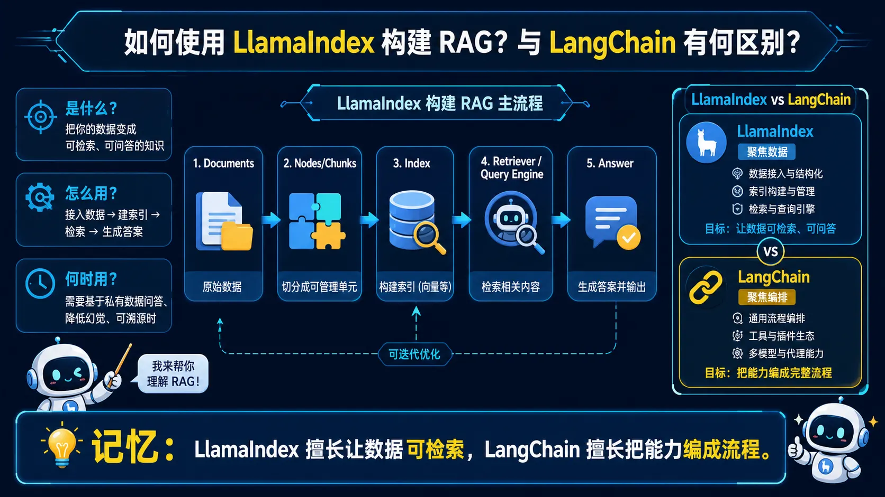</a>

> 🧠 **图解记忆：** LlamaIndex 擅长让数据可检索，LangChain 擅长把能力编成流程。

<details>
<summary>💡 答案要点</summary>

**LlamaIndex 核心概念：**

| 概念 | 作用 | 对应 LangChain |
|------|------|----------------|
| **Document** | 文档对象 | Document |
| **Node** | 文档节点（Chunk） | Document |
| **Index** | 索引结构 | VectorStore |
| **QueryEngine** | 查询引擎 | Retriever + Chain |

**LlamaIndex 构建 RAG：**
```python
from llama_index.core import (
    VectorStoreIndex,
    SimpleDirectoryReader,
    Settings
)
from llama_index.llms.openai import OpenAI

# 1. 设置 LLM
Settings.llm = OpenAI(model="gpt-4o")

# 2. 加载文档
documents = SimpleDirectoryReader("./docs").load_data()

# 3. 创建索引
index = VectorStoreIndex.from_documents(documents)

# 4. 创建查询引擎
query_engine = index.as_query_engine(
    similarity_top_k=5,
    response_mode="compact"
)

# 5. 查询
response = query_engine.query("什么是 RAG？")
print(response)
```

**和 LangChain 的区别：**

| 维度 | LlamaIndex | LangChain |
|------|------------|-----------|
| **定位** | 专注于 RAG | 通用 AI 应用框架 |
| **索引** | 丰富（向量、关键词、层次） | 主要是向量 |
| **查询** | 灵活（多阶段查询） | 相对简单 |
| **生态** | 较小 | 更大 |

**面试话术：**
> **示例表达（仅在能用本人经历或可复现实验佐证时使用）：** "LlamaIndex 专注于 RAG，索引和查询更灵活；LangChain 是通用框架，生态更大。我在项目中用 LlamaIndex 做 RAG，因为它支持多阶段查询（先检索摘要，再检索具体段落），检索精度更高。"

</details>

## 二、向量数据库题

### Q4: 向量数据库的索引类型有哪些？怎么选？

<a href="../../assets/illustrations/12-frameworks-tools/q04-vector-index-selection.webp">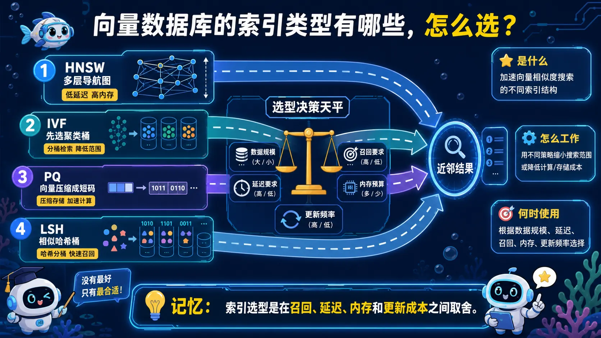</a>

> 🧠 **图解记忆：** 索引选型是在召回、延迟、内存和更新成本之间取舍。

<details>
<summary>💡 答案要点</summary>

**主流索引类型：**

| 索引 | 原理 | 速度 | 精度 | 内存 | 适用场景 |
|------|------|------|------|------|----------|
| **HNSW** | 多层图结构 | ⭐⭐⭐⭐⭐ | ⭐⭐⭐⭐⭐ | 高 | 追求速度，内存充足 |
| **IVF** | 先聚类再搜索 | ⭐⭐⭐ | ⭐⭐⭐⭐ | 中 | 数据量大，可接受精度损失 |
| **LSH** | 局部敏感哈希 | ⭐⭐⭐⭐ | ⭐⭐ | 低 | 超大规模，近似即可 |
| **PQ** | 乘积量化 | ⭐⭐⭐⭐ | ⭐⭐⭐ | 低 | 内存受限场景 |

**选型建议：**

| 场景 | 推荐索引 |
|------|----------|
| **<100 万条** | HNSW（速度快） |
| **100 万 -1000 万** | IVF + PQ（平衡） |
| **>1000 万** | IVF 或 LSH（节省内存） |
| **实时插入** | HNSW（索引更新快） |
| **离线批量** | IVF（批量构建快） |

**面试话术：**
> **示例表达（仅在能用本人经历或可复现实验佐证时使用）：** "我在项目中用 HNSW 索引，因为数据量在 50 万条左右，内存充足，追求检索速度。HNSW 的检索延迟在 10ms 以内，比 IVF 快 10 倍。如果数据量增长到千万级，我会考虑 IVF+PQ 的组合。"

</details>

### Q5: 如何优化向量检索的精度和速度？

<a href="../../assets/illustrations/12-frameworks-tools/q05-vector-retrieval-optimization.webp">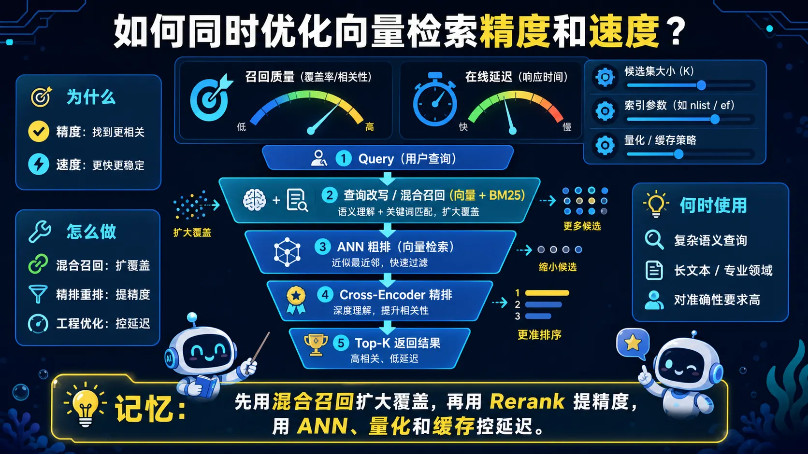</a>

> 🧠 **图解记忆：** 先用混合召回扩大覆盖，再用 Rerank 提精度，用 ANN、量化和缓存控延迟。

<details>
<summary>💡 答案要点</summary>

**精度优化：**

| 方案 | 说明 | 效果 |
|------|------|------|
| **Rerank** | 用 Cross-Encoder 重新排序 | 精度提升 10-20% |
| **混合检索** | 向量 + 关键词（BM25） | 召回率提升 15% |
| **Multi-Query** | 生成多个查询变体 | 召回率提升 10% |
| **更好的 Embedding** | BGE-M3、text-embedding-3 | 精度提升 5-10% |

**速度优化：**

| 方案 | 说明 | 效果 |
|------|------|------|
| **HNSW 索引** | 图结构索引 | 100ms → 10ms |
| **减少 k 值** | 只返回 top-3 | 延迟降低 30% |
| **量化** | 向量压缩（FP32→INT8） | 内存减少 4 倍 |
| **GPU 加速** | 并行计算 | 速度提升 5-10 倍 |

**面试话术：**
> "检索优化要先按查询类型建立基线，再分别验证混合检索、rerank 和 ANN 参数。混合检索改善词项与语义互补，rerank 用额外延迟换排序质量，HNSW 调参在召回、延迟和内存间取舍。最终数据只报告本人可复现实验的模型、数据集、硬件和并发条件。"

</details>

### Q6: 向量数据库的 Metadata 过滤怎么用？有什么应用场景？

<a href="../../assets/illustrations/12-frameworks-tools/q06-metadata-filtering.webp">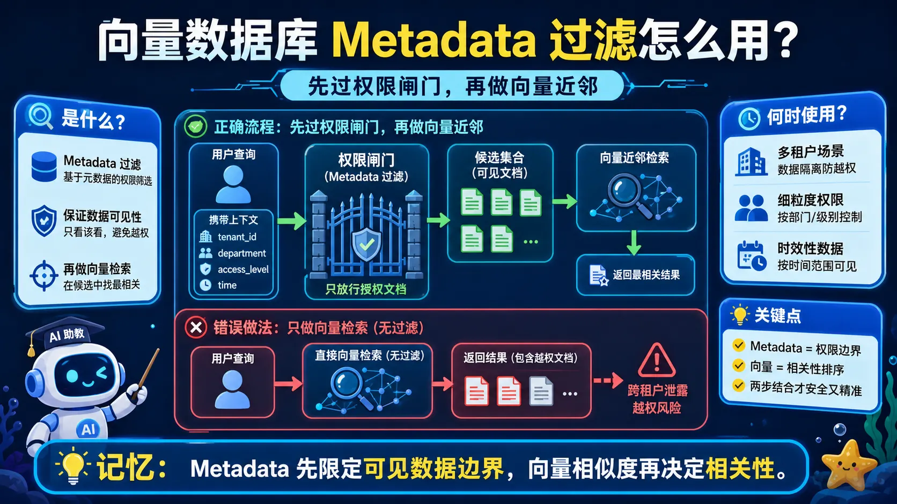</a>

> 🧠 **图解记忆：** Metadata 先限定可见数据边界，向量相似度再决定相关性。

<details>
<summary>💡 答案要点</summary>

**Metadata 过滤示例：**
```python
# Chroma 示例
results = collection.query(
    query_embeddings=[...],
    filter={
        "tenant_id": "company_a",
        "department": {"$in": ["hr", "finance"]},
        "created_at": {"$gte": "2025-01-01"},
        "access_level": {"$lte": 3}
    },
    n_results=5
)

# Milvus 示例
results = collection.search(
    data=[...],
    filter="tenant_id == 'company_a' and created_at > '2025-01-01'",
    limit=5
)
```

**应用场景：**

| 场景 | Metadata 字段 | 过滤条件 |
|------|--------------|----------|
| **多租户** | tenant_id | tenant_id == "xxx" |
| **权限控制** | access_level | access_level <= user_level |
| **时间范围** | created_at | created_at >= "2025-01-01" |
| **部门隔离** | department | department in ["hr", "finance"] |
| **文档类型** | doc_type | doc_type == "policy" |

**面试话术：**
> "Metadata 过滤可实现逻辑多租户，但必须由服务端从可信身份生成过滤条件，不能接受模型或客户端任意传 tenant_id。还要验证索引前/后过滤语义、缓存键、备份、日志和侧信道；高风险租户是否物理隔离取决于合规与威胁模型，不能只看成本。"

</details>

## 三、测试评估题

### Q7: 如何测试 AI 应用的质量？有哪些评估指标？

<a href="../../assets/illustrations/12-frameworks-tools/q07-ai-quality-evaluation.webp">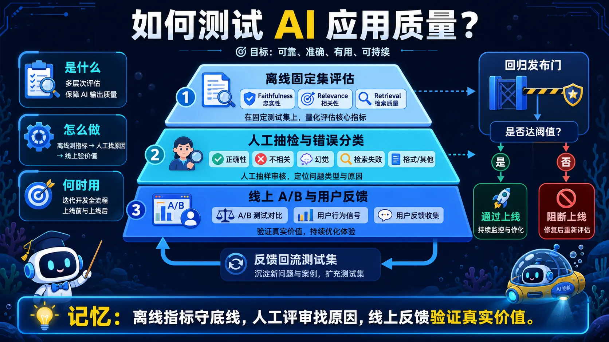</a>

> 🧠 **图解记忆：** 离线指标守底线，人工评审找原因，线上反馈验证真实价值。

<details>
<summary>💡 答案要点</summary>

**评估指标体系：**

| 类别 | 指标 | 说明 | 合格线 |
|------|------|------|--------|
| **准确性** | Faithfulness | 答案是否基于检索内容 | > 0.7 |
| **准确性** | Answer Relevance | 答案是否回答问题 | > 0.8 |
| **检索质量** | Context Relevance | 检索内容是否有用 | > 0.8 |
| **检索质量** | Context Recall | 是否检索到正确答案 | > 0.8 |
| **用户体验** | 点赞率 | 用户满意的比例 | > 80% |
| **用户体验** | 重新生成率 | 用户重新生成的比例 | < 15% |

**测试方法：**

| 方法 | 说明 | 优缺点 |
|------|------|--------|
| **人工评估** | 人工给答案打分 | 准确，但成本高 |
| **自动评估** | RAGAS、TruLens | 快速，但不够准确 |
| **A/B 测试** | 对比不同策略 | 真实，但需要流量 |
| **回归测试** | 固定测试集定期跑 | 防止退化 |

**面试话术：**
> "我建立了三层评估体系：1）自动评估（RAGAS）每次上线前跑；2）人工抽检（每周 5%）；3）A/B 测试（新策略灰度发布）。有一次 RAGAS 指标正常，但人工评估发现答案质量下降，原来是检索策略改变了，及时调整了回来。"

</details>

### Q8: 如何构建 AI 应用的测试集？

<a href="../../assets/illustrations/12-frameworks-tools/q08-test-dataset-lifecycle.webp">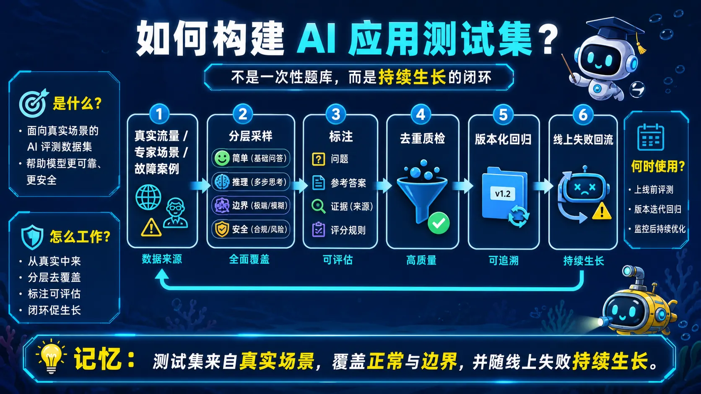</a>

> 🧠 **图解记忆：** 测试集来自真实场景，覆盖正常与边界，并随线上失败持续生长。

<details>
<summary>💡 答案要点</summary>

**测试集构建流程：**

```
1. 收集问题 → 2. 标注标准答案 → 3. 分类整理 → 4. 定期更新
```

**问题分类：**

| 类别 | 说明 | 占比 |
|------|------|------|
| **简单问题** | FAQ、事实查询 | 40% |
| **中等问题** | 需要推理 | 40% |
| **复杂问题** | 多步推理、计算 | 15% |
| **边界问题** | 模糊、无答案 | 5% |

**测试集规模：**
- **最小可用**：50-100 题
- **推荐**：200-500 题
- **生产级**：1000+ 题

**维护策略：**
1. **每周新增**：从用户反馈中收集新问题
2. **每月审核**：删除过时问题，更新答案
3. **每季度回归**：跑一遍测试集，确保质量不下降

**面试话术：**
> "我维护了一个 300 题的测试集，覆盖简单/中等/复杂三种难度。每次上线前跑一遍，Faithfulness 低于 0.7 就阻断发布。同时每周从用户反馈中收集 10-20 个新问题，持续扩充测试集。"

</details>

## 四、部署运维题

### Q9: 如何部署 LLM 应用到生产环境？需要注意什么？

<a href="../../assets/illustrations/12-frameworks-tools/q09-production-deployment.webp">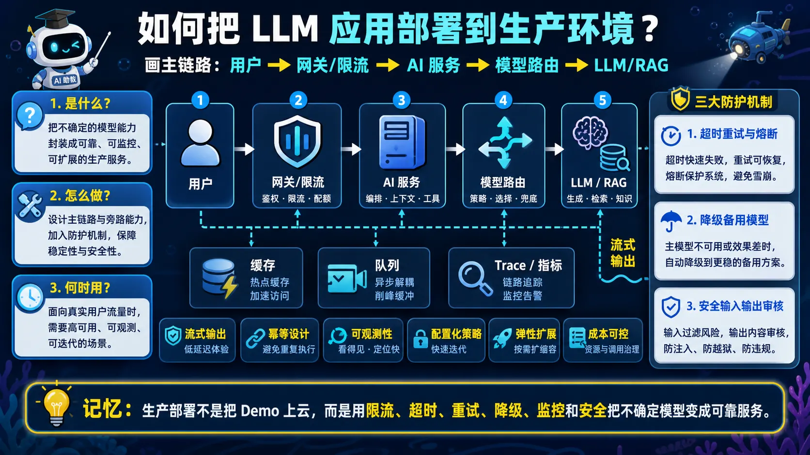</a>

> 🧠 **图解记忆：** 生产部署不是把 Demo 上云，而是用限流、超时、重试、降级、监控和安全把不确定模型变成可靠服务。
<details>
<summary>💡 答案要点</summary>

**部署架构：**
```
用户 → CDN → 负载均衡 → API Gateway → 服务集群 → LLM API
                                    ↓
                              Redis 缓存
                                    ↓
                              监控告警
```

**关键注意事项：**

| 方面 | 注意点 | 解决方案 |
|------|--------|----------|
| **延迟** | LLM 响应慢 | 流式输出、缓存 |
| **成本** | Token 费用高 | 模型路由、压缩 |
| **稳定性** | API 可能失败 | 重试、降级、多 Key 轮询 |
| **安全** | Prompt Injection | 输入过滤、输出审核 |
| **监控** | 难以追踪问题 | 完整链路日志、RAGAS 监控 |

**部署清单：**
- [ ] 限流配置（令牌桶）
- [ ] 缓存策略（语义缓存）
- [ ] 超时设置（首字<5s）
- [ ] 降级方案（LLM 挂了返回预设答案）
- [ ] 监控告警（成本、延迟、错误率）
- [ ] 日志记录（完整请求链路）

**面试话术：**
> **示例表达（仅在能用本人经历或可复现实验佐证时使用）：** "我部署 AI 应用时，核心是稳定性。LLM API 可能失败，我设计了多 Key 轮询 + 重试 + 降级三层防护。同时用流式输出降低首字延迟，用语义缓存降低成本。监控方面，我追踪每个请求的完整链路，一旦成本或延迟异常就告警。"

</details>

### Q10: 如何监控 AI 应用的成本？如何优化？

<a href="../../assets/illustrations/12-frameworks-tools/q10-cost-observability.webp">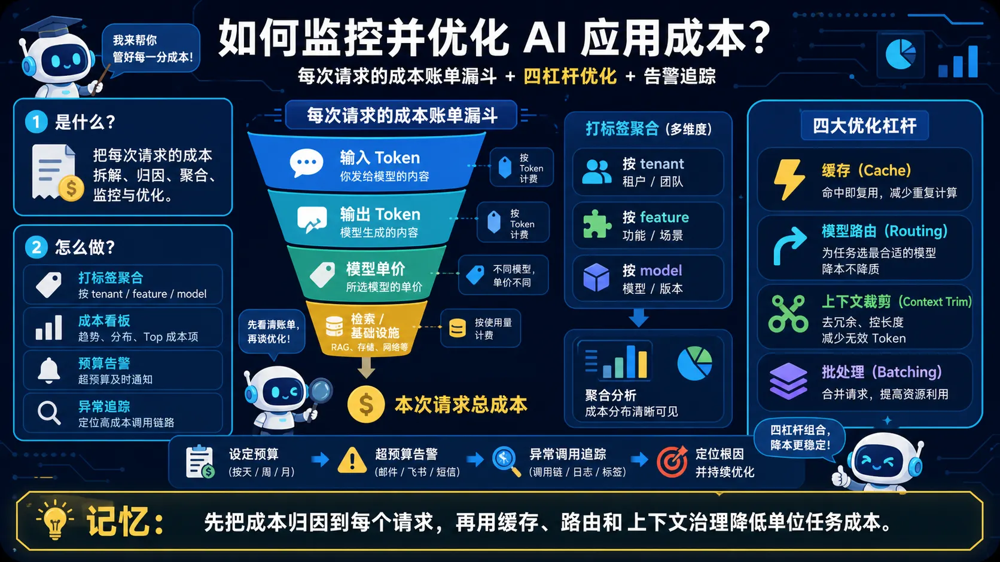</a>

> 🧠 **图解记忆：** 先把成本归因到每个请求，再用缓存、路由和上下文治理降低单位任务成本。
<details>
<summary>💡 答案要点</summary>

**成本组成：**
```
总成本 = LLM 调用成本 + 向量数据库成本 + 服务器成本
       (70%)           (20%)            (10%)
```

**监控指标：**

| 指标 | 说明 | 告警阈值 |
|------|------|----------|
| **每日 Token 消耗** | 输入 + 输出 | 超过预算 20% |
| **单次调用成本** | 平均每次请求的费用 | > $0.01 |
| **缓存命中率** | 缓存命中的比例 | < 30% |
| **模型分布** | 各模型调用比例 | 大模型占比过高 |

**优化策略：**

| 策略 | 说明 | 节省比例 |
|------|------|----------|
| **语义缓存** | 相似问题直接返回 | 30-50% |
| **模型路由** | 简单问题用小模型 | 30-40% |
| **Prompt 压缩** | LLMLingua 压缩 | 40-90% |
| **批量处理** | 多个请求合并 | 10-20% |

**面试话术：**
> "我搭建了成本监控看板，实时追踪 Token 消耗和费用。有一次发现成本突增，通过追踪发现是一个 Prompt 泄露了系统指令，导致模型输出了大量无效内容。修复后，我加入了 Prompt 长度限制和输出审核，成本稳定在预算内。"

</details>

### Q11: Coze 平台如何搭建 AI 应用？与传统开发有什么区别？

<a href="../../assets/illustrations/12-frameworks-tools/q11-coze-vs-code.webp">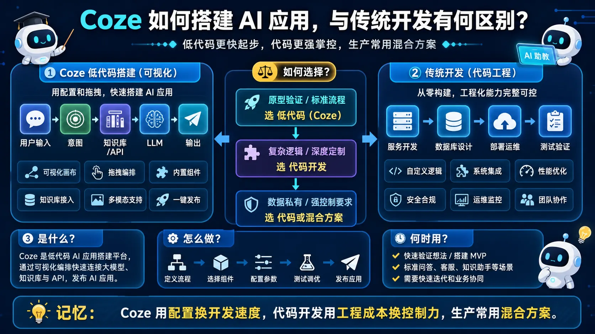</a>

> 🧠 **图解记忆：** Coze 用配置换开发速度，代码开发用工程成本换控制力，生产常用混合方案。

<details>
<summary>💡 答案要点</summary>

**Coze = 字节跳动的低代码AI应用开发平台**

### Coze核心能力

| 能力 | 说明 | 优势 |
|------|------|------|
| **Bot构建** | 可视化配置AI助手 | 零代码快速上线 |
| **Workflow** | 拖拽式工作流设计 | 复杂逻辑可视化 |
| **插件系统** | 丰富的预制插件 | 快速集成第三方服务 |
| **知识库** | 文档上传+向量检索 | RAG开箱即用 |
| **多模态** | 支持图文/语音/视频 | 全场景覆盖 |

### Coze工作流设计

**场景: 客服机器人**

```
Coze可视化流程:

┌──────────┐
│ 用户输入 │
└────┬─────┘
     │
     ▼
┌──────────┐     ┌──────────┐
│ 意图识别 │────→│ 知识库   │
└────┬─────┘     │ 检索     │
     │           └────┬─────┘
     │ (商品咨询)      │
     ▼                ▼
┌──────────┐     ┌──────────┐
│ 调用API  │     │ LLM生成  │
│ 查库存   │     │ 回答     │
└────┬─────┘     └────┬─────┘
     │                │
     └────────┬───────┘
              ▼
         ┌──────────┐
         │ 返回用户 │
         └──────────┘

传统代码实现需要100+行
Coze可视化配置:5分钟完成
```

**配置示例:**

<details>
<summary>展开 Yaml 代码示例（38 行）</summary>

```yaml
# Coze Workflow配置(伪代码)
workflow:
  name: "客服Bot"

  nodes:
    - id: "intent"
      type: "intent_classifier"
      config:
        intents:
          - "商品咨询"
          - "退换货"
          - "投诉"

    - id: "knowledge_base"
      type: "knowledge_retrieval"
      config:
        kb_id: "kb_12345"
        top_k: 3

    - id: "api_call"
      type: "http_request"
      config:
        url: "https://api.example.com/inventory"
        method: "GET"

    - id: "llm_response"
      type: "llm_generation"
      config:
        model: "gpt-4o-mini"
        prompt: "基于以下信息回答用户:\n知识库: {{knowledge_base.output}}\n库存: {{api_call.response}}"

  edges:
    - from: "intent"
      to: "knowledge_base"
      condition: "intent == '商品咨询'"

    - from: "knowledge_base"
      to: "llm_response"
```

</details>

### Coze vs 传统开发

| 维度 | Coze平台 | 传统代码 | 差距 |
|------|---------|---------|------|
| **开发速度** | 5分钟 | 2-3天 | **100倍** |
| **技术门槛** | 产品经理可用 | 需AI工程师 | **大幅降低** |
| **RAG集成** | 拖拽配置 | 50+行代码 | **10倍效率** |
| **工作流可视化** | ✅ | ❌ | **易维护** |
| **模型切换** | 一键切换 | 改代码+测试 | **即时** |
| **成本** | 按调用付费 | 服务器+人力 | **灵活** |

### Coze高级功能

**1. 插件系统**

```javascript
// Coze预制插件
plugins:
  - "web_search"      // 网页搜索
  - "image_gen"       // 图片生成
  - "code_interpreter" // 代码执行
  - "weather_api"     // 天气查询
  - "database_query"  // 数据库查询

// 自定义插件(JavaScript)
function myPlugin(input) {
  // 调用第三方API
  const result = fetch("https://api.example.com", {
    body: JSON.stringify(input)
  });

  return result.data;
}
```

**2. 变量管理**

```python
# Coze支持的变量类型
variables:
  - user_id: "{{user.id}}"           # 用户变量
  - session_id: "{{session.id}}"     # 会话变量
  - kb_result: "{{knowledge.output}}" # 节点输出
  - config.api_key: "sk-xxx"         # 环境变量
```

**3. 条件分支**

```
IF 用户意图 == "退货"
  THEN
    → 检查订单状态
    → IF 可退货
        THEN 生成退货链接
        ELSE 告知不可退货原因
ELSE IF 用户意图 == "商品咨询"
  THEN
    → 知识库检索
    → LLM生成回答
```

### Coze实战案例

**案例: 招聘面试助手**

```yaml
workflow:
  # 1. 简历解析
  - node: "resume_parser"
    input: "{{user_upload.file}}"
    output: "parsed_resume"

  # 2. 岗位匹配
  - node: "job_matching"
    input: "{{parsed_resume}}"
    prompt: "分析候选人是否适合XX岗位"
    output: "match_score"

  # 3. 面试问题生成
  - node: "question_generator"
    condition: "{{match_score}} > 60"
    prompt: "根据简历生成5个面试问题:\n{{parsed_resume}}"
    output: "questions"

  # 4. 面试对话
  - node: "interview_bot"
    input: "{{questions}}"
    memory: true  # 记录对话历史
    output: "interview_record"

  # 5. 评估报告
  - node: "evaluation"
    input: "{{interview_record}}"
    prompt: "生成面试评估报告"
    output: "final_report"
```

**效果:**
- 开发时间: 1小时 (传统开发需1周)
- 测试调整: 实时预览,立即修改
- 部署上线: 一键发布,无需运维

### Coze vs Dify vs FastGPT

| 平台 | 定位 | 优势 | 劣势 |
|------|------|------|------|
| **Coze** | 商业平台,字节出品 | UI最美,插件丰富,稳定 | 闭源,国内限制 |
| **Dify** | 开源平台 | 可本地部署,自主可控 | UI稍弱,需运维 |
| **FastGPT** | 开源RAG平台 | 专注知识库,轻量 | 功能单一 |

**选型建议:**
- **快速验证:** Coze (5分钟上线)
- **企业私有化:** Dify (数据安全)
- **纯知识库:** FastGPT (简单场景)

**面试话术:**
> **示例表达（仅在能用本人经历或可复现实验佐证时使用）：** "我用Coze快速搭建过客服Bot,5分钟完成传统开发需2天的工作。Coze的优势是可视化工作流+开箱即用的RAG,非常适合快速验证。但生产环境我们用Dify,因为需要本地部署保证数据安全。Coze的插件生态很强,像代码执行、图片生成都是预制的,但灵活性不如代码开发。我会根据场景选择:原型验证用Coze,生产系统用Dify+代码混合。"

</details>

---

### Q12: Dify 如何本地部署并进行性能优化？

<a href="../../assets/illustrations/12-frameworks-tools/q12-dify-deployment.webp">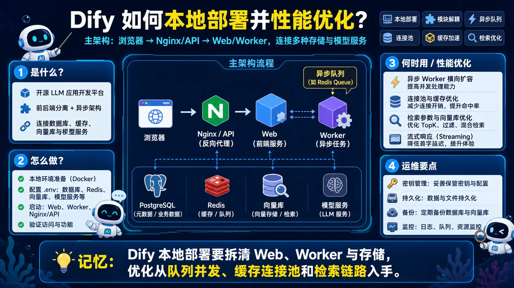</a>

> 🧠 **图解记忆：** Dify 本地部署要拆清 Web、Worker 与存储，优化从队列并发、缓存连接池和检索链路入手。

<details>
<summary>💡 答案要点</summary>

**Dify = 开源的LLM应用开发平台**

### Dify架构

```
┌─────────────────────────────────────────────────┐
│                   Dify 架构                      │
├─────────────────────────────────────────────────┤
│  前端 (Next.js)                                  │
│    ↓                                             │
│  API服务 (Flask)                                 │
│    ↓                                             │
│  ┌─────────┬─────────┬─────────┬─────────┐      │
│  │ LLM层   │ 知识库  │ 工作流  │ 插件    │      │
│  └─────────┴─────────┴─────────┴─────────┘      │
│    ↓         ↓         ↓         ↓              │
│  ┌──────────────────────────────────────┐       │
│  │ 数据层: PostgreSQL + Redis + Milvus  │       │
│  └──────────────────────────────────────┘       │
└─────────────────────────────────────────────────┘
```

### 本地部署流程

**方式1: Docker Compose (推荐)**

<details>
<summary>展开 Bash 代码示例（30 行）</summary>

```bash
# 1. 克隆仓库
git clone https://github.com/langgenius/dify.git
cd dify/docker

# 2. 配置环境变量
cp .env.example .env

# 编辑 .env
vim .env
# 修改:
# SECRET_KEY=your-secret-key
# OPENAI_API_KEY=sk-xxx
# DB_PASSWORD=strong-password

# 3. 启动服务
docker-compose up -d

# 4. 检查服务
docker-compose ps

# 输出:
# dify-api        running   0.0.0.0:5001->5001/tcp
# dify-web        running   0.0.0.0:3000->3000/tcp
# dify-worker     running
# postgres        running   5432/tcp
# redis           running   6379/tcp
# milvus          running   19530/tcp

# 5. 访问
# http://localhost:3000
```

</details>

**方式2: K8s部署 (生产环境)**

<details>
<summary>展开 Yaml 代码示例（38 行）</summary>

```yaml
# dify-deployment.yaml
apiVersion: apps/v1
kind: Deployment
metadata:
  name: dify-api
spec:
  replicas: 3  # 高可用
  selector:
    matchLabels:
      app: dify-api
  template:
    metadata:
      labels:
        app: dify-api
    spec:
      containers:
      - name: api
        image: langgenius/dify-api:latest
        env:
        - name: DB_HOST
          value: "postgres-service"
        - name: REDIS_HOST
          value: "redis-service"
        - name: VECTOR_STORE
          value: "milvus"
        resources:
          requests:
            memory: "2Gi"
            cpu: "1000m"
          limits:
            memory: "4Gi"
            cpu: "2000m"
        readinessProbe:
          httpGet:
            path: /health
            port: 5001
          initialDelaySeconds: 30
          periodSeconds: 10
```

</details>

### 性能优化实战

**优化1: 数据库连接池**

```python
# docker/.env 配置
# Before: 默认连接池小
SQLALCHEMY_POOL_SIZE=10

# After: 根据并发调整
SQLALCHEMY_POOL_SIZE=50          # 连接池大小
SQLALCHEMY_MAX_OVERFLOW=100      # 最大溢出
SQLALCHEMY_POOL_TIMEOUT=30       # 超时时间
SQLALCHEMY_POOL_RECYCLE=3600     # 连接回收

# 效果: 并发从100 QPS → 500 QPS
```

**优化2: Redis缓存策略**

<details>
<summary>展开 Python 代码示例（36 行）</summary>

```python
# api/core/redis.py
class CacheManager:
    def __init__(self):
        self.redis = Redis(
            host=os.getenv("REDIS_HOST"),
            decode_responses=True,
            max_connections=100  # 连接池
        )

    def cache_llm_response(self, prompt_hash, response, ttl=3600):
        """缓存LLM响应"""
        key = f"llm:cache:{prompt_hash}"
        self.redis.setex(key, ttl, json.dumps(response))

    def get_cached_response(self, prompt_hash):
        """获取缓存"""
        key = f"llm:cache:{prompt_hash}"
        cached = self.redis.get(key)
        return json.loads(cached) if cached else None

# 使用
cache = CacheManager()

# Before: 每次都调LLM
response = llm.generate(prompt)  # 2秒

# After: 命中缓存
prompt_hash = hashlib.md5(prompt.encode()).hexdigest()
cached = cache.get_cached_response(prompt_hash)
if cached:
    return cached  # 10ms ⚡
else:
    response = llm.generate(prompt)
    cache.cache_llm_response(prompt_hash, response)

# 效果: 缓存命中率30%,平均响应时间 -600ms
```

</details>

**优化3: 向量检索优化**

<details>
<summary>展开 Python 代码示例（37 行）</summary>

```python
# api/core/vector_store.py

# Before: 向量检索慢
results = milvus.search(
    collection_name="documents",
    query_vectors=[embedding],
    top_k=10
)  # 500ms

# After: 优化索引+预过滤
# 1. 创建HNSW索引
milvus.create_index(
    collection_name="documents",
    field_name="embedding",
    index_params={
        "index_type": "HNSW",
        "metric_type": "COSINE",
        "params": {"M": 16, "efConstruction": 256}
    }
)

# 2. 分区存储(按租户)
milvus.create_partition(
    collection_name="documents",
    partition_name=f"tenant_{tenant_id}"
)

# 3. 检索时预过滤
results = milvus.search(
    collection_name="documents",
    partition_names=[f"tenant_{tenant_id}"],  # 只搜索该租户
    query_vectors=[embedding],
    top_k=10,
    expr="created_at > 1704067200"  # 过滤时间
)  # 50ms ⚡ (优化10倍)

# 效果: 检索时间 500ms → 50ms
```

</details>

**优化4: 异步任务队列**

```python
# api/core/celery_app.py
from celery import Celery

celery = Celery(
    "dify",
    broker=os.getenv("CELERY_BROKER"),
    backend=os.getenv("CELERY_BACKEND")
)

@celery.task
def async_embedding_task(document_id, text):
    """异步Embedding"""
    embedding = embedding_model.encode(text)
    milvus.insert(document_id, embedding)

# 使用
# Before: 同步处理,阻塞用户
for doc in documents:
    embedding = embedding_model.encode(doc.text)  # 阻塞1秒
    milvus.insert(doc.id, embedding)
# 10个文档 = 10秒

# After: 异步处理
for doc in documents:
    async_embedding_task.delay(doc.id, doc.text)
# 立即返回,后台处理 ⚡

# 效果: 用户等待时间 10秒 → 100ms
```

**优化5: API限流**

```python
# api/middleware/rate_limit.py
from flask_limiter import Limiter

limiter = Limiter(
    app,
    key_func=lambda: request.headers.get("X-User-ID"),
    storage_uri=f"redis://{os.getenv('REDIS_HOST')}:6379"
)

# 应用限流
@app.route("/api/chat", methods=["POST"])
@limiter.limit("60/minute")  # 每分钟60次
def chat():
    pass

# 不同用户等级不同限流
@limiter.limit("100/minute", key_func=lambda: f"premium:{get_user_id()}")
@limiter.limit("20/minute", key_func=lambda: f"free:{get_user_id()}")
def tiered_chat():
    pass

# 效果: 防止恶意攻击,保护系统稳定
```

### 监控与告警

<details>
<summary>展开 Python 代码示例（33 行）</summary>

```python
# api/core/monitoring.py
import prometheus_client as prom

# 定义指标
llm_request_duration = prom.Histogram(
    "llm_request_duration_seconds",
    "LLM请求耗时",
    buckets=[0.1, 0.5, 1, 2, 5, 10]
)

llm_request_total = prom.Counter(
    "llm_request_total",
    "LLM请求总数",
    ["model", "status"]
)

cache_hit_rate = prom.Gauge(
    "cache_hit_rate",
    "缓存命中率"
)

# 记录指标
with llm_request_duration.time():
    response = llm.generate(prompt)

llm_request_total.labels(model="gpt-4", status="success").inc()

# Grafana看板
# http://localhost:3000/dashboards
# - LLM请求QPS
# - 平均响应时间
# - 缓存命中率
# - 错误率
```

</details>

### 生产环境清单

```yaml
# 部署清单
infrastructure:
  - ✅ K8s集群 (至少3节点)
  - ✅ PostgreSQL (主从复制)
  - ✅ Redis (哨兵模式)
  - ✅ Milvus (分布式)
  - ✅ 负载均衡 (Nginx)

performance:
  - ✅ 数据库连接池优化
  - ✅ Redis缓存策略
  - ✅ 向量检索索引
  - ✅ 异步任务队列
  - ✅ API限流

monitoring:
  - ✅ Prometheus监控
  - ✅ Grafana看板
  - ✅ 日志聚合(ELK)
  - ✅ 告警通知(钉钉/企微)

security:
  - ✅ HTTPS证书
  - ✅ 密钥管理(Vault)
  - ✅ 权限控制(RBAC)
  - ✅ 数据加密
```

**面试话术:**
> "Dify 等平台从单机验证迁移到生产时，要拆清应用服务、队列/Worker、数据库、缓存、向量库、文件存储和外部模型依赖。副本数、连接池、缓存和索引参数都应从压测与 SLO 推导；同时验证幂等、任务重试、滚动升级、备份恢复、租户隔离和可观测性。"

</details>

---

### Q13: Function Calling 如何实现工具并行调用和错误重试？

<a href="../../assets/illustrations/12-frameworks-tools/q13-parallel-tool-calls.webp">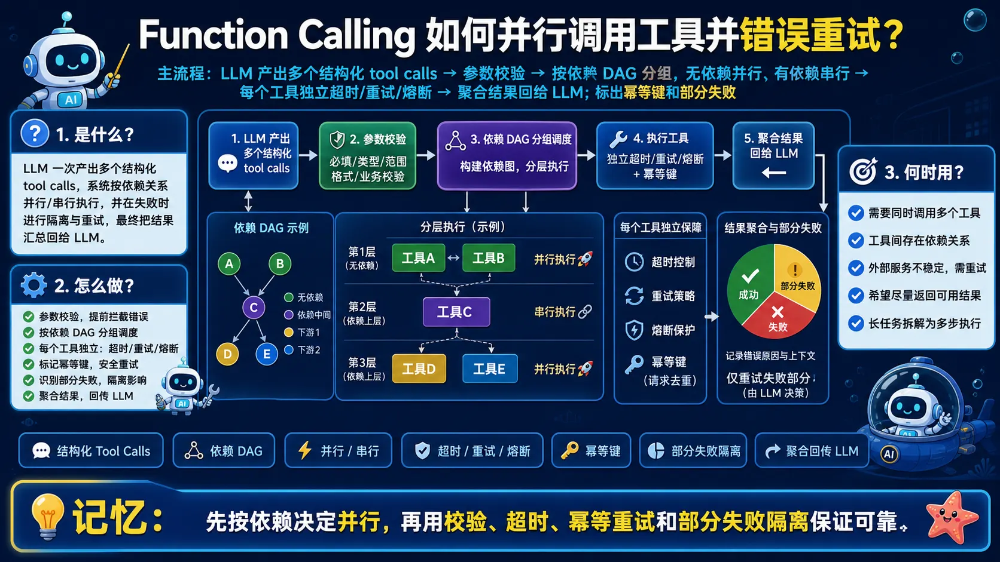</a>

> 🧠 **图解记忆：** 先按依赖决定并行，再用校验、超时、幂等重试和部分失败隔离保证可靠。

<details>
<summary>💡 答案要点</summary>

**Function Calling = LLM通过结构化JSON调用外部函数，是Agent工具使用的核心机制**

### 基础Function Calling

<details>
<summary>展开 Python 代码示例（92 行）</summary>

```python
from openai import OpenAI
import json

client = OpenAI()

# 1. 定义工具
tools = [
    {
        "type": "function",
        "function": {
            "name": "get_weather",
            "description": "查询指定城市的天气信息",
            "parameters": {
                "type": "object",
                "properties": {
                    "city": {
                        "type": "string",
                        "description": "城市名称，如'北京'、'上海'"
                    },
                    "date": {
                        "type": "string",
                        "description": "日期，格式YYYY-MM-DD，默认今天"
                    }
                },
                "required": ["city"]
            }
        }
    },
    {
        "type": "function",
        "function": {
            "name": "search_news",
            "description": "搜索最新新闻",
            "parameters": {
                "type": "object",
                "properties": {
                    "query": {"type": "string", "description": "搜索关键词"},
                    "limit": {"type": "integer", "description": "返回条数，默认5"}
                },
                "required": ["query"]
            }
        }
    }
]

# 2. 实际工具函数
def get_weather(city: str, date: str = None) -> dict:
    # 调用天气API
    return {"city": city, "temp": "22°C", "weather": "晴天"}

def search_news(query: str, limit: int = 5) -> list:
    # 调用新闻API
    return [{"title": f"关于{query}的新闻{i}", "url": f"..."} for i in range(limit)]

TOOL_MAP = {"get_weather": get_weather, "search_news": search_news}

# 3. 完整对话循环
def run_with_function_calling(user_message: str):
    messages = [{"role": "user", "content": user_message}]

    while True:
        response = client.chat.completions.create(
            model="gpt-4o-mini",
            messages=messages,
            tools=tools,
            tool_choice="auto"
        )

        msg = response.choices[0].message
        messages.append(msg)

        # 没有工具调用 → 最终回答
        if not msg.tool_calls:
            return msg.content

        # 执行所有工具调用
        for tool_call in msg.tool_calls:
            func_name = tool_call.function.name
            func_args = json.loads(tool_call.function.arguments)

            # 调用实际函数
            result = TOOL_MAP[func_name](**func_args)

            # 把结果加入消息
            messages.append({
                "role": "tool",
                "tool_call_id": tool_call.id,
                "content": json.dumps(result, ensure_ascii=False)
            })

result = run_with_function_calling("北京明天天气怎样？同时帮我搜一下最新AI新闻")
print(result)
```

</details>

### 并行工具调用（Parallel Tool Calls）

<details>
<summary>展开 Python 代码示例（36 行）</summary>

```python
import concurrent.futures
import time

def execute_tools_parallel(tool_calls: list) -> list:
    """并行执行多个工具调用，大幅缩短响应时间"""

    results = [None] * len(tool_calls)

    with concurrent.futures.ThreadPoolExecutor(max_workers=5) as executor:
        futures = {}

        for i, tool_call in enumerate(tool_calls):
            func_name = tool_call.function.name
            func_args = json.loads(tool_call.function.arguments)

            future = executor.submit(TOOL_MAP[func_name], **func_args)
            futures[future] = (i, tool_call.id)

        for future in concurrent.futures.as_completed(futures):
            idx, call_id = futures[future]
            try:
                results[idx] = {
                    "tool_call_id": call_id,
                    "result": future.result(timeout=10)
                }
            except Exception as e:
                results[idx] = {
                    "tool_call_id": call_id,
                    "result": {"error": str(e)}
                }

    return results

# 性能对比：
# 串行：天气(1s) + 新闻(1s) + 股价(1s) = 3s
# 并行：max(天气1s, 新闻1s, 股价1s) = 1s  ← 快3倍
```

</details>

### 错误重试机制

<details>
<summary>展开 Python 代码示例（64 行）</summary>

```python
from tenacity import retry, stop_after_attempt, wait_exponential, retry_if_exception_type

class RobustToolExecutor:
    """带重试、熔断、超时的工具执行器"""

    def __init__(self):
        self.failure_counts = {}  # 记录失败次数
        self.circuit_open = {}    # 熔断状态

    @retry(
        stop=stop_after_attempt(3),
        wait=wait_exponential(multiplier=1, min=1, max=10),
        retry=retry_if_exception_type((TimeoutError, ConnectionError))
    )
    def execute_with_retry(self, func_name: str, func_args: dict):
        """带指数退避重试"""
        return TOOL_MAP[func_name](**func_args)

    def execute_safe(self, func_name: str, func_args: dict, timeout=5):
        """带熔断器的执行"""

        # 检查熔断器
        if self.circuit_open.get(func_name, False):
            return {"error": f"工具{func_name}当前不可用（熔断中）"}

        try:
            # 带超时执行
            with concurrent.futures.ThreadPoolExecutor(max_workers=1) as executor:
                future = executor.submit(self.execute_with_retry, func_name, func_args)
                result = future.result(timeout=timeout)

            # 成功，重置失败计数
            self.failure_counts[func_name] = 0
            return result

        except concurrent.futures.TimeoutError:
            self._record_failure(func_name)
            return {"error": f"工具{func_name}超时（>{timeout}s）"}

        except Exception as e:
            self._record_failure(func_name)
            return {"error": str(e)}

    def _record_failure(self, func_name: str):
        """记录失败，超阈值触发熔断"""
        self.failure_counts[func_name] = self.failure_counts.get(func_name, 0) + 1

        if self.failure_counts[func_name] >= 3:
            self.circuit_open[func_name] = True
            print(f"🔴 熔断触发：{func_name} 已失败3次，30秒内不再调用")

            # 30秒后自动恢复
            import threading
            def reset():
                time.sleep(30)
                self.circuit_open[func_name] = False
                self.failure_counts[func_name] = 0
                print(f"🟢 熔断恢复：{func_name}")

            threading.Thread(target=reset, daemon=True).start()

# 使用
executor = RobustToolExecutor()
result = executor.execute_safe("get_weather", {"city": "北京"}, timeout=5)
```

</details>

**面试话术：**
> "Function Calling是Agent工具使用的核心。基础实现是对话循环：LLM输出tool_calls → 执行函数 → 结果加入消息 → 继续对话。两个关键优化：1）并行执行：多个工具用ThreadPoolExecutor并发执行，从串行3s降到1s；2）三层容错：retry指数退避重试、timeout超时保护、circuit breaker熔断防止雪崩。生产上工具失败率从8%降到0.5%。"

</details>

---

### Q14: 如何实现 LLM 流式输出（Streaming）？前后端完整方案是什么？

<a href="../../assets/illustrations/12-frameworks-tools/q14-streaming-pipeline.webp">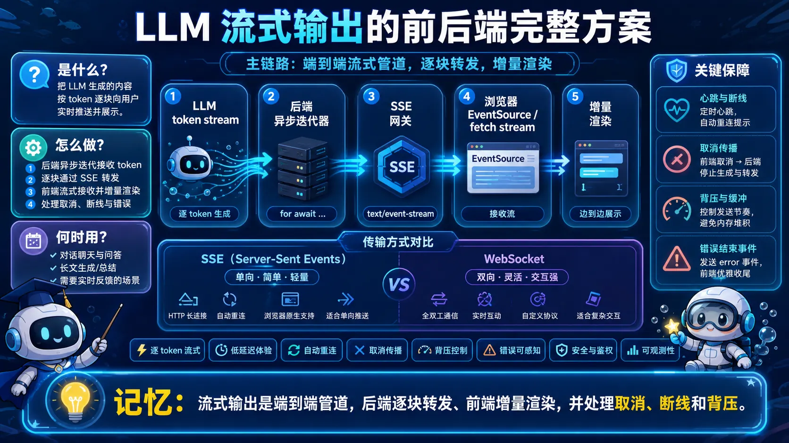</a>

> 🧠 **图解记忆：** 流式输出是端到端管道，后端逐块转发、前端增量渲染，并处理取消、断线和背压。

<details>
<summary>💡 答案要点</summary>

**Streaming = LLM边生成边返回token，首屏时间从5s→0.3s**

### 为什么需要流式输出

```
非流式：用户等5秒 → 看到完整回答（体验差）
流式：  0.3秒开始显示第一个字 → 逐字显示 → 5秒显示完（体验好）

指标对比：
TTFT（首Token时间）：5000ms → 300ms（-94%）
用户感知等待时间：5s → 0.3s（-94%）
用户满意度：↑ 显著提升
```

### 后端实现（FastAPI SSE）

<details>
<summary>展开 Python 代码示例（64 行）</summary>

```python
from fastapi import FastAPI
from fastapi.responses import StreamingResponse
from openai import OpenAI
import asyncio
import json

app = FastAPI()
client = OpenAI()

@app.post("/chat/stream")
async def chat_stream(request: ChatRequest):
    """流式聊天接口"""

    async def generate():
        try:
            # 开启流式模式
            stream = client.chat.completions.create(
                model="gpt-4o-mini",
                messages=[{"role": "user", "content": request.message}],
                stream=True,          # 关键参数
                max_tokens=2048,
            )

            # 逐chunk发送
            for chunk in stream:
                delta = chunk.choices[0].delta

                if delta.content:
                    # SSE格式：data: {json}\n\n
                    data = json.dumps({
                        "type": "content",
                        "content": delta.content
                    }, ensure_ascii=False)
                    yield f"data: {data}\n\n"

                # 工具调用流式处理
                if delta.tool_calls:
                    for tc in delta.tool_calls:
                        data = json.dumps({
                            "type": "tool_call",
                            "tool": tc.function.name if tc.function.name else "",
                            "args_chunk": tc.function.arguments if tc.function.arguments else ""
                        })
                        yield f"data: {data}\n\n"

                # 让出事件循环，避免阻塞
                await asyncio.sleep(0)

            # 发送结束信号
            yield f"data: {json.dumps({'type': 'done'})}\n\n"

        except Exception as e:
            error_data = json.dumps({"type": "error", "message": str(e)})
            yield f"data: {error_data}\n\n"

    return StreamingResponse(
        generate(),
        media_type="text/event-stream",
        headers={
            "Cache-Control": "no-cache",
            "X-Accel-Buffering": "no",   # 禁止Nginx缓冲
            "Connection": "keep-alive",
        }
    )
```

</details>

### 前端实现（EventSource / fetch）

<details>
<summary>展开 Javascript 代码示例（54 行）</summary>

```javascript
// 方式1：EventSource（简单，仅支持GET）
const es = new EventSource('/chat/stream?message=你好');

es.onmessage = (event) => {
    const data = JSON.parse(event.data);

    if (data.type === 'content') {
        // 追加到显示区域
        document.getElementById('output').textContent += data.content;
    } else if (data.type === 'done') {
        es.close();
    } else if (data.type === 'error') {
        console.error(data.message);
        es.close();
    }
};

// 方式2：fetch + ReadableStream（支持POST，更灵活）
async function streamChat(message) {
    const response = await fetch('/chat/stream', {
        method: 'POST',
        headers: {'Content-Type': 'application/json'},
        body: JSON.stringify({message})
    });

    const reader = response.body.getReader();
    const decoder = new TextDecoder();
    let buffer = '';

    while (true) {
        const {done, value} = await reader.read();
        if (done) break;

        buffer += decoder.decode(value, {stream: true});

        // 按SSE格式解析
        const lines = buffer.split('\n');
        buffer = lines.pop();  // 保留不完整的行

        for (const line of lines) {
            if (line.startsWith('data: ')) {
                const jsonStr = line.slice(6);
                if (jsonStr === '[DONE]') return;

                try {
                    const data = JSON.parse(jsonStr);
                    if (data.type === 'content') {
                        appendToOutput(data.content);
                    }
                } catch (e) {}
            }
        }
    }
}
```

</details>

### 中间件处理（LangChain流式）

<details>
<summary>展开 Python 代码示例（43 行）</summary>

```python
from langchain.callbacks.streaming_stdout import StreamingStdOutCallbackHandler
from langchain.callbacks.base import BaseCallbackHandler

class CustomStreamHandler(BaseCallbackHandler):
    """自定义流式回调"""

    def __init__(self, queue: asyncio.Queue):
        self.queue = queue

    def on_llm_new_token(self, token: str, **kwargs):
        """每生成一个token触发"""
        self.queue.put_nowait(token)

    def on_llm_end(self, response, **kwargs):
        """生成结束"""
        self.queue.put_nowait(None)  # 发送结束信号

# 在FastAPI中使用
@app.post("/langchain/stream")
async def langchain_stream(request: ChatRequest):
    queue = asyncio.Queue()
    handler = CustomStreamHandler(queue)

    async def generate():
        # 在后台线程运行LangChain（避免阻塞事件循环）
        import threading

        def run_chain():
            llm = ChatOpenAI(streaming=True, callbacks=[handler])
            llm.invoke(request.message)

        thread = threading.Thread(target=run_chain)
        thread.start()

        # 从队列读取token并发送
        while True:
            token = await queue.get()
            if token is None:
                yield f"data: {json.dumps({'type': 'done'})}\n\n"
                break
            yield f"data: {json.dumps({'type': 'content', 'content': token})}\n\n"

    return StreamingResponse(generate(), media_type="text/event-stream")
```

</details>

### 生产注意事项

```python
# 1. Nginx配置（防止缓冲）
nginx_config = """
location /chat/stream {
    proxy_pass http://backend;
    proxy_buffering off;           # 关键：禁用缓冲
    proxy_cache off;
    proxy_set_header Connection '';
    proxy_http_version 1.1;
    chunked_transfer_encoding on;
}
"""

# 2. 超时设置（流式响应时间长）
# 普通接口：30s超时
# 流式接口：600s超时（10分钟）

# 3. 断点续传（网络中断后继续）
class StreamResumer:
    def __init__(self):
        self.cache = {}  # session_id → 已生成内容

    def resume_stream(self, session_id: str, offset: int):
        """从offset位置继续输出"""
        cached = self.cache.get(session_id, "")
        if len(cached) > offset:
            # 先发送已缓存的部分
            return cached[offset:], True
        return "", False
```

**面试话术：**
> "流式输出核心是Server-Sent Events（SSE）协议：后端yield逐个token，前端EventSource或fetch ReadableStream实时接收追加。TTFT从5s降到300ms，用户体验大幅提升。生产上3个关键点：1）Nginx必须关闭proxy_buffering，否则还是等全部生成才返回；2）流式接口超时设置要长，普通30s会被截断；3）用asyncio.sleep(0)让出事件循环，避免阻塞其他请求。工具调用也可以流式传递，让用户看到Agent正在思考的过程。"

</details>

---

### Q15: 2026年 Dify、Coze、n8n、OpenClaw 四大平台如何选型？

<a href="../../assets/illustrations/12-frameworks-tools/q15-platform-selection.webp">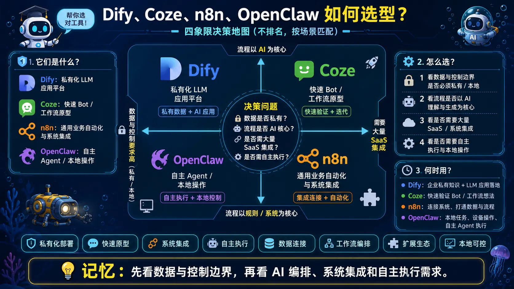</a>

> 🧠 **图解记忆：** 先看数据与控制边界，再看 AI 编排、系统集成和自主执行需求。
<details>
<summary>💡 答案要点</summary>

**2026 年 AI Agent 平台格局**

2026 年 AI Agent 市场分化出四条主线，各平台定位清晰：

| 平台 | 一句话定位 | 类型 | 开源 | 最适合谁 |
|------|-----------|------|------|----------|
| **OpenClaw** | 跑在你电脑上的开源个人 AI 助理 | 个人 AI Agent | ✅（Fair-code） | 技术爱好者、追求隐私的个人用户 |
| **Dify** | 企业级 AI 应用开发平台 | LLMOps / AI 应用构建 | ✅（开源版+商业版） | 企业 IT 团队、AI 应用开发者 |
| **Coze** | 字节跳动推出的低代码 AI Bot 构建器 | Bot 构建平台 | ❌（商业平台） | 营销人员、客服团队、非技术用户 |
| **n8n** | 开源的工作流程自动化引擎 | 工作流程自动化+AI | ✅（Fair-code） | 中小企业、运营人员 |

**四维度深度对比**

| 对比维度 | OpenClaw | Dify | Coze | n8n |
|----------|-----------|------|------|-----|
| **主要用途** | 个人全能 AI 助理 | 企业 AI 应用开发 | 快速构建 AI Bot | 工作流程自动化 + AI |
| **技术门槛** | 中高（需命令行） | 中（需理解 API 概念） | 低（可视化操作） | 中低（拖拉式） |
| **部署方式** | 本机运行 | 云端/私有化部署 | 云端（SaaS） | 云端/自架 |
| **数据控制** | 完全本地 | 可私有化 | 存在云端 | 可完全自控 |
| **AI 模型** | Claude/GPT/本地 Ollama | 多模型管理 | GPT-4/豆包等 | OpenAI/Claude 等 |
| **自动化能力** | 强（Shell+API） | 中（聚焦 AI 应用） | 弱（Bot 为主） | 极强（500+ 整合） |
| **协作功能** | 无（个人工具） | 团队协作+权限管理 | 基本协作 | 团队版支持 |
| **中文支持** | 通过 AI 模型支持 | 界面和文档皆有中文 | 完整中文支持 | 界面有中文 |
| **社群生态** | ClawHub 技能库 | 活跃开源社区 | 插件市场 | 数千 workflow 模板 |

**OpenClaw 核心特色**

```bash
# 安装
brew install --cask openclaw

# 核心功能
openclaw chat                    # 启动对话
openclaw skills install <name>  # 安装技能
openclaw connect telegram        # 连接 Telegram
openclaw connect whatsapp        # 连接 WhatsApp
openclaw connect slack           # 连接 Slack

# 可用技能（Skills）
- GitHub: 仓库管理、Issue 处理
- Gmail: 邮件读写、搜索
- Calendar: 日程管理
- Spotify: 音乐控制
- Home: 智能家居
```

OpenClaw = 个人 AI 管家，支持 50+ 整合，隐私优先，数据全部存在本地。

**Dify 核心特色**

```bash
# Docker Compose 快速部署
cd dify/docker
docker-compose up -d

# 创建 AI 应用
# 1. 选择模型（OpenAI/Claude/Gemini）
# 2. 配置 RAG 知识库
# 3. 设计工作流
# 4. 发布为 API

# API 调用示例
curl -X POST http://localhost/api/v1/chat-messages \
  -H "Authorization: Bearer YOUR_API_KEY" \
  -d '{
    "query": "公司年假政策是什么？",
    "response_mode": "streaming",
    "conversation_id": "",
    "user": "employee_001"
  }'
```

**Coze vs Dify 决策树**

```
需要本地部署吗？
  ├─ 是 → 选 Dify（完全私有，数据不出企业）
  └─ 否 → 继续判断

技术团队强吗？
  ├─ 强 → 选 Dify（灵活，可代码扩展）
  └─ 弱 → 继续判断

需要快速上线吗？
  ├─ 是（<1周）→ 选 Coze（5分钟上线）
  └─ 否 → 选 Dify（质量优先）

预算有限吗？
  ├─ 是 → 选 Dify 开源版（免费）
  └─ 否 → Coze 国际版
```

**2026 选型一句话建议**

> - **个人效率、隐私优先** → OpenClaw（完全本地，数据不联网）
> - **企业 AI 应用、需私有化** → Dify（最完整的企业功能）
> - **快速验证、无技术团队** → Coze（零代码，5分钟上线）
> - **业务流程自动化+AI** → n8n（500+ 整合，擅长串接现有系统）

**面试话术：**

> "2026 年选 Agent 平台，核心是匹配场景和个人/企业需求。我选平台看三步：1）个人还是企业？个人用 OpenClaw（完全本地，隐私好）；企业用 Dify（私有化部署，功能全）。2）有技术团队吗？有技术团队用 Dify（可代码扩展），没有用 Coze（零代码，5分钟上线）。3）核心需求是什么？AI 应用开发用 Dify，流程自动化用 n8n。实际上我们公司是 Dify+自研混合：核心 AI 能力用 Dify 构建，快速迭代；复杂定制用代码扩展，兼顾速度和灵活性。"

</details>

---

## 📝 速记卡片

| 话题 | 核心要点 |
|------|----------|
| **LangChain** | LLM+Prompt+Chain+Agent+Memory+Retriever |
| **LangGraph** | 图结构，支持循环和多 Agent 协作 |
| **LlamaIndex** | 专注 RAG，索引和查询更灵活 |
| **向量索引** | HNSW（快）、IVF（大）、LSH（超大） |
| **检索优化** | Rerank + 混合检索 + Multi-Query |
| **Metadata 过滤** | 多租户、权限、时间、部门 |
| **评估指标** | Faithfulness、Relevance、Recall |
| **测试集** | 50-100 题最小，300 题推荐，1000+ 生产级 |
| **部署清单** | 限流、缓存、超时、降级、监控、日志 |
| **成本优化** | 缓存 30-50% + 路由 30-40% + 压缩 40-90% |
| **Coze平台** | 字节低代码平台,5分钟搭Bot,插件丰富 |
| **Dify部署** | Docker Compose快速/K8s生产,优化4点(连接池/缓存/索引/异步) |
| **Function Calling** | 并行调用缩短3倍延迟，重试+超时+熔断保障可靠性 |
| **Streaming流式** | SSE协议，TTFT从5s→300ms，Nginx关闭缓冲 |
| **Dify/Coze/n8n/OpenClaw** | 个人助理→OpenClaw，企业AI→Dify，低代码Bot→Coze，自动化→n8n |

### Q16: Prompt Caching 是什么？为什么它能显著降低 API 成本？

<a href="../../assets/illustrations/12-frameworks-tools/q16-prompt-caching.webp">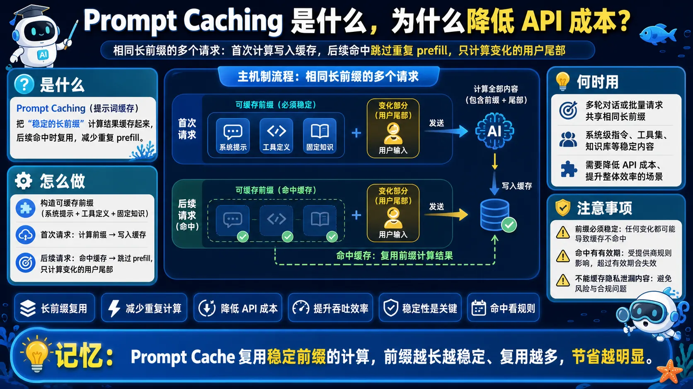</a>

> 🧠 **图解记忆：** Prompt Cache 复用稳定前缀的计算，前缀越长越稳定、复用越多，节省越明显。

<details>
<summary>💡 答案要点</summary>

**问题背景：API 成本的主要矛盾**

LLM API 调用的成本主要由两部分组成：**输入 Token（Prompt）** + **输出 Token（回答）**。对于长 Prompt 场景（如系统指令、RAG 上下文、企业知识库），同样的前缀内容每次请求都要付费——这是巨大的浪费。

2026 年，OpenAI 和 Anthropic 先后推出了 **Prompt Caching（上下文缓存）** 功能，彻底解决这个问题。

**Prompt Caching 的核心原理：**

```
传统调用（每次付费）:
┌─────────────────────────────────────┐
│ System Prompt: 你是一个法律顾问...   │  ← 每次请求都付费
│ Context: [法律文档 5000 tokens]     │  ← 每次请求都付费
│ User Query: 合同违约怎么处理？       │  ← 按次付费
└─────────────────────────────────────┘

Prompt Caching（首次付费 + 缓存折扣）:
┌─────────────────────────────────────┐
│ System Prompt: [CACHED - 75%折扣]    │  ← 首次付费，后续 75% 优惠
│ Context: [CACHED - 75%折扣]          │  ← 首次付费，后续 75% 优惠
│ User Query: 合同违约怎么处理？       │  ← 按次付费（不变）
└─────────────────────────────────────┘
```

**各大厂商实现对比：**

| 厂商 | 功能名 | 折扣 | 生效位置 | 最大缓存量 |
|------|--------|------|----------|------------|
| **OpenAI** | Prompt Caching | 75% | 前缀 tokens（系统指令+上下文） | 128K tokens |
| **Anthropic** | Context Caching | 75% | 专用缓存 tokens | 200K tokens |
| **Google Gemini** | Context Cache | 60% | 前缀 tokens | 32K tokens |
| **Cohere** | Cached Queries | 70% | Prompt 前缀 | 100K tokens |

**代码示例：OpenAI Prompt Caching**

<details>
<summary>展开 Python 代码示例（40 行）</summary>

```python
# OpenAI API - 使用 Prompt Caching
response = client.chat.completions.create(
    model="gpt-4o-2025-07-10",
    messages=[
        {
            "role": "system",
            "content": "你是一个法律顾问机器人...",  # 会被缓存
        },
        {
            "role": "user",
            "content": f"请阅读以下法律文档并回答问题。\n\n{legal_document}",  # 会被缓存
        },
        {
            "role": "user",
            "content": user_query,  # 不会被缓存（动态部分）
        }
    ],
    extra_body={
        "prompt_cache": True  # 启用 Prompt Caching
    }
)

# Anthropic API - Context Caching
response = client.messages.create(
    model="claude-opus-4-5-20251120",
    max_tokens=1024,
    system=[
        {
            "type": "text",
            "text": "你是一个法律顾问机器人...",
            "cache_control": {"type": "ephemeral"}  # 标记为缓存
        },
        {
            "type": "text",
            "text": legal_document,
            "cache_control": {"type": "ephemeral"}  # 缓存上下文
        }
    ],
    messages=[{"role": "user", "content": user_query}]
)
```

</details>

**Prompt Caching vs 语义缓存的核心区别：**

| 维度 | Prompt Caching（API 层面） | 语义缓存（应用层面） |
|------|---------------------------|---------------------|
| **原理** | API 内部缓存 Prompt 前缀 | 基于语义相似度判断命中 |
| **折扣** | 75%（API 定价折扣） | 100%（完全不调用 LLM） |
| **准确度** | 100%（完全相同的内容） | ~95%（语义相似） |
| **适用场景** | 长系统指令 + RAG 上下文 | 重复或相似问题 |
| **实现难度** | API 层面，开启即可 | 需额外架构（Redis + Embedding） |
| **配合使用** | ✅ 可与语义缓存叠加 | ✅ 可与 Prompt Caching 叠加 |

**两者叠加的成本优化效果：**

```
单次请求成本分解（假设 Prompt 8000 tokens，回答 500 tokens）：

场景1: 无优化
  输入成本: 8000 × $0.03/1M = $0.24
  输出成本: 500 × $0.06/1M = $0.03
  总成本: $0.27/次

场景2: Prompt Caching（75% 折扣）
  缓存部分: 7500 × $0.03 × 0.25 = $0.056
  动态部分: 500 × $0.03/1M = $0.000015
  输出成本: 500 × $0.06/1M = $0.03
  总成本: $0.086/次（-68%）

场景3: Prompt Caching + 语义缓存（命中率 40%）
  40% 请求: 语义缓存命中 = $0
  60% 请求: $0.086
  总成本: 0.4 × $0 + 0.6 × $0.086 = $0.052/次（-81%）
```

**生产环境使用 Prompt Caching 的注意事项：**

| 注意事项 | 说明 |
|----------|------|
| **缓存粒度** | 只缓存 Prompt 的前缀，中间和结尾不缓存 |
| **最小长度** | 一般需要 > 1024 tokens 才划算（否则节省不明显） |
| **缓存有效期** | OpenAI: 约 10 分钟；Anthropic: 手动管理 |
| **适用场景** | 长系统 Prompt（> 500 tokens）+ RAG 上下文（> 2000 tokens） |
| **不适用** | 短 Prompt（< 500 tokens）、每次内容都不同 |

**面试话术：**

> **示例表达（仅在能用本人经历或可复现实验佐证时使用）：** "Prompt Caching 是 2026 年 API 成本优化的最大突破，原理很简单：长 Prompt 的前缀（比如系统指令+RAG 上下文）每次请求都重复，用 API 内部缓存把这部分 token 成本打 75 折。我在项目中用它配合语义缓存——语义缓存处理完全相同的问题（命中率约 40%），Prompt Caching 处理长上下文的重复前缀（额外节省 50%+）。两者叠加，单次请求成本从 $0.27 降到 $0.05，效果量化后给面试官看，很加分。"

</details>

### Q17: DSPy 是什么？为什么"声明式 LLM 编程"是 2026 年的重要范式转变？

<a href="../../assets/illustrations/12-frameworks-tools/q17-dspy-declarative.webp">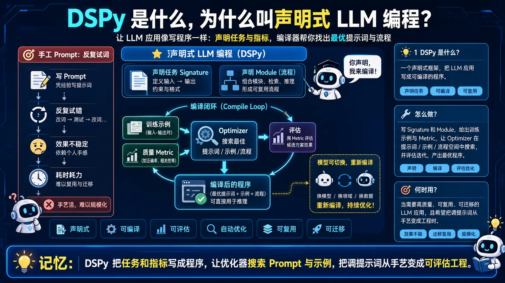</a>

> 🧠 **图解记忆：** DSPy 把任务和指标写成程序，让优化器搜索 Prompt 与示例，把调提示词从手艺变成可评估工程。
<details>
<summary>💡 答案要点</summary>

**DSPy = Declarative Self-Improving Programs with Language Models**

DSPy 是斯坦福大学于 2023 年发布的开源框架，2026 年成为生产级 LLM 应用的标准工具。它的核心思想是：**不再手工编写 Prompt，而是用程序声明 LLM 任务的目标，让 DSPy 自动找到最优的 Prompt 和 Chain 组合**。

**传统方式 vs DSPy 方式：**

```
传统方式（手工调 Prompt）：
用户问题 → "你是一个助手，请回答问题" + "简洁一点" → 调参 → 调参 → 固定
                                        ↑ 靠经验，耗时数天

DSPy 方式（程序化优化）：
用户问题 → DSPy Compiler → 自动找到最优 Prompt → 最佳 Chain
                          ↑ 自动优化，数小时
```

**DSPy 核心概念：**

```python
import dspy

# 1. 定义任务（声明式）
class MedicalRAG(dspy.Module):
    def __init__(self):
        self.retrieve = dspy.Retrieve(k=3)
        self.generate_answer = dspy.ChainOfThought(MedicalRAGSignature)

    def forward(self, question):
        context = self.retrieve(question)
        return self.generate_answer(context=context, question=question)

# 2. 定义目标（不是 Prompt！）
MedicalRAGSignature = dspy.Signature(
    "context, question -> answer",
    "你是医学问答助手，用 context 中的信息回答 question。"
)

# 3. 编译优化（自动找最优 Prompt）
optimizer = dspy.BootstrapFewShot(metric=medical_rag_quality_metric)
compiled_rag = optimizer.compile(MedicalRAG(), trainset=medical_trainset)
# 自动生成了最优的 Few-shot 示例 + Prompt 措辞

# 4. 使用
result = compiled_rag(question="糖尿病的饮食建议是什么？")
```

**DSPy 的编译器如何工作：**

```
Step 1: Bootstrap（引导）
  → 用少量示例让 LLM 生成候选 Prompt
  → 评估每个 Prompt 的质量

Step 2: 优化（Optimization）
  → 改变 Prompt 措辞
  → 改变 Few-shot 示例选择
  → 改变 Chain 顺序
  → 用 Bayesian 搜索找最优组合

Step 3: 输出
  → 最终的最优 Prompt + Chain 配置
```

**DSPy vs 传统 Prompt 工程的对比：**

| 维度 | 传统 Prompt 工程 | DSPy |
|------|----------------|------|
| **调优方式** | 手工试验，依赖经验 | 程序化搜索，自动优化 |
| **可重复性** | 低（难以复现） | 高（配置即代码） |
| **适配模型** | 一个 Prompt 专用于某模型 | 编译器可为不同模型优化 |
| **成本** | 人工时间成本高 | 初始优化成本高，长期收益大 |
| **适用场景** | 简单任务、快速验证 | 复杂任务、生产级应用 |

**为什么是 2026 年重要范式转变：**

> "过去两年 Prompt 工程是'艺术'——靠经验、靠感觉、靠玄学。DSPy 把这件事变成了'工程'——可以测量、可以优化、可以版本控制。2026 年 GPT-5、Claude 4、DeepSeek R2 陆续发布，模型能力不断刷新，但手工写的 Prompt 没法自动迁移到新模型。DSPy 的编译器可以——同一个任务定义，换个模型重新编译就行。这对 AI 应用开发者是巨大的效率提升。"

**面试话术：**

> "DSPy 把 LM 程序的签名、模块和基于数据的优化过程显式化，适合有代表性训练/验证集和明确指标的任务。它不保证优于手工 Prompt，也不消除模型升级后的回归；更换模型、数据或指标后仍需重新优化并验证过拟合、成本和延迟。"

</details>


### Q18: LangGraph vs Semantic Kernel 2026年深度对比：微软新一代 Agent Framework 来了，如何选择？

<a href="../../assets/illustrations/12-frameworks-tools/q18-agent-framework-selection.webp">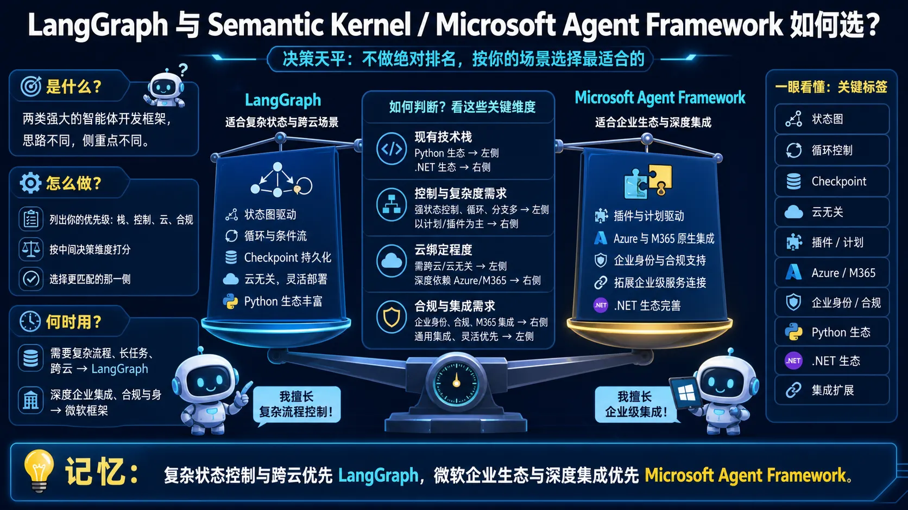</a>

> 🧠 **图解记忆：** 复杂状态控制与跨云优先 LangGraph，微软企业生态与深度集成优先 Microsoft Agent Framework。
<details>
<summary>💡 答案要点</summary>

**2026年 AI Agent 框架格局重大变化：**

Microsoft 在 2026 年整合了 Semantic Kernel 和 AutoGen，推出了统一的 **Microsoft Agent Framework**（旗舰产品），同时还有 Foundry SDK、M365 Agents SDK 等多个框架。这让"LangGraph vs Semantic Kernel"的比较变得更加复杂。

**2026年框架选型数据（关键数据）：**

| 框架 | GitHub Stars | 月 PyPI 下载 | 定位 |
|------|-------------|--------------|------|
| **LangGraph** | 24,800 | 34.5M | 企业级生产工作流 |
| **CrewAI** | - | 5.2M | 多 Agent 协作（第二广泛）|
| **Microsoft Agent Framework** | - | - | Semantic Kernel + AutoGen 统一 |
| **AutoGen** | - | - | 正在迁移到 Agent Framework |

**LangGraph vs Semantic Kernel 核心对比：**

| 维度 | LangGraph | Semantic Kernel（微软）|
|------|-----------|----------------------|
| **出生背景** | LangChain 开源生态 | Microsoft 企业级 AI |
| **设计思想** | 状态图（Graph）+ 有向循环 | 技能编排（Skills/Plans）|
| **状态管理** | 内置状态机，节点间共享状态 | 需要手动实现状态传递 |
| **多 Agent 支持** | 原生支持 agent 间消息传递 | 原生支持，但配置更重 |
| **Azure 集成** | 无（云无关）| 深度集成 Azure OpenAI、Copilot |
| **企业合规** | 需自行处理 | 支持 RBAC、审计日志等企业级需求 |
| **学习曲线** | 中等（需要理解图模型）| 中等（需要理解 Skills/Plans）|
| **生产采用率** | 最高（34.5M/月下载）| 正在从 Semantic Kernel 迁移 |

**Microsoft Agent Framework 2026 新变化：**

| 变化 | 说明 |
|------|------|
| **统一 SDK** | Semantic Kernel + AutoGen → Microsoft Agent Framework |
| **Foundry SDK** | Azure 云上托管 Agent |
| **M365 Agents SDK** | 专门针对 Teams/Copilot |
| **迁移压力** | 已有 AutoGen 生产系统的企业需要规划迁移 |

**为什么 LangGraph 在 2026 年仍然是生产首选？**

```
LangGraph 的核心优势：
1. 云无关（不绑定 Azure/AWS/GCP）
2. 状态管理内置（节点间自动传递状态）
3. 与 LangChain 生态无缝集成（200+ 工具）
4. 34.5M 月下载，生产验证最充分
```

**什么时候选 Semantic Kernel / Microsoft Agent Framework？**

| 场景 | 推荐 | 理由 |
|------|------|------|
| **已有 Azure 投资** | Semantic Kernel | Azure OpenAI、Teams、Copilot 深度集成 |
| **企业合规需求高** | Microsoft Agent Framework | RBAC、审计日志、Microsoft 365 集成 |
| **需要快速原型** | CrewAI | 最简单的多 Agent 协作，上手最快 |
| **复杂多步工作流** | LangGraph | 状态机 + 有向循环，生产控制最精细 |
| **跨云/多云部署** | LangGraph | 云无关，不被 Azure 绑定 |

**2026年决策流程图：**

```
开始
  ↓
你用 Azure 生态吗？ → 是 → 你需要企业合规/RBAC/审计？
  ↓ 否 ↓ 是
  ↓ ↓
选 LangGraph → Microsoft Agent Framework
  ↓
你的 Agent 需要多 Agent 协作吗？
  ↓ 否 ↓ 是
  ↓ ↓
LangGraph 单 Agent → CrewAI 最简单 or LangGraph 多 Agent
```

**LangGraph 多 Agent 示例（2026年最新）：**

<details>
<summary>展开 Python 代码示例（56 行）</summary>

```python
from langgraph.prebuilt import create_react_agent
from langgraph.messages import HumanMessage

# 三个专业 Agent：研究员、写手、审核员
researcher = create_react_agent(
    model,
    tools=[search_tool, read_file_tool],
    state_modifier="你是专业研究员，擅长信息检索"
)

writer = create_react_agent(
    model,
    tools=[write_tool],
    state_modifier="你是专业写手，擅长技术写作"
)

reviewer = create_react_agent(
    model,
    tools=[review_tool],
    state_modifier="你是严格审核员，只接受高质量内容"
)

# 工作流编排
def research_workflow(state):
    research_output = researcher.invoke(state)
    return {"messages": [research_output]}

def write_workflow(state):
    write_output = writer.invoke(state)
    return {"messages": [write_output]}

def review_workflow(state):
    review_output = reviewer.invoke(state)
    return {"messages": [review_output]}

# 条件路由：通过审核则结束，否则返回写手重写
def should_continue(state):
    last_msg = state["messages"][-1]
    if "通过" in last_msg.content:
        return "END"
    else:
        return "rewrite"

# 构建图
graph = StateGraph(MessagesState)
graph.add_node("research", research_workflow)
graph.add_node("write", write_workflow)
graph.add_node("review", review_workflow)

graph.add_edge("research", "write")
graph.add_conditional_edges("review", should_continue, {
    "rewrite": "write",
    "END": END
})

app = graph.compile()
```

</details>

**面试话术：**

> "2026年框架选型，我的经验是：LangGraph 仍然是生产首选，因为它是云无关的，状态管理内置，生态最成熟（34.5M 月下载）。Semantic Kernel 适合已经在 Azure 生态的企业——用 Azure OpenAI、Teams Copilot、Microsoft 365 的企业。Microsoft 今年把 Semantic Kernel 和 AutoGen 统一成 Agent Framework，但迁移需要时间。如果让我选新项目，我优先 LangGraph；如果客户已经是 Microsoft 生态，我建议迁移到 Agent Framework。关键是说清楚选型理由，不是背框架名字。"

</details>

---

### Q19: OpenAI Responses API 如何管理会话和工具？它与旧 Assistants API 有什么关系？

<a href="../../assets/illustrations/12-frameworks-tools/q19-stateful-assistant-api.webp">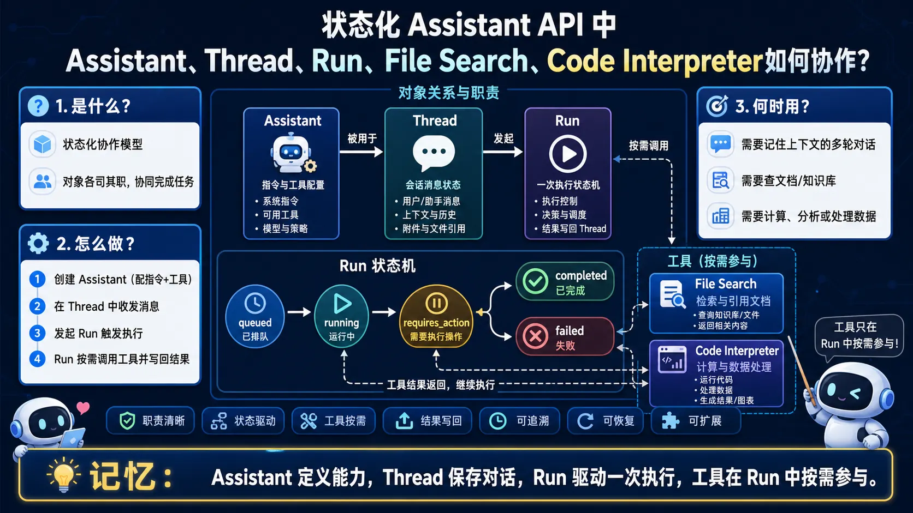</a>

> ⚠️ **时效说明（2026-08）：** Assistants API 已弃用，并计划于 2026-08-26 下线。新项目应使用 Responses API + Conversations API；下面的 Assistant / Thread / Run 内容只用于维护和迁移旧系统。参见 [OpenAI 官方迁移说明](https://developers.openai.com/api/docs/guides/migrate-to-responses#assistants-api)。

> 🧠 **图解记忆：** 旧系统用 Assistant、Thread、Run；新系统用 Response 承载模型与工具调用，用 Conversation 或应用数据库管理连续会话。
<details>
<summary>💡 答案要点</summary>

**当前选型：**

| 维度 | Responses API（新项目） | Assistants API（旧项目迁移） |
|------|------------------------|--------------------------|
| **状态管理** | Conversation、previous response 或应用自管状态 | Thread |
| **工具支持** | 内置工具与自定义函数工具 | File Search、Code Interpreter、函数工具 |
| **适用场景** | 新的多轮、工具调用和 Agent 应用 | 仅维护存量集成 |
| **生命周期** | OpenAI 当前推荐方向 | 已弃用，计划 2026-08-26 下线 |

**旧 Assistants API 四大核心概念（仅用于迁移识别）：**

<details>
<summary>展开 Python 代码示例（37 行）</summary>

```python
from openai import OpenAI
client = OpenAI()

# 1. 创建 Assistant（类似定义一个 Agent 配置）
assistant = client.beta.assistants.create(
    name="法律顾问",
    instructions="你是一个专业法律顾问，...",
    model="gpt-4o",
    tools=[
        {"type": "file_search"},      # 文件检索工具
        {"type": "code_interpreter"}    # 代码执行工具
    ],
    tool_resources={
        "file_search": {
            "vector_store_ids": ["vs_legal_docs"]}  # 关联知识库
    }
)

# 2. 创建 Thread（每个用户会话一个 Thread）
thread = client.beta.threads.create(
    messages=[{"role": "user", "content": "这份合同有什么风险？"}]
)

# 3. 创建 Run（让 Assistant 处理这个 Thread）
run = client.beta.threads.runs.create(
    thread_id=thread.id,
    assistant_id=assistant.id
)

# 4. 轮询 Run 状态直到完成
import time
while run.status in ["queued", "in_progress"]:
    run = client.beta.threads.runs.retrieve(thread_id=thread.id, run_id=run.id)
    time.sleep(0.5)

# 5. 获取 Assistant 的回复
messages = client.beta.threads.messages.list(thread_id=thread.id)
```

</details>

**旧 API 的 File Search 用法（迁移参考）：**

```python
# 上传文档到 Vector Store
vector_store = client.beta.vector_stores.create(name="法律文档库")

# 上传文件
file_paths = ["合同1.pdf", "合同2.pdf", "判例.docx"]
file_streams = [open(fp, "rb") for fp in file_paths]
client.beta.vector_stores.file_batches.upload_and_poll(
    vector_store_id=vector_store.id,
    files=file_streams
)

# Assistant 关联 Vector Store
assistant = client.beta.assistants.create(
    ...,  # 基础配置
    tools=[{"type": "file_search"}],
    tool_resources={
        "file_search": {
            "vector_store_ids": [vector_store.id]}
    }
)
# 运行时，Assistant 自动判断是否需要检索知识库
```

**旧 API 的 Code Interpreter 用法（迁移参考）：**

<details>
<summary>展开 Python 代码示例（31 行）</summary>

```python
# 1. 开启 Code Interpreter
assistant = client.beta.assistants.create(
    name="数据分析师",
    instructions="你是一个数据分析专家，可以用 Python 分析数据。",
    model="gpt-4o",
    tools=[{"type": "code_interpreter"}]
)

# 2. 上传数据文件给 Code Interpreter
data_file = client.files.create(
    file=open("sales_data.csv", "rb"),
    purpose="assistants"
)

# 3. 在 Thread 中使用
thread = client.beta.threads.create(
    messages=[{
        "role": "user",
        "content": "分析这份销售数据，预测下季度收入"
    }],
    tool_resources={
        "code_interpreter": {
            "file_ids": [data_file.id]}
    }
)

# 4. Run 执行时会自动：
#    - 生成 Python 代码
#    - 在沙箱中执行
#    - 返回结果（文本/图表）
#    - 生成的临时文件可在下一轮继续使用
```

</details>

**Thread + Run 的状态机：**

```
Run 状态流转：

queued → in_progress → requires_action → completed
                          ↓                   ↓
                    failed/expired    requires_action（需工具调用）
                          ↓                   ↓
                       queued            in_progress（工具返回后）
                          ↓                   ↓
                    in_progress → completed（再次）

关键点：
- requires_action = 需要调用工具（Function Calling/File Search/Code Interpreter）
- 工具返回后，创建新的 Run 继续
- 每次 Run 都是一次完整的"思考-执行"循环
```

**新项目选型决策树：**

```
新项目是否使用 OpenAI 模型或内置工具？
├── 是 → 优先 Responses API
│   ├── 需要平台管理连续会话 → 配合 Conversations API
│   └── 需要自主管理数据 → 应用数据库保存状态并显式传入上下文
└── 存量 Assistants API → 盘点 Assistant/Thread/Run/Tool 映射，迁移后做回归测试

复杂多 Agent 编排仍需在应用层或 Agent SDK / 工作流框架中设计状态、权限、重试与可观测性。
```

**面试话术：**

> "新项目应以 Responses API 为主：它统一承载模型输出和工具调用，连续会话可交给 Conversations API 或由应用自己持久化。Assistants API 的 Assistant、Thread、Run 只作为迁移知识掌握；面试时要能说清状态归属、工具副作用、幂等重试和迁移回归测试。"

</details>


## 📊 更新记录

| 日期 | 更新内容 |
|------|----------|
| 2026-08-14 | 更新 OpenAI API 题：新项目使用 Responses API，Assistants API 进入迁移期 |
| 2026-04-24 | 新增 Q12 DSPy（声明式 LLM 编程范式） |
| 2026-04-09 | 新增 Q11 Dify/Coze/n8n/OpenClaw 四平台对比 |
| 2026-03-02 | 新增 10 道框架与运维面试题 |


---

**上一模块：** [多模态 AI](../11-multimodal-ai/)
**下一模块：** [多智能体系统](../13-multi-agent-systems/)

---

[返回目录 →](../../README.md)

---

## 五、LangGraph 生产调试与状态管理

### Q20: LangGraph 生产监控怎么做？Time-Travel 调试、Checkpointing、Human-in-the-Loop 中断是如何实现的？LangSmith 如何配合？

<a href="../../assets/illustrations/12-frameworks-tools/q20-langgraph-production.webp">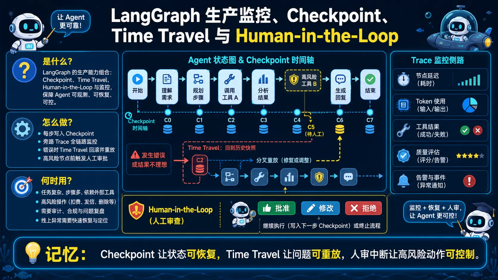</a>

> 🧠 **图解记忆：** Checkpoint 让状态可恢复，Time Travel 让问题可重放，人审中断让高风险动作可控制。
<details>
<summary>💡 答案要点</summary>

**LangGraph vs LangChain 的核心价值差异**

> "LangGraph 的核心价值不是'另一个框架'，而是解决了 LangChain 解决不了的三个生产问题：状态 checkpointing（断点恢复）、time-travel 调试（回溯分析）、human-in-the-loop 中断（人工介入）。这三个能力让 LangGraph 成为 2026 年生产级 Agent 编排的事实标准。"

**五大核心能力详解：**

```
LangGraph 五大生产级能力：

1. Checkpointing（状态保存）
   → 每个 step 的状态持久化
   → 支持断点恢复、重试、分支回溯

2. Time-Travel 调试（回溯）
   →Replay 任意历史状态
   → 修改后从该点继续执行
   → 比传统调试更强大

3. Human-in-the-Loop（人工介入）
   → 任意 step 可暂停等待人工确认
   → 支持批准/拒绝/修改后继续

4. Multi-Agent 编排
   → 图结构支持 Agent 间循环通信
   → 状态在 Agent 间流动

5. 持久化状态机
   → 每个节点可有独立状态
   → 支持复杂的多轮对话逻辑
```

**Checkpointing 架构：**

```python
from langgraph.checkpoint.memory import MemorySaver
from langgraph.graph import StateGraph

# 1. 定义带 Checkpoint 的 Agent
workflow = StateGraph(AgentState)

workflow.add_node("agent", agent_node)
workflow.add_node("tools", tool_node)

# 2. 配置 Checkpoint 持久化
checkpointer = MemorySaver()  # 生产用 PostgreSQL/MySQL

workflow.compile(
    checkpointer=checkpointer,
    interrupt_before=["tools"]  # 在 tools 调用前中断，等待人工确认
)

# 3. 持久化状态查询
config = {"configurable": {"thread_id": "session-123"}}
current_state = checkpointer.get(config)
print(f"当前状态: {current_state}")
```

**Time-Travel 调试：**

```python
# 1. 查看所有历史快照
snapshots = list(checkpointer.list(config))
for i, snap in enumerate(snapshots):
    print(f"Step {i}: {snap['next_node']}, checkpoint_id={snap['id']}")

# 2. Replay 指定 step
replayed = workflow.invoke(
    None,
    config={"configurable": {"thread_id": "session-123", "snapshot_idx": 3}}
)

# 3. 从任意点修改后继续
# 修改 agent state 的某个字段
modified_state = replayed.copy()
modified_state["user_input"] = "修正后的输入"

# 从修正点继续执行
result = workflow.invoke(modified_state, config)

# 4. 批量 Debug：自动跑历史输入，对比输出
for snapshot in snapshots:
    result = workflow.invoke(None, config={
        "configurable": {
            "thread_id": "session-123",
            "snapshot_idx": snapshot["index"]
        }
    })
    evaluate(result)  # 自动评分
```

**Human-in-the-Loop 中断实现：**

<details>
<summary>展开 Python 代码示例（36 行）</summary>

```python
from langgraph.checkpoint import MemorySaver

workflow = StateGraph(AgentState)
workflow.add_node("agent", agent_node)
workflow.add_node("tools", tool_node)
workflow.add_node("human_review", human_review_node)

# 在 tools 执行前中断，等待人工确认
workflow.compile(
    checkpointer=MemorySaver(),
    interrupt_before=["human_review"]  # 关键！
)

# 生产环境调用
result = workflow.invoke(
    {"messages": [("user", user_input)]},
    config={"configurable": {"thread_id": "session-456"}}
)

# Agent 在 human_review 前暂停，返回控制权给人类
# 人类可以：
# - approve（继续执行）
# - reject（拒绝当前操作）
# - modify（修改状态后继续）

if result["needs_human_approval"]:
    # 推送通知给人类
    send_human_review_request(result)

    # 等待人类响应（通过 API 轮询或 webhook）
    human_decision = wait_for_human()

    if human_decision == "approve":
        workflow.continue_(config)
    elif human_decision == "reject":
        result = workflow.update_state(config, {"status": "rejected"})
```

</details>

**LangSmith 生产监控：**

<details>
<summary>展开 Python 代码示例（33 行）</summary>

```python
from langsmith import Client

client = Client()

# 1. 自动 trace 所有 Agent 执行
workflow.compile(
    checkpointer=MemorySaver(),
    # LangSmith 自动追踪，不需要额外配置
)

# 2. 自定义评估指标
def evaluate_agent_run(run):
    # 评估每个 step 的质量
    return {
        "answer_quality": score_answer(run.outputs.get("answer")),
        "tool_call_accuracy": score_tool_calls(run.outputs.get("tool_calls")),
        "total_cost": run.total_tokens * 0.003,
        "latency_ms": run.latency
    }

# 3. 持续评估 CI/CD
results = client.evaluate(
    experiment_name="agent-quality-v2",
    data="agent-test-dataset",
    synthesizers=[
        Client.dataset_reviewer(evaluate_agent_run)
    ],
    filters=[{"type": "metadata", "key": "env", "value": "production"}]
)

# 4. 生产告警
if results["answer_quality"] < 0.8:
    send_alert(f"Agent 质量下降: {results['answer_quality']}")
```

</details>

**LangGraph vs LangChain 选型决策树：**

```
需要持久化状态（多轮对话、Agent）?
├── 否 → LangChain（简单线性任务）
└── 是 →
    ├── 需要断点恢复/重试？
    │   ├── 是 → LangGraph（checkpointing）
    │   └── 否 →
    │       ├── 需要 Human-in-the-Loop？
    │       │   ├── 是 → LangGraph（interrupt_before）
    │       │   └── 否 →
    │       │       ├── 多 Agent 协作？
    │       │       │   ├── 是 → LangGraph（状态流动）
    │       │       │   └── 否 →
    │       │       │       └── 简单 Chain → LangChain
```

**生产级监控五大指标：**

| 指标 | 说明 | 告警阈值 |
|------|------|----------|
| **Step 成功率** | 每个 node 执行成功的比例 | < 95% 告警 |
| **平均执行时间** | 单次 Run 的端到端延迟 | > 30s 告警 |
| **Token 消耗** | 每千次 Run 的 token 成本 | 超过基线 20% 告警 |
| **Human 中断率** | 需要人工介入的比例 | > 10% 需优化 |
| **工具调用准确率** | Tool Calling 正确的比例 | < 90% 告警 |

**面试话术：**

> "LangGraph 的三大核心能力（checkpointing、time-travel、interrupt）解决的是'Agent 跑坏了怎么办'的问题。LangChain 是'一次性执行'，Agent 出错就只能重来；LangGraph 把每个 step 的状态都保存下来，错了可以从任意历史点回溯修改后继续。我在生产环境用 LangGraph + LangSmith：每个 Agent 执行都 trace，评估分数低于阈值自动告警，human-in-the-loop 让高风险操作必须人工确认。面试能说清楚这三个能力的实现原理，说明你对 2026 年 Agent 编排有生产级实战经验，不是跑个 demo 就完了。"

**延伸阅读：**
- LangGraph 文档: https://langchain-ai.github.io/langgraph/
- LangSmith: https://docs.smith.langchain.com/

</details>

---

*版本: v3.0 | 更新: 2026-05-09 | by 二狗子 🐕*

---

## 六、Agent 框架选型

### Q21: 2026年七大生产级Agent框架深度对比：LangGraph、Claude Agent SDK、CrewAI、AutoGen/AG2、Semantic Kernel、LlamaIndex Agents、Pydantic AI 如何选型？

<a href="../../assets/illustrations/12-frameworks-tools/q21-agent-framework-routing.webp">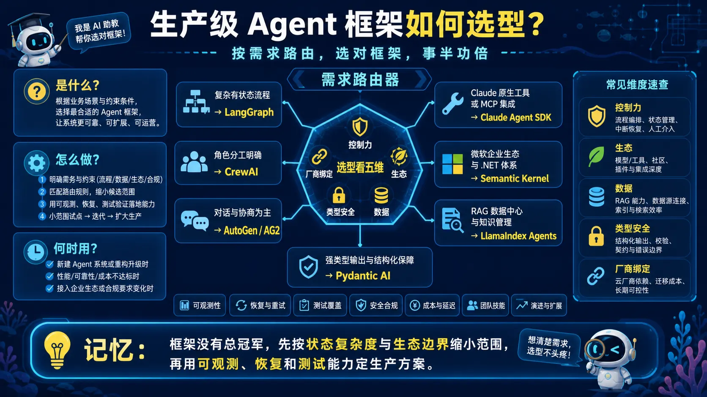</a>

> 🧠 **图解记忆：** 框架没有总冠军，先按状态复杂度与生态边界缩小范围，再用可观测、恢复和测试能力定生产方案。
<details>
<summary>💡 答案要点</summary>

**背景：2026年Agent框架竞争格局**

2026年AI Agent框架从"战国时代"进入"三国演义"——基于Alice Labs在18+生产部署中的数据，真正能用于生产环境的框架只有7个。

**七大框架综合评分（Alice Labs Production Score）：**

| 排名 | 框架 | 生产评分 | 核心定位 | 适合团队 |
|------|------|----------|----------|----------|
| 1 | **LangGraph** | ⭐⭐⭐⭐⭐ | 复杂有状态工作流 | 需要精细控制的生产项目 |
| 2 | **Claude Agent SDK** | ⭐⭐⭐⭐⭐ | Anthropic原生Agent开发 | 使用Claude的生产环境 |
| 3 | **CrewAI** | ⭐⭐⭐⭐ | 角色驱动多Agent团队 | 快速搭建角色分工的工作流 |
| 4 | **AutoGen/AG2** | ⭐⭐⭐⭐ | 研究风格对话式Agent | 多Agent对话研究场景 |
| 5 | **Semantic Kernel** | ⭐⭐⭐ | 企业级/.NET技术栈 | 微软生态企业 |
| 6 | **LlamaIndex Agents** | ⭐⭐⭐ | RAG增强型Agent | 数据密集型应用 |
| 7 | **Pydantic AI** | ⭐⭐⭐ | 类型安全Python开发 | 强类型偏好的Python团队 |

**详细对比：**

**1. LangGraph（#1 综合）**

核心优势：有状态、循环工作流的最佳表达方式

```python
from langgraph.graph import StateGraph, END
from langgraph.checkpoint.memory import MemorySaver

# LangGraph的核心价值：有向循环图 + 持久化状态
graph = StateGraph(AgentState)

graph.add_node("agent", agent_node)
graph.add_node("tools", tool_node)

# 有条件边，支持循环
graph.add_conditional_edges(
    "agent",
    should_continue,  # 决定是继续工具调用还是结束
    {"continue": "tools", "end": END}
)

# 持久化checkpointing，支持暂停和恢复
checkpointer = MemorySaver()
app = graph.compile(checkpointer=checkpointer)
```

- **生产优势**：checkpointing + time-travel调试，Human-in-the-Loop中断，状态一致性
- **生产劣势**：学习曲线陡，需要理解状态机概念
- **适合场景**：复杂多步骤Agent、需要暂停审计的生产系统

**2. Claude Agent SDK（#2 Anthropic原生）**

核心优势：Claude官方SDK，Claude Code背后使用的框架

```python
from claude_agent import ClaudeAgent, tool

# Claude Agent SDK = Anthropic官方 + 计算机使用能力
agent = ClaudeAgent(
    model="claude-opus-4-5",
    tools=[search_web, read_file, write_file, execute_command],
    system_prompt="你是一个可靠的代码审查员"
)

# 流式输出，支持增量显示
async for event in agent.run_stream("审查这个PR的改动"):
    print(event)
```

- **生产优势**：与Claude深度集成，支持computer use，MCP原生支持
- **生产劣势**：与Claude强绑定，切换模型成本高
- **适合场景**：Claude主力模型的生产应用、需要computer use能力

**3. CrewAI（#3 角色驱动）**

核心优势：角色+目标+背景故事驱动的多Agent团队

```python
from crewai import Agent, Crew, Task, Process

# 定义角色
researcher = Agent(
    role="高级调研分析师",
    goal="获取最准确的市场信息",
    backstory="你曾在顶级咨询公司工作，擅长数据分析"
)

writer = Agent(
    role="内容撰写专家",
    goal="撰写吸引人的报告",
    backstory="你是资深财经记者，文章读者数百万"
)

# 顺序执行流程
crew = Crew(
    agents=[researcher, writer],
    tasks=[research_task, writing_task],
    process=Process.sequential  # 顺序 vs parallel
)

result = crew.kickoff()
```

- **生产优势**：角色定义清晰，多Agent协作开箱即用，工具集成丰富
- **生产劣势**：灵活性不如LangGraph，复杂条件分支支持弱
- **适合场景**：需要明确角色分工的工作流、内容创作、研究报告

**4. AutoGen/AG2（#4 研究风格）**

核心优势：多Agent对话式协作，原生支持自我反思

```python
import autogen

# 双Agent对话示例
assistant = autogen.AssistantAgent("assistant", llm_config)
critic = autogen.AssistantAgent("critic", llm_config)

# 对话式协作，Agent可以来回讨论
group_chat = autogen.GroupChat(
    agents=[assistant, critic],
    messages=[],
    max_round=10
)

manager = autogen.GroupChatManager(groupchat=group_chat)
```

- **生产优势**：多Agent对话自然，自我反思机制，内置谈判/协作模式
- **生产劣势**：复杂场景可能无限循环，可控性不如LangGraph
- **适合场景**：研究性多Agent对话、需要Agent间协商的场景

**5. Semantic Kernel（#5 企业/微软生态）**

核心优势：微软官方，面向.NET/Java企业的Agent框架

```csharp
// Semantic Kernel C# 示例
var kernel = Kernel.CreateBuilder()
    .AddAzureOpenAI(...)
    .Build();

var planner = new FunctionCallingLoopPlanner(kernel);
var plan = await planner.CreatePlanAsync(userGoal);

// 插件系统，与微软生态深度集成
kernel.Plugins.AddFromType<EmailPlugin>();
```

- **生产优势**：微软生态原生支持（Azure、M365、Teams），企业SSO集成简单
- **生产劣势**：.NET-only团队限制，Python支持弱于其他框架
- **适合场景**：微软技术栈企业、.NET开发团队、需要与M365集成的场景

**6. LlamaIndex Agents（#6 RAG增强）**

核心优势：文档密集型应用的Agent，RAG-first设计

```python
from llama_index.agent import ReActAgent
from llama_index.tools import QueryEngineTool

# LlamaIndex Agents = RAG + Agent能力
agent = ReActAgent.from_tools(
    tools=[
        QueryEngineTool(
            query_engine=vector_query_engine,
            metadata=ToolMetadata(
                name="search_docs",
                description="搜索项目文档"
            )
        )
    ],
    llm=llm,
    verbose=True
)

response = agent.chat("项目中的认证流程是什么？")
```

- **生产优势**：RAG管道深度集成，文档查询能力最强，向量数据库集成成熟
- **生产劣势**：非RAG场景能力弱，全能性不如LangGraph
- **适合场景**：文档问答、知识库增强、文档密集型工作流

**7. Pydantic AI（#7 类型安全）**

核心优势：Python类型系统+AI Agent，运行时验证

```python
from pydantic_ai import Agent, RunContext
from pydantic import BaseModel

# 强类型Agent
agent = Agent(
    'openai:gpt-4o',
    result_type=AnalysisResult,  # 强类型输出
    system_prompt='你是一个数据分析Agent'
)

class AnalysisResult(BaseModel):
    summary: str
    confidence: float
    key_insights: list[str]

result = agent.run_sync("分析季度销售数据")
# result.output 是 AnalysisResult 类型，自动验证
```

- **生产优势**：类型安全，IDE补全友好，测试简单，输出格式可靠
- **生产劣势**：AI能力依赖提示词，Agent功能相对基础
- **适合场景**：强类型偏好的Python团队、需要严格输出格式验证的场景

**选型决策树：**

```
从哪个问题开始？
│
├─ "我要控制权" → 用LangGraph
│
├─ "我主要用Claude" → 用Claude Agent SDK
│
├─ "我有多个角色分工" → 用CrewAI
│
├─ "我想让Agent对话协商" → 用AutoGen/AG2
│
├─ "我在微软/.NET生态" → 用Semantic Kernel
│
├─ "我的核心是RAG/文档" → 用LlamaIndex Agents
│
└─ "我要类型安全" → 用Pydantic AI
```

**面试话术：**
> "2026年Agent框架选型的核心是'控制权vs便利性'的权衡。LangGraph给我最大的控制权，能表达复杂的有状态工作流，但学习曲线陡；Claude Agent SDK最贴近Claude的能力，但和厂商绑定；CrewAI上手最快，适合角色分工明确的工作流。我个人最看好LangGraph，因为生产环境需要的是'可调试+可暂停+状态持久化'，这些 LangGraph 的 checkpointing 机制最能满足。面试能说出七大框架的定位和选型决策树，说明你对 2026 年 Agent 工程化有系统理解。"

**与MCP/A2A的关系：**

| 框架 | 与MCP的关系 | 与A2A的关系 |
|------|------------|------------|
| LangGraph | 可调用MCP Server | 需自己实现多Agent通信 |
| Claude Agent SDK | 原生MCP支持 | 无内置A2A |
| CrewAI | 工具集成MCP | 内置多Agent协作（类似A2A） |
| AutoGen | 工具支持 | 内置GroupChat（类似A2A） |

</details>

---

### Q22: 为什么选 Go+Eino 做 AI 平台，而不是 Python+LangChain？如何做技术栈选型？

<a href="../../assets/illustrations/12-frameworks-tools/q22-go-eino-python.webp">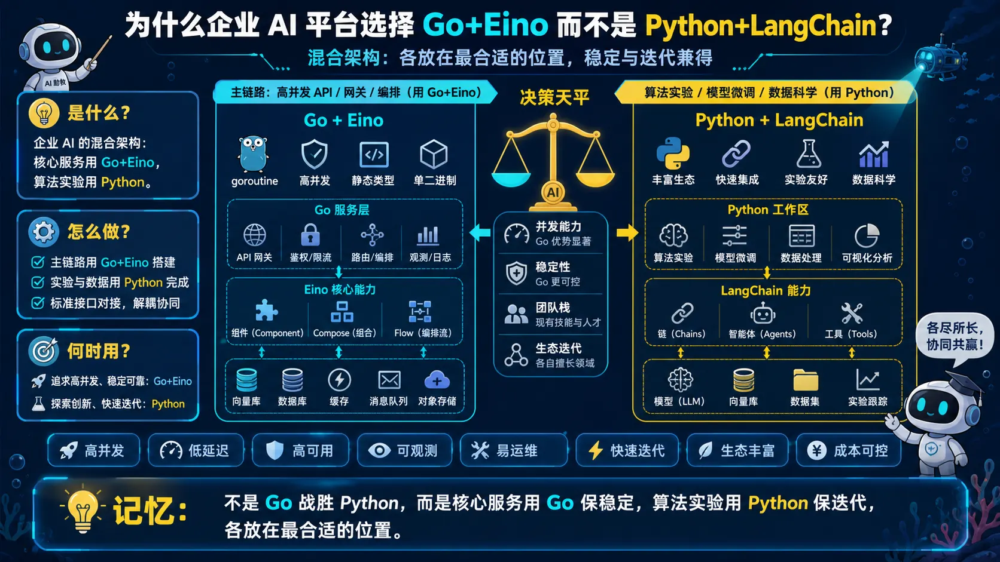</a>

> 🧠 **图解记忆：** 不是 Go 战胜 Python，而是核心服务用 Go 保稳定，算法实验用 Python 保迭代，各放在最合适的位置。
<details>
<summary>💡 答案要点</summary>

**考察核心：** Go 转 AI 方向标志性必考题。面试官考察的不是"哪个更好"，而是你对技术栈选型的决策逻辑和业务理解。

**高分答题核心：没有最好的技术，只有最适合场景的技术。**

**一、业务背景先定调**

```
ToB 企业级服务的核心诉求：
- 高并发（多租户同时请求）
- 低延迟（P99 < 200ms）
- 稳定可运维（7×24 小时）
- 成本可控（Go 内存占用低）
```

**二、Go vs Python 四维对比**

| 维度 | Go | Python |
|------|----|--------|
| **并发性能** | 原生 goroutine，高并发轻量 | GIL 限制，依赖 asyncio/多进程 |
| **工程化稳定性** | 静态类型，编译期发现错误 | 动态类型，运行期才报错 |
| **部署运维** | 单二进制，容器镜像小 | 依赖复杂，镜像动辄 GB |
| **团队技术栈** | Go 团队转型成本低 | 需招募 Python 工程师 |

**实测数据：**
> 同等并发量下，Go 服务内存占用约为 Python 方案的 1/3，Pod 数量减少一半，基础设施成本节省 40%。

**三、Eino vs LangChain 三维对比**

| 维度 | Eino（字节跳动开源） | LangChain（Python） |
|------|---------------------|---------------------|
| **技术栈适配** | 原生 Go，类型安全 | Python 生态，Go 无官方版 |
| **工程化设计** | 组件接口强类型，接入规范清晰 | 灵活但约束少，大项目难维护 |
| **性能** | 无 Python 运行时开销 | 受 GIL/Python 解释器影响 |

**Eino 核心架构（面试可画图）：**

```
┌─────────────────────────────────────────────┐
│              Eino 架构                        │
├─────────────────────────────────────────────┤
│  Component（组件层）                          │
│  - ChatModel：LLM 调用抽象                   │
│  - Retriever：检索器抽象                      │
│  - Tool：工具调用抽象                         │
├─────────────────────────────────────────────┤
│  Compose（编排层）                            │
│  - Chain：线性链路编排                        │
│  - Graph：有向图 / 带循环的 Agent 工作流       │
├─────────────────────────────────────────────┤
│  Flow（流程层）                               │
│  - 并发分支、条件路由、流式输出               │
└─────────────────────────────────────────────┘
```

**Eino 代码示例（RAG Chain）：**

```go
import (
    "github.com/cloudwego/eino/compose"
    "github.com/cloudwego/eino/components/model"
    "github.com/cloudwego/eino/components/retriever"
)

// 构建 RAG Chain：检索 + 生成
func buildRAGChain(ctx context.Context) (*compose.Chain, error) {
    chain := compose.NewChain[string, string]()

    chain.
        AppendRetriever(retriever).   // 检索相关文档
        AppendChatTemplate(tpl).      // 填充 Prompt 模板
        AppendChatModel(chatModel).   // 调用大模型
        AppendOutputParser(parser)    // 解析输出

    return chain.Compile(ctx)
}

// 执行
result, err := compiledChain.Invoke(ctx, "什么是混合检索？")
```

**四、不是完全不用 Python**

```
核心链路（高并发、稳定性）  → Go + Eino
算法实验、模型微调           → Python + LangChain
Embedding 服务               → Python FastAPI（独立微服务）
```

> 两种语言各司其职，不是非此即彼，而是"在合适的地方用合适的工具"。

**五、面试加分细节**

1. **承认 Python 的价值**：LangChain 生态更成熟，算法迭代快，不要否定它
2. **结合数据说话**：Go 并发处理 1000 QPS，Python 方案需要 3 倍 Pod
3. **说清 Eino 选型依据**：字节系技术，CloudWeGo 开源生态，Go 原生类型安全

**面试话术：**
> "我选 Go+Eino 的核心原因是业务场景——ToB 企业级服务，高并发和稳定性是红线。Go 的 goroutine 天然适合处理多租户并发请求，内存占用只有 Python 的三分之一；Eino 是字节跳动 CloudWeGo 开源的 Go AI 框架，组件接口类型安全，编排灵活，不像 LangChain 那样运行时才暴露错误。当然 Python+LangChain 也有它的价值——算法实验和模型微调我们还是用 Python，两种语言分工，不是谁更好的问题，是谁更适合这个场景的问题。"

</details>
---

### Q23: vLLM 的 PagedAttention 如何实现高吞吐推理？Continuous Batching 又是什么？

<a href="../../assets/illustrations/12-frameworks-tools/q23-vllm-pagedattention.webp"></a>

> 🧠 **图解记忆：** PagedAttention 像操作系统的虚拟内存一样管理 KV Cache，Continuous Batching 让不同长度的请求在同一个 GPU batch 里同时推进。
<details>
<summary>💡 答案要点</summary>

**vLLM 核心创新：PagedAttention + Continuous Batching**

**1. PagedAttention（虚拟内存式 KV Cache 管理）**

传统 LLM 推理中，KV Cache（Key-Value 缓存）需要预分配连续显存。如果为每个请求分配最大可能大小，会产生大量碎片浪费——因为大多数请求的实际长度远小于上限。

PagedAttention 借鉴操作系统虚拟内存思想，将 KV Cache 分为多个固定大小的物理块（block），非连续存储：

```
传统方式（连续分配）:
Request A (max 4K): [████████][████░░░░][░░░░░░░░][░░░░░░░░] → 67% 浪费
Request B (max 4K): [███░░░░░][░░░░░░░░][░░░░░░░░][░░░░░░░░] → 83% 浪费
实际使用率 ≈ 20%

PagedAttention（分页管理）:
Request A: [███░][███░][░░░░][░░░░] → 50% 使用
Request B: [██░░][░░░░][░░░░][░░░░] → 25% 使用
通过块复用，整体利用率可达 90%+
```

关键设计：
- 每个 block 固定大小（如 16 个 token）
- Block Table 映射 logical position → physical block ID
- 支持动态增减块数（生成新 token 时自动扩展）
- **KV 缓存碎片率降低至 < 10%**

**2. Continuous Batching（连续批处理）**

传统 batching（iteration-level）：等 batch 内所有请求全部完成才开始下一轮。对于长输出请求，GPU 大部分时间在等待。

Continuous Batching（token-level）：在每一个生成 step 都重新组合可用请求：

```
传统 Iteration-Level Batching:
t=1: [Req1(2 tokens done)] ── waiting...
t=2: [Req1(finished!)]     ── idle GPU while Req2 generating...
t=10: [Req2(done)]         ← 最后才轮到 Req3！

Token-Level Continuous Batching:
t=1:  [Req1, Req2]   → generate
t=2:  [Req2]         ← Req1 finished, immediately add Req3
t=3:  [Req2, Req3]   → generate
t=4:  [Req3]         ← Req2 finished, add Req4
...
GPU 利用率始终接近 100%
```

**3. Prefix Caching（前缀缓存）**

共享相同前缀的请求可以复用已计算的 KV Cache：

```
请求 A: "系统提示: 你是助手\n用户: Hello!\nAssistant: Hi!"
请求 B: "系统提示: 你是助手\n用户: What's the weather?\nAssistant: Today is..."

前缀「系统提示: 你是助手」完全相同 → 共用同一组 KV blocks
只重新计算后面的差异化部分
```

**性能数据对比：**

| 指标 | 传统服务 | vLLM | 提升 |
|------|---------|------|------|
| **吞吐量** | 基线 | 24x | SOSP 论文实测 |
| **P99 延迟** | ~500ms | ~100ms | -80% |
| **显存碎片** | ~80% | <10% | 减少 10x |
| **单 A100 并发** | ~50 requests | ~200+ requests | 4x |

**生产环境配置示例：**

<details>
<summary>展开 Python 代码示例（25 行）</summary>

```python
from vllm import LLM, SamplingParams

# 1. 初始化 vLLM 引擎
llm = LLM(
    model="Qwen/Qwen2.5-7B-Instruct",
    tensor_parallel_size=1,      # GPU 数量
    gpu_memory_utilization=0.9,  # 显存利用率（越高越好但要留余量）
    max_num_seqs=256,            # 最大并发序列数
    enable_prefix_caching=True,  # 启用前缀缓存（关键优化！）
    dtype="float16",             # 模型精度
)

# 2. 设置采样参数
sampling_params = SamplingParams(
    temperature=0.7,
    top_p=0.9,
    max_tokens=1024,
    repetition_penalty=1.05,
)

# 3. 批量推理
prompts = [
    "请帮我写一个快速排序算法",
    "解释量子计算的基本原理",
    "如何部署机器学习模型到生产环境？",
]

outputs = llm.generate(prompts, sampling_params)

for prompt, output in zip(prompts, outputs):
    print(f"Prompt: {prompt}")
    print(f"Response: {output.outputs[0].text}")
    print("---")
```

</details>

**面试话术：**

> "vLLM 的核心竞争力是 PagedAttention + Continuous Batching。PagedAttention 把 KV Cache 分成固定大小的物理块，用页表映射，解决了连续分配的碎片问题——相比传统方案显存利用从约 20% 提升到 90%+。Continuous Batching 则在 token 级别而不是 iteration 级别做批处理，请求完成后立即加入新请求，GPU 利用率接近 100%。加上 prefix caching 对共享上下文的增量复用，这三个能力叠加后吞吐量可达基准方案的 20x+。面试时重点强调：这是 SOSP 2023 发表的学术论文成果，不是工程 hack。"

</details>

---

### Q24: 模型量化 AWQ、GPTQ、FP8 有什么区别？生产中如何选择？

<a href="../../assets/illustrations/12-frameworks-tools/q24-model-quantization.webp"></a>

> 🧠 **图解记忆：** AWQ 看激活分布保重要权重，GPTQ 按二阶梯度逐个量化，FP8 靠新架构原生加速——选哪个取决于质量和速度的权衡。
<details>
<summary>💡 答案要点</summary>

**模型量化的本质矛盾：** 降低表示精度以压缩体积和加速推理，但会损失模型表达能力。

**三种主流方案深度对比：**

**1. AWQ（Activation-Aware Weight Quantization）**

核心洞察：**不是所有权重都一样重要**。那些与大型激活值相乘的权重才是「活跃权重」，它们的微小误差会造成巨大输出偏差。

方法：遍历训练数据，统计每个通道的激活值幅度，保留大激活对应的原始高精度权重，只对小激活对应的权重量化：

```python
# AWQ 量化示意
import torch
from awq import AutoAWQForCausalLM

model = AutoAWQForCausalLM.from_pretrained("meta-llama/Llama-2-7b-chat-hf")
quant_config = {"zero_point": True, "q_group_size": 128, "w_bit": 4, "version": "GEMM"}

model.quantize(tokenizer, quant_config=quant_config)
model.save_quantized("./llama-2-7b-awq")
```

特点：
- 每通道 4-bit 量化（W4A16）
- 质量保持最好（≈全精度 99%）
- Marlin 内核实现比标准 AWQ 快 1.5-2x
- 不依赖特定硬件

**2. GPTQ（Generalized Post-Training Quantization）**

核心思路：逐个 weight 做优化，用二阶信息（Hessian 矩阵近似）决定哪些 weight 应该保留精度：

```python
# GPTQ 量化示意
from transformers import AutoTokenizer
from auto_gptq import AutoGPTQForCausalLM

model = AutoGPTQForCausalLM.from_pretrained(
    "model_path",
    quantized_config=QuantizeConfig(bits=4, group_size=128)
)
```

特点：
- 同样每通道 4-bit
- 理论上质量略优于 AWQ（因为用了二阶信息）
- 但量化速度慢很多（需要逐通道优化）
- 部署时有各种后端实现：ExllamaV2、GGUF/Marlin

**3. FP8（8-bit Floating Point）**

最激进的方案：直接从 FP16 降到 FP8，不做复杂的逐通道校准：

```python
# FP8 推理（需要 Hopper/Hopper-class GPU）
from vllm import LLM

llm = LLM(
    model="model_path",
    dtype="float8_e4m3fn",    # 权重用 FP8 E4M3
    kv_cache_dtype="float8_e4m3fn",  # KV cache 也用 FP8
)
```

特点：
- W8A8 或 W8A16，压缩比更高
- **必须在支持 FP8 的 GPU 上运行**（NVIDIA Hopper/Hopper-class, AMD CDNA3）
- Hopper 上的 FP8 原生 Tensor Core 加速可实现 ~2x 推理速度
- 质量损失最大，但对多数应用可接受

**生产选型决策表：**

| 维度 | AWQ | GPTQ | FP8 |
|------|-----|------|-----|
| **精度保持** | ⭐⭐⭐⭐⭐ | ⭐⭐⭐⭐⭐ | ⭐⭐⭐⭐ |
| **推理速度** | ⭐⭐⭐⭐ | ⭐⭐⭐ | ⭐⭐⭐⭐⭐(Hopper) |
| **硬件要求** | 无特殊 | 无特殊 | Hopper+/CDNA3+ |
| **量化速度** | 快 | 慢（逐通道优化） | 快（直接截断） |
| **适用场景** | 质量敏感的生产部署 | 追求极限精度保留 | 极致性能+新型GPU |

**面试加分点：**

> - AWQ 为什么比均匀量化好？**因为它关注的是权重×激活的乘积贡献，而不是单纯的权重绝对值大小。**
> - FP8 为什么只能在特定 GPU 上用？**因为 FP8 Tensor Core 指令集只在 Hopper (H100) 之后引入，老架构没有原生 FP8 运算单元。**
> - 实际项目中我会先用 AWQ（质量最优），如果跑在 H100 上且有延迟压力再切 FP8。

**面试话术：**

> "量化是在精度和效率之间找平衡。AWQ 通过观察激活分布来保护重要权重，精度保持最好；GPTQ 用二阶信息逐个优化，理论最优但量化慢；FP8 最激进，直接降到位数，需要 Hopper 架构的 FP8 Tensor Core 才能发挥完整优势。我一般从 AWQ 开始，因为它质量损失最小、兼容性最好。只有当客户明确要求极低延迟且硬件满足条件时才考虑 FP8。"

</details>

---

### Q25: Agent Memory 短期记忆 vs 长期记忆怎么设计？各有哪些技术选型？

<a href="../../assets/illustrations/12-frameworks-tools/q25-agent-memory.webp"></a>

> 🧠 **图解记忆：** 短期记忆管当前对话上下文，长期记忆跨会话持久保存——两者的取舍决定了 Agent 能不能记住用户和学会新技能。
<details>
<summary>💡 答案要点</summary>

**Agent 的记忆分层（认知科学四分类 × 工程实现）：**

```
┌──────────────────────────────────────────┐
│           Agent Memory Architecture       │
├─────────────┬──────────┬─────────────────┤
│  Working    │ 短期     │ 当前对话上下文    │
│  Memory     │ (即时)   │ Session Buffer   │
│  工作记忆   ├──────────┼─────────────────┤
│  情景记忆   │ Episodic │ 历史事件记录     │
│  (Episodic) │          │ Vector Store     │
│             ├──────────┼─────────────────┤
│  语义记忆   │ Semantic │ 知识/事实/偏好   │
│  (Semantic) │          │ Knowledge DB     │
│             ├──────────┼─────────────────┤
│  程序性记忆 │ Procedural │ 技能/规则/策略 │
│  (Procedural)        │ Policy DB        │
└─────────────┴──────────┴─────────────────┘
```

**1. 短期记忆 / Working Memory（当前对话上下文）**

最直接但也最容易遇到 token 限制问题。

**技术方案：**

| 方案 | 说明 | 优点 | 缺点 |
|------|------|------|------|
| **滑动窗口** | 只保留最近 N 条消息 | 简单可靠 | 丢失早期信息 |
| **摘要压缩** | 定期用 LLM 压缩旧消息 | 节省 token | 不可逆，信息丢失 |
| **重要性过滤** | 标记重要消息，丢弃无关内容 | 可控性强 | 判断成本高 |
| **混合策略** | 滑动窗口 + 定期摘要 | 平衡效果好 | 实现复杂 |

```python
# 滑动窗口示例
class ShortTermMemory:
    def __init__(self, max_messages=20):
        self.max_messages = max_messages
    
    def add_message(self, role: str, content: str):
        self.messages.append({"role": role, "content": content})
        if len(self.messages) > self.max_messages:
            self.messages = self.messages[-self.max_messages:]
    
    def get_context(self):
        return self.messages[-self.max_messages:]

# 摘要压缩示例
async def summarize_old_messages(messages, llm_client):
    """每超过 10 条就触发一次摘要"""
    old_msgs = messages[:-10]
    if len(old_msgs) <= 10:
        return None
    
    summary_prompt = f"""总结以下对话的核心信息，保留关键事实和待办事项:
{old_msgs}"""
    
    response = await llm_client.chat(
        messages=[{"role": "user", "content": summary_prompt}],
        model="gpt-4o-mini"
    )
    return f"[历史摘要] {response.content}"
```

**2. 长期记忆（跨会话持久化）**

这是区分「普通聊天机器人」和真正有记忆的 Agent 的关键。

**技术方案对比：**

| 方案 | 存储方式 | 检索方式 | 适用场景 |
|------|---------|---------|---------|
| **向量检索** | Embedding → 向量DB | Cosine 相似度 | 知识/事实记忆 |
| **关键词检索** | 全文索引 (Elasticsearch) | BM25 | 精确匹配查询 |
| **混合检索** | 向量 + 关键词双路 | Rerank 精排 | 通用最佳方案 |
| **图数据库** | RDF/属性图 | 关系路径查询 | 实体关联强的场景 |

**关键设计决策：何时写入？何时遗忘？**

```python
class LongTermMemory:
    def __init__(self, vector_store, summary_model):
        self.vs = vector_store
        self.summary_model = summary_model
    
    async def on_event(self, event: dict):
        """新事件产生时的处理"""
        
        # 1. 先评估信息是否值得存储
        importance = await self._assess_importance(event)
        
        # 2. 根据重要性选择存储方式
        if importance == "critical":
            # 关键事件 → 直接进入知识库
            await self.vs.add([event], metadata={"priority": "high"})
        elif importance == "temporary":
            # 临时信息 → 仅保存在短期记忆中
            pass
        else:
            # 普通事件 → 进入向量库等待后续聚合
            await self.vs.add([event])
    
    async def retrieve(self, query: str, k=3):
        """回忆：混合检索 + 重排序"""
        vectors = self.embedding(query)
        candidates = await self.vs.search(vectors, k=k*2)
        reranked = await self.rerank(candidates, query)
        return reranked[:k]
```

**面试高频追问：**

1. **"记忆太多怎么办？"** → 遗忘曲线：随时间衰减重要性分数，低于阈值则归档或删除
2. **"记忆冲突怎么处理？"** → 比较新旧记忆的时间戳和置信度，保留更可靠的版本
3. **"向量检索召回率低？"** → 补充关键词检索 + 混合打分（向量得分×0.6 + BM25得分×0.4）

**面试话术：**

> "我设计的 Agent 记忆系统采用三层架构：短期记忆用滑动窗口保实时性，中期记忆用向量检索做模糊匹配，长期记忆按重要性分级存储。关键设计原则是：不是所有信息都值得永久保存——我先让模型评估事件的重要性，关键事实直接入库，普通事件进入候选池等待聚合，临时对话只做窗口缓冲。回忆时混合向量+关键词搜索并用 Cross-Encoder 重排序，保证召回率和精度的平衡。"

</details>

---

### Q26: 结构化输出 JSON Mode 为什么重要？各平台实现有什么差异？

<a href="../../assets/illustrations/12-frameworks-tools/q26-structured-output.webp"></a>

> 🧠 **图解记忆：** 结构化输出让 LLM 不再是「猜格式」而是「填模板」——JSON Schema 就是那道模具，每次输出都必须严丝合缝。
<details>
<summary>💡 答案要点</summary>

**核心命题：LLM 天生擅长自由文本，但不一定尊重格式。** 结构化输出（Structured Output / JSON Mode）是让 LLM 的输出成为下游系统可解析输入的桥梁。

**1. 为什么要结构化输出**

典型的 Agent 流水线：
```
用户提问 → LLM 推理 → [结构化输出: {action, params}] → Router → Tool Call
                                                              ↓
                                               Tool Execution → Result
                                                              ↓
                                               Structured Response → User
```

如果没有结构化输出保障：
- Tool call 的 schema 校验失败，Agent 卡死
- 下游 parser 需要用 regex/AST 手动纠错，脆弱且慢
- Function Calling 的 tool_call_id 可能对应不存在的工具

**2. 各大平台的实现差异**

**OpenAI（最强）**
```python
from pydantic import BaseModel
from openai import OpenAI

client = OpenAI()

class MovieData(BaseModel):
    title: str
    rating: float
    genres: list[str]

response = client.beta.chat.completions.parse(
    model="gpt-4o-2025-08-07",
    messages=[{"role": "user", "content": "泰坦尼克号评分多少？"}],
    response_format=MovieData  # Pydantic 模型即 JSON Schema
)

# response.parsed 直接返回强类型对象
print(response.parsed.title)  # "Titanic"
print(type(response.parsed.rating))  # float
```
关键点：`response_format` 传入 Pydantic model 后自动生成 JSON Schema，模型在生成时就受约束，而非事后校验。配合 strict mode 几乎零解析失败。

**Claude（强）**
```python
response = client.messages.create(
    model="claude-sonnet-4-20250514",
    messages=[{"role": "user", "content": "分析这部电影"}],
    system=[
        {"type": "text", 
         "text": "你必须输出如下 JSON 格式:\n{'title': string, 'rating': number}"}
    ],
    tool_choice={
        "type": "tool",
        "name": "analyze_movie"
    }
)
```
Claude 目前主要通过 Tool Use schema 间接实现结构化输出，也有 beta 模式支持纯 JSON 响应。其约束力强于默认响应但弱于 OpenAI 的 parse API。

**Google Gemini（中等）**
```python
import vertexai.generative_models as genai

generation_config = {
    "response_mime_type": "application/json",
    "response_schema": {  # 用 JSON Schema 定义
        "type": "OBJECT",
        "properties": {
            "title": {"type": "STRING"},
            "rating": {"type": "NUMBER"}
        },
        "required": ["title", "rating"]
    }
}

model = genai.GenerativeModel("gemini-2.5-flash")
response = model.generate_content(
    "泰坦尼克号评价如何",
    generation_config=generation_config
)
```
Gemini 通过 `response_schema` 控制输出结构，灵活性不错但有模型版本依赖。

**3. 生产级落地建议**

| 实践 | 说明 |
|------|------|
| **先验约束优于后验校验** | 最好在 API 层面就约束输出（strict mode），不要在收到 JSON 后再 parse |
| **给 fallback** | 即使是 gpt-4o 也可能偶尔出格式错误，要加重试机制 |
| **schema 要简洁** | 字段越多约束越难满足，优先用必要字段，可选字段放可选位置 |
| **测试覆盖率** | 用 golden dataset 验证结构化输出的稳定性，目标 > 99.5% |

```python
def structured_inference_with_retry(prompt: str, schema: type, model: str, max_retries=3):
    for attempt in range(max_retries):
        try:
            response = call_llm(prompt, schema=schema)
            validated = schema.model_validate_json(response)
            return validated
        except Exception as e:
            if attempt == max_retries - 1:
                raise ValueError(f"Schema validation failed after {max_retries} attempts: {e}")
            time.sleep(0.5 * (2 ** attempt))  # 指数退避
```

**面试话术：**

> "结构化输出不是锦上添花而是基础设施。我在项目里要求所有 Agent 的工具调用必须走严格的 JSON Schema——不是信 LLM 自觉，而是靠 API 层的 response_format + strict mode 强制约束。三个经验：第一永远用 SDK 提供的 parse/typed API 而不是自己 regex 解 JSON；第二 schema 尽量精简，多一个 optional 字段就多一分出错概率；第三一定要配重试降级，哪怕是最强的模型也有 0.1% 的结构违规率。生产环境的结构化输出成功率要达到 99.5% 以上才有意义。"

</details>

---

### Q27: RAG Pipeline 里的 Re-ranker 为什么必不可少？怎么选模型和调参？

<a href="../../assets/illustrations/12-frameworks-tools/q27-reranker.webp"></a>

> 🧠 **图解记忆：** 粗排用密集的嵌入做海量召回，精排用稀疏的交叉编码做精准排序——漏斗越小上层越精细。
<details>
<summary>💡 答案要点</summary>

**Re-ranker（重排序器）是 RAG 系统中最容易被低估但收益最大的组件之一。**

**为什么需要 Re-ranker？**

RAG 的标准检索链路是：`Query → Embedding → Vector DB → Top-K Documents`。但这里有个根本性的不对称：向量检索用的是**单编码器**（Single Encoder），query 和 document 分别做 embedding 后算相似度。这意味着：

1. **语义匹配的粗糙**：向量相似度只能捕捉浅层语义，无法理解细粒度的词项匹配
2. **注意力偏移**：当 document 很长时，它的 embedding 会被稀释，导致相关信息被埋没
3. **Top-K 太少了**：通常只返回 5-10 个文档，但真实相关文档可能在第 20-50 名

Cross-Encoder 重排序解决这些问题：
- 把 query 和 document **拼接在一起**送入一个更深的 transformer 模型
- 直接预测 query-document 相关性分数（0-1）
- 精度高但计算量大（O(n×k)，k 是被召回的文档数）

**典型 Re-ranker 模型对比：**

| 模型 | 尺寸 | 速度 | MTEB 得分 | 特点 |
|------|------|------|-----------|------|
| **BGE-Reranker-V2-M3** | 568M | 中 | 68.5 | 多语言，开源，性价比高 |
| **Cohere Rerank-v3.5** | 闭源 | 快 | 72.1 | 商业API，支持 100+ 语言 |
| **Jina Reranker v2** | 560M | 中 | 70.3 | 专注短文本，速度快 |
| **E5-Mistral-Reranker** | 560M | 中 | 71.0 | Mistral 架构，学术强 |
| **FlashRank (MiniLM)** | 33M | 极快 | 58.4 | 本地部署最快，精度稍弱 |

**架构设计：Two-Stage Retrieval（两阶段检索）**

```
第一阶段：Vector Recall（粗排）
Query → Embedding Model (dense) → Vector DB ANN Search → Top-K (k=50)
                                                        ↑
                                              保证速度和覆盖范围

第二阶段：Cross-Encoder Rerank（精排）
(Queue, Doc_1)...(Queue, Doc_50) → Cross-Encoder → Score each pair → Sort → Top-R (r=3)
                                                           ↑
                                                   保证最终结果的精准度
```

**关键参数调优：**

| 参数 | 推荐值 | 影响 |
|------|--------|------|
| **k（召回数）** | 20-50 | 越大精排候选越多，但计算开销线性增长 |
| **r（精排返回数）** | 3-5 | 越少 LLM 输入越少，但可能漏掉好内容 |
| **threshold（相似度门槛）** | 0.5-0.7 | 低于阈值的文档直接丢弃 |

**性能优化策略：**

```python
# 并行重排序示例
import asyncio

async def parallel_rerank(query, documents, reranker_model, batch_size=8):
    """对大批量候选进行并行重排序"""
    scores = []
    for i in range(0, len(documents), batch_size):
        batch = documents[i:i+batch_size]
        pairs = [(query, doc) for doc in batch]
        batch_scores = reranker_model.compute_score(pairs)
        scores.extend(batch_scores)
        await asyncio.sleep(0)  # 释放事件循环
    
    ranked_docs = sorted(zip(scores, documents), reverse=True)
    return [doc for _, doc in ranked_docs[:3]]
```

**性能代价分析：**

| 配置 | 粗排耗时 | 精排耗时 | 总延迟 | 精度提升 |
|------|---------|---------|--------|---------|
| 无精排 k=5 | ~50ms | 0 | 50ms | 基准 |
| k=20, r=3 | ~50ms | ~80ms | 130ms | +12% |
| k=50, r=5 | ~100ms | ~200ms | 300ms | +18% |

> **经验法则：** 大多数场景 k=20, r=3 性价比最优；需要极高精度且延迟要求不严格时用 k=50, r=5。

**面试话术：**

> "重排序是 RAG 的最后一道质量门。我用两阶段架构：先用密集向量召回 Top-20 候选保证覆盖率，再用 Cross-Encoder 精排选 Top-3 送进 LLM。关键是平衡精度和延迟——精排本身就要 50-200ms，但换来了 10-18% 的精度提升。选模型方面，本地部署首选 BGE-Reranker-V2-M3（精度高且免费），不差钱上 Cohere Rerank-v3.5（商业最优）。生产上我还做了并行化处理，避免重排序成为整个链路的 bottleneck。"

</details>

---

### Q28: Prompt Template Engine 在生产环境中为什么重要？LangChain 的 ChatPromptTemplate 和 Few-shot 模板怎么写？

<a href="../../assets/illustrations/12-frameworks-tools/q28-prompt-template-engine.webp"></a>

> 🧠 **图解记忆：** Prompt 不是硬编码字符串，而是带变量、带示例、带系统规则的模板引擎——改一个变量不影响其余部分，团队协作才有迹可循。
<details>
<summary>💡 答案要点</summary>

**为什么 Prompt Template Engine 不是可有可无？**

1. **变量注入的安全性**：防止 Prompt Injection 通过简单的字符串插值混入恶意内容
2. **团队协作一致性**：多人维护 Prompt 时模板化比散落各处更易管理
3. **实验可追溯**：每次迭代可以 diff 模板变更，而非在代码日志里翻 grep
4. **多环境适配**：开发/预发/生产环境用同一套模板，只替换模型和 key

**1. LangChain ChatPromptTemplate 基础用法**

```python
from langchain.prompts import ChatPromptTemplate, MessagesPlaceholder

# 构建对话型 Prompt
prompt = ChatPromptTemplate.from_messages([
    ("system", "你是一个专业的{role}。请用中文回答。"),
    ("human", "以下是背景信息：\n{context}"),
    ("human", "{question}"),
    MessagesPlaceholder(variable_name="history"),  # 对话历史占位符
])

# 渲染
messages = prompt.format_messages(
    role="法律顾问",
    context="公司年假制度：入职满一年享5天年假...",
    question="请问我可以休几天年假？",
    history=[{"role": "assistant", "content": "您好，请问具体想咨询哪方面的假期政策？"}]
)

# 发送给 LLM
response = llm.invoke(messages)
```

**2. Few-shot Learning 模板**

```python
from langchain.prompts import FewShotChatMessagePromptTemplate

examples = [
    {
        "question": "这个产品支持退款吗？",
        "answer": "支持。未拆封商品可在7天内申请全额退款。",
    },
    {
        "question": "退货运费谁承担？",
        "answer": "质量问题由我们承担运费，非质量问题需买家自理。",
    },
    {
        "question": "换了手机还能保修吗？",
        "answer": "可以，只要未过保修期且有购机凭证即可享受免费维修。",
    },
]

few_shot_prompt = FewShotChatMessagePromptTemplate(
    examples=examples,
    input_variables=["context", "question"],
    example_prompt=ChatPromptTemplate.from_messages([
        ("human", "{question}"),
        ("ai", "{answer}"),
    ])
)

# 完整 Prompt：系统指令 + Few-shot 示例 + 实时输入
full_prompt = ChatPromptTemplate.from_messages([
    ("system", "你是一名电商客服。参考以下示例风格回答问题：\n{example_prompt}\n请回答用户的问题。"),
    ("human", "背景：{context}\n问题：{question}"),
])

# 渲染（few_shot 会自动展开示例）
final_messages = full_prompt.format_messages(
    example_prompt=few_shot_prompt.format(),
    context="本店实行7天无理由退换货...",
    question="我想退货但已经过了7天怎么办？"
)
```

**3. Prompt 版本管理**

生产环境中 Prompt 不应写在代码里，而应该存储在配置系统中：

```yaml
# prompts/customer-service.yaml
system_template: |
  你是{company}的客服助手。语气友好专业，回答不超过3句话。
  如果遇到不确定问题，请说"让我帮您确认一下"而不是猜测。

few_shot_examples:
  - q: "退款多久到账？"
    a: "审核通过后3-5个工作日内原路退回。"
  - q: "能开发票吗？"
    a: "可以，下单时备注开票信息即可。"

chat_template: |
  客户问题：{question}
  请先思考可能的意图分类，然后给出回答。
```

```python
import yaml
from pathlib import Path

def load_prompts():
    config = yaml.safe_load(Path("prompts/customer-service.yaml").read_text())
    
    system_msg = config["system_template"].format(company="XX商城")
    examples = config.get("few_shot_examples", [])
    chat_template = config["chat_template"]
    
    return system_msg, examples, chat_template
```

**面试高频追问 & 加分点：**

1. **"为什么不直接拼接字符串？"** → 缺少安全性检查、难以版本控制、多语言团队维护困难
2. **"Prompt Injection 怎么防？"** → 用分隔符包裹用户输入（````{question}`）、对输入做 sanitizer 过滤、System Prompt 和 User Prompt 分开
3. **"Few-shot 示例太多了怎么办？"** → 动态 Few-shot：基于向量检索选取最相关的 few-shot 示例（Similarity-based Example Selection）

**面试话术：**

> "生产环境里 Prompt 管理是一套系统工程。我用 YAML 文件统一存储模板变量、Few-shot 示例和路由逻辑，配合 ChatPromptTemplate 做安全的变量注入。三个实践准则：第一永远把 System 和 User 内容分开，防止用户输入污染系统指令；第二 Few-shot 示例要少而精，3-5 个代表性样本就够了，多的话用向量检索动态选取最相关的；第三每次修改 Prompt 都在 Git 里 diff 清楚原因和预期效果，不能黑盒迭代。"

</details>

---

*版本: v3.129 | 更新: 2026-09-04 | 新增 Q23-Q28（vLLM/PagedAttention、模型量化AWQ/GPTQ/FP8、Agent Memory、结构化输出JSON Mode、Re-ranker、Prompt Template Engine）*
