# 🤖 AI Agent 面试题

> **面试优先顺序（通用 AI 应用开发岗位）**：Q3、Q4、Q6、Q7、Q9、Q10、Q12、Q14、Q15、Q16、Q17、Q18。其余题目用于进阶或特定岗位拓展；实际频率会随岗位和面试轮次变化，产品版本资讯不应当作通用必考题。

> **难度：** ⭐⭐⭐
> **考点：** 智能体设计模式、ReAct、Function Calling、多 Agent 协作

## 📋 目录

1. [核心框架与企业架构](#core-architecture)
2. [A2A + MCP 混合架构](#a2a-mcp)
3. [协作模式与协议边界](#collaboration-protocols)
4. [研究评估与 Critic 架构](#research-evaluation)
5. [职责分解与运行时编排](#runtime-orchestration)

<a id="core-architecture"></a>

## 一、基础概念题

## 前置知识

本模块默认已经掌握单 Agent 的定义、ReAct、Function Calling、循环控制和记忆。对应主答案见 [AI Agent 基础](../05-ai-agent-basics/)。

多 Agent 面试的重点不是把多个单 Agent 放在一起，而是说明任务为什么值得拆分，以及拆分后如何处理通信、状态、一致性、权限、成本和部分失败。

### Q1: AutoGen 如何实现对话式多 Agent 协作？

<a href="../../assets/illustrations/13-multi-agent-systems/q01-autogen-conversation.webp">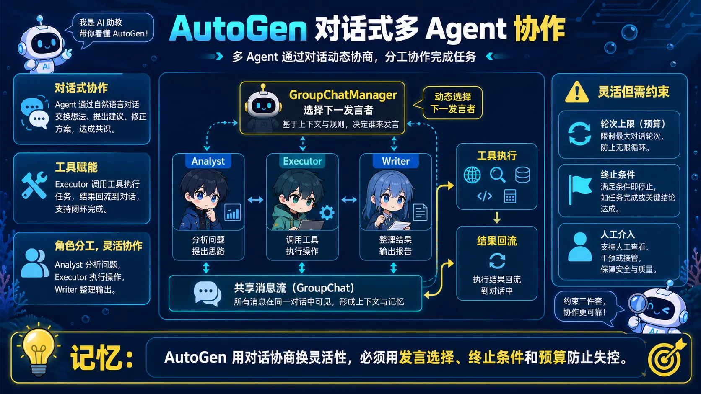</a>

> 🧠 **图解记忆：** AutoGen 用对话协商换灵活性，必须用发言选择、终止条件和预算防止失控。

<details>
<summary>💡 答案要点</summary>

**AutoGen = 微软开源的对话式多Agent框架**

### AutoGen核心理念

**通过Agent间对话完成复杂任务,而非预定义工作流**

```
传统工作流:
Agent A → Agent B → Agent C (固定顺序)

AutoGen对话式:
Agent A ←→ Agent B
    ↓          ↓
  Agent C ←→ Agent D
(动态协商,类似人类团队讨论)
```

### AutoGen核心组件

| 组件 | 类型 | 作用 |
|------|------|------|
| **UserProxyAgent** | 代理用户 | 执行代码/收集反馈/与用户交互 |
| **AssistantAgent** | AI助手 | 推理/生成方案/调用工具 |
| **GroupChat** | 多Agent管理 | 管理多Agent对话流程 |
| **GroupChatManager** | 调度器 | 决定下一个发言的Agent |

### AutoGen实战: 数据分析任务

**场景: 分析销售数据并生成报告**

<details>
<summary>展开 Python 代码示例（83 行）</summary>

```python
import autogen

# 1. 配置LLM
llm_config = {
    "model": "qwen3.5-plus",
    "api_key": "sk-xxx",
    "temperature": 0.7
}

# 2. 创建UserProxyAgent (执行代码)
user_proxy = autogen.UserProxyAgent(
    name="UserProxy",
    human_input_mode="NEVER",  # 自动执行,不需人工干预
    code_execution_config={
        "work_dir": "coding",
        "use_docker": False  # 本地执行Python代码
    }
)

# 3. 创建AssistantAgent (数据分析师)
data_analyst = autogen.AssistantAgent(
    name="DataAnalyst",
    llm_config=llm_config,
    system_message="""
    你是数据分析专家。
    任务: 分析销售数据,发现趋势,生成Python代码。
    要求: 使用pandas和matplotlib。
    """
)

# 4. 创建AssistantAgent (报告撰写者)
report_writer = autogen.AssistantAgent(
    name="ReportWriter",
    llm_config=llm_config,
    system_message="""
    你是商业报告撰写专家。
    任务: 将数据分析结果写成专业报告。
    要求: 包含关键发现、洞察和建议。
    """
)

# 5. 创建GroupChat
groupchat = autogen.GroupChat(
    agents=[user_proxy, data_analyst, report_writer],
    messages=[],
    max_round=10  # 最多10轮对话
)

# 6. 创建Manager
manager = autogen.GroupChatManager(
    groupchat=groupchat,
    llm_config=llm_config
)

# 7. 启动任务
user_proxy.initiate_chat(
    manager,
    message="""
    分析 sales_data.csv,生成月度销售报告。
    要求:
    1. 计算环比增长率
    2. 找出销售额最高的5个产品
    3. 生成趋势图
    4. 撰写200字分析报告
    """
)

# 8. 对话流程(自动进行)
"""
UserProxy: "分析sales_data.csv..." (发起任务)
    ↓
DataAnalyst: "我将用pandas读取数据..." (制定计划)
    ↓
UserProxy: 执行代码: pd.read_csv("sales_data.csv")
    ↓
DataAnalyst: "数据已读取,发现XX趋势,生成可视化代码..."
    ↓
UserProxy: 执行代码: plt.plot(...); plt.savefig("trend.png")
    ↓
ReportWriter: "根据分析结果,我撰写报告如下:..."
    ↓
UserProxy: "任务完成,报告已生成"
"""
```

</details>

### AutoGen高级特性

**特性1: 人类在环(Human-in-the-Loop)**

```python
# 关键决策需人工确认
user_proxy = autogen.UserProxyAgent(
    name="UserProxy",
    human_input_mode="ALWAYS",  # 每步都需确认
    # 或: "TERMINATE" - 只在终止前确认
)

# 对话流程:
"""
DataAnalyst: "我将删除销售额<100的数据"
UserProxy: [等待人工确认] → 输入 "y" 确认
DataAnalyst: "已删除,继续分析..."
"""
```

**特性2: 自定义发言顺序**

```python
def custom_speaker_selection(last_speaker, groupchat):
    """自定义下一个发言者"""

    # 规则1: DataAnalyst说完,让UserProxy执行代码
    if last_speaker.name == "DataAnalyst":
        return groupchat.agent_by_name("UserProxy")

    # 规则2: UserProxy执行完,检查是否需要报告
    if last_speaker.name == "UserProxy":
        if "数据分析完成" in groupchat.messages[-1]["content"]:
            return groupchat.agent_by_name("ReportWriter")
        else:
            return groupchat.agent_by_name("DataAnalyst")

    # 规则3: ReportWriter写完,终止
    if last_speaker.name == "ReportWriter":
        return None  # 终止对话

    return None

# 应用自定义策略
manager = autogen.GroupChatManager(
    groupchat=groupchat,
    llm_config=llm_config,
    speaker_selection_method=custom_speaker_selection
)
```

**特性3: 工具调用集成**

```python
# 定义工具函数
def query_database(sql: str) -> str:
    """查询数据库"""
    conn = sqlite3.connect("sales.db")
    df = pd.read_sql(sql, conn)
    return df.to_string()

def send_email(to: str, subject: str, body: str) -> str:
    """发送邮件"""
    # 实际发送逻辑...
    return f"邮件已发送给{to}"

# 注册工具到AssistantAgent
data_analyst.register_function(
    function_map={
        "query_database": query_database,
        "send_email": send_email
    }
)

# Agent会自动选择工具
"""
DataAnalyst: "我需要查询数据库"
→ 自动调用 query_database("SELECT * FROM sales")
→ 获取结果后继续分析
"""
```

### AutoGen vs CrewAI vs MetaGPT

| 框架 | 核心理念 | 优势 | 适用场景 |
|------|---------|------|----------|
| **AutoGen** | 对话式协作 | 灵活,迭代细化 | 需要讨论的任务(代码debug/数据分析) |
| **CrewAI** | 角色驱动 | 结构清晰 | 类团队协作(研究→撰写→审核) |
| **MetaGPT** | 软件开发 | 专注代码生成 | 自动化软件开发 |

### AutoGen实战案例: 自动化代码Review

<details>
<summary>展开 Python 代码示例（44 行）</summary>

```python
# 场景: 自动审查Pull Request

# 1. CodeReviewer Agent
reviewer = autogen.AssistantAgent(
    name="CodeReviewer",
    system_message="""
    你是高级代码审查专家。
    任务: 审查代码质量、安全性、性能问题。
    标准: PEP8规范、无SQL注入风险、时间复杂度合理。
    """
)

# 2. CodeRefactorer Agent
refactorer = autogen.AssistantAgent(
    name="CodeRefactorer",
    system_message="""
    你是代码重构专家。
    任务: 根据CodeReviewer的建议优化代码。
    要求: 保持功能不变,提升可读性和性能。
    """
)

# 3. Tester Agent
tester = autogen.AssistantAgent(
    name="Tester",
    system_message="""
    你是测试工程师。
    任务: 为重构后的代码生成单元测试。
    要求: 覆盖率>80%,包含边界情况。
    """
)

# 4. GroupChat
groupchat = autogen.GroupChat(
    agents=[user_proxy, reviewer, refactorer, tester],
    messages=[],
    max_round=15
)

# 5. 启动Review
user_proxy.initiate_chat(
    manager,
    message="""
    审查以下代码:
    ```python

</details>
    def process_user_input(data):
        query = f"SELECT * FROM users WHERE name='{data}'"
        return db.execute(query)
    ```
    """
)

# 6. 对话流程
"""
UserProxy: "审查以下代码..." (提交代码)
    ↓
CodeReviewer:
  "发现问题:
   1. SQL注入风险 - 直接拼接用户输入
   2. 缺少异常处理
   3. 变量名不规范"
    ↓
CodeRefactorer:
  "我将重构代码:
   ```python
   def process_user_input(user_data: str) -> List[Dict]:
       try:
           query = \"SELECT * FROM users WHERE name = ?\"
           return db.execute(query, (user_data,))
       except DatabaseError as e:
           logger.error(f\"Query failed: {e}\")
           raise
   ```"
    ↓
UserProxy: 执行代码(保存重构版本)
    ↓
Tester:
  "我将生成测试:
   ```python
   def test_process_user_input():
       # 正常情况
       assert process_user_input(\"John\") == [...]

       # SQL注入测试
       assert process_user_input(\"'; DROP TABLE users--\") 不会执行危险操作

       # 异常处理
       with pytest.raises(DatabaseError):
           process_user_input(invalid_data)
   ```"
    ↓
UserProxy: "Review完成,代码已优化并附带测试"
"""
```

### AutoGen调试技巧

```python
# 1. 打印对话历史
for msg in groupchat.messages:
    print(f"{msg['name']}: {msg['content'][:100]}...")

# 2. 限制单Agent发言次数
autogen.ConversableAgent(
    max_consecutive_auto_reply=3  # 最多连续说3次
)

# 3. 设置超时
user_proxy.initiate_chat(
    manager,
    message="...",
    clear_history=True,  # 清除历史
    silent=False,        # 打印对话
    timeout=300          # 5分钟超时
)
```

**面试话术:**
> "AutoGen的核心是对话式协作,不同于固定工作流。我用AutoGen做过代码Review:3个Agent(Reviewer审查/Refactorer重构/Tester测试)通过对话迭代优化代码。关键是定义好每个Agent的system_message,让它们有明确分工。AutoGen优势是灵活,Agent可以讨论来回,类似真实团队;缺点是可控性不如固定工作流。实战中我用自定义speaker_selection控制发言顺序,避免无限循环。"

</details>

---

### Q2: CrewAI 如何实现角色驱动的 Agent 协作？

<a href="../../assets/illustrations/13-multi-agent-systems/q02-crewai-roles.webp">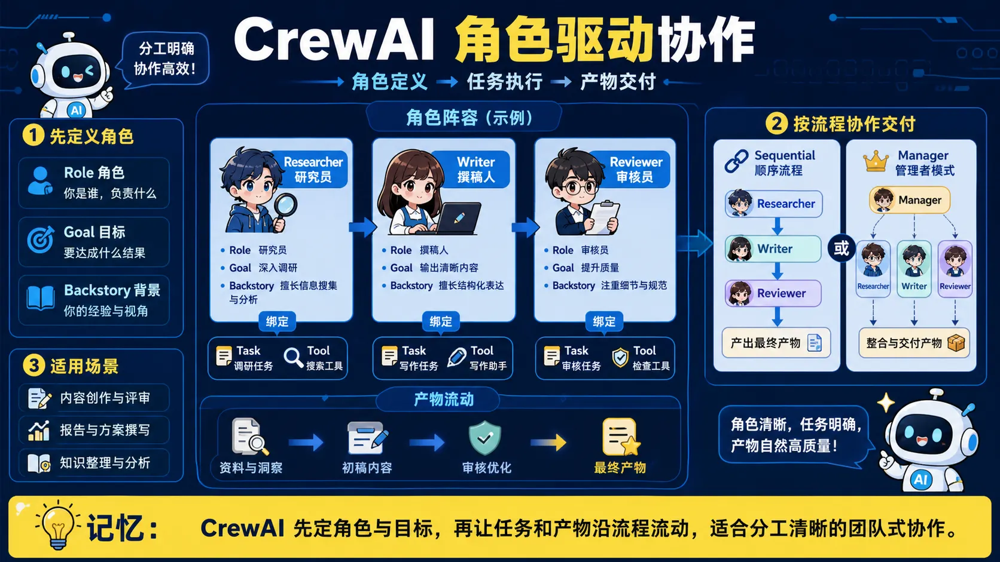</a>

> 🧠 **图解记忆：** CrewAI 先定角色与目标，再让任务和产物沿流程流动，适合分工清晰的团队式协作。

<details>
<summary>💡 答案要点</summary>

**CrewAI = 模拟人类团队的多Agent框架**

### CrewAI核心理念

**给每个Agent分配角色(Role)、目标(Goal)、背景(Backstory)**

```
传统:
Agent1(任务: 搜索)
Agent2(任务: 总结)

CrewAI:
Agent1(角色: 研究员, 目标: 找到权威信息, 背景: 10年研究经验)
Agent2(角色: 作家, 目标: 写出引人入胜的文章, 背景: 畅销书作者)
```

### CrewAI核心组件

| 组件 | 作用 | 示例 |
|------|------|------|
| **Agent** | 单个Agent | Researcher / Writer / Reviewer |
| **Task** | 具体任务 | "调研AI趋势" / "撰写文章" |
| **Tool** | 工具函数 | SearchTool / FileReadTool |
| **Crew** | Agent团队 | 组织多个Agent协作 |
| **Process** | 执行流程 | Sequential(顺序) / Hierarchical(层级) |

### CrewAI实战: 内容创作团队

**场景: 自动生成技术博客文章**

<details>
<summary>展开 Python 代码示例（99 行）</summary>

```python
from crewai import Agent, Task, Crew, Process
from langchain.tools import DuckDuckGoSearchRun

# 1. 定义工具
search_tool = DuckDuckGoSearchRun()

# 2. 创建Researcher Agent
researcher = Agent(
    role="技术研究员",
    goal="找到关于{topic}的最新、最权威的信息",
    backstory="""
    你是一名资深技术研究员,有10年AI领域经验。
    你擅长快速找到前沿论文、技术博客和行业报告。
    你只信任权威来源,并能区分炒作和真正的突破。
    """,
    verbose=True,
    allow_delegation=False,  # 不能委托给其他Agent
    tools=[search_tool]
)

# 3. 创建Writer Agent
writer = Agent(
    role="技术作家",
    goal="将复杂技术写成通俗易懂的文章",
    backstory="""
    你是畅销技术书作者,擅长用故事和类比解释复杂概念。
    你的文章既有深度又易读,深受开发者喜爱。
    你总是用具体例子和代码示例支撑观点。
    """,
    verbose=True,
    allow_delegation=False
)

# 4. 创建Editor Agent
editor = Agent(
    role="技术编辑",
    goal="确保文章准确性和可读性",
    backstory="""
    你是技术杂志的资深编辑,对技术准确性要求极高。
    你会检查事实、纠正错误、优化表达、统一风格。
    你的标准是"无一处错误,无一句冗余"。
    """,
    verbose=True,
    allow_delegation=False
)

# 5. 定义Task
research_task = Task(
    description="""
    调研{topic}的最新进展:
    1. 找到3-5篇权威来源(论文/博客/文档)
    2. 总结核心技术点
    3. 找出实际应用案例
    4. 识别优势和局限性
    """,
    agent=researcher,
    expected_output="详细的调研报告,包含来源链接"
)

writing_task = Task(
    description="""
    基于调研报告,撰写技术博客:
    1. 标题: 吸引眼球且准确
    2. 引言: 用故事或问题开篇
    3. 正文: 解释技术原理,附代码示例
    4. 结论: 总结要点和展望
    5. 长度: 1500-2000字
    """,
    agent=writer,
    expected_output="完整的博客文章(Markdown格式)"
)

editing_task = Task(
    description="""
    审核并优化文章:
    1. 检查技术准确性
    2. 纠正语法和拼写错误
    3. 优化标题和小标题
    4. 确保代码示例可运行
    5. 统一术语和风格
    """,
    agent=editor,
    expected_output="最终版文章 + 修改说明"
)

# 6. 创建Crew(团队)
content_crew = Crew(
    agents=[researcher, writer, editor],
    tasks=[research_task, writing_task, editing_task],
    process=Process.sequential,  # 顺序执行
    verbose=2  # 打印详细日志
)

# 7. 执行任务
result = content_crew.kickoff(inputs={"topic": "LLM Agent的记忆系统"})

print(result)

# 输出: 一篇完整的、经过三人协作的高质量技术博客
```

</details>

### CrewAI执行流程

```
1. Researcher开始工作
   → 使用搜索工具找资料
   → 阅读论文和博客
   → 总结关键信息
   → 输出: 调研报告

2. Writer接收Researcher的输出
   → 阅读调研报告
   → 提取核心技术点
   → 撰写文章
   → 输出: 初稿

3. Editor接收Writer的输出
   → 审核技术准确性
   → 优化表达
   → 纠正错误
   → 输出: 最终稿
```

### CrewAI高级特性

**特性1: Agent间委托(Delegation)**

```python
# 允许Manager委托任务给Specialist
manager = Agent(
    role="项目经理",
    goal="协调团队完成项目",
    allow_delegation=True,  # 可以委托
    backstory="你是项目管理专家,善于分配任务和协调资源"
)

specialist = Agent(
    role="数据分析专家",
    goal="分析数据",
    allow_delegation=False,
    backstory="你专注数据分析"
)

# Manager可以说: "我将这个数据分析任务委托给Specialist"
```

**特性2: 层级流程(Hierarchical Process)**

```python
# 有明确的上下级关系
content_crew = Crew(
    agents=[manager, researcher, writer, editor],
    tasks=[...],
    process=Process.hierarchical,  # 层级模式
    manager_llm="qwen3.5-plus"  # Manager使用的LLM
)

# 执行流程:
"""
Manager: "我分配任务:
  - Researcher: 调研AI趋势
  - Writer: 撰写文章
  - Editor: 审核文章"

→ Researcher完成调研
→ Manager检查,满意后:

Manager: "Writer,基于调研撰写文章"
→ Writer完成初稿
→ Manager检查,交给Editor

Manager: "Editor,审核文章"
→ Editor完成审核
→ Manager验收最终结果
"""
```

**特性3: 自定义工具**

```python
from crewai_tools import tool

@tool("Code Executor")
def execute_python_code(code: str) -> str:
    """执行Python代码并返回结果"""
    try:
        exec_globals = {}
        exec(code, exec_globals)
        return str(exec_globals.get("result", "执行成功"))
    except Exception as e:
        return f"错误: {str(e)}"

# 分配给Agent
coder = Agent(
    role="Python开发",
    tools=[execute_python_code],
    backstory="你是Python专家"
)
```

### CrewAI实战案例: 招聘流程自动化

<details>
<summary>展开 Python 代码示例（67 行）</summary>

```python
# 场景: 自动筛选简历+生成面试题

# 1. Recruiter Agent
recruiter = Agent(
    role="招聘专员",
    goal="筛选符合岗位要求的候选人",
    backstory="你有5年招聘经验,善于从简历中发现潜力"
)

# 2. Technical Interviewer Agent
tech_interviewer = Agent(
    role="技术面试官",
    goal="设计针对性的面试题",
    backstory="你是资深AI工程师,了解如何考察技术深度"
)

# 3. HR Manager Agent
hr_manager = Agent(
    role="HR经理",
    goal="综合评估候选人",
    backstory="你负责最终决策,平衡技术能力和文化契合度"
)

# Tasks
screen_task = Task(
    description="""
    筛选简历,评估候选人:
    - 技术栈匹配度
    - 项目经验相关性
    - 教育背景
    输出: 推荐/不推荐 + 理由
    """,
    agent=recruiter
)

interview_task = Task(
    description="""
    为推荐的候选人设计面试题:
    - 5道技术题(基础+进阶)
    - 2道项目题
    - 1道开放题
    """,
    agent=tech_interviewer
)

decision_task = Task(
    description="""
    综合评估:
    - 简历筛选结果
    - 面试题难度设计
    输出: 是否进入面试 + 面试官建议
    """,
    agent=hr_manager
)

# Crew
hiring_crew = Crew(
    agents=[recruiter, tech_interviewer, hr_manager],
    tasks=[screen_task, interview_task, decision_task],
    process=Process.sequential
)

# 执行
result = hiring_crew.kickoff(inputs={
    "resume": "张三的简历.pdf",
    "job_desc": "AI应用工程师岗位描述"
})
```

</details>

**面试话术:**
> "CrewAI的特色是角色驱动,每个Agent有明确的role/goal/backstory,更像真实团队。我用CrewAI做过内容创作:Researcher调研+Writer撰写+Editor审核,顺序执行。CrewAI优势是结构清晰,适合分工明确的任务;缺点是灵活性不如AutoGen。实战中我用Process.hierarchical实现层级管理,Manager分配任务,其他Agent执行。关键是写好backstory,让Agent有'个性',生成的内容更有针对性。"

</details>

---

## 📝 速记卡片

| 概念 | 一句话解释 |
|------|------------|
| **Agent** | 能自主决策和行动的 AI |
| **ReAct** | 推理 + 行动的循环模式 |
| **Function Calling** | 让 LLM 调用外部函数 |
| **Planning** | 把大任务分解成小步骤 |
| **Memory** | 短期对话 + 长期向量存储 |
| **Multi-Agent** | 多个 Agent 分工协作 |
| **Reflection** | Agent 自我评估和改进 |
| **AutoGen** | 微软开源,对话式协作,灵活迭代 |
| **CrewAI** | 角色驱动,模拟团队,结构清晰 |

---

### Q3: 企业级多 Agent 架构需要考虑哪些核心问题？

<a href="../../assets/illustrations/13-multi-agent-systems/q03-enterprise-architecture.webp">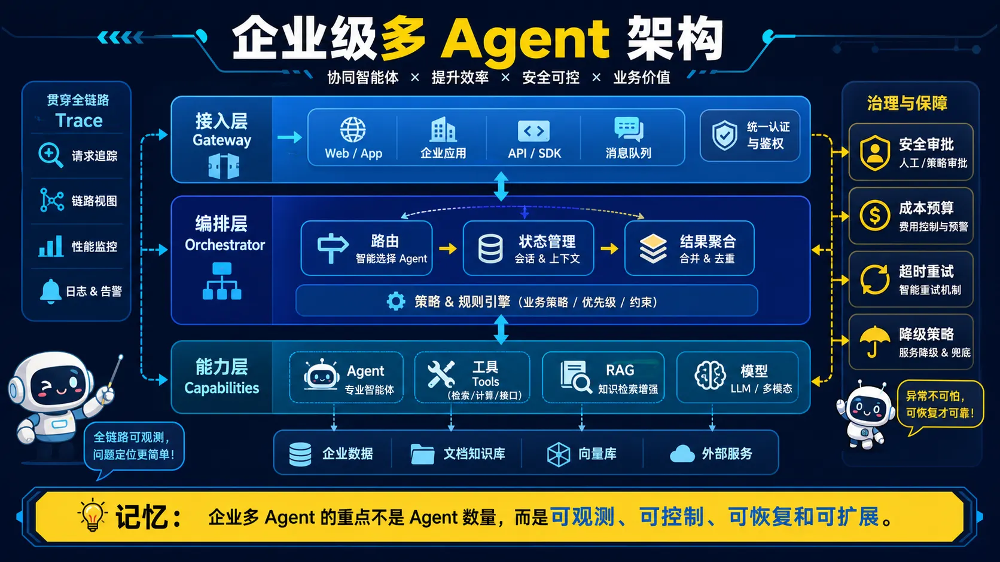</a>

> 🧠 **图解记忆：** 企业多 Agent 的重点不是 Agent 数量，而是可观测、可控制、可恢复和可扩展。

<details>
<summary>💡 答案要点</summary>

### 企业级Agent平台的核心架构

**三层架构设计：**
```
┌─────────────────────────────────────────────────────────────────┐
│                    企业级Agent平台三层架构                        │
├─────────────────────────────────────────────────────────────────┤
│  接入层（Gateway）                                                │
│  ├── 负载均衡（多实例部署）                                        │
│  ├── 鉴权认证（OAuth2/API Key）                                    │
│  ├── 限流熔断（保护后端服务）                                       │
│  └── 请求路由（按业务类型分流）                                      │
│                              ↓                                     │
│  编排层（Orchestration）                                           │
│  ├── 意图识别（确定用哪个Agent）                                    │
│  ├── Agent调度（协调多个Agent协作）                                 │
│  ├── 状态管理（会话上下文、超时控制）                                │
│  └── 结果聚合（合并多个Agent输出）                                   │
│                              ↓                                     │
│  能力层（Capabilities）                                           │
│  ├── 工具注册中心（MCP Server / Function Registry）                │
│  ├── 知识检索（RAG向量库+关键词库）                                  │
│  ├── 模型服务（vLLM/TGI推理集群）                                   │
│  └── 外部集成（ERP/CRM/数据库）                                     │
└─────────────────────────────────────────────────────────────────┘
```

### 大规模Agent编排实战

**场景：客服中心AI平台（日均10万+咨询）**

<details>
<summary>展开 Python 代码示例（60 行）</summary>

```python
# 企业级Agent编排器
class EnterpriseAgentOrchestrator:
    def __init__(self):
        self.agent_registry = AgentRegistry()  # Agent注册中心
        self.tool_registry = ToolRegistry()   # 工具注册中心
        self.state_store = RedisStateStore()   # 分布式状态存储
        self.trace_collector = JaegerCollector()  # 链路追踪

    async def handle_request(self, request: AgentRequest) -> AgentResponse:
        trace_id = generate_trace_id()
        self.trace_collector.start_trace(trace_id)

        try:
            # Step 1: 意图识别（路由到合适的Agent）
            intent = await self.classify_intent(request)
            self.trace_collector.add_span(trace_id, "intent_classification", intent)

            # Step 2: 获取Agent实例（支持水平扩展）
            agent = await self.agent_registry.get_agent(
                intent.type,
                pool_size=10  # 每个Agent类型10个实例
            )

            # Step 3: 执行Agent（带超时和重试）
            result = await self.execute_with_fallback(
                agent,
                request,
                timeout=30,
                max_retries=2
            )

            # Step 4: 后处理（结果校验、敏感词过滤）
            result = self.post_process(result)

            return result

        except Exception as e:
            self.trace_collector.record_error(trace_id, e)
            return self.fallback_response()

        finally:
            self.trace_collector.end_trace(trace_id)

    async def classify_intent(self, request):
        # 用小模型做意图分类，节省成本
        classifier = await self.get_classifier("intent-v2")
        return await classifier.predict(request.text)

    async def execute_with_fallback(self, agent, request, timeout, max_retries):
        for attempt in range(max_retries + 1):
            try:
                return await asyncio.wait_for(
                    agent.execute(request),
                    timeout=timeout
                )
            except TimeoutError:
                if attempt == max_retries:
                    raise
                # 重试时换另一个Agent实例
                agent = await self.agent_registry.get_agent(agent.type)
```

</details>

### Agent能力分级与智能路由

**分级策略：**
<details>
<summary>展开 Python 代码示例（33 行）</summary>

```python
AGENT_TIERS = {
    "tier1": {
        "name": "基础问答",
        "model": "deepseek-v4-flash",  # 便宜快速
        "examples": ["查天气", "简单FAQ"],
        "cost_per_1k": 0.002,
        "latency_p99": "500ms"
    },
    "tier2": {
        "name": "复杂推理",
        "model": "qwen3.5-flash",   # 中等成本
        "examples": ["数据分析", "代码调试"],
        "cost_per_1k": 0.01,
        "latency_p99": "2s"
    },
    "tier3": {
        "name": "专家级",
        "model": "gpt-4o",        # 高成本高质量
        "examples": ["架构设计", "复杂文案"],
        "cost_per_1k": 0.03,
        "latency_p99": "5s"
    }
}

def route_to_tier(query: str) -> str:
    # 根据问题复杂度自动路由
    complexity = estimate_complexity(query)
    if complexity < 0.3:
        return "tier1"
    elif complexity < 0.7:
        return "tier2"
    else:
        return "tier3"
```

</details>

### Agent系统的可观测性设计

**三大核心指标：**

| 指标类型 | 具体指标 | 告警阈值 | 优化方向 |
|----------|----------|----------|----------|
| **延迟** | P50/P95/P99响应时间 | P99>5s | 模型分级、流式输出 |
| **成本** | 每千次请求成本 | 环比>20%上涨 | 缓存、小模型路由 |
| **质量** | 答案正确率、人工满意度 | <85% | Prompt优化、RAG增强 |
| **可用性** | 系统 uptime | <99.9% | 多区域部署、熔断降级 |

**全链路追踪：**
```python
# OpenTelemetry 集成
from opentelemetry import trace

@trace_span("agent.execute")
async def agent_execute(agent, request):
    with tracer.start_as_current_span("tool_call") as span:
        for tool in plan_tools(request):
            with tracer.start_as_current_span(f"tool.{tool.name}"):
                result = await tool.execute(request)
                span.set_attribute("tools_used", tool.name)
                span.set_attribute("cost", result.cost)
    return result
```

### Agent安全与权限控制

```python
class AgentSecurity:
    def __init__(self):
        self.permission_matrix = PermissionMatrix()

    def check_permissions(self, agent: Agent, action: Action) -> bool:
        """
        企业级权限矩阵：
        - Agent只能访问授权的工具
        - 敏感操作需要人工审批
        - 数据访问遵循最小权限原则
        """
        if action.type == "database_write":
            # 写数据库需要审批流程
            return self.approval_workflow.request_approval(agent, action)

        if action.type == "customer_data_access":
            # 客户数据访问需要明确授权
            return self.verify_data_consent(action.customer_id)

        return self.permission_matrix.check(agent.role, action.type)

    def audit_log(self, agent_id, action, result):
        """完整审计日志"""
        logger.info({
            "agent_id": agent_id,
            "action": action,
            "result": "success" if result else "denied",
            "timestamp": datetime.now().isoformat()
        })
```

### 企业级Agent平台的容灾设计

```python
class AgentFailover:
    def __init__(self):
        self.primary_model = "gpt-4o"
        self.fallback_models = ["claude-3-5-sonnet", "gemini-pro"]

    async def execute_with_fallback(self, prompt: str) -> str:
        for model in [self.primary_model] + self.fallback_models:
            try:
                result = await self.call_model(model, prompt)
                metrics.record("model_success", model)
                return result
            except ModelOverloadedError:
                # 触发熔断，等待后重试下一个模型
                await self.circuit_breaker.wait(model)
                metrics.record("model_fallback", model)
                continue
            except ModelRateLimitError:
                # 排队等待重试
                await asyncio.sleep(self.get_backoff(model))
                continue

        # 所有模型都失败，返回兜底答案
        return self.get_graceful_degradation_response()
```

### 面试话术

> "企业级Agent平台的核心是'可观测、可控、可扩展'。我的设计经验：
> 1. **分层路由**：简单问题用小模型省成本，复杂问题才上大模型，每年节省60%成本
> 2. **全链路追踪**：每个请求带trace_id，从入口到模型调用到工具执行全程可查
> 3. **多级容灾**：模型不可用时自动切换，核心功能降级但不中断
> 4. **安全合规**：敏感操作必须有审批流程，所有操作留审计日志"

> "关于Agent编排，我用过两种模式：
> - **固定工作流**：适合流程稳定的场景（如审批流），用LangGraph实现
> - **动态编排**：适合灵活响应场景（如客服），用AutoGen实现
> 实际项目中往往混合使用，固定部分用工作流引擎，灵活部分用Agent协作"

</details>

---

### Q4: 多 Agent 系统如何设计 Policy Engine、权限和审计？

<a href="../../assets/illustrations/13-multi-agent-systems/q04-policy-engine.webp">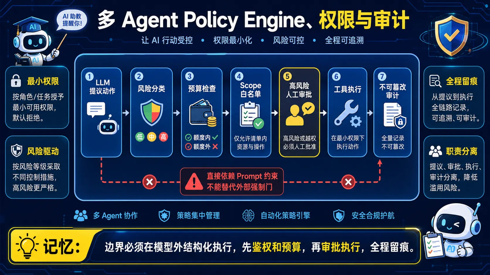</a>

> 🧠 **图解记忆：** 边界必须在模型外结构化执行，先鉴权和预算，再审批执行，全程留痕。

<details>
<summary>💡 答案要点</summary>

### 为什么企业级Agent需要Policy Engine？

**核心问题：LLM不受控，不能让它"自由发挥"**
- Agent能调用工具、读写数据、发送消息——这些操作需要边界控制
- LLM只是文本生成器，无法"理解"安全边界
- 必须用结构化Policy Engine在LLM外部强制执行约束

### Policy Engine四层架构

```python
# Policy Engine在LLM和工具之间的位置
class PolicyEngine:
    def __init__(self):
        self.action_classifier = ActionClassifier()      # Layer 1: 动作分类
        self.resource_budget = ResourceBudget()          # Layer 2: 资源预算
        self.scope_guard = ScopeGuard()                 # Layer 3: 范围约束
        self.approval_gate = ApprovalGate()              # Layer 4: 审批门

    def authorize(self, proposed_action: Action) -> Decision:
        # Layer 1: 风险分类
        risk_level = self.action_classifier.classify(proposed_action)

        # Layer 2: 资源检查
        if not self.resource_budget.check(proposed_action):
            return Decision.REJECT("预算耗尽")

        # Layer 3: 范围检查
        if not self.scope_guard.is_allowed(proposed_action):
            return Decision.REJECT("超出范围")

        # Layer 4: 高风险需要审批
        if risk_level == "high" and not self.approval_gate.has_approval(proposed_action):
            return Decision.PENDING_APPROVAL(proposed_action)

        return Decision.APPROVE()
```

### Layer 1：动作风险分类

| 风险等级 | 动作类型 | 无需审批 |
|----------|----------|----------|
| **read-only** | 查询、搜索、读取数据 | ✅ 自动批准 |
| **reversible-write** | 修改个人设置、发送草稿消息 | ✅ 自动批准（有限额） |
| **irreversible-write** | 删除数据、发送外部消息、支付 | ❌ 必须审批 |
| **external-communication** | 发送邮件、API调用、写库 | ❌ 必须审批 |

### Layer 2：资源预算控制

```python
# 硬性限制，LLM无法突破
class ResourceBudget:
    def __init__(self):
        self.limits = {
            "api_calls_per_hour": 1000,
            "tokens_per_day": 1_000_000,
            "cost_per_session": 10.0,  # 美元
            "time_elapsed_max": 3600,   # 秒
        }

    def check(self, action: Action) -> bool:
        current = self.get_current_usage(action.agent_id)

        for resource, limit in self.limits.items():
            if current[resource] >= limit:
                return False  # 超出限制

        return True

    def get_current_usage(self, agent_id: str) -> dict:
        # 从Redis或数据库读取实时使用量
        return redis.hgetall(f"agent:{agent_id}:usage")
```

### Layer 3：Scope约束（范围边界）

**Scope = Agent只能访问特定的工具、数据源、外部系统**

```python
# 范围约束在集成层强制执行，Agent技术上无法越界
class ScopeGuard:
    def __init__(self):
        # 每个Agent只能调用授权的工具
        self.agent_permissions = {
            "customer_service_agent": {
                "allowed_tools": ["search_kb", "reply_template", "view_order"],
                "allowed_data": ["customer_db:read"],
                "blocked_tools": ["delete_user", "refund", "send_external_email"]
            }
        }

    def is_allowed(self, action: Action) -> bool:
        agent_id = action.agent_id
        perms = self.agent_permissions.get(agent_id, {})

        # 检查工具是否在白名单
        if action.tool not in perms.get("allowed_tools", []):
            return False

        # 检查工具是否在黑名单
        if action.tool in perms.get("blocked_tools", []):
            return False

        return True
```

### Layer 4：审批门（Human-in-the-Loop）

```python
# 高风险操作必须人工审批
class ApprovalGate:
    async def request_approval(self, action: Action) -> bool:
        # 构造审批请求
        approval_req = {
            "action": action.to_summary(),
            "risk": action.risk_level,
            "agent": action.agent_id,
            "requester": action.requested_by,
            "timestamp": datetime.now()
        }

        # 发送到审批队列
        await self.approval_queue.send(approval_req)

        # 等待人工响应（超时则拒绝）
        result = await self.approval_queue.wait_for_response(
            timeout=300,  # 5分钟超时
            required_approvers=1
        )

        return result.approved
```

### 为什么不work：仅靠Prompt约束

| 方法 | 为什么不够 | 效果 |
|------|------------|------|
| System Prompt加约束 | LLM只生成文本，不强制执行 | 可被越狱绕过 |
| Prompt说"不要调用删除API" | LLM可能"忘记" | 不安全 |
| **Policy Engine（结构化）** | LLM的输出必须经过Policy检查 | 安全，不可用Prompt绕过 |

**关键认知：**
> "边界必须结构化地执行，不能靠Prompt'建议'。如果Agent技术上能调用危险工具，它迟早会调用。Policy Engine是外部强制约束，不是LLM的内部知识。"

### 生产环境实现

```python
# 完整的Policy Engine Pipeline
class ProductionPolicyEngine:
    def __init__(self):
        self.classifier = RiskClassifier()
        self.budget = ResourceBudget()
        self.scope = ScopeGuard()
        self.approval = ApprovalGate()
        self.audit = AuditLogger()

    async def process(self, llm_output: str, context: AgentContext) -> ProcessedAction:
        # 1. 解析LLM输出的动作
        action = self.parse_action(llm_output)

        # 2. 强制执行Policy检查
        decision = await self.authorize(action, context)

        # 3. 记录审计日志
        await self.audit.log(decision, action, context)

        # 4. 执行或拒绝
        if decision == Decision.APPROVE:
            return await self.executor.execute(action)
        elif decision == Decision.PENDING:
            return await self.approval.request(action)
        else:
            return self.create_rejection_response(decision.reason)
```

### 面试话术

> "Policy Engine是2026年企业级Agent面试的核心考点。核心观点是'边界必须结构化，Prompt不可靠'。我用四层防护：风险分类决定检查强度，资源预算防止过度消耗，Scope约束在技术层面禁止越界，高风险操作必须人工审批。面试时能画出Policy Engine架构图并解释各层职责，说明你有企业级Agent落地经验。"

</details>

---

### Q5: Agent 治理工具应该解决哪些问题？

<a href="../../assets/illustrations/13-multi-agent-systems/q05-agent-governance.webp">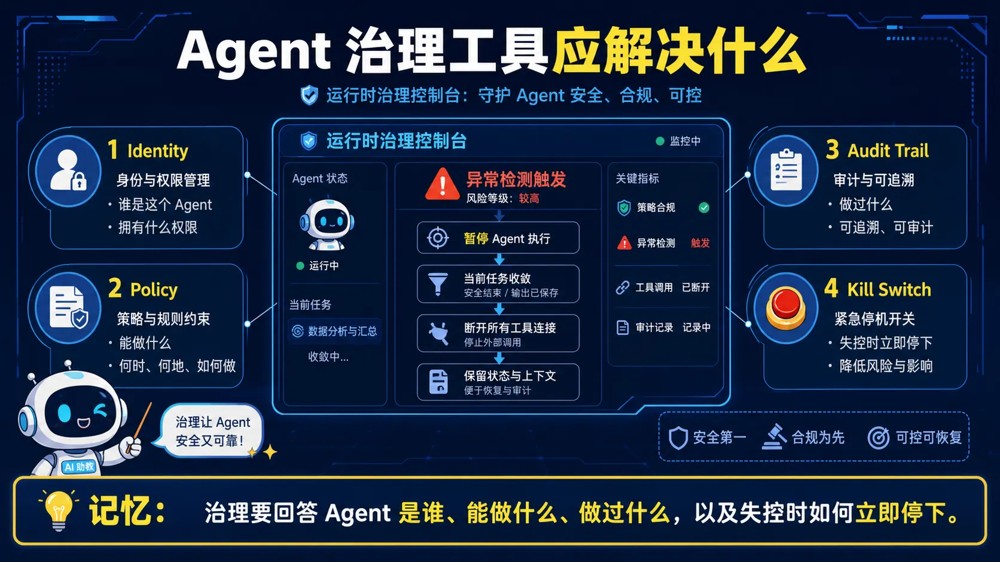</a>

> 🧠 **图解记忆：** 治理要回答 Agent 是谁、能做什么、做过什么，以及失控时如何立即停下。

<details>
<summary>💡 答案要点</summary>

### 什么是Agent Governance Toolkit？

**发布方：** Microsoft（2026年4月2日）
**定位：** 开源的Agent运行时安全框架
**官网：** opensource.microsoft.com/blog/2026/04/02/introducing-the-agent-governance-toolkit

### 解决的问题

> "Policy Engine定义了规则，但谁来执行？谁来审计？谁来检测异常行为？Agent Governance Toolkit填补了这个空白。"

### 四大核心组件

| 组件 | 功能 | 解决的问题 |
|------|------|------------|
| **Policy Engine** | 定义和执行Agent行为策略 | "Agent能做什么" |
| **Identity Layer** | Agent身份认证和授权 | "Agent是谁" |
| **Audit Trail** | 完整记录所有Agent操作 | "Agent做了什么" |
| **Kill Switch** | 紧急停止Agent操作 | "Agent失控了怎么办" |

### Kill Switch：紧急停止机制

```python
# Kill Switch的典型实现
class AgentKillSwitch:
    def __init__(self):
        self.active_agents = {}  # agent_id -> status
        self.global_kill = False  # 全局终止开关

    def emergency_stop(self, agent_id=None):
        """紧急停止指定Agent或所有Agent"""
        if agent_id:
            self.active_agents[agent_id] = "STOPPED"
            await self.graceful_shutdown(agent_id)
        else:
            self.global_kill = True
            for aid in self.active_agents:
                self.active_agents[aid] = "STOPPED"
                await self.graceful_shutdown(aid)

    async def graceful_shutdown(self, agent_id):
        # 停止接收新任务
        # 等待当前任务完成或超时
        # 关闭所有工具连接
        # 记录最终状态
        pass

    def is_kill_switch_armed(self) -> bool:
        return self.global_kill or any(
            s == "STOPPED" for s in self.active_agents.values()
        )
```

### Audit Trail：操作可追溯

```python
# 每个Agent操作必须记录到审计日志
@dataclass
class AuditRecord:
    timestamp: datetime
    agent_id: str
    action: str
    tool_called: str
    parameters: dict
    result: str
    user_id: str  # 谁触发的
    session_id: str

# 审计日志必须包含：
# 1. 谁（user_id/agent_id）
# 2. 什么时候（timestamp）
# 3. 做了什么（action/tool/parameters）
# 4. 结果是什么（result）
# 5. 上下文是什么（session_id）
```

### 与Policy Engine的关系

```
Policy Engine：定义规则
Agent Governance Toolkit：执行+审计+Kill Switch

两者结合 = 完整的Agent安全体系

Policy Engine负责"规则制定"（静态）
Agent Governance Toolkit负责"规则执行"（动态）
```

### 面试话术

> "Microsoft Agent Governance Toolkit是2026年4月发布的开源框架，解决了'Policy Engine定义了规则但谁来执行'的问题。四大组件：Policy Engine（规则）、Identity（身份）、Audit Trail（审计）、Kill Switch（紧急停止）。面试时能说出Kill Switch的graceful shutdown机制和Audit Trail必须包含的五个要素，说明你有企业级Agent安全落地的实战理解。"

</details>

---

**上一模块：** [框架与工具](../12-frameworks-tools/)
**下一模块：** [MCP Skill 系统](../14-mcp-skill-systems/)

---

[返回目录 →](../../README.md)

---

### Q6: RAG、Agent、MCP 与 A2A 的职责边界是什么？

<a href="../../assets/illustrations/13-multi-agent-systems/q06-rag-agent-mcp-a2a.webp">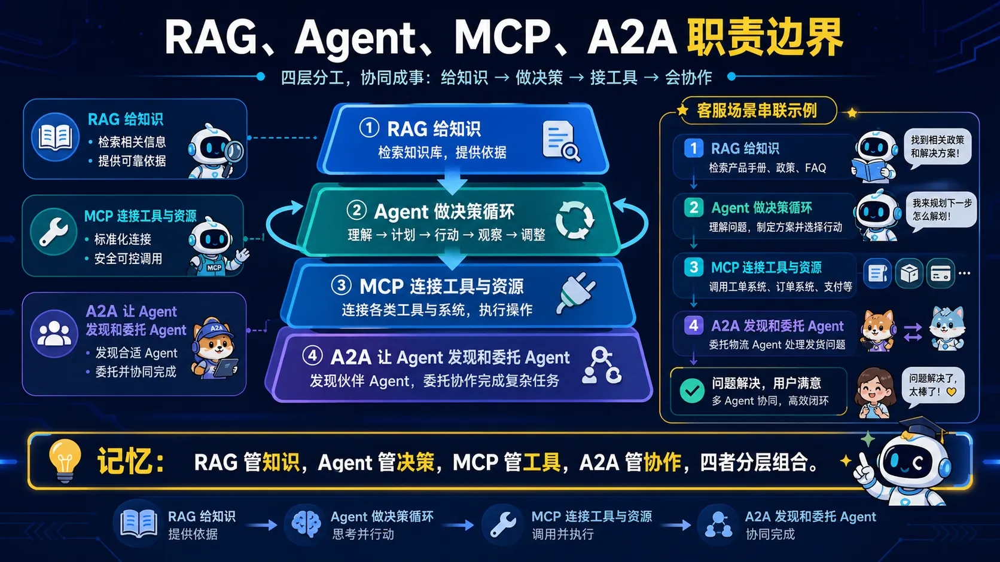</a>

> 🧠 **图解记忆：** RAG 管知识，Agent 管决策，MCP 管工具，A2A 管协作，四者分层组合。
> **难度：** ⭐⭐⭐⭐⭐  
> **更新：** 2026-04-06
<details>
<summary>💡 答案要点</summary>

### 为什么四层架构是2026年企业级AI的核心框架？

**行业误区：** 把 RAG、AI Agents、MCP、A2A 当成竞争关系，非要争"谁更重要"

**正确理解：** 它们是四层分开的核心组件，各司其职，缺一不可

| 层级 | 技术 | 解决的问题 | 类比 |
|------|------|------------|------|
| **Layer 1** | RAG | 知识注入，让AI"知道" | 知识库 |
| **Layer 2** | AI Agents | 任务执行，让AI"做事" | 执行大脑 |
| **Layer 3** | MCP | 工具连接，让AI"用手" | USB-C接口 |
| **Layer 4** | A2A | 多Agent协同，让AI"协作" | 团队沟通 |

**一句话总结：** RAG解决"回答更准"，Agents解决"把事做完"，MCP解决"工具用得顺"，A2A解决"多Agent协同得好"

### 四层架构详解

```
┌─────────────────────────────────────────────────────────────────┐
│                  企业级 AI 四层黄金架构                            │
├─────────────────────────────────────────────────────────────────┤
│  Layer 4: A2A（多Agent协同层）                                     │
│  └── 解决：多专用Agent如何有序协作                                  │
│      组件：A2A Client、Registry/Directory、Gateway/Router          │
│      能力：任务委托、状态同步、制品传递、审计管控                     │
├─────────────────────────────────────────────────────────────────┤
│  Layer 3: MCP（工具连接层）                                        │
│  └── 解决：Agent如何标准化、安全地调用工具                          │
│      组件：MCP Host/Client、Protocol、MCP Server                   │
│      能力：工具发现、鉴权、限流、审计                                │
├─────────────────────────────────────────────────────────────────┤
│  Layer 2: AI Agents（执行层）                                      │
│  └── 解决：如何把模糊目标转化为可执行动作                           │
│      组件：Plan（规划）、Observe（观察）、Act（执行）、Reflect（反思） │
│      能力：任务分解、工具调用、结果校验                              │
├─────────────────────────────────────────────────────────────────┤
│  Layer 1: RAG（知识层）                                           │
│  └── 解决：如何给Agent提供精准、可信的上下文                        │
│      流程：查询重写 → Top-K召回 → 重排 → 上下文组合 → LLM回答       │
│      能力：知识注入、幻觉缓解、可溯源回答                             │
└─────────────────────────────────────────────────────────────────┘
```

### 四层协同实战：客户售后故障全流程处理

**场景：** 客户反馈产品故障 → 全流程自动化处理

**四层协同流程：**

| 阶段 | 层级 | 具体动作 |
|------|------|----------|
| **客户问题进入** | RAG层 | 从知识库召回故障排查手册、SOP、过往案例、客户历史记录 |
| **任务拆解执行** | Agents层 | 客服Agent启动Plan-Act-Reflect循环：确认故障→查CRM→创工单→同步进度→回访 |
| **跨系统调用** | MCP层 | 调用CRM/工单系统/企微/文件系统的MCP Server，统一鉴权+审计 |
| **专业Agent协作** | A2A层 | 无法解决时，客服Agent通过A2A委托给SRE Agent、产品Agent、供应链Agent |

### A2A协议核心架构（Layer 4核心）

**A2A = Agent-to-Agent 协议（Google主导）**

**三大核心组件：**

| 组件 | 职责 | 类比 |
|------|------|------|
| **A2A Client** | Agent的协同客户端，负责能力注册、状态同步、任务接收 | 销售员 |
| **A2A Registry/Directory** | 所有Agent的能力目录，支持互相发现、精准匹配 | 公司通讯录 |
| **A2A Gateway/Router** | 任务委托分发、路由匹配、权限校验、流量管控 | 前台+调度中心 |

**Agent Card（数字名片）：**
```json
{
  "name": "finance_analyzer",
  "capabilities": ["data_analysis", "report_generation"],
  "endpoint": "https://agent.example.com/a2a",
  "version": "1.0"
}
```

**A2A vs MCP 的本质区别：**

| 对比 | MCP | A2A |
|------|-----|-----|
| **解决的问题** | Agent调用工具 | Agent之间互相协作 |
| **类比** | USB-C接口 | 团队沟通协议 |
| **协议层** | Agent的手脚 | Agent的嘴巴和耳朵 |
| **协调对象** | Agent → 工具/数据源 | Agent → Agent |

**A2A + MCP 典型工作流：**
```
Agent A（主Agent）
    ↓ A2A委托任务
Agent B（专业Agent）
    ↓ MCP调用数据库工具
    ↓ MCP发送邮件
    ↓ A2A返回结果
Agent A
```

### 企业落地四层架构的正确路径

**常见错误：** 一上来就做A2A多Agent协同，但RAG没搭好，Agent连工具都无法稳定调用

**正确路径（从下到上）：**

```
Step 1: 先搭RAG体系（知识注入 + 可信问答）
Step 2: 落地单场景AI Agent（单任务闭环执行）
Step 3: 引入MCP统一工具对接（标准化 + 可治理）
Step 4: 搭建A2A体系（多Agent规模化协同）
```

### 面试话术

> **示例表达（仅在能用本人经历或可复现实验佐证时使用）：** "企业级AI不是某个单点技术的竞争，而是整套架构体系的竞争。RAG是知识地基，AI Agents是执行大脑，MCP是工具连接的USB-C，A2A是多Agent协作的交通枢纽。我做过真实的四层架构落地，核心经验是：不要跳步，先把RAG做扎实，再一层层往上搭。很多团队A2A做不起来，根因是MCP没搭好；MCP推不动，根因是RAG质量不行。"

</details>

---

### Q7: 如何用 A2A 协议实现 Agent 发现、任务委托和状态查询？

<a href="../../assets/illustrations/13-multi-agent-systems/q07-a2a-task-lifecycle.webp">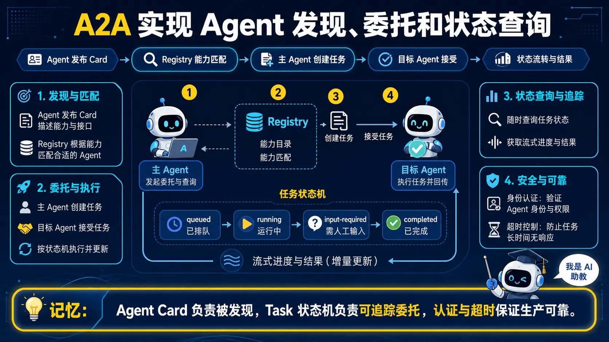</a>

> 🧠 **图解记忆：** Agent Card 负责被发现，Task 状态机负责可追踪委托，认证与超时保证生产可靠。

<details>
<summary>💡 答案要点</summary>

**A2A多Agent编排完整流程：**

```
┌─────────────────────────────────────────────────────────┐
│              A2A多Agent发现与委托流程                     │
└─────────────────────────────────────────────────────────┘

Step 1: Agent注册
  Agent启动 → 发布Agent Card → 注册到A2A Registry/Directory

Step 2: 任务到达主Agent
  用户请求 → 主Agent接收 → 任务分解

Step 3: 查找合适Agent
  主Agent查询Registry → 匹配能力 → 发现目标Agent

Step 4: 任务委托
  发送任务描述(JSON) → 目标Agent确认接受

Step 5: 执行与监控
  支持流式返回进度 → 主Agent可随时查询状态

Step 6: 结果返回
  异步/同步获取结果 → 整合输出给用户
```

**A2A关键特性：**

| 特性 | 说明 | 面试加分点 |
|------|------|-----------|
| **语言无关** | 任何编程语言实现的Agent可互相协作 | 跨团队技术栈不同也能协作 |
| **安全通信** | TLS加密 + 身份验证 | 企业级安全必须 |
| **异步支持** | 长时间任务可挂起，结果回调 | 不阻塞主流程 |
| **错误处理** | 超时重试、失败回退 | 生产级可靠性 |

**企业级A2A实现示例：**

<details>
<summary>展开 Python 代码示例（37 行）</summary>

```python
# A2A Registry 实现
class A2ARegistry:
    def __init__(self):
        self.agents = {}  # agent_id -> AgentCard

    def register(self, agent_card: AgentCard):
        self.agents[agent_card.agent_id] = agent_card

    def discover(self, required_capabilities: list[str]) -> list[AgentCard]:
        """根据能力需求发现合适的Agent"""
        return [
            agent for agent in self.agents.values()
            if all(cap in agent.capabilities for cap in required_capabilities)
        ]

# A2A Gateway 实现
class A2AGateway:
    def __init__(self, registry: A2ARegistry):
        self.registry = registry

    async def delegate_task(self, task: Task, target_agent_id: str):
        # 1. 权限校验
        if not self.check_permissions(task):
            raise PermissionError("权限不足")

        # 2. 路由到目标Agent
        agent = self.registry.agents.get(target_agent_id)
        if not agent:
            raise AgentNotFoundError(f"Agent {target_agent_id} 不存在")

        # 3. 发送任务（支持流式）
        result = await agent.receive_task(task)

        # 4. 审计日志
        self.audit_log.log(task, agent, result)

        return result
```

</details>

**多Agent协作场景示例：开发电商网站**

```
用户："帮我开发一个电商网站"

主Agent（规划者）
    ↓ A2A委托
┌─────────────────────────────────────────┐
│  前端Agent  → React/Vue代码生成          │
│  后端Agent  → Node.js API开发            │
│  数据库Agent → Schema设计               │
│  部署Agent  → Docker容器化部署           │
└─────────────────────────────────────────┘
    ↓ A2A交换数据（API接口定义、Schema文档）
主Agent整合 → 完整项目交付给用户
```

**面试话术：**
> "A2A协议的核心是解决'多Agent发现不了、调度不动、管不好'的问题。Registry像公司通讯录，每个Agent注册自己的能力；Gateway像前台调度中心，负责路由和鉴权；Client负责实际的通信。我用A2A实现过一个客服平台，客服Agent发现无法处理技术问题后，自动通过A2A委托给SRE Agent，整个过程对用户透明，用户感知不到背后是多个Agent在协作。"

</details>


---

*版本: v2.5 | 更新: 2026-04-06 | by 二狗子 🐕*

---

### Q8: 如何定义 Agent 系统的成熟度？

<a href="../../assets/illustrations/13-multi-agent-systems/q08-agent-maturity.webp">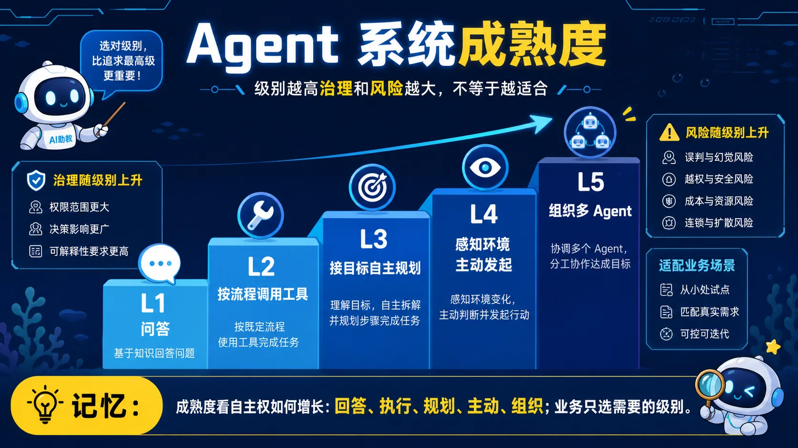</a>

> 🧠 **图解记忆：** 成熟度看自主权如何增长：回答、执行、规划、主动、组织；业务只选需要的级别。
> **难度：** ⭐⭐⭐⭐  
> **更新：** 2026-04-06
<details>
<summary>💡 答案要点</summary>

### 为什么需要 Agent 成熟度模型？

**行业现状：** 市场上"绝大多数产品仍停留在 L1-L2 级别"

**市场预测：** Gartner 预测到 2028 年，70% 的 AI 应用将使用多智能体系统（L5）

**IDC 数据（2026）：**
- 超过 64% 的中国企业已进入 Agent 的测试验证和采购培训阶段
- 预计 2028 年中国企业级 Agent 应用市场规模将达到 **270 亿美元**
- 生成式 AI 占 AI 市场总投资规模比例将达到 30.6%，突破 300 亿美元

### L1-L5 能力分级框架

| 等级 | 名称 | 能力描述 | 典型场景 | 技术栈 |
|------|------|----------|----------|--------|
| **L1** | 被动执行 | "你问我答"：能理解指令，但依赖预设提示词或 RAG | 智能客服，知识库问答 | Prompt + RAG |
| **L2** | 项目助理 | "你让我做，我就做"：能调用工具，但必须在预定义工作流内执行 | 自动查订单、发邮件、预订会议 | Workflow + RAG + Function Calling |
| **L3** | 初级项目负责人 | "你说目标，我来规划"：能理解模糊任务，自主规划多步骤，动态调用工具 | 生成会议纪要、写周报、规划旅行 | ReAct / Plan-and-Execute |
| **L4** | 专业骨干 | "我发现问题，我来解决"：能主动感知环境（如 CRM 数据变化），自主发起任务 | 智能营销（发现客户流失风险并主动触达） | 环境感知 + L3 能力 |
| **L5** | 领导者 | "我来组织"：能定义目标，将复杂系统工程分解给其他 L2-L4 Agent（或人类）协同完成 | 自动化软件开发、虚拟项目组 | Multi-Agent 协同 |

### L1-L5 面试核心问答

**Q: 如何判断一个 Agent 是 L3 还是 L4？**
> L3 是"被动接收目标后执行"，L4 是"主动感知环境变化后自主发起"。L4 能监控 CRM 数据变化，当发现客户流失风险时主动触达，不需要人类先下指令。

**Q: L5 Agent 和 L3 Multi-Agent 的核心区别？**
> L3 Multi-Agent 是"多个 Agent 配合完成一个任务"，L5 是"主 Agent 定义目标、协调其他 Agent，像一个团队一样工作"。L5 的主 Agent 具备目标拆解、任务分配、结果整合的完整能力。

**Q: 当前企业落地的实际情况？**
> 绝大多数企业落地的"数字员工"主要是 L1（智能知识库）和 L2（流程自动化助手）。L3 及以上的 Agent 需要更复杂的技术栈和更成熟的 AI 基础设施。

### Coze vs Dify vs n8n 平台对比

| 平台 | 定位 | 优势 | 劣势 | 适合场景 |
|------|------|------|------|----------|
| **Coze（扣子）** | C端创作者平台 | 免费、插件丰富、一键发布（飞书/豆包） | 私有化能力弱、资源限制（10GB知识库/10分钟超时） | 互联网产品经理，快速验证 C 端创意和 Demo |
| **Dify.ai** | 开源+企业级 LLM 应用平台 | 平衡易用性与专业性，支持私有化部署、国产模型 | 流程编排能力相对 n8n 较弱 | 企业应用专家，私有化/国产化环境构建严肃 B 端应用 |
| **n8n** | 自动化工作流引擎 | 极强大的流程编排，连接器极多 | LLM 能力是"外挂"而非原生，Agent 概念较弱 | 解决方案架构师，核心是"流程自动化"（RPA+AI）而非"智能体" |

### LangChain vs LlamaIndex 核心思想

| 框架 | 核心思想 | 适用场景 |
|------|----------|----------|
| **LangChain** | "链"(Chains) 和"智能体"(AI Agents)，提供构建复杂多步骤 Agent 工作流的所有模块（记忆、提示词、工具） | 一个对话式 Agent，需要执行多步骤、调用多种工具、拥有复杂记忆 |
| **LlamaIndex** | "高级 RAG"(Advanced RAG) | RAG 需求复杂时（层级检索、GraphRAG、融合多文档） |

### 面试话术

> **示例表达（仅在能用本人经历或可复现实验佐证时使用）：** "Agent 成熟度 L1-L5 是 2026 年面试的高频考点。L1 是问答客服，L2 是工具使用者，L3 能自主规划，L4 能主动发起，L5 能协调多 Agent 团队干活。当前市场绝大多数产品停在 L1-L2，但 Gartner 预测 2028 年 70% 应用会到 L5。我做过的项目大部分是 L2-L3 级别，L4 以上的核心挑战是环境感知和主动决策能力。选平台要看场景：快速验证用 Coze，企业严肃应用用 Dify，流程自动化用 n8n。"

</details>


---

<a id="a2a-mcp"></a>

## 二、A2A + MCP 混合架构

### Q9: 如何设计 A2A + MCP 混合架构？

<a href="../../assets/illustrations/13-multi-agent-systems/q09-a2a-mcp-architecture.webp">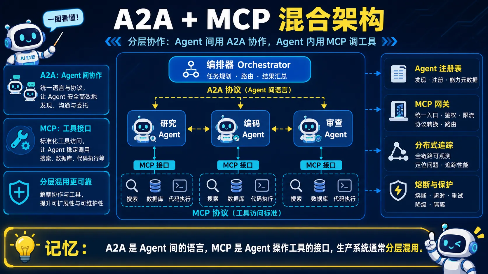</a>

> 🧠 **图解记忆：** A2A 是 Agent 间的语言，MCP 是 Agent 操作工具的接口，生产系统通常分层混用。

<details>
<summary>💡 答案要点</summary>

**核心洞察：两个协议不在同一层次**

很多人把 MCP 和 A2A 当竞争关系来问，这是最大的误区。它们解决的是不同层次的问题：

```
┌─────────────────────────────────────────┐
│  编排器 Agent（Orchestrator）            │
│  ┌───────────────────────────────────┐  │
│  │  A2A：Agent 间委派与协作            │  │  ← Agent ↔ Agent 通信
│  │  （语言层：相互对话）                │  │
│  └───────────────────────────────────┘  │
│  ┌───────────────────────────────────┐  │
│  │  MCP：工具与资源访问标准化           │  │  ← Agent ↔ 外部系统
│  │  （双手层：操作世界）                │  │
│  └───────────────────────────────────┘  │
└─────────────────────────────────────────┘

类比：
  MCP = USB-C（任何设备都可以用统一接口连接）
  A2A = HTTP（任何 Agent 都可以用统一协议通信）
```

---

**A2A + MCP 混合架构三大模式**

```
模式一：编排器-工作器（最常见）

编排器
  │ A2A（任务委派）
  ├─→ 研究员 Agent ─→ MCP（网络搜索、DB查询）
  ├─→ 编码员 Agent ─→ MCP（GitHub、代码执行）
  └─→ 审查员 Agent ─→ MCP（测试运行、部署）

适用：各步骤可独立执行，且每步需要专业技能
举例：采购流程——研究员找产品 → 合规检查政策 → 采购下单 → 财务审批
```

```
模式二：流水线模型

输入数据
  │ A2A（Artifact 传递）
  → 分析 Agent ─→ MCP（BI工具）
  → 报告 Agent ─→ MCP（Notion、Slack）
  → 通知 Agent ─→ MCP（邮件、PagerDuty）

适用：数据处理流水线、顺序审批工作流
特点：每个 Agent 的产出成为下一个 Agent 的输入
```

```
模式三：对等协作模型

Agent A ←── A2A ──→ Agent B
  │                      │
MCP                    MCP
（领域工具A）          （领域工具B）

适用：复杂创意性工作、需要共识的决策
特点：不存在垂直层级，平等协作
```

---

**A2A 任务生命周期（九状态机）**

面试常问 A2A 和普通函数调用的区别——A2A 的核心是有状态任务机：

```
A2A 任务状态机：

           ┌──────────────┐
           │   queued     │ ← 初始状态，已接收等待处理
           └──────┬───────┘
                  ↓
           ┌──────────────┐
           │   running    │ ← 正在处理
           └──────┬───────┘
                  ↓
    ┌─────────────┼─────────────┐
    ↓             ↓             ↓
input-required  auth-required  ┌──────────┐
（需额外输入）  （需认证）     │ completed│ ← 终态：成功
    ↑             ↑            └──────────┘
    └──────?───────┘
（人类审批/HITL 场景）
                  ↓
           ┌──────────────┐
           │  canceled    │ ← 终态：被取消
           └──────────────┘

           ┌──────────────┐
           │  rejected    │ ← 终态：Agent 拒绝请求
           └──────────────┘

           ┌──────────────┐
           │   failed     │ ← 终态：处理过程出错
           └──────────────┘
```

**关键点：** `input-required` 是 A2A 支持人机协作（HITL）的核心机制 —— Agent 可以暂停等待人类审批，这在 MCP 里是不内置的。

---

**A2A Agent Card 结构（企业发现机制）**

```json
{
  "name": "代码审查 Agent",
  "description": "自动化代码审查与安全分析",
  "url": "https://review.example.com/a2a",
  "version": "1.0.0",
  "protocolVersion": "0.3.0",
  "provider": {
    "organization": "DevCorp",
    "url": "https://devcorp.com"
  },
  "capabilities": {
    "streaming": true,
    "pushNotifications": false,
    "stateTransitionHistory": true
  },
  "defaultInputModes": ["text", "application/json"],
  "defaultOutputModes": ["text", "application/json"],
  "skills": [
    {
      "id": "security-review",
      "name": "安全审查",
      "description": "扫描代码中的安全漏洞",
      "tags": ["security", "code-review", "OWASP"],
      "examples": ["审查这个 PR 的安全问题"]
    }
  ]
}
```

Agent Card 发布在 `/.well-known/agent.json`，供其他 Agent 发现和对接。

---

**A2A + MCP 混合 vs 单协议对比**

| 维度 | 仅用 MCP | 仅用 A2A | A2A + MCP 混合 |
|------|---------|---------|----------------|
| Agent 间通信 | ❌ | ✅ | ✅ |
| 工具接入 | ✅ | ❌ | ✅ |
| 任务状态跟踪 | ❌（仅 Tasks 原语） | ✅（完整状态机） | ✅ |
| 人类审批 | ❌ | ✅（input-required） | ✅ |
| Agent 发现 | ❌ | ✅（Agent Card） | ✅ |
| 适用场景 | 单 Agent 工具调用 | Agent 网络 | **生产级多 Agent 系统** |

---

**企业级生产部署四层检查清单**

```
第一层：智能体注册表（A2A 必需）
  → 统一管理所有 Agent Card
  → 定义标准：能力、输入输出格式、认证信息
  → 类似微服务的服务注册中心

第二层：MCP 服务器治理（安全关键！）
  → 中央 MCP 网关：所有 Agent 的 MCP 调用统一路由
  → 最小权限范围：每个 Agent 仅访问所需工具
  → 审计日志：记录所有 MCP 调用检测异常
  → ⚠️ 截至 2026 年初，已披露 30+ MCP CVE

第三层：可观测性（分布式追踪）
  → 分布式追踪：把整个 A2A 委派链连为单一 trace（OpenTelemetry）
  → 按 Agent 追踪成本：每个 Agent 的 LLM Token + MCP 调用次数
  → 故障模式分析：哪个 Agent 在何种条件下失败

第四层：回滚与隔离策略
  → 熔断器：特定 Agent 连续失败时隔离
  → 超时策略：A2A 任务委派设置明确超时
  → 降级 Agent：主 Agent 故障时自动切换备用
```

---

**落地路线图（三阶段）**

```
第一阶段（1-2个月）：基础建设
  → 整理 MCP 服务器清单，配置中央网关
  → 定义 Agent Card 标准，构建注册表
  → 配置可观测性流水线

第二阶段（2-4个月）：试点多 Agent 系统
  → 使用编排器-工作器模式小规模试点
  → 验证 A2A 委派链追踪
  → 基准测试成本和延迟

第三阶段（4-6个月）：生产扩展
  → 应用熔断器和回滚策略
  → 开展安全审计，建立 MCP CVE 响应流程
  → 全组织培训与入职
```

---

**面试话术：**

> **示例表达（仅在能用本人经历或可复现实验佐证时使用）：** "A2A 和 MCP 不是竞争关系，是不同层次。MCP 是 Agent 的'双手'，负责连接外部工具；A2A 是 Agent 之间的'语言'，负责协作通信。最强的架构是两者组合：编排器通过 A2A 委派任务给专业 Agent，每个 Agent 通过 MCP 访问自己的工具集。我做过一个客服场景：编排器 Agent 通过 A2A 把查询任务分发给产品 Agent（用 MCP 查数据库）和物流 Agent（用 MCP 查物流 API），结果整合后返回。生产部署四件套：注册表、MCP 网关+审计、可观测性（OpenTelemetry 链路追踪）、熔断降级。面试时能说出这套分层思路，说明你不只在用工具，在理解系统本质。"

</details>

---

*版本: v2.0 | 更新: 2026-04-10 | by 二狗子 🐕*

---

<a id="collaboration-protocols"></a>

## 三、多 Agent 协作模式

### Q10: Commander、P2P、Hybrid 三种协作模式如何选择？

<a href="../../assets/illustrations/13-multi-agent-systems/q10-collaboration-patterns.webp">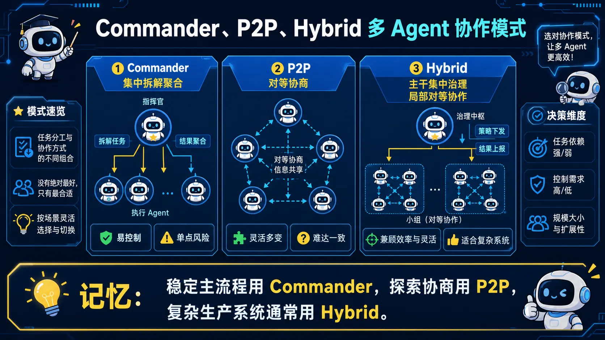</a>

> 🧠 **图解记忆：** 稳定主流程用 Commander，探索协商用 P2P，复杂生产系统通常用 Hybrid。

<details>
<summary>💡 答案要点</summary>

**单Agent的三个结构性瓶颈（为什么需要多Agent）**

```
即使 1M token 上下文，处理 500 个文件代码库 + 100 篇参考文献 + 多轮对话历史
仍然力不从心——三个结构性瓶颈不是靠更大模型能解决的：

① 上下文窗口瓶颈
   "Lost in the Middle" 效应
   上下文越长，模型对中间部分注意力越弱

② 专业化瓶颈
   一个 Agent 很难同时在代码审查、安全审计、UI设计、内容写作都做到专家
   → 不同 Agent 配置不同 System Prompt + 工具集 = 各领域"专家"

③ 并行性瓶颈
   单 Agent 串行执行——一个时刻只能做一件事
   → 可并行任务（同时搜索5个数据源、同时审查3个文件）效率远低于多Agent
```

---

**多Agent系统的核心价值：分治**

```
复杂任务 → 拆解为独立子任务 → 分配给专业化 Agent → 聚合结果

类比软件工程微服务架构：
  每个服务做好一件事，通过明确接口通信

多Agent结构性优势：
  → 3-5x 并行效率提升
  → N × 1M 聚合上下文容量
  → 容错：单点故障可降级
  → 专业化：每个 Agent 一个角色
```

---

**五种通信协议完整对比表**

```
维度         MCP                A2A               Claude Subagents   tmux send-keys   CrewAI/AutoGen/LangGraph

主导方       Anthropic→LF AAIF  Google→LF         Anthropic          开源             开源社区各自

通信模式     Tool/Resource调用   Agent间JSON-RPC   父-子Agent消息     文本命令注入     框架内函数调用

发现机制     手动配置/Registry  Agent Card        内置（同进程）     无               代码中定义

状态管理     Tasks原语          Task生命周期      内存中             无               框架各异

传输协议     stdio/SHTTP        HTTPS+SSE+gRPC    进程内             Unix管道         进程内/HTTP

适用场景     工具集成/数据源     跨组织Agent互操作 单用户多任务并行   CLI工具编排      复杂工作流编排

成熟度       生产级(97M下载)    稳定中(v0.3)      正式发布           久经考验         生产级

学习曲线     中等               较高              低                 极低             中等
```

---

**模式一：自上而下指挥（Commander Pattern）**

```
核心：一个主Agent（Commander/Orchestrator）负责任务分解和分配
      Worker Agent 只接收指令、执行、返回结果

Claude Code Agent tool（subagent机制）= 这个模式的典型实现

        🎯 Commander
        任务分解 + 决策
             ↓
      ┌──────┼──────┐
      ↓      ↓      ↓
   🔍      💻      ✅
Research  Coding  Review
 Agent    Agent    Agent
  ↓        ↓       ↓
结果聚合  结果聚合  结果聚合

优点：
  ✅ 清晰的控制流，容易理解和调试
  ✅ 全局视角——Commander拥有完整任务上下文
  ✅ 容易实现任务优先级和资源分配
  ✅ 天然支持异步执行（run_in_background）

缺点：
  ❌ Commander成为单点瓶颈——上下文窗口压力大
  ❌ Worker之间无法直接通信，必须通过Commander中转
  ❌ Commander的决策质量决定整个系统的质量上限
  ❌ 扩展性受限于Commander的处理能力
```

---

**模式二：点对点协作（P2P Pattern）**

```
核心：Agent之间直接通信，没有中央协调者
A2A协议天然支持这种模式

  🤖 Agent A ←→ 🤖 Agent B ←→ 🤖 Agent C
  研究分析   ↔    代码实现    ↔   质量验证

Claude Code Agent Teams = 部分实现了P2P
teammate之间可以直接通信

优点：
  ✅ 无单点瓶颈，天然水平扩展
  ✅ Agent之间直接通信，延迟低
  ✅ 更接近真实组织协作模式

缺点：
  ❌ 控制流不清晰，调试困难
  ❌ 需要解决"谁来协调协调者"的问题
  ❌ 循环依赖风险
```

---

**模式三：混合模式（Hybrid）——生产环境最常用**

```
实际生产中最常用的模式：

  Commander Agent 做高层决策和任务分配
  Worker Agent 在需要时可以直接通信

  Research Agent 发现信息需要 Coding Agent 关注
  → 直接通知，不通过 Commander 中转

为什么最终都会演化为 Hybrid：
  → 纯粹的 Commander 模式扩展性差
  → 纯粹的 P2P 模式控制流混乱
  → Hybrid 兼得两者优点
```

---

**选型决策树**

```
任务是否可预定义流程？
  是（如"搜索→分析→生成报告"）
  → Commander 模式
  否（如多Agent共同调试bug）
  → P2P 或 Hybrid 模式

大多数生产系统：
  → 最终演化为 Hybrid 模式
```

---

**五种协议选型指南**

```
需要外部工具和数据接入？
  → MCP（Agent-to-Tool的事实标准）

需要多个Agent协作（跨组织/跨厂商）？
  → A2A（Agent-to-Agent的事实标准）

单用户多任务并行（Claude Code）？
  → Claude Subagents（父子消息模式）

CLI工具编排（tmux/ssh场景）？
  → tmux send-keys（最简单直接）

复杂工作流编排（LangGraph/CrewAI）？
  → CrewAI/AutoGen/LangGraph（框架内函数调用）

生产级多Agent系统 = MCP（内部工具）+ A2A（外部协作）
```

---

**面试话术：**

> "多Agent架构的核心是回答'谁来做决策'这个问题。Commander模式控制清晰但有单点瓶颈；P2P模式无瓶颈但调试困难；Hybrid是大多数生产系统的最终形态——Commander负责高层决策，Worker之间在需要时直接通信。选协议时记住：MCP是Agent-to-Tool的事实标准，解决的是'Agent如何调用工具'；A2A是Agent-to-Agent的事实标准，解决的是'Agent如何发现并协作另一个Agent'。生产级系统两者都要——Agent内部用MCP访问工具集，对外通过A2A与其他Agent通信。"

</details>

---

*版本: v2.6 | 更新: 2026-04-10 | by 二狗子 🐕*

---

<a id="research-evaluation"></a>

## 四、多 Agent 研究的工程判断

### Q11: 如何判断一篇多 Agent 研究是否值得工程落地？

<a href="../../assets/illustrations/13-multi-agent-systems/q11-research-evidence.webp">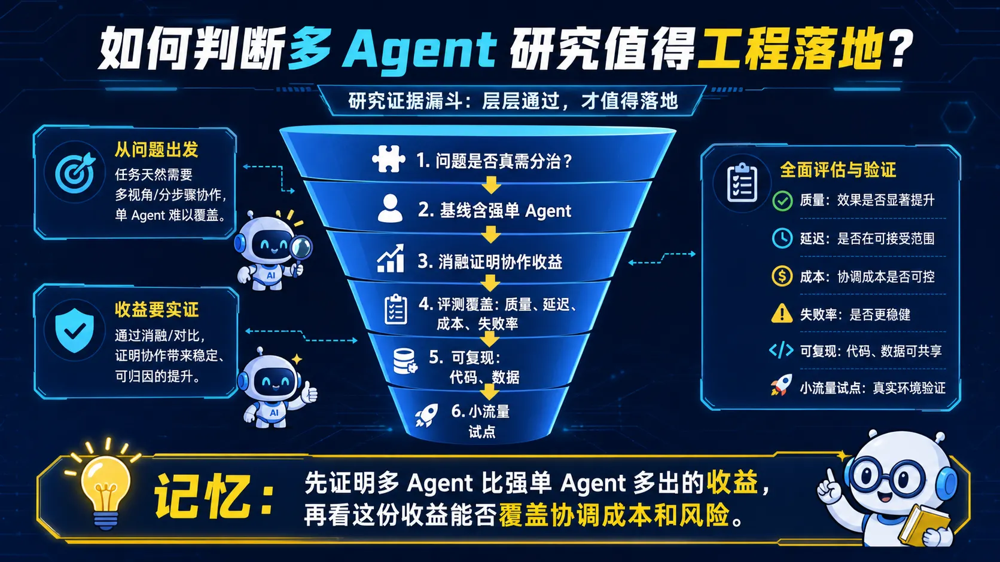</a>

> 🧠 **图解记忆：** 先证明多 Agent 比强单 Agent 多出的收益，再看这份收益能否覆盖协调成本和风险。

<details>
<summary>💡 答案要点</summary>

**ArXiv 2026年4月2日AI Agent研究概览**

```
当日收录：25篇cs.AI论文
其中直接相关：约12篇
覆盖维度：基础架构/性能评估/多智能体协作/实际应用
```

---

**研究热点一：HippoCamp——PC环境多模态Agent基准测试**

```
论文：HippoCamp: Benchmarking Contextual Agents on Personal Computers
来源：arXiv:2604.01221

核心贡献：
  → 提出HippoCamp基准，专门评估Agent在个人电脑环境中的多模态文件管理能力
  → 包含42.4GB真实用户数据，覆盖2000+个文件
  → 构建581个QA对（搜索/证据感知/多步推理）
  → 最先进商业模型仅达到48.3%用户画像准确率

面试价值：
  → 48.3%说明当前Agent在真实PC任务上仍有巨大提升空间
  → 2026年企业部署Agent ≠ Agent能做好你的工作
  → 多模态文件管理（理解截图+文档+代码）是下一战场
```

---

**研究热点二：OmniMem——多模态Agent终身记忆框架**

```
论文：OmniMem: Autoresearch-Guided Discovery of Lifelong Multimodal Agent Memory
来源：arXiv:2604.01007

核心贡献：
  → 通过自主研究管道发现统一的多模态记忆框架
  → LoCoMo基准F1分数：0.117 → 0.598（+411%）
  → Mem-Gallery基准：0.254 → 0.797（+214%）
  → 架构改进、错误修复和提示工程贡献最大

技术意义：
  → 终身学习Agent的核心是记忆管理
  → 自主研究管道 = AI自动发现最优记忆架构
  → 多模态（文本+视觉+语音）统一记忆 = 未来方向
```

---

**研究热点三：HERA——多智能体RAG与自组织编排**

```
论文：HERA: Multi-agent RAG with Evolving Orchestration and Agent Prompts
来源：arXiv:2604.00901

核心贡献：
  → 提出HERA分层框架，共同演化多智能体编排+特定角色Agent提示
  → 在六个知识密集型基准上平均提升38.69%
  → 展现出涌现的自组织特性

面试价值：
  → 多智能体RAG ≠ 多个Agent检索后拼接
  → HERA的核心是"编排"和"提示"共同演化
  → 自组织特性 = 系统自己学会优化协作流程
  → 企业RAG升级路径：传统RAG → Agentic RAG → HERA式多Agent RAG
```

---

**研究热点四：BloClaw——多模态Agent科学发现工作空间**

```
论文：BloClaw: An Omniscient, Multi-Modal Agentic Workspace for Next-Generation Scientific Discovery
来源：arXiv:2604.00550

核心贡献：
  → 统一的多模态操作系统，用于科学发现
  → XML-Regex双轨路由协议：错误率0.2% vs 17.6%（传统方法）
  → 运行时状态拦截沙箱，自动捕获数据可视化
  → 覆盖：化学信息学/3D蛋白质折叠/分子对接

技术突破：
  → 0.2% vs 17.6%的错误率差距说明路由协议设计至关重要
  → 多模态Agent从"单一任务"走向"完整科学发现流程"
  → Agent作为科学家：提出假设→设计实验→分析结果→迭代改进
```

---

**研究热点五：NARCBench——多智能体合谋检测**

```
论文：Detecting Multi-Agent Collusion Through Multi-Agent Interpretability
来源：arXiv:2604.01151

核心贡献：
  → 提出NARCBench基准，评估环境分布变化下的合谋检测
  → 开发五种探测技术，分布内达到1.00 AUROC
  → 零样本转移到不同场景：0.60-0.86 AUROC
  → 发现：合谋信号在token级别是局部化的

企业安全启示：
  → 多智能体系统不只是协作，也可能"串通"
  → 合谋检测 = Agent安全审计的新维度
  → token级别局部化 = 可以通过注意力权重分析发现
  → 2026年企业级Agent系统必须考虑合谋风险
```

---

**五大研究热点的生产启示**

```
研究热点          生产启示
─────────────────────────────────────────────────────
HippoCamp        Agent在PC任务上只有48%准确率，
                 不要高估Agent当前能力边界

OmniMem          记忆管理是终身学习Agent的核心，
                 F1提升411%说明架构优化空间巨大

HERA             多智能体RAG的核心是"共同演化"，
                 不是静态编排

BloClaw          Agent正在从工具变成科学家，
                 科学发现是下一个杀手级应用

NARCBench        多智能体系统需要安全审计，
                 合谋检测是新的安全维度
```

---

**面试话术：**

> "2026年4月的ArXiv AI Agent研究揭示了五个重要方向。HippoCamp的48.3%准确率是个清醒剂——说明当前最先进的商业模型在真实PC任务上还做不到一半，这对企业部署预期管理很重要。OmniMem的411% F1提升说明记忆管理是终身学习Agent的决胜点。HERA的38.69%提升来自'共同演化'而非简单拼接，这解释了为什么很多企业的多Agent RAG效果不好。BloClaw的0.2%错误率证明了一个好的路由协议设计可以让Agent系统可靠性提升两个数量级。NARCBench最容易被忽视——多智能体系统不只有协作，还有合谋风险，企业级Agent系统需要把合谋检测纳入安全审计。"

</details>

## 五、Critic / Verifier 双 Agent 模式

### Q12: Critic/Verifier Agent 为什么可能提升质量，又可能造成什么问题？

<a href="../../assets/illustrations/13-multi-agent-systems/q12-critic-verifier.webp">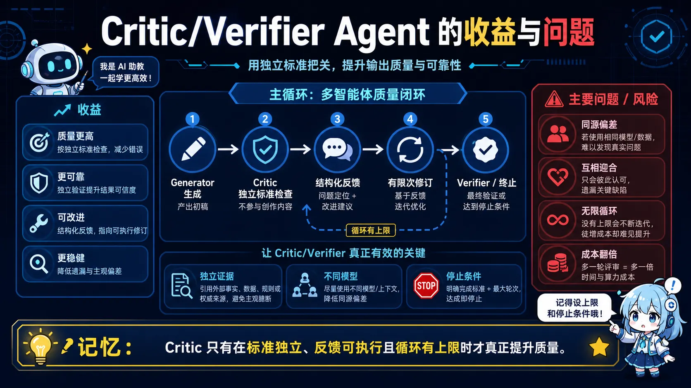</a>

> 🧠 **图解记忆：** Critic 只有在标准独立、反馈可执行且循环有上限时才真正提升质量。

<details>
<summary>💡 答案要点</summary>

**背景：学术图表生成的痛点**

AI 可以帮研究者写文字，但生成顶会/期刊需要的复杂方法图和精确统计图要难得多——这需要理解技术内容、遵循学术规范、还要视觉美观。

**PaperVizAgent 解决方案：五Agent协作系统**

```
┌─────────────────────────────────────────────────────┐
│              PaperVizAgent 架构                     │
├─────────────────────────────────────────────────────┤
│  输入：方法章节文本 + 图表描述（caption）           │
│                                                     │
│  ① Retriever（检索Agent）                          │
│     → 从文献库检索相关学术图表作为参考              │
│                                                     │
│  ② Planner（规划Agent）                             │
│     → 组织内容结构，确定可视化方案                  │
│                                                     │
│  ③ Stylist（风格Agent）                            │
│     → 合成学术规范（论文格式、配色、布局标准）      │
│                                                     │
│  ④ Visualizer（可视化Agent）                       │
│     → 渲染图像 或 生成统计图的Python代码           │
│                                                     │
│  ⑤ Critic（评审Agent） ← 关键创新！                │
│     → 对照原文检查一致性                            │
│     → 若发现不一致 → 反馈给Visualizer → 迭代优化   │
│     → 循环直到通过评审                             │
└─────────────────────────────────────────────────────┘
```

**Critic 循环：质量保障的关键**

> "传统生成流程是'一锤子买卖'——生成完就结束。PaperVizAgent 的创新在于引入了 Critic Agent 作为质量门卫，它会对照原文检查生成结果，发现问题就打回重做。这个循环迭代机制确保了最终输出既视觉美观又技术准确。"

**性能对比（PaperVizAgent vs baselines）：**

| 维度 | PaperVizAgent | GPT-Image-1.5 | Paper2Any |
|------|---------------|---------------|-----------|
| Faithfulness（忠于原文）| 最优 | 差 | 中等 |
| Conciseness（简洁性）| 最优 | 中等 | 差 |
| Readability（可读性）| 最优 | 中等 | 中等 |
| Aesthetics（美观度）| 最优 | 差 | 中等 |

**ScholarPeer：AI 审稿人**

> "与 PaperVizAgent 对应，Google 还发布了 ScholarPeer——一个自动化学术论文审稿Agent。它能严格评估论文质量，包括内嵌图表，目前在自动化审稿中领先。"

**面试话术：**

> "PaperVizAgent 展示了多Agent系统的真正威力——不是多个 Agent 简单拼接，而是各司其职、循环迭代。Retriever 找参考、Planner 规划、Stylist 规范风格、Visualizer 生成、Critic 评审质量。这套架构可以迁移到任何需要高质量输出的场景——不只是画图，代码生成、报告撰写、数据分析都行。关键是引入 Critic 循环，让质量检查成为生成流程的一部分，而不是事后补漏。"

</details>

---

*版本: v2.8 | 更新: 2026-04-14 | by 二狗子 🐕*

---

## 六、Agent Skills 与 Tools

### Q13: Agent Skills 和 Tools 有什么区别？

<a href="../../assets/illustrations/13-multi-agent-systems/q13-skills-vs-tools.webp">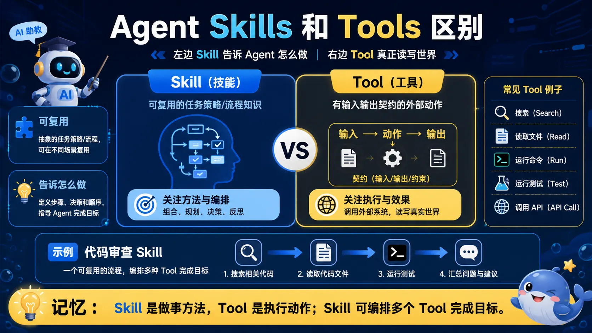</a>

> 🧠 **图解记忆：** Skill 是做事方法，Tool 是执行动作；Skill 可编排多个 Tool 完成目标。

<details>
<summary>💡 答案要点</summary>

**背景：Skills 是 2026 年 Agent 架构的新关键词**

2026 年，随着多 Agent 系统成熟，"Skills" 作为独立概念从 "Tools" 中分离出来。Skills = 知识 + 行为模式 + 示例 + SOP，比 Tools 的粒度更粗、更面向业务。

**Tools vs Skills 本质区别：**

```
┌─────────────────────────────────────────────────────┐
│          Tools vs Skills 核心区别                   │
├─────────────────────────────────────────────────────┤
│                                                     │
│  Tools（原子操作）                                  │
│  ├─ 本质：可执行的函数/API                          │
│  ├─ 粒度：原子级别（如"发送邮件"、"查询天气"）      │
│  ├─ 包含：输入/输出 Schema                          │
│  ├─ 无状态：每次调用独立                             │
│  └─ 示例：send_email(to, subject, body)             │
│                                                     │
│  Skills（复合能力）                                  │
│  ├─ 本质：知识 + 行为模式                            │
│  ├─ 粒度：复合能力（如"撰写商务邮件"）              │
│  ├─ 包含：示例、SOP、风格指南、依赖工具集            │
│  ├─ 有状态：包含上下文理解                           │
│  └─ 示例：compose_business_email(context, tone)     │
│           → 调用 send_email + lookup_contact + ...  │
└─────────────────────────────────────────────────────┘
```

**Skills 的核心组成：**

<details>
<summary>展开 Yaml 代码示例（31 行）</summary>

```yaml
# Skill 定义示例：撰写商务邮件
skill:
  name: "compose_business_email"
  description: "撰写符合公司规范的商务邮件"
  
  # 知识：邮件写作规范
  knowledge:
    - 签名格式规范
    - 称呼礼仪
    - 公司品牌调性
  
  # 示例：少量参考
  examples:
    - input: "客户投诉产品质量"
      output: "确认收到 → 表达歉意 → 解决方案 → 跟进计划"
    - input: "项目进度汇报"
      output: "结论先行 → 细节支撑 → 下一步行动"
  
  # 依赖的工具
  dependencies:
    - send_email
    - lookup_contact
    - get_customer_context
  
  # 标准操作流程
  sop:
    - step1: 理解邮件目的和收件人
    - step2: 检索相关信息（客户历史、项目背景）
    - step3: 生成初稿
    - step4: 按公司规范格式化
    - step5: 发送并记录到 CRM
```

</details>

**为什么 Skills 在 2026 年变得重要：**

```
1. 多Agent协作需要"技能包"而非"工具箱"
   - 单个工具太细，Agent 需要更高层次的抽象
   - Skills 提供了业务语义层的封装

2. 知识沉淀从个人到组织
   - 专家经验 → Skills 定义 → 可复用资产
   - 新 Agent 通过加载 Skills 快速具备能力

3. MCP 协议成熟后，Skills 成为下一层抽象
   - MCP = 工具标准化（USB-C）
   - Skills = 能力标准化（技能包）
```

**Dify Nacos A2A 插件：解决 Agent 发现难题**

> "Dify 通过 Nacos A2A 插件实现双向多智能体协作，解决协议不兼容与智能体发现难题。"

**解决的问题：**

| 问题 | 传统方案 | Nacos A2A 方案 |
|------|----------|----------------|
| **Agent 发现** | 硬编码地址，静态配置 | Nacos 服务注册与发现，动态 |
| **协议不兼容** | 每个 Agent 自定义协议 | A2A 标准协议，统一通信 |
| **扩缩容** | 手动配置 | 服务自动注册/注销，弹性 |
| **监控** | 无统一视图 | Nacos 提供注册状态监控 |

**Nacos A2A 架构：**

```
┌─────────────────────────────────────────────────────┐
│           Dify + Nacos A2A 架构                    │
├─────────────────────────────────────────────────────┤
│                                                     │
│  Agent 注册层（Nacos）                               │
│  ├── Agent A（客服）注册到 Nacos                     │
│  ├── Agent B（SRE）注册到 Nacos                     │
│  └── Agent Card 自动同步                            │
│                                                     │
│  A2A 通信层                                         │
│  ├── Agent A 发现 Agent B（通过 Nacos）              │
│  ├── A2A 协议标准化通信                             │
│  └── Gateway 做路由和鉴权                           │
│                                                     │
│  Dify 工作流编排层                                   │
│  ├── 多 Agent 协作流程可视化                         │
│  └── 定时/事件触发                                   │
└─────────────────────────────────────────────────────┘
```

**生产级 Skills 部署示例：**

```python
# 用 LangGraph 加载和使用 Skills
from langgraph.prebuilt import SkillExecutor

# 定义 Skill（复合能力）
skill = Skill(
    name="customer_complaint_handler",
    description="处理客户投诉的完整流程",
    # Skills 包含多个 Tools 和 SOP
    tools=["lookup_customer", "send_email", "create_ticket"],
    sop=[
        {"step": 1, "action": "lookup_customer", "input": "customer_id"},
        {"step": 2, "action": "analyze_complaint", "context": "complaint_type"},
        {"step": 3, "action": "decide_response", "rules": "complaint_routing_rules"},
        {"step": 4, "action": "send_email", "template": "complaint_response"},
        {"step": 5, "action": "create_ticket", "if": "severity > high"}
    ],
    examples=[
        {"input": "产品质量问题", "output": "道歉 + 退款 + 跟进"},
        {"input": "服务态度投诉", "output": "道歉 + 调查 + 反馈"}
    ]
)

# Agent 加载 Skill
agent = ReActAgent(skills=[skill])
result = agent.run("客户张先生反映最近订单发货延迟")

# Skill 自动执行完整流程，无需手动调用每个 Tool
```

**Skills 选型决策树：**

```
需要的能力？
├── 原子操作（发送邮件、查天气）→ Tools（MCP 协议）
└── 复合能力（撰写邮件、处理投诉）→ Skills（自研或 Skills 框架）
    
场景？
├── 单 Agent 调用工具 → MCP + Tools
└── 多 Agent 协作 + 知识复用 → Skills + A2A

团队规模？
├── 小团队 → 用 Skills 框架自带的管理
└── 企业级 → Dify Nacos A2A / 自建 Skills Registry
```

**面试话术：**

> "2026 年 Skills 和 Tools 的区别是高频考点。核心理解是：Tools 是原子操作（做一件事），Skills 是复合能力（做好一件事）。Tools 解决'能不能调用'的问题，Skills 解决'会不会调用'的问题。就像餐厅里，Tools 是厨师会切菜，Skills 是厨师会根据客人口味做出一道完整的菜。生产环境中，我把 Skills 定义成企业的'数字员工培训包'——专家经验固化在 Skills 里，新 Agent 加载后立刻具备能力，不需要每个 Agent 都从零学习。Dify 的 Nacos A2A 插件解决了多 Agent 发现的问题，让 Agent 可以动态注册和发现，不需要硬编码。"

**延伸阅读：**
- Dify Nacos A2A: https://www.53ai.com/news/dify/2026012605289
- LangChain Skills: https://langchain-ai.github.io/langgraph/

</details>

---

*版本: v2.9 | 更新: 2026-05-09 | by 二狗子 🐕*

### Q14: A2A 和 MCP 的协议边界在哪里？

<a href="../../assets/illustrations/13-multi-agent-systems/q14-a2a-mcp-boundary.webp">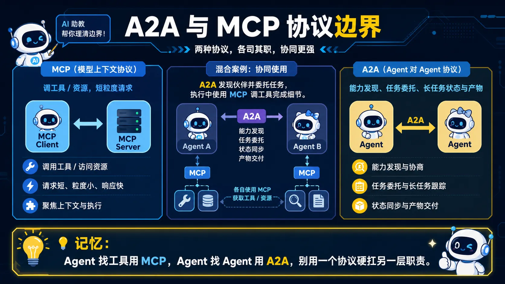</a>

> 🧠 **图解记忆：** Agent 找工具用 MCP，Agent 找 Agent 用 A2A，别用一个协议硬扛另一层职责。

<details>
<summary>💡 答案要点</summary>

**A2A vs MCP 的核心差异（面试必考）：**

```
A2A = "Agent 找 Agent" → 能力注册 + 任务委托 + 状态同步
MCP = "Agent 找工具" → 工具发现 + 调用执行 + 结果返回

类比：
- MCP = USB 协议 → 鼠标、键盘插入电脑就能用
- A2A = HTTP 协议 → 浏览器找服务器通信

一个 Agent 要调用外部工具 → MCP
两个 Agent 要协作完成一件事 → A2A
```

**什么时候只用 MCP，不用 A2A：**

| 场景 | 原因 |
|------|------|
| 单 Agent + 多个工具 | Agent 只需要调用工具，不需要和其他 Agent 通信 |
| 工具是确定性服务（查数据库、调 API） | MCP 的 request/response 模式更简单直接 |
| 企业已有 MCP Server 生态 | 直接复用，不需要额外搭建 A2A 基础设施 |

**什么时候只用 A2A，不用 MCP：**

| 场景 | 原因 |
|------|------|
| 多 Agent 协作，但没有外部工具需求 | Agent 之间同步状态、分工，不需要调用外部工具 |
| 任务委派（Task Delegation） | 一个 Agent 把任务交给另一个 Agent，需要双向状态同步 |
| 实时协作（Real-time Collaboration） | Agent 之间需要持续交换中间结果 |

**什么时候必须 A2A + MCP 混合？**

<details>
<summary>展开 Python 代码示例（35 行）</summary>

```python
"""
企业销售 Agent 场景（必须混合）：

1. 用户问："帮我查一下这个客户的订单状态，并生成退货策略"

2. 客服 Agent（用 MCP 调用内部系统）
   ↓ MCP: 调用 order_service.get_order(customer_id)
   ↓ MCP: 调用 return_policy.get_policy(customer_id)

3. 客服 Agent 发现需要专业数据分析
   ↓ A2A: 把"生成退货策略"委托给数据分析 Agent

4. 数据分析 Agent（用 MCP 调用 BI 工具）
   ↓ MCP: 调用 tableau_api.query(sales_data)

5. 分析结果通过 A2A 传回客服 Agent
   ↓ A2A: 返回分析结果

6. 客服 Agent（用 MCP 调用邮件服务）
   ↓ MCP: 调用 email_service.send(customer_id, strategy)

结论：工具调用 = MCP，Agent 协作 = A2A，复杂场景必须混合
"""

# 架构图
# ┌─────────────┐       MCP        ┌──────────────┐
# │  客服Agent  │ ←──────────────→ │ Order Service │
# │             │                  └──────────────┘
# │             │       A2A         ┌──────────────┐
# │             │ ←──────────────→ │ 数据分析Agent │
# └─────────────┘                  └──────────────┘
#       ↑                                  ↑
#       │          MCP                     │
#       └──────────────────────────────────┘
#              BI Tools / Email
```

</details>

**生产级 A2A + MCP 混合架构检查项：**

| 检查项 | 说明 |
|--------|------|
| **协议职责边界清晰** | 工具调用走 MCP，Agent 协作走 A2A，不能混用 |
| **MCP Server 发现** | A2A Agent 发现时同步可用 MCP 工具清单 |
| **上下文传递** | A2A 任务委派时，自动把相关 MCP 工具上下文一起传 |
| **错误处理** | MCP 超时 → A2A 重试；A2A Agent 不可用 → 降级到其他 Agent |
| **安全隔离** | MCP 工具调用走工具鉴权，A2A 通信走 Agent 身份认证 |
| **监控分离** | MCP 指标和 A2A 指标分开收集，独立告警 |

**面试话术：**
> "A2A 和 MCP 是不同层的协议，不存在谁替代谁。我的经验法则：'Agent 找工具'用 MCP，'Agent 找 Agent'用 A2A。企业级场景几乎都需要混合——单 Agent 调用工具时用 MCP，多 Agent 协作分工时用 A2A。面试时能说清楚协议边界和什么时候必须混合，说明你对 Agent 架构有生产级理解。"

</details>

---

<a id="runtime-orchestration"></a>

## 七、多 Agent 职责划分与层级任务分解

### Q15: 如何做职责划分和层级任务分解？

<a href="../../assets/illustrations/13-multi-agent-systems/q15-hierarchical-decomposition.webp">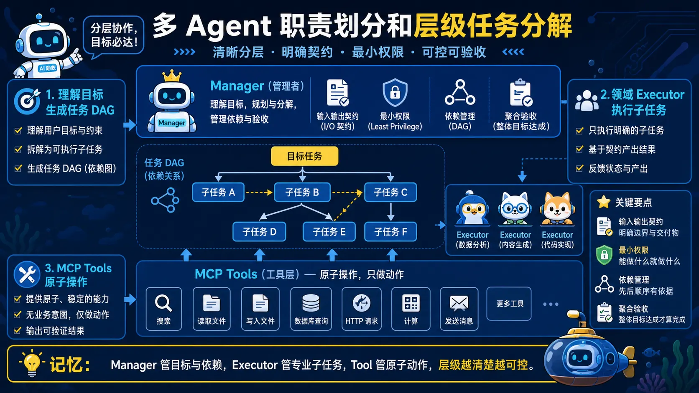</a>

> 🧠 **图解记忆：** Manager 管目标与依赖，Executor 管专业子任务，Tool 管原子动作，层级越清楚越可控。

<details>
<summary>💡 答案要点</summary>

**扁平 vs 层级架构对比：**

```
扁平架构（Flat）：
  ┌─────────────────────────────────────┐
  │           Orchestrator              │
  │     （单点协调，所有决策）            │
  └─────────────────────────────────────┘
         ↓            ↓            ↓
    ┌────────┐   ┌────────┐   ┌────────┐
    │检索Agent│   │生成Agent│   │审核Agent│
    └────────┘   └────────┘   └────────┘
    问题：Orchestrator 成为瓶颈，单点故障

层级架构（Hierarchical）：
  ┌─────────────────────────────────────┐
  │        Manager Agent（管理层）        │
  │  理解任务 → 分解 → 分派 → 汇总       │
  └─────────────────────────────────────┘
         ↓            ↓            ↓
  ┌────────────┐ ┌────────────┐ ┌────────────┐
  │ 执行层Agent │ │ 执行层Agent │ │ 执行层Agent │
  │  （检索）    │ │  （生成）    │ │  （审核）   │
  └────────────┘ └────────────┘ └────────────┘
         ↓            ↓            ↓
  ┌────────────┐ ┌────────────┐ ┌────────────┐
  │ 工具层MCP  │ │ 工具层MCP  │ │ 工具层MCP  │
  │ (搜索/数据库)│ │(生成模型) │ │(质量验证)  │
  └────────────┘ └────────────┘ └────────────┘
```

**三层 Agent 职责划分（企业级标准）：**

| 层级 | Agent | 职责 | 特点 |
|------|--------|------|------|
| **L1 管理（Manager）** | Task Decomposer | 理解高层需求，分解子任务，协调执行顺序 | 高层推理、低频调用 |
| **L2 执行（Executor）** | Retrieval Agent, Generation Agent | 接收具体子任务，执行并返回结果 | 中层技能、高频调用 |
| **L3 工具（Tool）** | MCP Server 调用 | 底层工具执行（搜索、数据库、API） | 原子操作、超高频调用 |

**层级任务分解原理：**

<details>
<summary>展开 Python 代码示例（43 行）</summary>

```python
class HierarchicalMultiAgent:
    """层级多 Agent 系统"""
    
    def __init__(self):
        self.manager = ManagerAgent()       # L1
        self.executors = {                 # L2
            "retrieval": RetrievalAgent(),
            "generation": GenerationAgent(),
            "review": ReviewAgent()
        }
        self.tool_registry = ToolRegistry() # L3 (MCP)
    
    def solve(self, user_request: str) -> str:
        # L1: Manager 理解需求，分解为子任务图
        task_graph = self.manager.decompose(user_request)
        # task_graph = {"steps": [("retrieval", "query"), ...], "order": "sequential"}
        
        # L2: 按依赖顺序执行子任务
        context = {}
        for step_name, step_type in task_graph["steps"]:
            executor = self.executors.get(step_type)
            result = executor.execute(task=step_name, context=context)
            context[f"{step_type}_result"] = result
        
        # L1: Manager 汇总结果，生成最终答案
        final_answer = self.manager.aggregate(context)
        return final_answer


# 扁平 vs 层级的核心区别
"""
扁平：
  - 所有 Agent 都能调用所有工具
  - 容易产生循环调用、重复调用
  - 难以追踪任务状态
  - 适用场景：<5个 Agent、简单任务

层级：
  - Manager 才有任务分解权限
  - Executor 只能调用被分配的工具
  - 任务状态清晰可追踪
  - 适用场景：>5个 Agent、复杂任务
"""
```

</details>

**HTTP 协议对多 Agent 通信的影响（面试重点）：**

```
为什么 HTTP 是多 Agent 通信的事实标准？

1. 无状态 = 每个请求独立，Agent 可以水平扩展
   HTTP 请求可以负载均衡到任意 Agent 实例

2. 文本头 = 元数据传递（TraceID、Authorization）
   headers["X-Trace-ID"] = "abc123"  # 分布式追踪
   headers["X-Agent-Role"] = "retrieval"  # 角色标注

3. REST 语义 = 清晰的操作语义
   POST = 创建任务
   GET = 查询状态
   DELETE = 取消任务

4. 广泛工具支持 = MQTT/WebSocket/SSE 都能 tunnel HTTP
   企业内部几乎所有中间件都支持 HTTP

⚠️ HTTP 的局限（必须说）：
- 延迟高：每次请求都要 TCP 握手
- 无内置 pub/sub：无法像 MQTT 那样 pub/sub
- 不适合超低延迟场景：高频工具调用走 MCP 更高效
```

**生产级 Agent 职责划分决策树：**

```
有多少 Agent？
├── ≤3 个 → 扁平架构足够
├── 4~10 个 → 层级架构（Manager + Executors）
└── >10 个 → 层级 + 领域分组（Domain-based）

任务复杂度？
├── 简单单一任务 → 扁平（直接执行）
├── 中等（子任务有依赖）→ 层级（Manager 分解）
└── 复杂（子任务并行/有条件分支）→ 层级 + 任务队列

Agent 间通信频率？
├── 高频（工具调用级别）→ MCP 直连
├── 低频（任务委派级别）→ A2A/HTTP
└── 混合 → A2A+MCP 分层
```

**企业级案例：智能客服多 Agent 系统职责划分：**

```
用户："帮我查一下我上个月的话费，并和上上个月对比"

L1 Manager Agent：
  → 理解意图：查询 + 对比
  → 分解任务：[("retrieval", "查询本月话费"), ("retrieval", "查询上月话费"), ("comparison", "对比两个月")]
  → 派发任务给 L2 Executor

L2 Executor Agent（Retrieval）：
  → 调用 MCP Server 查询数据库
  → 返回两条账单数据

L2 Executor Agent（Comparison）：
  → 接收两条数据
  → 调用计算工具 MCP Server
  → 返回对比结果

L1 Manager Agent：
  → 汇总结果，生成用户友好的回复
  → 返回："您上个月话费 128元，比上上个月多了15元，主要是因为..."
```

**面试话术：**

> "是否使用层级架构取决于任务依赖、权限边界和协调成本，而不是 Agent 数量超过某个固定阈值。Manager—Worker 适合集中分解与汇总，点对点或共享状态适合其他协作模式；无论哪种都要限制扇出、工具权限、预算和终止条件。MCP 是工具与上下文互操作协议，不是 HTTP 的低延迟替代品；高频通信应根据同进程调用、RPC、消息队列或流式传输等实际需求选型。"

</details>

### Q16: 大规模并行 Agent 的收益和瓶颈是什么？

<a href="../../assets/illustrations/13-multi-agent-systems/q16-parallel-agent-bottlenecks.webp">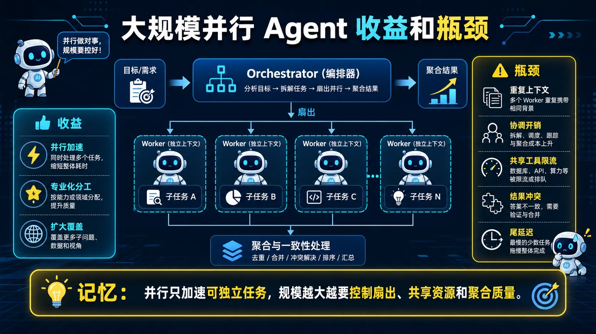</a>

> 🧠 **图解记忆：** 并行只加速可独立任务，规模越大越要控制扇出、共享资源和聚合质量。

<details>
<summary>💡 答案要点</summary>

**背景：2026年5月 Moonshot AI 发布 Kimi K2.6**


Kimi K2.5 在 2026年1月 引入了 Agent Swarm（100个并行子Agent），K2.6 把这个数字提升到了 300 个子Agent、4000 步并发执行，这是目前公开报道中规模最大的商业化多Agent并行架构之一。

---


**Agent Swarm 核心架构：**

```
Kimi K2.6 Agent Swarm 架构：
┌─────────────────────────────────────────────────────┐
│                 Orchestrator Agent（K2.6）           │
│                 顶层任务分解 + 调度                   │
└─────────────────────┬───────────────────────────────┘
                      │ 任务分发（最多 300 并行）
        ┌─────────────┼─────────────┬─────────────┐
        ▼             ▼             ▼             ▼
   Sub-Agent 1   Sub-Agent 2  ... Sub-Agent N   
   (独立执行)    (独立执行)      (最多 300 个)     
        │             │             │             │
        ▼             ▼             ▼             ▼
   Tool Calls   Tool Calls  Tool Calls   Tool Calls  
   (MCP Server) (MCP Server) (MCP Server) (MCP Server)
```

**与传统多Agent架构的本质区别：**


| 特性 | 传统多Agent（如CrewAI/AutoGen） | Kimi K2.6 Agent Swarm |
|------|-------------------------------|---------------------|
| **子Agent 数量** | 3-10 个 | 300 个（可扩展） |
| **执行模式** | 串行 or 有限并行 | 真正大规模并行 |
| **任务分解** | 手工设计 | LLM 自动分解 |
| **上下文管理** | 共享全局上下文 | 每个子Agent独立上下文 |
| **适用场景** | 简单协作流程 | 复杂多维任务（如金融分析） |
| **代表场景** | 客服对话、文档生成 | 实时市场分析、风险评估、竞品研究 |

---

**K2.6 相比 K2.5 的关键升级：**

| 维度 | Kimi K2.5（Agent Swarm） | Kimi K2.6（Agent Swarm） |
|------|--------------------------|--------------------------|
| **子Agent 数量** | 100 个并行 | **300 个并行** |
| **执行步数** | ~2000 步 | **~4000 步** |
| **多模态** | 仅文本 | **文本 + 图像 + 视频** |
| **上下文** | 128K | **1M+ token** |
| **工具调用** | MCP Server | **MCP + Function Calling 混合** |
| **典型场景** | 文档研究、竞品分析 | 实时金融分析、全网舆情、医疗影像 |

---

**生产级应用场景：**

```python
# Kimi K2.6 Agent Swarm 典型场景代码

# 场景1：实时金融分析（300个并行子Agent）
tasks = [
    "分析茅台股票今日走势",
    "查询 A股 白酒板块行情",
    "分析茅台财务报表",
    "搜索茅台近期新闻舆情",
    "对比五粮液/泸州老窖财务数据",
    # ... 最多 300 个子任务
]

# Orchestrator 自动分解 + 并行调度
result = k2.6_swarm.analyze(
    task="分析茅台今日是否值得买入",
    sub_agent_count=300,  # 最多 300 个子Agent
    max_steps=4000,        # 每个Agent最多 4000 步
    tools=[mcp_server]
)

# 场景2：全网竞品研究（100个并行子Agent）
result = k2.6_swarm.research(
    task="研究智能汽车市场竞品分析报告",
    sub_agent_count=100,
    sources=[mcp_server, web_search]
)
```

---

**为什么这是重大突破？（面试核心观点）**

> **传统多Agent的瓶颈：规模 + 协调**
> 
> 当你想让 10 个 Agent 协作时，CrewAI 的 sequential/hierarchical 模式够用。
> 但当你需要 100-300 个 Agent 同时工作时，所有已知的协调模式都会面临：
> 
> 1. **上下文爆炸**——每个子Agent都消耗上下文，全局上下文很快超出限制
> 2. **协调开销**——Orchestrator 和子Agent 之间的通信成为瓶颈
> 3. **资源竞争**——300 个 Agent 同时访问 MCP Server 时需要限流熔断
> 
> Kimi K2.6 的 Agent Swarm 通过**独立上下文 + MCP 工具层 + 自动任务分解**解决了这三个问题。

---


**面试话术：**
> **示例表达（仅在能用本人经历或可复现实验佐证时使用）：** "Kimi K2.6 的 Agent Swarm 代表了 2026 年多Agent系统的规模化方向。从面试角度看，这个架构回答了一个经典问题：'当 Agent 数量从 10 个扩展到 300 个时，架构要怎么改？'答案是：不能靠手工设计协作流程，必须让 LLM 自己做任务分解。K2.6 的三层设计——Orchestrator 分解任务、Sub-Agent 并行执行、MCP Server 提供工具——是企业级多 Agent 系统的参考架构。我在项目中也遇到过类似场景，比如需要同时查询多个数据源做聚合分析，K2.6 的思路是让每个数据源由一个独立的 Sub-Agent 处理，避免了单 Agent 访问所有 API 导致的超时和上下文溢出问题。"

</details>

---

### Q17: 运行时动态多 Agent 编排如何控制质量、延迟和成本？

<a href="../../assets/illustrations/13-multi-agent-systems/q17-dynamic-orchestration.webp">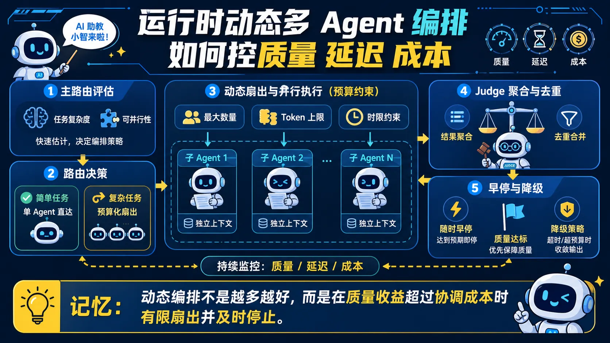</a>

> 🧠 **图解记忆：** 动态编排不是越多越好，而是在质量收益超过协调成本时有限扇出并及时停止。

**考点：** 多Agent架构、测试时计算扩展、Orchestrator-SubAgent 模式、推理成本控制
<details>
<summary>💡 答案要点</summary>

#### 核心答案

**GPT-5.6 是 2026 年 6-7 月 OpenAI 发布的三层模型家族（不是单一模型）：**

| 型号 | 定位 | 特点 |
|------|------|------|
| **Sol** | 旗舰 | 最强推理/编码/安全能力，价格 $30/1M tokens |
| **Terra** | 平衡 | 对标 GPT-5.5 性能，成本约一半，生产默认选择 |
| **Luna** | 轻量 | 最低价格，高吞吐/成本敏感场景 |

**Sol 附带两个新的推理控制项（这是真正的架构变化）：**

```
1. max 推理档位：单 Agent 的"更深度推理"
   → 在 low/medium/high 之上新增，给同一个模型更多思考时间
   → 一条更长的链式推理，本质还是"单 Agent 深挖"

2. ultra 模式：多 Agent 编排（Multi-Agent Orchestration）
   → 不是新模型，是 Sol 的编排模式
   → 运行时由模型自己动态创建多个子 Agent 并行工作
   → 完成后合并输出
```

#### Ultra 模式的工作原理（面试必讲）

```
传统单线程推理（非 ultra）：
  用户请求 → [规划 → 执行 → 检查 → 迭代] × N 步 → 输出
  ⚠️ 任务一大，单条上下文链就会：丢上下文 / 子目标来回横跳

Ultra 模式：
  用户请求 → Orchestrator（主 Agent）
              ├── 拆解任务 → 子任务 A → 子 Agent 1（独立上下文+独立推理预算）
              ├── 拆解任务 → 子任务 B → 子 Agent 2（并行执行）
              ├── 拆解任务 → 子任务 C → 子 Agent 3（并行执行）
              └── 汇总 → 合并结果 → 最终答案
```

**关键设计：每个子 Agent 拥有自己的上下文窗口和推理预算（reasoning budget），互不干扰。** 这解决了单 Agent 长任务的核心痛点——单条上下文链会随着步数增长而"注意力稀释"、丢失早期关键信息。

#### 基准表现（2026 年 7 月官方数据）

- **Agents' Last Exam**：Sol Ultra 以 13.1 分优势碾压 Anthropic Claude Fable 5
- **Terminal-Bench 2.1**（终端操作）：88.8 → 91.9
- **网络安全场景**：ultra 模式协调 4 个并行 Agent 通过 Programmatic Tool Calling 运行轻量代码，Token 消耗降低 1/3

#### Ultra vs Claude Managed Agents（Anthropic 的对应方案）

| 对比维度 | OpenAI Sol Ultra | Claude Managed Agents |
|----------|------------------|----------------------|
| 思路 | 主 Agent 动态 spawn 子 Agent | 主 Agent（Fable 5）作为 manager 委托给 Sonnet 5 执行 |
| 上下文策略 | 每子 Agent 独立上下文 | 隔离子 Agent 缓存，消除重复上下文成本 |
| 成本表现 | 价格较高（$30/1M） | 92% SWE-Bench Pro 能力 @ 63% 价格 |
| Web 自动化 | 未披露 | 96% 基准达成，成本更低 |

#### 使用限制（面试加分点）

- Ultra 模式目前是**政府安全审查门控的预览版**，仅 API/Codex 可用，未进 ChatGPT
- ultra 会扇出多个子 Agent，**成本不低**——只适合高难度、可并行的长程任务
- 不是所有任务都该开 ultra：简单问题开 ultra 是浪费 token

---

**面试话术：**
> "GPT-5.6 Ultra 的本质不是新模型，而是'测试时计算扩展（Test-Time Compute Scaling）'的新形态。以前扩展测试时计算是给一个模型更多思考时间（max 档），ultra 则是从'单链深挖'变成'多 Agent 并行扇出'——由模型自己当 Orchestrator 动态拆解任务、生成子 Agent、合并结果。这回答了多 Agent 面试题里最关键的问题：'什么时候该用多 Agent？'答案是：任务可并行、单链会丢上下文的时候。我在实际项目中控制成本的原则是——简单任务用单 Agent 深链，复杂长程任务才开多 Agent 编排，避免无脑扇出导致 token 成本爆炸。面试官如果问'多 Agent 的边界'，用 Sol Ultra 的例子回答最有说服力：OpenAI 自己也是把它当成一个可选的推理档位，而不是默认架构。"

**延伸阅读：**
- OpenAI GPT-5.6 官方预览（2026-06）：https://openai.com
- GPT-5.6 Ultra 架构解析：https://apidog.com/blog/gpt-5-6-ultra-mode

</details>


---

*版本: v3.128 | 更新: 2026-08-10 | by 二狗子 🐕*


---
## 十九、生产环境多 Agent 编排：反模式与场景设计（Q18）

### Q18: 生产环境多 Agent 编排有哪些反模式？客服工单场景怎么拆分？

> 面试重点不是堆 Agent 数量，而是说明为什么需要多个执行角色，以及它们如何分工、通信、管理状态、控制权限和处理失败。

<details>
<summary>💡 答案要点</summary>

**先给结论：** Orchestrator-Worker 适合需要集中分解、权限控制、状态管理和结果汇总的任务，因此是常见起点，但不是唯一生产拓扑。事件驱动、队列 Worker 或点对点协作也可能合适；应根据任务依赖、共享状态、吞吐和一致性要求选择。

**三类常见反模式：**

| 反模式 | 现象 | 危害 | 识别方法 |
|--------|------|------|----------|
| **伪多体** | 把几个调 LLM 的函数包装成"多 Agent"，没有真实分工 | 本质是单 Agent 套壳，复杂度白加，出了问题还难排查 | 各"Agent"职责是否重叠、是否共享全部上下文 |
| **无契约通信** | Worker 任意互发自然语言消息，没有 Schema、身份或追踪信息 | 状态难以推断，权限和审计边界不清 | 检查消息契约、trace、幂等与权限 |
| **无限循环** | 动态路由没设终止条件，Agent A→B→A 反复横跳 | token 成本爆炸、任务永远完不成 | 没设最大轮数/循环检测/超时熔断 |

**可选的职责划分（不要求每项都是独立 Agent）：**

```
规划 Agent（Planner）：拆解任务、分配执行节点
执行 Agent（Worker）：调用工具完成具体任务，无状态、干完就走
评审 Agent（Critic）：校验结果、纠错打回（对抗验证）
状态/记忆层（Memory）：保存任务状态和必要上下文，通常更适合确定性基础设施
```

**手撕场景题：自动处理客服工单的 Agent 架构**

```
工单接收 → 意图分类 → 信息提取 → 方案匹配 → 自动处理 → 归档

角色拆分：
- 分类 Agent：意图识别（退款/咨询/投诉/技术问题）
- 知识库 Agent：检索 FAQ/方案（RAG）
- 执行 Agent：调工单系统、发通知、改状态
- 人工兜底流程：证据不足或高风险操作转人工

关键设计：
- 置信度阈值：低于阈值不自动执行，转人工
- 全流程留痕：每一步决策、依据、结果可回溯（审计）
- 每个 Worker 只做一件事，做完退出，不关心全局任务
```

**常见追问：**
1. 早期决策被挤出上下文时，如何用结构化状态、证据引用和检查点避免漂移？
2. 动态路由陷入循环时，如何通过步骤预算、状态重复检测、超时和人工接管止损？

**面试话术：**
> "客服工单不必把每一步都做成 Agent。我会先用工作流编排分类、检索、策略判断和受控执行；只有确实需要开放式推理的环节才调用 Agent。每个角色使用结构化输入输出和最小权限，任务状态由确定性存储维护，并设置步骤、时间与成本预算。证据不足或高风险动作进入人工审批，完整 trace 用于审计和复盘。"

</details>

---

*版本: v3.129 | 更新: 2026-08-14 | by 二狗子 🐕*
