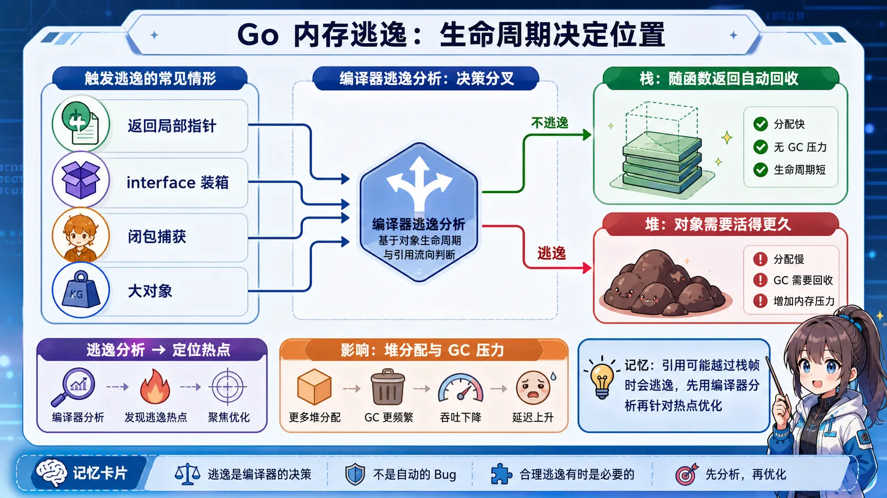
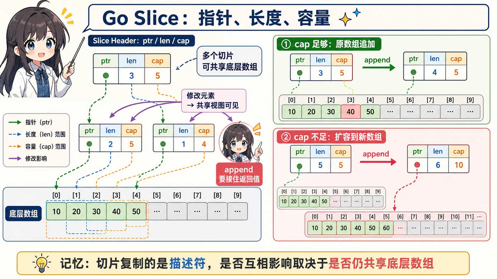
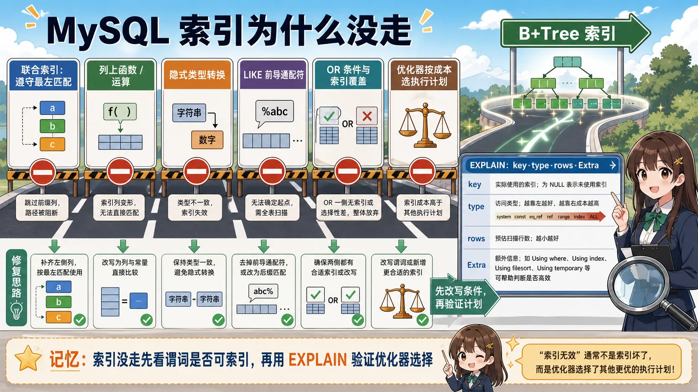

# 张×× - Golang 后端开发工程师

📍 上海 | 📱 134****1193 | 📧 guocong199708@163.com
🔗 GitHub: [xxx-xxx](https://github.com/xxx-xxx) | 🎂 199× 年 × 月 | 🎓 本科

---

## 🎯 求职意向

**目标职位：** Golang 后端开发工程师
**期望城市：** 上海
**经验级别：** 5 年 + | **到岗时间：** 面议

---

## 💡 核心优势

- **5 年 Go 开发经验** - 精通 Gin、Gorm、GoFrame，良好的代码规范和注释习惯
- **高并发架构能力** - 支撑 530w 用户、80w DAU 平台，年营收 1200w+
- **全链路技术栈** - MySQL/Redis 优化、Kafka 消息队列、Canal 数据同步、ES 搜索
- **技术影响力** - "Go 必知必会"社区创始人，公众号 1000+ 粉丝，累计 2000+
- **工程化思维** - 牵头制定《鸿合开发手册 1.0》，代码贡献 2.1w 行，占比 15.2%

---

## 💼 工作经历

### ××互动科技有限公司 | Golang 后端开发工程师
**2023.04 - 2024.09**

**项目：** 短剧平台（530w 用户，80w DAU）

**核心职责：**
- 负责短剧播放、用户充值、订单支付等核心模块开发
- 设计 Redis + MySQL 双层缓存架构，Canal 保证数据一致性
- Kafka 消息队列削峰填谷，保证高并发下数据不丢失且时序性
- 使用 GoFrame 框架满足视频播放、下单、充值等高要求场景

**关键成就：**
- 🏆 爆款短剧单日播放 170w 次，单日充值 350w
- 🏆 2023 年累计充值 230w 次，年营收 1200w
- 🏆 优化核心接口响应时间从 800ms → 120ms（提升 85%）
- 🏆 数据库查询优化，QPS 从 500 → 3000+

**技术栈：** Go、Gin、GoFrame、MySQL、Redis、Kafka、Canal、ElasticSearch、Git

---

### ××教育科技股份有限公司 | Golang 后端开发工程师
**2021.03 - 2023.04**

**项目 1：** 教师培训平台（90w 用户）

**核心职责：**
- 基于 Gin 框架开发，RabbitMQ 解决高并发流量问题
- 负责考试管理、课程管理、角色权限等核心模块
- 服务全国 2.6w 所中小学，平均月活 3w+

**项目 2：** 网络研修平台（微服务架构）

**核心职责：**
- k8s 容器编排，apisix 统一数据源转发
- 组织管理控制台，类似钉钉的组织机构功能
- 整合服务以微服务模式开发部署

**项目 3：** SDP"隐云"软件开发（零信任安全）

**核心职责：**
- 零信任项目落地，替代传统 VPN
- 访问服务器置于公司内网，减少网络接口暴露
- 高危账号阻截，保护公司网络安全

**技术栈：** Go、Gin、MySQL、Redis、RabbitMQ、k8s、APISIX、Docker

---

## 🚀 个人项目

### AI 内容生产工具
**2024.10 - 至今**

- 使用 AI 编程工具（Cursor、Claude Code）独立开发
- 自动化处理电子书：摘要生成 → TTS 配音 → S3 云存储
- Go + Python 混合架构，Asynq 任务队列，支持批量处理 100+ 书籍
- GitHub: https://github.com/xxx-xxx

### 语音转文字小程序
**2024.11 - 至今**

- 微信小程序，语音转文字功能，**注册用户 400+ 人**
- 独立负责后端 API 开发、数据库设计、小程序前端
- 日活 50+，用户留存率 35%

### MCP 协议服务器
**2025.01 - 至今**

- Model Context Protocol (MCP) 服务器，连接 API 文档与 AI 编程工具
- 让 AI 助手可以直接读取接口文档，辅助代码生成

---

## 🏆 荣誉与影响力

### 技术社区
- **技术社区创始人** - 公众号 1000+ 粉丝，累计 2000+
- **技术社区、B 站、博客平台技术分享作者**
- **LeetCode Live 4** - 持续刷题保持算法敏感度

### 公司荣誉
- **年度优秀员工** - 公司年度技术之星
- **《开发规范手册》牵头制定者** - 整理整个研发中心项目实体架构
- **代码规范计划发起人** - 推动团队代码规范化

### 证书
- 大学英语 CET-4
- 计算机科学与技术（统招本科）| ××大学 | 2017-2021

---

## 🛠️ 技术栈

| 类别 | 技术 | 熟练度 |
|------|------|--------|
| **语言** | Golang、C++、C、Java、Python | Go 精通 |
| **框架** | Gin、Gorm、GoFrame、Iris | 精通 |
| **数据库** | MySQL、Redis | 精通 |
| **消息队列** | RabbitMQ、Kafka、Canal | 熟悉 |
| **搜索** | ElasticSearch | 熟悉 |
| **网络** | HTTP/HTTPS、gRPC、TCP/IP | 熟悉 |
| **DevOps** | Git、Docker、k8s、APISIX | 熟悉 |
| **AI 工具** | Cursor、Cloud Code、MCP 协议 | 实践中 |

---

## 🌟 个人特质

- **自学能力强** - 从 Go 后端主动学习 AI 编程，独立完成多个 AI 项目
- **责任心重** - 实习期两个月学习新知识，曾加班到晚上 11 点
- **团队合作** - 善于沟通，牵头多个跨部门项目
- **技术热情** - 持续输出技术内容，社区活跃贡献者

---

*简历最后更新：2026-03-05*

---

## 📝 Go 后端高频面试题（真题补充）

### Q: 什么情况下会发生内存逃逸？

<a href="../../assets/illustrations/16-resume-interview-tips/q15-go-escape-analysis.webp"></a>

> 🧠 **图解记忆：** 当引用可能越过当前栈帧时，编译器可能把对象放到堆上；先用逃逸分析定位热点，再做针对性优化。

<details>
<summary>💡 答案要点</summary>

**内存逃逸：** 本应分配在栈上的变量，被编译器判断为需要分配到堆上的现象。

**四类典型逃逸场景：**

**1. 指针逃逸：函数返回局部变量指针**
```go
func newUser() *User {
    u := User{Name: "张三"}  // u 原本在栈上
    return &u                // 返回指针 → 逃逸到堆！
    // 因为函数返回后栈帧销毁，但调用方还持有指针
}
```

**2. 接口逃逸：赋值给 interface{}**
```go
func printAny(v interface{}) { fmt.Println(v) }

x := 42
printAny(x)  // x 被装箱为 interface{} → 逃逸到堆
```

**3. 大对象逃逸：超过栈大小阈值（一般 32KB）**
```go
func bigArray() {
    arr := [1000000]int{}  // 太大，放不进栈 → 直接分配到堆
    _ = arr
}
```

**4. 闭包捕获逃逸**
```go
func makeCounter() func() int {
    count := 0          // count 被闭包捕获 → 逃逸到堆
    return func() int {
        count++
        return count
    }
}
```

**如何排查逃逸：**
```bash
go build -gcflags="-m" main.go
# 输出: ./main.go:5:6: moved to heap: u  ← 逃逸了
```

**对性能的影响：**
- 堆分配需要 GC 管理，有额外开销
- 栈分配函数返回自动回收，几乎零开销
- 高频路径尽量避免逃逸，可用 `sync.Pool` 复用对象

**面试话术：**
> "内存逃逸是编译器判断变量需要比栈生命周期更长时，将其移到堆上。最常见的是：返回局部变量指针、赋值给 interface{}、闭包捕获变量。排查方法是 `go build -gcflags="-m"`。高并发场景下逃逸过多会增加 GC 压力，可以用对象池（sync.Pool）优化。"

</details>

### Q: Go 切片的底层原理是什么？修改切片元素会修改底层数组吗？

<a href="../../assets/illustrations/16-resume-interview-tips/q16-go-slice-backing-array.webp"></a>

> 🧠 **图解记忆：** 切片复制的是指针、长度和容量描述符；修改是否相互可见，取决于两个切片是否仍共享同一底层数组。

<details>
<summary>💡 答案要点</summary>

**切片底层结构：**
```go
// runtime/slice.go
type slice struct {
    array unsafe.Pointer  // 指向底层数组的指针
    len   int             // 当前长度
    cap   int             // 容量
}
```

**切片是对底层数组的引用（不是值拷贝）：**
```go
arr := [5]int{1, 2, 3, 4, 5}
s1 := arr[1:4]  // s1 = [2, 3, 4]，指向 arr 的同一块内存

s1[0] = 99      // 修改 s1[0]
fmt.Println(arr) // [1, 99, 3, 4, 5]  ← 底层数组也被修改！
```

**append 时的两种情况：**
```go
// 情况1：cap 够用 → 不扩容，共享底层数组
s1 := make([]int, 3, 10)
s2 := append(s1, 100)  // cap 足够，s1 和 s2 共享底层数组
s2[0] = 999
fmt.Println(s1[0])  // 999 ← s1 也被影响！

// 情况2：cap 不够 → 扩容，分配新底层数组，不影响原切片
s3 := []int{1, 2, 3}         // len=3, cap=3
s4 := append(s3, 4)          // 触发扩容，s4 有新底层数组
s4[0] = 999
fmt.Println(s3[0])  // 1 ← s3 不受影响
```

**扩容策略（Go 1.18+ 修改）：**
```
cap < 256:   新cap = 旧cap × 2
cap >= 256:  新cap = 旧cap + (旧cap + 3×256) / 4  (逐渐趋向1.25倍)
```

**常见陷阱（面试考点）：**
```go
// 陷阱：函数内 append 不影响外部（如果触发了扩容）
func addItem(s []int) {
    s = append(s, 100)  // 如果扩容了，s 是新底层数组，不影响外部
}

// 正确做法：传指针或返回新切片
func addItem(s *[]int) {
    *s = append(*s, 100)
}
```

**面试话术：**
> "切片底层是三字段结构：指针+长度+容量。多个切片可以共享同一底层数组，所以修改元素会影响到共享的切片。append 时如果 cap 够用，继续共享底层数组；如果 cap 不够，会分配新数组，原切片不受影响。这个细节很重要，函数内 append 不传指针就可能丢失数据。"

</details>

### Q: MySQL 索引失效的场景有哪些？

<a href="../../assets/illustrations/16-resume-interview-tips/q17-mysql-index-plan.webp"></a>

> 🧠 **图解记忆：** 索引没走先检查联合索引顺序、函数运算、类型转换和通配符，再用 EXPLAIN 验证优化器实际选择。

<details>
<summary>💡 答案要点</summary>

**12 种索引失效场景：**

**1. 最左前缀原则被破坏（联合索引）**
```sql
-- 联合索引 (a, b, c)
SELECT * FROM t WHERE b = 1;          -- ❌ 失效（跳过了 a）
SELECT * FROM t WHERE a = 1 AND c = 1; -- ❌ c 失效（跳过了 b）
SELECT * FROM t WHERE a = 1 AND b = 1; -- ✅ 有效
```

**2. 对索引列做函数操作**
```sql
SELECT * FROM t WHERE YEAR(create_time) = 2024;  -- ❌ 索引失效
SELECT * FROM t WHERE create_time >= '2024-01-01'; -- ✅ 有效
```

**3. 隐式类型转换**
```sql
-- phone 列是 varchar，但传了 int
SELECT * FROM t WHERE phone = 13800138000;  -- ❌ 失效（字符串转数字）
SELECT * FROM t WHERE phone = '13800138000'; -- ✅ 有效
```

**4. 使用 != / <> / NOT IN / NOT EXISTS**
```sql
SELECT * FROM t WHERE status != 1;    -- ❌ 失效（全表扫描更快）
SELECT * FROM t WHERE status IN (1,2); -- ✅ 可能有效
```

**5. LIKE 以通配符开头**
```sql
SELECT * FROM t WHERE name LIKE '%张%'; -- ❌ 失效
SELECT * FROM t WHERE name LIKE '张%';  -- ✅ 有效
```

**6. 索引列参与运算**
```sql
SELECT * FROM t WHERE age + 1 = 18;  -- ❌ 失效
SELECT * FROM t WHERE age = 17;       -- ✅ 有效
```

**7. OR 两边不都是索引列**
```sql
SELECT * FROM t WHERE id = 1 OR name = '张三';  -- ❌ name 无索引则失效
-- 解决：给 name 加索引，或改用 UNION
```

**8. 数据量太少，走全表更快**
```sql
-- 表只有几百行，MySQL 优化器选择全表扫描
-- 强制索引：SELECT * FROM t FORCE INDEX(idx_name) WHERE ...
```

**排查方法：**
```sql
EXPLAIN SELECT * FROM t WHERE ...;
-- key 列为 NULL → 未使用索引
-- type 为 ALL → 全表扫描
-- Extra 为 "Using index" → 覆盖索引（最好）
```

**面试话术：**
> "索引失效最常见的是三类：最左前缀破坏（联合索引跳列）、索引列函数操作或隐式类型转换、LIKE 通配符开头。排查用 EXPLAIN，看 key 是否为空、type 是否为 ALL。日常开发中我养成了写 SQL 前先想索引的习惯，避免踩这些坑。"

</details>

### 手撕代码：二叉树层序遍历（BFS）

<details>
<summary>💡 完整实现</summary>

**题目：** LeetCode 102，返回二叉树的层序遍历结果（每层一个数组）

```go
package main

import "fmt"

type TreeNode struct {
    Val   int
    Left  *TreeNode
    Right *TreeNode
}

// 层序遍历 - BFS，队列实现
func levelOrder(root *TreeNode) [][]int {
    if root == nil {
        return nil
    }

    result := [][]int{}
    queue := []*TreeNode{root}  // 初始化队列

    for len(queue) > 0 {
        levelSize := len(queue)  // 当前层的节点数
        level := []int{}

        // 处理当前层的所有节点
        for i := 0; i < levelSize; i++ {
            node := queue[0]
            queue = queue[1:]  // 出队

            level = append(level, node.Val)

            // 子节点入队（下一层）
            if node.Left != nil {
                queue = append(queue, node.Left)
            }
            if node.Right != nil {
                queue = append(queue, node.Right)
            }
        }

        result = append(result, level)
    }

    return result
}

// 构建测试树:
//       3
//      / \
//     9   20
//        /  \
//       15   7
func main() {
    root := &TreeNode{Val: 3,
        Left: &TreeNode{Val: 9},
        Right: &TreeNode{Val: 20,
            Left:  &TreeNode{Val: 15},
            Right: &TreeNode{Val: 7},
        },
    }

    result := levelOrder(root)
    fmt.Println(result) // [[3] [9 20] [15 7]]
}
```

**核心思路（口述）：**
1. 用队列（slice 模拟）存储每层节点
2. 每次循环开始记录 `levelSize = len(queue)`，只处理当前层节点
3. 处理时将子节点入队，当前层处理完后进入下一层
4. 时间 O(n)，空间 O(n)（最宽层的节点数）

**变体题（追问常见）：**
- 锯齿形遍历（奇数层从左到右，偶数层从右到左）→ 双端队列 / 反转
- 右视图 → 每层只取最后一个节点
- 最大深度 → 层数即为深度

</details>
