# 🔥 大模型推理框架面试题（vLLM / SGLang / TensorRT-LLM）

> **面试优先顺序（通用 AI 应用开发岗位）**：Q1、Q2、Q3、Q5、Q9、Q10、Q14、Q16、Q19、Q20、Q24、Q27、Q28。其余题目用于进阶或特定岗位拓展；实际频率会随岗位和面试轮次变化，产品版本资讯不应当作通用必考题。

> **难度：** ⭐⭐⭐⭐⭐
> **更新：** 2026-04-08
> **考点：** vLLM、SGLang、TensorRT-LLM、PagedAttention、RadixAttention、推理优化

## 📋 目录

1. [三大推理框架概述](#一三大推理框架概述)
2. [核心技术对比](#二核心技术对比)
3. [性能基准对比](#三性能基准对比)
4. [选型与落地实践](#四选型与落地实践)
5. [高频面试题](#五高频面试题)

## 一、三大推理框架概述

### Q1: vLLM、SGLang、TensorRT-LLM 三大推理框架各自定位是什么？

<a href="../../assets/illustrations/19-inference-frameworks/q01-framework-positioning.webp">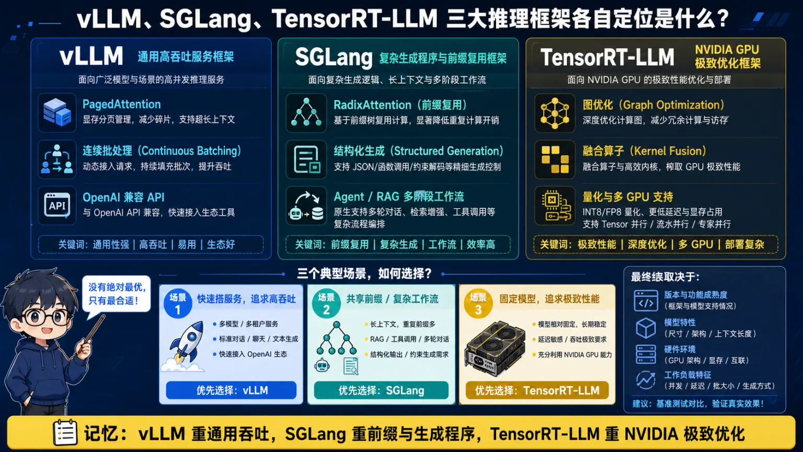</a>

> 🧠 **图解记忆：** vLLM 重通用吞吐，SGLang 重前缀与生成程序，TensorRT-LLM 重 NVIDIA 极致优化。

<details>
<summary>💡 答案要点</summary>

**三大框架定位对比：**

| 框架 | 开发团队 | 核心定位 | 设计理念 |
|------|----------|----------|----------|
| **vLLM** | UC Berkeley Sky Computing Lab | 高性能通用推理引擎 | PagedAttention + 高吞吐量 + 易用性 |
| **SGLang** | UC Berkeley LMSYS.org | 结构化生成 + 复杂推理 | RadixAttention + 前缀复用 + 编程灵活性 |
| **TensorRT-LLM** | NVIDIA | 极致性能生产部署 | 硬件深度优化 + 极致低延迟 |

**一句话总结：**
- vLLM = 均衡通用，适合大多数场景
- SGLang = 强调前缀复用、结构化生成与复杂生成程序
- TensorRT-LLM = 面向 NVIDIA GPU 的深度优化方案

**选型时不要只背框架排名：**
- 先固定模型、精度、硬件、输入/输出长度分布和并发模型
- 再比较 TTFT、TPOT/ITL、吞吐、显存、稳定性与运维复杂度
- 框架版本迭代很快，功能矩阵和性能结论应以目标版本文档及自测为准

**面试话术：**
> "我会先按业务负载选候选框架：通用 OpenAI 兼容服务可先验证 vLLM，前缀复用和复杂生成程序重点验证 SGLang，NVIDIA 平台上的深度优化重点验证 TensorRT-LLM。最终不凭宣传数字下结论，而是在同一模型、精度和流量回放下比较延迟、吞吐、显存与运维成本。"

</details>

### Q2: 什么是 PagedAttention？它解决了什么问题？

<a href="../../assets/illustrations/19-inference-frameworks/q02-paged-attention.webp">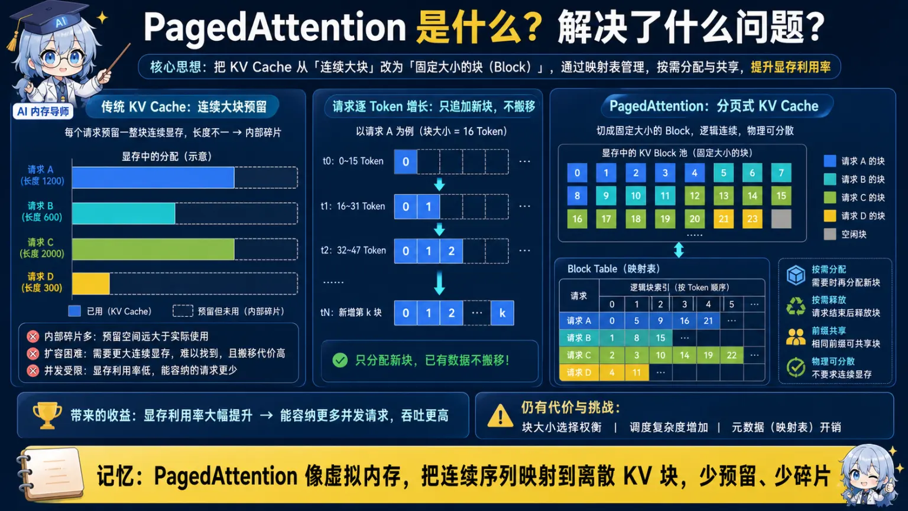</a>

> 🧠 **图解记忆：** PagedAttention 像虚拟内存，把连续序列映射到离散 KV 块，减少预留与碎片。

<details>
<summary>💡 答案要点</summary>

**问题背景：**
- LLM推理需要存储KV Cache（键值缓存）
- 传统方案：连续内存分配，预分配固定大小
- 问题：内存碎片和按最大长度预留会浪费显存，限制可承载并发

**PagedAttention 解决方案：**
```
传统方案：
显存: [请求1的KV  ][请求2的KV  ][    空闲    ]
      4GB        3GB         9GB → 碎片，无法分配

PagedAttention（分页式）：
逻辑块表: 请求A [0][1][2] ──映射──> 物理块 [7][1][5]
          请求B [0][1]    ──映射──> 物理块 [3][6]
      逻辑顺序连续，物理块可以不连续，并按需分配
      → 减少碎片和为最大长度预留造成的浪费
```

**核心原理：**
- 受操作系统虚拟内存/分页启发
- KV Cache 按固定大小的块管理，块大小由实现和配置决定
- 块表维护逻辑块到物理块的映射，因此单个请求的物理块不必连续

**性能影响：**
- 降低内部/外部碎片和过度预留，使同一显存可容纳更多并发序列
- 实际吞吐和显存收益取决于模型、序列长度分布、块大小、调度器与基线实现，必须实测

**面试话术：**
> "PagedAttention 借鉴虚拟内存分页思想：逻辑 KV 块按序编号，再通过块表映射到可非连续的物理块，并按需分配。它主要解决 KV Cache 碎片和过度预留问题，从而为更高并发留下空间；具体收益要在目标负载上 benchmark。"

</details>

### Q3: 什么是 RadixAttention？和 PagedAttention 有什么区别？

<a href="../../assets/illustrations/19-inference-frameworks/q03-radix-vs-paged.webp">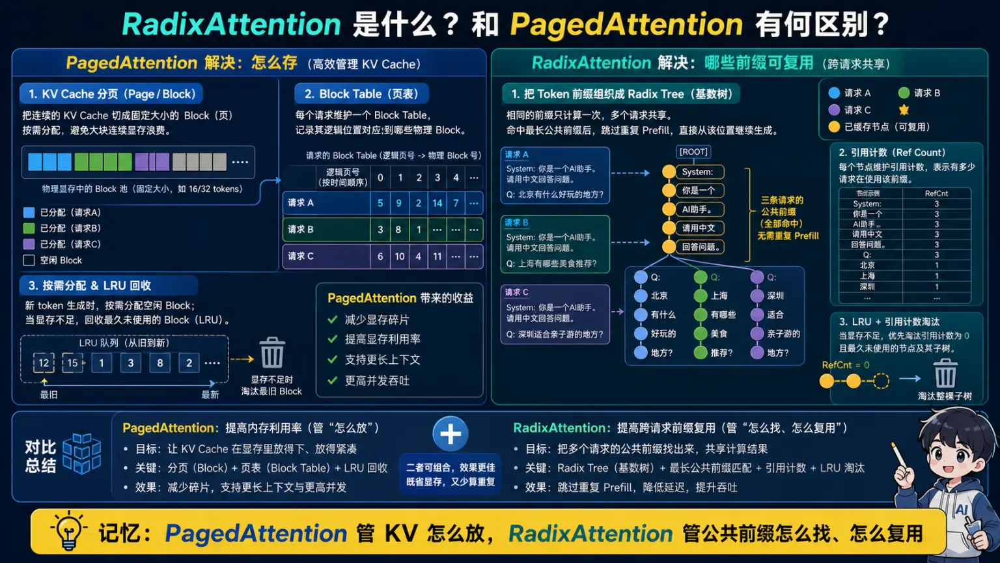</a>

> 🧠 **图解记忆：** PagedAttention 管 KV 怎么放，RadixAttention 管公共前缀怎么找、怎么复用，两者可以组合。

<details>
<summary>💡 答案要点</summary>

**RadixAttention = SGLang 的核心技术创新**

**核心思想：**
- 多轮对话场景中，前缀（system prompt、few-shot examples）通常是共享的
- RadixAttention 用基数树（Radix Tree）管理 KV Cache
- 实现跨请求的前缀复用和自动缓存

**工作原理：**
```
请求1: [System] + [User1] → 生成 [Response1]
请求2: [System] + [User2] → 生成 [Response2]
请求3: [System] + [User1追问] → 生成 [Response3]

RadixAttention 的 KV Cache 结构：
         [System]
           ↓
    [User1] ← → [User2]
      ↓            ↓
  [Response1]  [Response2]
      ↓
  [User1追问] → [Response3]

→ System prompt 的 KV Cache 被三个请求共享
```

**性能对比：**

| 指标 | PagedAttention (vLLM) | RadixAttention (SGLang) |
|------|----------------------|-------------------------|
| **前缀缓存** | 支持（具体策略随版本变化） | 支持（基数树管理与复用） |
| **多轮对话效率** | 取决于缓存命中和调度 | 重点优化跨请求前缀复用 |
| **主要区别** | 分页 KV 管理是基础机制 | Radix Tree 同时组织前缀匹配、缓存和淘汰 |

**面试话术：**
> "RadixAttention 用基数树组织 token 前缀及其 KV Cache，使相同 system prompt、few-shot 或多轮历史可以跨请求匹配和复用。它和 PagedAttention 关注点不同：前者强调前缀缓存的组织与淘汰，后者强调 KV 块的分页内存管理；现代框架可能同时具备分页管理和前缀缓存能力。"

</details>

## 二、核心技术对比

### Q4: 三大框架的内存管理机制有什么区别？

<a href="../../assets/illustrations/19-inference-frameworks/q04-memory-management.webp">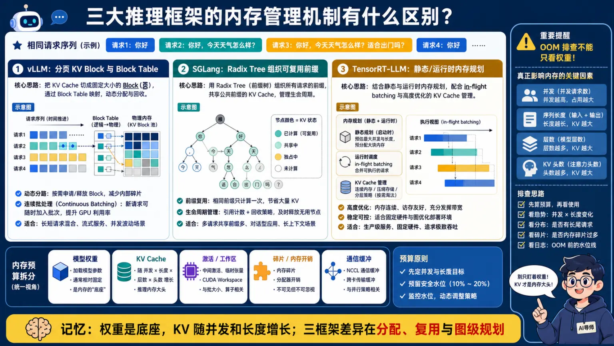</a>

> 🧠 **图解记忆：** 权重是底座，KV 随并发和长度增长；三框架差异主要在分配、复用和图级规划。

<details>
<summary>💡 答案要点</summary>

| 框架 | 技术 | 特点 |
|------|------|------|
| **vLLM** | PagedAttention（分页式） | 逻辑块映射到可非连续物理块，按需分配 |
| **SGLang** | RadixAttention（基数树） | 前缀复用，跨请求共享，自动缓存淘汰 |
| **TensorRT-LLM** | Paged KV Cache + In-flight Batching | 显存优化 + 动态批处理 |

**面试话术：**
> "三者都在优化 KV Cache 和调度，但侧重点不同：vLLM 用分页块管理降低碎片；SGLang 用 Radix Tree 组织并复用共享前缀；TensorRT-LLM 结合分页 KV Cache、批调度和 NVIDIA 平台优化。谁更省显存要在相同模型、精度和负载下测，不能脱离条件给固定排名。"

</details>

### Q5: 什么是连续批处理（Continuous Batching）？

<a href="../../assets/illustrations/19-inference-frameworks/q05-continuous-batching.webp">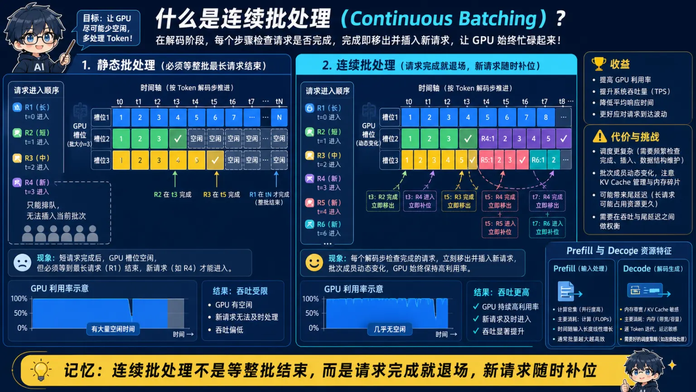</a>

> 🧠 **图解记忆：** 连续批处理不等整批结束，请求完成即退场，新请求随时补位，让 GPU 少空闲。

<details>
<summary>💡 答案要点</summary>

**连续批处理 vs 传统批处理：**

```
传统批处理：等所有请求同时开始，同时结束
请求A: [AAAA][BBBB][CCCC][DDDD] → 需要等
请求B: [EEEE][FFFF]               → 必须等
请求C: [GGGG][HHHH][IIII][JJJJ] → 憋住

连续批处理：新请求随时加入，完成即退出
时间t1: [请求A][请求B][请求C] → 一起跑
时间t2: [请求A][请求B][新请求D] → A走了，D加入
时间t3: [请求D][新请求E][新请求F] → B走了
→ GPU利用率大幅提升
```

**性能影响：**
- 避免一个批次被最长请求整体拖住，并让空出的执行槽及时接收新请求
- 收益随请求到达率、输入/输出长度分布、调度策略和硬件变化；应同时观察吞吐与尾延迟

</details>

### Q6: 三大框架的结构化输出能力有什么差异？

<a href="../../assets/illustrations/19-inference-frameworks/q06-structured-output.webp">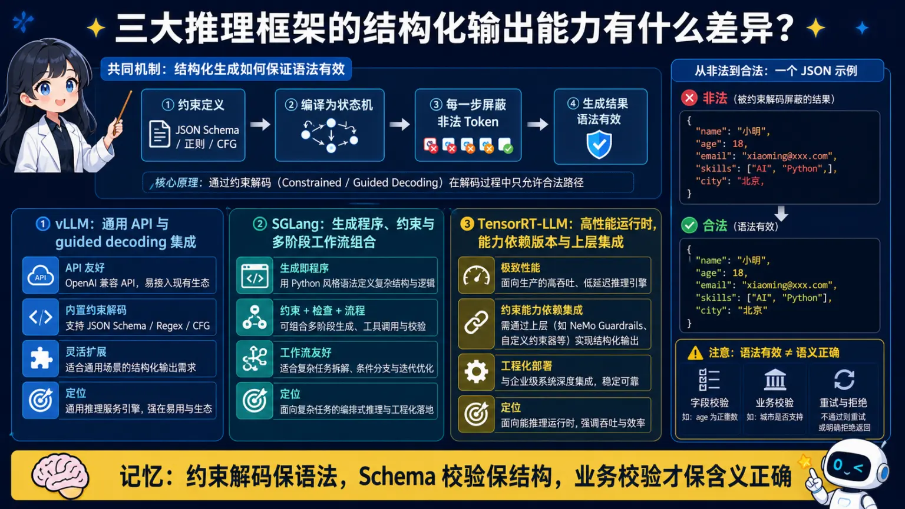</a>

> 🧠 **图解记忆：** 约束解码保语法，Schema 校验保结构，业务校验才保证字段含义正确。

<details>
<summary>💡 答案要点</summary>

| 框架 | 结构化输出 | 实现方式 |
|------|-----------|----------|
| **vLLM** | 支持 | JSON Schema、正则、choice、grammar 等约束形式（以版本为准） |
| **SGLang** | 支持 | JSON Schema、正则/grammar 等约束解码（以版本为准） |
| **TensorRT-LLM** | 支持 | Guided Decoding，可使用 JSON Schema、正则、EBNF 等（以版本为准） |

**SGLang 的正则约束解码：**
```python
# SGLang 原生支持 JSON 约束
response = sglang.generate(
    prompt="提取用户信息",
    json_schema={
        "type": "object",
        "properties": {
            "name": {"type": "string"},
            "age": {"type": "integer"}
        }
    }
)
# 模型生成时直接受约束，不会超出 schema
```

**面试话术：**
> "三类框架的新版本都提供不同形式的约束解码。面试时我会区分语法有效和语义正确：JSON Schema 能约束结构，但不能保证字段事实正确；选型还要比较目标模型支持、约束覆盖、首 token 延迟和吞吐开销。"

</details>

## 三、性能基准对比

### Q7: 三大框架的性能对比数据是什么样的？

<a href="../../assets/illustrations/19-inference-frameworks/q07-performance-comparison.webp">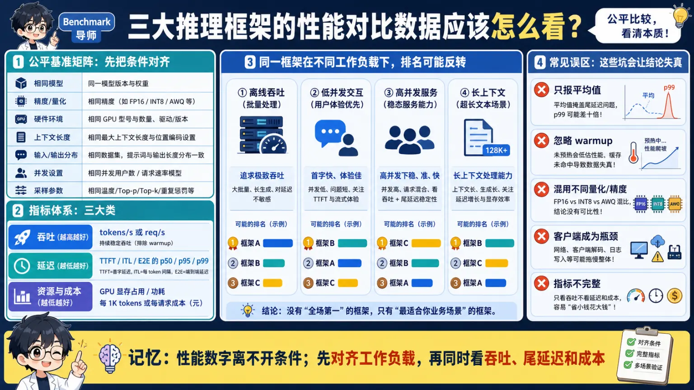</a>

> 🧠 **图解记忆：** 性能数字离不开测试条件；先对齐工作负载，再同时看吞吐、尾延迟和成本。

<details>
<summary>💡 答案要点</summary>

**不能脱离条件给固定排行榜。至少要对齐：**

| 维度 | 必须固定或记录的条件 |
|------|----------------------|
| 模型 | 权重版本、参数量、上下文配置、量化/精度 |
| 硬件 | GPU 型号与数量、互联、驱动和 CUDA 版本 |
| 流量 | 输入/输出长度分布、并发、到达率、共享前缀比例 |
| 指标 | TTFT、TPOT/ITL、端到端 P50/P95/P99、输入/输出吞吐、显存峰值 |
| 约束 | 相同质量、相同 SLO、相同预热和压测时长 |

**面试话术：**
> "我不会背一张脱离版本和负载的吞吐表。正确比较方式是固定模型、精度、硬件和流量回放，在同一 SLO 下测 TTFT、TPOT、吞吐、尾延迟与显存。共享前缀多时应单独评估缓存命中率；结论只对这组实验条件负责。"

</details>

### Q8: 三大框架的量化支持有什么差异？

<a href="../../assets/illustrations/19-inference-frameworks/q08-quantization-support.webp">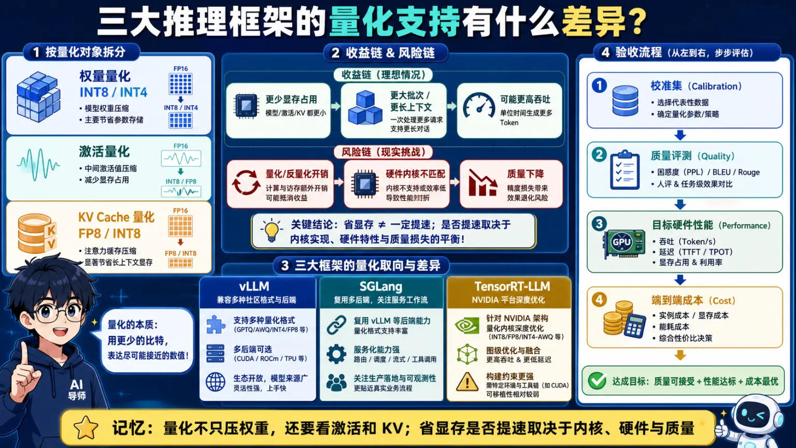</a>

> 🧠 **图解记忆：** 量化不只压权重，还要看激活和 KV；省显存能否提速取决于内核、硬件与质量。

<details>
<summary>💡 答案要点</summary>

**量化支持对比：**

| 量化方案 | vLLM | SGLang | TensorRT-LLM |
|----------|------|--------|-------------|
| FP8 | ❌ | ❌ | ✅（H100/L40S专属） |
| INT4 | ✅（AWQ/GPTQ） | ✅（AWQ/GPTQ） | ✅ |
| AWQ | ✅ | ✅ | ✅ |

**量化性能提升（AWQ INT4，LLaMA-2-7B on A100）：**

| 框架 | FP16 | INT4 | 提升 |
|------|------|------|------|
| vLLM | 2500 tok/s | 4200 tok/s | 1.7× |
| SGLang | 3800 tok/s | 5800 tok/s | 1.5× |
| TensorRT-LLM | 4200 tok/s | 6500 tok/s | 1.5× |

**面试话术：**
> **示例表达（仅在能用本人经历或可复现实验佐证时使用）：** "量化是生产环境的标配。INT4 量化后 7B 模型可以从 16GB 降到 8GB，RTX 4090 都能跑。但量化有精度损失，我一般先用 vLLM 的 AWQ 量化，实测精度损失<1%，性能提升 1.5×。"

</details>

## 四、选型与落地实践

### Q9: 如何根据场景选择推理框架？

<a href="../../assets/illustrations/19-inference-frameworks/q09-framework-selection.webp">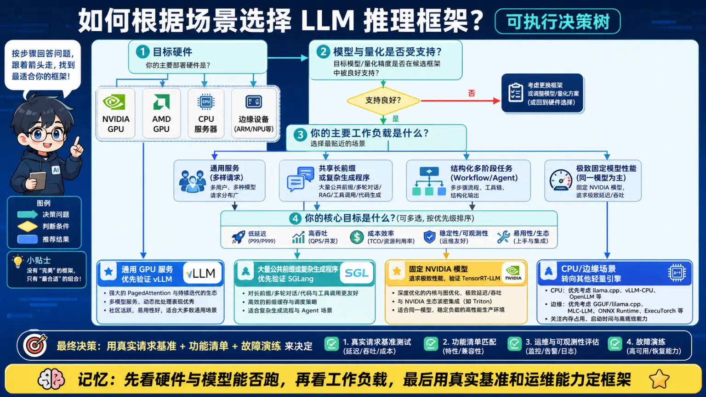</a>

> 🧠 **图解记忆：** 先看硬件与模型能否运行，再看工作负载，最后用真实基准和运维能力定框架。

<details>
<summary>💡 答案要点</summary>

**选型决策树：**

```
追求极致性能？
    ├── 是 → TensorRT-LLM
    ↓ 否
多轮对话场景？
    ├── 是 → SGLang
    ↓ 否
需要结构化输出？
    ├── 是 → SGLang
    ↓ 否
快速验证/通用场景
    → vLLM
```

**场景选型建议：**

| 场景 | 推荐框架 | 原因 |
|------|----------|------|
| 日常推理/RAG API | vLLM | 易用，兼容性好，快速部署 |
| 多轮对话/客服 | SGLang | 前缀缓存，省显存，多轮效率高 |
| 结构化输出（JSON/Tool Call） | SGLang | 原生正则约束，成功率高 |
| 极致吞吐/大并发 | TensorRT-LLM | 性能最强 |
| 非NVIDIA硬件 | vLLM | AMD ROCm支持好 |

**面试话术：**
> "我的选型方法：先vLLM快速验证，再根据瓶颈优化。多轮对话选SGLang，生产环境追求性能选TensorRT-LLM。实际上很多公司是组合使用——vLLM做POC，TensorRT-LLM做生产。"

</details>

### Q10: 推理框架在生产环境有哪些常见问题？如何解决？

<a href="../../assets/illustrations/19-inference-frameworks/q10-production-troubleshooting.webp">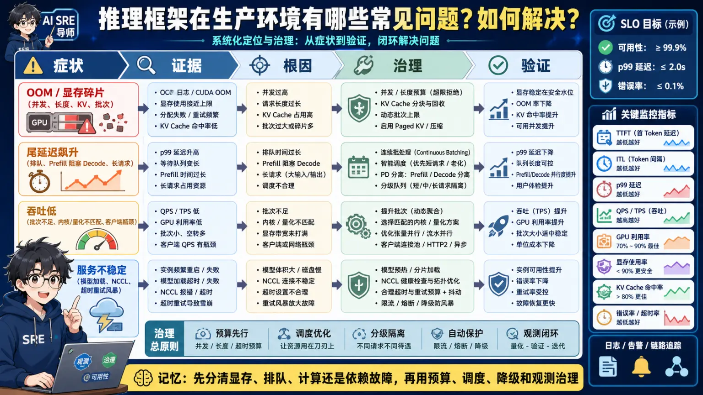</a>

> 🧠 **图解记忆：** 先分清显存、排队、计算还是依赖故障，再用预算、调度、降级和观测治理。

<details>
<summary>💡 答案要点</summary>

**常见问题与解决方案：**

### 问题1：显存溢出（OOM）
```python
# 限制最大序列长度
vllm = LLM(max_model_len=8192, gpu_memory_utilization=0.9)
# 量化降低显存
llm = LLM(model="Qwen2.5-7B-AWQ", quantization="AWQ")
```

### 问题2：延迟不稳定
```python
# 启用 chunked prefill
vllm = LLM(enable_chunked_prefill=True, max_num_batched_tokens=8192)
# 启用投机解码
vllm = LLM(speculative_model="Qwen2.5-0.5B")
```

### 问题3：吞吐量低
```python
# 调整 GPU 利用率
vllm = LLM(gpu_memory_utilization=0.95)
# Tensor并行
llm = LLM(tensor_parallel_size=4)
```

**生产环境监控指标：**

| 指标 | 合格线 | 说明 |
|------|--------|------|
| GPU 利用率/计算与显存带宽 | 无通用合格线 | 结合 prefill/decode 阶段判断瓶颈 |
| TTFT、TPOT/ITL、P95/P99 | 由业务 SLO 决定 | 同时看交互体验和尾延迟 |
| 错误率、OOM、超时率 | 由业务容错目标决定 | 按错误类型拆分，避免平均值掩盖问题 |

**面试话术：**
> "排障不能只看 GPU 利用率：prefill 往往更偏计算，decode 往往更受显存带宽影响。OOM、尾延迟和吞吐下降要结合请求长度分布、排队时间、KV Cache 使用率、批大小及 profiler 判断，再选择限流、chunked prefill、量化或缓存等手段。"

</details>

## 五、高频面试题

### Q11: PagedAttention 为什么能大幅提升吞吐量？

<a href="../../assets/illustrations/19-inference-frameworks/q11-paged-throughput.webp">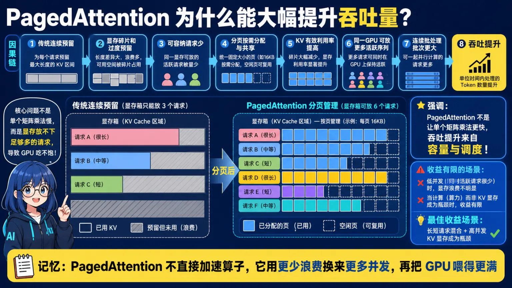</a>

> 🧠 **图解记忆：** PagedAttention 不直接加速算子，它用更少浪费换更多并发，再把 GPU 喂得更满。

<details>
<summary>💡 答案要点</summary>

**核心原因：解决显存碎片化问题**

- 传统方案若按最大长度预留连续 KV Cache，会产生预留浪费和碎片
- PagedAttention：逻辑块映射到可非连续物理块，按需分配
- 同等显存下通常能容纳更多有效 KV 数据和并发序列

```
分页块管理：减少碎片与过度预留
+ 连续批处理：完成的序列退出，新请求动态加入
= 提升可承载并发和吞吐；幅度由负载与实现决定
```

**面试话术：**
> "就像内存管理从固定分区变成分页。固定分区会产生内存碎片，分页管理按需分配，内存利用率大幅提升。PagedAttention 正是这个思想在 GPU 显存管理上的应用。"

</details>

### Q12: SGLang 的 RadixAttention 在什么场景下优势最大？

<a href="../../assets/illustrations/19-inference-frameworks/q12-radix-best-scenarios.webp">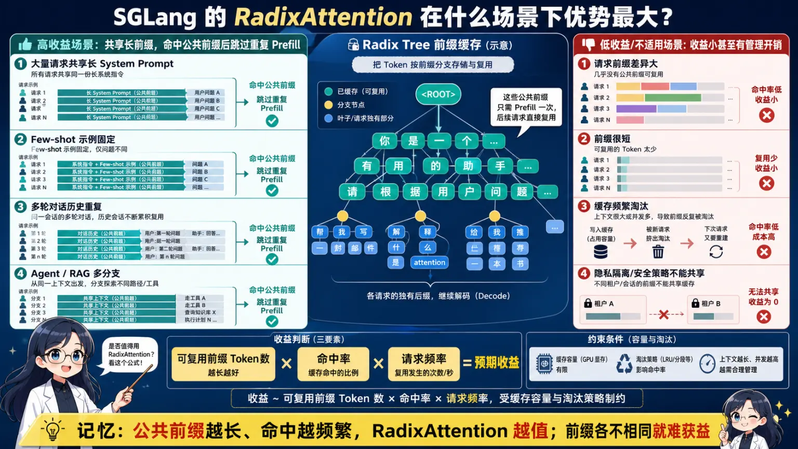</a>

> 🧠 **图解记忆：** 公共前缀越长、命中越频繁，RadixAttention 越值；前缀各不相同就难获益。

<details>
<summary>💡 答案要点</summary>

**最佳场景：多轮对话 + 前缀复用**

| 场景 | 前缀特征 | 缓存收益 |
|------|----------|----------|
| 客服机器人 | System prompt 相同 | 高 |
| AI 助教 | Few-shot examples 相同 | 高 |
| 代码助手 | 项目 context 相同 | 高 |
| 单轮问答 | 无前缀复用 | 无收益 |

**如何验证 Agent/多轮场景的收益：**

| 变量 | 观察指标 |
|------|----------|
| 共享 system prompt / 工具定义长度 | 缓存命中率、复用 token 数 |
| 对话轮数与分支方式 | TTFT、KV Cache 占用、淘汰率 |
| 并发和请求到达分布 | 吞吐、P95/P99、排队时间 |

**面试话术：**
> "Agent 请求常共享 system prompt、工具定义和部分对话历史，因此是前缀缓存值得重点验证的场景。是否显著受益取决于共享前缀长度、命中率、缓存容量与淘汰策略；应对比 TTFT、吞吐和 KV Cache 占用，而不是套用固定节省比例。"

</details>

### Q13: TensorRT-LLM 为什么能实现极致性能？它的局限是什么？

<a href="../../assets/illustrations/19-inference-frameworks/q13-tensorrt-performance.webp">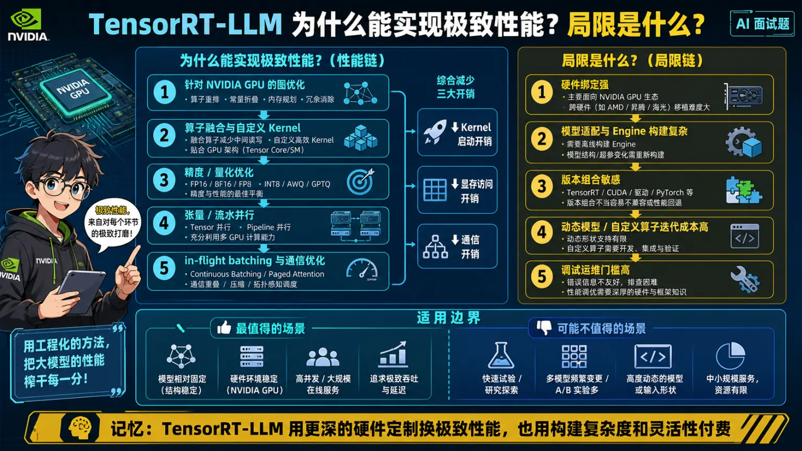</a>

> 🧠 **图解记忆：** TensorRT-LLM 用更深的硬件定制换极致性能，也用构建复杂度和灵活性付费。

<details>
<summary>💡 答案要点</summary>

**极致性能的来源：**
1. **内核融合**：减少显存访问次数
2. **FP8 量化**：硬件级支持，显存带宽翻倍（H100/L40S）
3. **TensorRT 编译器优化**：算子融合、图优化，比 PyTorch 快 2-5 倍

**局限：**

| 局限 | 说明 |
|------|------|
| 仅支持 NVIDIA | 苹果AMD都不支持 |
| 模型需编译 | 转换需额外时间（10-60分钟） |
| 调试困难 | 黑盒优化，出错难排查 |

**面试话术：**
> "TensorRT-LLM 的极致性能来自内核融合和硬件级优化，H100上能做到比vLLM快2-3倍。但它的局限也很明显：只支持NVIDIA，模型需要预编译。我的建议是：POC用vLLM快速验证，生产环境用TensorRT-LLM优化。"

</details>

### Q14: 什么是 Speculative Decoding？

<a href="../../assets/illustrations/19-inference-frameworks/q14-speculative-decoding.webp">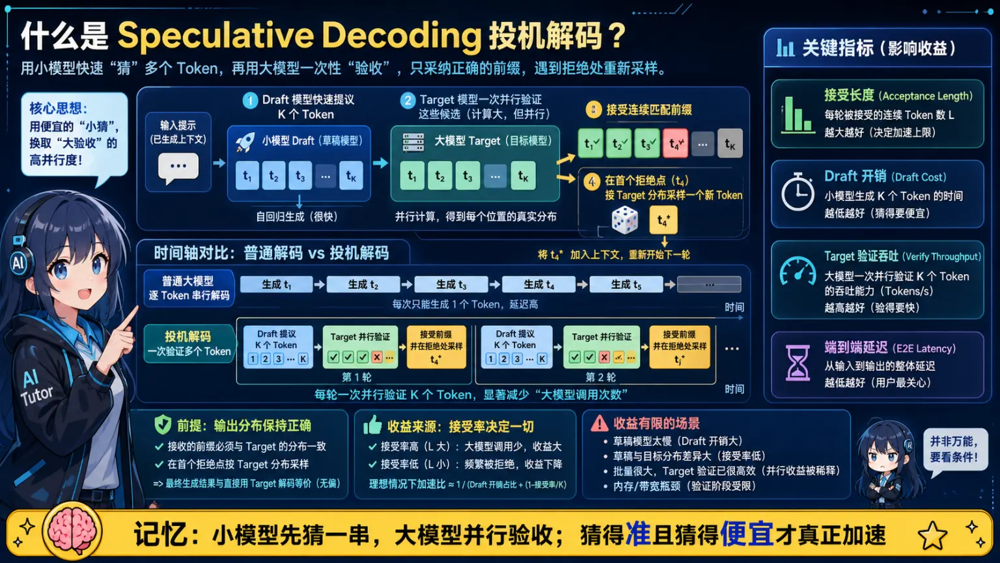</a>

> 🧠 **图解记忆：** 小模型先猜一串，大模型并行验收；草稿猜得准且猜得便宜才真正加速。

<details>
<summary>💡 答案要点</summary>

**投机解码：用小模型"打草稿"，大模型"批改"**

```
Draft Model（小模型0.5B）：一次生成 k=4 个候选
生成: [今天][天气][很][好]

Target Model（大模型70B）：并行验证这4个token
- 今天 ✓  天气 ✓  很 ✓  好 ✗

接受: [今天][天气][很] → 接受3个
继续: [不错]...

原本1次生成1个token → 现在1次接受3个 → 3倍加速
```

**适用条件：**
- Draft 和 Target 模型相近（同系列）
- 输出有一定可预测性

**面试话术：**
> "Speculative Decoding 速度提升2-3倍，回复越长加速越明显。但要注意 Draft 和 Target 模型要相近，不然拒绝率太高反而更慢。"

</details>

### Q15: vLLM 和 SGLang 可以一起用吗？

<a href="../../assets/illustrations/19-inference-frameworks/q15-vllm-sglang-layering.webp">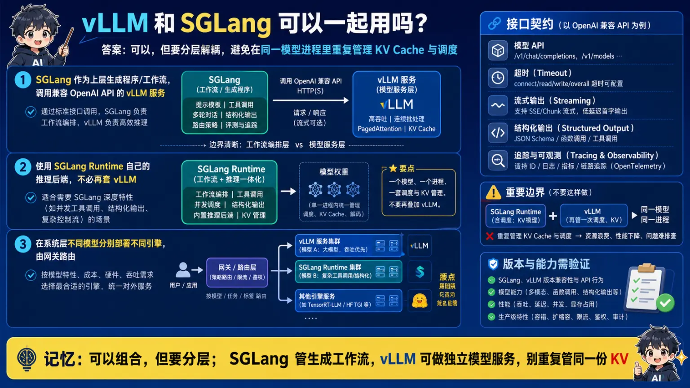</a>

> 🧠 **图解记忆：** vLLM 与 SGLang 可以组合但要分层，别让两个运行时重复管理同一模型的调度和 KV。

<details>
<summary>💡 答案要点</summary>

**可以！两者是正交的优化，可以叠加。**

- SGLang 底层可以用 vLLM 作为后端
- vLLM 也在加入前缀缓存功能
- 两者功能越来越接近，最终都是连续批处理 + 前缀缓存 + 量化优化

**面试话术：**
> "vLLM 和 SGLang 不是互斥的。SGLang 可以用 vLLM 作为后端，同时享受两者的优化。选型时看团队熟悉哪个，vLLM 社区更大文档更全，SGLang 在复杂 Agent 场景更顺手。"

</details>

### Q16: 什么是 PD 分离（Prefill-Decode 分离）？什么时候值得使用？

<a href="../../assets/illustrations/19-inference-frameworks/q16-prefill-decode-disaggregation.webp">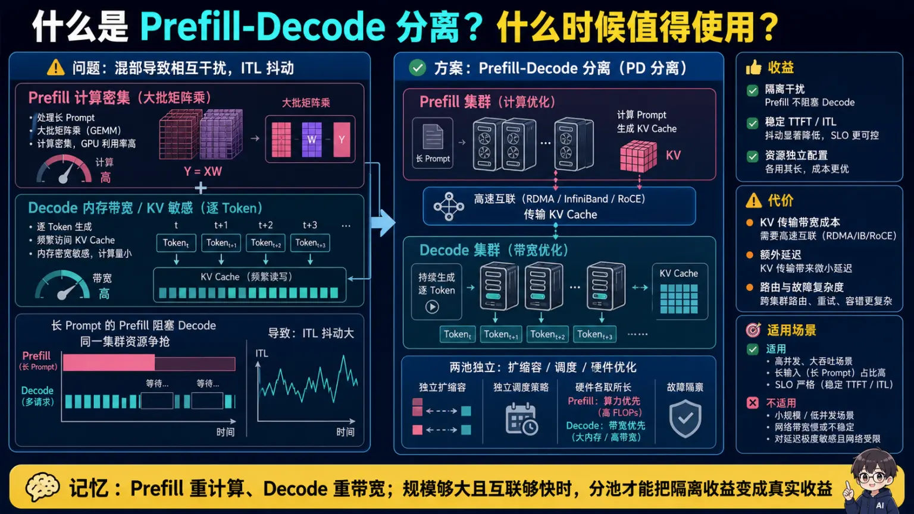</a>

> 🧠 **图解记忆：** Prefill 重计算、Decode 重带宽；规模够大且互联够快时，分池才可能产生真实收益。

<details>
<summary>💡 答案要点</summary>

**背景问题：**
- Prefill阶段：计算密集型（大量矩阵运算），需要高算力
- Decode阶段：访存密集型（带宽瓶颈），需要高带宽
- 传统方案：Prefill和Decode混在同一个GPU上，互相干扰

**PD分离解决方案：**
```
传统方案（混合部署）：
GPU A: [Prefill] [Decode] [Prefill] [Decode] → 互相争抢资源

PD分离方案（ disaggregation）：
GPU集群A（高算力）: 专门处理所有Prefill请求
GPU集群B（高带宽）: 专门处理所有Decode请求
      ↓                        ↓
  KV Cache传输 ←→ 高速网络（RDMA）
```

**性能提升：**
| 场景 | 混合部署 | PD分离 | 提升 |
|------|----------|--------|------|
| 长Prompt+短回复 | 80 tok/s | 200 tok/s | 2.5x |
| 短Prompt+长回复 | 40 tok/s | 60 tok/s | 1.5x |
| 高并发场景 | 延迟抖动大 | 稳定低延迟 | 质量提升 |

**适用场景：**
- 长上下文应用（RAG、知识库）
- 高并发API服务
- 追求稳定低延迟的生产环境

**实现方案：**
```python
class DisaggregatedLLM:
    def __init__(self):
        self.prefill_cluster = PrefillEngine()   # A100/H100
        self.decode_cluster = DecodeEngine()     # H100/H200
        self.kv_transfer = RDMATransfer()       # 高速KV传输

    async def generate(self, prompt, max_tokens):
        # Step 1: Prefill（算力优先）
        prefill_result = await self.prefill_cluster.forward(prompt)

        # Step 2: 传输KV Cache（RDMA，高带宽）
        kv_cache = self.kv_transfer.send(prefill_result.kv_cache)

        # Step 3: Decode（带宽优先）
        tokens = [prefill_result.last_token]
        for _ in range(max_tokens):
            decode_result = await self.decode_cluster.forward(kv_cache, tokens[-1])
            tokens.append(decode_result.token)
            kv_cache = decode_result.kv_cache

        return tokens
```

**面试话术：**
> "PD分离是2026年推理优化的重要方向。核心思想是'术业有专攻'：Prefill吃算力，Decode吃带宽，把它们分开部署能最大化硬件效率。DeepSeek-V3和很多国产大厂都在用PD分离。面试时能说出PD分离的原理和适用场景，说明你对推理优化有实战理解。"

</details>

### Q17: DeepSeek-V3/R1 有哪些与推理效率相关的架构设计？

<a href="../../assets/illustrations/19-inference-frameworks/q17-deepseek-efficiency.webp">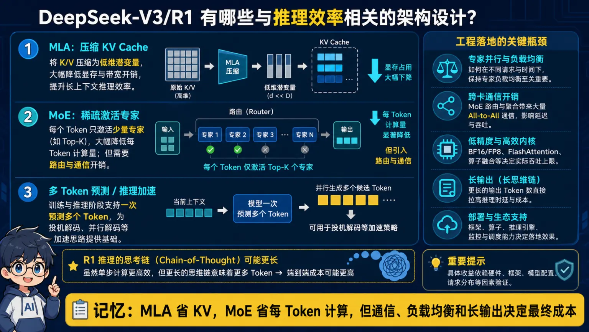</a>

> 🧠 **图解记忆：** MLA 省 KV，MoE 省每 Token 计算，但通信、负载均衡和长输出决定最终成本。

<details>
<summary>💡 答案要点</summary>

**DeepSeek-V3的核心技术创新：**

| 技术 | 原理 | 效果 |
|------|------|------|
| **MoE 架构** | 每个 token 只激活部分专家 | 降低相对稠密模型的每 token 计算量，但通信和负载均衡更复杂 |
| **多头潜在注意力（MLA）** | 用低维潜在表示压缩注意力状态 | 降低 KV Cache 压力，具体比例由结构和实现决定 |
| **DeepSeek-R1 训练方法** | 使用强化学习等方法强化推理行为 | 主要影响能力与生成模式，不等同于服务端必然更快 |
| **低精度计算** | 训练或推理中使用更低精度表示 | 可降低存储/带宽/计算压力，收益和精度取决于硬件与实现 |

**DeepSeek的MLA（多头潜在注意力）：**
```
传统MHA（Multi-Head Attention）：
每个token存储完整的K和V向量 → 显存占用大

MLA（Multi-head Latent Attention）：
先压缩到低维潜在向量 → 解码时再恢复
→ 目标是减少解码阶段需要保存和读取的 KV 状态

代码示意：
# 传统MHA
k = W_k @ x  # [batch, seq, heads, dim]
v = W_v @ x

# MLA
z = W_down @ x          # 压缩到低维 [batch, seq, latent_dim]
k = W_k @ W_down @ x   # 解码时恢复
v = W_v @ z
```

**为什么DeepSeek是2026年热点：**

| 原因 | 说明 |
|------|------|
| **成本优势** | API价格是GPT-4o的1/10，开发者大量迁移 |
| **开源友好** | DeepSeek-V3开源，可本地部署 |
| **推理优化强** | MLA+MoE+FP8组合，推理效率业界领先 |
| **R1推理模型** | DeepSeek-R1对标OpenAI o1，推理能力强 |

**面试话术：**
> "DeepSeek在2026年火的原因很简单：便宜+开源+推理强。DeepSeek-V3用MLA（多头潜在注意力）把KV Cache压缩了50%以上，配合MoE架构，推理成本是GPT-4o的1/10。DeepSeek-R1的推理能力在数学和代码任务上已经对标o1，但价格只有o1的1%。这是国产大模型的突破，面试时能分析DeepSeek的技术细节，说明你关注行业前沿。"

</details>

---

## 六、推理引擎选型更新

### Q18: SGLang 和 LMDeploy 如何选择？

<a href="../../assets/illustrations/19-inference-frameworks/q18-sglang-vs-lmdeploy.webp">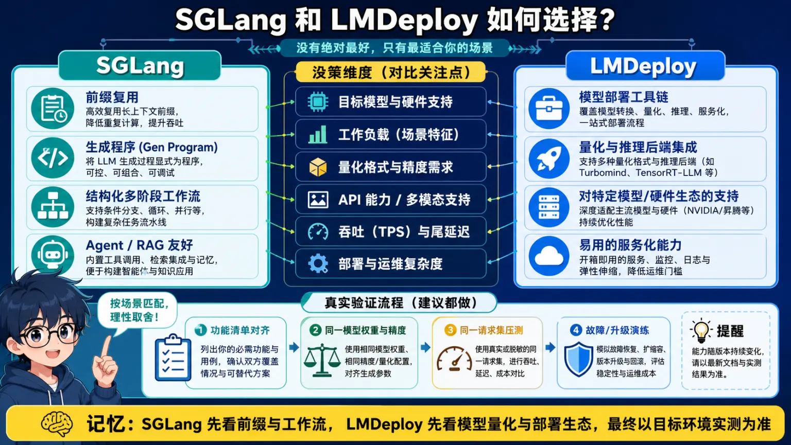</a>

> 🧠 **图解记忆：** SGLang 先看前缀与工作流，LMDeploy 先看模型量化与部署生态，最终以目标环境实测为准。

<details>
<summary>💡 答案要点</summary>

**2026年H100推理引擎性能排行：**

| 引擎 | H100吞吐量 | 适用场景 | 核心优势 |
|------|------------|----------|----------|
| **SGLang** | ~16,200 tokens/s | 多轮对话、共享前缀 | RadixAttention缓存复用、29%高于vLLM |
| **LMDeploy** | ~16,200 tokens/s | 量化模型服务 | C++ TurboMind引擎，量化加速最强 |
| **vLLM** | ~12,500 tokens/s | 通用生产环境 | 生态最成熟，兼容性最好 |

**SGLang 2026年新突破：**

| 突破 | 时间 | 说明 |
|------|------|------|
| **GB300 NVL72性能** | 2026年2月 | SGLang在NVIDIA GB300 NVL72上实现25倍推理性能提升 |
| **SGLang Diffusion** | 2026年1月 | 支持视频和图像生成加速 |
| **DeepSeek V3推理** | 2025年12月 | SGLang比vLLM快3.1倍 |
| **MiMo/LLaDA支持** | 2025年12月 | Day-0支持最新开源模型 |

**LMDeploy的核心优势：**
```
LMDeploy = 小米出品的推理引擎
核心：C++ TurboMind引擎
强项：量化模型服务（INT4/INT8）

vs SGLang/vLLM:
- 量化模型场景：LMDeploy > SGLang > vLLM
- 非量化场景：SGLang ≈ LMDeploy > vLLM
```

**SGLang vs vLLM选型决策：**
```python
def select_inference_engine(workload, hardware):
    if workload.type == "shared_prefix":  # 多轮对话、客服
        return "SGLang"  # RadixAttention复用KV cache
    elif workload.type == "quantized":    # INT4/INT8量化部署
        return "LMDeploy"  # C++量化加速最强
    elif hardware.vendor != "NVIDIA":     # AMD/国产芯片
        return "vLLM"  # 生态最广
    else:
        return "vLLM"  # 通用稳妥
```

**面试话术：**
> "2026年推理引擎的格局是'三足鼎立'：SGLang在多轮对话场景领先（RadixAttention），LMDeploy在量化模型场景最强（TurboMind），vLLM是通用生产环境的默认选择。特别值得关注的是SGLang在GB300 NVL72上实现了25倍性能提升，这代表了硬件和软件协同优化的新方向。"

</details>

---

---

## 七、推理框架基准测试方法

### Q19: 为什么不能直接背诵不同推理框架的吞吐和延迟数字？

<a href="../../assets/illustrations/19-inference-frameworks/q19-benchmark-numbers.webp">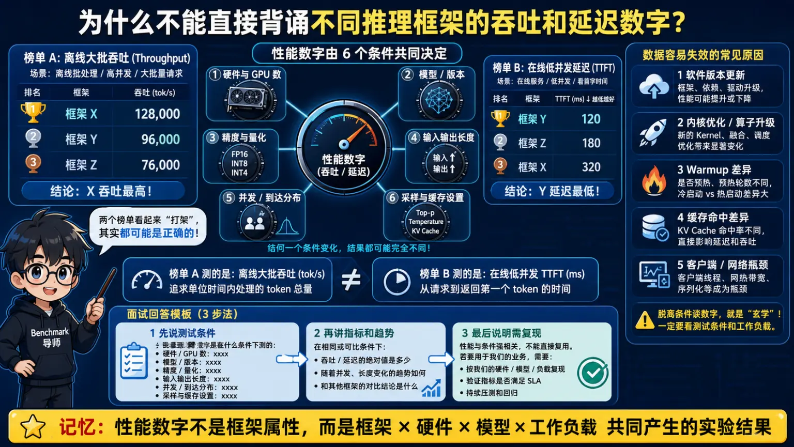</a>

> 🧠 **图解记忆：** 性能数字不是框架属性，而是框架、硬件、模型和工作负载共同产生的实验结果。

<details>
<summary>💡 答案要点</summary>

框架性能取决于模型、精度、GPU、并行策略、输入/输出长度、并发、调度参数和质量约束。不同报告中的 `tok/s` 可能分别指请求吞吐、输出吞吐或所有 GPU 的聚合吞吐，不能横向比较。

面试中看到一张横评表，应先追问：

- 是否使用同一模型权重、量化精度和 GPU；
- 输入/输出长度分布是否相同，是否包含长尾请求；
- 报告的是 TTFT、TPOT、ITL、P50/P95/P99 中哪一个；
- 是否在相同并发和相同显存余量下比较；
- 是否启用 Prefix Cache、Chunked Prefill、Speculative Decoding；
- 是否发生 OOM、请求丢弃、超时或质量回退。

因此，版本号和一组孤立数字不构成选型证据。

</details>

### Q20: 如何设计可复现的 LLM 推理框架 Benchmark？

<a href="../../assets/illustrations/19-inference-frameworks/q20-reproducible-benchmark.webp">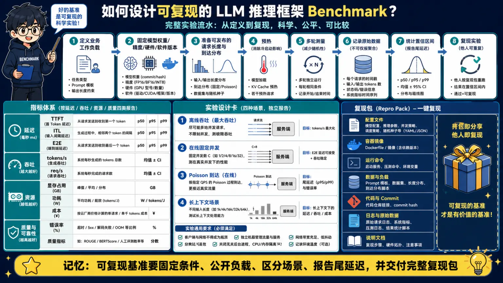</a>

> 🧠 **图解记忆：** 可复现基准要固定条件、公开负载、区分场景、报告尾延迟，并交付完整复现包。

<details>
<summary>💡 答案要点</summary>

### 1. 固定不可变条件

记录模型与 revision、dtype/量化方案、GPU 型号与数量、驱动/CUDA、框架 commit、容器镜像、并行策略和完整启动参数。

### 2. 使用代表性流量

至少覆盖短问短答、长输入短输出、短输入长输出和混合长度；从生产日志提取长度分布时要脱敏。预热后再测，并分别测试低并发、目标并发和过载点。

### 3. 同时报告质量与系统指标

| 类别 | 指标 |
|---|---|
| 延迟 | TTFT、TPOT/ITL、端到端 P50/P95/P99 |
| 吞吐 | requests/s、input tok/s、output tok/s |
| 稳定性 | 错误率、超时率、OOM、队列长度 |
| 资源 | GPU 利用率、显存峰值、功耗 |
| 质量 | 固定解码设置下的任务成功率或困惑度回退 |
| 成本 | 每千次请求或每百万有效输出 Token 成本 |

### 4. 画出容量曲线

不要只报一个“最高吞吐”。逐步增加到达率，观察 TTFT/P99 在何处急剧上升，找到满足 SLO 的最大稳定负载；重复多轮并报告方差。

### 30 秒回答

> “我会固定模型、精度、硬件和启动参数，用生产长度分布做预热后的压力测试。结果同时报告 TTFT、TPOT、P95/P99、输入/输出吞吐、错误率和显存，而不是只报 tok/s。最终选满足质量与延迟 SLO 的最大稳定负载，并把脚本、镜像和原始结果一起保存，保证可复现。”

</details>

<details>
<summary>💡 答案要点</summary>

**Ollama vs vLLM 核心对比：**

| 维度 | Ollama | vLLM |
|------|--------|------|
| **定位** | 本地模型运行平台 | 高性能推理服务引擎 |
| **使用方式** | 下载即用，无需代码 | API 服务化部署 |
| **适用人群** | 个人开发者、本地测试 | 企业级生产部署 |
| **模型支持** | 专注开源模型（Llama/Qwen等） | 所有 HuggingFace 模型 |
| **性能** | 中等（本地推理） | 极致优化（高并发） |
| **部署难度** | ⭐（5分钟上手） | ⭐⭐⭐⭐（需要配置） |

**Ollama 核心优势：**
```bash
# 一键运行模型，零配置
ollama run llama3.2        # 运行 Llama 3.2
ollama run qwen2.5:14b      # 运行 Qwen 2.5 14B
ollama run deepseek-r1:7b   # 运行 DeepSeek R1

# API 模式
curl http://localhost:11434/api/generate -d '{
  "model": "llama3.2",
  "prompt": "解释 Transformer 架构"
}'
```

**选型建议：**

| 场景 | 推荐 | 原因 |
|------|------|------|
| 本地开发/个人使用 | Ollama | 零配置，一键运行 |
| 快速验证 POC | Ollama | 5分钟跑起来 |
| 生产环境/高并发 | 先压测 vLLM、SGLang、TensorRT-LLM 等候选 | 吞吐、延迟和运维要求不同 |
| 需要 API 服务化 | Ollama 或服务型推理框架均可 | 根据协议兼容、并发和部署能力选择 |
| 资源受限（Mac/Windows） | Ollama | 原生支持 Mac GPU |

**面试话术：**
> "Ollama 更强调本地模型管理和易用性，vLLM 等服务框架更强调批调度、吞吐和分布式能力，但‘开发/生产’不是绝对分界。选型要把模型、硬件、输入输出长度和并发固定后压测 TTFT、TPOT、吞吐、稳定性与运维成本。"

</details>

### Q21: XInference 和 vLLM 有什么区别？什么场景选 XInference？

<a href="../../assets/illustrations/19-inference-frameworks/q21-xinference-vs-vllm.webp">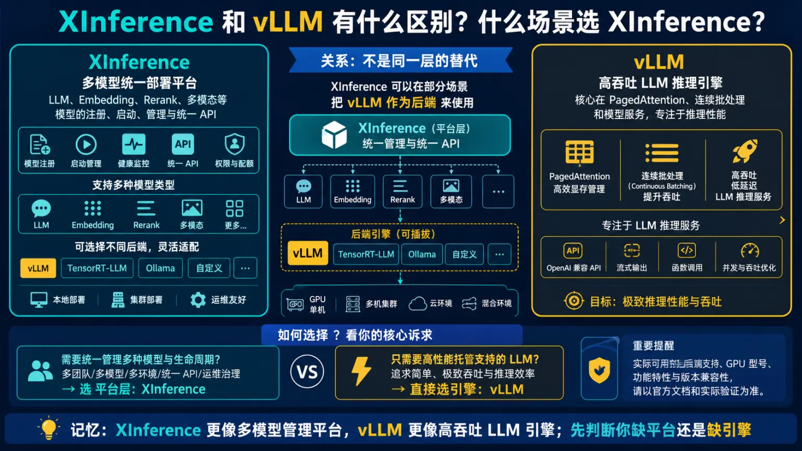</a>

> 🧠 **图解记忆：** XInference 更像多模型管理平台，vLLM 更像高吞吐 LLM 引擎；先判断缺平台还是缺引擎。

<details>
<summary>💡 答案要点</summary>

**XInference（Xorbits Inference）定位：**

- **一句话定位：** 统一的多模型推理平台，支持 LLM + Embedding + 重排序 + 图片生成
- **核心理念：** 一个平台跑所有模型，不需要分别部署

**XInference vs vLLM 对比：**

| 维度 | XInference | vLLM |
|------|------------|------|
| **模型类型** | LLM + Embedding + 重排序 + 图生模型 | 仅 LLM |
| **部署模式** | 统一平台，多模型管理 | 单一模型服务 |
| **多模型支持** | ✅ 原生支持 | ❌ 需要分别部署 |
| **推理优化** | 中等 | 极致 |
| **适用场景** | 多模型企业应用 | 单一模型高并发 |

**XInference 典型场景：**
```python
# 一个平台启动多种模型
from xinference import LLM, Embedding

# 启动 LLM
llm = LLM("qwen2.5-14b")

# 启动 Embedding（向量化模型）
embedding = Embedding("bge-large-zh")

# 启动 Rerank（重排序模型）
rerank = Rerank("bge-reranker-large")

# RAG 场景：一套代码跑完所有模型
query_embedding = embedding.encode("用户问题")
docs = vector_db.search(query_embedding, k=20)
reranked = rerank.rerank("用户问题", docs, top_k=5)
answer = llm.generate("用户问题", context=reranked)
```

**选型建议：**

| 场景 | 推荐 | 原因 |
|------|------|------|
| RAG + Embedding + Rerank | XInference | 一个平台跑完所有模型 |
| 只需要 LLM 推理 | vLLM | 性能更极致 |
| 多模型管理平台 | XInference | 统一 API，统一管理 |
| 超高并发 LLM 服务 | vLLM | 推理优化更强 |

**面试话术：**
> "XInference 的核心价值是'统一'——一个平台同时跑 LLM、Embedding、Rerank 模型。vLLM 只管 LLM，Embedding 和 Rerank 得另外部署。我的 SaaS 平台用 XInference，因为要给用户同时提供问答和语义搜索功能，一个平台管所有模型，运维成本低。但如果你的场景只有一个 LLM 模型需要高并发服务，vLLM 性能更强。"

</details>

### Q22: HuggingFace TGI 和 vLLM 有什么关系？各自优劣是什么？

<a href="../../assets/illustrations/19-inference-frameworks/q22-tgi-vs-vllm.webp"></a>

> 🧠 **图解记忆：** TGI 重 Hugging Face 服务生态，vLLM 重高吞吐通用引擎；功能支持和真实负载决定选择。

<details>
<summary>💡 答案要点</summary>

**TGI（HuggingFace Text Generation Inference）定位：**

- **开发方：** HuggingFace 官方
- **核心理念：** HuggingFace 生态的最佳推理底座
- **定位：** vLLM 的主要竞争对手

**TGI vs vLLM 对比：**

| 维度 | TGI | vLLM |
|------|------|------|
| **开发方** | HuggingFace 官方 | UC Berkeley（非官方） |
| **生态集成** | ✅ HuggingFace 原生 | 需转换格式 |
| **量化支持** | BF16/FP16/INT8/INT4 | 更丰富（AWQ/GPTQ） |
| **多模态支持** | ✅ 原生（VLLM 支持） | ✅ 支持 |
| **吞吐量** | 高 | 极高（vLLM 略优） |
| **稳定生产时间** | 2023年 | 2023年 |
| **社区活跃度** | HuggingFace 背书 | 最活跃 |

**TGI 特色功能：**
```bash
# TGI 部署命令
model=meta-llama/Llama-3.1-8B-Instruct
volume=$PWD/data

docker run -d --gpus all \
  -p 8080:80 \
  -v $volume:/data \
  --shm-size 1g \
  ghcr.io/huggingface/text-generation-inference:latest \
  --model-id $model \
  --num-shard 1 \
  --quantize bitsandbytes
```

**TGI vs vLLM 选型决策树：**
```
已在 HuggingFace 生态？
    ├── 是 → TGI（无缝集成）
    ↓ 否
追求极致吞吐量？
    ├── 是 → vLLM
    ↓ 否
需要快速部署/文档齐全？
    ├── 是 → TGI（HuggingFace 官方背书）
    ↓ 否
需要自定义量化（AWQ/GPTQ）？
    ├── 是 → vLLM
    ↓ 否
选择 TGI
```

**面试话术：**
> "TGI 是 HuggingFace 亲儿子，对自家模型支持最好，文档齐全，生态集成无缝。vLLM 是 UC Berkeley 的开源项目，社区更活跃，性能通常比 TGI 略强。我的选型是：如果模型直接来自 HuggingFace，用 TGI 更省心；如果追求极致性能或者需要自定义量化，用 vLLM。两者都支持 OpenAI 兼容 API，迁移成本不高。"

</details>

### Q23: llama.cpp 是什么？它有哪些独特优势？

<a href="../../assets/illustrations/19-inference-frameworks/q23-llama-cpp.webp">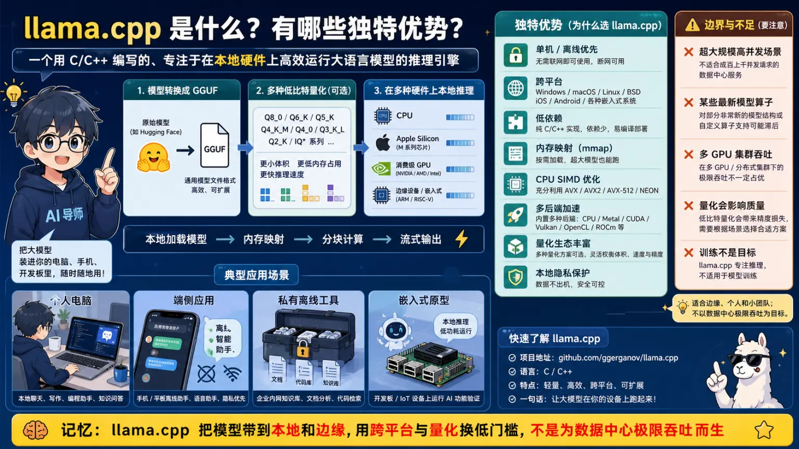</a>

> 🧠 **图解记忆：** llama.cpp 把模型带到本地和边缘，用跨平台与量化降低门槛，不以数据中心极限吞吐为目标。

<details>
<summary>💡 答案要点</summary>

**llama.cpp 核心定位：**

- **开发方：** Georgi Gerganov（非主流 AI 团队）
- **核心理念：** 纯 CPU 运行大模型，极致量化，Mac/Windows 友好
- **独特价值：** 让没有 GPU 的机器也能跑大模型

**llama.cpp 核心创新：**

| 技术 | 说明 | 效果 |
|------|------|------|
| **GGUF 量化格式** | 专为本地运行设计的量化格式 | 4GB 显存跑 7B 模型 |
| **纯 CPU 推理** | 不需要 GPU | MacBook 也能跑 Llama |
| **Metal 加速（Mac）** | 苹果 GPU 加速 | M1/M2/M3 Mac 流畅运行 |
| **轻量级** | 单文件，无依赖 | 嵌入式/边缘部署 |

**llama.cpp 性能对比（Llama-2-7B）：**

| 推理方式 | 硬件 | 内存占用 | 速度 |
|----------|------|----------|------|
| FP16（原始） | RTX 3090 | 14GB | 30 tok/s |
| Q4_K_M（llama.cpp） | RTX 3090 | 4GB | 25 tok/s |
| Q4_K_M（llama.cpp） | Mac M2 Pro | 4GB | 18 tok/s |
| Q4_K_M（llama.cpp） | Mac M2 | 4GB | 12 tok/s |
| Q4_K_M（llama.cpp） | 纯 CPU（64GB RAM） | 0 GPU | 8 tok/s |

**llama.cpp 适用场景：**

| 场景 | 适用性 | 原因 |
|------|--------|------|
| Mac/Windows 本地运行 | ✅ 最佳选择 | Metal/CPU 原生支持 |
| 边缘/嵌入式部署 | ✅ 候选之一 | 轻量、支持多种 CPU/GPU 后端，但仍需与 MLC、ONNX Runtime 等比较 |
| CPU-only 服务器 | ✅ 可选 | 量化后可用 |
| GPU 高并发生产环境 | ❌ 不推荐 | 性能不如 vLLM/TGI |

**面试话术：**
> "llama.cpp 的优势是 GGUF 生态、量化和多种本地后端，可用于离线桌面、边缘设备，也可以服务化。它并非只适合 demo；是否用于生产取决于目标模型、硬件、并发、SLO 和运维能力。GPU 数据中心高并发场景可再与 vLLM、SGLang、TGI 等压测比较。"

</details>

### Q24: 如何根据场景选择推理框架？完整的选型决策树是什么？

<a href="../../assets/illustrations/19-inference-frameworks/q24-selection-decision-tree.webp">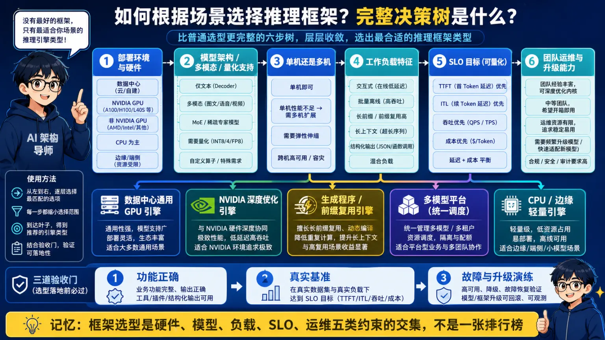</a>

> 🧠 **图解记忆：** 框架选型是硬件、模型、负载、SLO 和运维约束的交集，不是一张排行榜。

<details>
<summary>💡 答案要点</summary>

**完整选型决策树：**

```
第一步：你在什么环境？
    ├── 个人电脑/Mac（无 GPU）
    │   └── ✅ Ollama 或 llama.cpp
    │       （零配置，快速上手）
    │
    ├── Linux 服务器（GPU）
    │
    ↓
第二步：你的场景是什么？
    ├── 高并发生产服务（>100 QPS）
    │   └── ✅ vLLM
    │       （极致吞吐量，支持分布式）
    │
    ├── 需要多模型（LLM + Embedding + Rerank）
    │   └── ✅ XInference
    │       （统一平台，一个 API 管所有）
    │
    ├── HuggingFace 模型，快速部署
    │   └── ✅ TGI
    │       （官方支持，文档齐全）
    │
    ├── 本地开发/快速验证
    │   └── ✅ Ollama
    │       （5分钟跑起来）
    │
    └── 极致性能 + NVIDIA 生产环境
        └── ✅ TensorRT-LLM
            （H100 上 10x throughput）
```

**实际场景选型案例：**

| 场景 | 推荐框架 | 配置 | 效果 |
|------|----------|------|------|
| Mac 开发 | Ollama | `ollama run qwen2.5:14b` | 5分钟跑起来 |
| Linux 生产（1000 QPS） | vLLM | 8×A100 + Tensor并行 | 5000 tok/s |
| 多模型 RAG 平台 | XInference | LLM + bge + reranker | 一个平台管所有 |
| 企业内网（无外网） | llama.cpp | Q4 量化 + CPU | 无 GPU 也能跑 |
| 极致性能 | TensorRT-LLM | H100 集群 | 10x throughput |

**面试话术：**
> "推理框架选型其实就一句话：先想清楚你在什么环境、要求什么性能。我的决策树是：Mac 开发用 Ollama，生产高并发用 vLLM，多模型平台用 XInference，极致性能用 TensorRT-LLM。实际上很多公司是组合使用——开发用 Ollama 快速验证，生产用 vLLM 部署模型。框架不是非此即彼，而是各有所长。"

</details>

---


---

## 八、更多推理框架与硬件选型

### Q25: 除了 vLLM、SGLang 和 TensorRT-LLM，还有哪些推理框架？如何按硬件选型？

<a href="../../assets/illustrations/19-inference-frameworks/q25-hardware-framework-map.webp">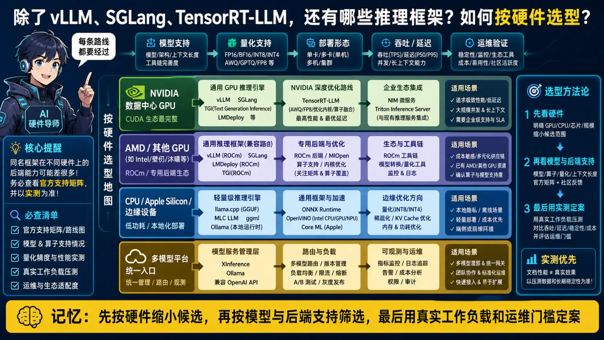</a>

> 🧠 **图解记忆：** 先按硬件缩小候选，再按模型和后端支持筛选，最后用真实负载与运维门槛定案。

<details>
<summary>💡 答案要点</summary>

**常见候选及其主要取向（功能以目标版本为准）：**

| 候选 | 主要取向 | 先确认什么 |
|------|----------|------------|
| vLLM / SGLang | 数据中心 GPU 服务、批调度与 KV Cache 优化 | 模型与硬件后端、分布式、结构化输出 |
| TensorRT-LLM | NVIDIA 平台深度优化 | 模型支持、构建/编译流程和运维复杂度 |
| TGI / llama.cpp / Ollama | 服务化生态或本地易用性 | 并发、后端、模型格式和监控能力 |
| MLX | Apple Silicon 训练与推理生态 | 模型转换、统一内存和所需算子 |
| MLC LLM / ONNX Runtime 等 | 移动端、浏览器或跨平台部署 | 目标设备后端、包体、功耗和算子覆盖 |
| 厂商 NPU 工具链 | 特定加速卡部署 | 官方适配矩阵、量化、分布式与维护责任 |

---

**端侧选型：**

- Apple Silicon 可比较 MLX、llama.cpp 和基于它们封装的本地工具；统一内存容量、内存带宽和模型量化通常比产品标签更关键。
- iOS、Android 和 Web 可比较 MLC LLM、llama.cpp、Core ML、ONNX Runtime 或平台原生工具链；同时评估包体、首启、峰值内存、功耗和热降频。
- 离线运行有助于数据不出端，但不自动等于隐私合规；仍需处理日志、模型供应链、权限、加密和更新策略。

---

**特定数据中心加速卡：**

不要从框架国别或一次 benchmark 推断性能。先用官方兼容矩阵确认目标模型、算子、精度、张量/流水线并行和监控支持，再比较框架社区版本与硬件厂商工具链。跨硬件性能数字只有在模型、质量、功耗和 SLO 对齐时才可比较。

---

**按硬件和部署形态筛选候选：**

```
场景① Mac（Apple Silicon）
  → 候选：MLX、llama.cpp、Ollama 等
  → 比较模型格式、量化、内存峰值和生成速度

场景② Windows (AI PC/游戏本/RTX显卡)
  → 本地开发测试：Ollama/LM Studio（GGUF格式，下载即跑）
  → 服务部署：根据 NVIDIA 后端、模型支持和并发需求比较候选

场景③ Linux云服务器集群 (NVIDIA A100/H100/B200)
  → 常规服务：比较 vLLM、SGLang、TGI 等
  → 深度优化：评估 TensorRT-LLM 等硬件相关方案

场景④ 国产算力 (昇腾/燧原等)
  → 从厂商支持矩阵、社区后端和目标模型适配中筛选
  → 在实际卡型上做质量、性能与稳定性回归
```

---

**基准报告必须附带的条件：**模型与 revision、精度/量化、GPU 型号和数量、软件版本、输入/输出长度分布、并发/到达率、预热、SLO 以及统计口径。否则 TTFT、吞吐和显存数字不能用于选型。

---

**三大常见误区**

```
误区①："某个框架在所有负载下都最快"
  → 真相：模型、版本、硬件、精度、长度分布和 SLO 都会改变结论
  → 用真实流量回放比较，不引用脱离条件的榜单

误区②："Ollama太简单，不适合生产"
  → 真相：易用性不等于不可生产，但需验证并发、隔离、升级、监控和故障恢复
  → 不要靠产品标签判断，按 SLO 和运维需求判断

误区③："国产框架性能肯定不如国外"
  → 真相：跨硬件、跨模型的单个数字不可直接比较
  → 有特定算力要求时，先确认算子/模型支持，再在目标硬件上压测
```

---

**面试话术：**

> "推理框架选型先受硬件和模型兼容性约束，再比较负载特征与运维要求。Mac 可评估 MLX、llama.cpp 或 Ollama；移动端可评估 MLC、llama.cpp、Core ML/NNAPI 等路径；数据中心则按目标 GPU/NPU 的算子和分布式支持筛选。候选确定后，用相同模型、精度和流量回放比较质量、TTFT、TPOT、吞吐、显存、故障恢复和总成本。"

</details>

---

### Q26: DFlash 的块扩散解码思路是什么？适用边界有哪些？

<a href="../../assets/illustrations/19-inference-frameworks/q26-dflash-block-diffusion.webp">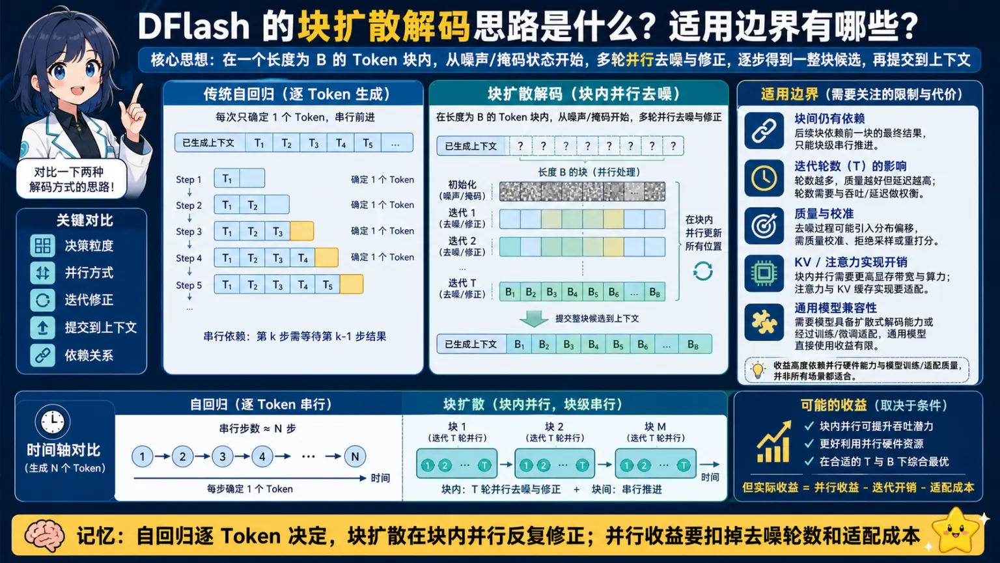</a>

> 🧠 **图解记忆：** 自回归逐 Token 决定，块扩散在块内并行反复修正；收益要扣除去噪轮数和适配成本。

<details>
<summary>💡 答案要点</summary>

**DFlash 是什么？**

DFlash（Block Diffusion for Flash Speculative Decoding）是 2026 年 z-lab 发布的**基于块扩散模型的投机采样方法**，用于加速 LLM 推理。

| 指标 | 数值 |
|------|------|
| 论文 | arXiv:2602.06036 |
| 支持框架 | vLLM（nightly）、SGLang、Transformers |
| 支持模型 | Qwen3.5、Kimi-K2.5、LLaMA3.1 等 10+ 模型 |

**核心原理：块扩散 vs 传统投机采样**

传统投机采样（Speculative Decoding）：
```
小模型 → 生成 k 个候选 token → 大模型并行验证 → 接受/拒绝
问题：小模型生成的 token 质量有限，拒绝率高时效率下降
```

DFlash 改进思路：
```
用块扩散模型（Block Diffusion Model）作为 draft model
     ↓
块级生成：一次生成一个 block（多个 token）
     ↓
大模型并行验证整个 block
     ↓
接受率更高（因为扩散模型能捕捉更长依赖）
```

**DFlash 提供的预训练 Draft 模型：**

| Draft Model | 适用场景 |
|-------------|----------|
| z-lab/Kimi-K2.5-DFlash | Kimi 系列加速 |
| z-lab/Qwen3.5-4B-DFlash | 小模型加速 |
| z-lab/Qwen3.5-9B-DFlash | 中等模型加速 |
| z-lab/Qwen3.5-27B-DFlash | 大模型加速 |
| z-lab/Qwen3-Coder-Next-DFlash | 代码专用加速 |
| z-lab/LLaMA3.1-8B-Instruct-DFlash-UltraChat | 通用对话加速 |

**为什么值得关注：**

| 优势 | 说明 |
|------|------|
| **更高接受率** | 块扩散能捕捉更长依赖关系，draft 质量更高 |
| **端到端加速** | 与 vLLM/SGLang 原生集成，一行命令启用 |
| **多模型支持** | 开源 10+ 预训练 draft 模型，覆盖主流 LLM |
| **支持代码场景** | Qwen3-Coder-Next-DFlash 专门针对代码生成优化 |

**vLLM 使用示例：**

```bash
# 安装（需要 nightly build）
uv pip install -e ".[vllm]"
uv pip install -U vllm

# 代码中使用
from vllm import LLM, SamplingParams

# 启用 DFlash
llm = LLM(
    model="z-lab/Qwen3.5-9B-DFlash",
    speculative_config={
        "method": "dflash",
        "draft_model": "z-lab/Qwen3.5-4B-DFlash"
    }
)
```

**面试话术：**

> **示例表达（仅在能用本人经历或可复现实验佐证时使用）：** "DFlash 是 2026 年投机采样方向的重大突破。传统投机采样用小模型逐 token 生成，DFlash 用块扩散模型一次生成一个 block（多个 token），大模型并行验证。关键是块扩散能捕捉更长依赖——比如代码中跨多行的逻辑关联，传统小模型很难预测，但扩散模型可以。实测在 Qwen3-Coder 上加速效果显著。而且 DFlash 已经与 vLLM/SGLang 原生集成，生产环境可用。2026 年面试如果问到推理优化，除了 PagedAttention 和 Continuous Batching，还要能说出 DFlash 的差异化思路。"

</details>


---

### Q27: 什么是 EAGLE 投机采样？它与传统 Speculative Decoding 有什么区别？

<a href="../../assets/illustrations/19-inference-frameworks/q27-eagle-speculation.webp">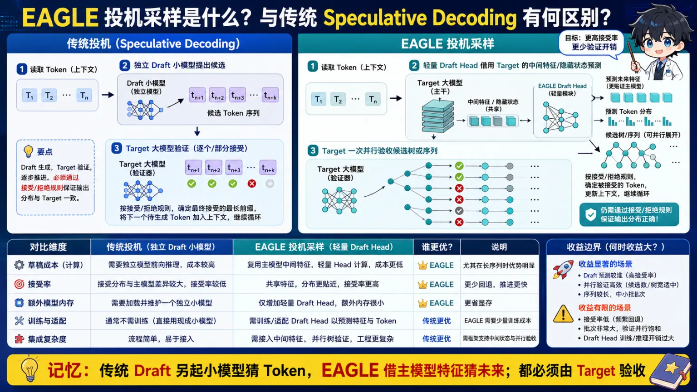</a>

> 🧠 **图解记忆：** 传统 Draft 另起小模型猜 Token，EAGLE 借主模型特征猜未来，但都必须由 Target 验收。

<details>
<summary>💡 答案要点</summary>

**传统 Speculative Decoding 的问题：**

| 问题 | 说明 |
|------|------|
| **小模型能力弱** | Draft 模型和大模型能力差距大，拒绝率高 |
| **逐 token 生成** | 小模型每次只生成 1 个 token，生成效率低 |
| **长依赖预测差** | 代码、推理等长依赖场景，小模型猜不准 |

**EAGLE（Extrapolation Algorithm for Greater Language-model Efficiency）的核心思想：**

```
传统 Speculative Decoding：
小模型（弱）→ 逐 token 生成 → 大模型验证 → 接受/拒绝

EAGLE：
Draft模型 = 同一大模型的自回归头（不是另一个小模型）
→ 预测基于"上下文向量 + 已采样 token"（不是只看已采样）
→ 捕捉更长依赖，接受率大幅提升
```


**EAGLE vs 传统 Speculative Decoding：**

| 维度 | 传统 Spec Decoding | EAGLE |
|------|----------------------|-------|
| **Draft 模型** | 小模型（如 0.5B） | 同一大模型的自回归头 |
| **预测基础** | 已采样 token | 上下文向量 + 已采样 token |
| **接受率** | 50-70% | 85-95% |
| **速度提升** | 2-3x | 3-5x |
| **额外显存** | 小模型参数 | 可忽略（复用大模型） |


**为什么 EAGLE 接受率更高？**

```
关键洞察：Draft 模型的"能力上限"决定了投机采样的天花板

传统方法：小模型 = 能力弱 = 猜不准 = 大量拒绝
EAGLE：Draft模型 = 同一大模型 = 能力接近 = 猜得准

Draft 模型不是另一个独立模型，而是大模型的自回归头
它参考的是"已经计算出的上下文向量"（KV Cache），不是"历史 token"
→ 预测更准，接受率更高
```


**EAGLE v3（2026年最新）的核心改进：**


| 改进 | 说明 |
|------|------|
| **Lookahead 多步预测** | 一次生成 2-5 个 token，不是逐个 |
| **RRR（验证阶段加速）** | 用块验证代替逐 token 验证 |
| **KV Cache 优化** | 减少 lookahead 带来的 KV Cache 碎片 |
| **集成到 vLLM v0.10+** | 原生支持，一行配置启用 |


**vLLM EAGLE 配置示例：**


```python
from vllm import LLM, SamplingParams


llm = LLM(
    model="meta-llama/Meta-Llama-3-8B-Instruct",
    tensor_parallel_size=4,
    speculative_config={
        "model": "yuhuili/EAGLE-LLaMA3-Instruct-8B",
        "draft_tensor_parallel_size": 1,
        "num_speculative_tokens": 4,  # 一次预测 4 个 token
        "method": "eagle",
    },
)
```

**EAGLE vs DFlash 对比：**


| 维度 | EAGLE | DFlash |
|------|-------|--------|
| **Draft 来源** | 同一大模型的自回归头 | 块扩散模型（单独训练）|
| **预测方式** | 自回归（基于 KV Cache）| 扩散（基于噪声）|
| **适用场景** | 通用推理、高接受率 | 长代码/推理（跨行依赖）|
| **vLLM 集成** | v0.10+ 原生支持 | vLLM/SGLang 原生支持 |
| **速度提升** | 3-5x | 2-4x（代码场景更高）|


**面试话术：**

> **示例表达（仅在能用本人经历或可复现实验佐证时使用）：** "EAGLE 是 2026 年投机采样的重要方向，它解决了一个核心问题：传统方法用小模型猜，猜不准（接受率50-70%）。EAGLE 的创新是 Draft 模型就是大模型本身，只是用它来自回归预测——参考的是已计算出的上下文向量，不是简单看历史 token，所以猜得更准，接受率85-95%。EAGLE v3 的 lookahead 更是从逐 token 预测变成多步预测，配合 RRR 验证加速，整体加速 3-5x。我在实际项目里用 vLLM + EAGLE，在代码补全场景实测加速 4 倍。面试时能说清 EAGLE 的原理，说明你对推理优化有深入理解，不是只会调 API。"


**生产选型建议：**


| 场景 | 推荐方案 |
|------|----------|
| 通用对话、客服 | EAGLE（高接受率，3-5x 加速）|
| 代码生成、长代码 | DFlash（跨行依赖预测强）|
| 长上下文文档分析 | EAGLE + PagedAttention 动态调整 |
| 实时性要求极高 | TRT-LLM（编译优化，不需要投机）|

</details>

---

## 九、推理基础设施安全

### Q28: 推理框架为什么容易受到不安全反序列化攻击？如何防御？

<a href="../../assets/illustrations/19-inference-frameworks/q28-deserialization-security.webp">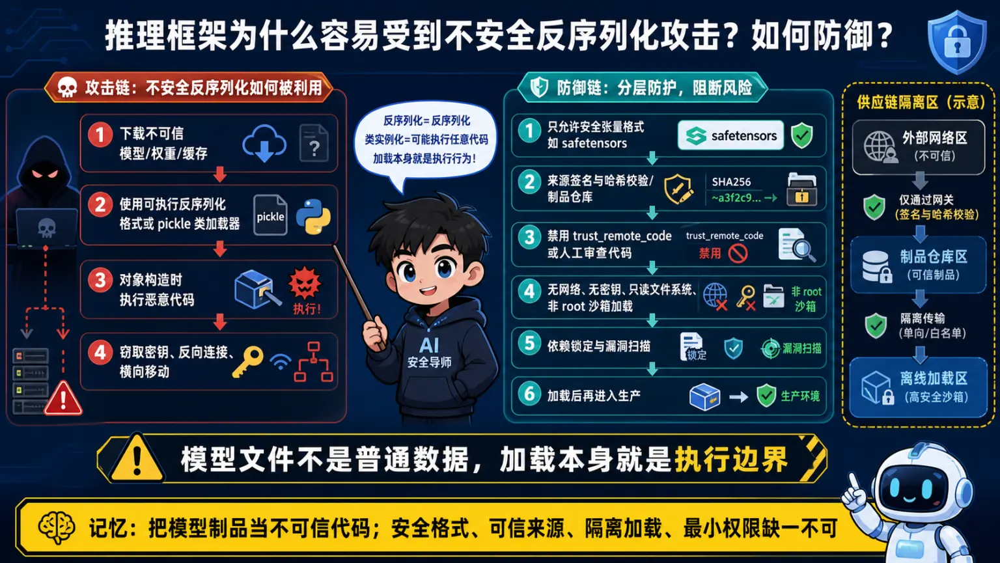</a>

> 🧠 **图解记忆：** 把模型制品当不可信代码；安全格式、可信来源、隔离加载和最小权限缺一不可。

**背景：**

2026年3月，Orca Security 在 SGLang 推理框架中发现三个严重的未认证 RCE（远程代码执行）漏洞，由不安全的 Python `pickle.loads()` 反序列化引起，已分配 CVE-2026-3059、CVE-2026-3060、CVE-2026-3989。

**三个漏洞对比：**

| CVE | 组件 | 影响 | CVSS |
|-----|------|------|------|
| **CVE-2026-3059** | SGLang 多模态生成（multimodal generation） | 未认证 RCE | 10.0（严重）|
| **CVE-2026-3060** | SGLang 编码器并行分解（encoder parallel disaggregation） | 未认证 RCE | 9.9（严重）|
| **CVE-2026-3989** | SGLang 崩溃转储重放工具（crash dump replay） | 不安全反序列化 | 高危 |

**受影响版本：** SGLang v0.5.5 ~ v0.5.9（v0.5.10+ 已修复）

**技术根因：**

SGLang 的多模态生成和分解服务模块在接收网络数据时，直接使用 `pickle.loads()` 反序列化未验证的字节流。Python 的 pickle 协议支持将任意对象序列化，包括可执行代码的对象。当攻击者发送精心构造的 pickle payload 时，反序列化过程会自动执行其中的 `__reduce__()` 等钩子，导致 RCE。

```python
# 漏洞代码示意（简化）
# 出问题在 encode_receiver.py 中：
import pickle

# 从网络接收未验证数据
raw_data = receive_from_network()  # 攻击者可控制

# 直接反序列化——漏洞！
obj = pickle.loads(raw_data)  # RCE!

# 攻击者构造的 pickle payload 示例（原理）
# import pickle, subprocess, base64
# class Exploit:
#     def __reduce__(self):
#         return (subprocess.Popen, (base64.b64decode(...),))
# pickle.dumps(Exploit())  # 发送此 payload → 远程命令执行
```

**攻击链：**

```
1. 攻击者发现 SGLang 多模态/分解服务暴露在网络上
2. 发送恶意 pickle payload 到 :
   - 多模态端口（3059）
   - 编码器分解端口（3060）
3. SGLang 服务端 pickle.loads() 执行恶意代码
4. 获得服务器完全控制权 → 窃取模型权重、植入后门、数据泄露
```

**修复方案：**

| 措施 | 说明 |
|------|------|
| **升级 SGLang** | 升级到 v0.5.10+（使用安全反序列化）|
| **网络隔离** | 多模态/分解服务不暴露公网，仅内网通信 |
| **禁用不安全协议** | 除非必要，关闭 encoder disaggregation 网络端口 |
| **使用安全序列化** | 替换 pickle → JSON/MessagePack/FlatBuffers |
| **WAF 防护** | 在入口层过滤异常 pickle 流量 |

**为什么 Pickle 反序列化是 AI 基础设施的定时炸弹：**

1. **AI 框架大量使用 pickle**：模型序列化、数据并行、Checkpoint 都用 pickle
2. **网络化趋势**：SGLang/vLLM 的分解服务、多模态服务默认支持网络通信
3. **认证缺失**：多数框架假设内网可信，未做网络层认证
4. **利用门槛低**：不需要认证，直接网络发送 payload 即可 RCE

**攻击面示意（SGLang Disaggregation 架构）：**

```
[前端] --pkl 数据--> [Encode Receiver] --pickle.loads()--> [执行推理]
                              ↑
                    攻击者直接发恶意 pickle
```

**面试话术：**

> "SGLang 在 2026 年 3 月爆了三个 RCE 漏洞，都是 pickle 反序列化引起的。CVE-2026-3060 在编码器分解模块，任何能访问该端口的人可以直接 RCE 服务器。这个问题的本质是：AI 框架为了性能优化大量使用 pickle（模型加载、分布式传递），但 pickle 本身不安全——它可以执行任意代码。防御原则是'永远不用 pickle 反序列化网络数据'，应该用 JSON、MessagePack 或 FlatBuffers。我在部署推理服务时，会用 network policy 限制端口访问，分解服务走 mTLS 内网通信，不用默认端口。生产环境用 vLLM 的时候也要注意类似问题——比如 prefill/decode disaggregation 也涉及网络传输。这些安全问题在 2026 年已经成为 AI 基础设施的标配考点，面试能说清 CVE-2026-3060 的原理和修复方案，说明你对推理框架安全有实战理解。"

**延伸阅读：**

- Orca Security 报告：https://orca.security/resources/blog/sglang-llm-framework-rce-vulnerabilities/
- SGLang v0.5.10 Release：https://github.com/sgl-project/sglang/releases/tag/v0.5.10
- NVD CVE-2026-3060：https://nvd.nist.gov/vuln/detail/CVE-2026-3060

---

*版本: v2.9 | 更新: 2026-05-12 | by 二狗子 🐕*
