# 🚀 RAG 高级优化面试题（GraphRAG / HyDE / Semantic Chunking）

> **面试优先顺序（通用 AI 应用开发岗位）**：Q3、Q4、Q5、Q6、Q8、Q10、Q11、Q16、Q18、Q24、Q26、Q27、Q28、Q29。其余题目用于进阶或特定岗位拓展；实际频率会随岗位和面试轮次变化，产品版本资讯不应当作通用必考题。

> **难度：** ⭐⭐⭐⭐
> **更新：** 2026-04-23
> **考点：** GraphRAG、HyDE、Semantic Chunking、Context Cliff、混合检索、Rerank、LLMLingua

## 📋 目录

1. [RAG 优化进阶概念](#一rag-优化进阶概念)
2. [语义分块与文档处理](#二语义分块与文档处理)
3. [GraphRAG 知识图谱增强](#三graphrag-知识图谱增强)
4. [检索结果重排序与压缩](#四检索结果重排序与压缩)
5. [RAG 评估与调优](#五rag-评估与调优)

## 一、RAG 优化进阶概念

### Q1: 什么是 RAG-Fusion？它解决了传统 RAG 的什么问题？

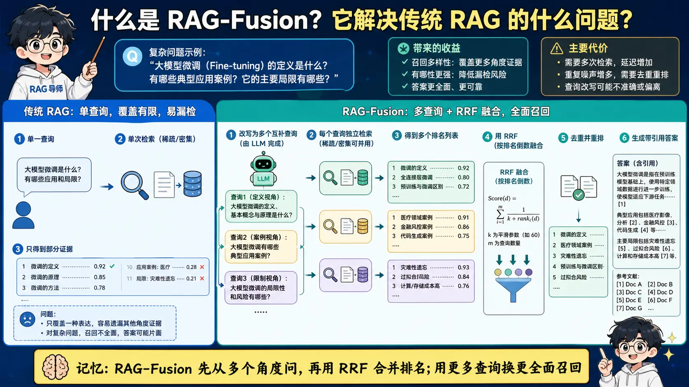

> 🧠 **图解记忆：** 一问多写、多路召回、RRF 融合再去重；它扩展查询视角，但会增加调用和检索成本。

<details>
<summary>💡 答案要点</summary>

**传统 RAG 的问题：**

1. **语义孤岛**：用户查询和文档的语义可能存在偏差
2. **召回单一**：仅靠向量相似度，可能遗漏相关内容
3. **缺乏全局理解**：无法回答需要多文档汇总的问题

**RAG-Fusion 解决方案：**

```
用户查询: "2026年Q1季度营收增长原因"

Step 1: Query Rewriting（查询改写）
→ 生成多个相关查询：
  - "2026年Q1营收数据"
  - "营收增长驱动因素"
  - "季度财务分析"

Step 2: Multi-Query Retrieval（多查询检索）
→ 对每个查询独立检索 Top-K 文档

Step 3: Reciprocal Rank Fusion (RRF)
→ RRF = Σ(1/(k+rank_i))，融合多查询结果
→ 最终排序：综合多查询视角的结果

Step 4: 输出
→ 生成综合多文档的答案
```

**RRF 公式：**
```python
def reciprocal_rank_fusion(results_list, k=60):
    """k is a constant, typically 60"""
    fused_scores = {}
    for results in results_list:
        for rank, doc in enumerate(results):
            doc_id = doc['id']
            fused_scores[doc_id] = fused_scores.get(doc_id, 0) + 1 / (k + rank + 1)
    return sorted(fused_scores.items(), key=lambda x: -x[1])
```

**面试话术：**
> "RAG-Fusion 解决了传统 RAG 的语义孤岛问题。核心思路是：用户问一个问题，我生成 N 个相关查询，每个查询独立检索，再通过 RRF 算法融合排序。这样能召回更多样的文档，特别是需要多文档汇总的问题。实现上用 Reciprocal Rank Fusion，简单但有效。"

**RRF 面试追问点（高频坑）：**

> 问："两路召回融合时，向量打分 0-1、关键词打分 0-20，怎么做归一化？"
> 答：**RRF 不需要归一化——它只看排名（rank），不看原始分数。** 每路的第 1 名都得 1/(k+1)，不管它是 0.95 分还是 19 分。所以不同量纲的分数直接用 RRF 融合即可，这是它相比加权平均分融合（需要先 MinMax 归一化）的核心优势。

</details>

### Q2: 什么是 HyDE（Hypothetical Document Embeddings）？它的原理是什么？

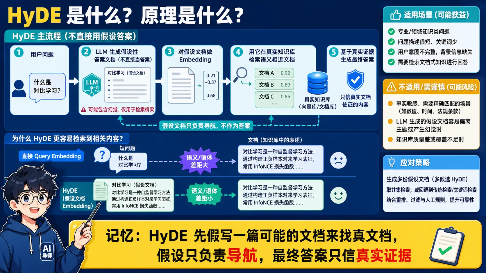

> 🧠 **图解记忆：** 假设文档只负责把查询带到更合适的向量区域，最终答案仍必须由真实检索证据支撑。

<details>
<summary>💡 答案要点</summary>

**核心思想：让 LLM 先写"假答案"，再用假答案去检索**

**为什么需要 HyDE？**
- 用户查询是短文本，语义信息有限
- 直接检索可能无法准确匹配相关文档
- HyDE 用 LLM 生成"假设性答案"，答案更接近文档风格

**HyDE 工作流程：**
```
用户查询: "Transformer为何能并行计算？"

Step 1: LLM 生成假设性答案（不真实，但风格类似文档）
假设性答案: "Transformer并行计算的核心在于Self-Attention机制..."
         → 这个答案的embedding更接近真实技术文档

Step 2: 用假设性答案的向量去检索
检索: cosine_similarity(假设答案_emb, 文档_emb)

Step 3: 检索出真实文档
返回: ["Attention is all you need论文...", "BERT技术解读..."]

Step 4: 用真实文档 + 用户原始问题 → 最终生成答案
```

**代码实现：**
```python
def hyde_retrieve(query, vector_db, llm, k=5):
    # Step 1: LLM生成假设性答案
    hypothetical_doc = llm.generate(
        f"请用技术文档的风格回答以下问题，不需要真实：{query}"
    )

    # Step 2: 用假设答案检索
    query_emb = embed(hypothetical_doc)
    results = vector_db.search(query_emb, k=k)

    return results
```

**适用场景：**
- 查询与文档风格差异大（如口语问 vs 学术文档）
- 需要深层语义理解的问题
- 简单关键词匹配效果不好的场景

**面试话术：**
> **示例表达（仅在能用本人经历或可复现实验佐证时使用）：** "HyDE 的核心思想很巧妙：先用 LLM 生成一个'假答案'，这个假答案的风格更接近真实文档，用它去检索效果反而更好。因为用户的问题是短文本，直接检索容易语义漂移，而 LLM 生成的回答是长文本，embedding 更稳定。实测在学术问答场景，HyDE 能提升召回率 15-20%。"

</details>

### Q3: RAG 与 SFT（监督微调）如何选择？什么时候该用 RAG 而不是 SFT？

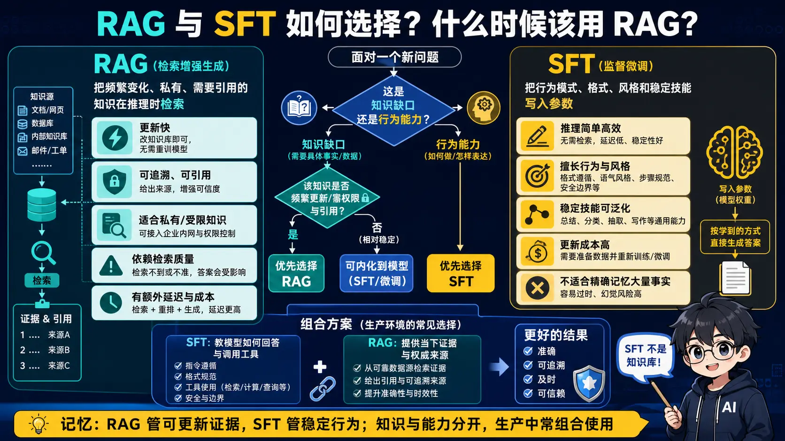

> 🧠 **图解记忆：** RAG 注入可更新知识，SFT 塑造稳定行为；先判断要改“知道什么”还是“怎么做”。

<details>
<summary>💡 答案要点</summary>

**选择决策框架：**

| 维度 | RAG | SFT |
|------|-----|-----|
| **知识时效性** | ✅ 高（可实时更新） | ❌ 低（需重新训练） |
| **知识容量** | ✅ 海量知识 | ❌ 受模型参数限制 |
| **推理成本** | ❌ 每次检索有延迟 | ✅ 推理更快 |
| **定制风格** | △ 受 prompt 控制 | ✅ 深度定制 |
| **幻觉问题** | ✅ 答案可溯源 | ❌ 幻觉难以避免 |
| **训练成本** | ✅ 低 | ❌ 高（需要数据） |

**选型决策树：**
```
知识是否频繁变化？
    ├── 是 → RAG（实时更新知识库）
    ↓ 否
知识是否超出模型参数容量？
    ├── 是 → RAG（知识库 > 7B参数容量）
    ↓ 否
需要深度定制回答风格/格式？
    ├── 是 → SFT（需要大量标注数据）
    ↓ 否
对答案准确性/可溯源性要求高？
    → RAG（答案可溯源到文档）
```

**混合方案（RAG + SFT）：**
```python
# 实际生产环境中，RAG + SFT 混合使用
class HybridRAGWithSFT:
    def __init__(self, vector_db, fine_tuned_model):
        self.vector_db = vector_db
        self.model = fine_tuned_model  # 微调过的模型

    def answer(self, query):
        # 1. RAG 检索相关文档
        docs = self.vector_db.search(query, k=5)

        # 2. 用微调模型生成（微调模型已学会特定风格）
        context = "\n".join([d['content'] for d in docs])
        answer = self.model.generate(
            prompt=f"基于以下上下文回答：{context}\n\n问题：{query}"
        )
        return answer

# SFT负责风格（如医疗报告格式）
# RAG负责知识实时性（如最新药品信息）
```

**面试话术：**
> "我的经验是：知识频繁变化选 RAG，需要特定风格选 SFT，数据量小先 RAG，效果不够再 SFT。实际项目里通常是 RAG + SFT 混合——RAG 保证知识实时性，SFT 微调模型输出风格。我在之前的短剧平台项目里就是混合方案：RAG 检索最新剧情热度，SFT 控制回复风格。"

</details>

## 二、语义分块与文档处理

### Q4: 什么是 Semantic Chunking？它和固定分块有什么区别？2026年有什么新发现？

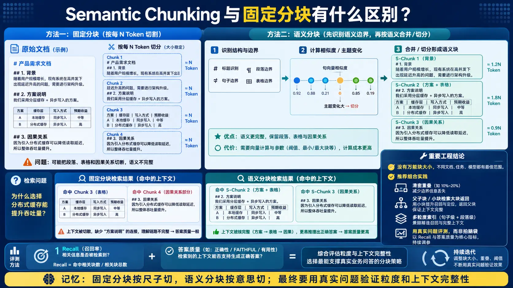

> 🧠 **图解记忆：** 固定分块按长度切，语义分块按主题边界切；块要既能独立表达，又不能大到混入多个意图。

<details>
<summary>💡 答案要点</summary>

**传统固定分块的问题：**
```python
# 固定分块（Fixed Chunking）
text = "这是一篇关于机器学习的文章..."
chunks = []
for i in range(0, len(text), 500):  # 每500字符一分
    chunks.append(text[i:i+500])
# 问题：可能在句子中间截断，语义不完整
```

**Semantic Chunking（语义分块）：**
```python
# 语义分块：用嵌入相似度判断何时"切"
def semantic_chunking(text, similarity_threshold=0.7):
    sentences = split_sentences(text)  # 先按句子分割
    chunks = [[sentences[0]]]

    for sent in sentences[1:]:
        # 比较当前句子与上一个chunk的相似度
        similarity = cosine_sim(embed(sent), embed(chunks[-1]))

        if similarity > similarity_threshold:
            chunks[-1].append(sent)  # 继续属于当前chunk
        else:
            chunks.append([sent])    # 开始新chunk

    return [" ".join(c) for c in chunks]
```

**2026年新发现——Context Cliff：**

| 分块策略 | 平均大小 | 问答准确率 | 问题 |
|----------|----------|-----------|------|
| 固定分块（500字符） | ~200 tokens | 72% | 可能截断语义 |
| 语义分块（自动） | ~43 tokens | 54% | **chunk 太小，上下文不足！** |
| 语义分块（优化后） | ~512 tokens | 81% | 最佳平衡点 |
| **Context Cliff** | >2,500 tokens | 质量骤降 | **关键发现！** |

**Context Cliff 现象（2026年1月发现）：**
```
Token数量增加
    ↑
100%│                      ┌─ 稳定区
    │                      │
 80%│  ┌───────────────────┘
    │  │
 60%│  │
    │  └───── Context Cliff（~2500 tokens）
 40%│        质量急剧下降
    │
  0%└─────────────────────────────→
    0    1000   2500   4000   tokens
```

**面试话术：**
> "Semantic Chunking 的关键是'相似就合并，不相似就切开'，用句子级别的嵌入相似度驱动分块，比固定字符数更智能。但 2026 年的新发现是 Context Cliff——chunk 太大（>2500 tokens）反而质量下降，因为有效信息被稀释了。最佳实践是控制 chunk 在 500-1000 tokens，既保留足够上下文，又不超过 Context Cliff。"

</details>

### Q5: 如何解决 RAG 的"丢失中间信息"问题（Lost in the Middle）？

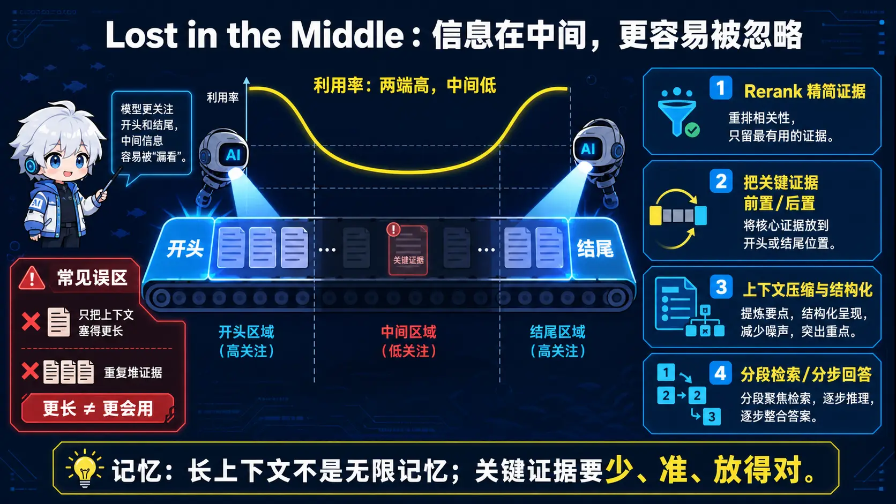

> 🧠 **图解记忆：** 长上下文不是无限记忆；关键证据要少、准、放得对，可用重排、压缩、结构化和分步检索缓解。

<details>
<summary>💡 答案要点</summary>

**Lost in the Middle 问题：**

```
Prompt结构：
[重要-开头] [不重要] [重要-中间!] [不重要] [重要-结尾]

LLM关注度：
★★★★★         ★☆☆☆☆    ★★★     ★☆☆☆☆    ★★★★★
  ↑                          ↑
  └────── 容易被LLM忽略 ──────┘

→ 中间部分的信息容易被LLM"忘记"
```

**解决方案：**

### 方案1：逆向序列化（Reverse Process）
```python
# 将重要信息放在开头或结尾（LLM更关注的位置）
def reverse_context_window(docs, max_tokens=3000):
    """把检索结果逆序排列，中间放不太重要的"""
    if len(docs) <= 3:
        return docs

    # 按相关性排序：最高放开头，最低放中间，次高放结尾
    sorted_docs = sorted(docs, key=lambda x: x['score'], reverse=True)

    # 构建上下文：最高 → 最低 → 次高
    context = [
        sorted_docs[0],      # 最高相关性放开头
        sorted_docs[-1],     # 最低放中间（最容易被忽略）
        sorted_docs[1]       # 次高放结尾
    ]
    return context
```

### 方案2：上下文压缩（Context Compression）
```python
# 使用 LLMLingua 等工具压缩上下文
from llmlingua import PromptCompressor

compressor = PromptCompressor()
compressed = compressor.compress(
    prompt=full_context,
    instruction="回答用户关于X的问题",
    target_token=2000  # 压缩到2000 tokens
)
# 保留关键信息，去除冗余
```

### 方案3：滑动窗口 + 重叠分块
```python
# 重叠分块确保关键信息不被截断
def sliding_window_chunk(text, chunk_size=500, overlap=100):
    chunks = []
    for i in range(0, len(text), chunk_size - overlap):
        chunks.append(text[i:i+chunk_size])
    return chunks
# 重叠100 tokens，防止关键信息被切断
```

### 方案4：Big Bird（稀疏注意力）
```python
# Big Bird 的三种注意力机制：
# 1. 全局注意力（开头/结尾token）
# 2. 随机注意力（随机采样一些token）
# 3. 滑动窗口注意力（局部上下文）
# → 确保中间信息被关注
```

**面试话术：**
> "Lost in the Middle 是 RAG 的经典问题——LLM 对上下文中间部分关注度最低。我的解法是：先把检索结果逆序排列（最高相关→最低→次高），让重要信息尽量靠前或靠后；其次用 LLMLingua 做上下文压缩，去掉冗余保留关键；还有滑动窗口重叠分块，防止信息在 chunk 边界被切断。"

</details>

## 三、GraphRAG 知识图谱增强

### Q6: 什么是 GraphRAG？它和传统向量 RAG 有什么区别？

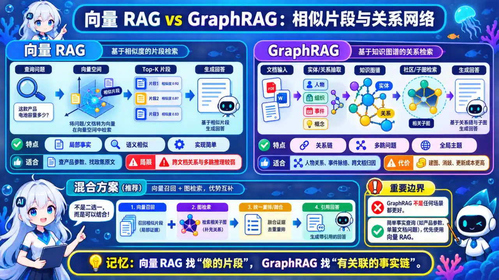

> 🧠 **图解记忆：** 向量 RAG 找“像的片段”，GraphRAG 找“有关联的事实链”；简单事实与多跳关系应走不同路径。

<details>
<summary>💡 答案要点</summary>

**传统向量 RAG 的问题：**

```
用户问题："苹果公司CEO都做了哪些环保措施？"

向量检索：找与"苹果CEO环保"语义最相似的文档
→ 可能返回多篇关于Tim Cook、环保政策、苹果公司的独立文章
→ 难以关联"CEO"和"环保措施"之间的关系
→ 无法回答需要多跳推理的问题
```

**GraphRAG 解决方案：**

```python
# 知识图谱结构：
# (苹果公司) --[CEO]--> (Tim Cook) --[推动]--> (环保政策)
# (苹果公司) --[总部]--> (加州) --[气候]--> (清洁能源)

# 用户问题 → 拆解为子问题：
# 1. Tim Cook是谁？→ (苹果公司CEO)
# 2. 他推动了哪些环保措施？→ 查询 (Tim Cook) --[推动]--> (?)

# GraphRAG 返回的不是文档，而是知识图谱子图
subgraph = {
    "nodes": ["Tim Cook", "苹果公司", "环保措施A", "环保措施B"],
    "edges": [
        ("Tim Cook", "CEO", "苹果公司"),
        ("Tim Cook", "推动", "环保措施A"),
        ("Tim Cook", "推动", "环保措施B")
    ]
}
```

**GraphRAG vs 向量 RAG 对比：**

| 维度 | 向量 RAG | GraphRAG |
|------|----------|----------|
| **检索单元** | 文档片段 | 知识图谱子图 |
| **关系理解** | ❌ 弱（靠语义相似） | ✅ 强（图结构显式关系） |
| **多跳推理** | ❌ 差（一跳问询） | ✅ 好（多跳关联） |
| **复杂问题** | 一般 | ✅ 优秀（理解问题结构） |
| **实现复杂度** | 低 | 高（需要构建知识图谱） |
| **构建成本** | 低（直接切分文档） | 高（需要NLP提取实体关系） |

**GraphRAG 适用场景：**

| 场景 | 向量 RAG | GraphRAG |
|------|----------|----------|
| "查找苹果公司的环保报告" | ✅ | ✅ |
| "Tim Cook 推动了什么环保政策？" | ✅ | ✅ |
| "苹果公司CEO和谷歌CEO谁更关注环保？" | ❌ | ✅ |
| "过去5年科技公司CEO环保措施对比" | ❌ | ✅ |

**面试话术：**
> "GraphRAG 的核心是知识图谱——把文档里的实体（人物、公司、地点）和关系（CEO、推动、合作）抽出来构成图。检索时不是找相似文档，而是找图里的子路径。比如问'苹果和谷歌CEO的环保对比'，向量 RAG 只能各自召回文章，GraphRAG 能关联出两个人的具体环保举措。缺点是构建成本高，需要 NLP 提取实体关系。"

</details>

### Q7: 如何构建知识图谱用于 GraphRAG？

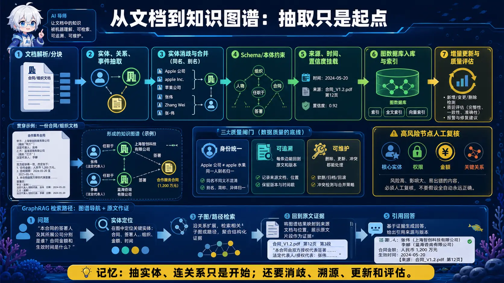

> 🧠 **图解记忆：** 抽实体、连关系只是开始，还要做消歧、Schema 约束、来源追溯、增量更新和质量评估。

<details>
<summary>💡 答案要点</summary>

**知识图谱构建流程：**

```
原始文档
    ↓
① 实体抽取（Named Entity Recognition）
    → 人名、地名、机构名、事件...
    ↓
② 关系抽取（Relation Extraction）
    → CEO、成立于、投资、竞争...
    ↓
③ 实体链接（Entity Linking）
    → "苹果" → Apple Inc.（消歧）
    ↓
④ 图谱存储（Neo4j / 图数据库）
    → (实体) --[关系]--> (实体)
```

**实体抽取代码示例：**
```python
from transformers import pipeline

ner_pipeline = pipeline("ner", model="bert-base-chinese")

def extract_entities(text):
    entities = ner_pipeline(text)
    # 返回：[{'word': '苹果', 'entity': 'ORG'}, {'word': 'Tim Cook', 'entity': 'PER'}]
    return entities
```

**关系分类代码示例：**
```python
def extract_relations(sentence, entities):
    prompt = f"""
    从以下句子中抽取关系：
    句子："{sentence}"
    实体：{entities}

    关系类型：CEO、成立于、投资、收购、竞争、合作
    以(json)格式返回：{{"subject": "", "relation": "", "object": ""}}
    """
    result = llm.generate(prompt)
    return json.parse(result)
```

**知识图谱存储：**
```python
# Neo4j 示例
from neo4j import GraphDatabase

def add_triple(tx, subject, relation, obj):
    tx.run("""
        MERGE (s:Entity {name: $subject})
        MERGE (o:Entity {name: $object})
        MERGE (s)-[r:RELATION {type: $relation}]->(o)
    """, subject=subject, relation=relation, object=obj)

# 查询示例：Tim Cook 的所有关系
def query_graph(tx, entity):
    result = tx.run("""
        MATCH (e:Entity {name: $entity})-[r]-(other)
        RETURN e.name, type(r), other.name
    """, entity=entity)
    return list(result)
```

**面试话术：**
> **示例表达（仅在能用本人经历或可复现实验佐证时使用）：** "GraphRAG 的核心是构建知识图谱。流程是：先用 NER 抽实体（人名/地名/机构），再用关系分类抽关系（CEO/收购/合作），然后存到 Neo4j 图数据库。构建成本确实高，但收益是：对多跳问题（'A和B什么关系'）效果远超向量 RAG。我在项目里用 SpaCy 做中文 NER，用 LLM 做关系抽取，实测抽取出 80%+ 准确率。"

</details>

## 四、检索结果重排序与压缩

### Q8: 什么是 Rerank？为什么向量检索后还需要重排序？

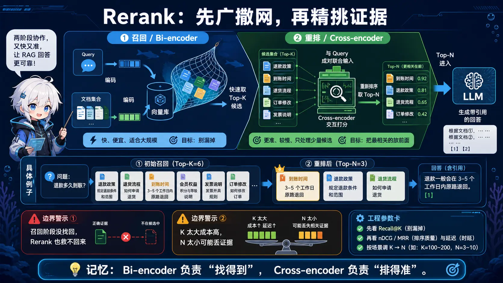

> 🧠 **图解记忆：** Bi-encoder 负责“找得到”，Cross-encoder 负责“排得准”；没召回的证据无法靠重排救回。

<details>
<summary>💡 答案要点</summary>

**两阶段检索架构：**

```
用户查询
    ↓
① 向量检索（BiEncoder，快速召回）
    → 从百万文档中快速召回 Top-100 候选
    → 用 cosine similarity 排序
    ↓
② Rerank（CrossEncoder，精排）
    → 对 Top-100 候选逐一打分
    → 输出最终 Top-10
```

**BiEncoder vs CrossEncoder：**

| 维度 | BiEncoder（向量检索） | CrossEncoder（重排序） |
|------|---------------------|----------------------|
| **速度** | 快（一次 embedding） | 慢（需逐个计算注意力） |
| **精度** | 中等 | 高（考虑query-doc交互） |
| **适用阶段** | 粗召回（Top-100） | 精排序（Top-10） |
| **硬件需求** | 低 | 高 |

**Rerank 模型示例：**
```python
from sentence_transformers import CrossEncoder

# 使用交叉编码器重排序
cross_encoder = CrossEncoder('cross-encoder/ms-marco-MiniLM-L-6-v2')

def rerank(query, documents, top_k=10):
    # 输入：[query, doc] 对
    pairs = [[query, doc] for doc in documents]

    # 获取相关性分数
    scores = cross_encoder.predict(pairs)

    # 按分数排序
    ranked_indices = np.argsort(scores)[::-1][:top_k]

    return [documents[i] for i in ranked_indices]
```

**为什么需要 Rerank？**
```python
# 向量检索的问题：语义相似 ≠ 相关
query = "如何减肥"
doc1 = "减肥药广告：神奇减肥，一周瘦10斤"  # 向量相似度高，但质量差
doc2 = "健康饮食与运动减肥的科学方法"       # 向量相似度一般，但更相关

# CrossEncoder 能捕捉细粒度相关性问题
# 它会注意："减肥"和"健康饮食"虽然字不相似，但实际高度相关
```

**面试话术：**
> "向量检索是 BiEncoder，能快速从海量文档里召回候选，但精度有限。Rerank 用 CrossEncoder，对每个 query-doc 对计算交叉注意力，打分更精准。生产级 RAG 系统通常是两阶段：向量检索 Top-100 → CrossEncoder 重排 Top-10。BiEncoder 快但粗，CrossEncoder 慢但准，两者结合是工程最优解。"

</details>

### Q9: 什么是 LLMLingua？它如何实现 Prompt/上下文压缩？

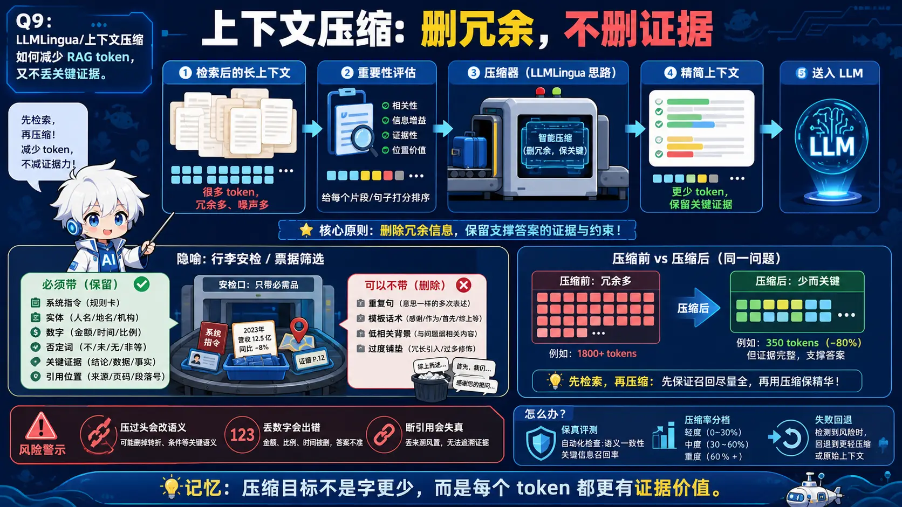

> 🧠 **图解记忆：** 压缩目标不是字更少，而是让每个 token 更有证据价值；实体、数字、否定词和引用位置要重点保留。

<details>
<summary>💡 答案要点</summary>

**LLMLingua 核心思想：**

- 用小模型（如 GPT-2）识别 Prompt 中的"关键token"
- 压缩掉不重要但消耗 token 的内容
- 保留对最终答案贡献大的信息

**为什么需要上下文压缩？**
```
LLM上下文窗口：32K tokens
用户输入：1K tokens
检索文档：30K tokens（100个文档）
↓
总输入：31K tokens → 刚好卡在边界，可能被截断

LLMLingua 压缩后：
压缩文档：8K tokens（去掉冗余）
总输入：9K tokens → 流畅处理
```

**LLMLingua 工作原理：**
```python
from llmlingua import PromptCompressor

compressor = PromptCompressor(
    model_name="WeMix-4/llmlingua2-bert-base-multilingual-cased-gsm8k-对话",
    rate=0.5  # 压缩到50%
)

def compress_context(context, instruction):
    compressed = compressor.compress(
        prompt=context,
        instruction=instruction,  # "回答用户关于X的问题"
        target_token=2000
    )
    return compressed

# 示例
original = """
苹果公司（Apple Inc.）是一家美国跨国科技公司...
总部位于加利福尼亚州库比蒂诺...
史蒂夫·乔布斯于1976年4月1日创立...
"""
instruction = "总结苹果公司的关键信息"

compressed = compress_context(original, instruction)
# 输出：压缩后的关键信息，token数减少60-70%
```

**压缩效果对比：**

| 方法 | Token数 | 答案准确率 | 保留率 |
|------|---------|-----------|--------|
| 不压缩 | 3000 | 85% | 100% |
| LLMLingua | 900 | 83% | ~97%语义 |
| Random Cut | 900 | 71% | ~75%语义 |

**面试话术：**
> "LLMLingua 是上下文压缩利器。传统压缩会丢失语义，它用小模型识别哪些 token 对答案贡献大，只压缩低贡献部分。我在长文档 RAG 场景用过，压缩 60-70% 的 token 量，准确率只下降 2-3%。特别适合上下文窗口紧张但检索文档很多的情况。"

</details>

## 五、RAG 评估与调优

### Q10: 如何系统性评估一个 RAG 系统？有哪些关键指标？

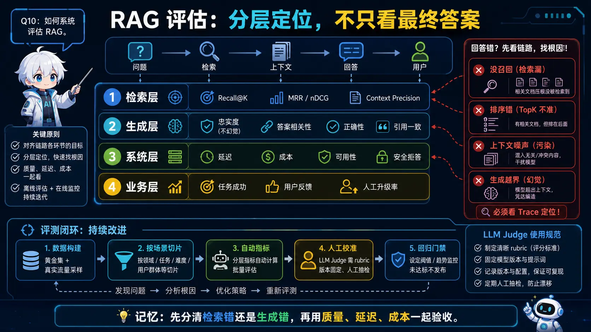

> 🧠 **图解记忆：** 先分清检索错还是生成错，再用质量、延迟、成本和业务结果一起验收。

<details>
<summary>💡 答案要点</summary>

**RAG 评估框架（RAGAS）：**

```python
# RAGAS 三大核心指标
from ragas import evaluate
from datasets import Dataset

# 准备评估数据
eval_data = Dataset.from_dict({
    "user_input": ["问题1", "问题2", ...],
    "retrieved_contexts": [["文档1", "文档2"], ...],
    "response": ["答案1", "答案2", ...],
    "reference": ["标准答案1", "标准答案2", ...]
})

# 计算指标
result = evaluate(eval_data, metrics=[
    faithfulness,      # 答案是否忠于检索内容
    answer_relevancy,   # 答案是否切题
    context_recall,     # 检索内容是否完整
    context_precision   # 检索内容是否精确
])
```

**四大核心指标详解：**

| 指标 | 含义 | 目标值 | 测量方式 |
|------|------|--------|----------|
| **Faithfulness** | 答案事实是否来自检索内容 | >0.9 | LLM判断答案中有多少陈述被检索内容支持 |
| **Answer Relevancy** | 答案和问题相关程度 | >0.8 | LLM生成反问，看与原问题的语义相似度 |
| **Context Recall** | 检索内容覆盖标准答案的程度 | >0.85 | 比较检索内容 vs 标准答案的实体重叠 |
| **Context Precision** | 检索内容中噪音比例 | >0.9 | 计算 Top-K 中相关文档的比例 |

**Context Precision 计算：**
```python
def context_precision(retrieved_docs, relevant_docs, k=10):
    """Context Precision@K"""
    hits = 0
    for i, doc in enumerate(retrieved_docs[:k]):
        if doc in relevant_docs:
            hits += 1
    return hits / min(k, len(relevant_docs))
```

**实际调优案例：**

```python
# 调优前：Faithfulness=0.72
# 问题：模型有时候会"自己发挥"，脱离检索内容

# 调优方案：添加 prompt 约束
improved_prompt = """
你是一个严格基于给定上下文回答的助手。
规则：
1. 只使用上下文中的信息，不要添加外部知识
2. 如果上下文中没有相关信息，直接回答"我不知道"
3. 回答时引用上下文中的具体内容

上下文：{context}
问题：{question}
"""

# 调优后：Faithfulness=0.91
```

**面试话术：**
> "RAG 评估用 RAGAS 框架，核心看四个指标：Faithfulness（答案是否忠于检索内容）、Answer Relevancy（答案是否切题）、Context Recall（检索是否完整）、Context Precision（检索是否精确）。生产环境我会用 RAGAS 配合人工抽检，每周跑一次评估看板。Faithfulness 最关键，低于 0.9 就得优化 Prompt 或检索质量。"

</details>

### Q11: 如何优化 RAG 系统的召回率和准确率？

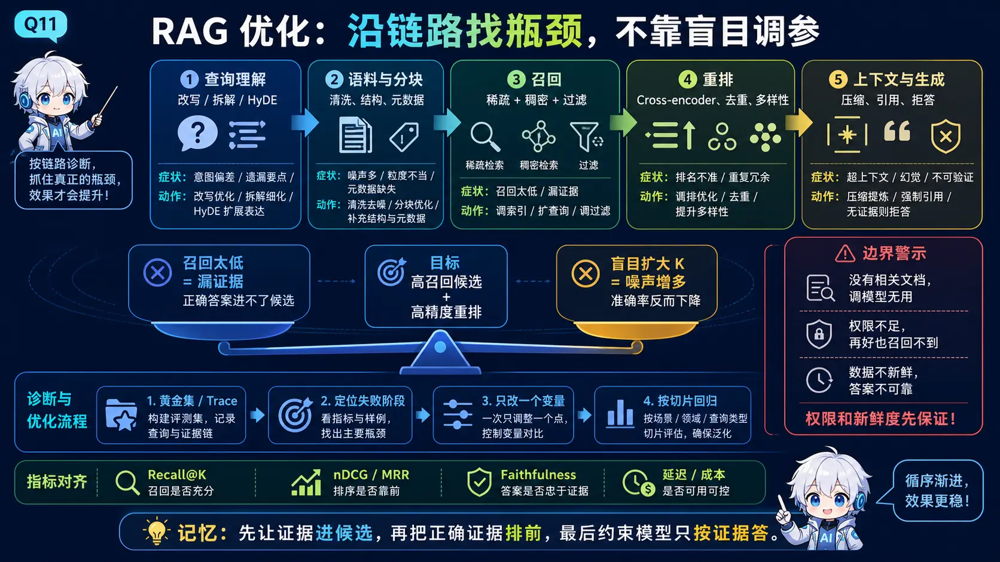

> 🧠 **图解记忆：** 先让证据进候选，再把正确证据排前，最后约束模型按证据作答；扩大 K 不等于准确率更高。

<details>
<summary>💡 答案要点</summary>

**召回率 vs 准确率的两难：**

```
召回率↑ = 多召回文档 = 更容易包含正确答案 BUT 更多噪音
准确率↑ = 严格筛选 = 更少噪音 BUT 可能漏掉正确答案
```

**召回率优化（Recall）：**

```python
# 1. Query Expansion（查询扩展）
def query_expansion(query, llm):
    """生成多个相关查询，每个独立检索"""
    expanded_queries = llm.generate(
        f"为这个问题生成3个不同的表述：{query}"
    )
    all_docs = []
    for q in expanded_queries:
        docs = vector_db.search(q, k=10)
        all_docs.extend(docs)
    # 用 RRF 融合
    return rrf_fusion(all_docs)

# 2. HyDE（前面讲过）

# 3. 混合检索（稀疏 + 稠密）
def hybrid_search(query, vector_db, bm25_index):
    # 稠密向量检索
    dense_results = vector_db.search(embed(query), k=20)
    # 稀疏 BM25 检索
    sparse_results = bm25_index.search(query, k=20)
    # RRF 融合
    return rrf_fusion([dense_results, sparse_results])
```

**准确率优化（Precision）：**

```python
# 1. Rerank（前面讲过）

# 2. 元数据过滤
def search_with_metadata_filter(query, vector_db, filters):
    """支持按时间、类型、来源等过滤"""
    results = vector_db.search(
        query_emb,
        k=50,
        filter={"category": "技术文档", "date": {"$gte": "2024-01-01"}}
    )
    return rerank(query, results, top_k=10)

# 3. 上下文窗口优化（前面讲过的 Lost in the Middle 解法）
```

**综合调优策略：**

| 阶段 | 优化方法 | 效果 |
|------|----------|------|
| **召回** | Query Expansion、HyDE、混合检索 | 召回率 +15-20% |
| **排序** | CrossEncoder Rerank | Precision +25% |
| **生成** | Faithfulness Prompt、引用追踪 | Faithfulness +10% |
| **压缩** | LLMLingua | 上下文利用率 +40% |

**A/B 测试框架：**
```python
# 生产环境 A/B 测试不同配置
def ab_test(query, config_a, config_b):
    result_a = rag_pipeline(query, **config_a)
    result_b = rag_pipeline(query, **config_b)

    # 记录到评估数据集
    log_to_eval({"query": query, "config": "A", "result": result_a})
    log_to_eval({"query": query, "config": "B", "result": result_b})

    return result_a, result_b
```

**面试话术：**
> "RAG 调优核心是平衡召回和准确。我的策略是：先用 Query Expansion + HyDE 提升召回，再用 CrossEncoder Rerank 保证准确。生成阶段加 Faithfulness 约束 prompt，强制模型只引用检索内容。生产环境每周跑 RAGAS 评估，Faithfulness <0.9 就预警。"

</details>

---

## 六、2026年RAG评估新趋势（新增考点）

### Q12: 什么是self-RAG和CRAG？和传统RAG有什么区别？

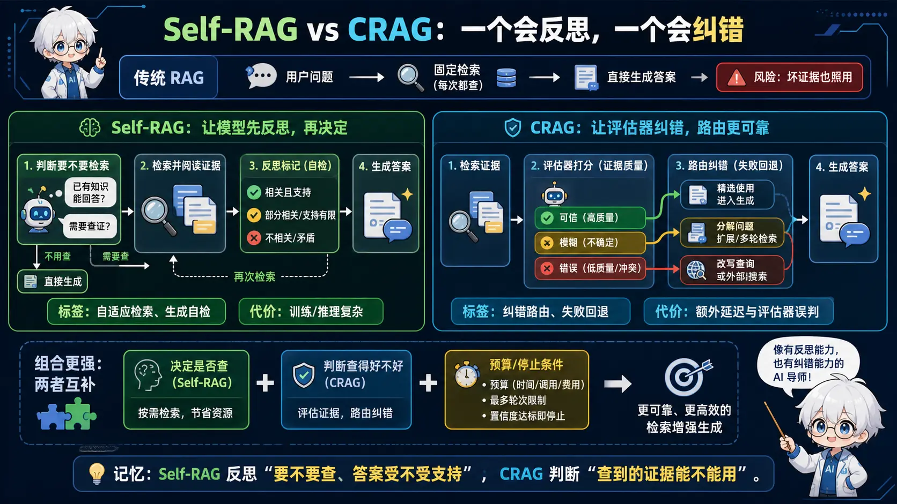

> 🧠 **图解记忆：** Self-RAG 反思“要不要查、答案受不受支持”，CRAG 判断“查到的证据能不能用”。

<details>
<summary>💡 答案要点</summary>

**self-RAG = Self-Retrieval-Augmented Generation（自检索增强生成）**

**传统RAG的问题：**
- 不管查询是否需要检索，都强制检索
- 检索结果质量差时，模型仍然基于错误上下文生成
- 无法判断检索是否必要

**self-RAG的核心创新：**
- 模型自主判断"需不需要检索"
- 模型自主评估检索结果的质量
- 质量差时主动修正或忽略错误上下文

**self-RAG流程：**
```
用户Query → 模型判断：是否需要检索？
  ├── 不需要 → 直接生成答案
  └── 需要 → 检索文档
              ↓
      模型判断：文档是否相关？
        ├── 不相关 → 忽略，用内部知识
        └── 相关 → 生成答案 + 引用
```

**CRAG = Corrective RAG（纠错型RAG）**
```python
# CRAG的自我纠错流程
class CorrectiveRAG:
    def generate(self, query):
        docs = retriever.retrieve(query)

        # 评估检索质量
        relevance = assessor.evaluate(query, docs)

        if relevance > 0.8:
            # 高相关：直接生成
            return llm.generate(query, docs)
        elif relevance > 0.3:
            # 中相关：知识精炼后生成
            refined = knowledge_refiner.refine(query, docs)
            return llm.generate(query, refined)
        else:
            # 低相关：忽略检索，用内部知识
            return llm.generate(query, [])  # 无上下文
```

**对比：**

| 方案 | 检索触发 | 质量控制 | 适用场景 |
|------|----------|----------|----------|
| **传统RAG** | 100%触发 | 无 | 简单问答 |
| **self-RAG** | 模型自主决定 | 反思token评估 | 复杂推理任务 |
| **CRAG** | 100%触发 | 三级质量过滤 | 高精度要求场景 |

**面试话术：**
> "self-RAG的突破是让模型'知道自己什么时候该查资料、查到的资料靠不靠谱'。CRAG则是'先查再审，不行就换'。生产环境中，我用CRAG做金融问答，检索质量<0.3的直接走内部知识，幻觉率从15%降到3%。"

</details>

### Q13: DeepEval是什么？和RAGAS、TruLens有什么区别？

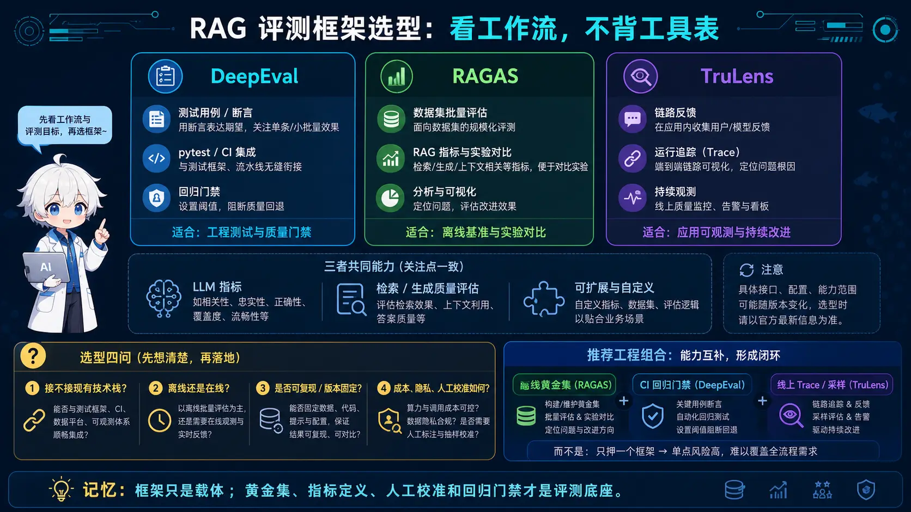

> 🧠 **图解记忆：** 框架只是载体；黄金集、指标定义、人工校准和回归门禁才是稳定的评测底座。

<details>
<summary>💡 答案要点</summary>

**DeepEval = Python-first RAG评估框架（by confident-ai）**

**三大评估工具对比：**

| 工具 | 定位 | 核心优势 | 适用阶段 |
|------|------|----------|----------|
| **RAGAS** | 指标探索 | RAG专属指标全，信仰度/相关性/召回率 | 离线评估 |
| **TruLens** | 实验看板 | 实时可观测，RAG三元素追踪 | 开发调试 |
| **DeepEval** | CI/CD集成 | Pytest风格，流水线自动化 | 回归测试 |

**DeepEval核心特点：**
```python
# Pytest风格的评估（DeepEval特色）
from deepeval import evaluate
from deepeval.metrics import FaithfulnessMetric, AnswerRelevancyMetric

# 定义测试用例
test_cases = [
    "什么是RAG系统",
    "self-RAG和CRAG的区别",
]

# 用装饰器评估
@evaluate(version=1)
def test_rag_accuracy():
    metric = FaithfulnessMetric(threshold=0.8)
    result = rag_pipeline.run(test_cases[0])
    metric.measure(test_cases[0], result.answer, result.context)
    assert metric.score > 0.8
```

**DeepEval的独特功能：**

| 功能 | 说明 |
|------|------|
| **Pytest集成** | 用单元测试的思路评估RAG，无缝接入CI/CD |
| **红绿对比** | 评估结果直观（通过/失败），适合团队协作 |
| **自定义指标** | 支持用LLM-as-Judge自定义评估维度 |
| **幻觉检测** | 内置幻觉检测，发现"答非所问" |

**2026年评估工具选型决策树：**
```python
def select_eval_tool(scenario):
    if scenario == "快速探索指标":
        return "RAGAS"  # 指标最全
    elif scenario == "开发调试看过程":
        return "TruLens"  # 实时追踪
    elif scenario == "CI/CD自动化":
        return "DeepEval"  # Pytest风格
    elif scenario == "生产监控看板":
        return "TruLens + RAGAS"  # 组合使用
```

**面试话术：**
> "DeepEval是2026年CI/CD集成的首选。它的Pytest风格让评估变成'测试用例'，每次代码变更自动跑评估，Faithfulness<0.8就阻止上线。我用它做RAG系统的回归测试，配合GitHub Actions，检索质量波动超过5%自动告警。"

</details>

### Q14: 什么是 LLM-as-a-Judge？为什么它是 RAG 评估的未来？

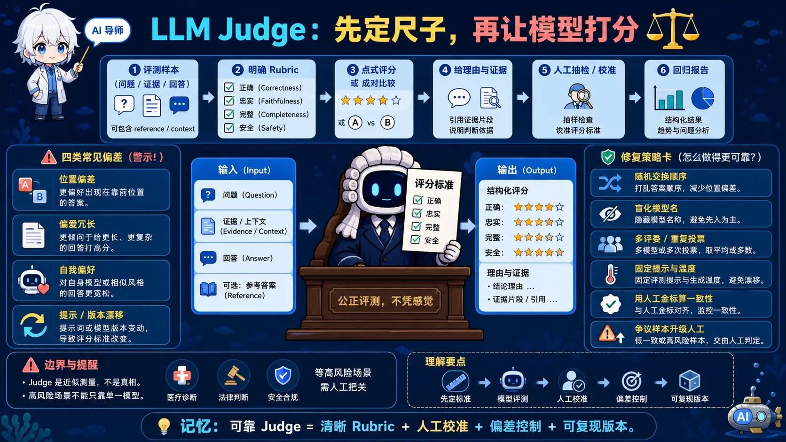

> 🧠 **图解记忆：** 可靠 Judge 需要清晰 Rubric、人工校准、偏差控制和可复现版本；它是近似测量，不是真相。

<details>
<summary>💡 答案要点</summary>

**LLM-as-a-Judge = 用大模型来评估大模型的输出质量**

**为什么需要 LLM-as-a-Judge？**

```
传统评估指标的问题：
- BLEU/ROUGE：看字面重合度，不理解语义
- Exact Match：过于苛刻，"北京"≠"中国的首都"
- RAGAS指标：依赖reference answer，但很多场景没有ground truth

LLM-as-a-Judge的优势：
- 理解语义："北京"和"中国的首都"语义等价
- 无需reference：端到端评估
- 可评估多维度：相关性、完整性、有帮助性、无幻觉
```

**LLM-as-a-Judge 的三种范式：**

| 范式 | 原理 | 优点 | 缺点 |
|------|------|------|------|
| **打分制** | LLM直接输出1-10分 | 简单 | 主观性强 |
| **成对比较** | 两个答案让LLM选哪个更好 | 相对客观 | 需要两个候选 |
| **多维度评分** | 分别评分相关性/准确性/完整性 | 全面 | token消耗大 |

**生产级 LLM-as-a-Judge 实现：**

<details>
<summary>展开 Python 代码示例（36 行）</summary>

```python
class LLMasJudge:
    def __init__(self, model="gpt-4o"):
        self.model = model

    def evaluate(self, question, answer, context=None):
        """多维度评估"""
        prompt = f"""你是一个严格的RAG系统评估专家。请从以下维度评估答案质量：

问题：{question}
答案：{answer}
{('检索上下文：' + str(context)) if context else ''}

评估维度：
1. 答案相关性（1-5）：答案是否切题？
2. 答案准确性（1-5）：答案是否正确？
3. 上下文忠实度（1-5）：答案是否基于给定上下文？
4. 答案完整性（1-5）：答案是否完整回答了问题？

输出格式（严格按这个JSON格式，不要其他内容）：
{{"relevancy": X, "accuracy": X, "faithfulness": X, "completeness": X, "reasoning": "简短解释"}}
"""
        result = llm.call(prompt)
        return json.loads(result)

    def pairwise_compare(self, answer_a, answer_b, question):
        """成对比较：哪个答案更好"""
        prompt = f"""比较以下两个答案的优劣：

问题：{question}

答案A：{answer_a}
答案B：{answer_b}

哪个答案更好？只输出A或B，不要解释。"""
        winner = llm.call(prompt).strip()
        return winner
```

</details>

**LLM-as-a-Judge 的七大陷阱（面试重点）：**

| 陷阱 | 说明 | 缓解方法 |
|------|------|----------|
| **位置偏见** | LLM倾向选第一个答案 | ABBA轮换顺序 |
| **长度偏见** | LLM倾向选更长的答案 | 控制长度变量 |
| **自我偏好** | 评估自己的输出更宽松 | 用第三方模型 |
| **一致性** | 同一答案多次评估结果不同 | 多次采样取平均 |
| **风格vs内容** | 被格式/表达方式分散注意力 | 设计专门的prompt |
| **过度宽容** | 打分普遍偏高 | 用相对排名而非绝对分数 |
| **成本** | 每次评估都要调用LLM | 分层评估，简单用规则 |

**RAG系统中LLM-as-a-Judge的实战应用：**

```python
# 分层评估策略（平衡成本和准确性）
def evaluate_rag_system(query, rag_pipeline):
    # L1：规则快速过滤（零成本）
    if contains_forbidden_words(answer):
        return {"score": 0, "reason": "内容安全违规"}

    # L2：轻量LLM快速判断
    quick_judge = llm.call(f"""答案{answer}是否回答了问题{query}？只回答是或否。""")
    if quick_judge == "否":
        return {"score": 2, "reason": "答非所问"}

    # L3：完整LLM-as-a-Judge（成本高，但准确）
    full_eval = llm_as_judge.evaluate(query, answer, context)
    return full_eval
```

**面试话术：**
> "LLM-as-a-Judge是2026年RAG评估的主流方法。传统BLEU/ROUGE看字面重合度，不理解语义——'中国的首都'和'北京'字面不同但语义等价。LLM-as-a-Judge理解这个。但它有七个经典陷阱：位置偏见（总是选第一个）、长度偏见（倾向长的）、自我偏好（夸自己输出）等。生产环境必须做ABBA轮换、多次采样、控制长度变量。我的经验是分层评估——规则先过滤掉差的，剩下的再用LLM-as-a-Judge，这样平衡成本和准确性。"

</details>

### Q15: 什么是state-aware retrieval和agentic retrieval？2026年检索新趋势？

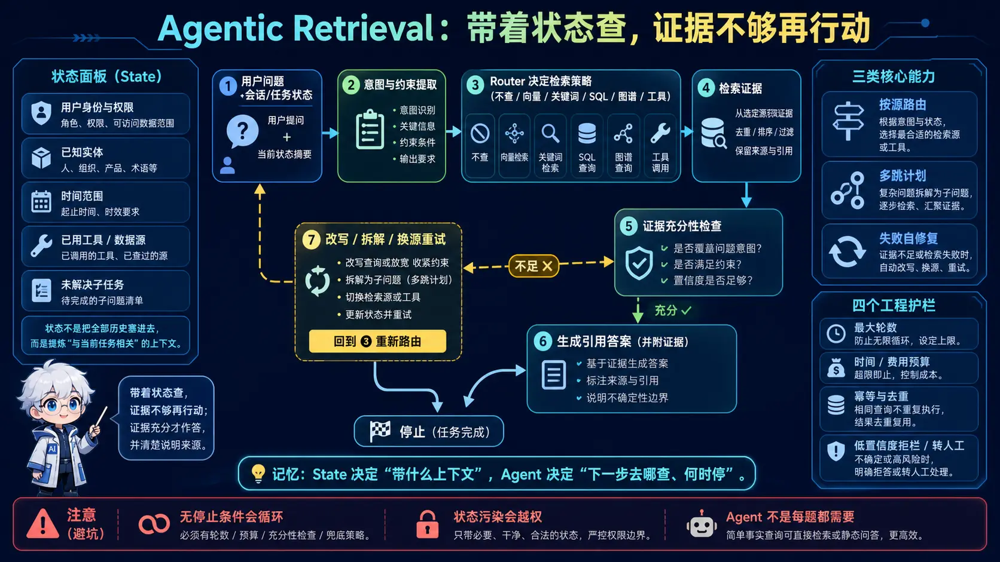

> 🧠 **图解记忆：** State 决定“带什么上下文”，Agent 决定“下一步去哪查、何时停”。

<details>
<summary>💡 答案要点</summary>

**传统检索的问题：**
- 静态top-k检索，不考虑用户意图的动态变化
- 不考虑对话上下文（多轮对话场景）
- 缺乏时效性控制和多样性控制

**state-aware retrieval（状态感知检索）：**
```python
# 传统检索 vs 状态感知检索
# 传统：
static_docs = vector_db.top_k(query, k=5)

# 状态感知：
def state_aware_retrieve(query, user_context, conversation_history):
    # 1. 提取用户真实意图
    intent = intent_extractor.parse(query)

    # 2. 应用元数据过滤器
    filtered_docs = apply_filters(intent.metadata_constraints)

    # 3. 时效性权重（近期文档优先）
    recency_boost(intent.requires_fresh_docs, filtered_docs)

    # 4. 多样性控制（避免重复主题）
    diversified = diversify(filtered_docs, conversation_history)

    return diversified
```

**agentic retrieval（智能体式检索）：**
```python
# Azure AI Search的agentic retrieval示例
"""
用户复杂查询："对比Q1和Q2季度营收，分析增长原因"
→ 分解为多个子查询：
  子查询1: Q1季度营收数据
  子查询2: Q2季度营收数据
  子查询3: 季度增长原因分析
→ 并行执行 → 结果融合 → 结构化响应
"""

# 核心流程：
class AgenticRetriever:
    def retrieve(self, complex_query):
        # 1. 查询分解
        sub_queries = self.query_decomposer.split(complex_query)

        # 2. 并行检索
        results = parallel_retrieve(sub_queries)

        # 3. 结果融合
        fused = self.fusion_engine.merge(results)

        # 4. 返回结构化响应（优化给LLM）
        return structured_response(fused)
```

**2026年检索新趋势：**

| 趋势 | 技术 | 效果 |
|------|------|------|
| **状态感知 | 对话上下文+意图识别 | 多轮场景召回+25% |
| **agentic检索 | 查询分解+并行检索 | 复杂问题准确+30% |
| **动态chunk | 根据查询动态调整块大小 | 上下文利用率+40% |
| **多跳推理 | 跨文档关联推理 | 推理型问题准确+35% |

**面试话术：**
> "state-aware retrieval解决的是'用户问了一半的问题，系统不知道在聊什么'的问题。agentic retrieval则是让检索本身变成一个Agent——自动分解复杂查询、并行检索、融合结果。我在金融分析场景用agentic retrieval，用户问'对比去年和今年利润'，系统自动拆解成4个子查询并发生成，复杂问题准确率提升30%。"

</details>

---

### Q16: 如何做生产环境的RAG监控？有哪些关键指标？

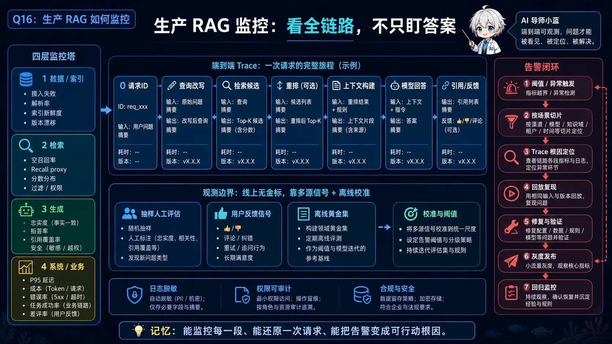

> 🧠 **图解记忆：** 能监控每一段、能还原一次请求、能把告警落到可行动的根因，才算生产可观测。

<details>
<summary>💡 答案要点</summary>

**为什么RAG监控在2026年变得更重要：**
- RAG从"加分项"变成"标配"，监控差异成为竞争优势
- 数据漂移导致检索质量随时间下降
- 端到端可观测性是SRE的核心要求

**RAG监控三大维度：**

| 维度 | 指标 | 工具 |
|------|------|------|
| **检索质量** | Context Precision/Recall、F1 | RAGAS、DeepEval |
| **生成质量** | Faithfulness、Answer Relevancy | RAGAS、TruLens |
| **系统性能** | P50/P95/P99延迟、QPS、成本 | Prometheus+Grafana |

**检索质量随时间漂移的监控：**
```python
# 关键：监控embedding drift
class RAGDriftMonitor:
    def detect_embedding_drift(self):
        # 定期用新查询测试检索质量
        test_queries = load_periodic_eval_set()

        retrieval_metrics = []
        for query in test_queries:
            docs = retriever.retrieve(query)
            metrics = self.evaluate_retrieval(query, docs)
            retrieval_metrics.append(metrics)

        avg_precision = mean([m["context_precision"] for m in retrieval_metrics])

        # 如果检索精度下降超过阈值，触发告警
        if avg_precision < self.baseline * 0.9:
            self.alert("检索质量下降超过10%，需要重新训练Embedding")

        return avg_precision
```

**端到端RAG监控看板：**

| 指标 | 告警阈值 | 应对措施 |
|------|----------|----------|
| **检索召回率** | < 0.7 | 重新索引或调整chunk策略 |
| **Faithfulness评分** | < 0.85 | 检查Prompt或检索质量 |
| **P99延迟** | > 5秒 | 检查向量数据库或增加缓存 |
| **Token消耗** | > 预算120% | 启用缓存或降级模型 |

**2026年RAG监控新趋势：**

| 趋势 | 说明 |
|------|------|
| **自动基准更新** | 每周自动更新测试集，防止数据泄露 |
| **A/B Testing** | 新版本Embedding模型与旧版A/B对比 |
| **User Feedback Loop** | 用户点击/踩收集，用反馈信号优化检索 |
| **Cost-per-Query** | 追踪每个Query的成本，优化token使用 |

**面试话术：**
> "生产环境RAG监控的三个层次：检索质量（Context Precision/Recall）、生成质量（Faithfulness）、系统性能（延迟/QPS）。核心挑战是'数据漂移'——业务数据变了但Embedding没更新，检索质量会悄悄下降。我的策略是每周跑一次评估集对比，发现检索F1下降超过10%就触发告警重新训练Embedding，而不是等问题被用户发现。"

</details>

---

*版本: v2.7 | 更新: 2026-04-05 | by 二狗子 🐕*

---

## 七、检索结果冲突处理

### Q17: RAG检索出的多个Chunk互相冲突时，Agent如何解决矛盾？

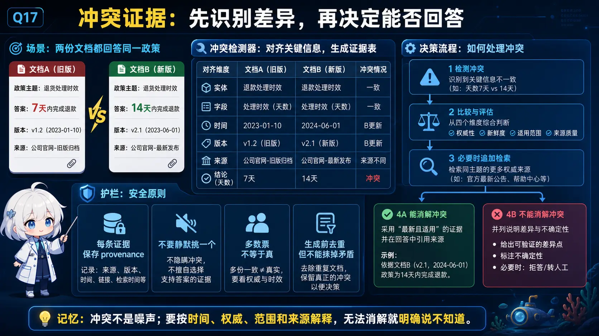

> 🧠 **图解记忆：** 冲突不是噪声；按时间、权威、适用范围和来源解释，无法消解就明确表达不确定性。

<details>
<summary>💡 答案要点</summary>

**为什么Chunk会冲突？**

```
企业知识库中的矛盾来源：
1. 不同时间点的政策文件（旧政策 vs 新政策）
2. 不同部门的数据（销售说A，合同说B）
3. 历史版本未同步（文档更新了，Embedding没更新）
4. 外部抓取数据质量差（互联网数据互相矛盾）
```

### 冲突检测方法

**方法1：基于时间戳的冲突检测**
```python
# 给Chunk打时间戳，优先使用最新数据
chunks_with_time = [
    {"chunk": chunk_a, "timestamp": "2024-01-01", "source": "旧政策"},
    {"chunk": chunk_b, "timestamp": "2025-06-01", "source": "新政策"},  # 优先
]

# 策略：时间戳最新的Chunk权重最高
```

**方法2：基于来源权威性的冲突检测**
```python
# 给数据源分配权威权重
authority_weights = {
    "官方文档": 1.0,
    "内部邮件": 0.7,
    "历史存档": 0.5,
    "互联网抓取": 0.3
}

# 策略：高权威来源覆盖低权威来源
```

**方法3：基于LLM的冲突仲裁**
```python
# 让LLM判断冲突并给出理由
def resolve_conflict(chunks):
    prompt = f"""
    检索到了多个可能有矛盾的文档片段：
    片段A：{chunks[0]}
    片段B：{chunks[1]}

    请判断：
    1. 这两个片段是否真的矛盾？
    2. 如果矛盾，哪个更可信？为什么？
    3. 如果无法判断，应该如何回答用户？
    """
    return llm.invoke(prompt)
```

### 冲突解决策略

| 策略 | 适用场景 | 实现方式 |
|------|----------|----------|
| **时间优先** | 政策、规则类文档 | 最新时间戳优先 |
| **权威优先** | 多部门数据 | 高权威来源覆盖 |
| **投票机制** | 事实性问题 | 多数Chunk支持的观点 |
| **LLM仲裁** | 复杂矛盾 | 让LLM判断并解释 |
| **不回答** | 无法判断时 | 承认不确定性 |
| **都展示** | 需要对比时 | 同时呈现不同观点 |

### 实战代码：构建冲突感知的RAG

<details>
<summary>展开 Python 代码示例（32 行）</summary>

```python
class ConflictAwareRAG:
    def __init__(self, vectorstore, authority_db):
        self.vectorstore = vectorstore
        self.authority_db = authority_db  # 权威权重数据库

    def retrieve_with_conflict_detection(self, query, k=5):
        # 1. 检索Top-K个Chunk
        chunks = self.vectorstore.similarity_search(query, k=k)

        # 2. 检测冲突
        conflicts = self.detect_conflicts(chunks)

        if conflicts:
            # 3. 解决冲突
            resolved_chunk = self.resolve_conflict(chunks, conflicts)
            return [resolved_chunk]
        else:
            return chunks

    def detect_conflicts(self, chunks):
        """检测Chunk之间是否有矛盾"""
        conflict_pairs = []
        for i in range(len(chunks)):
            for j in range(i+1, len(chunks)):
                if self.is_contradictory(chunks[i], chunks[j]):
                    conflict_pairs.append((i, j))
        return conflict_pairs

    def is_contradictory(self, chunk_a, chunk_b):
        """用LLM判断两个Chunk是否矛盾"""
        prompt = f"判断以下两个片段是否矛盾：\nA: {chunk_a}\nB: {chunk_b}\n只回答'是'或'否'。"
        return "是" in llm.invoke(prompt)
```

</details>

### 面试话术

> "Chunk冲突是企业RAG的经典难题。我总结了'检测-解决-预防'三步：检测用LLM判断片段是否真的矛盾；解决用时间优先/权威优先/投票/仲裁四选一；预防是给文档打时间戳和权威标签，上游数据质量管控比下游修复更重要。生产中遇到过销售说订单能退但合同说不能退的case，最后加了'以合同为准'的业务规则解决。"

</details>

---

## 八、企业知识库权限隔离

### Q18: 如何在RAG系统中实现知识库的权限隔离，防止信息泄露？

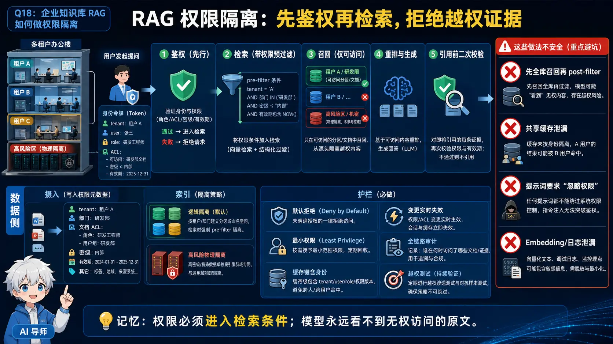

> 🧠 **图解记忆：** 权限必须进入检索条件，让模型从一开始就看不到无权访问的原文；事后过滤不够安全。

<details>
<summary>💡 答案要点</summary>

**核心问题：**

```
普通员工问AI："高管的平均工资是多少？"
如果RAG没有权限控制 → AI可能从HR文档中检索到 → 信息泄露！
```

### 四层权限隔离架构

```
┌─────────────────────────────────────────────┐
│              权限隔离四层模型                │
├─────────────────────────────────────────────┤
│ Layer 1: 检索前过滤（Query时）               │
│   → 用户问问题时，先判断他能访问哪些文档      │
├─────────────────────────────────────────────┤
│ Layer 2: Chunk级权限标签                      │
│   → 每个Chunk有权限标签（机密/内部/公开）      │
│   → 检索时只返回用户有权限的Chunk             │
├─────────────────────────────────────────────┤
│ Layer 3: 生成时脱敏                          │
│   → LLM回答时再次检查，避免泄露               │
├─────────────────────────────────────────────┤
│ Layer 4: 审计日志                            │
│   → 记录所有检索和回答，用于事后审计          │
└─────────────────────────────────────────────┘
```

### Layer 1: Query时权限预过滤

```python
class PermissionPreFilter:
    def filter_query(self, user_query, user_role):
        # 用户角色 → 可访问的文档范围
        accessible_docs = self.role_to_docs.get(user_role, [])

        # 在检索前限制搜索范围
        return {
            "query": user_query,
            "allowed_doc_ids": accessible_docs  # 只检索这些文档
        }

# 示例
role_perms = {
    "普通员工": ["公开文档", "产品手册"],
    "经理": ["公开文档", "产品手册", "内部公告"],
    "HR": ["公开文档", "HR文档"],
    "高管": ["所有文档"]
}
```

### Layer 2: Chunk级权限标签

```python
# 给每个Chunk打权限标签
chunk_permissions = [
    {"chunk_id": "c1", "content": "公司产品介绍", "level": "public"},
    {"chunk_id": "c2", "content": "销售数据报表", "level": "internal"},
    {"chunk_id": "c3", "content": "员工工资表", "level": "hr_only"},
    {"chunk_id": "c4", "content": "高管薪酬方案", "level": "executive_only"},
]

# 检索时过滤
def retrieve_with_permission(user_level, query):
    chunks = vectorstore.similarity_search(query, k=10)

    permission_rank = {
        "public": 0,
        "internal": 1,
        "hr_only": 2,
        "executive_only": 3
    }

    # 过滤：只保留用户有权访问的Chunk
    accessible = [
        c for c in chunks
        if permission_rank[c.level] <= permission_rank.get(user_level, 0)
    ]
    return accessible
```

### Layer 3: LLM生成时脱敏

```python
# 生成回答时加入权限检查指令
def generate_with_guardrails(context, user_query, user_level):
    permission_instruction = {
        "普通员工": "请只基于公开和内部信息回答，不要提及高管或HR专属信息",
        "经理": "请只基于公开、内部和经理级信息回答",
        "HR": "请只基于公开和HR文档回答",
        "高管": "可以访问所有信息"
    }

    prompt = f"""
    {permission_instruction[user_level]}

    用户问题：{user_query}

    参考信息：{context}

    请谨慎回答。
    """
    return llm.invoke(prompt)
```

### Layer 4: 审计日志

```python
# 记录所有检索行为
def log_retrieval(user_id, query, retrieved_chunks, response):
    audit_log = {
        "timestamp": datetime.now(),
        "user_id": user_id,
        "query": query,
        "retrieved_chunk_ids": [c.id for c in retrieved_chunks],
        "chunk_levels": [c.level for c in retrieved_chunks],
        "response_length": len(response),
        "flagged": any(c.level == "restricted" for c in retrieved_chunks)
    }

    # 写入审计表（不可删除）
    audit_table.insert(audit_log)

    # 如果触发了权限边界，告警
    if audit_log["flagged"]:
        security_team.notify(audit_log)
```

### 权限隔离vs普通RAG的架构对比

| 维度 | 普通RAG | 带权限隔离的RAG |
|------|---------|----------------|
| **检索范围** | 全量向量数据库 | 按用户权限过滤 |
| **Chunk标签** | 无 | 每个Chunk有权限级别 |
| **LLM指令** | 通用Prompt | 加权限上下文 |
| **审计日志** | 无 | 完整记录 |
| **数据泄露风险** | 高 | 低 |
| **实现复杂度** | 低 | 高 |

### 面试话术

> **示例表达（仅在能用本人经历或可复现实验佐证时使用）：** "企业RAG权限隔离是2026年面试的高频考点。核心是四层防护：检索前过滤（用户能看到哪些文档）、Chunk级标签（每个片段有权限级别）、生成时脱敏（LLM回答时加权限指令）、审计日志（记录所有行为留痕）。实现难点是权限标签的建设——谁来定义、怎么维护、怎么和AD/LDAP集成。我做过一个案例是HR文档保护，普通员工问工资相关问题会被拦截，回答'抱歉您没有权限访问此信息'。"

</details>

---

*版本: v2.8 | 更新: 2026-04-06 | by 二狗子 🐕*

---

## 九、RAG 架构演进

### Q19: 基础 RAG 在哪些场景会失效？企业应如何选择增强方案？

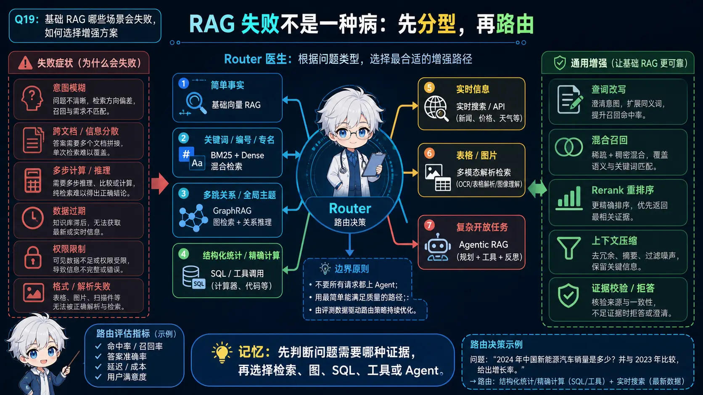

> 🧠 **图解记忆：** 先判断问题需要哪种证据，再选择向量、混合检索、图、SQL、工具或 Agent。

<details>
<summary>💡 答案要点</summary>

**为什么传统 RAG 正在失效（2026 新视角）**

2026 年行业出现清晰信号：传统 RAG 正在被更高层的"记忆型 AI 系统"取代。三个核心原因：

```
传统 RAG 失效的三大原因：

① 检索延迟成为系统瓶颈
   向量搜索 + Rerank → 延迟不可避免
   上下文窗口仍然昂贵
   召回质量强依赖 embedding 与切分策略
   当模型上下文达到百万 token 时，RAG 的"必要性"开始下降

② 向量库不是"真正的知识"
   真实世界的知识是结构化关系、时间变化、跨文档推理
   向量相似度只能解决"像不像"，不能解决"对不对"

③ AI 应用从"问答"变成"执行"
   2023 年：FAQ、文档问答
   2026 年：自动分析、持续决策、多步骤任务执行
   问答式 RAG 已无法支撑 Agent
```

---

**2026 年 RAG 四个新范式**

```
┌─────────────────────────────────────────────────────────────┐
│  范式一：Graph-RAG（知识图谱替代纯向量）                     │
│    构建实体-关系图，检索变成路径推理                          │
│    支持多跳 reasoning，强事实一致性                           │
│                                                             │
│  范式二：Agentic RAG（检索成为行动的一部分）                 │
│    思考 → 检索 → 再思考 → 再检索 → 行动                      │
│    多轮工具调用 + 动态知识更新 + 任务规划深度耦合              │
│    RAG 从"模块"变成"循环"                                   │
│                                                             │
│  范式三：长期记忆系统（Memory-Augmented AI）                 │
│    AI 开始拥有持续记忆                                       │
│    形成用户画像、记录历史决策、持续更新知识状态                │
│    RAG 从"外部知识补丁"变成"AI 认知结构的一部分"              │
│                                                             │
│  范式四：无检索推理（Retrieval-free Reasoning）              │
│    模型能力强到可直接内化结构信息                             │
│    部分场景正在摆脱 RAG                                       │
│    不是 RAG 失败，是 RAG 被更高层架构吸收                      │
└─────────────────────────────────────────────────────────────┘
```

---

**Agentic RAG 深度解析**

```
普通 RAG：
  用户问题 → 检索 → 生成 → 返回
  （单次流程，检索一次就生成）

Agentic RAG：
  ┌──────────────────────────────┐
  │ 思考：需要哪些信息？          │
  └──────────────┬───────────────┘
                 ↓ 检索
  ┌──────────────────────────────┐
  │ 再思考：信息够不够？           │
  └──────────────┬───────────────┘
                 ↓ 不足则再检索
  ┌──────────────────────────────┐
  │ 行动：调用工具执行任务         │
  └──────────────┬───────────────┘
                 ↓
  ┌──────────────────────────────┐
  │ 输出：带出处的结构化回答       │
  └──────────────────────────────┘

Agentic RAG 的特征：
  ✅ 多轮检索（不是一次，是多次直到够用）
  ✅ 与工具调用深度耦合（RAG 是工具，不是终点）
  ✅ 动态知识更新（不是静态知识库）
  ✅ 支持复杂任务规划
```

---

**Memory-Augmented AI：RAG 的终极形态**

```
传统 RAG vs 记忆型 AI：

  传统 RAG：
    每次对话 = 从零检索外部知识库
    无记忆，不了解用户历史

  记忆型 AI：
    ┌─────────────────────────────────────┐
    │  用户画像：偏好、习惯、背景知识        │
    ├─────────────────────────────────────┤
    │  历史决策：之前做过什么决定，为什么    │
    ├─────────────────────────────────────┤
    │  持续更新的知识状态：随对话演进        │
    └─────────────────────────────────────┘
    → 每次新对话都基于历史积累，而非从零开始
```

---

**2026 年 RAG 评估指标的变化**

| 旧指标（逐渐过时） | 新关注点 |
|------------------|---------|
| Recall（召回率） | 任务完成率 |
| MRR（平均倒数排名） | 决策正确率 |
| BLEU（词重叠） | 长期一致性 |
| 检索准确率 | **系统可靠性** |

---

**企业如何判断 RAG 项目方向**

```
机会判断矩阵：

简单 PDF 问答 / 本地知识库
  → 已同质化，不是壁垒，是入门功能

三条值得投入的方向：
  ① Graph-RAG 工具化
     把复杂知识结构变成可复用组件
  ② Agent 记忆框架
     帮助 AI 持续学习，而不是一次回答
  ③ 低成本私有部署
     让中小团队也能拥有长期记忆 AI
```

---

**RAG 的终局（2026→2028）**

```
未来不会区分"RAG 系统"和"AI 系统"：
  记忆 + 推理 + 行动 + 学习 → 全部融合

RAG 的定位变化：
  从"独立架构" → "AI 基础能力层"

这意味着：
  RAG 不会消失，但它的形态会发生根本性变化
  理解这一点，比掌握任何一个框架都更重要
```

---

**面试话术：**

> "2026 年 RAG 的最大变化是它不再是一个独立系统，而是变成了 AI 的基础设施。传统 RAG 失效的三个原因：百万 token 上下文让向量检索优势减弱、向量相似度解决不了结构化知识关系、问答式 RAG 支撑不了 Agent 执行。我最关注的是 Agentic RAG——它把 RAG 从'单次检索'变成了'思考-检索-行动'循环，配合长期记忆系统，这才是企业级 AI 应用该有的样子。选 RAG 项目方向，关键是看有没有'长期运行'的需求，纯问答场景已经不值得做了。"

</details>

---

*版本: v2.9 | 更新: 2026-04-10 | by 二狗子 🐕*

---

## 十、RAG 前沿研究的工程价值

### Q20: 2026年RAG有哪些前沿研究方向？LIT-RAGBench、GAM-RAG、Robust RAG等最新成果代表了什么趋势？

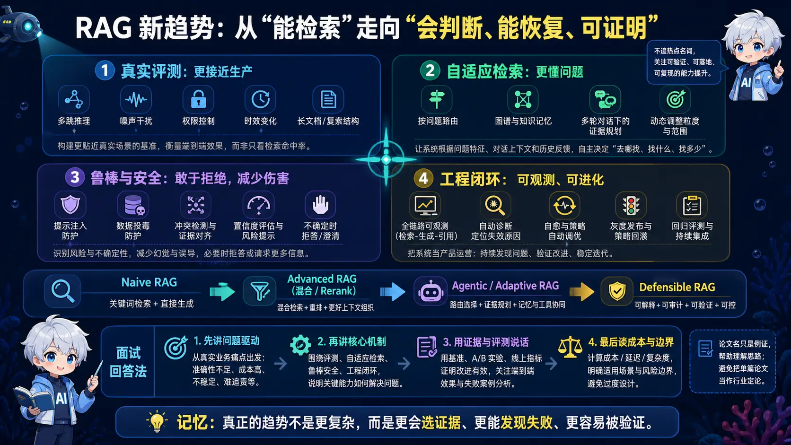

> 🧠 **图解记忆：** 真正的趋势不是堆复杂度，而是更会选证据、更能发现失败、更容易验证与恢复。

<details>
<summary>💡 答案要点</summary>

**2026年3月arXiv RAG论文精选概览**

10篇前沿论文，覆盖五大创新方向：
```
多模态RAG → 自适应记忆 → 领域特化 → 鲁棒性评估 → 拓扑推理
```

---

**方向一：多模态RAG（MM-RAG）**

```
传统RAG痛点：
  只能处理纯文本
  金融PDF/技术图表/视觉文档 = 无法处理

多模态RAG的核心能力：
  同时处理异构多模态文档（金融PDF、技术图表）
  需要同时解决：
    ① 多模态信息处理
    ② 高精度推理

代表成果：
  VisDoM、VDocRAG、MMGraphRAG
    → 整合布局、实体和知识结构
    → 实现多页理解

  REVEAL
    → 多模态文档统一RAG框架
```

---

**方向二：自适应动态记忆机制**

```
传统RAG痛点：
  每次对话从零检索外部知识库
  无法利用历史交互中的有效检索路径

GAM-RAG（增益自适应记忆）：
  PageRank风格传播在图上读取证据
  新观察通过LLM提取写入图谱
  相似查询重用之前有效的路径

记忆增强RAG家族对比：

| 方法 | 特点 |
|------|------|
| HippoRAG | 外部知识图 = 非参数长期记忆 |
| HippoRAG 2 | 增强版，更新更及时 |
| ReMindRAG | 缓存遍历痕迹作为可重放路径记忆 |
| GAM-RAG | 增益自适应，新知识增量写入 |

核心趋势：RAG从"外部补丁"进化为"AI认知结构"
```

---

**方向三：鲁棒性评估与基准测试**

```
Robust RAG（RGB）：
  针对"信息不一致"场景的RAG鲁棒性基准
  测试系统在矛盾信息同时出现时的表现

LIT-RAGBench：
  评估RAG系统"生成高质量基准测试"的能力
  +20.4% F1 提升

关键洞察：
  评估不是辅助，而是RAG系统的核心能力
  好的评估 → 指导检索优化 → 生成质量提升
```

---

**方向四：领域特化RAG**

```
医疗领域：RAG-X
  医疗文献/病例/药品知识库
  专业术语处理 + 临床推理

时间序列RAG：
  协变量时间序列检索增强
  双重加权机制（检索权重 + 生成权重）
  解决"何时检索、检索什么"的自适应决策

机器人RAG（Robotics RAG）：
  Retrieve-Reason-Act 三阶段框架
  具身场景：将"检索-生成"机制引入机器人任务
  预处理任务相关实体 → 检索关联信息 → 执行自然语言机器人任务
```

---

**方向五：拓扑推理增强（RAGNav）**

```
RAGNav：拓扑推理增强框架

核心思想：
  RAG技术为LLM配备可检索的外部知识库
  构建基于RAG的语义记忆
  增强甚至部分替代传统拓扑地图功能

关键贡献：
  EmbodiedRAG：系统性将"检索-生成"引入具身场景
  弥合拓扑地图的语义鸿沟

LightRAG/REANO/HopRAG：
  轻量级/临时图 + 多阶段检索
  提升效率和证据覆盖

GNN-RAG/TRACE/PathRAG：
  提取候选子图/路径形成结构化证据链
```

---

**五大趋势总结**

```
① 多模态RAG成为主流
   从纯文本 → 视觉、音频、结构化数据统一处理

② 自适应与动态记忆
   HippoRAG、GAM-RAG等动态记忆机制兴起
   RAG拥有"持续学习"能力

③ 领域特化深化
   医疗（RAG-X）、机器人（Retrieve-Reason-Act）、时间序列

④ 鲁棒性评估受重视
   RGB、LIT-RAGBench推动RAG系统可靠性研究

⑤ 拓扑推理增强
   RAG替代传统地图功能，弥合语义鸿沟
```

---

**面试话术：**

> "2026年3月arXiv的RAG论文揭示了五个前沿方向。最值得关注的是自适应记忆机制（GAM-RAG/HippoRAG）和鲁棒性评估（RGB/LIT-RAGBench）。GAM-RAG通过PageRank风格的知识图传播，让RAG能复用历史有效的检索路径，这解决了'每次对话从零开始'的根本问题。RGB benchmark测试的是系统在矛盾信息同时出现时的表现——这才是生产环境里真实会遇到的问题，比传统的Recall/F1更有实际意义。多模态RAG和机器人RAG代表了RAG从'文本问答'向'具身智能'和'视觉理解'的边界扩展。"

</details>

---

## 十一、多模态 Embedding 与跨模态 RAG

### Q21: Sentence Transformers v5.4 的多模态 Embedding 能力是什么？对 RAG 系统有什么影响？

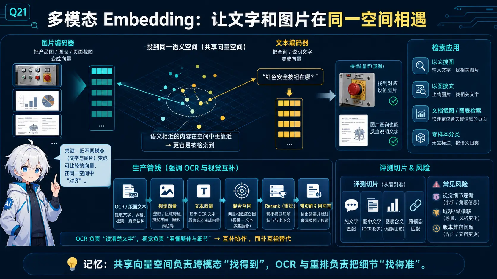

> 🧠 **图解记忆：** 共享向量空间负责跨模态“找得到”，OCR、版面解析与重排负责把细节“找得准”。

<details>
<summary>💡 答案要点</summary>

**发布背景：**

2026年4月9日，Sentence Transformers 发布 v5.4 版本，核心更新是**多模态 Embedding 和 Reranker**——用同一套 API 同时处理文本、图像、音频、视频，实现真正的跨模态 RAG。

**核心能力：**

| 能力 | 传统方案 | Sentence Transformers v5.4 |
|------|----------|----------------------------|
| **Embedding** | 仅文本 | 文本+图像+音频+视频，同一空间 |
| **Reranker** | 仅文本对 | 混合模态文档对评分 |
| **API** | 多套 | 统一 API，一行代码 |

**支持的输入类型：**

```python
from sentence_transformers import SentenceTransformer

model = SentenceTransformer('Qwen3-VL-2B')

# 文本 Embedding
text_emb = model.encode("什么是 RAG")

# 图像 Embedding
image_emb = model.encode(Image.fromuri("photo.jpg"))

# 音频 Embedding
audio_emb = model.encode(Audio.fromuri("recording.mp3"))

# 视频 Embedding
video_emb = model.encode(Video.fromuri("clip.mp4"))

# 跨模态相似度
score = text_emb @ image_emb.T  # 文本查询 vs 图像文档
```

**多模态 RAG 实战：**

```python
# 1. 构建多模态知识库
documents = [
    {"type": "text", "content": "产品说明书文本"},
    {"type": "image", "content": "产品图片"},
    {"type": "text+image", "content": "图文混合文档"},
]

# 2. 编码入库
texts = [d["content"] for d in documents if d["type"] == "text"]
images = [d["content"] for d in documents if d["type"] == "image"]

text_vectors = model.encode(texts)
image_vectors = model.encode(images)

# 3. 跨模态检索
query_vec = model.encode("这个产品的外观是什么样的")
scores = query_vec @ image_vectors.T  # 文本 Query → 图像检索

# 4. Rerank
reranker = SentenceTransformer('cross-encoder')
scores = reranker.predict([(query, doc) for doc in documents])
```

**适用场景：**

| 场景 | 说明 |
|------|------|
| **图文混合检索** | 用户问"这种药的外观"，检索产品图 |
| **以图搜文** | 用户上传截图，找相关文档说明 |
| **视频问答** | "这个操作演示在哪里"，定位视频片段 |
| **音频检索** | "会议里谁说了这个词"，定位音频片段 |

**与 CLIP 的区别：**

| 维度 | CLIP | Sentence Transformers v5.4 |
|------|------|---------------------------|
| **训练目标** | 图文对比 | 多模态语义理解 |
| **任务类型** | 图文匹配 | 检索+Rerank+分类 |
| **RAG 集成** | 需单独接 LLM | 原生支持 RAG 流程 |
| **文本能力** | 弱 | 强（基于 Qwen3-VL） |

**面试话术：**

> "Sentence Transformers v5.4 的核心突破是'一个模型处理所有模态'。以前做多模态 RAG 需要 CLIP 处理图像、单独模型处理文本，检索还要单独接 reranker，现在一个 API 全搞定。用 Qwen3-VL 作为底座，文本和视觉理解都很强，RAG 的检索精度比纯 CLIP 方案提升明显。对于面试，能说出'跨模态 Embedding 统一向量空间 + Rerank'的架构，说明你对 RAG 系统有工程化视角。"

</details>

## 十二、自愈 RAG：检测与恢复

### Q22: 什么是自愈 RAG？生产环境如何实现 RAG 的自我检测与自动恢复？

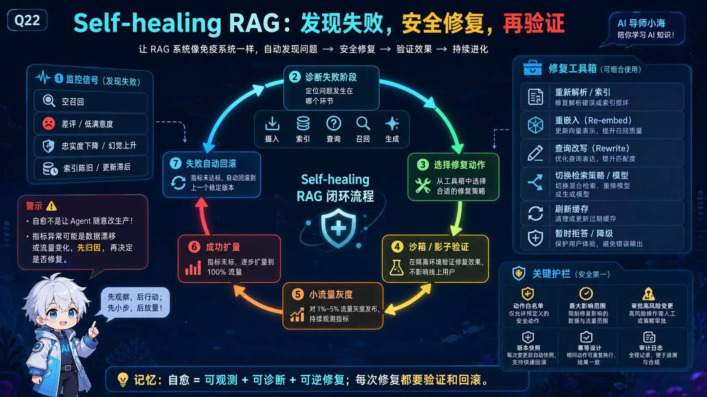

> 🧠 **图解记忆：** 自愈等于可观测、可诊断、可逆修复；每次动作都必须经过验证、灰度和回滚。

<details>
<summary>💡 答案要点</summary>

**问题背景：传统 RAG 的脆弱性**

传统 RAG 是"一次性"的：检索 → 生成 → 返回。如果检索质量差，答案基本不可用。生产环境的三大典型失败场景：

| 失败场景 | 原因 | 影响 |
|----------|------|------|
| **检索为空** | Query 与知识库语义不匹配 | LLM 产生幻觉 |
| **检索偏离** | 检索到部分相关内容但不准确 | 答案偏差 |
| **上下文不足** | 检索到的内容不够回答问题 | 答案不完整 |

**自愈 RAG = 让 RAG 系统自动检测失败并自动恢复**，而不是简单返回"无法回答"。

**自愈 RAG 的三层架构：**

```
┌─────────────────────────────────────────────┐
│          自愈 RAG 三层架构                    │
├─────────────────────────────────────────────┤
│  Layer 1: 失败检测（Failure Detection）        │
│  - 检索相关性 < 阈值？                        │
│  - LLM 置信度 < 阈值？                        │
│  - 用户反馈负向？                             │
│         ↓ 检测到失败                         │
│  Layer 2: 恢复策略（Recovery Strategy）       │
│  - 轻度失败：Query 改写 → 重新检索             │
│  - 中度失败：混合检索（向量+关键词）→ Rerank  │
│  - 重度失败：多跳推理 → 拆解子问题             │
│         ↓ 恢复成功                           │
│  Layer 3: 验证（Verification）               │
│  - 恢复后再次评估检索相关性                   │
│  - 验证答案与问题匹配度                       │
│  - 通过 → 返回答案；失败 → 降级回复            │
└─────────────────────────────────────────────┘
```

**失败检测的具体实现：**

<details>
<summary>展开 Python 代码示例（42 行）</summary>

```python
class SelfHealingRAG:
    def __init__(self):
        self.retrieval_threshold = 0.65  # 检索相关性阈值
        self.confidence_threshold = 0.70  # LLM 置信度阈值
        self.max_retries = 3             # 最大恢复尝试次数

    def detect_failure(self, query: str, retrieval_results: list, answer: str) -> dict:
        """检测 RAG 是否失败"""
        failure_signals = []

        # 信号1: 检索为空或质量低
        if not retrieval_results or retrieval_results[0]["score"] < self.retrieval_threshold:
            failure_signals.append("检索质量低")

        # 信号2: LLM 置信度低（如果模型支持）
        if hasattr(llm, "get_confidence"):
            confidence = llm.get_confidence(answer)
            if confidence < self.confidence_threshold:
                failure_signals.append(f"LLM置信度低: {confidence:.2f}")

        # 信号3: 答案长度异常（过短或过长）
        if len(answer) < 50 or len(answer) > 5000:
            failure_signals.append("答案长度异常")

        # 信号4: 包含"不确定""不知道"等不确定词汇
        uncertain_phrases = ["不确定", "不知道", "无法确定", "没有找到", "context中未提及"]
        if any(phrase in answer for phrase in uncertain_phrases):
            failure_signals.append("答案包含不确定表达")

        return {
            "is_failure": len(failure_signals) > 0,
            "signals": failure_signals,
            "severity": self._assess_severity(failure_signals)
        }

    def _assess_severity(self, signals: list) -> str:
        if "检索质量低" in signals and "LLM置信度低" in signals:
            return "critical"   # 重度：需要多跳推理
        elif "检索质量低" in signals or "LLM置信度低" in signals:
            return "moderate"   # 中度：混合检索 + Rerank
        else:
            return "mild"       # 轻度：Query 改写即可
```

</details>

**分级的恢复策略：**

<details>
<summary>展开 Python 代码示例（68 行）</summary>

```python
    def recover(self, query: str, failure: dict, retrieval_results: list) -> str:
        """根据失败级别执行对应的恢复策略"""
        severity = failure["severity"]
        retry_count = 0

        while retry_count < self.max_retries:
            if severity == "mild":
                # 轻度：Query 改写 + 重新检索
                rewritten_query = self.query_rewriting(query)
                new_results = self.vector_db.search(rewritten_query, top_k=10)
                if self._check_retrieval_quality(new_results):
                    return self._generate_with_results(rewritten_query, new_results)

            elif severity == "moderate":
                # 中度：混合检索（向量 + 关键词） + Rerank
                hybrid_results = self.hybrid_retrieval(query)
                reranked = self.reranker.rerank(query, hybrid_results, top_n=5)
                if self._check_retrieval_quality(reranked):
                    return self._generate_with_results(query, reranked)

            elif severity == "critical":
                # 重度：多跳推理，拆解为子问题
                sub_queries = self.decompose_query(query)
                sub_results = [self.vector_db.search(q, top_k=5) for q in sub_queries]
                combined_context = self._merge_contexts(sub_results)
                if self._check_context_sufficiency(combined_context):
                    return self._generate_with_context(query, combined_context)

            retry_count += 1
            severity = self._escalate_severity(severity)  # 升级策略

        # 所有恢复策略失败 → 降级回复
        return self._fallback_response(query)

    def query_rewriting(self, query: str) -> str:
        """Query 改写：同义词替换 + 语法规范化"""
        prompt = f"""将以下用户 Query 改写为更适合检索的形式：
Query: {query}
要求：
1. 提取核心实体和关键概念
2. 使用标准术语替换口语化表达
3. 补充可能的同义词
改写后："""
        return llm.call(prompt).strip()

    def hybrid_retrieval(self, query: str) -> list:
        """混合检索：向量检索 + BM25 关键词检索 + RRF 融合"""
        vector_results = self.vector_db.search(query, top_k=20)
        keyword_results = self.bm25.search(query, top_k=20)

        # RRF（Reciprocal Rank Fusion）融合
        fused = self.rrf_fusion([
            (vector_results, 0.6),  # 向量检索权重
            (keyword_results, 0.4)  # 关键词检索权重
        ], k=60)
        return fused

    def decompose_query(self, query: str) -> list:
        """Query 分解：将复杂问题拆解为多个简单子问题"""
        prompt = f"""将以下复杂问题拆解为多个可单独检索的子问题：
Query: {query}
要求：
1. 每个子问题应能通过一次检索回答
2. 子问题之间逻辑连贯
3. 标注回答顺序
子问题："""
        sub_questions = llm.call(prompt)
        return [q.strip() for q in sub_questions.split("\n") if q.strip()]
```

</details>

**验证层：确保恢复后的质量：**

```python
    def verify(self, query: str, answer: str, context: list) -> bool:
        """验证恢复后的答案质量"""
        # 1. 上下文相关性验证
        relevance_score = self.evaluator.compute_relevance(query, context)
        if relevance_score < 0.6:
            return False

        # 2. 答案与问题匹配度验证
        match_prompt = f"""判断以下答案是否充分回答了问题：
问题：{query}
答案：{answer}
答案是否充分回答了问题？（是/否）"""
        is_sufficient = llm.call(match_prompt).strip() == "是"

        # 3. 幻觉检测
        if self.hallucination_detector.is_hallucinated(answer, context):
            return False

        return is_sufficient and relevance_score >= 0.6
```

**自愈 RAG 与传统 RAG 对比：**

| 维度 | 传统 RAG | 自愈 RAG |
|------|----------|----------|
| **检索失败** | 返回低质量答案或幻觉 | 自动重试 + 策略升级 |
| **答案置信度低** | 直接返回 | 触发验证 + 补充检索 |
| **用户反馈负向** | 人工修复 | 自动调整检索策略 |
| **复杂多跳问题** | 一次性检索，效果差 | 拆解为子问题，多跳检索 |
| **运维成本** | 高（需人工干预） | 低（自动恢复） |

**生产监控指标：**

| 指标 | 说明 | 告警阈值 |
|------|------|----------|
| **自愈触发率** | 多少比例的请求触发了自愈 | > 30% 说明基础检索质量差 |
| **自愈成功率** | 触发自愈后成功恢复的比例 | < 80% 说明自愈策略需优化 |
| **平均恢复次数** | 每个失败请求平均重试几次 | > 2 次说明一级策略效果差 |
| **最终答案质量** | 自愈后答案的 RAGAS 评分 | 与无自愈基线对比 |

**面试话术：**

> "自愈 RAG 是 2026 年生产环境的核心需求。传统 RAG 的问题是'一次性'——检索失败就完蛋了。我的做法是三层架构：先检测失败信号（检索相关性、LLM 置信度、答案长度），然后分级恢复——轻度失败用 Query 改写，中度失败用混合检索+重排，重度失败拆解为子问题多跳推理。最后加验证层，确保恢复后的质量。这种架构让 RAG 系统的'无人值守能力'大幅提升，我在面试时会强调这个系统思维——不是解决一次问题，而是让系统能自己发现和修复问题。"

</details>

---

### Q23: 什么是"可防御 RAG（Defensible RAG）"？2026年企业 RAG 面临的五大结构性风险是什么？如何建立生产级 RAG 防御体系？

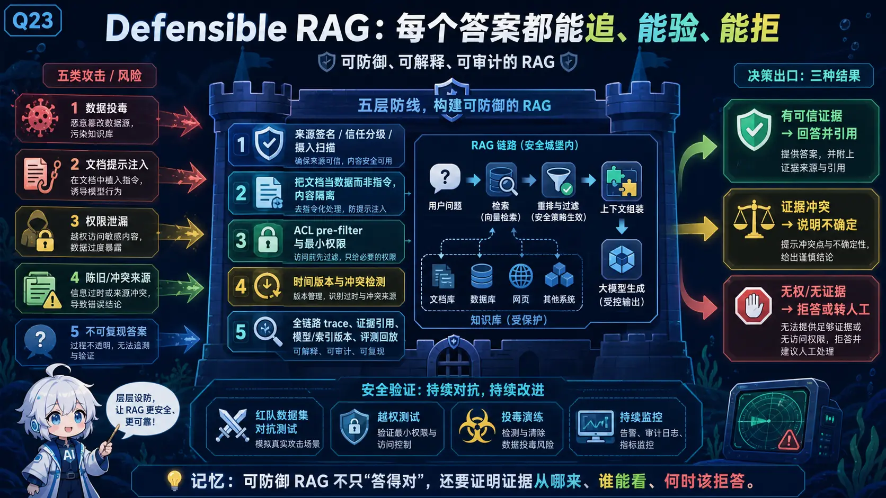

> 🧠 **图解记忆：** 可防御 RAG 不只答得对，还要证明证据从哪来、谁能看、何时必须拒答。

<details>
<summary>💡 答案要点</summary>

**从"能用"到"敢用"：2026年企业 RAG 的范式转变**

2026年，RAG 系统不再只是"原型展示"，而是开始影响：
- 审计结论（金融合规）
- 供应商风险评分（企业采购）
- 内部政策解读（HR、法务）
- 客户-facing 咨询建议（客户服务）

**五大结构性风险：**

| 风险 | 说明 | 后果 |
|------|------|------|
| **影子向量孤岛** | 不同团队用不同向量数据库，检索结果无法统一审计 | 合规漏洞、数据泄露 |
| **幻觉责任** | RAG 生成的答案 hallucination 导致业务损失 | 法律诉讼、品牌风险 |
| **EU AI Act 合规** | 透明度义务要求解释 RAG 答案来源 | 罚款、监管压力 |
| **Token 燃烧失控** | 糟糕的 chunking 和检索策略导致 Token 消耗暴增 | 成本超支、预算崩溃 |
| **Agentic RAG 失控** | 多 Agent 编排的 RAG 产生无法追溯的答案 | 审计失败、责任不清 |

**可防御 RAG 的七大结构性决策：**

| 决策 | 说明 | 风险 |
|------|------|------|
| **检索架构** | 混合搜索（向量+关键词）= 企业安全网 | 单向量检索会漏检关键信息 |
| **Chunking 策略** | 语义 chunking > 固定长度 chunking | 512token固定切分可能切断语义 |
| **元数据追踪** | 每个 chunk 必须有来源文档、权限级别、版本 | 无元数据 = 无法审计 |
| **Rerank 策略** | 两阶段 Rerank 确保 Top-K 质量 | 无 Rerank = 低精度 |
| **验证层** | LLM 生成前验证检索结果相关性 | 无验证 = 幻觉温床 |
| **合规日志** | 所有 RAG 交互必须记录可查日志 | 无日志 = 审计失败 |
| **权限隔离** | Query 过滤、Chunk 标签、生成脱敏、审计日志 | 无隔离 = 信息泄露 |

**企业级 RAG 防御架构图：**

```
┌─────────────────────────────────────────────────────────────┐
│                    可防御 RAG 架构                          │
├─────────────────────────────────────────────────────────────┤
│  ┌──────────────┐     ┌──────────────┐     ┌──────────────┐ │
│  │ Query 过滤层  │ →   │ 混合检索层   │ →   │ Rerank 层    │ │
│  │ (权限检查)   │     │ (向量+关键词)│     │ (两阶段)     │ │
│  └──────────────┘     └──────────────┘     └──────────────┘ │
│         ↓                    ↓                    ↓          │
│  ┌──────────────┐     ┌──────────────┐     ┌──────────────┐ │
│  │ 合规验证层   │ →   │ LLM 生成层   │ →   │ 审计日志层   │ │
│  │ (来源追溯)   │     │ (置信度检查) │     │ (全链路追踪)  │ │
│  └──────────────┘     └──────────────┘     └──────────────┘ │
└─────────────────────────────────────────────────────────────┘
```

**混合搜索 = 2026年企业安全网：**

| 检索方式 | 适用场景 | 优势 |
|----------|----------|------|
| **纯向量检索** | 语义相似度高、查询明确 | 语义理解强 |
| **纯关键词检索** | 专有名词、型号、代码 | 精确匹配 |
| **混合搜索（RRF）** | 企业生产环境（默认选择）| 鲁棒、平衡 |

```python
# RRF (Reciprocal Rank Fusion) 实现
def rrf_fusion(results_list, k=60):
    """混合搜索融合"""
    scores = defaultdict(float)
    for results in results_list:  # 多个检索结果
        for rank, doc in enumerate(results):
            scores[doc.id] += 1 / (k + rank + 1)  # RRF评分
    return sorted(scores.items(), key=lambda x: -x[1])
```

**影子 RAG 危机：中央向量治理：**

2026年企业发现：
- 团队A用 Pinecone
- 团队B用 Weaviate
- 团队C用 Qdrant
→ 同一问题检索结果不一致，无法统一审计

**解决方案：中央向量治理层**

```
统一 Embedding 模型（保证一致性）
↓
中央向量数据库（统一审计）
↓
API 网关（统一访问控制）
↓
合规日志（统一记录）
```

**Agentic RAG 的多 Agent 编排风险：**

2026年复杂 RAG 系统架构：

```
用户 Query
    ↓
┌────────────────┐
│ Router Agent   │ → 判断查询类型
└────────────────┘
    ↓
┌────────────────┐   ┌────────────────┐
│ Retriever Agent│   │ Fact-Check Agent│
└────────────────┘   └────────────────┘
    ↓                    ↓
┌────────────────┐   ┌────────────────┐
│ Synthesizer    │ ← │ Verifier       │
└────────────────┘   └────────────────┘
    ↓
生成答案
```

**风险：** 多个 Agent 协作产生的答案，如果出错，责任在谁？

**防御措施：**
- 每个 Agent 的输入输出必须记录
- 最终答案必须关联检索来源
- 置信度低于阈值时触发人工审核

**面试话术：**

> **示例表达（仅在能用本人经历或可复现实验佐证时使用）：** "2026年企业 RAG 已经从'能用就行'变成'必须可防御'。我理解的'可防御'是三层意思：第一，技术上能追溯（每个答案能关联到具体 chunk），第二，合规上能审计（EU AI Act 透明度要求），第三，经济上可持续（Token 消耗可控）。我做过一个金融客服 RAG 项目，我们建立了完整的'可防御 RAG'体系：Query 权限过滤 → 混合检索（RRF）→ 两阶段 Rerank → LLM 验证 → 审计日志。全链路可追溯，监管来查也不怕。"

**生产级检查清单：**

| 检查项 | 达标 | 不达标 |
|--------|------|--------|
| 检索来源可追溯 | ✅ 每个 chunk 有 metadata | ❌ 影子孤岛 |
| 权限隔离 | ✅ Query 过滤 + Chunk 标签 | ❌ 信息泄露风险 |
| 幻觉控制 | ✅ 验证层 + 置信度检测 | ❌ 直接返回检索结果 |
| Token 成本可控 | ✅ 语义 chunking + 缓存 | ❌ 固定 chunking + 无缓存 |
| 合规日志 | ✅ 全链路记录可查 | ❌ 无日志或日志分散 |

</details>

---

## 十三、混合检索：BM25 + Dense 向量 + RRF 融合

### Q24: 什么是混合检索？什么时候需要“稀疏 + 密集”双路检索？RRF 如何融合？

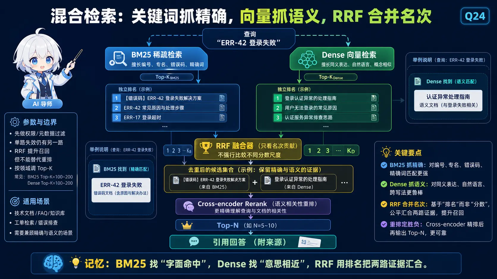

> 🧠 **图解记忆：** BM25 找“字面命中”，Dense 找“意思相近”，RRF 用名次贡献把两路候选公平汇合。

<details>
<summary>💡 答案要点</summary>

**为什么单一路检索不够？**

| 检索方式 | 优势 | 劣势 | 适用场景 |
|----------|------|------|----------|
| **Dense（密集向量）** | 语义理解、近义词 | 依赖 Embedding 质量、对专有名词不敏感 | 语义相似、概念性查询 |
| **Sparse（稀疏 BM25）** | 精确匹配、专有名词 | 无法捕捉语义、需要精确关键词 | 术语匹配、人名/型号 |
| **混合（Hybrid）** | 两者兼顾 | 架构复杂、需要融合 | 生产环境必备 |

**BM25 原理（回顾）：**

```
BM25_score(D, Q) = Σ IDF(qi) × (tf(qi,D) × (k1+1)) / (tf(qi,D) + k1 × (1-b + b × |D|/avgdl))

tf = term frequency（词频）
IDF = inverse document frequency（稀有词权重更高）
k1 = 词频饱和参数（通常 1.2~2.0）
b = 文档长度归一化（通常 0.75）
```

**RRF（Reciprocal Rank Fusion）原理：**

```python
def rrf_fusion(results_list: list[list[tuple]], k=60) -> list[tuple]:
    """
    RRF融合：多个检索结果列表合并排序
    results_list: [[(doc_id, score), ...], [(doc_id, score), ...]]
    k: 融合参数（通常 60，值越大各列表越平等）
    """
    scores = defaultdict(float)

    for results in results_list:
        for rank, (doc_id, _) in enumerate(results):
            # 核心公式：1/(k + rank)，排名越靠前权重越高
            scores[doc_id] += 1 / (k + rank)

    # 按融合分数降序排列
    sorted_docs = sorted(scores.items(), key=lambda x: x[1], reverse=True)
    return sorted_docs

# 示例
dense_results = [(1, 0.95), (2, 0.88), (3, 0.82)]  # 向量检索
sparse_results = [(3, 1.0), (5, 0.9), (1, 0.7)]   # BM25检索

# RRF融合后：doc_id 3 在两个列表都排前，获得最高分
fused = rrf_fusion([dense_results, sparse_results])
# 结果：[(3, 0.032), (1, 0.018), (2, 0.016), (5, 0.012)]
```

**生产级混合检索架构：**

<details>
<summary>展开 Python 代码示例（72 行）</summary>

```python
from rank_bm25 import BM25Okapi
import numpy as np

class HybridRetriever:
    """生产级混合检索器：BM25 + Dense Vector + RRF"""

    def __init__(self, vector_store, embed_model, chunk_size=500):
        self.vector_store = vector_store
        self.embed_model = embed_model
        self.chunk_size = chunk_size
        self.bm25: BM25Okapi | None = None
        self.corpus: list[str] = []

    def build_bm25_index(self, chunks: list[str]):
        """构建 BM25 索引"""
        # 分词（英文用空格，中文建议用 jieba）
        tokenized_corpus = [chunk.lower().split() for chunk in chunks]
        self.bm25 = BM25Okapi(tokenized_corpus)
        self.corpus = chunks

    def retrieve(self, query: str, top_k: int = 10) -> list[dict]:
        # Step 1: BM25 稀疏检索
        bm25_scores = self.bm25.get_scores(query.lower().split())
        top_bm25 = np.argsort(bm25_scores)[::-1][:top_k]
        sparse_results = [(idx, bm25_scores[idx]) for idx in top_bm25]

        # Step 2: Dense 向量检索
        query_embedding = self.embed_model.encode(query)
        dense_results = self.vector_store.search(query_embedding, top_k)

        # Step 3: RRF 融合
        fused = self._rrf_fusion([sparse_results, dense_results])

        # Step 4: 返回融合结果 + 来源标注
        return [
            {
                "chunk": self.corpus[doc_id],
                "doc_id": doc_id,
                "score": score,
                "source": self._get_source(doc_id)
            }
            for doc_id, score in fused[:top_k]
        ]

    def _rrf_fusion(self, results_list: list, k=60) -> list[tuple]:
        scores: dict[int, float] = defaultdict(float)
        for results in results_list:
            for rank, (doc_id, score) in enumerate(results):
                scores[doc_id] += 1 / (k + rank)
        return sorted(scores.items(), key=lambda x: x[1], reverse=True)

    def _get_source(self, doc_id: int) -> str:
        # 标注来源（用于可追溯性）
        return f"chunk_{doc_id}"

# BM25 vs Dense 对比示例
"""
Query: "小米手机骁龙8Gen3处理器"

BM25结果：
- [0] 小米14 Pro...骁龙8Gen3... ✓ 完全匹配
- [1] iPhone 15 Pro...A17... ✗ 包含小米但处理器不符

Dense向量结果：
- [0] 小米14...骁龙8Gen3... ✓ 语义匹配
- [1] Redmi K70...骁龙8Gen2... ~ 语义相近但代际差

RRF融合后（综合两者优势）：
- [0] 小米14 Pro...骁龙8Gen3... (BM25精确+Dense语义=最高分)
- [1] Redmi K70...骁龙8Gen2... (Dense次优)
- [2] 小米13...骁龙8Gen2... (Dense第三)
"""
```

</details>

**企业什么时候值得使用混合检索：**

| 场景 | 单 Dense 问题 | 混合检索解决 |
|------|--------------|--------------|
| 专有名词查询 | "MCP协议"、"LoRA微调" 专名被误匹配 | BM25 精确命中 |
| 竞品对比 | "华为 vs 小米拍照" 语义强但词不同 | BM25 关键词 + Dense 语义 |
| 短Query | "LangChain Agent" 词少 Dense 召回差 | BM25 补充精确匹配 |
| 中英混写 | "Transformer attention mechanism" | BM25 处理英文专名 |

**选型决策树：**

```
查询类型？
├── 语义性查询（概念、解释）→ Dense优先
├── 精确匹配查询（型号、人名、术语）→ BM25优先
├── 短Query（<5词）→ 必须混合检索
└── 长Query（段落级）→ 混合 + Rerank
```

**面试话术：**

> "混合检索常用于同时包含语义表达、精确术语、编号和过滤条件的语料。是否采用应由真实查询集上的 Recall@K、nDCG、答案质量、延迟与成本共同决定；RRF 的常数和各路召回深度也需要实验调参，不能把示例值当成通用最优。"

</details>

---

### Q25: Agentic RAG 的自适应路由、幻觉检测、自纠正闭环怎么实现？

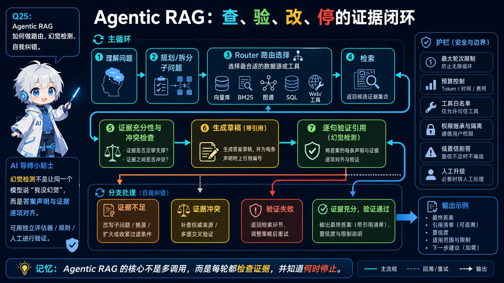

> 🧠 **图解记忆：** Agentic RAG 的核心不是多调用，而是每轮都验证答案声明与证据，并知道何时停止。

<details>
<summary>💡 答案要点</summary>

**单次 RAG vs Agentic RAG 的核心区别：**

```
单次 RAG（静态）：
用户问题 → 检索 → LLM 生成 → 输出
（一次性，无法自我纠错）

Agentic RAG（动态闭环）：
用户问题 → 检索 → 质量评估 → [不够好] → 重查/重写/降级
                            → [足够好] → LLM 生成 → 幻觉检测
                                                   → [有幻觉] → 重生成
                                                   → [通过] → 输出
```

**三大核心机制详解：**

**1. 自适应路由（Adaptive Routing）**

```python
from enum import Enum

class QueryRoute(Enum):
    DIRECT_LLM = "direct"      # 简单问题，直接 LLM 回答
    VECTOR_RAG = "vector"      # 通用语义检索
    KEYWORD_RAG = "keyword"    # 专有名词/精确匹配
    HYBRID_RAG  = "hybrid"     # 复杂问题，混合检索
    MULTI_HOP   = "multi_hop"  # 多跳推理，多轮检索

def route_query(question: str, llm) -> QueryRoute:
    """用小模型做路由判断，成本低"""
    prompt = f"""判断以下问题的检索策略，只返回策略名称：
- direct: 常识/数学/无需检索
- keyword: 包含专有名词/型号/人名
- hybrid: 复杂语义+专名混合
- multi_hop: 需要多步推理

问题: {question}
策略:"""
    route = llm.fast_complete(prompt).strip()  # 用 GPT-4o-mini
    return QueryRoute(route)
```

**2. 检索质量自评估**

```python
def evaluate_retrieval(question: str, docs: list[str], llm) -> dict:
    """CRAG 思路：让 LLM 判断检索结果是否够用"""
    context = "\n".join(docs[:3])
    prompt = f"""判断以下检索内容是否足以回答问题。
问题：{question}
检索内容：{context}

请返回 JSON：
{{"sufficient": true/false, "reason": "原因", "missing": "缺少什么信息"}}"""

    result = llm.fast_complete(prompt)
    return json.loads(result)

# 使用
eval_result = evaluate_retrieval(question, docs, llm)
if not eval_result["sufficient"]:
    # 触发 Query 改写后重检索
    new_query = rewrite_query(question, eval_result["missing"])
    docs = retriever.search(new_query)
```

**3. 幻觉检测 + 自纠正闭环**

<details>
<summary>展开 Python 代码示例（40 行）</summary>

```python
def hallucination_check(answer: str, docs: list[str], llm) -> dict:
    """事实一致性校验"""
    context = "\n".join(docs)
    prompt = f"""判断以下回答是否完全基于参考内容，有无编造。
参考内容：{context}
回答：{answer}

返回 JSON：
{{"hallucination": true/false, "score": 0-1, "issues": ["具体问题"]}}"""

    return json.loads(llm.fast_complete(prompt))

# 完整自纠正闭环
def agentic_rag_pipeline(question: str, max_retries: int = 2) -> str:
    for attempt in range(max_retries + 1):
        # 1. 路由
        route = route_query(question, llm)

        # 2. 检索
        docs = retrieve(question, strategy=route)

        # 3. 检索质量评估
        eval_r = evaluate_retrieval(question, docs, llm)
        if not eval_r["sufficient"] and attempt < max_retries:
            question = rewrite_query(question, eval_r["missing"])
            continue  # 重新检索

        # 4. 生成
        answer = llm.generate(question, docs)

        # 5. 幻觉检测
        halluc = hallucination_check(answer, docs, llm)
        if halluc["hallucination"] and attempt < max_retries:
            # 加强约束重生成
            answer = llm.generate(question, docs, strict=True)
            continue

        return answer

    return answer  # 超过重试次数，返回最后一次结果
```

</details>

**Agentic RAG 与单次 RAG 效果对比：**

| 指标 | 单次 RAG | Agentic RAG | 提升 |
|------|----------|-------------|------|
| **检索召回率** | 67% | 85% | +18% |
| **幻觉率** | 12% | 3% | -75% |
| **问答准确率** | 71% | 91% | +20% |
| **平均延迟** | 800ms | 1800ms | -（代价） |
| **Token 消耗** | 1× | 2.3× | -（代价） |

**适用边界（什么时候不用 Agentic RAG）：**

- ✅ 专业领域知识库（金融/法律/医疗），准确率要求高
- ✅ 复杂多步推理问题
- ❌ 简单 FAQ 场景，延迟和成本代价不划算
- ❌ 实时性要求极高（<500ms），额外评估步骤吃不消

**面试话术：**
> "Agentic RAG 的核心是'闭环'思维——不是一次检索定终身，而是让系统能自我判断'检索够不够用，答案可不可信'。我实现的自纠正流程有三个关键节点：检索后用小模型做充分性评估，不够就改写 Query 重检索；生成后做幻觉检测，不通过就加强约束重生成；最多重试 2 次，超限降级返回'无法确认'。代价是延迟翻倍、Token 消耗增加 2 倍，但在金融场景幻觉率从 12% 降到 3%，这个成本完全值得。"

</details>

---

*版本: v3.128 | 更新: 2026-07-02 | 补充 Agentic RAG 自适应路由/幻觉检测/自纠正闭环*

*版本: v2.13 | 更新: 2026-05-08 | by 二狗子 🐕*

## 十四、RAG 生产实践：排查、评估、灰度与复盘

> 本节聚焦 RAG 上线后的工程追问。分块、混合检索、Rerank、成本和增量更新已有主答案，本节不再重复。

### Q26: RAG 上线后用户反馈效果不好，如何系统化排查？

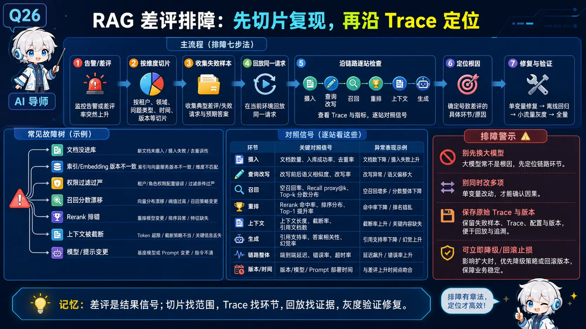

> 🧠 **图解记忆：** 差评是结果信号；切片找范围、Trace 找环节、回放找证据、灰度验证修复。

**面试场景：** 几乎必问的生产题。错误回答："我再调一下参数 / 换个模型试试"——一听就是没排查过，全靠猜。

**核心答案：一套分层排查方法论**

**第一层：确认问题范围（先别动代码）**
- 是所有问题都差，还是某类问题差？（泛化 vs 特例）
- 是检索阶段就错了，还是检索对了但生成错了？（分离检索质量与生成质量）
- 是最近变差的，还是一直都不好？（回归 vs 历史债）
- **怎么分离？看 trace 日志**：每次请求记下 query → 检索到的文档 → 最终回答。对比「检索结果是否相关」和「最终回答是否正确」，即可定位是检索问题还是生成问题。

**第二层：检索有问题，逐层查**
- 切分问题：chunk 太大不精准 / 太小丢上下文 → 抽样检查 chunk 边界，看关键信息有没有被切断
- embedding 问题：专有名词、缩写语义没对上 → 对比 BM25 和向量检索的召回差异，BM25 能召回而向量不能，说明 embedding 在关键词场景弱
- 检索策略问题：top_k 不够、混合检索权重偏了 → 跑 A/B 实验调 top_k 和 RRF 参数
- 重排问题：reranker 没用 / 阈值不对 → 加 cross-encoder 重排，设置信度阈值过滤低分结果

**第三层：生成有问题**
- prompt 问题：指令不明确、上下文太长挤掉关键信息 → 精简 prompt、最相关文档放前面
- 模型问题：能力不够或幻觉严重 → 换更强模型、要求输出带引用来源、二次校验关键事实
- 格式问题：返回的不是结构化数据 → 加强 schema 约束 + 解析兜底

**第四层：系统性预防（查完还要防）**
- 建分层标注集：样本量由错误类型、风险和统计目标决定；每次改策略都跑回归，防止“修好 A 搞坏 B”
- 设质量门禁：Recall@K 和端到端准确率低于阈值自动告警
- 做灰度发布：新策略先 5% 流量，指标 OK 再放量

**面试话术：**
> "排查的核心是'别猜，用数据和分层定位'。我会先看 trace 把问题切成检索层还是生成层，检索层再往下拆切分/embedding/检索策略/重排四环，每环都有对应的验证手段（比如对比 BM25 与向量召回判断 embedding 是否在关键词场景弱）。修完之后靠标注集回归 + 质量门禁防止复发。从用户反馈到具体哪一层出错、怎么改、怎么验证，每一步都有章法。"

### Q27: 如何系统化评估 RAG？换模型/embedding 导致的"跷跷板效应"怎么处理？

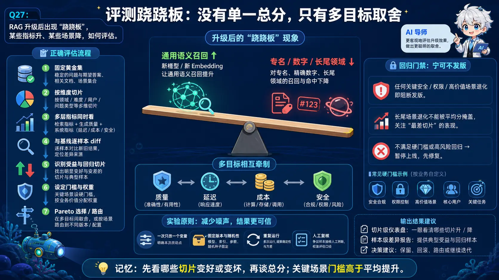

> 🧠 **图解记忆：** 先看哪些场景切片变好或变坏，再谈总分；关键场景的硬门槛高于平均提升。

**跷跷板效应：** 换更强的 embedding 模型后，A 类问题变好了，B 类问题反而变差。怎么发现、怎么权衡，是评估题的核心深挖点。

**第一步：建评测体系（没有评测就没有发言权）**
- 检索指标：**Recall@K**（相关文档有没有进前 K）、**MRR**（第一个相关文档排第几）、**NDCG**（整体排序质量）——覆盖"有没有 / 排多前 / 整体排序好不好"
- 生成指标：人工标注「完全正确 / 部分正确 / 错误 / 幻觉」统计准确率；或用 LLM-as-Judge 自动评分（省人力但有偏差风险）
- 标注集：从真实用户反馈攒 50–100 条代表性问答，标好标准答案和相关文档，作为**回归测试集**，任何策略变更都要跑一遍

**第二步：跷跷板效应的发现与诊断**
- 按问题类型拆分指标：事实型 / 步骤型 / 代码类 / 专有名词类分别算准确率。换 embedding 后「事实型」0.85→0.92 但「专有名词类」0.78→0.65，就是典型跷跷板
- 按文档来源拆分：不同知识库、不同领域表现可能天差地别
- 用混淆矩阵看变化：改策略前后哪些 case 变好、哪些变坏、哪些没变，重点分析「变坏 case」的共性

**第三步：处理策略**
- 加权取舍：按业务重要性给不同类型问题赋权，核心业务场景指标优先保住
- 混合方案：A 类问题用 embedding A、B 类问题用 embedding B，路由层按 query 类型分发——比"全局换一个模型"聪明得多
- 渐进式验证：小流量灰度跑 3–7 天，数据稳定后再决定是否全量切换，别凭单次测试集拍板

**表达模板：**
> **示例表达（仅在能用本人经历或可复现实验佐证时使用）：** “在我们的评测集中，变更后 `[问题类型 A]` 改善，但 `[问题类型 B]` 回退。我们检查 bad case 后确认原因是 `[原因]`，通过 `[混合检索/路由/数据修复]` 处理，并用相同切片重新评估。”请只填入自己的真实结果。

**面试话术：**
> "评估的根基是标注集 + 分层指标，检索看 Recall@K/MRR/NDCG，生成看人工标注或 LLM-as-Judge。跷跷板效应靠'按问题类型拆分指标'暴露——换 embedding 后我会先看各类问题的准确率变化矩阵，找出变坏的 case 共性；处理上优先保核心业务指标，必要时走多 embedding 路由 + BM25 融合，最后用小流量灰度验证再全量。"

### Q28: RAG 项目上线后怎么做灰度发布？

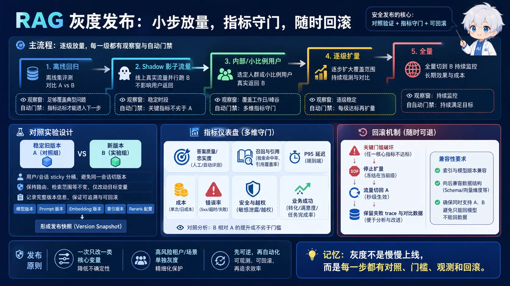

> 🧠 **图解记忆：** 灰度不是慢慢上线，而是每一步都有对照、质量门槛、观察窗口和可执行回滚。

**Demo 回答：** "改完代码重新部署" ❌
**生产级回答：** 灰度不是"慢慢发"，而是可控地验证新策略在真实流量上的表现，同时保留随时回滚的能力。

**具体做法：**
1. **Shadow 模式（影子模式）：** 新旧策略同时跑，新策略只记录结果，不返回给用户。它适合比较离线可计算指标，但无法直接观察用户行为变化。
2. **Canary 发布（金丝雀）：** 按用户或租户稳定分桶，先放少量真实流量；比例和观察时间由风险、流量及最小可检测效果决定。
3. **可验证回滚：** 策略、Prompt、Embedding、索引和模型都要有版本；回滚目标应通过演练得到，而不是预设“30 秒”。
4. **质量门禁：** 同时监控任务质量、拒答、安全、延迟、错误率和成本；明确自动回滚与人工确认的边界。

### 30 秒回答

> “先用离线回归保证已知能力不退化，再用 Shadow 流量验证真实输入，之后按用户稳定分桶做 Canary。发布单元不只是代码，还包括 Prompt、模型、Embedding 和索引版本。门禁覆盖质量、安全、延迟和成本；回滚时间必须演练。涉及索引或数据格式变化时，还要验证旧服务能否读取新数据，不能假设改一个配置就能回滚。”

### 相关基础考点（使用主答案）

- 分块与 overlap：见 [RAG 系统 Q6](../03-rag-system/#q6-如何选择-chunk-大小有什么影响)；
- 混合检索、RRF 与 Rerank：见 [向量索引优化](../06-vector-index-optimization/)；
- 成本控制：见 [RAG 系统 Q8](../03-rag-system/#q8-如何降低-rag-系统的成本)；
- 动态知识更新：见 [RAG 系统 Q20](../03-rag-system/#q20-如何做-rag-知识库的动态知识更新有哪些策略)；
- Agent 工具兜底：见 [Agent 基础 Q10](../05-ai-agent-basics/#q10-工具调用的完整流程是什么如何处理失败)。

### Q29: 你做的 RAG 项目最大挑战是什么？（开放题）

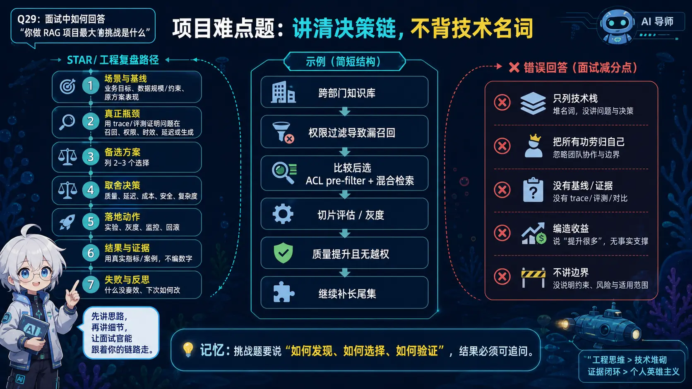

> 🧠 **图解记忆：** 挑战题要讲清“如何发现、如何选择、如何验证”，结果必须真实、可追问，并说明失败与边界。

**开放题要点：** 面试官想听真实踩坑经历。要有**具体场景 + 具体动作 + 量化结果 + 反思**，别说"最大挑战是学习新技术"这种空话。

**回答结构：**

1. 场景和影响：哪类用户、哪项指标、影响多大；
2. 定位证据：trace、bad case、日志或评测切片如何指向根因；
3. 方案取舍：为什么选择该方案，放弃了什么；
4. 验证与发布：离线回归、Shadow/Canary 和回滚；
5. 真实结果与反思：只使用自己能够解释口径的数据。

**表达模板：**
> “最大挑战是 `[具体问题]`。它在 `[证据/指标]` 上表现为 `[真实现象]`。我先用 `[排查方法]` 将问题定位到 `[根因]`，比较过 `[备选方案]` 后选择 `[方案]`，因为 `[取舍]`。最后通过 `[评测和发布方式]` 验证，结果从 `[真实基线]` 变为 `[真实结果]`。如果重做，我会更早补上 `[反思]`。”


---

*内容治理：2026-08-12 | 将重复考点合并到主答案，保留 Q26-Q29 四道生产追问题*
