# 📌 Python 工程基础

> **面试优先顺序（通用 AI 应用开发岗位）**：Q1、Q2、Q3、Q4、Q5、Q6、Q8、Q9、Q10、Q11、Q12。其余题目用于进阶或特定岗位拓展；实际频率会随岗位和面试轮次变化，产品版本资讯不应当作通用必考题。

> 面向 AI 应用后端常见的 Python 并发、数据校验、测试、可靠性和性能诊断问题。

## 📋 目录

1. [asyncio / async-await 最佳实践](#q1)
2. [Pydantic v2 与结构化输出](#q2)
3. [LLM 重试与指数退避](#q3)
4. [FastAPI SSE 与 WebSocket](#q4)
5. [GIL 与多进程](#q5)
6. [pytest + Mock 测试](#q6)
7. [内存管理与 OOM 排查](#q7)
8. [批量并发调用 LLM API](#q8)
9. [asyncio 超时、取消与背压](#q9)
10. [Protocol 与依赖注入](#q10)
11. [配置、密钥与结构化日志](#q11)
12. [内存增长与事件循环阻塞](#q12)

---

## 更新记录

| 日期 | 更新内容 |
|------|----------|
| 2026-08-12 | 新增 Q8-Q12：并发调用、取消背压、可测试客户端、配置日志和性能诊断 |
| 2026-05-09 | 新增 Python 工程基础模块（Q1-Q7）|

---

<a id="q1"></a>

### Q1: Python `asyncio` / `async-await` 在 AI 应用中的最佳实践？


<p align="center">
  <a href="../../assets/illustrations/24-python-engineering/q01-asyncio-best-practices.webp">
    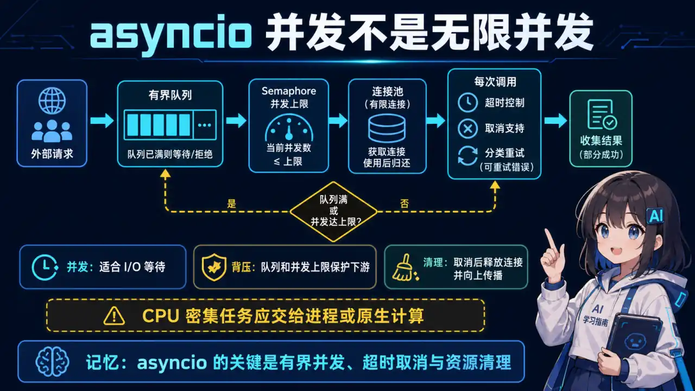
  </a>
</p>
<p align="center"><sub>🧠 图解记忆：为什么 AI 应用需要 asyncio；点击图片可查看原图。</sub></p>
<details>
<summary>💡 答案要点</summary>

**为什么 AI 应用需要 asyncio？**

LLM API 调用 = I/O 密集型（网络等待远大于计算）。asyncio 让单线程并发成为可能：

```
传统同步（串行）：
请求1 → 等待API 3s → 请求2 → 等待API 3s → 总计 6s
  ↓ 不高效，CPU 全在等

异步并发：
请求1 ──等待API 3s──→ 处理结果
请求2 ──等待API 3s──→ 处理结果   总计 3s（并行）
```

**核心概念：**

| 概念 | 说明 |
|------|------|
| `async def` | 定义协程函数，不能用 `return`，要用 `await` |
| `await` | 等待另一个协程完成，释放控制权 |
| `asyncio.gather()` | 并发执行多个协程 |
| `asyncio.create_task()` | 创建任务（后台执行）|
| `asyncio.Semaphore` | 控制并发数（限流）|

**典型 AI 应用场景：**

<details>
<summary>展开 Python 代码示例（37 行）</summary>

```python
import asyncio
from openai import AsyncOpenAI

client = AsyncOpenAI()

# 场景1：并发调用多个 LLM（批量生成）
async def batch_generate(prompts: list[str]):
    tasks = [client.chat.completions.create(
        model="gpt-4o",
        messages=[{"role": "user", "content": p}]
    ) for p in prompts]
    
    responses = await asyncio.gather(*tasks)
    return [r.choices[0].message.content for r in responses]

# 场景2：带并发限制的调用（Semaphore）
semaphore = asyncio.Semaphore(5)  # 最多5个并发

async def limited_call(prompt: str):
    async with semaphore:
        return await client.chat.completions.create(
            model="gpt-4o",
            messages=[{"role": "user", "content": prompt}]
        )

# 场景3：超时控制
async def call_with_timeout(prompt: str, timeout=30):
    try:
        return await asyncio.wait_for(
            client.chat.completions.create(
                model="gpt-4o",
                messages=[{"role": "user", "content": prompt}]
            ),
            timeout=timeout
        )
    except asyncio.TimeoutError:
        return {"error": "timeout"}
```

</details>

**生产级异步封装：**

```python
class AsyncLLMClient:
    """带重试 + 并发控制 + 超时的异步 LLM 客户端"""
    
    def __init__(self, max_concurrent=10, timeout=60):
        self.client = AsyncOpenAI()
        self.semaphore = asyncio.Semaphore(max_concurrent)
        self.timeout = timeout
    
    async def chat(self, prompt: str, retry=3) -> str:
        for attempt in range(retry):
            try:
                async with self.semaphore:
                    response = await asyncio.wait_for(
                        self.client.chat.completions.create(
                            model="gpt-4o",
                            messages=[{"role": "user", "content": prompt}]
                        ),
                        timeout=self.timeout
                    )
                    return response.choices[0].message.content
            except (asyncio.TimeoutError, Exception) as e:
                if attempt == retry - 1:
                    raise
                await asyncio.sleep(2 ** attempt)  # 指数退避
        
    async def batch_chat(self, prompts: list[str]) -> list[str]:
        tasks = [self.chat(p) for p in prompts]
        return await asyncio.gather(*tasks)
```

**面试话术：**

> "LLM API 调用通常是 I/O 密集型，asyncio 可以让等待网络响应的时间服务其他请求。但异步不等于无限并发：还需要 Semaphore 或连接池限制、超时、取消传播、针对可重试错误的退避，以及下游过载时的背压。收益应在供应商限流和目标流量下压测。"

</details>

---

<a id="q2"></a>

### Q2: Pydantic v2 在 LLM 结构化输出中的用法与原理？


<p align="center">
  <a href="../../assets/illustrations/24-python-engineering/q02-pydantic-structured-output.webp">
    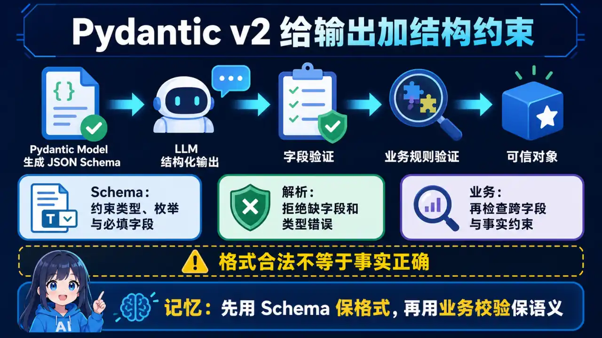
  </a>
</p>
<p align="center"><sub>🧠 图解记忆：为什么 LLM 需要 Pydantic；点击图片可查看原图。</sub></p>
<details>
<summary>💡 答案要点</summary>

**为什么 LLM 需要 Pydantic？**

LLM 输出是自由文本，应用需要结构化数据。Pydantic v2 提供了类型安全的解析方案：

```
LLM 输出: "是的，这部电影适合全家观看。评分: 8.5/10，主演: 张三"
                            ↓
Pydantic 模型:
MovieReview {
  suitable_for_family: bool = True
  rating: float = 8.5
  main_actor: str = "张三"
}
```

**Pydantic v2 核心用法：**

```python
from pydantic import BaseModel, Field
from openai import OpenAI

client = OpenAI()

# 1. 定义输出 Schema
class MovieReview(BaseModel):
    """电影评论结构化输出"""
    suitable_for_family: bool = Field(description="是否适合全家观看")
    rating: float = Field(description="评分，范围 0-10")
    main_actor: str = Field(description="主演姓名")
    genre: list[str] = Field(description="电影类型列表")

# 2. 使用 OpenAI Structured Output
response = client.chat.completions.create(
    model="gpt-4o-2024-08-06",  # 支持结构化输出的模型
    messages=[{"role": "user", "content": "分析《你好，李焕英》"}],
    response_format=MovieReview  # 直接传 Pydantic 模型
)

review = response.choices[0].message.parsed
print(f"评分: {review.rating}, 适合家庭: {review.suitable_for_family}")
```

**原理：Pydantic 在内部做了什么？**

```
1. Pydantic 模型 → JSON Schema
2. JSON Schema → 注入到 System Prompt（告诉 LLM 输出格式）
3. LLM 输出 → JSON 字符串
4. Pydantic 解析 JSON → Pydantic 模型实例（带验证）
5. 验证失败 → `ValidationError`；业务语义仍需单独校验
```

**Pydantic v2 高级特性：**

<details>
<summary>展开 Python 代码示例（30 行）</summary>

```python
from pydantic import BaseModel, Field, field_validator, model_validator
from typing import Optional

class AgentConfig(BaseModel):
    """Agent 配置，支持嵌套和验证"""
    name: str = Field(..., min_length=1, max_length=50)
    max_steps: int = Field(default=10, ge=1, le=100)
    temperature: float = Field(default=0.7, ge=0, le=2)
    tools: list[str] = Field(default_factory=list)
    
    @field_validator('temperature')
    @classmethod
    def validate_temperature(cls, v):
        if v > 1.5:
            print("⚠️ temperature > 1.5 可能导致输出不稳定")
        return v
    
    @model_validator(mode='after')
    def validate_config(self):
        if self.max_steps > 50 and not self.tools:
            raise ValueError("超过50步必须有工具定义，否则可能无限循环")
        return self

# 用法
config = AgentConfig(
    name="data-analyst",
    max_steps=60,
    temperature=1.8,
    tools=["sql_query", "chart_generator"]
)
print(config.model_dump_json())
```

</details>

**V2 vs V1 核心区别：**

| 特性 | Pydantic v1 | Pydantic v2 |
|------|-------------|-------------|
| 验证核心 | Python 实现为主 | 大量核心校验由 Rust `pydantic-core` 执行，具体加速比依 Schema 而定 |
| BaseModel | `dict()` | `model_dump()` |
| 序列化 | `dict()` / `json()` | `model_dump()` / `model_dump_json()` |
| 验证器 | `@validator` | `@field_validator` / `@model_validator` |

**面试话术：**

> "Pydantic v2 适合把 LLM 输出解析为带类型约束的对象。可以把模型导出为 JSON Schema 交给支持结构化输出的模型或推理引擎，再用 Pydantic 校验返回值；若供应商只支持文本输出，则还需自己提示、提取和重试。校验通过只表示结构与字段约束满足，不代表内容事实正确。V2 的性能改进主要来自 Rust 实现的 `pydantic-core`，具体提升要按实际 Schema 测。"

</details>

---

<a id="q3"></a>

### Q3: 如何用 Python 实现健壮的 LLM 重试机制（含指数退避）？


<p align="center">
  <a href="../../assets/illustrations/24-python-engineering/q03-llm-retry-backoff.webp">
    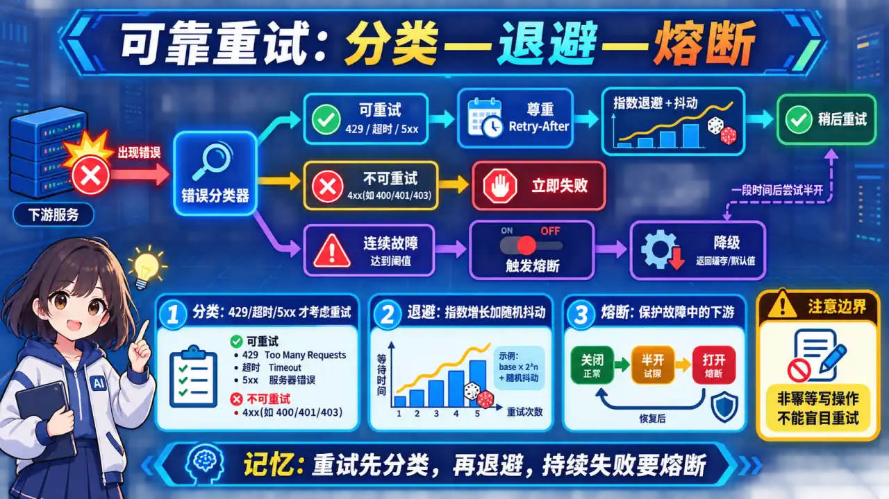
  </a>
</p>
<p align="center"><sub>🧠 图解记忆：为什么 LLM 调用需要重试；点击图片可查看原图。</sub></p>
<details>
<summary>💡 答案要点</summary>

**为什么 LLM 调用需要重试？**

LLM API 调用失败的两大原因：
- **瞬时错误**：网络抖动、API 限流（HTTP 429、500）
- **长尾延迟**：模型冷启动、超时

```
最佳重试策略：指数退避 + 抖动
```

**指数退避原理：**

| 策略 | 重试间隔 | 优点 | 缺点 |
|------|----------|------|------|
| 固定间隔 | 1s, 1s, 1s | 简单 | 可能打爆限流 |
| 线性增长 | 1s, 2s, 3s | 温和 | 收敛慢 |
| **指数退避** | 1s, 2s, 4s, 8s | 收敛快 | 可能过长 |
| **指数退避+抖动** | 1±0.5s, 2±1s... | 平衡 | 最优 |

**生产级重试实现：**

<details>
<summary>展开 Python 代码示例（86 行）</summary>

```python
import asyncio
import random
from typing import TypeVar, Callable, Any
from functools import wraps
import logging

logger = logging.getLogger(__name__)

T = TypeVar('T')

class RetryError(Exception):
    """重试耗尽异常"""
    def __init__(self, attempts: int, last_error: Exception):
        self.attempts = attempts
        self.last_error = last_error
        super().__init__(f"重试 {attempts} 次后失败: {last_error}")


def async_retry(
    max_attempts: int = 3,
    base_delay: float = 1.0,
    max_delay: float = 60.0,
    exponential_base: float = 2.0,
    jitter: bool = True,
    retry_on: tuple = (Exception,),
):
    """
    异步重试装饰器（指数退避 + 抖动）
    
    Args:
        max_attempts: 最大尝试次数
        base_delay: 基础延迟（秒）
        max_delay: 最大延迟上限
        exponential_base: 指数基数
        jitter: 是否加随机抖动
        retry_on: 需要重试的异常类型
    """
    def decorator(func: Callable[..., T]) -> Callable[..., T]:
        @wraps(func)
        async def wrapper(*args, **kwargs) -> T:
            last_error = None
            
            for attempt in range(1, max_attempts + 1):
                try:
                    return await func(*args, **kwargs)
                except retry_on as e:
                    last_error = e
                    
                    if attempt == max_attempts:
                        raise RetryError(max_attempts, last_error) from e
                    
                    # 计算延迟
                    delay = min(base_delay * (exponential_base ** (attempt - 1)), max_delay)
                    
                    # 加抖动（避免多实例同时重试打爆服务）
                    if jitter:
                        delay = delay * (0.5 + random.random() * 0.5)
                    
                    # 根据错误类型调整延迟
                    if "429" in str(e) or "rate_limit" in str(e).lower():
                        delay = max(delay, 10)  # 限流错误至少等10秒
                    
                    logger.warning(
                        f"Attempt {attempt}/{max_attempts} failed for {func.__name__}: {e}. "
                        f"Retrying in {delay:.2f}s..."
                    )
                    await asyncio.sleep(delay)
            
            raise RetryError(max_attempts, last_error)
        
        return wrapper
    return decorator


# 使用示例
class LLMClient:
    def __init__(self):
        self.client = AsyncOpenAI()
    
    @async_retry(max_attempts=4, base_delay=1.5, retry_on=(RateLimitError, TimeoutError, APIError))
    async def chat(self, prompt: str) -> str:
        response = await self.client.chat.completions.create(
            model="gpt-4o",
            messages=[{"role": "user", "content": prompt}]
        )
        return response.choices[0].message.content
```

</details>

**带熔断器的重试（防止雪崩）：**

<details>
<summary>展开 Python 代码示例（49 行）</summary>

```python
import time
from dataclasses import dataclass, field

@dataclass
class CircuitBreaker:
    """熔断器：连续失败 N 次后暂停服务"""
    failure_threshold: int = 5
    recovery_timeout: float = 60.0
    failures: int = field(default=0)
    last_failure_time: float = field(default=0)
    state: str = "closed"  # closed, open, half_open
    
    def record_success(self):
        self.failures = 0
        self.state = "closed"
    
    def record_failure(self):
        self.failures += 1
        self.last_failure_time = time.time()
        if self.failures >= self.failure_threshold:
            self.state = "open"
            logger.error(f"Circuit breaker opened after {self.failures} failures")
    
    def can_attempt(self) -> bool:
        if self.state == "closed":
            return True
        if self.state == "open":
            if time.time() - self.last_failure_time > self.recovery_timeout:
                self.state = "half_open"
                return True
            return False
        return True  # half_open


# 组合使用
circuit_breaker = CircuitBreaker()

@async_retry(max_attempts=3)
async def safe_chat(prompt: str) -> str:
    if not circuit_breaker.can_attempt():
        raise Exception("Circuit breaker is open")
    
    try:
        result = await llm_client.chat(prompt)
        circuit_breaker.record_success()
        return result
    except Exception as e:
        circuit_breaker.record_failure()
        raise
```

</details>

**面试话术：**

> "LLM 重试不是失败后无条件重来。先区分可重试错误，例如部分 429、超时和临时 5xx，再使用带抖动的指数退避，避免多实例同步重试；设置总时限和最大次数，并配合并发限制、熔断与可观测性。工具调用等有副作用的操作还要使用幂等键或去重，具体参数应根据供应商响应头和业务 SLO 调整。"

</details>

---

<a id="q4"></a>

### Q4: FastAPI 如何实现流式 SSE 接口？和 WebSocket 有何区别？


<p align="center">
  <a href="../../assets/illustrations/24-python-engineering/q04-sse-vs-websocket.webp">
    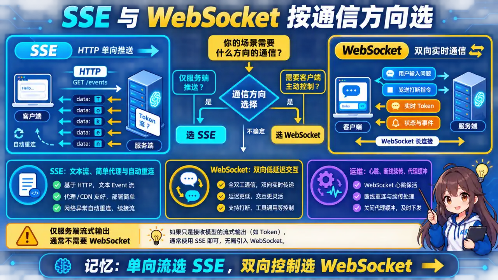
  </a>
</p>
<p align="center"><sub>🧠 图解记忆：SSE vs WebSocket 核心区别；点击图片可查看原图。</sub></p>
<details>
<summary>💡 答案要点</summary>

**SSE vs WebSocket 核心区别：**

| 维度 | SSE（Server-Sent Events）| WebSocket |
|------|---------------------------|-----------|
| **方向** | 单向（Server → Client）| 双向 |
| **协议** | HTTP/1.1+ | 独立协议 ws:// |
| **断开重连** | 自动 | 手动处理 |
| **兼容性** | 需要 polyfill（旧浏览器）| 全面支持 |
| **复杂度** | 简单 | 复杂 |
| **适用** | AI 流式输出、实时日志 | 聊天、游戏、协作 |

> "AI 应用 99% 用 SSE，因为 AI 输出是单向流（Server → Client），不需要双向通信。"

**FastAPI 流式 SSE 实现：**

<details>
<summary>展开 Python 代码示例（52 行）</summary>

```python
from fastapi import FastAPI, Response
from fastapi.responses import StreamingResponse
import asyncio
import json

app = FastAPI()

@app.get("/v1/chat/stream")
async def chat_stream(message: str):
    """SSE 流式聊天接口"""
    
    async def event_generator():
        # 模拟 LLM 流式输出
        async def generate():
            prompt = f"请分析: {message}"
            # 实际项目用 OpenAI/Anthropic SDK:
            # stream = await client.chat.completions.create(
            #     model="gpt-4o",
            #     messages=[{"role": "user", "content": prompt}],
            #     stream=True
            # )
            
            # 模拟流式 token
            words = ["这是", "一个", "演示", "流式", "输出", "的", "例子"]
            for word in words:
                await asyncio.sleep(0.3)
                yield word
        
        accumulated = ""
        async for token in generate():
            accumulated += token
            
            # SSE 格式: data: {...}\n\n
            data = json.dumps({
                "token": token,
                "accumulated": accumulated,
                "done": False
            })
            yield f"data: {data}\n\n"
        
        # 结束信号
        yield f"data: {json.dumps({'done': True})}\n\n"
    
    return StreamingResponse(
        event_generator(),
        media_type="text/event-stream",
        headers={
            "Cache-Control": "no-cache",
            "Connection": "keep-alive",
            "X-Accel-Buffering": "no",  # 禁用 Nginx 缓冲
        }
    )
```

</details>

**前端调用 SSE：**

```javascript
// 原生 EventSource（单向，只能 GET）
const eventSource = new EventSource(`/v1/chat/stream?message=${encodeURIComponent(msg)}`);

eventSource.onmessage = (event) => {
    const data = JSON.parse(event.data);
    if (data.done) {
        eventSource.close();
        console.log("生成完成:", data.accumulated);
    } else {
        // 流式更新 UI
        outputDiv.innerHTML += data.token;
    }
};

// 错误处理（EventSource 没有错误类型，需要手动心跳检测）
eventSource.onerror = () => {
    eventSource.close();
    console.log("SSE 连接断开");
};
```

**SSE + POST 请求（用 Fetch API）：**

```javascript
// SSE 本身只支持 GET，但可以用 Fetch + ReadableStream 实现 POST + 流式
async function streamChatPOST(message) {
    const response = await fetch("/v1/chat/stream", {
        method: "POST",
        headers: {"Content-Type": "application/json"},
        body: JSON.stringify({message})
    });
    
    const reader = response.body.getReader();
    const decoder = new TextDecoder();
    
    while (true) {
        const {done, value} = await reader.read();
        if (done) break;
        
        const chunk = decoder.decode(value);
        // 解析 SSE 数据
        const lines = chunk.split("\n");
        for (const line of lines) {
            if (line.startsWith("data: ")) {
                const data = JSON.parse(line.slice(6));
                console.log("收到:", data);
            }
        }
    }
}
```

**WebSocket 实现（双向聊天）：**

```python
from fastapi import WebSocket
from starlette.websockets import WebSocketState

@app.websocket("/ws/chat")
async def websocket_chat(websocket: WebSocket):
    await websocket.accept()
    
    try:
        while True:
            # 接收客户端消息（双向）
            data = await websocket.receive_text()
            
            # 发送响应（可以结合 SSE 流式）
            await websocket.send_text(f"Echo: {data}")
            
    except WebSocketState:
        await websocket.close()
```

**面试话术：**

> "AI 流式输出 99% 用 SSE，不需要双向就用 SSE，简单、基于 HTTP、好调试。我的 FastAPI SSE 实现要点：StreamingResponse 返回，media_type 是 text/event-stream，记得加 X-Accel-Buffering: no 否则 Nginx 会缓冲导致延迟。前端用 EventSource 或 Fetch + ReadableStream 接收。唯一需要 WebSocket 的场景是'AI 回复的同时用户还要继续发消息'——这种双向通信才用 WebSocket，但实际产品中很少见。"

</details>

---

<a id="q5"></a>

### Q5: Python GIL 对 AI 应用的影响？如何用多进程规避？


<p align="center">
  <a href="../../assets/illustrations/24-python-engineering/q05-python-gil-concurrency.webp">
    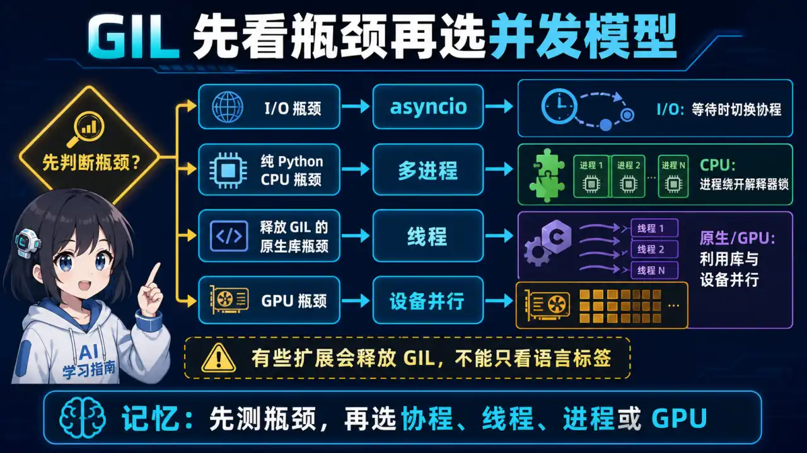
  </a>
</p>
<p align="center"><sub>🧠 图解记忆：Global Interpreter Lock（全局解释器锁）；点击图片可查看原图。</sub></p>
<details>
<summary>💡 答案要点</summary>

**GIL 是什么：**

> Global Interpreter Lock（全局解释器锁）。Python 的机制，同一时刻只有一个线程执行 Python 字节码。

```
单线程 Python：
线程1: [获取GIL] → [执行字节码] → [释放GIL] → ...
                       ↓
              其他线程等待

多线程 Python（CPU 密集）：
线程1: [GIL] → [执行] → [释放] → ...    线程2: [等待GIL]...
                       ↓
              CPU 利用率 ≈ 1核（其他核空闲）
```

**AI 应用中的 GIL 场景：**

| 场景 | GIL 影响 | 解决方案 |
|------|----------|----------|
| LLM API 调用（I/O 等待）| 无影响 | asyncio（I/O 密集）|
| Embedding 模型（CPU 计算）| 影响大 | 多进程 |
| Tokenizer / 后处理 | 影响大 | 多进程 |
| 数据预处理 | 影响大 | multiprocessing |

**多进程方案：**

<details>
<summary>展开 Python 代码示例（31 行）</summary>

```python
import multiprocessing as mp
from concurrent.futures import ProcessPoolExecutor, ThreadPoolExecutor
from functools import partial

# 场景：批量 embedding（CPU 密集）
def embed_texts_worker(texts: list[str], model_name: str) -> list[list[float]]:
    """Worker 进程函数"""
    from sentence_transformers import SentenceTransformer
    model = SentenceTransformer(model_name)
    return model.encode(texts).tolist()

def batch_embed(texts: list[str], model_name: str = "BAAI/bge-large") -> list[list[float]]:
    """多进程批量 embedding"""
    n_workers = mp.cpu_count()
    chunk_size = max(1, len(texts) // n_workers)
    
    # 分块
    chunks = [texts[i:i+chunk_size] for i in range(0, len(texts), chunk_size)]
    
    # 每个块在独立进程中处理
    with ProcessPoolExecutor(max_workers=n_workers) as executor:
        results = list(executor.map(
            partial(embed_texts_worker, model_name=model_name),
            chunks
        ))
    
    # 合并结果
    return [item for chunk in results for item in chunk]

# 使用
embeddings = batch_embed(["文本1", "文本2", "文本3", "文本4"])
```

</details>

**多进程 vs 多线程 vs asyncio 对比：**

```
场景                  推荐方案         原因
────────────────────────────────────────────────────
LLM API 调用          asyncio          I/O 等待，GIL 不影响
Embedding 模型推理    ProcessPool      CPU 密集，GIL 阻塞
数据预处理            ThreadPool       I/O + CPU 混合
模型推理（GPU）        单进程 + CUDA    GPU 无 GIL 问题
```

**进程池复用（避免重复加载模型）：**

<details>
<summary>展开 Python 代码示例（47 行）</summary>

```python
class EmbeddingWorkerPool:
    """进程池 + 模型复用"""
    
    def __init__(self, model_name: str, n_workers: int = None):
        self.model_name = model_name
        self.n_workers = n_workers or mp.cpu_count()
        
        # 进程池（在主进程创建）
        self.pool = mp.Pool(
            processes=self.n_workers,
            initializer=self._init_worker,
            initargs=(model_name,)
        )
    
    @staticmethod
    def _init_worker(model_name: str):
        """Worker 进程初始化（每个进程只执行一次）"""
        global _model
        from sentence_transformers import SentenceTransformer
        _model = SentenceTransformer(model_name)
        print(f"进程 {mp.current_process().name} 加载模型完成")
    
    def embed(self, texts: list[str]) -> list[list[float]]:
        """使用进程池 embedding"""
        global _model
        return _model.encode(texts).tolist()
    
    def batch_embed(self, texts: list[str], batch_size: int = 32) -> list[list[float]]:
        """带 batch 的批量处理"""
        results = []
        for i in range(0, len(texts), batch_size):
            batch = texts[i:i+batch_size]
            chunk_results = self.pool.map(_embed_batch, batch)
            results.extend(chunk_results)
        return results
    
    def __enter__(self):
        return self
    
    def __exit__(self, *args):
        self.pool.close()
        self.pool.join()


# 使用
with EmbeddingWorkerPool("BAAI/bge-large") as pool:
    embeddings = pool.batch_embed(["文本1", "文本2", "文本3", "文本4"])
```

</details>

**面试话术：**

> "GIL 的影响取决于代码是否执行 Python 字节码。网络 I/O 常适合 asyncio；纯 Python 的 CPU 密集任务可考虑多进程；但 NumPy、tokenizer、推理库等原生扩展可能释放 GIL，GPU 工作也主要在设备端，因此不能一概而论。先用 profiler 定位 Python CPU、原生算子、数据搬运还是 GPU 瓶颈，再在线程、多进程、异步和批处理之间选择。"

</details>

---

<a id="q6"></a>

### Q6: 如何用 pytest + Mock 测试一个 LLM 应用？


<p align="center">
  <a href="../../assets/illustrations/24-python-engineering/q06-pytest-llm-testing.webp">
    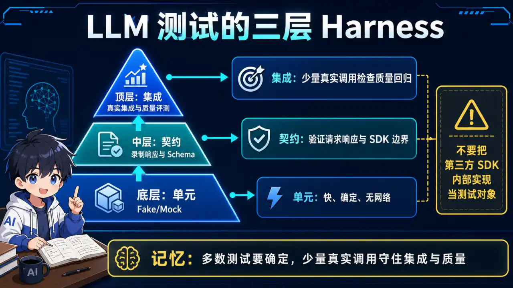
  </a>
</p>
<p align="center"><sub>🧠 图解记忆：LLM API 调用有两个问题；点击图片可查看原图。</sub></p>
<details>
<summary>💡 答案要点</summary>

**为什么需要 Mock？**

LLM API 调用有两个问题：
- **成本**：每次测试都调 API，费用高
- **不确定性**：LLM 输出不稳定，同样的输入可能输出不同

```
生产测试：
调用 OpenAI API → $$$

用 Mock 测试：
Mock LLM 响应 → 免费 + 稳定
```

**pytest + Mock 实战：**

<details>
<summary>展开 Python 代码示例（86 行）</summary>

```python
import pytest
from unittest.mock import AsyncMock, MagicMock, patch

# 被测试的 LLM 服务类
class LLMService:
    def __init__(self, api_key: str):
        self.client = OpenAI(api_key=api_key)
    
    def chat(self, prompt: str, system_prompt: str = "你是一个助手") -> str:
        response = self.client.chat.completions.create(
            model="gpt-4o",
            messages=[
                {"role": "system", "content": system_prompt},
                {"role": "user", "content": prompt}
            ]
        )
        return response.choices[0].message.content
    
    async def achat(self, prompt: str) -> str:
        response = await self.client.chat.completions.create(
            model="gpt-4o",
            messages=[{"role": "user", "content": prompt}]
        )
        return response.choices[0].message.content


# Mock 响应
@pytest.fixture
def mock_response():
    """Mock OpenAI API 响应"""
    mock_msg = MagicMock()
    mock_msg.choices[0].message.content = "这是 Mock 的 LLM 响应"
    
    mock_resp = MagicMock()
    mock_resp.choices = [mock_msg]
    return mock_resp


class TestLLMService:
    """LLM 服务单元测试"""
    
    def test_chat_success(self, mock_response):
        """测试正常调用"""
        with patch("openai.OpenAI") as MockOpenAI:
            mock_client = MockOpenAI.return_value
            mock_client.chat.completions.create.return_value = mock_response
            
            service = LLMService(api_key="fake-key")
            result = service.chat("你好")
            
            assert result == "这是 Mock 的 LLM 响应"
            mock_client.chat.completions.create.assert_called_once()
    
    def test_chat_with_system_prompt(self, mock_response):
        """测试 system prompt 是否正确传递"""
        with patch("openai.OpenAI") as MockOpenAI:
            mock_client = MockOpenAI.return_value
            mock_client.chat.completions.create.return_value = mock_response
            
            service = LLMService(api_key="fake-key")
            result = service.chat("今天天气如何？", system_prompt="你是一个天气预报员")
            
            # 验证 system prompt 被传递
            call_args = mock_client.chat.completions.create.call_args
            messages = call_args.kwargs["messages"]
            assert messages[0]["role"] == "system"
            assert messages[0]["content"] == "你是一个天气预报员"


class TestLLMServiceAsync:
    """异步 LLM 服务测试"""
    
    @pytest.mark.asyncio
    async def test_async_chat(self):
        """测试异步调用"""
        mock_response = AsyncMock()
        mock_response.choices[0].message.content = "异步响应"
        
        with patch("openai.AsyncOpenAI") as MockAsyncOpenAI:
            mock_client = MockAsyncOpenAI.return_value
            mock_client.chat.completions.create = AsyncMock(return_value=mock_response)
            
            service = LLMService(api_key="fake-key")
            result = await service.achat("你好")
            
            assert result == "异步响应"
```

</details>

**用 `respx` Mock HTTP 响应（更真实）：**

```python
import respx
from httpx import Response

@respx.mock
def test_with_respx():
    """用 respx Mock HTTP 响应"""
    # 模拟 OpenAI API 的 HTTP 响应
    respx.post("https://api.openai.com/v1/chat/completions").mock(
        return_value=Response(200, json={
            "choices": [{
                "message": {"content": "respx mock 响应"}
            }]
        })
    )
    
    client = OpenAI(api_key="test")
    response = client.chat.completions.create(
        model="gpt-4o",
        messages=[{"role": "user", "content": "测试"}]
    )
    
    assert response.choices[0].message.content == "respx mock 响应"
```

**用 VCRPy 录制真实响应（回归测试）：**

```python
# 第一次运行：录制真实 API 调用
# @pytest.fixture(scope="module")
# def vcr_config():
#     return {
#         "record_mode": "new",  # 首次录制
#         "filter_headers": [("authorization", "REDACTED")],
#     }

# 后续运行：使用录制文件（不调用真实 API）
import vcr

@vcr.use_cassette("fixtures/vcr/test_chat.yaml")
def test_chat_with_cassette():
    """使用录制的 API 响应"""
    # 不会真正调用 API，会从 fixtures/vcr/test_chat.yaml 读取
    service = LLMService(api_key="real-key")
    result = service.chat("你好")
    assert "你好" in result  # 验证响应内容
```

**集成测试（用 testcontainers 跑真实服务）：**

```python
@pytest.fixture(scope="module")
def redis_container():
    """用 testcontainers 启动真实 Redis"""
    import testcontainers.postgres
    container = testcontainers.postgres.PostgresContainer("postgres:15")
    container.start()
    yield container
    container.stop()


def test_with_real_redis(redis_container):
    """集成测试：使用真实 Redis"""
    from langchain.redis import RedisCache
    
    cache = RedisCache.from_connection_string(
        redis_container.get_connection_url()
    )
    
    # 测试缓存逻辑
    cache.set("key", "value")
    assert cache.get("key") == "value"
```

**测试 AI 输出质量（Regression 测试）：**

```python
def test_llm_quality_regression():
    """防止 LLM 输出质量退化"""
    service = LLMService(api_key="fake-key")
    
    # 准备测试用例（输入 + 期望关键词）
    test_cases = [
        {"input": "北京天气", "keywords": ["天气", "温度", "北京"]},
        {"input": "Python是什么", "keywords": ["Python", "编程", "语言"]},
    ]
    
    for case in test_cases:
        with patch("openai.OpenAI") as MockOpenAI:
            # Mock 一个合规的响应
            mock_response = MagicMock()
            mock_response.choices[0].message.content = f"回答中包含 {case['keywords'][0]}"
            MockOpenAI.return_value.chat.completions.create.return_value = mock_response
            
            result = service.chat(case["input"])
            
            # 验证输出包含必要关键词
            for keyword in case["keywords"]:
                assert keyword in result, f"输出缺少关键词: {keyword}"
```

**面试话术：**

> "LLM 应用测试的核心是'成本控制和输出稳定性'。我用三层测试：单元测试用 Mock（不调真实 API），集成测试用 VCR 录制（首次录一次，后续回放），回归测试用关键词检查（防止输出质量退化）。Mock 要注意不要过度——测的是你的业务逻辑，不是 OpenAI SDK。另外，asyncio 的测试用 `@pytest.mark.asyncio`，Mock 要用 `AsyncMock`。"

</details>

---

<a id="q7"></a>

### Q7: Python 内存管理与 AI 应用的 OOM 问题如何排查？


<p align="center">
  <a href="../../assets/illustrations/24-python-engineering/q07-python-oom-diagnosis.webp">
    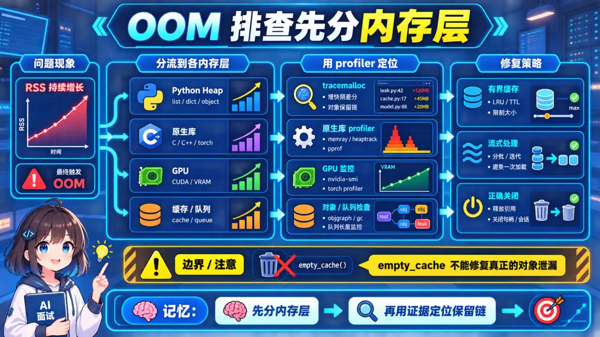
  </a>
</p>
<p align="center"><sub>🧠 图解记忆：AI 应用的 OOM 四大场景；点击图片可查看原图。</sub></p>
<details>
<summary>💡 答案要点</summary>

**AI 应用的 OOM 四大场景：**

```
1. 大模型加载：模型太大，显存不够
2. Batch 处理：批量请求堆积，内存暴涨
3. 向量数据库：大规模向量撑爆 RAM
4. 异步任务：并发任务未释放，内存泄漏
```

**诊断工具：**

| 工具 | 用途 | 典型用法 |
|------|------|----------|
| `tracemalloc` | 定位内存分配 | 对比快照，找泄漏点 |
| `objgraph` | 对象引用链 | 查谁持有对象不释放 |
| `memory_profiler` | 行级内存占用 | `@profile` 装饰器 |
| `psutil` | 进程内存监控 | 实时告警 |
| `gdb` | 显存问题 | CUDA OOM 调试 |

**实战：tracemalloc 排查内存泄漏：**

```python
import tracemalloc
import gc

# 启动追踪
tracemalloc.start()

# ... 执行你的代码 ...

# 抓取快照
snapshot1 = tracemalloc.take_snapshot()

# 执行可疑代码（N 次循环）
for _ in range(100):
    # 模拟：每次创建大对象但不释放
    data = [list(range(10000)) for _ in range(100)]
    # 正确做法：del data 或在循环内创建

gc.collect()  # 强制垃圾回收

snapshot2 = tracemalloc.take_snapshot()

# 对比快照
top_stats = snapshot2.compare_to(snapshot1, 'lineno')

print("内存增长 Top 10:")
for stat in top_stats[:10]:
    print(stat)
```

**常见泄漏模式 + 修复：**

<details>
<summary>展开 Python 代码示例（49 行）</summary>

```python
# 泄漏模式 1：全局列表不断追加
class MemoryLeakyCache:
    """有内存泄漏的缓存"""
    def __init__(self):
        self.history = []  # ❌ 不断追加，永不清理
    
    def add(self, key, value):
        self.history.append((key, value))  # 内存持续增长
        return value


# 修复：LRU 缓存或固定大小
from functools import lru_cache

@lru_cache(maxsize=1000)
def cached_result(query: str) -> str:
    """自动 LRU 清理"""
    return expensive_computation(query)


# 泄漏模式 2：未关闭的流式响应
async def leaky_stream():
    async for chunk in llm.stream():
        process(chunk)
        # ❌ 如果中途异常，response 未关闭
    
# 修复：async with 或 try/finally
async def fixed_stream():
    async with llm.stream() as response:
        async for chunk in response:
            process(chunk)
        # ✅ 无论是否异常都会清理


# 泄漏模式 3：大对象序列化残留
def leaky_json_processing():
    data = load_large_json("big_file.json")  # 加载大 JSON
    result = json.dumps(data)  # 序列化
    # ❌ data 还在内存中
    del data  # 需要手动删除
    return result

# 修复：流式 JSON 解析
import ijson

def fixed_streaming_json():
    with open("big_file.json", "rb") as f:
        for item in ijson.items(f, "item"):  # 流式解析
            process(item)
```

</details>

**AI 应用专项：大模型显存管理：**

<details>
<summary>展开 Python 代码示例（39 行）</summary>

```python
# 场景：多模型部署，显存不够
import torch

def load_model_memory_efficient(model_name: str):
    """显存高效加载"""
    if torch.cuda.is_available():
        # 1. 量化加载（INT8/INT4）
        model = AutoModelForCausalLM.from_pretrained(
            model_name,
            torch_dtype=torch.float16,  # FP16 加载
            load_in_8bit=True,           # INT8 量化（bitsandbytes）
            device_map="auto",           # 自动分配到多卡
        )
        
        # 2. 梯度检查点（减少显存）
        model.gradient_checkpointing_enable()
        
        # 3. 使用 Python 垃圾回收
        import gc
        gc.collect()
        torch.cuda.empty_cache()  # 清理未使用的缓存
    
    return model


# 监控显存
def monitor_gpu_memory():
    """每 N 秒监控一次显存"""
    import time
    while True:
        if torch.cuda.is_available():
            allocated = torch.cuda.memory_allocated() / 1024**3  # GB
            reserved = torch.cuda.memory_reserved() / 1024**3
            print(f"Allocated: {allocated:.2f}GB, Reserved: {reserved:.2f}GB")
            
            # OOM 预警
            if allocated > 0.9 * torch.cuda.get_device_properties(0).total_memory / 1024**3:
                print("⚠️ 显存使用率 > 90%，即将 OOM")
        time.sleep(30)
```

</details>

**面试话术：**

> "AI 应用的 OOM 有四种常见原因：大模型加载（用 FP16/INT8 量化）、Batch 堆积（加 Semaphore 限流）、向量库太大（用内存映射或分片）、异步任务泄漏（用 async with 确保清理）。排查用 tracemalloc 对比快照，核心是'谁持有了对象不释放'。我做生产级 AI 服务有个习惯：加 psutil 实时监控内存，超过 80% 自动告警，超过 90% 自动触发 GC，不等到 OOM 才处理。"

</details>

---


<a id="q8"></a>

### Q8: 如何用 `asyncio` + `httpx` 批量并发调用 LLM API？生产级的错误处理、重试、超时、并发控制怎么做？


<p align="center">
  <a href="../../assets/illustrations/24-python-engineering/q08-httpx-concurrent-llm.webp">
    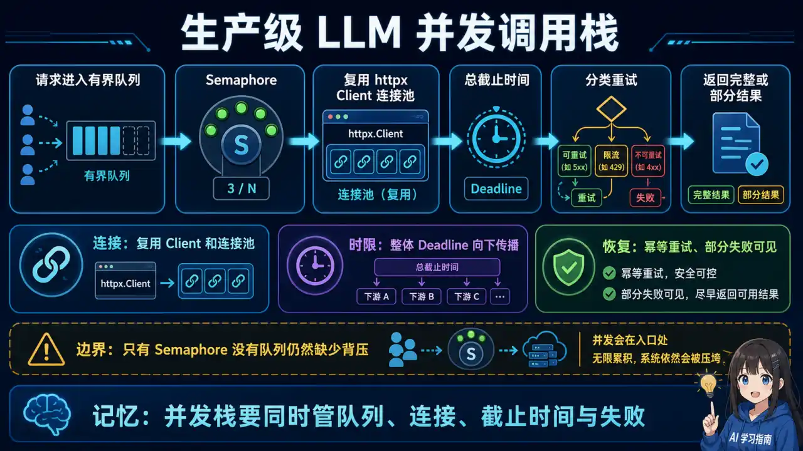
  </a>
</p>
<p align="center"><sub>🧠 图解记忆：为什么需要 asyncio + httpx；点击图片可查看原图。</sub></p>
<details>
<summary>💡 答案要点</summary>

**为什么需要 asyncio + httpx？**

AI 应用中 LLM API 调用是 **I/O 密集型**，单线程 asyncio 能将等待时间利用起来并发处理：

```python
# 串行（3个请求各3秒）：总耗时 9s
for prompt in prompts:
    result = call_llm(prompt)  # 同步等待

# 并发（3个请求并行）：总耗时 3s
results = await asyncio.gather(*[call_llm(p) for p in prompts])
```

**生产级完整实现：**

<details>
<summary>展开 Python 代码示例（152 行）</summary>

```python
import asyncio
import httpx
from typing import Any
from dataclasses import dataclass
import logging

logger = logging.getLogger(__name__)


@dataclass
class LLMConfig:
    api_key: str
    base_url: str = "https://api.openai.com/v1"
    model: str = "gpt-4o"
    max_concurrent: int = 10
    timeout: float = 60.0
    max_retries: int = 3

class AsyncLLMClient:
    """"生产级异步 LLM API 客户端"""
    
    def __init__(self, config: LLMConfig):
        self.config = config
        self._semaphore = asyncio.Semaphore(config.max_concurrent)
        self._client: httpx.AsyncClient | None = None
    
    async def _get_client(self) -> httpx.AsyncClient:
        if self._client is None or self._client.is_closed:
            self._client = httpx.AsyncClient(
                base_url=self.config.base_url,
                headers={
                    "Authorization": f"Bearer {self.config.api_key}",
                    "Content-Type": "application/json"
                },
                timeout=httpx.Timeout(self.config.timeout)
            )
        return self._client
    
    async def chat(
        self,
        prompt: str,
        system_message: str | None = None,
        retry: int | None = None
    ) -> dict[str, Any]:
        """单次 LLM 调用，带重试和并发控制"""
        if retry is None:
            retry = self.config.max_retries
        
        messages = []
        if system_message:
            messages.append({"role": "system", "content": system_message})
        messages.append({"role": "user", "content": prompt})
        
        for attempt in range(retry):
            async with self._semaphore:  # 并发数限制
                try:
                    client = await self._get_client()
                    response = await client.post(
                        "/chat/completions",
                        json={
                            "model": self.config.model,
                            "messages": messages,
                            "stream": False
                        }
                    )
                    
                    if response.status_code == 429:
                        # 限流：指数退避
                        wait = 2 ** attempt * 1.5
                        logger.warning(f"Rate limited, waiting {wait}s")
                        await asyncio.sleep(wait)
                        continue
                    
                    if response.status_code >= 500:
                        # 服务器错误：重试
                        await asyncio.sleep(2 ** attempt)
                        continue
                    
                    response.raise_for_status()
                    return response.json()
                    
                except httpx.TimeoutException:
                    logger.warning(f"Timeout on attempt {attempt + 1}")
                    if attempt == retry - 1:
                        raise
                    await asyncio.sleep(2 ** attempt)
                except httpx.HTTPStatusError as e:
                    logger.error(f"HTTP error: {e.response.status_code}")
                    if attempt == retry - 1:
                        raise
                    await asyncio.sleep(2 ** attempt)
                except Exception as e:
                    logger.error(f"Unexpected error: {e}")
                    if attempt == retry - 1:
                        raise
                    await asyncio.sleep(2 ** attempt)
        
        raise RuntimeError("All retries exhausted")
    
    async def batch_chat(
        self,
        prompts: list[str],
        system_message: str | None = None,
        stop_on_error: bool = False
    ) -> list[Any]:
        """批量并发调用，返回结果列表"""
        tasks = [
            self.chat(p, system_message=system_message)
            for p in prompts
        ]
        
        if stop_on_error:
            return await asyncio.gather(*tasks)
        else:
            # 单个失败不影响其他
            results = await asyncio.gather(*tasks, return_exceptions=True)
            return [
                r if not isinstance(r, Exception) else {"error": str(r)}
                for r in results
            ]
    
    async def close(self):
        """关闭客户端（应用退出时调用）"""
        if self._client and not self._client.is_closed:
            await self._client.aclose()


# 使用示例
async def main():
    config = LLMConfig(
        api_key="sk-xxx",
        max_concurrent=10,
        timeout=60.0
    )
    client = AsyncLLMClient(config)
    
    try:
        # 批量10个提示词，最多10个并发
        prompts = [f"请翻译第{i}句话" for i in range(10)]
        results = await client.batch_chat(prompts)
        
        for i, result in enumerate(results):
            if "error" in result:
                print(f"Prompt {i} failed: {result['error']}")
            else:
                content = result["choices"][0]["message"]["content"]
                print(f"Prompt {i}: {content}")
                
    finally:
        await client.close()

# asyncio.run(main())
```

</details>

**关键设计点：**

| 设计点 | 实现方式 | 原因 |
|--------|----------|------|
| **并发控制** | `asyncio.Semaphore(10)` | 防止打爆 API 限流 |
| **超时控制** | `httpx.Timeout(60.0)` | 避免慢请求卡死 |
| **重试机制** | 指数退避 + 状态码判断 | 429 等一等，5xx 重试 |
| **错误隔离** | `return_exceptions=True` | 单个失败不影响整体 |
| **连接复用** | `httpx.AsyncClient` 单例 | 减少 TCP 建连开销 |
| **优雅退出** | `async with + try/finally` | 确保连接关闭 |

### 30 秒回答

> “异步批量调用要同时处理并发上限、连接复用、整体 deadline、可重试错误和部分失败。Semaphore 只能限制正在执行的协程，还需要有界队列形成背压；429 应尊重服务端重试提示，非幂等调用不能盲目重试。效果应使用自己的负载分布，报告完成率、P95 延迟、吞吐和限流次数，不能套用示例 QPS。”

</details>

---

*版本: v1.0 | 更新: 2026-05-09 | by 二狗子 🐕*

<a id="q9"></a>

### Q9: asyncio 中如何正确处理超时、取消和背压？


<p align="center">
  <a href="../../assets/illustrations/24-python-engineering/q09-asyncio-timeout-cancel-backpressure.webp">
    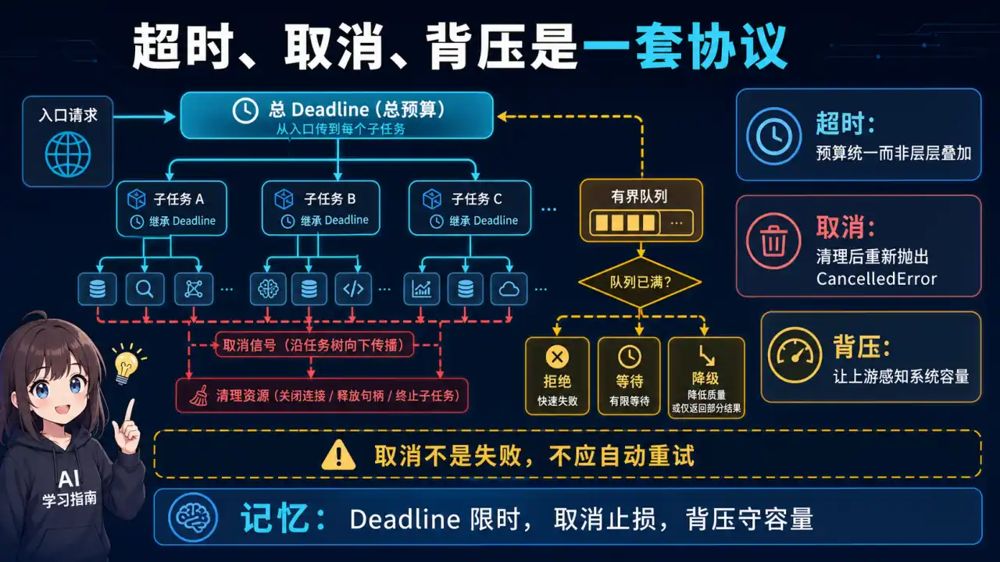
  </a>
</p>
<p align="center"><sub>🧠 图解记忆：超时是调用方的时间预算，取消需要沿任务树传播，背压用于限制系统接受工作的速度；点击图片可查看原图。</sub></p>
<details>
<summary>💡 答案要点</summary>

超时是调用方的时间预算，取消需要沿任务树传播，背压用于限制系统接受工作的速度。只加 `Semaphore` 不等于完整背压：还需要有界队列、入队超时、拒绝/降级策略和关闭流程。

捕获 `CancelledError` 时应完成必要清理后继续抛出；不要把取消当普通失败重试。整体 deadline 应在下游调用之间传递，避免每一层重新获得完整超时。使用 `TaskGroup` 或结构化并发可以减少孤儿任务。

</details>

<a id="q10"></a>

### Q10: 如何用 Protocol 和依赖注入让 LLM 客户端可测试、可替换？


<p align="center">
  <a href="../../assets/illustrations/24-python-engineering/q10-protocol-dependency-injection.webp">
    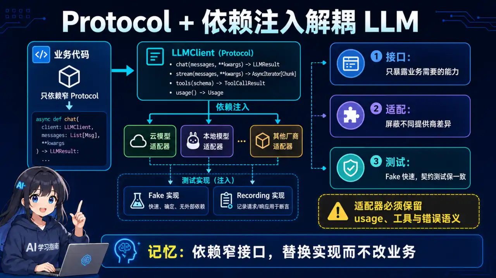
  </a>
</p>
<p align="center"><sub>🧠 图解记忆：业务层依赖一个窄接口，例如 generate(request) - response，而不是直接依赖某家 SDK；点击图片可查看原图。</sub></p>
<details>
<summary>💡 答案要点</summary>

业务层依赖一个窄接口，例如 `generate(request) -> response`，而不是直接依赖某家 SDK。用 `typing.Protocol` 描述能力，通过构造函数注入真实客户端、Fake 或 Recording Client。

接口应保留超时、usage、finish reason、tool calls 和错误类型，不能为了“统一”丢掉关键语义。单元测试用确定性 Fake；契约测试验证各供应商适配器；少量集成测试再调用真实服务。

</details>

<a id="q11"></a>

### Q11: AI 服务的配置、密钥和结构化日志应该怎么设计？


<p align="center">
  <a href="../../assets/illustrations/24-python-engineering/q11-config-secrets-logs.webp">
    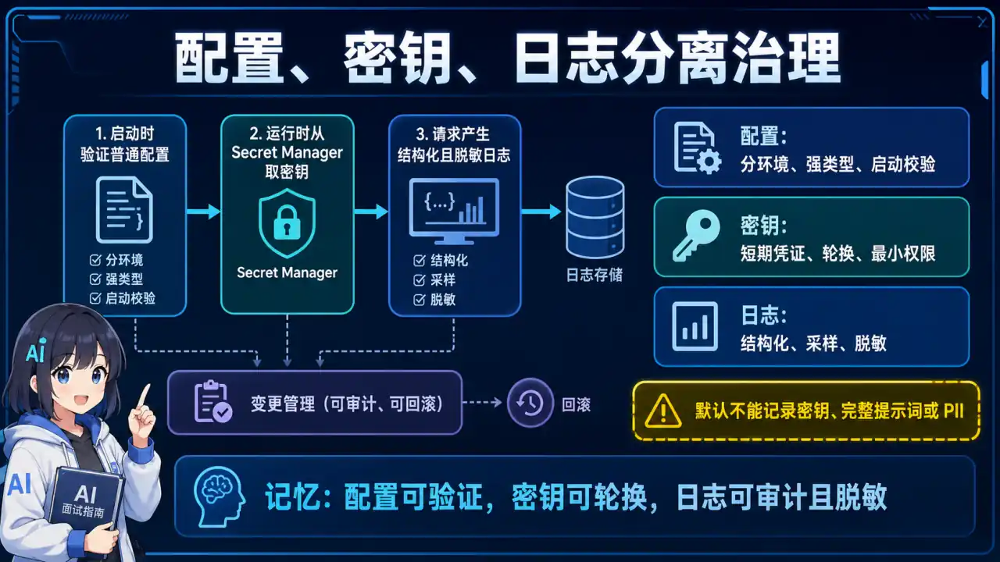
  </a>
</p>
<p align="center"><sub>🧠 图解记忆：配置按环境加载并在启动时校验；密钥来自 Secret Manager 或环境注入，不能写入仓库或打印；点击图片可查看原图。</sub></p>
<details>
<summary>💡 答案要点</summary>

配置按环境加载并在启动时校验；密钥来自 Secret Manager 或环境注入，不能写入仓库或打印。日志使用结构化字段记录 request/trace ID、模型、延迟、token、重试和错误类别，但 Prompt、工具结果和用户标识默认要脱敏或采样。

配置热更新需要版本、审计和回滚。日志字段要控制基数，避免把完整 query 当标签导致成本和隐私问题。

</details>

<a id="q12"></a>

### Q12: 如何定位 Python AI 服务的内存增长和事件循环阻塞？


<p align="center">
  <a href="../../assets/illustrations/24-python-engineering/q12-python-memory-event-loop.webp">
    
  </a>
</p>
<p align="center"><sub>🧠 图解记忆：先区分 Python 堆、原生库/GPU、连接池和缓存；点击图片可查看原图。</sub></p>
<details>
<summary>💡 答案要点</summary>

先区分 Python 堆、原生库/GPU、连接池和缓存。用 RSS 与 Python 分配量判断问题层次，再使用 `tracemalloc`、对象增长快照、采样 profiler 和事件循环 lag 定位。常见原因包括未消费的 Task、无界队列、缓存无上限、响应体未关闭和在线程池中堆积阻塞任务。

修复后应做稳定负载下的长时间 soak test，检查内存是否达到平台而不是只看短压测峰值。

</details>

---

*内容治理: 2026-08-12 | 新增可靠并发、可测试客户端、配置日志和性能诊断题*

---
