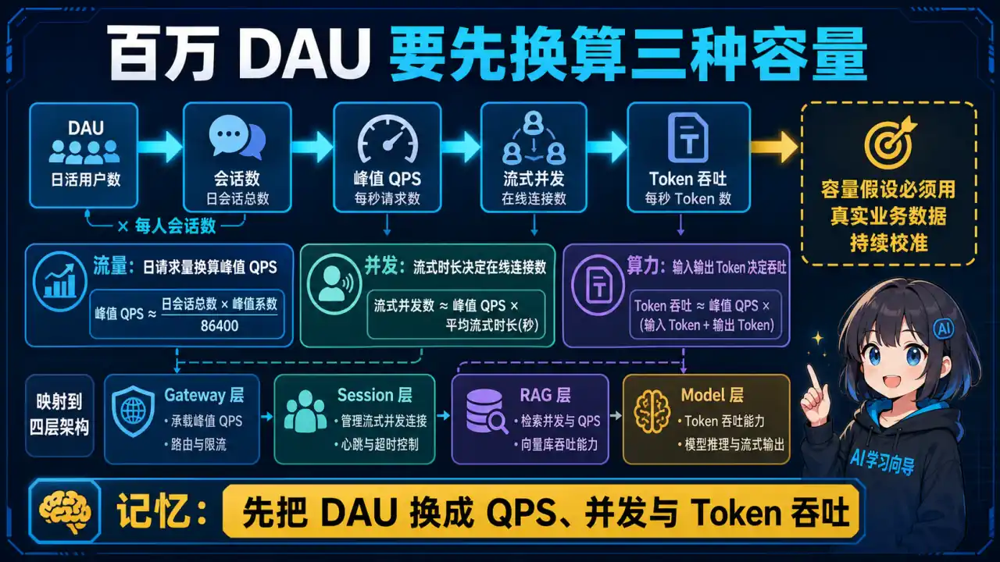
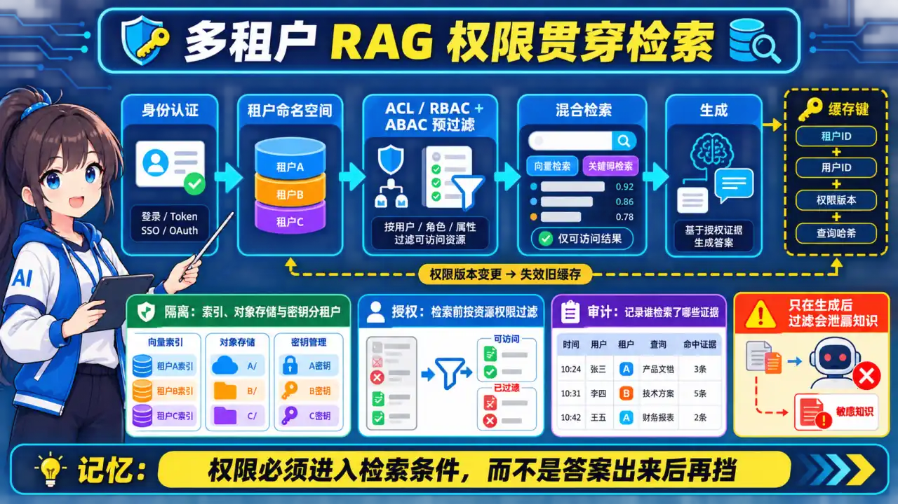
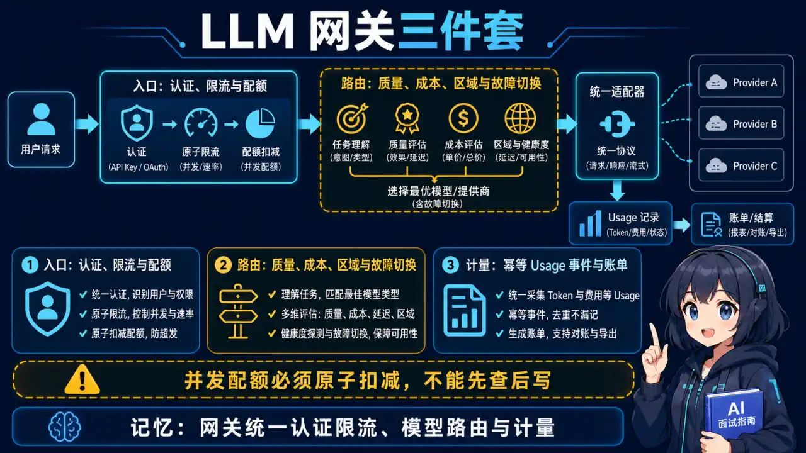
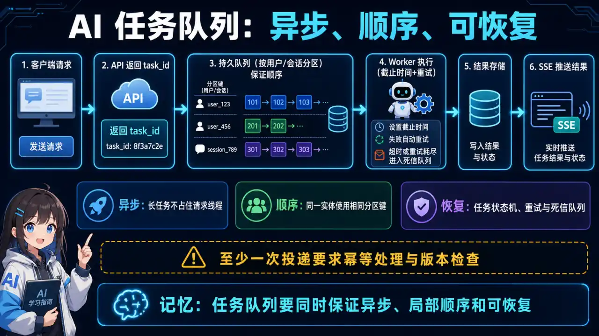
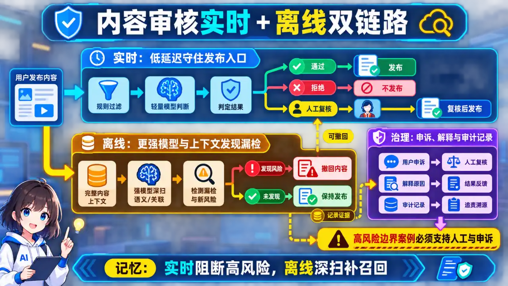
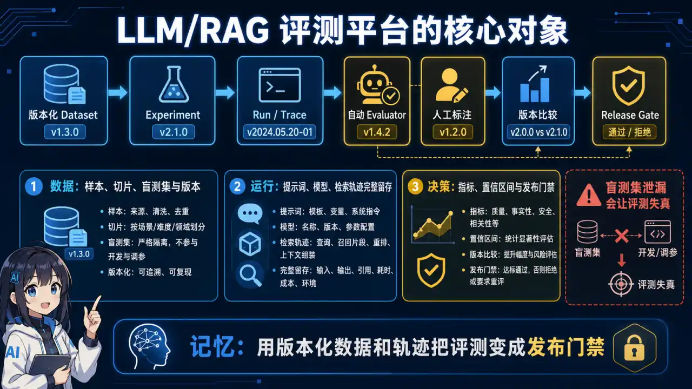
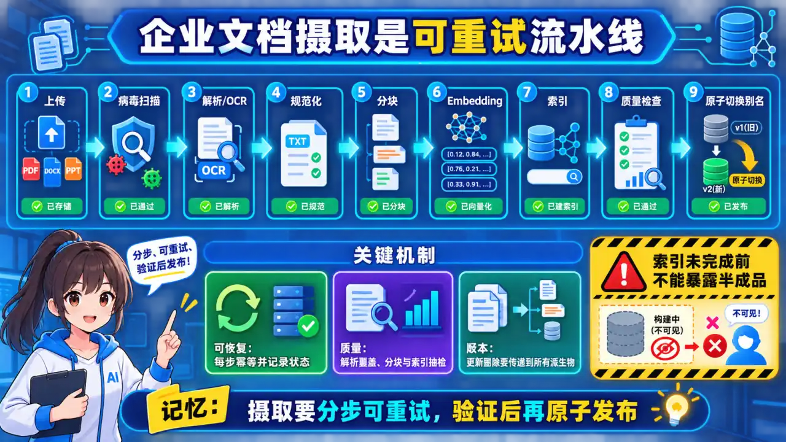
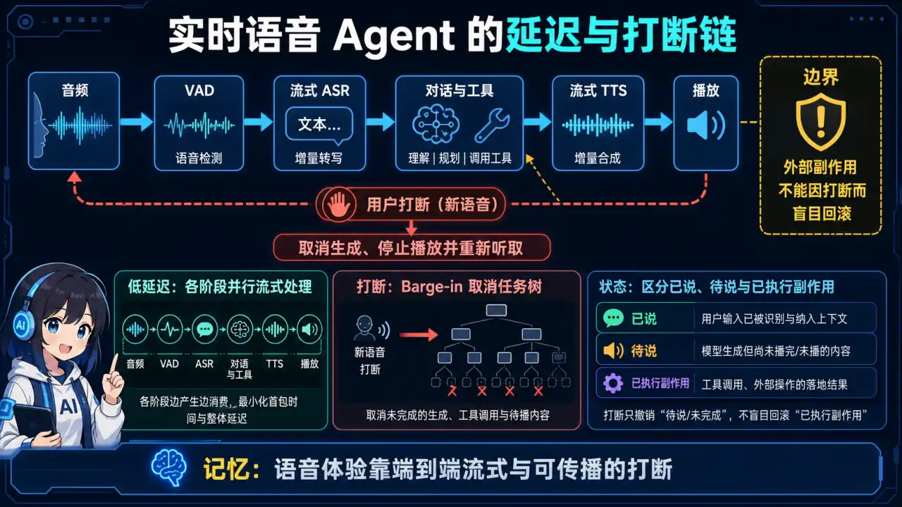
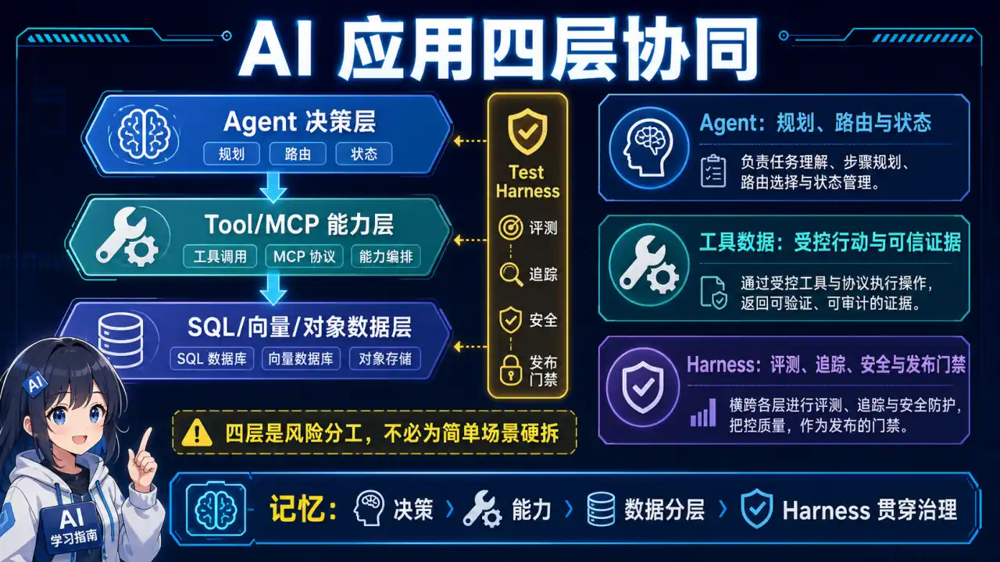
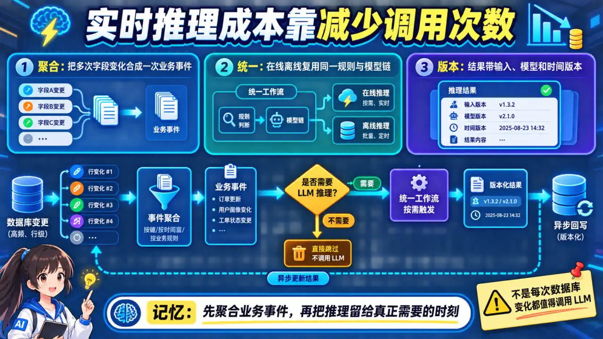

# 📌 AI 场景系统设计

> **面试优先顺序（通用 AI 应用开发岗位）**：Q1、Q2、Q3、Q4、Q5、Q6、Q7、Q8。其余题目用于进阶或特定岗位拓展；实际频率会随岗位和面试轮次变化，产品版本资讯不应当作通用必考题。

> AI 系统设计重点考察容量估算、质量与可靠性边界，以及模型能力不确定时的工程取舍。

## 📋 目录

1. [百万 DAU AI 客服系统](#q1)
2. [企业知识库 RAG 平台](#q2)
3. [LLM API 网关](#q3)
4. [AI 任务队列系统](#q4)
5. [AI 内容审核系统](#q5)
6. [LLM/RAG 评测平台](#q6)
7. [企业文档摄取与索引平台](#q7)
8. [实时语音 Agent](#q8)
9. [AI 应用四层架构协同](#q9)
10. [Agent 实时推理成本控制](#q10)
11. [Go+Python 混合架构](#q11)

---

## 更新记录

| 日期 | 更新内容 |
|------|----------|
| 2026-08-18 | 新增 Q11 Go+Python 混合架构（职责划分 / MCP 工具总线 / 四服务部署 / 跨语言链路追踪） |
| 2026-08-14 | 新增 Q10 Agent 实时推理成本控制（事件聚合 + 在离线统一 Workflow） |
| 2026-08-14 | 新增 Q9 AI 应用四层架构协同（Agent/MCP/数据层/Harness 职责划分与选型路径） |
| 2026-08-12 | 修正容量与成本估算；新增评测、文档摄取和实时语音系统设计 |
| 2026-05-09 | 新增 AI 场景系统设计模块（Q1-Q5）|

---

<a id="q1"></a>

### Q1: 设计一个百万 DAU 的 AI 客服系统（核心高频考题）


<p align="center">
  <a href="../../assets/illustrations/25-system-design-ai/q01-million-dau-customer-service.webp">
    
  </a>
</p>
<p align="center"><sub>🧠 图解记忆：先按意图与风险分流，再用证据和工具完成任务，并以置信度门控人工接管；点击图片可查看原图。</sub></p>
<details>
<summary>💡 答案要点</summary>

**题目理解：**

```
百万 DAU 只描述每天有多少用户，不能直接推出峰值 QPS。面试时应先向面试官确认或声明假设：
- 日活用户：100 万；
- 假设每人每天 5 次请求，则日请求量约 500 万；
- 平均到达率约 `5,000,000 / 86,400 ≈ 58 QPS`；
- 若峰值系数取 5～10，入口峰值约 300～600 QPS；
- 若平均流式会话占用 8 秒，峰值并发连接约为 `QPS × 8`。

这些只是容量估算示例，最终要用真实时段分布、会话长度和重试率校准。
```

**整体架构：**

```
用户请求
    ↓
┌─────────────────────────────────────────────┐
│              CDN / 边缘节点                  │
│         （静态资源 + 就近接入）               │
└─────────────────────────────────────────────┘
    ↓
┌─────────────────────────────────────────────┐
│           负载均衡（Nginx/LB）               │
│        健康检查 + 熔断 + SSL 终结            │
└─────────────────────────────────────────────┘
    ↓
┌─────────────────────────────────────────────┐
│           API 网关层                         │
│    认证鉴权 │ 限流 │ 路由 │ 日志             │
└─────────────────────────────────────────────┘
    ↓
┌─────────────────────────────────────────────┐
│           应用服务层（无状态）                │
│   ┌─────────┐  ┌─────────┐  ┌─────────┐   │
│   │ 服务实例1 │  │ 服务实例2 │  │ 服务实例N │   │
│   └─────────┘  └─────────┘  └─────────┘   │
└─────────────────────────────────────────────┘
    ↓
┌──────────┐  ┌──────────┐  ┌──────────┐
│ LLM 网关  │  │ RAG 服务  │  │ 会话存储  │
│(多模型路由)│  │(知识检索) │  │ (Redis)  │
└──────────┘  └──────────┘  └──────────┘
    ↓
┌──────────┐  ┌──────────┐
│ LLM API  │  │ 知识库   │
│(OpenAI等)│  │(向量数据库)│
└──────────┘  └──────────┘
```

**核心组件设计：**

**1. API 网关（限流 + 鉴权）：**

```python
# 这是“固定窗口计数器”的简化示例，不是令牌桶。
# 生产系统还要处理 Redis 原子性、故障降级和多维配额。
@app.middleware
async def rate_limit_middleware(request: Request, call_next):
    user_id = get_user_id(request)
    
    # 固定窗口：每个用户每秒最多 10 个请求
    key = f"rate_limit:{user_id}"
    allow = await redis.incr(key)
    if allow == 1:
        await redis.expire(key, 1)
    
    if allow > 10:  # 超过每秒 10 请求
        return JSONResponse(
            status_code=429,
            content={"error": "rate limit exceeded"}
        )
    
    return await call_next(request)
```

**2. LLM 网关（多模型路由）：**

```python
class ModelRouter:
    """智能路由：根据请求类型选择最优模型"""
    
    ROUTING_RULES = {
        # 简单问答 → 便宜模型
        "simple_qa": {"model": "gpt-4o-mini", "cost": 0.001},
        # 复杂推理 → 贵但准
        "complex_reasoning": {"model": "gpt-4o", "cost": 0.01},
        # 代码生成 → 代码专用模型
        "code_gen": {"model": "claude-3.5-sonnet", "cost": 0.008},
        # 国内用户 → 国产模型
        "china": {"model": "qwen-plus", "cost": 0.004},
    }
    
    def route(self, request: ChatRequest) -> str:
        # 根据特征路由
        if request.is_code_related:
            return self.ROUTING_RULES["code_gen"]["model"]
        if request.user_region == "china":
            return self.ROUTING_RULES["china"]["model"]
        if request.complexity == "high":
            return self.ROUTING_RULES["complex_reasoning"]["model"]
        return self.ROUTING_RULES["simple_qa"]["model"]
```

**3. RAG 增强（知识库检索）：**

```
用户问题
    ↓
Embedding 模型 → 向量检索（Pinecone/Milvus）
    ↓
Top-K 相关文档 chunks
    ↓
注入 Prompt：[Context] + [用户问题]
    ↓
LLM 生成答案
```

**4. 会话管理（对话上下文）：**

```python
# 对话历史存储：Redis + 定期持久化
class SessionManager:
    def __init__(self, redis_client):
        self.redis = redis_client
        self.MAX_TURNS = 20  # 限制上下文长度
    
    async def get_context(self, session_id: str) -> list[Message]:
        key = f"session:{session_id}"
        history = await self.redis.lrange(key, 0, -1)
        
        # 如果太长，做摘要压缩
        if len(history) > self.MAX_TURNS:
            older = await self.summarize(history[:-self.MAX_TURNS])
            return older + history[-self.MAX_TURNS:]
        
        return [json.loads(m) for m in history]
    
    async def add_message(self, session_id: str, role: str, content: str):
        key = f"session:{session_id}"
        await self.redis.rpush(key, json.dumps({"role": role, "content": content}))
        await self.redis.expire(key, 86400 * 30)  # 30天过期
```

**成本估算方法：**

不要记固定总价。先拆出可测变量：

```text
月请求数 = DAU × 人均请求数 × 30
模型成本 = Σ(输入 token × 对应输入单价 + 输出 token × 对应输出单价)
检索成本 = 查询次数 × 单次检索成本 + 索引存储/构建成本
平台成本 = 网关/应用/队列/缓存/可观测性/带宽/人工审核
```

还要区分缓存读取、缓存写入、重试、工具调用和不同模型路由。模型单价属于时效性数据，应在面试前查询供应商价格页，并说明币种和汇率。

**高可用设计：**

```
多地域部署：
北京 Active ──── 上海 Active
      \           /
       全局流量调度
```

如果设计是 `Active / Standby`，应称为主备灾备，不是多活。多活还需要说明会话、配额、配置和反馈数据如何保持一致，以及区域故障时怎样避免双写冲突。

- **熔断**：下游 LLM 响应慢 → 自动切换备选模型
- **降级**：事实型客服不能简单关闭 RAG 后让通用模型自由回答。可降级到已审核 FAQ、缓存答案、关键词检索、排队或人工客服，并明确告知能力受限。
- **重试**：返回 5xx → 指数退避重试，最多重试 3 次

**面试话术：**

> “我不会从百万 DAU 直接猜 QPS，而是先给出人均请求、峰值系数和会话时长，再分别估算入口 QPS、流式连接数和下游 token 吞吐。架构上把网关、会话、RAG、模型路由和异步工具解耦；降级优先返回已审核内容或转人工，不能牺牲事实安全。最后用容量测试、故障演练和质量回归验证设计。”

</details>

---

*版本: v1.1 | 更新: 2026-05-09 | by 二狗子 🐕*

---

<a id="q2"></a>

### Q2: 设计企业知识库 RAG 平台（多租户 + 权限隔离）


<p align="center">
  <a href="../../assets/illustrations/25-system-design-ai/q02-multitenant-rag-platform.webp">
    
  </a>
</p>
<p align="center"><sub>🧠 图解记忆：租户隔离和文档权限必须在检索前执行，答案引用也要可追溯到授权证据；点击图片可查看原图。</sub></p>
<details>
<summary>💡 答案要点</summary>

**题目理解：**

```
企业知识库 RAG 平台：
- 多租户：多个企业客户共享基础设施，数据隔离
- 权限隔离：租户内成员有不同权限（管理员/编辑/查看）
- 核心挑战：数据隔离 + 检索质量 + 成本控制
```

**整体架构：**

```
租户 A 的用户
    ↓
┌─────────────────────────────────────────────────────┐
│                   API 网关                          │
│         认证 │ 限流 │ 租户路由 │ 权限校验             │
└─────────────────────────────────────────────────────┘
    ↓
┌─────────────────────────────────────────────────────┐
│              租户隔离层（Tenant Isolation）           │
│   租户 A 的数据 ──→ Tenant A Namespace / DB          │
│   租户 B 的数据 ──→ Tenant B Namespace / DB          │
└─────────────────────────────────────────────────────┘
    ↓
┌─────────────────────────────────────────────────────┐
│                  RAG 服务层                         │
│   Chunking │ Embedding │ 向量检索 │ 重排序           │
└─────────────────────────────────────────────────────┘
    ↓
┌─────────────────────────────────────────────────────┐
│         知识库存储层（向量 + 文档 + 图谱）           │
│   Pinecone/Milvus（向量） │ S3（原始文档）│ Neo4j（图谱）│
└─────────────────────────────────────────────────────┘
```

**多租户隔离方案对比：**

| 方案 | 实现 | 优点 | 缺点 | 适用场景 |
|------|------|------|------|----------|
| **共享数据库+租户ID** | 所有租户共用一个 DB，用 tenant_id 过滤 | 成本低、易维护 | 数据泄露风险、查询性能差 | 小规模 (< 100 租户) |
| **独立 Schema** | 每个租户一个 schema | 隔离性好、查询快 | 迁移复杂 | 中等规模 |
| **独立数据库** | 每个租户独立 MySQL/Redis | 完全隔离 | 成本高、维护难 | 大客户、高安全需求 |
| **Namespace 隔离** | 向量数据库用 namespace 隔离 | 实现简单、查询快 | 依赖底层支持 | Pinecone/Weaviate |

<details>
<summary>展开 Python 代码示例（31 行）</summary>

```python
# 多租户向量检索实现
class TenantAwareVectorStore:
    def __init__(self, client, tenant_id: str):
        self.client = client
        self.tenant_id = tenant_id  # 租户 ID
    
    def search(self, query: str, top_k: int = 10) -> list[Document]:
        # 租户隔离：每个租户只检索自己的数据
        results = self.client.query(
            namespace=f"tenant_{self.tenant_id}",  # Namespace 隔离
            vector=self.embed(query),
            top_k=top_k,
            filter={"status": {"$eq": "active"}}  # 只检索激活的文档
        )
        
        # 后处理：权限过滤
        return self.apply_permissions(results)
    
    def apply_permissions(self, results: list[Document]) -> list[Document]:
        """根据用户权限过滤结果"""
        user_role = get_current_user_role()
        
        if user_role == "admin":
            return results  # 管理员看全部
        
        if user_role == "editor":
            # 编辑可看自己和公共文档
            return [d for d in results if d.is_public or d.owner_id == current_user_id]
        
        # 查看者只看公共文档
        return [d for d in results if d.is_public]
```

</details>

**权限模型设计（RBAC + ABAC）：**

```python
# 权限模型：角色 + 操作 + 资源
class Permission:
    READ = "read"
    WRITE = "write"
    DELETE = "delete"
    SHARE = "share"

class Role:
    ADMIN = "admin"       # 全部权限
    EDITOR = "editor"    # 读写
    VIEWER = "viewer"     # 只读

# 知识库权限矩阵
PERMISSION_MATRIX = {
    Role.ADMIN: {Permission.READ, Permission.WRITE, Permission.DELETE, Permission.SHARE},
    Role.EDITOR: {Permission.READ, Permission.WRITE},
    Role.VIEWER: {Permission.READ},
}

def check_permission(role: str, action: str, resource_tenant: str) -> bool:
    """权限校验"""
    if role not in PERMISSION_MATRIX:
        return False
    return action in PERMISSION_MATRIX[role]
```

**企业级 RAG Pipeline：**

```
文档上传
    ↓
┌──────────────────────────────────────────┐
│  文档解析（PDF/Word/Markdown）            │
│  支持表格、图表、公式提取                   │
└──────────────────────────────────────────┘
    ↓
┌──────────────────────────────────────────┐
│  语义 Chunking（不是固定大小！）           │
│  按句子/段落语义边界切分，保留上下文         │
└──────────────────────────────────────────┘
    ↓
┌──────────────────────────────────────────┐
│  Embedding + 元数据标注                   │
│  - 向量化                                 │
│  - 租户 ID                                │
│  - 文档类型（政策/合同/手册）               │
│  - 密级（公开/内部/机密）                   │
└──────────────────────────────────────────┘
    ↓
┌──────────────────────────────────────────┐
│  混合检索（向量 + 关键词）                  │
│  RRF 融合 + 权限过滤                       │
└──────────────────────────────────────────┘
    ↓
答案生成
```

**敏感信息过滤：**

```python
class SensitiveDataFilter:
    """敏感数据过滤（PII 检测）"""
    
    def filter(self, text: str) -> str:
        import re
        # 脱敏规则
        patterns = [
            (r"\d{11}", "【手机号】"),      # 手机号
            (r"\d{18}", "【身份证】"),      # 身份证
            (r"\b[\w.-]+@[\w.-]+\.\w+\b", "【邮箱】"),  # 邮箱
            (r"¥\d+", "【金额】"),            # 金额
        ]
        
        for pattern, replacement in patterns:
            text = re.sub(pattern, replacement, text)
        
        return text
    
    async def filter_document(self, doc: Document) -> Document:
        """过滤文档中的敏感信息"""
        doc.content = self.filter(doc.content)
        doc.chunks = [self.filter(chunk) for chunk in doc.chunks]
        return doc
```

**成本估算（100 租户）：**

| 成本项 | 计算 | 月成本（万元）|
|--------|------|--------------|
| 向量存储 | 100租户 × 100万 chunk × 768维 × $0.25/百万向量/月 | 2.5 |
| 文档存储 | 100租户 × 10GB × $0.02/GB | 20 |
| Embedding API | 100租户 × 1000次/天 × 100 chunk × $0.0001 | 30 |
| LLM 生成 | 100租户 × 1000次/天 × 500 tokens × $0.002/1K | 150 |
| **合计** | | **~200/月** |

**面试话术：**

> "企业知识库 RAG 的核心是'多租户隔离'。我用过三种隔离方案：数据库 schema 隔离（中等规模）、向量 namespace 隔离（大多数场景）、独立数据库（高安全大客户）。权限模型用 RBAC + ABAC 组合——RBAC 控制角色（管理员/编辑/查看），ABAC 控制资源（密级、部门）。PII 脱敏是生产必须的，上传时扫描、脱敏、存储三步走。面试能说清楚'namespace 隔离 + RBAC 权限 + 敏感信息过滤'三件套，说明你对企业级 RAG 有实战理解。"

</details>

---

<a id="q3"></a>

### Q3: 设计一个 LLM API 网关（限流 + 路由 + 计费）


<p align="center">
  <a href="../../assets/illustrations/25-system-design-ai/q03-llm-api-gateway.webp">
    
  </a>
</p>
<p align="center"><sub>🧠 图解记忆：网关统一鉴权、配额、路由和计费，并用降级与观测守住模型依赖的不确定性；点击图片可查看原图。</sub></p>
<details>
<summary>💡 答案要点</summary>

**题目理解：**

```
LLM API 网关：
- 限流：防止用户打爆 API 配额
- 路由：多模型选择、成本优化
- 计费：按使用量收费，支持多租户
- 核心挑战：高并发、低延迟、可观测
```

**整体架构：**

```
外部请求
    ↓
┌──────────────────────────────────────────────────────────┐
│                    API Gateway                           │
│   统一入口 │ TLS 终结 │ 请求日志                          │
└──────────────────────────────────────────────────────────┘
    ↓
┌──────────────────────────────────────────────────────────┐
│                Auth & Rate Limit Layer                   │
│   API Key 验证 │ 令牌桶限流 │ 额度扣减                    │
└──────────────────────────────────────────────────────────┘
    ↓
┌──────────────────────────────────────────────────────────┐
│                  Model Router                            │
│   意图分类 │ 成本优先/质量优先 │ 模型选择                   │
└──────────────────────────────────────────────────────────┘
    ↓
┌──────────────────────────────────────────────────────────┐
│              LLM Provider Adapters                       │
│   OpenAI │ Anthropic │ Azure │ 国内模型 │ 自部署          │
└──────────────────────────────────────────────────────────┘
    ↓
┌──────────────────────────────────────────────────────────┐
│                Usage & Billing                           │
│   用量记录 │ 计费规则 │ 成本分析                          │
└──────────────────────────────────────────────────────────┘
```

**限流实现（令牌桶 + 多维度）：**

<details>
<summary>展开 Python 代码示例（58 行）</summary>

```python
import time
import redis
import hashlib

class RateLimiter:
    """多维度限流：用户 + API Key + IP"""
    
    def __init__(self, redis_client: redis.Redis):
        self.redis = redis_client
    
    async def check_limit(
        self,
        api_key: str,
        requests_per_minute: int = 60,
        tokens_per_minute: int = 60000,
        expected_tokens: int = 1000,
    ) -> tuple[bool, str]:
        """检查限流，返回 (是否允许, 原因)"""
        
        # 1. 请求频率限流（令牌桶）
        req_key = f"rate:req:{api_key}"
        req_allow = await self.redis.evalsha(
            RATE_LIMIT_SCRIPT,
            1, req_key,
            requests_per_minute, 60,  # 每分钟 N 个请求
            time.time()
        )
        if not req_allow:
            return False, "rate_limit:requests"
        
        # 2. Token 限流
        tok_key = f"rate:tok:{api_key}"
        current_tokens = await self.redis.get(tok_key) or 0
        
        if current_tokens + expected_tokens > tokens_per_minute:
            return False, "rate_limit:tokens"
        
        await self.redis.incrby(tok_key, expected_tokens)
        await self.redis.expire(tok_key, 60)  # 1分钟窗口
        
        return True, "ok"


RATE_LIMIT_SCRIPT = """
local key = KEYS[1]
local limit = tonumber(ARGV[1])
local window = tonumber(ARGV[2])
local now = tonumber(ARGV[3])

local current = redis.call('GET', key) or 0
if current >= limit then
    return 0
end

redis.call('INCR', key)
redis.call('EXPIRE', key, window)
return 1
"""
```

</details>

**智能路由（成本 + 质量平衡）：**

<details>
<summary>展开 Python 代码示例（61 行）</summary>

```python
class ModelRouter:
    """模型路由：根据请求特征选择最优模型"""
    
    MODELS = {
        # (max_tokens, quality_score, cost_per_1k)
        "gpt-4o": (128000, 0.95, 0.015),
        "gpt-4o-mini": (128000, 0.85, 0.0015),
        "claude-3.5-sonnet": (200000, 0.93, 0.010),
        "qwen-plus": (131072, 0.80, 0.004),
    }
    
    def route(
        self,
        request: ChatRequest,
        strategy: str = "cost_quality_balance"
    ) -> str:
        """
        路由策略：
        - cost_first: 成本优先
        - quality_first: 质量优先
        - cost_quality_balance: 成本质量平衡
        """
        
        if strategy == "cost_first":
            return self._cheapest_model(request)
        
        if strategy == "quality_first":
            return self._best_quality_model(request)
        
        # 默认：成本质量平衡
        return self._balanced_model(request)
    
    def _balanced_model(self, request: ChatRequest) -> str:
        """综合评分：质量分数 / 成本"""
        # 简单问题 → 便宜模型
        if self._is_simple(request):
            return "gpt-4o-mini"
        
        # 代码相关 → Claude（代码能力强）
        if self._is_code_related(request):
            return "claude-3.5-sonnet"
        
        # 长上下文 → 支持大的模型
        if request.history_length > 20:
            return "claude-3.5-sonnet"
        
        # 中文 + 简单 → 国内模型（成本低）
        if request.language == "zh" and self._is_simple(request):
            return "qwen-plus"
        
        return "gpt-4o"
    
    def _is_simple(self, request: ChatRequest) -> bool:
        """判断是否为简单请求"""
        simple_patterns = ["是什么", "介绍一下", "定义", "时间", "地点"]
        return any(p in request.prompt for p in simple_patterns)
    
    def _is_code_related(self, request: ChatRequest) -> bool:
        """判断是否代码相关"""
        code_patterns = ["代码", "函数", "Python", "Java", "bug", "debug"]
        return any(p in request.prompt.lower() for p in code_patterns)
```

</details>

**计费系统（用量记录 + 扣费）：**

<details>
<summary>展开 Python 代码示例（52 行）</summary>

```python
class BillingService:
    """按量计费服务"""
    
    def __init__(self, db: Database, llm_router: ModelRouter):
        self.db = db
        self.router = llm_router
    
    async def record_usage(self, api_key: str, request: ChatRequest, response: ChatResponse):
        """记录用量并扣费"""
        
        # 计算费用
        model = request.model or self.router.route(request)
        _, quality, cost_per_1k = self.router.MODELS[model]
        
        input_tokens = response.usage.input_tokens
        output_tokens = response.usage.output_tokens
        total_tokens = input_tokens + output_tokens
        
        cost = (total_tokens / 1000) * cost_per_1k
        
        # 写入用量记录
        await self.db.execute("""
            INSERT INTO usage_logs (api_key, model, input_tokens, output_tokens, cost, created_at)
            VALUES ($1, $2, $3, $4, $5, NOW())
        """, api_key, model, input_tokens, output_tokens, cost)
        
        # 扣减账户余额
        await self.db.execute("""
            UPDATE accounts
            SET balance = balance - $1
            WHERE api_key = $2 AND balance >= $1
        """, cost, api_key)
    
    async def get_cost_breakdown(self, api_key: str, start_date: datetime, end_date: datetime) -> dict:
        """获取成本分析"""
        rows = await self.db.fetch("""
            SELECT 
                model,
                SUM(input_tokens) as total_input,
                SUM(output_tokens) as total_output,
                SUM(cost) as total_cost,
                COUNT(*) as request_count
            FROM usage_logs
            WHERE api_key = $1 AND created_at BETWEEN $2 AND $3
            GROUP BY model
        """, api_key, start_date, end_date)
        
        return {
            "total_cost": sum(r["total_cost"] for r in rows),
            "by_model": [dict(r) for r in rows],
            "avg_cost_per_request": sum(r["total_cost"] for r in rows) / max(sum(r["request_count"] for r in rows), 1)
        }
```

</details>

**多租户计费方案：**

| 方案 | 说明 | 适用场景 |
|------|------|----------|
| **预付费套餐** | 买 token 包，用完为止 | 个人用户 |
| **后付费月结** | 按月结算，月底扣费 | 企业客户 |
| **信用额度** | 设置信用额度，超额熔断 | 大客户 |
| **用量分层** | 阶梯定价，用量越大越便宜 | 大客户 |

**面试话术：**

> "LLM API 网关的三大核心能力：限流、路由、计费。限流用令牌桶实现，Redis+Lua 脚本原子操作，支持请求数和 Token 数双维度限流。路由的核心是'让对的模型处理对的任务'——简单问答用 mini 模型（省 10 倍成本），代码生成用 Claude（代码能力强），长上下文用 Claude（200K）。计费用预写日志（WAL）+ 异步扣费，保证数据一致性。面试能说清楚这三件套的实现细节，说明你有 API 服务端开发经验。"

</details>

---

<a id="q4"></a>

### Q4: 如何设计 AI 任务队列系统（避免超时、保证顺序）


<p align="center">
  <a href="../../assets/illustrations/25-system-design-ai/q04-ai-task-queue.webp">
    
  </a>
</p>
<p align="center"><sub>🧠 图解记忆：任务状态要持久化，消费要幂等，重试有上限，失败进入死信并可恢复；点击图片可查看原图。</sub></p>
<details>
<summary>💡 答案要点</summary>

**题目理解：**

```
AI 任务队列：
- 异步处理：AI 生成耗时长，不能同步等
- 避免超时：长任务不超时、不丢失
- 保证顺序：同一用户的请求要按顺序处理
- 核心挑战：可靠性 + 延迟 + 顺序保证
```

**问题分析：**

```
AI 任务的特点：
1. 耗时长（10s-5min）→ 不能同步等 → 必须异步
2. LLM 输出不稳定 → 可能中途失败 → 需要重试
3. 同一用户多请求 → 不能乱序 → 需要顺序保证
4. 结果要推送 → 不能轮询 → 需要 WebSocket/SSE
```

**整体架构：**

```
客户端
   ↓ 发起请求
┌─────────────────────────────┐
│      API 服务                │
│  1. 快速返回 task_id          │
│  2. 写入任务队列              │
│  3. 建立 WebSocket 连接       │
└─────────────────────────────┘
   ↓ 写入
┌─────────────────────────────┐
│     Redis / RabbitMQ         │
│  任务队列 + 顺序保证           │
└─────────────────────────────┘
   ↓ 消费
┌─────────────────────────────┐
│     Worker 集群              │
│  调用 LLM │ 重试 │ 超时处理    │
└─────────────────────────────┘
   ↓ 写入结果
┌─────────────────────────────┐
│     Redis / 数据库            │
│  任务结果存储                  │
└─────────────────────────────┘
   ↓ 推送
WebSocket / SSE → 客户端
```

**实现方案 1：Redis 延迟队列（简单场景）：**

<details>
<summary>展开 Python 代码示例（85 行）</summary>

```python
import redis
import json
import time
import asyncio
from dataclasses import dataclass
from typing import Optional

@dataclass
class AITask:
    task_id: str
    user_id: str
    prompt: str
    priority: int = 0
    created_at: float = None
    
    def __post_init__(self):
        if self.created_at is None:
            self.created_at = time.time()


class AITaskQueue:
    """基于 Redis 的 AI 任务队列"""
    
    def __init__(self, redis_url: str):
        self.redis = redis.from_url(redis_url)
        self.queue_key = "ai:tasks:pending"
        self.processing_key = "ai:tasks:processing"
        self.result_prefix = "ai:tasks:result:"
        self.user_order_prefix = "ai:tasks:user:"
    
    def enqueue(self, task: AITask) -> str:
        """入队，返回 task_id"""
        # 优先级队列：分数 = -priority, timestamp
        score = task.created_at - task.priority * 10000000
        
        self.redis.zadd(self.queue_key, {json.dumps(task.__dict__): score})
        
        # 记录用户的任务顺序
        self.redis.zadd(f"{self.user_order_prefix}{task.user_id}", {task.task_id: task.created_at})
        
        return task.task_id
    
    def dequeue(self, timeout: int = 5) -> Optional[AITask]:
        """出队（阻塞），保证同一用户顺序"""
        # 先尝试获取任务
        result = self.redis.zpopmin(self.queue_key, 1)
        
        if not result:
            # 用 BZPOPMIN 阻塞等待
            result = self.redis.bzpopmin(self.queue_key, timeout)
            if not result:
                return None
        
        task_data = json.loads(result[0])
        task = AITask(**task_data)
        
        # 加入处理中队列（用于超时检测）
        self.redis.zadd(self.processing_key, {task.task_id: time.time()})
        
        return task
    
    def mark_done(self, task_id: str, result: dict):
        """标记任务完成"""
        # 从处理中移除
        self.redis.zrem(self.processing_key, task_id)
        
        # 写入结果
        self.redis.setex(
            f"{self.result_prefix}{task_id}",
            3600,  # 1 小时过期
            json.dumps(result)
        )
    
    def mark_failed(self, task_id: str, error: str):
        """标记任务失败，触发重试"""
        self.redis.zrem(self.processing_key, task_id)
        
        # 重试队列
        self.redis.zadd(self.queue_key, {
            json.dumps({"task_id": task_id, "error": error}): time.time()
        })
    
    def get_result(self, task_id: str) -> Optional[dict]:
        """获取任务结果"""
        return self.redis.get(f"{self.result_prefix}{task_id}")
```

</details>

**实现方案 2：Celery（生产级）：**

<details>
<summary>展开 Python 代码示例（44 行）</summary>

```python
# tasks.py
from celery import Celery
from celery.signals import task_prerun, task_postrun, task_failure

app = Celery('ai_tasks', broker='redis://localhost:6379/0')

@app.task(bind=True, max_retries=3, default_retry_delay=60)
def generate_text_task(self, prompt: str, user_id: str):
    """
    AI 文本生成任务
    - max_retries=3：最多重试 3 次
    - default_retry_delay=60：重试间隔 60 秒
    """
    try:
        # 调用 LLM
        response = llm_client.chat(prompt)
        return {"status": "success", "result": response}
    
    except RateLimitError as exc:
        # 限流错误：60 秒后重试
        raise self.retry(exc=exc, countdown=60)
    
    except TimeoutError as exc:
        # 超时错误：30 秒后重试
        raise self.retry(exc=exc, countdown=30)
    
    except Exception as exc:
        # 其他错误：不重试
        return {"status": "error", "error": str(exc)}


@app.task
def batch_generate_task(prompts: list[str], user_id: str) -> list[dict]:
    """批量生成任务（保证顺序）"""
    results = []
    for i, prompt in enumerate(prompts):
        # 顺序执行（不并发）
        result = generate_text_task.apply(
            args=[prompt, user_id],
            task_id=f"{user_id}:batch:{i}"  # 指定 task_id 保证顺序
        )
        results.append(result)
    
    return results
```

</details>

**超时保证机制：**

<details>
<summary>展开 Python 代码示例（37 行）</summary>

```python
class TimeoutHandler:
    """任务超时处理"""
    
    def __init__(self, queue: AITaskQueue, timeout: int = 300):
        self.queue = queue
        self.timeout = timeout
        self.check_interval = 30  # 每 30 秒检查
    
    async def start(self):
        """启动超时检测"""
        while True:
            await self.check_timeouts()
            await asyncio.sleep(self.check_interval)
    
    async def check_timeouts(self):
        """检查处理超时的任务"""
        processing = self.queue.redis.zrange(
            "ai:tasks:processing", 0, -1, withscores=True
        )
        
        now = time.time()
        for task_id, start_time in processing:
            if now - start_time > self.timeout:
                print(f"Task {task_id} timeout, moving to retry queue")
                
                # 标记超时
                self.queue.mark_failed(task_id, "timeout")
                
                # 增加超时计数
                self.queue.redis.hincrby("ai:tasks:timeout_count", task_id, 1)
                
                # 超时超过 3 次，放弃
                timeout_count = self.queue.redis.hget(
                    "ai:tasks:timeout_count", task_id
                )
                if int(timeout_count or 0) >= 3:
                    await self.notify_user(task_id, "Task failed after 3 retries")
```

</details>

**保证顺序的方案：**

| 方案 | 实现 | 优点 | 缺点 |
|------|------|------|------|
| **单队列 + 单 Worker** | 一个 Worker 串行处理 | 简单、保证顺序 | 吞吐低 |
| **用户分区** | 同一用户路由到同一 Worker | 吞吐 + 顺序 | 负载不均 |
| **版本号乐观锁** | 每个任务带版本号，丢弃旧版本 | 并发高 | 实现复杂 |
| **优先级队列** | 同一用户任务优先级相同 | 灵活 | 需要额外协调 |

**面试话术：**

> "AI 任务队列的核心是'异步 + 顺序 + 超时'。我用的方案是 Redis ZSet 做优先级队列 + 用户分区保证顺序。异步靠任务入队立即返回 task_id，客户端用 WebSocket 订阅结果；顺序靠任务带上版本号，消费时检查版本，过期任务直接丢弃；超时靠独立进程每 30 秒扫描处理中超时任务，超过 3 次超时自动放弃并通知用户。Celery 是生产级首选，它自带重试、死信队列、监控，比手写 Redis 队列稳定。"

</details>

---

<a id="q5"></a>

### Q5: 设计一个 AI 内容审核系统（实时 + 离线双链路）


<p align="center">
  <a href="../../assets/illustrations/25-system-design-ai/q05-content-moderation-dual-path.webp">
    
  </a>
</p>
<p align="center"><sub>🧠 图解记忆：实时链路快速拦截，离线链路深度复核，两者共享策略与反馈；点击图片可查看原图。</sub></p>
<details>
<summary>💡 答案要点</summary>

**题目理解：**

```
AI 内容审核：
- 实时链路：用户发内容 → 立即审核 → 通过/拦截
- 离线链路：历史内容扫描 → 违规内容下架
- 核心挑战：低延迟 + 高准确率 + 可解释
```

**双链路架构：**

```
用户发布内容
    ↓
┌──────────────────────────────────────────────────────────┐
│                  实时审核链路（< 200ms）                  │
│   1. 同步调用 AI 审核模型                                  │
│   2. 立即返回：PASS / REJECT / NEED_REVIEW                │
│   3. 需要人工 → 进入人工审核队列                            │
└──────────────────────────────────────────────────────────┘
    ↓
内容发布（通过审核后）
    ↓
┌──────────────────────────────────────────────────────────┐
│                  离线审核链路（T+1 扫描）                  │
│   1. 定时扫描新发布内容                                     │
│   2. 深度审核（多模型 + 上下文）                            │
│   3. 违规 → 自动下架 + 通知用户                            │
└──────────────────────────────────────────────────────────┘
```

**实时审核链路（< 200ms）：**

<details>
<summary>展开 Python 代码示例（92 行）</summary>

```python
class RealTimeModeration:
    """实时内容审核"""
    
    def __init__(self, model_client, redis_cache):
        self.model = model_client
        self.cache = redis_cache
    
    async def moderate(self, content: str, user_id: str, content_id: str) -> ModerationResult:
        """
        实时审核，返回：
        - PASS: 通过
        - REJECT: 拦截
        - NEED_REVIEW: 需人工复核
        """
        
        start = time.time()
        
        # 1. 缓存检查（同内容24h内已审核）
        cache_key = f"mod:{hashlib.md5(content.encode()).hexdigest()}"
        cached = await self.cache.get(cache_key)
        if cached:
            return ModerationResult.from_json(cached)
        
        # 2. 多维度检测
        checks = await asyncio.gather(
            self.check_text_toxicity(content),      # 文本毒性
            self.check_sensitive_topics(content),   # 敏感话题
            self.check_patterns(content),           # 违规模式（正则）
            self.check_user_history(user_id),       # 用户历史
        )
        
        # 3. 决策
        decision = self.decide(checks)
        
        result = ModerationResult(
            content_id=content_id,
            decision=decision,
            confidence=max(c["confidence"] for c in checks),
            details=checks,
            latency_ms=int((time.time() - start) * 1000)
        )
        
        # 4. 写入缓存
        await self.cache.setex(cache_key, 86400, result.to_json())
        
        return result
    
    async def check_text_toxicity(self, text: str) -> dict:
        """文本毒性检测"""
        response = await self.model.moderate(text=text)
        return {
            "type": "toxicity",
            "score": response["toxicity_score"],
            "confidence": response["confidence"],
            "flagged_categories": response["flagged"]
        }
    
    async def check_sensitive_topics(self, text: str) -> dict:
        """敏感话题检测（政治、色情、暴力等）"""
        # 分层检测：先关键词过滤，再 AI 判断
        keyword_match = self.keyword_filter.match(text)
        if keyword_match:
            return {
                "type": "sensitive_topic",
                "score": 0.99,
                "confidence": 1.0,
                "flagged_categories": keyword_match.categories
            }
        
        # AI 细判
        ai_result = await self.model.analyze_topics(text)
        return {
            "type": "sensitive_topic",
            "score": ai_result["risk_score"],
            "confidence": ai_result["confidence"],
            "flagged_categories": ai_result["categories"]
        }
    
    def decide(self, checks: list[dict]) -> str:
        """综合决策"""
        
        # 硬规则：任意一项高置信度命中 → 直接拦截
        for check in checks:
            if check["score"] > 0.9 and check["confidence"] > 0.95:
                return "REJECT"
        
        # 中等风险 → 人工复核
        for check in checks:
            if check["score"] > 0.6:
                return "NEED_REVIEW"
        
        return "PASS"
```

</details>

**离线审核链路（T+1 全量扫描）：**

<details>
<summary>展开 Python 代码示例（84 行）</summary>

```python
class OfflineModeration:
    """离线内容审核"""
    
    def __init__(self, db, model_client, notification_service):
        self.db = db
        self.model = model_client
        self.notify = notification_service
    
    async def daily_scan(self):
        """每日全量扫描"""
        print("Starting daily offline moderation scan...")
        
        # 1. 获取昨日新发布内容
        yesterday_content = await self.fetch_yesterday_content()
        print(f"Found {len(yesterday_content)} content to scan")
        
        # 2. 分批处理（避免内存爆炸）
        batch_size = 100
        for i in range(0, len(yesterday_content), batch_size):
            batch = yesterday_content[i:i+batch_size]
            await self.process_batch(batch)
    
    async def process_batch(self, batch: list[Content]):
        """批量深度审核"""
        
        # 1. 并发审核（离线不要求低延迟）
        results = await asyncio.gather(*[
            self.deep_moderate(content) for content in batch
        ])
        
        # 2. 汇总结果
        for content, result in zip(batch, results):
            if result.decision == "REMOVE":
                await self.remove_content(content, result)
    
    async def deep_moderate(self, content: Content) -> ModerationResult:
        """
        深度审核（离线链路）：
        - 调用更强的模型
        - 检查上下文（回复关系）
        - 检查账号历史
        """
        
        # 1. 调用更准确的审核模型
        text_to_check = content.text
        
        # 2. 如果是回复，检查上下文
        if content.reply_to_id:
            parent = await self.db.get_content(content.reply_to_id)
            text_to_check = f"[原帖]{parent.text}\n[回复]{content.text}"
        
        # 3. 多标签分类
        multi_label = await self.model.multi_label_classify(text_to_check)
        
        # 4. 组合判断
        risk_score = self.calculate_risk_score(multi_label)
        
        return ModerationResult(
            content_id=content.id,
            decision="REMOVE" if risk_score > 0.7 else "PASS",
            risk_score=risk_score,
            details=multi_label
        )
    
    async def remove_content(self, content: Content, result: ModerationResult):
        """下架违规内容"""
        
        # 1. 标记为已下架
        await self.db.update_content_status(content.id, "removed")
        
        # 2. 通知用户
        await self.notify.send(
            user_id=content.user_id,
            title="内容下架通知",
            body=f"您的内容因{result.details['primary_reason']}已被下架"
        )
        
        # 3. 记录审计日志
        await self.db.insert_audit_log(
            action="content_removed",
            content_id=content.id,
            reason=result.details,
            auto=True  # 自动下架 vs 人工下架
        )
```

</details>

**人工审核队列（人机协作）：**

<details>
<summary>展开 Python 代码示例（54 行）</summary>

```python
class HumanReviewQueue:
    """人工审核队列"""
    
    def __init__(self, db, queue_name: str = "moderation:review"):
        self.db = db
        self.queue = queue_name
    
    async def push_for_review(self, task: dict):
        """人工审核任务入队"""
        priority = self._calculate_priority(task)
        
        await self.db.execute("""
            INSERT INTO review_queue (task_data, priority, created_at)
            VALUES ($1, $2, NOW())
        """, json.dumps(task), priority)
    
    async def pop_task(self, reviewer_id: str) -> dict:
        """审核员抢任务"""
        async with self.db.transaction():
            # 抢任务（乐观锁）
            row = await self.db.fetchrow("""
                UPDATE review_queue
                SET status = 'in_progress',
                    reviewer_id = $1,
                    started_at = NOW()
                WHERE id = (
                    SELECT id FROM review_queue
                    WHERE status = 'pending'
                    ORDER BY priority DESC, created_at ASC
                    LIMIT 1
                    FOR UPDATE SKIP LOCKED
                )
                RETURNING *
            """, reviewer_id)
        
        return json.loads(row["task_data"]) if row else None
    
    def _calculate_priority(self, task: dict) -> int:
        """计算优先级"""
        base = 100
        
        # 高风险内容优先
        if task.get("risk_score", 0) > 0.8:
            base += 50
        
        # VIP 用户的内容优先审核
        if task.get("is_vip", False):
            base += 20
        
        # 粉丝多的账号优先
        if task.get("follower_count", 0) > 100000:
            base += 10
        
        return base
```

</details>

**面试话术：**

> "内容审核的双链路设计是核心：实时链路要求 < 200ms，用轻量模型 + 缓存 + 规则过滤，结果分 PASS/REJECT/NEED_REVIEW 三档；离线链路做 T+1 深度扫描，用更强模型 + 上下文分析，可以容忍更高延迟。人工复核队列用优先级队列，高风险 + 大V 内容优先处理。审核系统的可解释性很重要——不仅要判断违规，还要告诉审核员为什么违规，方便人工复核。面试能说清楚实时+离线的分层设计，说明你对'可靠系统 = 实时优先 + 离线兜底'有实战理解。"

</details>

---

*版本: v1.1 | 更新: 2026-05-09 | by 二狗子 🐕*

<a id="q6"></a>

### Q6: 设计一个 LLM/RAG 评测平台


<p align="center">
  <a href="../../assets/illustrations/25-system-design-ai/q06-evaluation-platform.webp">
    
  </a>
</p>
<p align="center"><sub>🧠 图解记忆：核心对象包括 Dataset、Example、Experiment、Run、Trace、Evaluator 和 Annotation；点击图片可查看原图。</sub></p>
<details>
<summary>💡 答案要点</summary>

核心对象包括 Dataset、Example、Experiment、Run、Trace、Evaluator 和 Annotation。平台需要保存模型/Prompt/检索配置版本，支持离线批量运行、在线采样评估、人工标注和实验对比。

关键设计点：

- 数据集按权限和用途隔离，保留盲测集并记录 lineage；
- 任务执行使用队列、幂等键、限额和断点续跑；
- 评估器支持代码规则、人工和校准后的 LLM Judge；
- 结果按切片比较，展示置信区间，而不是只给平均分；
- Trace 中的敏感输入需要脱敏、加密和保留期限；
- 发布门禁引用固定实验和阈值，所有变更可审计。

</details>

<a id="q7"></a>

### Q7: 设计一个大规模企业文档摄取与索引平台


<p align="center">
  <a href="../../assets/illustrations/25-system-design-ai/q07-document-ingestion-platform.webp">
    
  </a>
</p>
<p align="center"><sub>🧠 图解记忆：将上传、病毒扫描、解析/OCR、标准化、分块、Embedding、索引和质量校验拆成可重试阶段；点击图片可查看原图。</sub></p>
<details>
<summary>💡 答案要点</summary>

将上传、病毒扫描、解析/OCR、标准化、分块、Embedding、索引和质量校验拆成可重试阶段。每个阶段以 `tenant_id + document_id + version + stage` 作为幂等键，原文、解析结果和索引版本分开保存。

更新时使用新版本旁路构建，校验文档数、chunk 数、权限和抽样检索后再原子切换 alias；删除需要传播到原文、倒排、向量和缓存。失败进入死信队列，支持从最近成功阶段续跑，并监控积压、解析失败率、索引新鲜度和孤儿 chunk。

</details>

<a id="q8"></a>

### Q8: 设计一个实时语音 Agent


<p align="center">
  <a href="../../assets/illustrations/25-system-design-ai/q08-realtime-voice-agent.webp">
    
  </a>
</p>
<p align="center"><sub>🧠 图解记忆：链路包括音频接入、VAD、流式 ASR、对话/工具、流式 TTS 和打断控制；点击图片可查看原图。</sub></p>
<details>
<summary>💡 答案要点</summary>

链路包括音频接入、VAD、流式 ASR、对话/工具、流式 TTS 和打断控制。系统设计要给每段分配延迟预算，并处理半双工/全双工、barge-in、回声、静音、网络抖动和多语言。

会话状态和工具副作用必须支持取消：用户打断时停止 TTS 和不再需要的模型生成，但已经提交的非幂等工具不能盲目撤销。质量指标除任务成功外，还包括端到端首音延迟、打断成功率、ASR 错误、静音误判、重复播报和转人工率。

</details>

---

<a id="q9"></a>

### Q9: AI 应用的四层架构（Agent + 工具层 + 数据层 + Harness）如何协同？怎么选型？


<p align="center">
  <a href="../../assets/illustrations/25-system-design-ai/q09-four-layer-ai-architecture.webp">
    
  </a>
</p>
<p align="center"><sub>🧠 图解记忆：Agent 管决策，工具管确定性动作，数据层管事实，Harness 负责约束与验证；点击图片可查看原图。</sub></p>
> 2026 年面试高频架构题：面试官拿"你做的 AI 项目架构分几层、为什么这么分"来考察系统思维。社区流行的说法是"四层架构"，但这是经验总结、不是官方标准——能给出分层、还能说清每层什么时候可以砍，才是高分回答。

<details>
<summary>💡 答案要点</summary>

**先纠偏两个常见误区：**

1. 四层架构是**工程经验分层**，不是官方标准，也没有唯一答案；面试重点是"职责划分清晰 + 能说明取舍"。
2. 常说的"SQL 层"实际是**数据层**——SQL 只是其中一种存储。结构化数据用 SQL、非结构化知识用向量库、日志/文档用对象存储，别把数据层窄化成 SQL。

**四层职责：**

```
┌─────────────────────────────────────────────────────┐
│  Agent 层（决策调度）                                  │
│  意图理解、任务规划、工具选择、多步执行、结果组装       │
├─────────────────────────────────────────────────────┤
│  工具层（能力接入）                                    │
│  MCP/Function Calling：统一协议连接外部能力            │
│  查库、发消息、调第三方 API、执行计算                  │
├─────────────────────────────────────────────────────┤
│  数据层（知识/事实供给）                               │
│  SQL（结构化业务数据）+ 向量库（非结构化知识）          │
│  + 缓存/对象存储，配合 RAG 管道                        │
├─────────────────────────────────────────────────────┤
│  Harness 层（横切：安全 + 评测）                       │
│  权限管控、沙箱隔离、审计日志、评测集、灰度回归         │
└─────────────────────────────────────────────────────┘
```

**一次完整请求的协同时序：**

```
1. 用户请求 → Agent 层：意图识别、拆解任务
2. Agent 决定调工具 → 经 Harness 校验（白名单 + 权限 + 沙箱）
3. 工具层执行：数据层读知识（RAG 检索）/ 读业务数据（SQL）/ 调外部 API
4. 结果回填上下文 → Agent 继续规划或组装回复
5. 全程结构化日志 → Harness 评测/审计，线上反馈回流评测集
```

**选型：什么时候砍层（MVP 思路，面试加分项）：**

| 场景 | 可以砍掉/简化的层 | 理由 |
|------|------------------|------|
| 单场景 POC | Harness 简化为日志 + 手工回归 | 没有多用户/多工具，安全面小 |
| 直连少量工具 | MCP 简化为 Function Calling | 工具 < 5 个、单模型，标准化收益不明显 |
| 纯知识问答 | 工具层可后置 | 先 RAG 跑通，再补工具调用 |
| 纯流程执行 | 数据层简化为 SQL 直查 | 不需要向量检索 |

**反向逻辑（什么时候必须四层齐全）：**

```
工具数多（>10）→ MCP 统一接入，否则每个工具一套适配代码
多模型/多应用共享工具 → MCP，一次实现多处复用
Agent 有写操作/外发能力 → Harness 必须上：权限 + 人审 + 审计
知识 + 业务数据混合 → 数据层拆两层：向量库 + SQL 各司其职
```

**面试话术：**
> "我把 AI 应用拆成四层：Agent 层做决策调度，工具层用 MCP 统一接外部能力，数据层按数据形态分 SQL 和向量库，Harness 是横切层管安全沙箱和评测。但四层不是标配，是经验分层——MVP 我会按风险砍层：单场景先不做 Harness，工具少就先 Function Calling，等工具多了再迁 MCP。什么时候必须四层齐全：工具多、有写操作、多租户，那安全和标准化一个都不能少。"

</details>

---

*内容治理: 2026-08-14 | 新增 Q9 四层架构协同题；架构为经验分层而非官方标准，避免教条化*

---

<a id="q10"></a>

### Q10: Agent 实时推理成本怎么控制？万级 QPS 的数据变更如何用大模型处理？（高级区分题）


<p align="center">
  <a href="../../assets/illustrations/25-system-design-ai/q10-realtime-inference-cost.webp">
    
  </a>
</p>
<p align="center"><sub>🧠 图解记忆：高频变更先规则过滤、聚合去重和异步批处理，只把高价值不确定样本交给大模型；点击图片可查看原图。</sub></p>
> 2026 年 AI Agent 岗最能刷人的题：面试官问的不是“你怎么调 RAG”，而是“万级 QPS 的写入变更，你不可能每条都调一次大模型吧？推理成本怎么控？”。这题考的是工程化落地能力——高级工程师和初级工程师的分水岭。

<details>
<summary>💡 答案要点</summary>

**问题本质：** 实时推理成本 = 调用次数 × 单次成本。控制成本的核心不是压单价，而是**减少不必要的调用次数**——不是每条数据变更都值得让大模型推理一次。

**第一板斧：事件聚合（把变更聚合到有业务意义的粒度）**

```
原始链路（灾难）：
数据库一行数据变了 → 触发一次处理 → 万级 QPS 写入 → ETL 链路放大到数十万行变更

优化链路（事件聚合）：
把行级变更聚合成“业务事务维度” → 基于 业务ID + 事务ID 做变更聚合
→ 秒级要处理的事务量级降一个数量级 → 再决定要不要推理、怎么推理

原理：用户真正关心的是“商品 A 的最终状态”，不是中间 50 次字段变更。
中间过程全部聚合掉，只对最终状态推理。
```

**第二板斧：在离线统一（一套 Workflow，两个入口）**

```
错误做法：离线用批处理（ODPS/Spark），在线用实时接口，两套代码分开维护
→ 逻辑不一致、结果不一致、排查问题难

正确做法：离线和在线统一成一套 Workflow，由统一编排服务驱动：
- 离线批量推理：调度任务定时触发
- 在线增量推理：实时事件驱动
- 两种模式共享同一套工作流逻辑，只是入口不同

技术含量：把“触发源差异”和“计算资源差异”屏蔽掉，上层业务只关心业务逻辑。
```

**第三板斧：异步推理 + 一致性处理（面试官必追问）**

> 追问：商品信息变更后，用户搜索时还没推理完，搜出来的结果不对怎么办？

```
方案组合：
1. 返回旧值 + 标记“更新中”（体验优先）
2. 队列顺序保证：同一条数据的变更按序处理，避免乱序覆盖
3. 版本号乐观锁：推理结果带上数据版本，旧版本结果直接丢弃
4. 最终一致：允许短暂不一致，但保证收敛（看业务容忍度）
```

**成本控制组合拳（完整回答）：**

| 手段 | 作用 | 优先级 |
|------|------|--------|
| 事件聚合 | 减少调用次数（降一个数量级） | 必做 |
| 异步批处理 | 削峰填谷，摊平成本 | 必做 |
| 语义缓存 | 相同/相似问题直接命中 | 高频场景做 |
| 模型路由 | 简单问题用小模型，复杂才用大模型 | 有模型矩阵时做 |
| 在离线统一 | 避免两套逻辑双倍维护成本 | 规模大必做 |

**面试话术：**
> “实时推理成本控制我抓三个点：第一，事件聚合——把行级变更聚合成业务事务维度再决定要不要推理，调用次数直接降一个数量级，不是每条变更都调大模型；第二，在离线统一——一套 Workflow 两个入口，离线调度触发、在线事件驱动，共享同一套逻辑，避免两套代码结果不一致；第三，一致性兜底——异步推理期间先返回旧值并标记更新中，同一条数据按序处理，推理结果带版本号防乱序覆盖。再加语义缓存和模型路由摊平成本。面试官追问‘推理没完成结果不对’，答出这三板斧基本就稳了。”

</details>

---

<a id="q11"></a>

### Q11: Go 后端 + Python AI 服务混合架构怎么设计？为什么 Go 负责业务、Python 负责 AI 编排？

> 后端转 AI 的必考题：你既有 Go 业务经验又有 AI 经验，那两者怎么组织？混合架构的职责划分、通信方式、部署形态，答得清楚就是"后端经验是优势"的最佳证明。

<details>
<summary>💡 答案要点</summary>

**核心认知：** 企业级 AI 应用落地时，业务系统（用户、订单、权限、数据）大多在 Go/Java，AI 生态（模型 SDK、LangGraph、评测工具）在 Python。硬选一边都吃亏，混合架构是常态。

**职责划分：**

```
Go（业务底座）                     Python（AI 编排）
├─ 业务接口：客户/案件/合同/任务    ├─ 模型生态：OpenAI/本地模型 SDK
├─ 数据与规则：MySQL、事务、幂等    ├─ Skill：能力封装与版本管理
├─ 权限与审计：谁能调什么、留痕     ├─ Agent：LangGraph 编排、状态流转
└─ MCP 工具封装：业务能力变工具     ├─ 评测：Eval / 回归 / 灰度
                                  └─ 运行时：流式输出、重试、熔断

一句话：Go 管"稳定"，Python 管"智能"。
```

**为什么这么分（选型理由）：**

| 维度 | Go | Python |
|------|----|--------|
| 业务系统 | 存量系统就是 Go/Java，重写成本极高 | 重写不现实 |
| 性能/高并发 | 高并发、低延迟、类型安全 | 不适合扛核心业务流量 |
| AI 生态 | SDK/框架少，社区滞后 | 模型、Agent、评测工具全在 Python |
| 迭代速度 | 稳定优先，变更谨慎 | AI 能力迭代快，试错成本低 |
| 风险 | 写 AI 编排生态太薄 | 写业务稳定性风险高 |

**通信方式（关键设计）：**

- **HTTP**：业务 API（前端 → Go 网关，鉴权、限流）；
- **MCP 工具总线**：Python Agent 通过 MCP 调 Go 封装的业务工具（客户/案件/合同/任务），工具带 JSON Schema、权限、幂等——两边通过协议解耦，AI 团队不碰业务库；
- **消息队列**（规模大时）：异步任务（如质检转写、批量文书）走 MQ 削峰。

**部署形态（Docker Compose 四服务）：**

```
frontend / Nginx        → 静态资源 + 反向代理
Go Backend (Gin)        → 业务 API + MCP Server（工具封装）
Agent (FastAPI + MCP)   → AI 编排 + Skill + 评测（内网）
MySQL                   → 业务数据 + 任务状态 + 审计（内网）
```

**一次完整请求的数据流：**

```
前端 → Go 网关（鉴权/限流）→ Python Agent（规划）
  → MCP 调 Go 工具（鉴权/幂等/执行）→ MySQL
  → 结果回传 Agent 继续编排 → 流式返回前端
  → 全程 trace_id 跨语言链路（OpenTelemetry）
```

**坑与边界（加分点）：**

1. **跨语言链路追踪**：trace_id 要在 Go/Python 间传递，统一用 OpenTelemetry，否则排查问题断链；
2. **错误语义统一**：Go 返回的结构化错误码，Python 侧要能理解（RETRYABLE/NON_RETRYABLE），否则 Agent 瞎重试；
3. **双团队协作边界**：接口契约先行（工具 Schema / API 文档），两边并行开发，联调成本才可控。

**面试话术：**
> "我的混合架构原则是：Go 管稳定，Python 管智能。Go 负责业务接口、数据、规则和 MCP 工具封装——高并发、事务、幂等、鉴权都在这一层；Python 负责模型生态、Skill、LangGraph 编排和评测。两边通过 MCP 工具总线通信，Python Agent 自动发现 Go 封装的工具，按 Schema 调用，AI 团队全程不碰业务库。部署上 Docker Compose 四个服务：前端、Go 后端、Python Agent、MySQL。后端经验不是包袱而是地基——接口设计、权限、幂等、审计这些能力恰恰是 AI 应用最缺的。跨语言的关键是链路追踪用 OpenTelemetry 打通、错误码语义统一，这两点不解决，联调就是灾难。"

</details>

---

*内容治理: 2026-08-18 | 新增 Q11 Go+Python 混合架构题（职责划分/MCP 工具总线/四服务部署/跨语言链路）；素材角度：企业级 AI 应用工程链路，已按仓库规范重写*

---
