# 🧭 FDE（Forward Deployed Engineer）面试题

> **面试优先顺序（通用 AI 应用开发岗位）**：Q3、Q4、Q5、Q7、Q8、Q10、Q11、Q13、Q14、Q15、Q16、Q17、Q18、Q21、Q26、Q28、Q30。其余题目用于进阶或特定岗位拓展；实际频率会随岗位和面试轮次变化，产品版本资讯不应当作通用必考题。

> FDE 的核心不是“给客户演示 AI”，而是进入客户真实环境，从模糊问题出发，完成需求发现、方案设计、编码集成、生产上线、采用推广和反馈闭环。

## 来源与适用范围

本页不是任何公司的内部题库。“高频”表示某类能力同时反复出现在多家 FDE 官方职位描述和公开候选人面试记录中，并不表示每家公司都会逐字提问。

- OpenAI 的 FDE 职位把工作范围描述为 discovery、technical scoping、system design、build 和 production rollout，并用生产采用、工作流影响及 eval 驱动的反馈衡量结果。[来源](https://openai.com/careers/forward-deployed-engineer-%28fde%29-seattle-seattle/)
- Palantir 的 FDSE 职位强调从开放业务问题出发，直接与客户合作，承担数据、应用、架构和端到端交付。[来源](https://jobs.lever.co/palantir/c4442730-2926-41ad-8c0e-5e5a6b4d14ae)
- AI 原生公司的 FDE 职位进一步强调 Agent、RAG、评测，以及 VPC、混合云和本地部署。[Reflection AI](https://jobs.ashbyhq.com/reflectionai/8b97b583-3cc6-4834-ae2c-d5aecf22ed7d/) · [Handshake](https://jobs.ashbyhq.com/handshake/c91b7ebf-2c69-4d91-809d-a30ea0b9dc18) · [Cartesia](https://jobs.ashbyhq.com/cartesia/6d860f5a-b9d9-4df2-b5e5-b12ac80632a4)
- 公开面试整理与候选人记录中常见 coding、decomposition、learning/陌生代码、system design 和客户情境环节。具体流程随公司、级别和团队变化。[Palantir 官方面试准备入口](https://www.palantir.com/careers/getting-hired/) · [公开流程整理](https://www.tryexponent.com/guides/palantir-forward-deployed-engineer-interview) · [候选人记录](https://www.reddit.com/r/csMajors/comments/1plags8/palantir_fdse_full_interview_loop_process/)

## 常见考察结构

| 能力 | 面试官想确认什么 |
|---|---|
| 问题发现与拆解 | 能否把“我们想用 AI”变成用户、流程、约束和可验证目标 |
| 工程与 AI 系统设计 | 能否设计可以接入现有系统、可评测、可回滚的生产方案 |
| 编码与调试 | 能否在陌生代码、脏数据和变化需求下写出可靠实现 |
| 客户与项目推进 | 能否处理承诺、冲突、范围、采用和高压事故 |
| 产品化反馈 | 能否区分一次性定制与可复用能力，把现场信号反馈给产品 |

## 目录

1. [岗位理解与需求发现](#一岗位理解与需求发现)
2. [问题拆解与方案设计](#二问题拆解与方案设计)
3. [AI 生产系统与评测](#三ai-生产系统与评测)
4. [编码、数据与现场调试](#四编码数据与现场调试)
5. [客户沟通、交付与行为面试](#五客户沟通交付与行为面试)

---

## 一、岗位理解与需求发现

### Q1: FDE 与后端工程师、解决方案架构师和咨询顾问有什么区别？


<p align="center">
  <a href="../../assets/illustrations/26-forward-deployed-engineer/q01-fde-role-boundary.webp">
    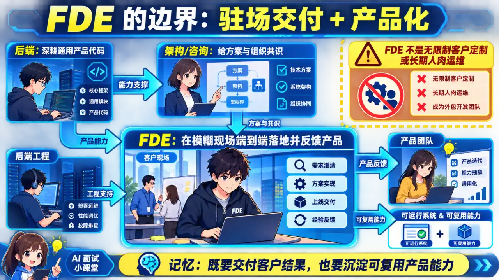
  </a>
</p>
<p align="center"><sub>🧠 图解记忆：FDE 是以客户业务结果为目标、仍然直接写生产代码的工程岗位；点击图片可查看原图。</sub></p>
<details>
<summary>💡 答案要点</summary>

**30 秒回答：**

FDE 是以客户业务结果为目标、仍然直接写生产代码的工程岗位。后端工程师通常围绕通用产品边界长期建设；解决方案架构师更多给出架构建议和最佳实践；咨询顾问偏业务分析与组织推进。FDE 要把这几种能力连接起来，但不能因为“客户现场”就降低工程质量。

**可以从四个维度比较：**

| 维度 | FDE 的典型特点 |
|---|---|
| 目标 | 客户工作流产生可验证结果，而不只是交付功能 |
| 边界 | 从 discovery 到生产采用，范围跨产品、数据和集成 |
| 产出 | 代码、数据管道、评测、部署方案、操作手册和产品反馈 |
| 约束 | 需求模糊、时间紧、客户基础设施复杂、利益相关者多 |

**常见误区：**

- 把 FDE 说成“高级售前”：忽略了生产编码和长期运行责任；
- 把 FDE 说成“外包开发”：忽略了问题选择、产品反馈和复用能力；
- 只强调快速交付：没有安全、质量、可维护性和退出方案。

</details>

### Q2: 为什么想做 FDE，而不是纯产品研发或纯解决方案岗位？


<p align="center">
  <a href="../../assets/illustrations/26-forward-deployed-engineer/q02-fde-motivation.webp">
    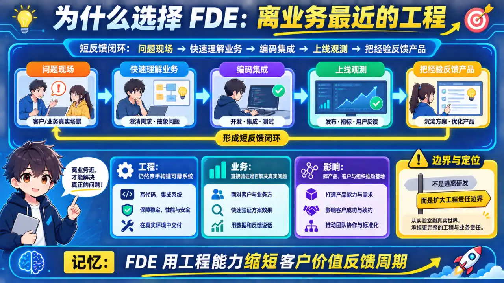
  </a>
</p>
<p align="center"><sub>🧠 图解记忆：回答应证明岗位匹配，而不是说“FDE 更热门”；点击图片可查看原图。</sub></p>
<details>
<summary>💡 答案要点</summary>

回答应证明岗位匹配，而不是说“FDE 更热门”。建议覆盖：

1. **动机**：喜欢直接理解用户工作流，并看到代码是否真正被采用；
2. **证据**：举一个同时包含工程实现、需求澄清和跨团队推进的真实经历；
3. **取舍**：明确知道 FDE 需要频繁切换上下文、面对不完整信息，部分岗位还需要出差或驻场；
4. **长期价值**：希望把单个客户中验证过的模式沉淀成平台能力，而不是永远做一次性定制。

不要虚构客户经历。没有正式客户项目时，可以使用校内项目、开源协作、内部平台或跨部门交付作为证据，但要准确说明场景。

</details>

### Q3: 客户第一次会议只说“我们想用大模型降本”，你会问什么？


<p align="center">
  <a href="../../assets/illustrations/26-forward-deployed-engineer/q03-discovery-questions.webp">
    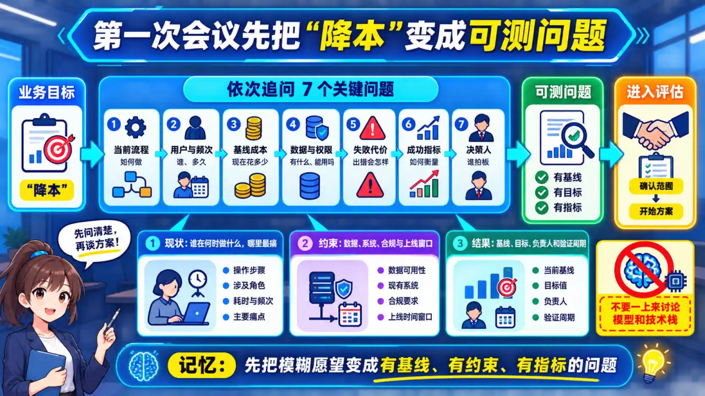
  </a>
</p>
<p align="center"><sub>🧠 图解记忆：先理解当前流程，不要直接推荐 Agent 或 RAG；点击图片可查看原图。</sub></p>
<details>
<summary>💡 答案要点</summary>

先理解当前流程，不要直接推荐 Agent 或 RAG。

**发现框架：**

1. **用户与任务**：谁在什么场景完成什么任务？频率和峰值如何？
2. **当前基线**：耗时、人工成本、错误类型、返工率和 SLA 是什么？
3. **输入与系统**：数据在哪里，格式怎样，涉及哪些 API、权限和人工步骤？
4. **风险边界**：哪些错误可以容忍，哪些必须拦截或人工批准？
5. **价值与负责人**：谁拥有预算，谁验收，最终用户是否愿意改变工作方式？
6. **时间与约束**：试点期限、部署环境、合规、数据驻留和采购限制是什么？

会议结束前输出一页共识：问题陈述、当前基线、假设、未知项、试点范围、责任人和下一步。若连基线与用户都无法确认，应先做流程调研，而不是承诺效果。

</details>

### Q4: 如何从多个候选场景中选择第一个 AI 试点？


<p align="center">
  <a href="../../assets/illustrations/26-forward-deployed-engineer/q04-ai-pilot-selection.webp">
    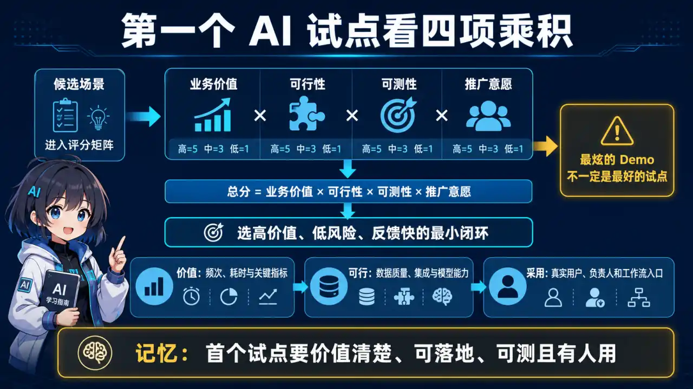
  </a>
</p>
<p align="center"><sub>🧠 图解记忆：可用一个透明的评分表，而不是选择“看起来最炫”的场景；点击图片可查看原图。</sub></p>
<details>
<summary>💡 答案要点</summary>

可用一个透明的评分表，而不是选择“看起来最炫”的场景：

```text
候选优先级 = 业务价值 × 可采用性 × 技术可行性 ÷ 风险与交付成本
```

重点评估：任务频率、当前痛点、数据可得性、结果可评测性、错误后果、系统集成难度、业务负责人和推广路径。

第一个试点通常应具备“小范围、反馈快、价值可测、失败可逆”。高风险自动决策、没有历史数据、没有业务 owner 或需要同时改造多个核心系统的场景，不适合作为首个试点。

**追问：试点容易但价值很小怎么办？**

把试点看作验证关键假设的实验。它至少要验证一项能降低后续大场景风险的能力，例如权限检索、工具调用可靠性或用户采用，而不是只做一个无后续价值的 Demo。

</details>

### Q5: 你如何定义 POC 成功，避免“Demo 很惊艳，上线没人用”？


<p align="center">
  <a href="../../assets/illustrations/26-forward-deployed-engineer/q05-poc-success.webp">
    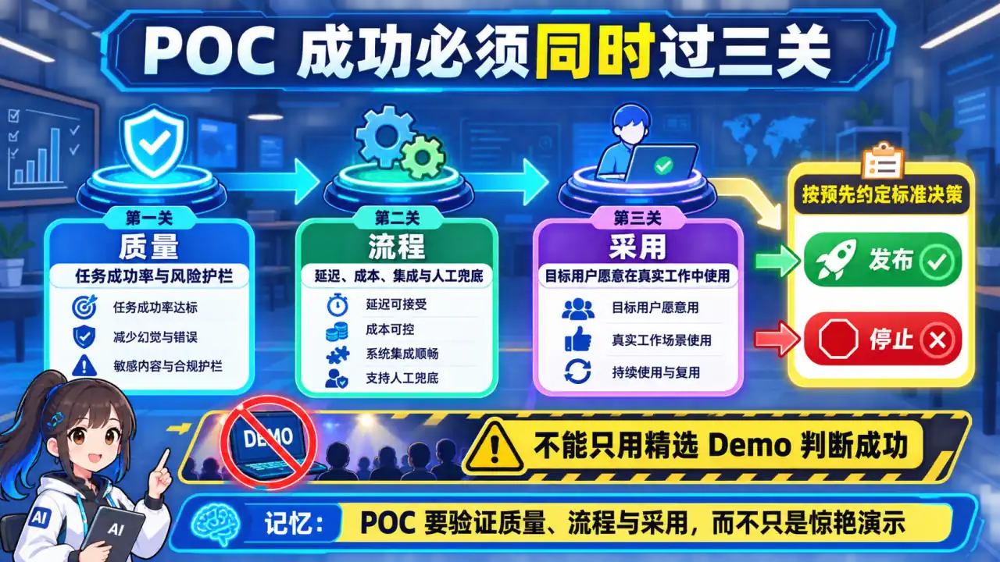
  </a>
</p>
<p align="center"><sub>🧠 图解记忆：业务结果：处理时间、一次解决率、人工接管量或其他相对当前基线的变化；点击图片可查看原图。</sub></p>
<details>
<summary>💡 答案要点</summary>

成功标准至少包含四层：

- **业务结果**：处理时间、一次解决率、人工接管量或其他相对当前基线的变化；
- **任务质量**：按真实任务分层后的正确性、完整性、拒答和严重错误率；
- **系统质量**：端到端延迟、可用性、失败恢复、单位任务成本；
- **采用情况**：目标用户覆盖、重复使用、任务完成率、反馈和绕过系统的原因。

在开始 POC 前锁定评测集、基线、观察窗口、不可接受失败和 go/no-go 决策人。不要只用“用户觉得不错”或离线平均分验收，也不要事后挑选有利样本。

</details>

### Q6: 业务负责人、最终用户和安全团队的诉求互相冲突，怎么推进？


<p align="center">
  <a href="../../assets/illustrations/26-forward-deployed-engineer/q06-stakeholder-conflict.webp">
    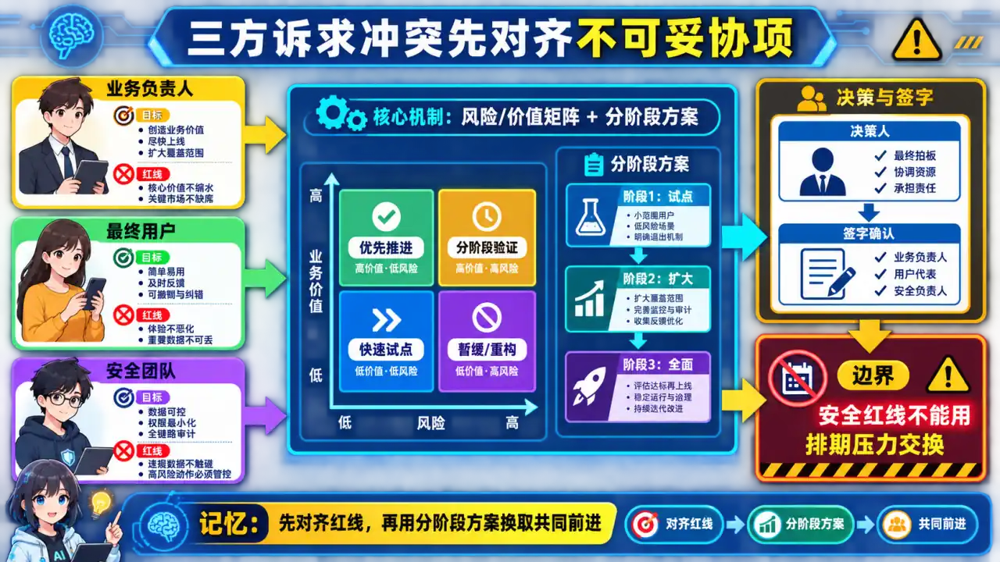
  </a>
</p>
<p align="center"><sub>🧠 图解记忆：先把“意见冲突”转换成可见的约束和决策权；点击图片可查看原图。</sub></p>
<details>
<summary>💡 答案要点</summary>

先把“意见冲突”转换成可见的约束和决策权：

1. 分别记录每方目标、不可妥协项、担心的失败和批准权限；
2. 找出共同目标，例如更快处理但不扩大数据访问；
3. 提供两个到三个明确方案，写清价值、风险、成本和残余风险；
4. 对争议最大的假设做小实验，例如只读、脱敏数据、人工确认的有限试点；
5. 由正确的风险 owner 做决定，并留下 decision log。

FDE 不应绕过安全团队，也不应把所有分歧无限上升。好的回答会说明何时自己决策、何时需要业务或安全负责人签字。

</details>

---

## 二、问题拆解与方案设计

### Q7: 面对“我们的售后工单太慢”这类开放问题，你如何做 decomposition？


<p align="center">
  <a href="../../assets/illustrations/26-forward-deployed-engineer/q07-problem-decomposition.webp">
    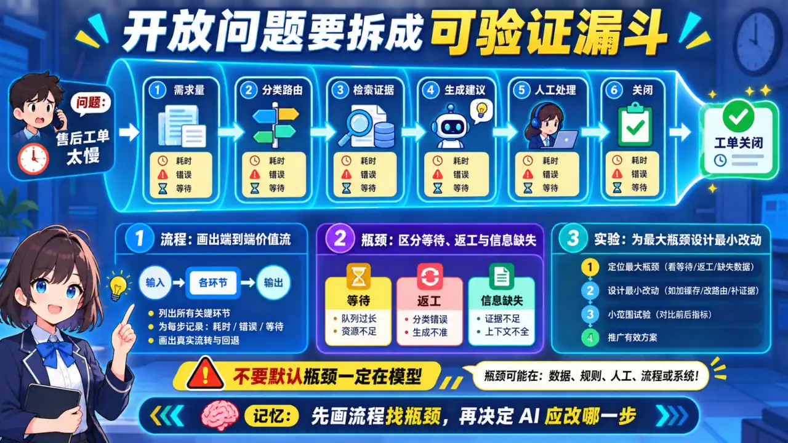
  </a>
</p>
<p align="center"><sub>🧠 图解记忆：不要从技术组件开始，先建立问题树；点击图片可查看原图。</sub></p>
<details>
<summary>💡 答案要点</summary>

不要从技术组件开始，先建立问题树：

```text
目标：缩短从工单创建到有效解决的时间
├── 到达：渠道、峰值、重复工单、信息完整度
├── 分流：分类、优先级、归属团队、转派次数
├── 处理：知识查找、系统操作、审批、客户沟通
├── 等待：排队、跨团队依赖、客户补充信息
└── 结果：解决、重开、升级、满意度与风险事件
```

接着定位瓶颈：用事件日志计算各阶段时间和返工，不把总周期都归因于客服写回复。选中一个子问题后，再设计数据、产品和 AI 方案，并定义验证与上线方式。

**面试官观察点：** 是否主动澄清用户、约束和成功指标；是否能从宽问题收敛到可交付切片；新信息出现时能否调整结构，而不是守着最初方案。

</details>

### Q8: 什么时候选择 Prompt、RAG、微调或 Agent？


<p align="center">
  <a href="../../assets/illustrations/26-forward-deployed-engineer/q08-prompt-rag-finetune-agent.webp">
    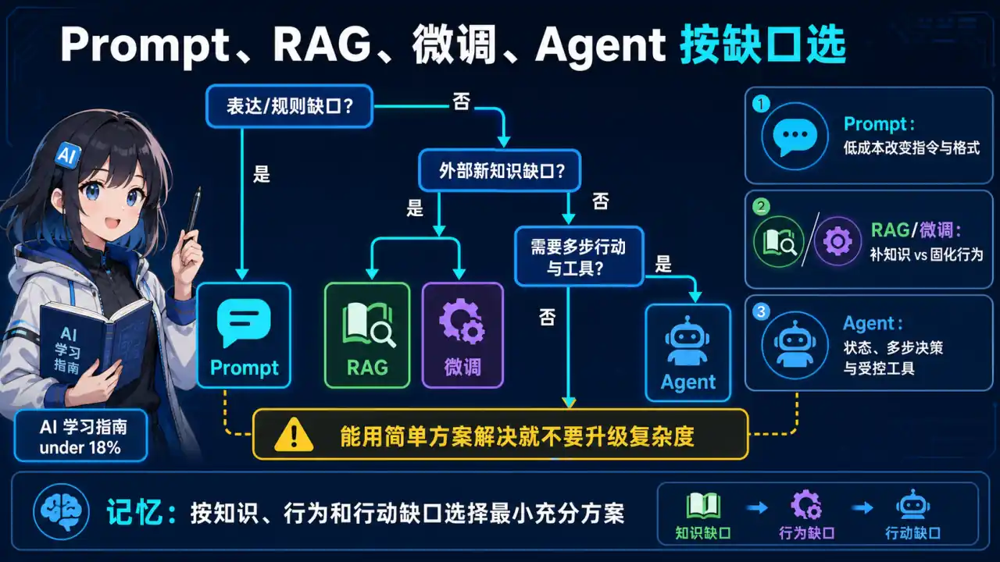
  </a>
</p>
<p align="center"><sub>🧠 图解记忆：先按失败原因选择最小方案；点击图片可查看原图。</sub></p>
<details>
<summary>💡 答案要点</summary>

先按失败原因选择最小方案：

- **Prompt / 结构化输出**：模型已有所需知识，主要问题是任务说明、格式或少量示例；
- **RAG**：答案依赖私有、更新频繁、需要引用的知识；
- **微调**：需要稳定改变行为、风格或领域模式，且有高质量训练数据；它不是实时补知识的首选；
- **Agent / 工具调用**：任务需要读取动态状态、执行动作或跨多步系统协作。

组合前先建立基线和评测。很多场景只需“检索 + 一次受控生成”，不应为了展示能力引入自主 Agent。具体原理参考 [RAG 系统](../03-rag-system/)、[模型训练](../07-model-training/) 和 [Agent 基础](../05-ai-agent-basics/)。

</details>

### Q9: 客户需求应该做配置、客户扩展、核心产品能力，还是拒绝？


<p align="center">
  <a href="../../assets/illustrations/26-forward-deployed-engineer/q09-feature-boundary.webp">
    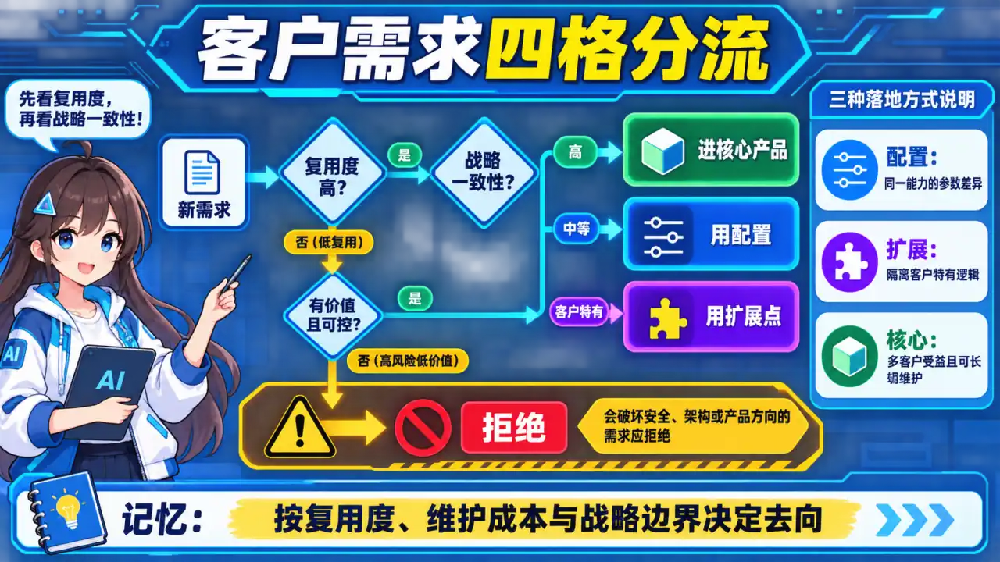
  </a>
</p>
<p align="center"><sub>🧠 图解记忆：判断时还要考虑数据隔离、升级兼容、测试归属、故障域和谁长期维护；点击图片可查看原图。</sub></p>
<details>
<summary>💡 答案要点</summary>

按复用性和耦合度判断：

| 选择 | 适用情况 |
|---|---|
| 配置 | 行为差异可由声明式规则表达，不改变核心语义 |
| 客户扩展 | 价值明确但只与该客户系统或流程相关，可通过稳定接口隔离 |
| 核心产品 | 多个客户存在相同问题，抽象稳定，长期维护价值高 |
| 拒绝/改需求 | 违反安全边界、破坏产品方向，或维护成本超过可验证价值 |

判断时还要考虑数据隔离、升级兼容、测试归属、故障域和谁长期维护。FDE 的职责不是对每个请求说“能做”，而是尽快找到可持续的交付边界。

</details>

### Q10: 设计一个部署在客户 VPC、能访问内部知识和工单系统的企业 AI 助手。


<p align="center">
  <a href="../../assets/illustrations/26-forward-deployed-engineer/q10-vpc-enterprise-assistant.webp">
    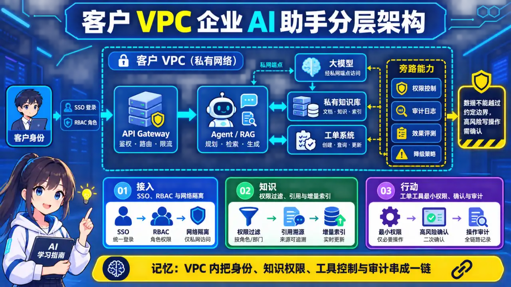
  </a>
</p>
<p align="center"><sub>🧠 图解记忆：先确认用户、读写动作、数据分类、身份源、模型托管方式、峰值与恢复目标；点击图片可查看原图。</sub></p>
<details>
<summary>💡 答案要点</summary>

先确认用户、读写动作、数据分类、身份源、模型托管方式、峰值与恢复目标。

**高层架构：**

```text
企业身份源 → 网关/策略执行点 → 会话编排
                           ├─ 权限感知检索 → 文档与索引
                           ├─ 工具代理 → 工单 API（读/写分权）
                           ├─ 模型网关 → 批准的模型端点
                           └─ Trace / Eval / 审计日志
```

**必须讲清的边界：**

- 用户身份贯穿检索和工具调用，不能只在入口鉴权；
- 模型端点的网络出口、数据保留和密钥管理；
- 写操作使用最小权限、幂等键、参数校验和分级人工确认；
- 日志脱敏，敏感内容不能无条件进入 Trace；
- 离线评测、影子流量、小范围灰度和可回滚发布；
- 模型不可用时降级到搜索、只读或人工流程。

深入容量与多租户设计可参考 [AI 系统设计](../25-system-design-ai/)。

</details>

### Q11: 如何把两周原型推进到可维护的生产系统？


<p align="center">
  <a href="../../assets/illustrations/26-forward-deployed-engineer/q11-prototype-to-production.webp">
    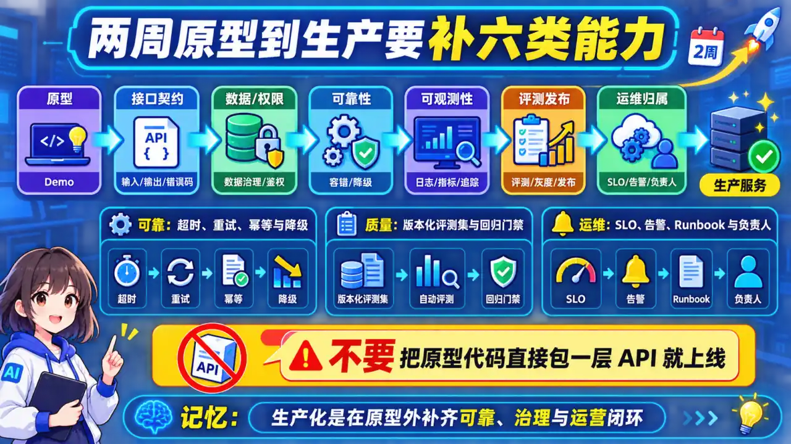
  </a>
</p>
<p align="center"><sub>🧠 图解记忆：原型验证的是价值假设，生产化要补齐运行责任；点击图片可查看原图。</sub></p>
<details>
<summary>💡 答案要点</summary>

原型验证的是价值假设，生产化要补齐运行责任：

1. 列出原型中的硬编码、人工步骤、临时密钥、单点和未处理失败；
2. 固化输入输出契约、权限模型和依赖版本；
3. 建立代表性评测集、回归门禁和端到端测试；
4. 增加超时、重试、幂等、限流、队列、降级和回滚；
5. 接入日志、指标、Trace、成本和安全审计；
6. 明确 SLO、值班、变更流程、数据回填和客户侧 owner；
7. 通过影子、内部用户、有限租户逐步扩大流量。

不要把“重写一遍”当成默认答案。先识别哪些原型代码有测试后可以保留，哪些边界必须重构，并用风险排序安排工作。

</details>

### Q12: 客户数据来自多个旧系统，字段冲突、缺失且语义不一致，怎么处理？


<p align="center">
  <a href="../../assets/illustrations/26-forward-deployed-engineer/q12-legacy-data-normalization.webp">
    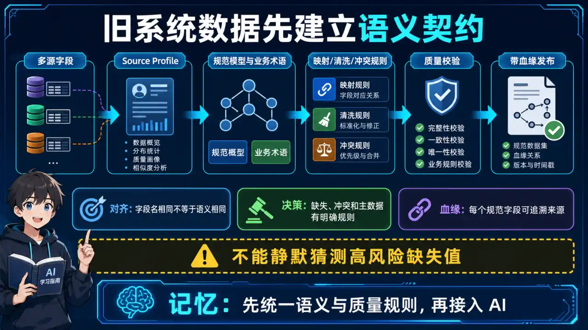
  </a>
</p>
<p align="center"><sub>🧠 图解记忆：把数据问题当作产品问题，而不是只写 ETL；点击图片可查看原图。</sub></p>
<details>
<summary>💡 答案要点</summary>

把数据问题当作产品问题，而不是只写 ETL：

- 建立源系统清单、数据 owner、更新方式、延迟和使用权限；
- 定义规范数据模型与业务术语，保留 source、ingested_at、schema_version 和 lineage；
- 用可重放的 staging → validate → normalize → publish 流程隔离原始数据；
- 为唯一键、枚举、时区、删除语义和迟到数据定义明确规则；
- 冲突时不静默猜测：进入隔离区、标记置信度或请求业务确认；
- 监控完整率、重复率、新鲜度、分布漂移和对账差异。

面试时应主动问：哪个系统是事实源？能否增量同步？删除如何传播？历史数据能否回放？错误修复后如何重算下游索引和评测？

</details>

---

## 三、AI 生产系统与评测

### Q13: 如何为客户的 AI 工作流设计评测体系？


<p align="center">
  <a href="../../assets/illustrations/26-forward-deployed-engineer/q13-customer-ai-evaluation.webp">
    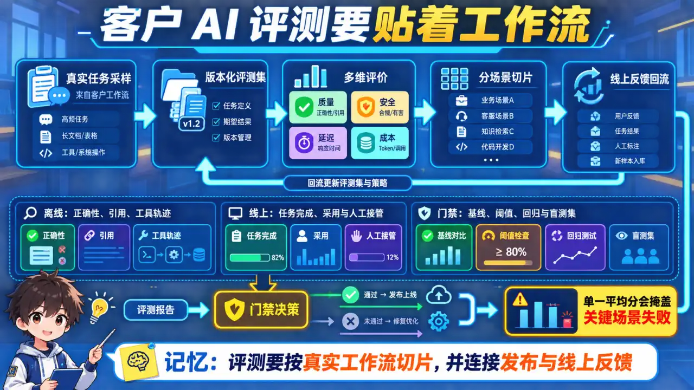
  </a>
</p>
<p align="center"><sub>🧠 图解记忆：评测应从业务任务向下拆，而不是只看模型平均分；点击图片可查看原图。</sub></p>
<details>
<summary>💡 答案要点</summary>

评测应从业务任务向下拆，而不是只看模型平均分：

1. **业务层**：任务是否完成、节省了哪一步、人工是否采纳；
2. **任务层**：按意图、风险、语言、数据来源等切片统计成功和严重失败；
3. **组件层**：检索召回、工具选择、参数正确性、引用支持度；
4. **系统层**：延迟、可用性、成本、超时和降级率；
5. **安全层**：越权、注入、敏感数据、危险动作和拒答行为。

先从真实历史样本建立小而可信的黄金集，保存输入、期望、评分规则和来源；自动评分用于规模化，人审用于校准和高风险样本；线上反馈不能直接等同于正确答案。发布时比较候选版本与当前基线，并检查关键切片而非只看总体均值。

</details>

### Q14: 多租户 RAG 怎样保证文档权限不会泄漏？


<p align="center">
  <a href="../../assets/illustrations/26-forward-deployed-engineer/q14-multitenant-rag-permissions.webp">
    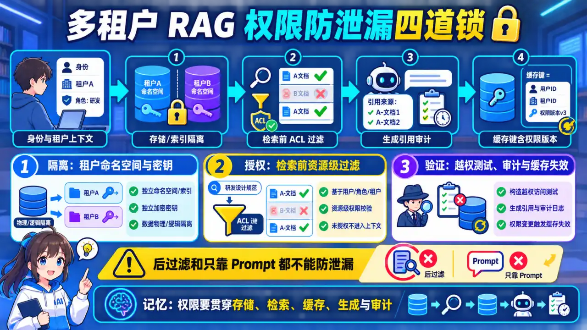
  </a>
</p>
<p align="center"><sub>🧠 图解记忆：权限必须在检索阶段强制执行，不能检索后再让模型“不要引用”；点击图片可查看原图。</sub></p>
<details>
<summary>💡 答案要点</summary>

权限必须在检索阶段强制执行，不能检索后再让模型“不要引用”。

- 从可信身份源获得 tenant、user、group 和 resource scope；
- 文档与 chunk 继承可验证的 ACL，并处理权限变更与删除传播；
- 查询过滤由服务端策略构造，不能信任客户端传入 tenant_id；
- 高隔离要求可使用独立索引/数据库/密钥，低隔离方案也要测试越权边界；
- 缓存键必须包含权限上下文，防止跨用户命中；
- Trace、评测集、导出和运维工具同样执行访问控制；
- 用 canary 文档和跨租户攻击用例持续验证。

具体安全评测参考 [安全与评估](../09-ai-safety-evaluation/)。

</details>

### Q15: 高风险 Agent 如何控制幻觉和错误操作？


<p align="center">
  <a href="../../assets/illustrations/26-forward-deployed-engineer/q15-high-risk-agent-controls.webp">
    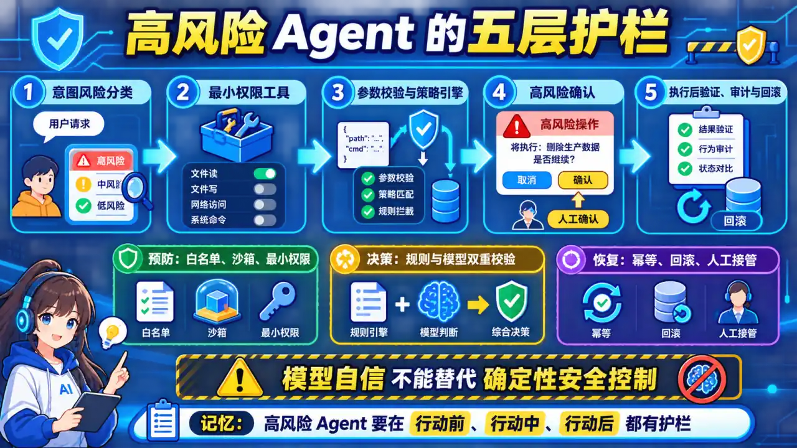
  </a>
</p>
<p align="center"><sub>🧠 图解记忆：不要承诺“消除幻觉”，应限制模型能造成的影响；点击图片可查看原图。</sub></p>
<details>
<summary>💡 答案要点</summary>

不要承诺“消除幻觉”，应限制模型能造成的影响：

- 把生成内容与确定性业务规则分离；
- 工具采用 allowlist、最小权限、严格 schema 和服务端参数校验；
- 读操作与写操作分权，高影响写操作需要预览、人工确认或双人审批；
- 使用幂等键、金额/数量上限、事务与补偿操作；
- 无足够证据时拒答或升级人工，并展示来源；
- 对工具轨迹、最终状态和策略违规做评测，而不只评价语言流畅度；
- 准备 kill switch、凭据撤销、回滚和事件审计。

追问时要根据场景区分风险：总结内部文档与执行退款不能使用同一自主等级。

</details>

### Q16: 客户同时要求更高质量、更低延迟和更低成本，怎么取舍？


<p align="center">
  <a href="../../assets/illustrations/26-forward-deployed-engineer/q16-quality-latency-cost.webp">
    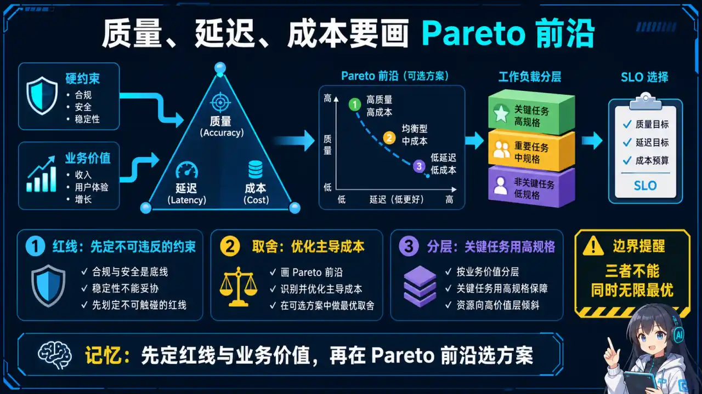
  </a>
</p>
<p align="center"><sub>🧠 图解记忆：先把三个目标变成带优先级的约束，例如关键任务的最低质量门槛、用户可接受的 P95 和单任务成本上限；点击图片可查看原图。</sub></p>
<details>
<summary>💡 答案要点</summary>

先把三个目标变成带优先级的约束，例如关键任务的最低质量门槛、用户可接受的 P95 和单任务成本上限。然后分解端到端数据，避免只优化模型调用。

可测试的杠杆包括：请求分类与模型路由、缩短无效上下文、检索和工具并行、缓存稳定结果、流式首 token、批处理离线任务、限制循环步数、为低风险任务使用较小模型。

每次只改变少量变量，比较质量切片、P50/P95、失败率和真实账单。若三者不可同时满足，应给客户展示 Pareto 方案并让业务 owner 选择，而不是隐藏质量下降。

</details>

### Q17: 上线后应该怎样观测和定位 AI 系统问题？


<p align="center">
  <a href="../../assets/illustrations/26-forward-deployed-engineer/q17-production-observability.webp">
    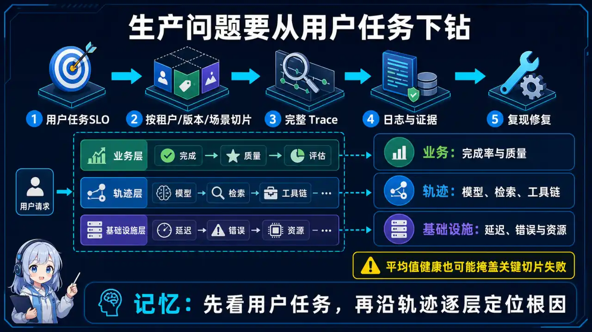
  </a>
</p>
<p align="center"><sub>🧠 图解记忆：需要把一次用户任务关联成端到端 Trace：请求分类 → 检索 → 模型 → 工具 → 最终状态 → 用户反馈；点击图片可查看原图。</sub></p>
<details>
<summary>💡 答案要点</summary>

需要把一次用户任务关联成端到端 Trace：请求分类 → 检索 → 模型 → 工具 → 最终状态 → 用户反馈。

至少监控：

- 流量、成功率、P50/P95/P99、队列和下游错误；
- token、模型、缓存、工具调用和单任务成本；
- 检索无结果、低支持度、工具参数错误、循环超限和人工接管；
- 按客户、版本、意图、语言、风险级别的质量切片；
- 配置、Prompt、模型、索引和代码版本。

日志要可采样和脱敏。排障顺序是先定位失败层，再用可重放样本复现，最后将真实故障转成回归测试。参考 [Agent 可观测性](../23-agent-observability/)。

</details>

### Q18: 模型或 Prompt 升级时，如何避免客户效果回退？


<p align="center">
  <a href="../../assets/illustrations/26-forward-deployed-engineer/q18-model-upgrade-regression.webp">
    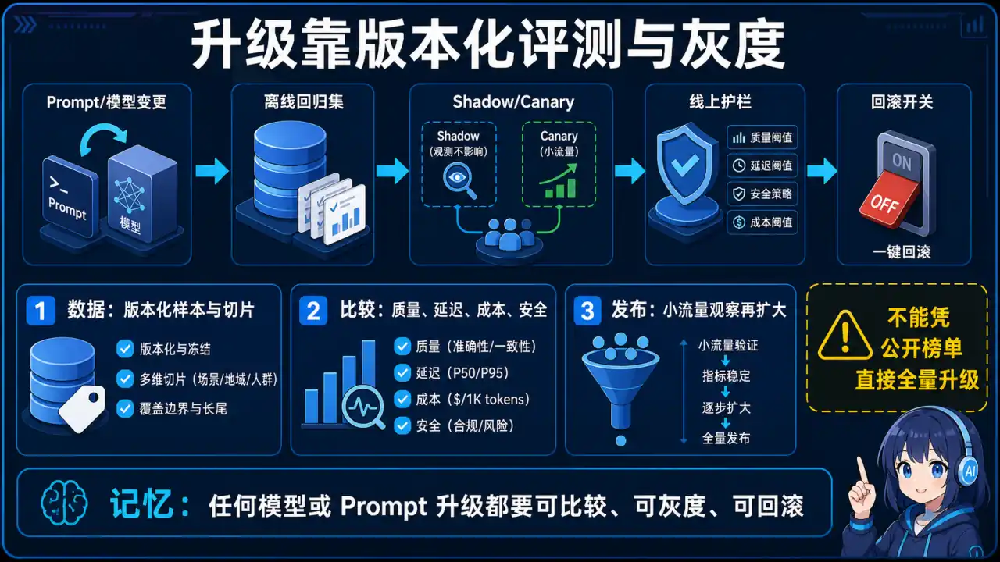
  </a>
</p>
<p align="center"><sub>🧠 图解记忆：把模型、Prompt、工具定义、检索配置和安全策略都视为版本化依赖；点击图片可查看原图。</sub></p>
<details>
<summary>💡 答案要点</summary>

把模型、Prompt、工具定义、检索配置和安全策略都视为版本化依赖。

发布流程可以是：离线回放 → 关键切片门禁 → 影子流量 → 小比例 canary → 分租户扩大 → 全量。比较任务质量、严重失败、工具副作用、延迟和成本，任何总体提升都不能掩盖高风险切片回退。

保留当前稳定版本、配置快照和一键回滚；外部模型可能发生行为变化，因此关键场景需要定期回放，而不应假设固定模型名称永远等于固定行为。

</details>

### Q19: 客户要求本地或混合云部署，你会重点确认什么？


<p align="center">
  <a href="../../assets/illustrations/26-forward-deployed-engineer/q19-onprem-hybrid-cloud.webp">
    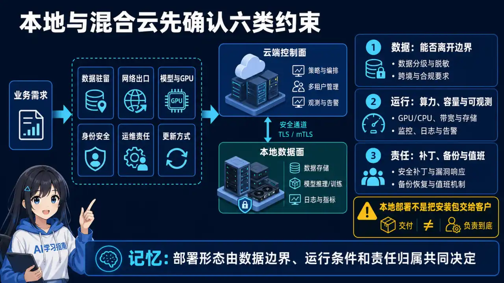
  </a>
</p>
<p align="center"><sub>🧠 图解记忆：网络：是否隔离、允许哪些出口、代理和证书如何管理；点击图片可查看原图。</sub></p>
<details>
<summary>💡 答案要点</summary>

- 网络：是否隔离、允许哪些出口、代理和证书如何管理；
- 数据：分类、驻留、加密、保留、删除、备份和跨区限制；
- 身份：SSO、工作负载身份、密钥轮换和运维访问；
- 计算：GPU/CPU 配额、容量峰值、模型分发和驱动兼容；
- 交付：镜像签名、SBOM、漏洞扫描、离线安装和升级窗口；
- 运行：客户与供应商各自负责哪些 SLO、告警、值班和事故响应；
- 可观测：哪些遥测可出环境，无法出环境时如何提供诊断包。

关键是设计“可运营的部署模型”，而不只是给一份 Kubernetes YAML。还要明确空气隔离环境如何更新、许可证如何工作、支持人员如何在最小权限下排障。

</details>

---

## 四、编码、数据与现场调试

### Q20: 如何在短时间内理解一个陌生代码库并完成修改？


<p align="center">
  <a href="../../assets/illustrations/26-forward-deployed-engineer/q20-understand-codebase.webp">
    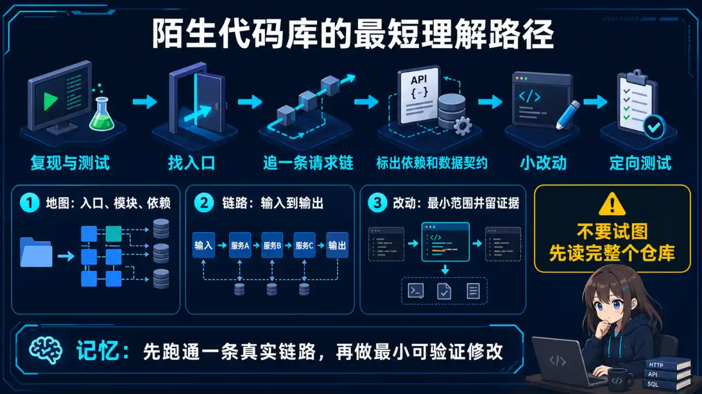
  </a>
</p>
<p align="center"><sub>🧠 图解记忆：先建立执行路径，而不是从第一行开始读；点击图片可查看原图。</sub></p>
<details>
<summary>💡 答案要点</summary>

先建立执行路径，而不是从第一行开始读：

1. 运行测试和最小示例，确认当前基线；
2. 找入口、边界接口、数据模型、配置和部署方式；
3. 用日志、调用关系和断点追踪一个代表性请求；
4. 写下假设和未知项，向维护者提出具体问题；
5. 先增加能暴露目标行为的测试，再做最小修改；
6. 检查调用方、迁移、并发、错误路径和回滚。

如果代码无法运行，应记录环境与错误证据，缩小到最小复现。面试中的 learning/codebase 环节通常也在观察你如何使用文档、验证理解和清楚沟通，而不只是最后是否写完。

</details>

### Q21: 客户正在旁边等待，生产集成突然失败，你如何排查？


<p align="center">
  <a href="../../assets/illustrations/26-forward-deployed-engineer/q21-production-debugging.webp">
    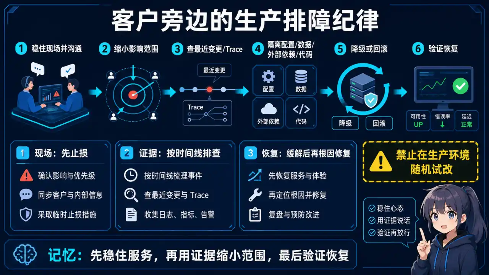
  </a>
</p>
<p align="center"><sub>🧠 图解记忆：确认影响范围、开始时间、近期变更和数据安全风险；点击图片可查看原图。</sub></p>
<details>
<summary>💡 答案要点</summary>

先控制影响，再定位根因：

1. 确认影响范围、开始时间、近期变更和数据安全风险；
2. 必要时停止写操作、切换降级路径或回滚；
3. 用 request_id/trace_id 判断失败发生在认证、网络、限流、schema、业务逻辑还是下游；
4. 比较成功与失败请求，检查配置、凭据、时钟、配额和依赖状态；
5. 向客户给出固定节奏的事实更新，不猜测恢复时间；
6. 恢复后补数据、核对副作用，并形成根因、修复项和回归测试。

高压下仍应保护凭据和客户数据，不能为了“快”把敏感 payload 粘贴到未经批准的外部工具。

</details>

### Q22: 实现过程中客户不断改变需求，你会怎样处理？


<p align="center">
  <a href="../../assets/illustrations/26-forward-deployed-engineer/q22-changing-requirements.webp">
    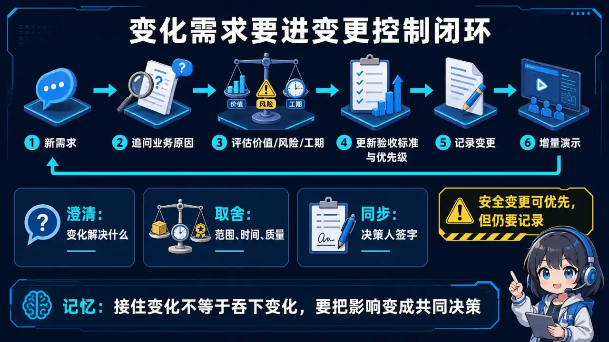
  </a>
</p>
<p align="center"><sub>🧠 图解记忆：先区分三种变化：对原需求的澄清、外部约束变化、真正新增范围；点击图片可查看原图。</sub></p>
<details>
<summary>💡 答案要点</summary>

先区分三种变化：对原需求的澄清、外部约束变化、真正新增范围。对每次变化说明它影响的成功标准、架构、日期和风险。

把交付拆成短切片，保持核心接口稳定，并维护决策日志和可演示增量。若新增需求影响承诺，提供选项：“保持日期并缩小范围”“延后日期”“增加资源但说明协调成本”。不能口头全部接受后让质量和团队加班兜底。

面试中的优秀表现不是拒绝变化，而是在变化中保持目标、边界和验证方法清晰。

</details>

### Q23: 设计并实现一个接收重复事件的数据摄取接口，怎样保证结果可靠？


<p align="center">
  <a href="../../assets/illustrations/26-forward-deployed-engineer/q23-idempotent-event-ingestion.webp">
    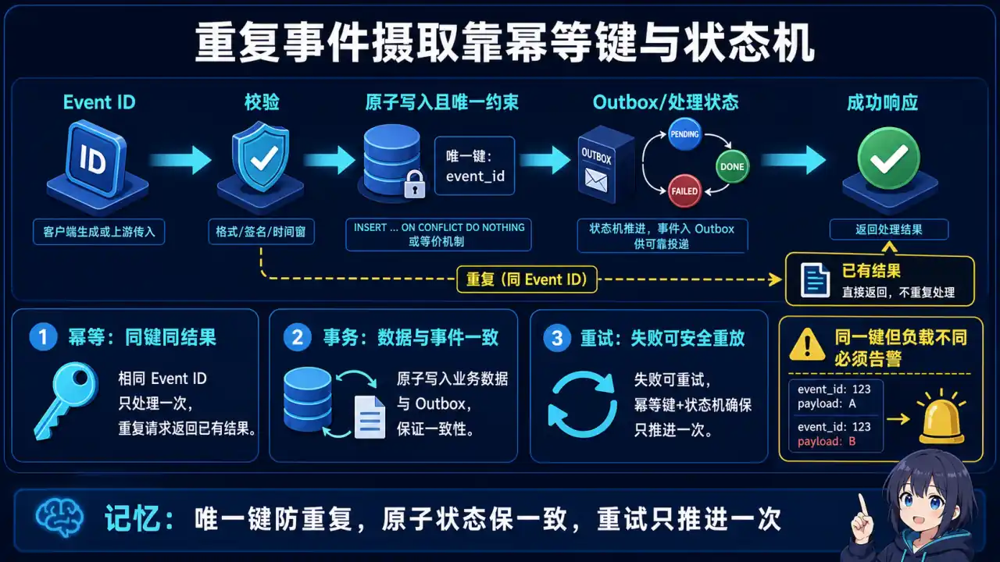
  </a>
</p>
<p align="center"><sub>🧠 图解记忆：先澄清事件是否有稳定 ID、是否允许乱序、更新语义、吞吐、保留期和下游一致性要求；点击图片可查看原图。</sub></p>
<details>
<summary>💡 答案要点</summary>

先澄清事件是否有稳定 ID、是否允许乱序、更新语义、吞吐、保留期和下游一致性要求。

**核心设计：**

- 接口快速校验并写入持久队列，返回接收状态；
- 使用 `(source, event_id)` 作为幂等键，数据库唯一约束是最后防线；
- 消费者采用条件 upsert，按 event_version 或 event_time 处理乱序；
- 业务写入与 outbox 放在同一事务，避免状态已变但下游事件丢失；
- 暂时错误有限重试，永久错误进入 DLQ 并保留原因；
- 提供 checkpoint、重放、对账以及重复/迟到/失败指标。

编码时应把“至少一次投递”与“业务效果只发生一次”区分开。对于付款等副作用，还需要下游同样接受幂等键，不能只在入口去重。

</details>

### Q24: 编写企业 API 同步器时，如何处理分页、限流和部分失败？


<p align="center">
  <a href="../../assets/illustrations/26-forward-deployed-engineer/q24-enterprise-api-sync.webp">
    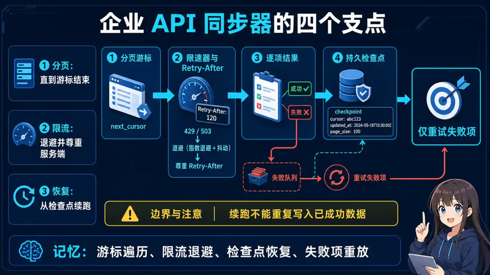
  </a>
</p>
<p align="center"><sub>🧠 图解记忆：使用服务端 cursor，不假设页码在同步期间稳定；点击图片可查看原图。</sub></p>
<details>
<summary>💡 答案要点</summary>

一个合格方案应包含：

- 使用服务端 cursor，不假设页码在同步期间稳定；
- 保存已提交 checkpoint，进程重启后可以继续；
- 对超时、429 和可重试 5xx 使用带 jitter 的退避，并尊重 `Retry-After`；
- 限制并发和内存，不一次加载全部对象；
- schema 校验失败进入隔离区，不能让一个坏对象丢掉整页；
- upsert 幂等，并记录 source version、同步批次和 lineage；
- token 刷新、权限变化和删除事件有独立处理；
- 测试空页、重复页、cursor 失效、限流、半页失败和重启。

如果面试要求现场编码，应先实现正确的串行版本和清晰接口，再在有数据支持时增加受控并发。

</details>

### Q25: 如何用 SQL 快速验证客户说的“最近活跃用户下降”？


<p align="center">
  <a href="../../assets/illustrations/26-forward-deployed-engineer/q25-sql-active-users.webp">
    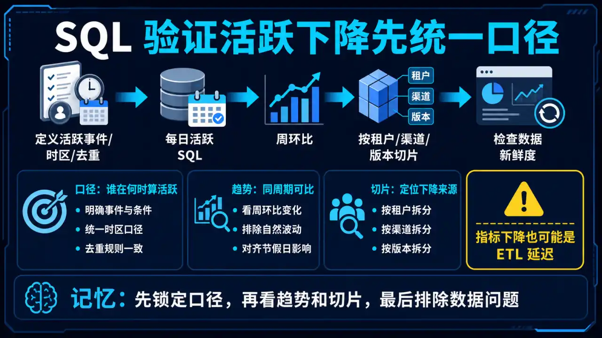
  </a>
</p>
<p align="center"><sub>🧠 图解记忆：不要直接写查询；点击图片可查看原图。</sub></p>
<details>
<summary>💡 答案要点</summary>

不要直接写查询。先确认“活跃”的事件定义、时区、完整自然日、内部/测试账号、迟到数据和比较周期。

```sql
-- PostgreSQL 示例：按 UTC 自然日统计去重活跃用户
SELECT
  date_trunc('day', event_time AT TIME ZONE 'UTC') AS day,
  count(DISTINCT user_id) AS active_users
FROM events
WHERE event_time >= date_trunc('day', now() AT TIME ZONE 'UTC') - interval '14 days'
  AND event_time <  date_trunc('day', now() AT TIME ZONE 'UTC')
  AND event_type IN ('task_started', 'task_completed')
  AND is_internal = false
GROUP BY 1
ORDER BY 1;
```

然后验证数据管道是否延迟、事件定义是否改版、客户/地区构成是否变化，并按关键维度切片。相关不等于因果；如果下降与一次发布同时发生，还要结合曝光分组、错误率和任务完成漏斗确认。

</details>

---

## 五、客户沟通、交付与行为面试

### Q26: 如何平衡一次性客户定制与可复用平台能力？


<p align="center">
  <a href="../../assets/illustrations/26-forward-deployed-engineer/q26-customization-vs-platform.webp">
    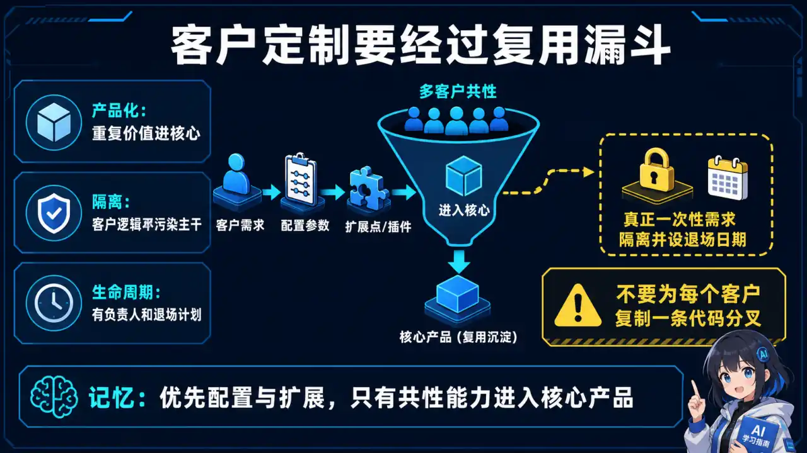
  </a>
</p>
<p align="center"><sub>🧠 图解记忆：使用“先隔离、再验证、后晋升”的策略；点击图片可查看原图。</sub></p>
<details>
<summary>💡 答案要点</summary>

使用“先隔离、再验证、后晋升”的策略：

1. 通过适配器、插件或配置把客户特有逻辑隔离在稳定接口之外；
2. 记录相似需求出现的客户数、共同语义和差异点；
3. 当抽象被多个真实场景验证后，连同测试、权限和迁移方案一起进入核心产品；
4. 为临时扩展设置 owner、维护期限和退出条件，避免永久分叉。

错误的两极是：所有需求都硬编码进核心产品，或为了追求“完美平台”迟迟不向客户交付。FDE 需要用现场交付验证抽象，而不是凭想象抽象。

</details>

### Q27: 销售已经向客户承诺了一个你认为无法按期安全交付的功能，怎么办？


<p align="center">
  <a href="../../assets/illustrations/26-forward-deployed-engineer/q27-unsafe-sales-commitment.webp">
    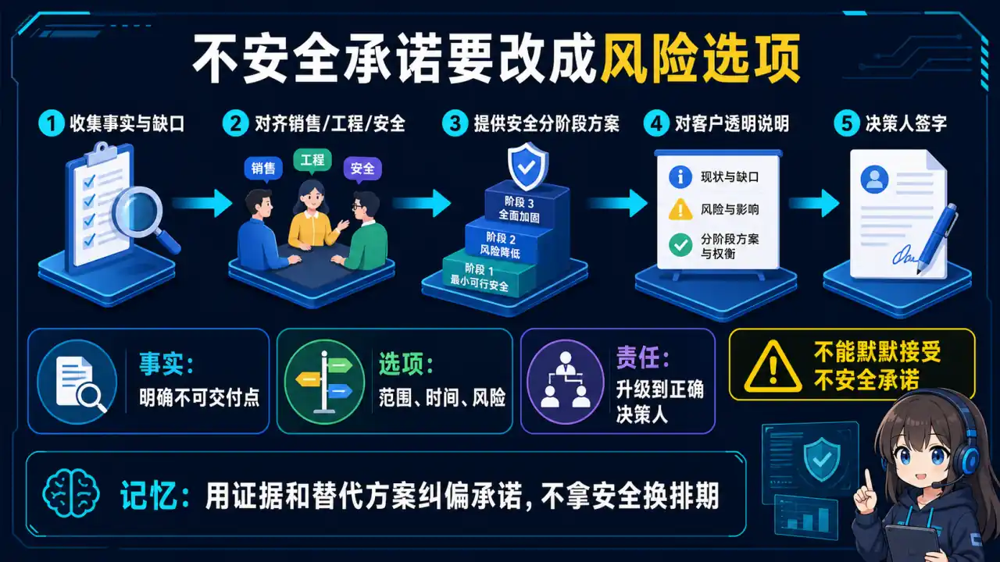
  </a>
</p>
<p align="center"><sub>🧠 图解记忆：先私下与销售核对承诺原文、客户真正目标、日期来源和商业影响，不在客户会议上互相否定；点击图片可查看原图。</sub></p>
<details>
<summary>💡 答案要点</summary>

先私下与销售核对承诺原文、客户真正目标、日期来源和商业影响，不在客户会议上互相否定。快速给出风险证据和替代路径，例如：按期交付只读/人工确认版本，完整自动化延后；或缩小用户和数据范围。

随后由有决策权的负责人确认范围，并用书面方式同步客户。若涉及安全、合规或不可逆数据风险，不能用商业压力覆盖红线，应明确升级。

事后改进售前技术评审、承诺清单和 sign-off 机制。好答案同时保护客户信任、团队关系和安全边界。

</details>

### Q28: 技术指标达标但用户采用率低，你会怎么办？


<p align="center">
  <a href="../../assets/illustrations/26-forward-deployed-engineer/q28-low-adoption.webp">
    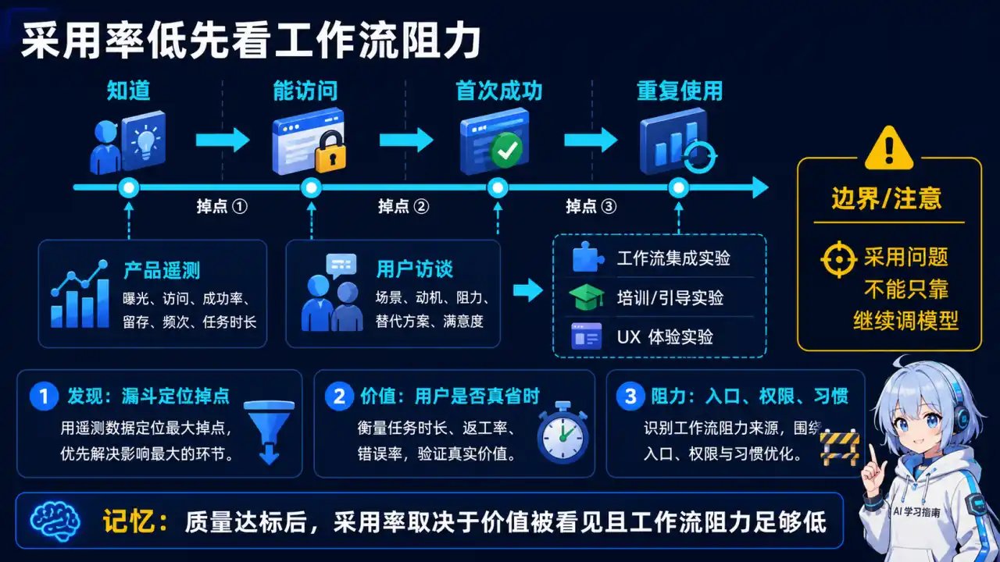
  </a>
</p>
<p align="center"><sub>🧠 图解记忆：先观察真实工作流和漏斗：谁被邀请、谁首次成功、在哪一步退出、是否回到旧工具；点击图片可查看原图。</sub></p>
<details>
<summary>💡 答案要点</summary>

先观察真实工作流和漏斗：谁被邀请、谁首次成功、在哪一步退出、是否回到旧工具。访谈活跃用户、流失用户和一线主管，区分质量、信任、权限、性能、培训和激励问题。

常见修复不是继续调模型，而是减少上下文切换、嵌入现有系统、展示来源、提供可编辑草稿、明确人工接管、改善首次使用和让团队负责人重构流程。

重新定义采用实验和观察窗口。如果使用产品不会改善业务结果，也要有勇气停止项目，而不是用登录次数包装成功。

</details>

### Q29: 如何向业务高管解释模型能力和风险，而不堆技术术语？


<p align="center">
  <a href="../../assets/illustrations/26-forward-deployed-engineer/q29-executive-ai-communication.webp">
    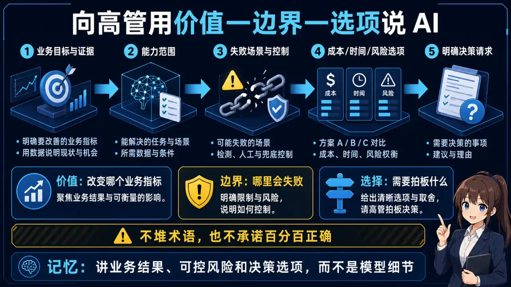
  </a>
</p>
<p align="center"><sub>🧠 图解记忆：采用“决策—证据—风险—下一步”的结构；点击图片可查看原图。</sub></p>
<details>
<summary>💡 答案要点</summary>

采用“决策—证据—风险—下一步”的结构：

1. 先说建议，例如“建议在一个团队上线只读助手，暂不自动执行退款”；
2. 用真实任务结果说明能做什么，避免只报通用 benchmark；
3. 用一两个具体失败案例解释边界及其业务后果；
4. 说明控制措施、残余风险和谁负责批准；
5. 给出下一阶段的成功门槛、成本范围和停止条件。

不要承诺模型“会学习所以自然变好”，也不要用“AI 有幻觉”作为所有问题的笼统解释。高管需要的是可做决策的信息。

</details>

### Q30: 请讲一个你在模糊、高压项目中承担端到端责任的经历。


<p align="center">
  <a href="../../assets/illustrations/26-forward-deployed-engineer/q30-end-to-end-ownership.webp">
    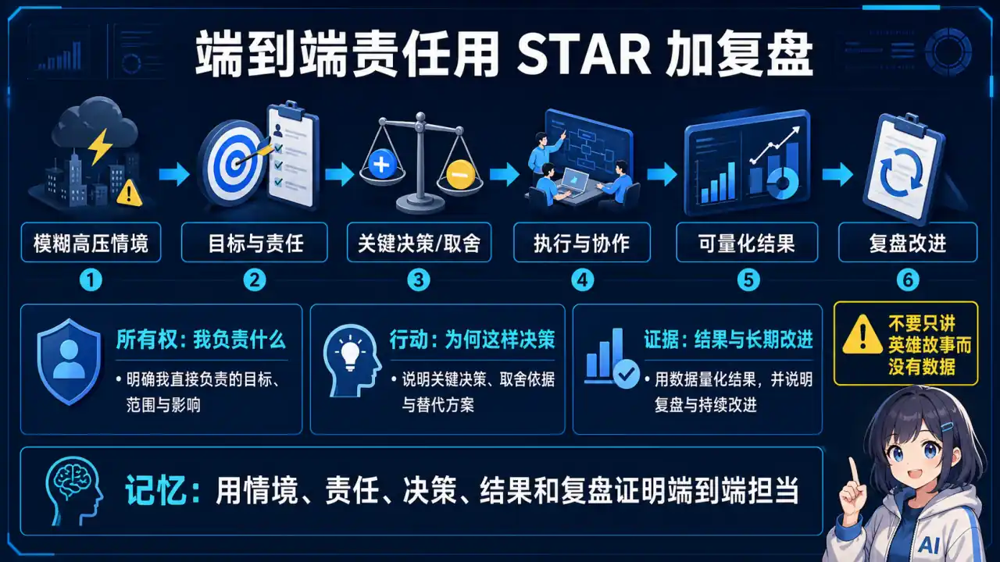
  </a>
</p>
<p align="center"><sub>🧠 图解记忆：使用 STAR，但重点放在判断过程；点击图片可查看原图。</sub></p>
<details>
<summary>💡 答案要点</summary>

使用 STAR，但重点放在判断过程：

- **Situation**：业务目标、用户、约束和当时未知项；
- **Task**：你真正负责的结果与权限，不夸大团队成果；
- **Action**：如何发现问题、排序风险、写代码、协调人员、验证和调整；
- **Result**：使用真实的基线、结果和观察窗口；
- **Reflection**：哪里判断错误、后来补了什么机制、哪些经验被复用。

面试官可能追问：“你亲自写了什么？”“谁反对？”“如果再做一次会删掉什么？”“指标为什么能归因于你的方案？”提前准备证据，但只能使用真实经历。

</details>

---

## 准备建议

1. **编码不能偏科**：至少能稳定完成中等难度的数据结构题、API 集成、SQL 和调试任务；
2. **练开放问题**：每次先问用户、流程、基线、约束和成功标准，再画架构；
3. **准备两个项目故事**：一个成功交付，一个失败或重大调整，能说清自己的代码和判断；
4. **练客户模拟**：面对催进度、改需求、质疑效果时，既不盲目答应，也不只讲技术困难；
5. **了解目标公司差异**：有的偏通用数据平台和 decomposition，有的偏 LLM/Agent 与 eval，有的更看重行业部署和基础设施。

## 参考资料

- [OpenAI — Forward Deployed Engineer](https://openai.com/careers/forward-deployed-engineer-%28fde%29-seattle-seattle/)
- [OpenAI — Forward Deployed Software Engineer](https://openai.com/careers/forward-deployed-software-engineer-nyc-new-york-city/)
- [Palantir — Forward Deployed Software Engineer](https://jobs.lever.co/palantir/c4442730-2926-41ad-8c0e-5e5a6b4d14ae)
- [Palantir — Students and Early Talent：FDSE 与 SWE 区别及面试入口](https://www.palantir.com/careers/students-and-early-talent/)
- [Palantir — Working Inside Existing Systems](https://www.palantir.com/careers/getting-hired/working-inside-existing-systems/)
- [Reflection AI — Forward Deployed Engineer / AI Engineer](https://jobs.ashbyhq.com/reflectionai/8b97b583-3cc6-4834-ae2c-d5aecf22ed7d/)
- [Handshake — Forward Deployed Engineer, AI Enterprise](https://jobs.ashbyhq.com/handshake/c91b7ebf-2c69-4d91-809d-a30ea0b9dc18)
- [Cartesia — Forward Deployed Engineer](https://jobs.ashbyhq.com/cartesia/6d860f5a-b9d9-4df2-b5e5-b12ac80632a4)
- [Exponent — Palantir FDE Interview Guide](https://www.tryexponent.com/guides/palantir-forward-deployed-engineer-interview)
- [公开候选人记录 — Palantir FDSE Full Interview Loop](https://www.reddit.com/r/csMajors/comments/1plags8/palantir_fdse_full_interview_loop_process/)

> 岗位描述和面试流程会变化。准备具体公司前，请重新检查目标职位的最新 JD 与招聘方提供的正式材料。
