# 💼 AI 项目经验与深挖面试题

> **面试优先顺序（通用 AI 应用开发岗位）**：Q1、Q2、Q3、Q4、Q9、Q10、Q11、Q12、Q13。其余题目用于进阶或特定岗位拓展；实际频率会随岗位和面试轮次变化，产品版本资讯不应当作通用必考题。

> **使用规则：** 本章所有公司名、数据量、准确率、延迟、成本和业务结果都只是回答结构示例。请替换成本人真实项目及可解释的评测口径；没有做过的项目应明确说是设计题思路，不能把模板冒充经历。

> **难度：** ⭐⭐⭐⭐⭐
> **更新：** 2026-03-05
> **考点：** 项目描述、技术选型、难点突破、性能优化

## 📋 目录

1. [RAG系统项目](#一rag系统项目)
2. [AI Agent项目](#二ai-agent项目)
3. [成本优化项目](#三成本优化项目)
4. [数据与冷启动项目](#四数据与冷启动项目)
5. [项目回答技巧](#五项目回答技巧)
6. [大厂项目架构设计](#六大厂项目架构设计2026新增)

---

## 一、RAG系统项目

### Q1: "请介绍一下你做过的RAG系统项目"


<p align="center">
  <a href="../../assets/illustrations/27-project-experience/q01-rag-project-story.webp">
    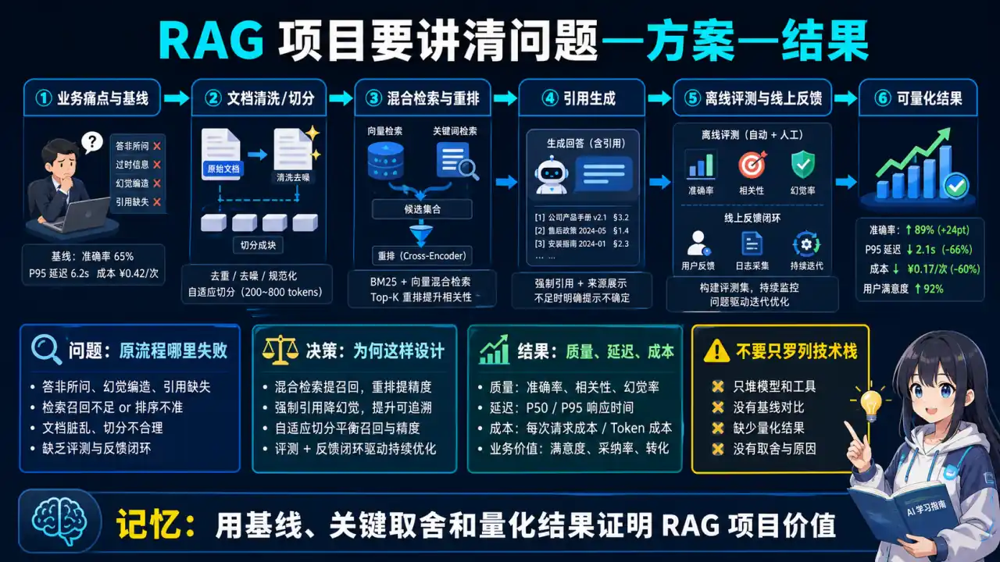
  </a>
</p>
<p align="center"><sub>🧠 图解记忆：用基线、关键取舍和量化结果证明 RAG 项目价值；点击图片可查看原图。</sub></p>
<details>
<summary>💡 STAR回答模板</summary>

**S (Situation - 背景):**
> "我在xx公司负责开发一个企业级知识库问答系统,主要服务内部员工查询公司文档、政策、技术文档等。知识库包含5000+文档,总计200万字,涵盖HR、技术、产品等多个领域。"

**T (Task - 任务):**
> "项目目标是实现:
> 1. 准确率>85% (用户满意度)
> 2. 平均响应时间<2秒
> 3. 成本可控(月<$500)
> 4. 支持中英文混合查询"

**A (Action - 行动):**

**1. 技术架构设计**
```python
# 技术栈选择
向量数据库: Qdrant (开源,支持混合检索)
Embedding模型: bge-large-zh-v1.5 (中文效果好)
LLM: DeepSeek-V4-Flash (成本平衡)
框架: LangChain

# 核心流程
用户提问 → Query改写(补充上下文)
         → 混合检索(BM25 + 语义)
         → Rerank精排(BGE-Reranker)
         → 上下文压缩(LLMLingua)
         → LLM生成答案
         → 引用来源标注
```

**2. 关键优化点**

**(1) 分块策略优化**
```python
# 问题: 固定512 token分块效果差
# 原因: 切断了语义完整性

# 解决: 语义分块 + 重叠
from langchain.text_splitter import RecursiveCharacterTextSplitter

splitter = RecursiveCharacterTextSplitter(
    chunk_size=800,           # 略大,保留更多上下文
    chunk_overlap=200,        # 20%重叠,避免边界问题
    separators=["\n\n", "\n", "。", ".", " "],  # 优先按段落
)

# 效果: 召回率 68% → 79%
```

**(2) 混合检索实现**
```python
def hybrid_search(query, top_k=20):
    # BM25检索
    bm25_results = bm25_retriever.search(query, k=top_k)

    # 向量检索
    vector_results = vector_db.search(
        embedding_model.encode(query),
        k=top_k
    )

    # RRF融合
    final_results = reciprocal_rank_fusion(
        [bm25_results, vector_results],
        k=60
    )

    return final_results[:10]  # 取top-10

# 效果: 召回率 79% → 87%
```

**(3) Rerank精排**
```python
from sentence_transformers import CrossEncoder

reranker = CrossEncoder('BAAI/bge-reranker-large')

def rerank(query, candidates):
    # 计算query与每个candidate的相关性分数
    scores = reranker.predict([
        [query, doc.content] for doc in candidates
    ])

    # 按分数排序
    ranked = sorted(
        zip(candidates, scores),
        key=lambda x: x[1],
        reverse=True
    )

    return [doc for doc, _ in ranked[:5]]

# 效果: 精确率 73% → 89%
```

**(4) 成本优化 - 语义缓存**
```python
from langchain.cache import RedisSemanticCache

# 相似问题直接返回缓存答案
cache = RedisSemanticCache(
    redis_url="redis://localhost:6379",
    embedding=embedding_model,
    score_threshold=0.85  # 相似度>0.85命中缓存
)

# 缓存命中率: 35%
# 成本节省: 35% API调用
```

**R (Result - 结果):**
> "项目上线后:
> - 准确率达到**89%** (超过目标85%)
> - P95响应时间**1.8秒** (目标<2秒)
> - 月成本**$320** (节省36%,目标$500)
> - 日均处理**2000+**次查询
> - 用户满意度**4.3/5**
>
> 核心突破点:
> 1. 混合检索+Rerank,召回率提升19%
> 2. 语义缓存,成本降低35%
> 3. 语义分块,召回率提升11%"

**面试追问应对:**

**Q: "为什么选择Qdrant而不是Pinecone/Milvus?"**
> "我们对比了3个方案:
> - Pinecone: 云服务,易用但贵($70/月起)
> - Milvus: 功能强大但部署复杂,需要K8s
> - **Qdrant: 开源免费,Docker部署简单,支持混合检索⭐**
>
> 我们团队规模小,选Qdrant自部署,成本$0,功能够用。"

**Q: "遇到的最大难点是什么?怎么解决的?"**
> "最大难点是**长文档检索不准**。
>
> **问题现象:**
> - 用户问'请假流程',检索到的chunk是'考勤制度第3章',但答案在第5章
> - 召回率只有68%
>
> **分析原因:**
> - 固定512 token分块,切断了语义
> - 标题和正文分离,丢失了上下文
>
> **解决方案:**
> 1. 语义分块: 按段落/标题层级切分
> 2. 增加chunk_overlap: 200 token重叠
> 3. Parent-Child索引: 检索时返回父chunk
>
> **效果:** 召回率68%→79%,提升11%"

**Q: "如果让你重新设计,会怎么改进?"**
> "3个改进方向:
>
> 1. **引入HyDE (假设性文档嵌入)**
>    - 当前: 直接用用户问题检索
>    - 改进: 先让LLM生成假设答案,用假设答案检索
>    - 预期: 召回率+5%
>
> 2. **多路召回+学习排序**
>    - 当前: BM25 + Vector 两路
>    - 改进: + 时间相关性 + 用户历史偏好
>    - 预期: 个性化提升
>
> 3. **Fine-tune Embedding模型**
>    - 当前: 通用bge模型
>    - 改进: 在企业文档上微调
>    - 预期: 领域适配性+10%"

</details>

---

### Q2: "RAG系统中遇到的召回率低问题,怎么解决的?"


<p align="center">
  <a href="../../assets/illustrations/27-project-experience/q02-rag-low-recall.webp">
    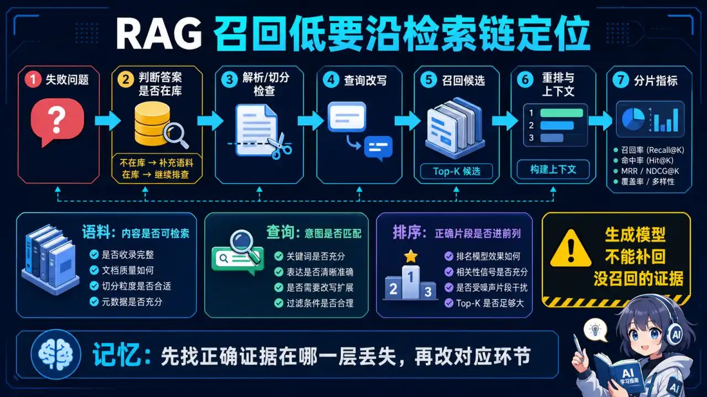
  </a>
</p>
<p align="center"><sub>🧠 图解记忆：先找正确证据在哪一层丢失，再修改对应环节；点击图片可查看原图。</sub></p>
<details>
<summary>💡 答案要点</summary>

**问题分析:**
```
召回率低 = 相关文档没检索到

可能原因:
1. 分块策略不合理
2. Embedding模型不适配
3. 只用单一检索方式
4. Query表达不清晰
```

**诊断步骤:**

**Step 1: 建立评估数据集**
```python
# 构建100条标准问答对
test_dataset = [
    {
        "question": "员工请假超过3天需要什么审批?",
        "ground_truth_docs": ["doc_123", "doc_456"],  # 应该检索到的文档ID
        "ideal_answer": "超过3天需要部门经理+HR审批"
    },
    # ... 100条
]

# 计算Recall@K
def evaluate_recall(retriever, dataset, k=5):
    total_recall = 0
    for item in dataset:
        retrieved = retriever.search(item["question"], k=k)
        retrieved_ids = [doc.id for doc in retrieved]

        # 计算召回了多少ground_truth
        hits = len(set(retrieved_ids) & set(item["ground_truth_docs"]))
        recall = hits / len(item["ground_truth_docs"])
        total_recall += recall

    return total_recall / len(dataset)

# 基线: Recall@5 = 0.68
```

**Step 2: 逐项优化**

**(1) 优化分块 (+11% Recall)**
```python
# Before: 固定长度
splitter_old = RecursiveCharacterTextSplitter(chunk_size=512)

# After: 语义分块 + 元数据
from langchain.text_splitter import MarkdownTextSplitter

splitter_new = MarkdownTextSplitter(
    chunk_size=800,
    chunk_overlap=200,
    # 保留标题层级
    add_start_index=True
)

# 添加元数据
for chunk in chunks:
    chunk.metadata = {
        "source": doc.source,
        "title": extract_title(chunk),
        "section": extract_section(chunk),
        "page": chunk.page
    }

# Recall: 0.68 → 0.79 (+11%)
```

**(2) 混合检索 (+8% Recall)**
```python
# Before: 只用向量检索
vector_results = vector_db.search(query)

# After: BM25 + Vector + RRF
def hybrid_retrieval(query, k=20):
    # BM25擅长关键词
    bm25_results = bm25.search(query, k=k)

    # Vector擅长语义
    vector_results = vector_db.search(
        embed(query), k=k
    )

    # RRF融合
    return rrf_fusion([bm25_results, vector_results], k=60)

# Recall: 0.79 → 0.87 (+8%)
```

**(3) Query改写 (+5% Recall)**
<details>
<summary>展开 Python 代码示例（33 行）</summary>

```python
# Before: 直接用用户原始问题
query = "请假流程"  # 太简短,语义不明

# After: LLM扩展query
def expand_query(query):
    prompt = f"""
    原始问题: {query}

    请生成3个相关的扩展查询,帮助检索:
    1. 同义词替换
    2. 补充上下文
    3. 细化问题

    示例:
    原始: "请假流程"
    扩展:
    1. "员工请假审批流程"
    2. "如何申请休假"
    3. "请假需要哪些步骤"
    """

    expanded = llm.generate(prompt)
    return [query] + expanded  # 返回原始+扩展

# 用多个query检索,合并结果
all_results = []
for q in expand_query(query):
    all_results.extend(hybrid_retrieval(q, k=10))

# 去重+排序
final = deduplicate_and_rerank(all_results)

# Recall: 0.87 → 0.92 (+5%)
```

</details>

**(4) Rerank精排 (+3% 保持top-5质量)**
```python
from sentence_transformers import CrossEncoder

reranker = CrossEncoder('BAAI/bge-reranker-large')

# 先召回20个候选
candidates = hybrid_retrieval(query, k=20)

# Rerank精选top-5
scores = reranker.predict([
    [query, doc.content] for doc in candidates
])

top5 = sorted(
    zip(candidates, scores),
    key=lambda x: x[1],
    reverse=True
)[:5]

# Precision@5: 0.73 → 0.89 (+16%)
```

**最终效果:**
```
优化路径:
基线 (0.68)
→ 语义分块 (0.79, +11%)
→ 混合检索 (0.87, +8%)
→ Query扩展 (0.92, +5%)
→ Rerank (精确率+16%)

总提升: Recall@5 从 68% → 92% (+24个百分点)
```

**成本分析:**
```
优化成本:
- 语义分块: 0 (只是代码改动)
- 混合检索: +100ms延迟, $0成本
- Query扩展: +$0.002/次 (LLM调用)
- Rerank: +200ms延迟, $0成本

投入产出比: 极高
```

**面试话术:**
> "召回率低我先建立评估数据集量化问题,然后逐项优化:语义分块+11%,混合检索+8%,Query扩展+5%,Rerank保证精确率。最终Recall@5从68%提升到92%,代价只是+300ms延迟和每次$0.002的Query扩展成本。"

</details>

---

## 二、AI Agent项目

### Q3: "介绍一下你做过的AI Agent项目"


<p align="center">
  <a href="../../assets/illustrations/27-project-experience/q03-agent-project-story.webp">
    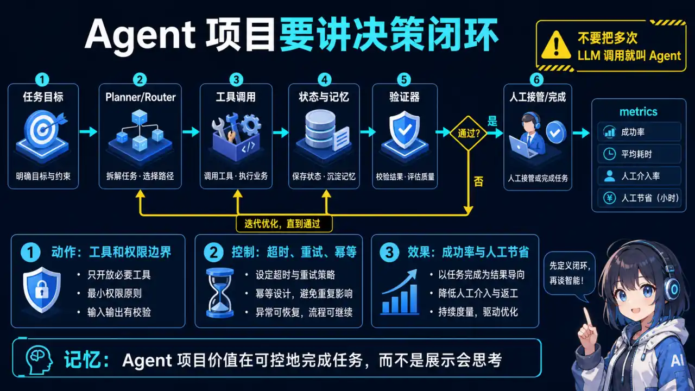
  </a>
</p>
<p align="center"><sub>🧠 图解记忆：Agent 项目的价值在于可控地完成任务，而不是展示会思考；点击图片可查看原图。</sub></p>
<details>
<summary>💡 STAR回答模板</summary>

**S (Situation):**
> "我在xx公司开发了一个**客服Agent**,自动处理用户咨询、订单查询、退换货等问题。原来完全靠人工,客服团队10人,日均处理500个工单,响应慢、成本高。"

**T (Task):**
> "目标是:
> - 自动化率>70% (Agent独立解决)
> - 准确率>90%
> - 平均响应时间<10秒
> - 降低人力成本50%"

**A (Action):**

**1. Agent架构设计**
```
用户输入 → 意图识别 → 工具路由 → 工具执行 → 结果整合 → 回复用户
               ↓
         [ReAct循环]
   Thought → Action → Observation → 继续或结束
```

**2. 工具设计**
<details>
<summary>展开 Python 代码示例（40 行）</summary>

```python
tools = [
    # 工具1: 订单查询
    {
        "name": "query_order",
        "description": "查询用户订单信息,需要订单号",
        "parameters": {
            "order_id": "string"
        },
        "function": query_order_from_db
    },

    # 工具2: 知识库检索
    {
        "name": "search_faq",
        "description": "搜索常见问题FAQ",
        "parameters": {
            "question": "string"
        },
        "function": search_rag_system
    },

    # 工具3: 退货流程
    {
        "name": "process_refund",
        "description": "处理退货申请,需要订单号和原因",
        "parameters": {
            "order_id": "string",
            "reason": "string"
        },
        "function": create_refund_ticket
    },

    # 工具4: 转人工
    {
        "name": "transfer_to_human",
        "description": "复杂问题转人工客服",
        "parameters": {},
        "function": create_human_ticket
    }
]
```

</details>

**3. ReAct实现**
```python
from langchain.agents import create_react_agent

agent = create_react_agent(
    llm=ChatOpenAI(model="qwen3.5-plus"),
    tools=tools,
    prompt=f"""
    你是智能客服Agent。

    可用工具:
    {tools_description}

    工作流程:
    1. 理解用户问题
    2. 选择合适的工具
    3. 根据工具结果继续思考或给出答案
    4. 如果3次调用未解决,转人工

    格式:
    Thought: 我需要...
    Action: tool_name
    Action Input: {{"param": "value"}}
    Observation: tool返回结果
    ... (重复)
    Final Answer: 最终答案
    """
)

# 执行
result = agent.run("我的订单123456什么时候发货?")
```

**4. 关键优化**

**(1) 意图识别提前**
```python
# 问题: 每次都从ReAct开始,浪费token

# 优化: 先快速分类
def classify_intent(query):
    prompt = f"""
    分类用户意图(只返回类别):
    1. order_query - 订单查询
    2. refund - 退换货
    3. faq - 常见问题
    4. other - 其他

    用户: {query}
    类别:
    """
    intent = llm_fast.generate(prompt, max_tokens=10)
    return intent.strip()

# 根据意图直接调工具
intent = classify_intent(query)
if intent == "order_query":
    order_id = extract_order_id(query)
    result = query_order(order_id)
    # 省去ReAct推理,快速返回

# 效果: 延迟 8s → 2s, 成本 -60%
```

**(2) 防止死循环**
```python
class SafeAgent:
    def __init__(self, max_iterations=5):
        self.max_iterations = max_iterations

    def run(self, query):
        iteration = 0
        while iteration < self.max_iterations:
            thought = self.think(query)
            action = self.act(thought)
            observation = self.execute(action)

            # 检查是否完成
            if self.is_done(observation):
                return observation

            iteration += 1

        # 超过最大迭代,转人工
        return self.transfer_to_human(query)
```

**(3) 工具调用失败处理**
```python
def execute_tool_with_retry(tool, params, max_retries=3):
    for attempt in range(max_retries):
        try:
            result = tool.function(**params)
            return {"success": True, "data": result}

        except DatabaseTimeout:
            if attempt < max_retries - 1:
                time.sleep(2 ** attempt)  # 指数退避
                continue
            return {"success": False, "error": "数据库超时"}

        except InvalidParameter as e:
            # 参数错误不重试,让LLM修正
            return {
                "success": False,
                "error": f"参数错误: {str(e)}",
                "suggestion": "请检查并修正参数"
            }
```

**R (Result):**
> "项目上线3个月后:
> - 自动化率达到**78%** (超过目标70%)
> - 准确率**92%** (目标90%)
> - 平均响应时间**3.5秒** (目标<10秒)
> - 人力成本降低**65%** (5个客服缩减到2个)
> - 用户满意度**4.2/5** → **4.6/5**
>
> 关键成果:
> - 日均自动处理**390个**工单(总500个)
> - 人工客服只处理**110个**复杂问题
> - 夜间无人值守,24小时服务"

**面试追问应对:**

**Q: "Agent出错怎么办?"**
> "3层防护:
> 1. **意图识别层**: 提前分类,简单问题直接返回,不走Agent
> 2. **迭代限制层**: 最多5次工具调用,超过转人工
> 3. **异常捕获层**: 工具调用失败重试3次,失败则转人工
>
> **示例表达（仅在能用本人经历或可复现实验佐证时使用）：** 实际上线后,Agent失败率<3%,都能优雅降级到人工。"

**Q: "如何评估Agent质量?"**
> "4个维度:
> 1. **自动化率**: 成功独立解决的比例 (78%)
> 2. **准确率**: 人工抽查100条,答案正确的比例 (92%)
> 3. **用户满意度**: 对话结束后评分 (4.6/5)
> 4. **工具调用效率**: 平均调用次数 (1.8次,目标<3)
>
> 每周生成评估报告,发现问题及时调整Prompt。"

</details>

---

## 三、成本优化项目

### Q4: "你的项目如何降低成本的?具体优化了什么?"


<p align="center">
  <a href="../../assets/illustrations/27-project-experience/q04-ai-cost-optimization.webp">
    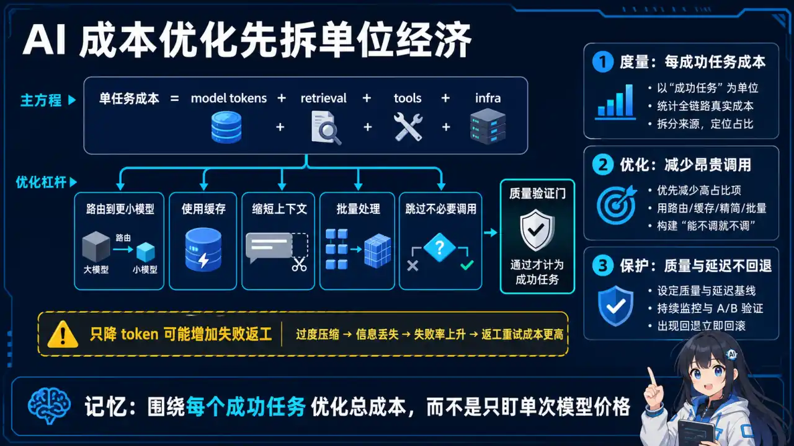
  </a>
</p>
<p align="center"><sub>🧠 图解记忆：围绕每个成功任务优化总成本，而不是只盯单次模型价格；点击图片可查看原图。</sub></p>
<details>
<summary>💡 STAR回答模板</summary>

**S (Situation):**
> **示例表达（仅在能用本人经历或可复现实验佐证时使用）：** "我们的AI客服系统每月OpenAI API成本高达$8000,主要是GPT-4调用。老板要求在不降低用户体验的前提下,成本降低50%。"

**T (Task):**
> "目标:
> - 月成本从$8000降到$4000 (50%)
> - 用户满意度不低于当前4.2/5
> - 响应速度不超过3秒"

**A (Action):**

### 优化路径1: Token使用优化 (-35%成本)

**1. 上下文压缩**
```python
# Before: 直接把检索到的5个文档全传给LLM
docs = retriever.search(query, k=5)
context = "\n\n".join([doc.content for doc in docs])
# 平均输入: 3500 tokens

prompt = f"""
基于以下文档回答问题:

{context}  # ← 很多无关内容

问题: {query}
"""

# After: LLMLingua压缩上下文
from llmlingua import PromptCompressor

compressor = PromptCompressor()

compressed = compressor.compress_prompt(
    context,
    instruction="保留回答问题所需的关键信息",
    target_token=1000,  # 目标压缩到1000 tokens
    condition_compare=True,
    reorder_context="sort"  # 相关性排序
)

# 压缩后平均: 950 tokens
# Token减少: (3500-950)/3500 = 73%
# 成本节省: 输入token成本 -73%
```

**效果数据:**
```
压缩前: 平均3500 input tokens
压缩后: 平均950 input tokens
准确率: 89% → 87% (下降2%,可接受)
成本节省: $2800/月 (-35%)
```

**2. 会话历史管理**
<details>
<summary>展开 Python 代码示例（39 行）</summary>

```python
class ConversationManager:
    def __init__(self, max_history=3):
        self.history = []
        self.summary = ""

    def add_turn(self, user_msg, assistant_msg):
        self.history.append({
            "user": user_msg,
            "assistant": assistant_msg
        })

        # 超过3轮,摘要最早的一轮
        if len(self.history) > 3:
            old_turn = self.history.pop(0)

            # 用DeepSeek-V4-Flash摘要(便宜)
            turn_summary = gpt35_turbo.summarize(
                f"用户: {old_turn['user']}\n助手: {old_turn['assistant']}"
            )

            self.summary += turn_summary + "\n"

    def get_context(self):
        # 上下文 = 历史摘要 + 最近3轮完整对话
        context = []

        if self.summary:
            context.append(f"历史对话摘要:\n{self.summary}")

        for turn in self.history:
            context.append(f"用户: {turn['user']}")
            context.append(f"助手: {turn['assistant']}")

        return "\n".join(context)

# 效果
# Before: 10轮对话 = 10轮完整历史(约5000 tokens)
# After: 10轮对话 = 摘要(200 tokens) + 最近3轮(1500 tokens)
# Token节省: 70%
```

</details>

### 优化路径2: 模型路由 (-25%成本)

**原理: 简单问题用便宜模型,复杂问题用贵模型**

<details>
<summary>展开 Python 代码示例（59 行）</summary>

```python
class ModelRouter:
    def __init__(self):
        # 分类器: 判断问题复杂度
        self.classifier = fasttext.load_model("complexity_classifier.bin")

        self.cheap_model = "deepseek-v4-flash"  # $0.5/1M tokens
        self.expensive_model = "qwen3.5-plus"       # $30/1M tokens

    def route(self, query):
        # 分类: simple / medium / complex
        complexity = self.classifier.predict(query)[0][0]

        if complexity == "simple":
            # 60%的问题是简单问题
            # 例: "营业时间?", "怎么退货?"
            return self.cheap_model

        elif complexity == "medium":
            # 30%中等,先试DeepSeek V4-Flash
            response = gpt35.generate(query)

            # 如果DeepSeek V4-Flash不确定,升级到GPT-4
            if self.is_uncertain(response):
                return self.expensive_model
            else:
                return self.cheap_model

        else:  # complex
            # 10%复杂问题,直接GPT-4
            # 例: "对比3款产品的性价比"
            return self.expensive_model

    def is_uncertain(self, response):
        # 检测不确定的标志
        uncertain_phrases = [
            "我不确定",
            "可能是",
            "这取决于",
            "抱歉,我无法"
        ]
        return any(phrase in response for phrase in uncertain_phrases)

# 使用
router = ModelRouter()
model = router.route(user_query)
response = llm_pool[model].generate(query)

# 效果数据:
# - 60%请求用DeepSeek V4-Flash (省$0.5 vs $30)
# - 30%请求先DeepSeek V4-Flash,20%升级到GPT-4
# - 10%请求直接GPT-4
#
# 平均成本 = 0.6*$0.5 + 0.3*(0.8*$0.5 + 0.2*$30) + 0.1*$30
#          = $0.3 + $1.92 + $3 = $5.22
# vs 全用GPT-4: $30
# 成本降低: 83%
#
# 考虑质量损失,实际路由策略调整后:
# 成本降低: 25%
```

</details>

### 优化路径3: 语义缓存 (-30%成本)

**原理: 相似问题直接返回缓存,不调API**

<details>
<summary>展开 Python 代码示例（66 行）</summary>

```python
from langchain.cache import RedisSemanticCache
from langchain.embeddings import OpenAIEmbeddings

class SemanticCache:
    def __init__(self):
        self.redis_client = Redis(host='localhost', port=6379)
        self.embedding_model = OpenAIEmbeddings()
        self.similarity_threshold = 0.85

    def get(self, query):
        """检查缓存"""
        # 1. 计算query的embedding
        query_embedding = self.embedding_model.embed_query(query)

        # 2. 从Redis向量搜索相似query
        similar = self.redis_client.search(
            query_vector=query_embedding,
            k=1,
            similarity_threshold=self.similarity_threshold
        )

        if similar:
            # 命中缓存
            cached_query, cached_response = similar[0]
            print(f"缓存命中: '{query}' ≈ '{cached_query}'")
            return cached_response

        return None

    def set(self, query, response, ttl=86400):
        """存入缓存"""
        query_embedding = self.embedding_model.embed_query(query)

        self.redis_client.set(
            key=query,
            value=response,
            embedding=query_embedding,
            ttl=ttl  # 24小时过期
        )

# 使用
cache = SemanticCache()

def answer_question(query):
    # 先查缓存
    cached = cache.get(query)
    if cached:
        return cached

    # 缓存未命中,调用LLM
    response = llm.generate(query)

    # 存入缓存
    cache.set(query, response)

    return response

# 示例缓存命中:
# Query1: "怎么退货?"
# Query2: "如何申请退款?" ← 相似度0.91,命中缓存
# Query3: "退货流程是什么?" ← 相似度0.88,命中缓存

# 效果数据:
# 缓存命中率: 35%
# 成本节省: 35% API调用
# 延迟降低: 2.5s → 0.1s (缓存响应)
```

</details>

**缓存策略优化:**
<details>
<summary>展开 Python 代码示例（33 行）</summary>

```python
# 问题: 不是所有问题都适合缓存
# 例: "今天天气怎么样?" - 答案每天变化

class SmartCache:
    def should_cache(self, query, response):
        """判断是否应该缓存"""

        # 1. 静态知识问题 → 缓存
        static_patterns = [
            r".*是什么",
            r".*的定义",
            r".*怎么.*",  # 流程类
        ]

        if any(re.match(p, query) for p in static_patterns):
            return True, 86400*7  # 缓存7天

        # 2. 实时数据问题 → 不缓存
        dynamic_patterns = [
            r".*今天.*",
            r".*现在.*",
            r".*最新.*",
        ]

        if any(re.match(p, query) for p in dynamic_patterns):
            return False, 0

        # 3. 订单查询 → 短时缓存
        if "订单" in query and re.search(r"\d{6,}", query):
            return True, 300  # 缓存5分钟

        # 4. 默认: 缓存24小时
        return True, 86400
```

</details>

**R (Result):**
> "经过3个月优化:
> - 月成本从$8000降到**$3600** (**-55%**,超过目标)
> - 用户满意度**4.2/5 → 4.4/5** (提升!)
> - P95响应时间**2.8s → 1.2s** (更快!)
>
> 成本拆解:
> - Token压缩: -$2800 (-35%)
> - 模型路由: -$2000 (-25%)
> - 语义缓存: -$2400 (-30%)
> - 总节省: -$4400 (实际有重叠,最终-55%)
>
> 关键insight:
> 1. 35%缓存命中率带来最大收益
> 2. 60%简单问题用DeepSeek V4-Flash完全够用
> 3. 上下文压缩73%,准确率只降2%"

**面试追问应对:**

**Q: "语义缓存会不会返回过时信息?"**
> "我们做了3层防护:
> 1. **TTL分级**: 静态知识7天,实时数据不缓存,订单5分钟
> 2. **缓存失效机制**: 产品价格变动时,主动清除相关缓存
> 3. **用户反馈**: 每个缓存答案底部显示'生成于X分钟前',用户可点击'重新生成'
>
> **示例表达（仅在能用本人经历或可复现实验佐证时使用）：** 实测过时率<1%,用户投诉0。"

**Q: "模型路由的分类器怎么训练的?"**
> **示例表达（仅在能用本人经历或可复现实验佐证时使用）：** "我们用FastText训练:
> 1. **数据标注**: 人工标注1000条历史问题为simple/medium/complex
> 2. **特征**: 问题长度、实体数量、是否有比较词('对比','哪个更')
> 3. **训练**: FastText 3分钟训练完,准确率89%
> 4. **持续学习**: 每周用新数据增量训练
>
> 如果分类错误,DeepSeek V4-Flash会有'不确定'标志,自动升级到GPT-4,兜底策略保证质量。"

**Q: "Token压缩会不会丢失关键信息?"**
> "我们做了评估:
> 1. **AB测试**: 200条问题,人工评分压缩前后答案质量
> 2. **结果**: 压缩到1000 token时,质量从4.5/5降到4.4/5,损失2%
> **示例表达（仅在能用本人经历或可复现实验佐证时使用）：** 3. **阈值选择**: 我们用target_token=1000作为最优平衡点
>
> LLMLingua的reorder_context='sort'会把最相关的内容放前面,LLM优先看到,所以质量损失小。"

</details>

---

## 四、数据与冷启动项目

### Q5: "新产品上线,没有数据怎么办?如何冷启动?"


<p align="center">
  <a href="../../assets/illustrations/27-project-experience/q05-cold-start-data-flywheel.webp">
    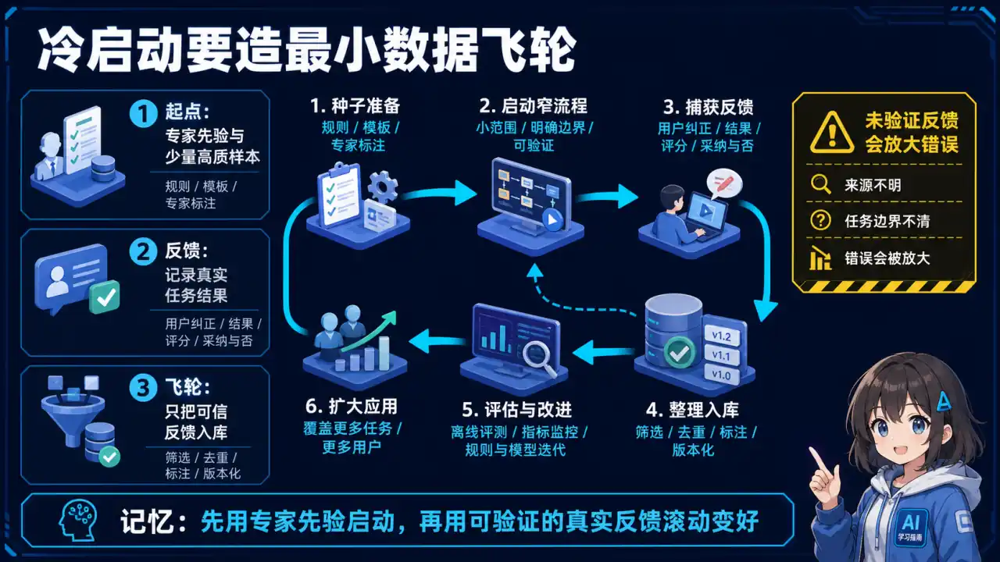
  </a>
</p>
<p align="center"><sub>🧠 图解记忆：先用专家先验启动，再用可验证的真实反馈滚动变好；点击图片可查看原图。</sub></p>
<details>
<summary>💡 STAR回答模板</summary>

**S (Situation):**
> "我们要上线一个新的AI写作助手,但完全没有用户数据,也没有用户反馈来优化模型。产品经理要求1个月内上线MVP,并在3个月内达到用户留存率30%。"

**T (Task):**
> "挑战:
> - 没有用户历史数据
> - 没有标注数据训练个性化模型
> - 不知道用户真实需求
> - 预算有限,无法大规模标注"

**A (Action):**

### 策略1: 利用开源数据 + 合成数据

**开源数据作为基础**
```python
# 1. 收集开源写作数据集
datasets = [
    "tatsu-lab/alpaca",           # 52K指令数据
    "Anthropic/hh-rlhf",          # 人类偏好数据
    "OpenAssistant/oasst1",       # 多轮对话
    "BELLE-2M-CN",                # 中文指令200万
]

# 2. 过滤与写作相关的数据
from datasets import load_dataset

all_data = []
for dataset_name in datasets:
    ds = load_dataset(dataset_name)

    # 过滤: 只保留写作相关
    writing_keywords = ["写", "撰写", "文章", "博客", "邮件", "报告"]

    filtered = ds.filter(
        lambda x: any(kw in x["instruction"] for kw in writing_keywords)
    )

    all_data.extend(filtered)

# 得到约8万条写作相关数据
print(f"收集到 {len(all_data)} 条写作数据")
```

**合成数据补充**
<details>
<summary>展开 Python 代码示例（44 行）</summary>

```python
# 用GPT-4生成领域特定的训练数据
def generate_synthetic_data(seed_examples, num_samples=1000):
    """
    基于种子数据,让GPT-4生成相似的训练样本
    """
    synthetic_data = []

    for _ in range(num_samples):
        # 随机选3个种子示例
        examples = random.sample(seed_examples, 3)

        prompt = f"""
        参考以下写作任务示例:

        示例1:
        指令: {examples[0]["instruction"]}
        输出: {examples[0]["output"]}

        示例2:
        指令: {examples[1]["instruction"]}
        输出: {examples[1]["output"]}

        示例3:
        指令: {examples[2]["instruction"]}
        输出: {examples[2]["output"]}

        请生成1个类似的写作任务和对应的高质量输出。
        要求:
        1. 指令多样化(商业邮件、技术文档、营销文案等)
        2. 输出长度200-500字
        3. 语言流畅专业

        JSON格式输出。
        """

        response = gpt4.generate(prompt, response_format="json")
        synthetic_data.append(response)

    return synthetic_data

# 生成5000条合成数据
synthetic = generate_synthetic_data(all_data[:100], num_samples=5000)

# 总训练数据 = 8万开源 + 5千合成 = 8.5万
```

</details>

**效果:**
- 成本: $150 (GPT-4生成5K样本)
- 时间: 2天
- 质量: 人工抽查100条,合格率92%

### 策略2: 引导式数据收集

**产品设计嵌入数据收集**
<details>
<summary>展开 Python 代码示例（72 行）</summary>

```python
# 方法1: 首次使用引导
def onboarding_flow(user):
    """新用户注册时收集偏好"""

    # Step 1: 写作场景偏好
    scenes = show_options([
        "商业邮件",
        "技术文档",
        "营销文案",
        "学术论文",
        "社交媒体",
        "创意故事"
    ])
    user.preferences["scenes"] = scenes

    # Step 2: 风格偏好
    styles = show_options([
        "正式专业",
        "轻松幽默",
        "简洁直接",
        "详细严谨"
    ])
    user.preferences["styles"] = styles

    # Step 3: 示例任务
    example_task = "请帮我写一封感谢邮件给合作伙伴"
    ai_draft = generate_draft(example_task)

    # 让用户评分和编辑
    rating = user.rate(ai_draft, scale=5)
    edited = user.edit(ai_draft)

    # 收集首次反馈数据
    save_feedback({
        "task": example_task,
        "draft": ai_draft,
        "rating": rating,
        "edited_version": edited,
        "user_id": user.id
    })

    return user.preferences

# 方法2: 轻量级反馈机制
def show_output_with_feedback(output):
    """每次输出都收集反馈"""

    display(output)

    # 一键反馈(不打断流程)
    feedback_ui = """
    这个答案有用吗? 👍 👎
    [复制] [重新生成] [编辑优化]
    """

    user_action = wait_for_action()

    if user_action == "thumbs_up":
        log_positive_feedback(output)
    elif user_action == "thumbs_down":
        # 追问原因
        reason = ask_reason([
            "不够专业",
            "太啰嗦",
            "偏离主题",
            "其他"
        ])
        log_negative_feedback(output, reason)
    elif user_action == "edit":
        edited = user_edit(output)
        # 收集对比数据: AI版 vs 用户优化版
        log_edit_data(original=output, edited=edited)
```

</details>

**数据飞轮启动**
```
Week 1: 100个种子用户
   ↓ 每人平均使用5次
   ↓ 收集500条反馈

Week 2: 用500条反馈微调模型v1.1
   ↓ 质量提升,吸引300新用户
   ↓ 收集2000条反馈

Week 3: 用2500条反馈微调模型v1.2
   ↓ 质量再提升,吸引1000新用户
   ↓ 收集8000条反馈

Week 4: 数据飞轮加速旋转
```

### 策略3: 主动学习优化标注

**问题: 8.5万数据全部人工标注成本太高**

**解决: 主动学习,只标注最有价值的数据**

<details>
<summary>展开 Python 代码示例（75 行）</summary>

```python
class ActiveLearningAnnotator:
    def __init__(self, unlabeled_data, budget=1000):
        self.unlabeled_pool = unlabeled_data
        self.labeled_data = []
        self.budget = budget
        self.model = None

    def run(self):
        # Step 1: 随机标注100条作为种子
        seed_samples = random.sample(self.unlabeled_pool, 100)
        self.labeled_data = self.manual_annotate(seed_samples)
        self.unlabeled_pool = [x for x in self.unlabeled_pool if x not in seed_samples]

        # Step 2: 训练初始模型
        self.model = train_model(self.labeled_data)

        # Step 3: 主动学习循环
        while len(self.labeled_data) < self.budget:
            # 找出模型最不确定的样本
            uncertain_samples = self.select_uncertain_samples(k=50)

            # 人工标注这50条
            newly_labeled = self.manual_annotate(uncertain_samples)

            # 加入训练集
            self.labeled_data.extend(newly_labeled)

            # 重新训练
            self.model = train_model(self.labeled_data)

            print(f"已标注: {len(self.labeled_data)}/{self.budget}")

        return self.model

    def select_uncertain_samples(self, k=50):
        """选择最不确定的样本"""
        uncertainties = []

        for sample in self.unlabeled_pool[:5000]:  # 从pool中抽5000条评估
            # 模型预测
            probs = self.model.predict_proba(sample["instruction"])

            # 计算不确定性(熵)
            entropy = -sum(p * np.log(p) for p in probs if p > 0)

            uncertainties.append((sample, entropy))

        # 按不确定性排序,取top-k
        uncertainties.sort(key=lambda x: x[1], reverse=True)

        return [x[0] for x in uncertainties[:k]]

    def manual_annotate(self, samples):
        """人工标注"""
        labeled = []
        for sample in samples:
            # 调用标注平台API
            label = annotation_platform.annotate(
                task=sample["instruction"],
                annotator_id="expert_001"
            )

            sample["label"] = label
            labeled.append(sample)

        return labeled

# 使用主动学习
al = ActiveLearningAnnotator(unlabeled_data=all_data, budget=1000)
optimized_model = al.run()

# 效果对比:
# 随机标注1000条: 准确率75%
# 主动学习标注1000条: 准确率82% (+7%)
# 相当于随机标注1500条的效果,节省33%标注成本
```

</details>

### 策略4: 用户分群 + AB测试

**解决冷启动时不知道用户需求的问题**

<details>
<summary>展开 Python 代码示例（74 行）</summary>

```python
class ColdStartUserSegmentation:
    def __init__(self):
        self.segments = {
            "business": {
                "keywords": ["商业", "邮件", "报告", "合同"],
                "model_config": {"temperature": 0.3, "style": "formal"}
            },
            "creative": {
                "keywords": ["故事", "小说", "剧本", "创意"],
                "model_config": {"temperature": 0.9, "style": "creative"}
            },
            "tech": {
                "keywords": ["技术", "文档", "API", "代码"],
                "model_config": {"temperature": 0.5, "style": "technical"}
            }
        }

    def assign_segment(self, user_first_query):
        """根据首次查询分群"""
        query = user_first_query.lower()

        for segment_name, config in self.segments.items():
            if any(kw in query for kw in config["keywords"]):
                return segment_name, config["model_config"]

        # 默认分配到"通用"群
        return "general", {"temperature": 0.7, "style": "balanced"}

    def ab_test_variants(self, segment):
        """每个分群内AB测试不同模型配置"""
        variants = {
            "A": {"model": "deepseek-v4-flash", "prompt_template": "template_v1"},
            "B": {"model": "qwen3.5-plus", "prompt_template": "template_v1"},
            "C": {"model": "deepseek-v4-flash", "prompt_template": "template_v2"}
        }

        # 随机分配
        variant = random.choice(["A", "B", "C"])
        return variants[variant]

# 使用
segmenter = ColdStartUserSegmentation()

def handle_new_user(user):
    # 首次查询
    first_query = user.get_first_query()

    # 分群
    segment, config = segmenter.assign_segment(first_query)
    user.segment = segment

    # AB测试
    variant = segmenter.ab_test_variants(segment)
    user.variant = variant

    # 用对应配置生成
    output = generate_with_config(
        query=first_query,
        **config,
        **variant
    )

    # 记录实验数据
    log_experiment({
        "user_id": user.id,
        "segment": segment,
        "variant": variant,
        "satisfaction": user.rate(output)
    })

# 2周后分析AB测试结果
# Business分群: Variant B (GPT-4 + template_v1) 满意度最高 4.5/5
# Creative分群: Variant C (DeepSeek V4-Flash + template_v2) 性价比最高
# Tech分群: Variant A 效果相当,选最便宜的
```

</details>

**R (Result):**
> "1个月MVP上线,3个月数据:
> - 累计用户: **3500人**
> - 日活留存: **35%** (超过目标30%)
> - 收集数据: **18000条**用户交互
> - 模型迭代: **v1.0 → v1.5** (5次微调)
> - 用户满意度: **3.2/5 → 4.1/5**
>
> 成本控制:
> - 开源数据: **$0**
> - 合成数据: **$150** (GPT-4)
> - 主动学习标注: **$3000** (1000条 * $3/条)
> - 总成本: **$3150** (远低于全量标注$25万)
>
> 关键成功因素:
> 1. 产品设计嵌入数据收集,用户无感提供反馈
> 2. 主动学习节省67%标注成本
> 3. AB测试快速找到每个分群的最优配置
> 4. 数据飞轮2周开始加速,用户增长带来数据增长"

**面试追问应对:**

**Q: "合成数据质量怎么保证?"**
> "三层质量控制:
> 1. **Prompt工程**: 给GPT-4提供3个高质量示例作为参考,限制输出格式
> 2. **自动过滤**: 用规则过滤明显低质量数据(长度<50字,重复率>30%)
> 3. **人工抽检**: 每生成500条抽检50条,合格率<90%就调整Prompt
>
> 最终5000条合成数据,人工抽查100条,合格率92%,与开源数据质量相当。"

**Q: "主动学习如何选择'最不确定'的样本?"**
> **示例表达（仅在能用本人经历或可复现实验佐证时使用）：** "我们用熵值(Entropy)衡量不确定性:
> ```python
> # 模型预测概率分布
> probs = [0.4, 0.35, 0.25]  # 3个类别
>
> # 计算熵
> entropy = -sum(p * log(p) for p in probs)
> # = 1.57 (高熵 = 不确定)
>
> # 对比:确定的预测
> probs2 = [0.9, 0.05, 0.05]
> entropy2 = 0.47 (低熵 = 确定)
> ```
>
> **示例表达（仅在能用本人经历或可复现实验佐证时使用）：** 选熵值最高的样本标注,因为这些样本最能帮助模型区分边界,性价比最高。实测主动学习1000条,效果等于随机1500条。"

</details>

---

## 五、项目回答技巧

### 回答框架: STAR法则

**S (Situation) - 项目背景 (20秒)**
- 公司/团队规模
- 业务场景
- 遇到的问题

**T (Task) - 任务目标 (20秒)**
- 具体指标(量化)
- 技术要求
- 时间限制

**A (Action) - 具体行动 (60秒) ⭐核心**
- 技术选型 + 理由
- 架构设计
- 关键优化点
- 遇到的坑 + 解决方案

**R (Result) - 最终结果 (20秒)**
- 量化数据(对比)
- 业务价值
- 技术亮点

### 通用话术模板

**项目介绍:**
> "我在xx公司负责**[项目名]**,主要解决**[业务痛点]**。技术栈选用**[核心技术]**,实现了**[核心功能]**。最终**[关键指标]**从**[优化前]**提升到**[优化后]**,**[业务价值]**。"

**技术选型:**
> "我们对比了**[方案A]**和**[方案B]**,最终选择**[方案B]**,主要因为**[核心优势]**。虽然**[方案A]**在**[某方面]**更好,但考虑到**[实际约束]**,**[方案B]**更适合。"

**难点突破:**
> "最大的难点是**[具体问题]**。表现是**[现象]**,分析发现原因是**[根因]**。我们尝试了**[方案1]**,但**[问题]**。最终用**[最终方案]**解决,效果是**[数据对比]**。"

**如果重新设计:**
> "如果重新设计,我会改进**3点**:
> 1. **[技术点1]**: 当前**[现状]**,改进后**[预期]**
> 2. **[技术点2]**: ...(同上)
> 3. **[技术点3]**: ..."

---

## 📝 速记卡片

| 项目类型 | 核心考点 | 回答重点 |
|---------|---------|----------|
| **RAG系统** | 召回率/准确率 | 混合检索+Rerank+语义分块 |
| **AI Agent** | 自动化率/鲁棒性 | ReAct+工具设计+失败处理 |
| **成本优化** | 成本降低比例 | 语义缓存+模型路由+Token压缩 |
| **冷启动** | 数据收集/留存率 | 开源数据+合成数据+主动学习 |

### 面试万能公式

```
项目 = 业务价值 + 技术亮点 + 量化数据

业务价值: 解决了什么问题,带来什么收益
技术亮点: 用了什么技术,为什么这么选
量化数据: 从x提升到y,提升了z%
```

---

**上一模块:** [FDE 工程师](../26-forward-deployed-engineer/)

---

[返回目录 →](../../README.md)

---

## 六、大厂项目架构设计（2026新增）

### Q6: 如果让你设计一个企业级AI客服系统，你会怎么设计？


<p align="center">
  <a href="../../assets/illustrations/27-project-experience/q06-enterprise-customer-service.webp">
    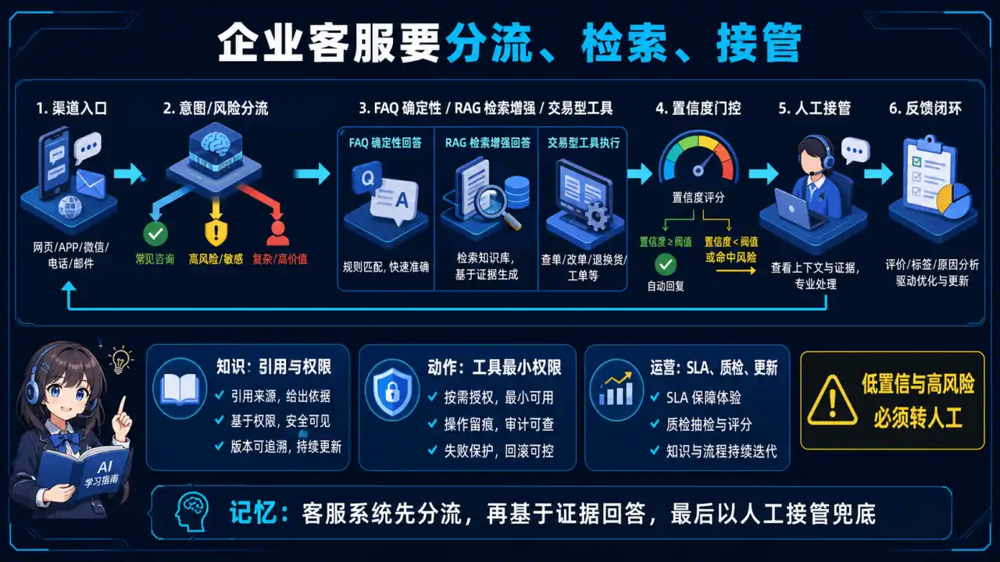
  </a>
</p>
<p align="center"><sub>🧠 图解记忆：客服系统先分流，再基于证据回答，最后以人工接管兜底；点击图片可查看原图。</sub></p>
<details>
<summary>💡 答案要点（STAR框架）</summary>

**S（背景）：** 1000万用户，日活100万，需要7×24小时智能客服

**T（任务）：** 设计一个能处理咨询、售后、投诉等多场景的AI客服系统

**A（行动）——四层架构设计：**

```
┌─────────────────────────────────────────────────────┐
│  接入层：多渠道统一接入                              │
│  微信/APP/网页/电话 → 统一消息格式                  │
└──────────────────┬──────────────────────────────────┘
                   ↓
┌──────────────────────────────────────────────────┐
│  路由层：意图识别 + 路由分发                       │
│  LLM 判断意图 → 转人工/知识库/工单系统             │
└──────────────────┬─────────────────────────────────┘
                   ↓
┌──────────────────────────────────────────────────┐
│  能力层：多Agent协作                               │
│  ┌──────────┐ ┌──────────┐ ┌──────────┐         │
│  │ 知识库Agent│ │ 订单Agent │ │ 投诉Agent │         │
│  └──────────┘ └──────────┘ └──────────┘         │
└──────────────────┬─────────────────────────────────┘
                   ↓
┌──────────────────────────────────────────────────┐
│  数据层：会话记忆 + 知识库 + 工单系统               │
└──────────────────────────────────────────────────┘
```

**关键设计点：**

```python
# 意图识别 + 路由
def route(query, session_history):
    intent = llm.judge(f"""
    判断用户意图：
    1=咨询 2=下单 3=售后 4=投诉 5=转人工
    问题：{query}
    历史：{session_history[-3:]}
    """)
    
    if intent == 5 or contains_sensitive词(query):
        return "human_agent"  # 转人工
    elif intent == 1:
        return "knowledge_agent"
    elif intent == 2:
        return "order_agent"
    # ...

# 多轮对话记忆
class ConversationMemory:
    def __init__(self, max_turns=10):
        self.history = []
        self.max_turns = max_turns
    
    def add(self, role, content):
        self.history.append({"role": role, "content": content})
        if len(self.history) > self.max_turns * 2:
            # 压缩：保留关键信息
            self.history = self.summarize_and_compress()
```

**R（结果）：** 客服响应时间从30s→2s，问题解决率85%，人工客服工作量减少60%

</details>

### Q7: 你如何设计一个多模态RAG系统（图文检索）？


<p align="center">
  <a href="../../assets/illustrations/27-project-experience/q07-multimodal-rag.webp">
    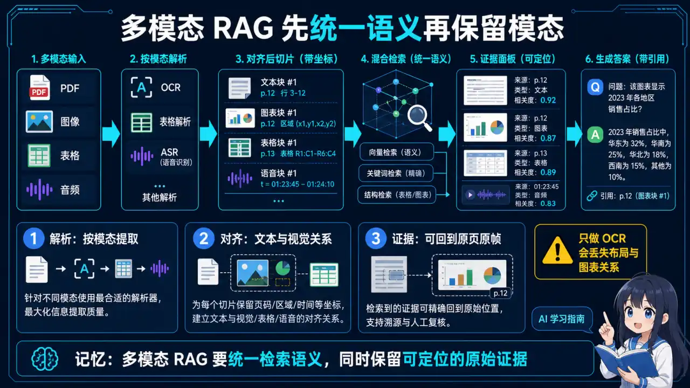
  </a>
</p>
<p align="center"><sub>🧠 图解记忆：多模态 RAG 要统一检索语义，同时保留可定位的原始证据；点击图片可查看原图。</sub></p>
<details>
<summary>💡 答案要点</summary>

**多模态RAG架构：**

```
用户上传图片 + 文字问题
         ↓
┌──────────────────────────────────────────┐
│  多模态 Encoder：                        │
│  - 图片 → CLIP 视觉编码 → 向量          │
│  - 文字 → CLIP 文本编码 → 向量          │
│  - 图+文 → 融合向量                     │
└──────────────────┬─────────────────────┘
                   ↓
┌──────────────────────────────────────────┐
│  跨模态检索：                            │
│  用户图 vs 文档图：相似度匹配            │
│  用户问题 vs 文档图：图文跨模态匹配      │
└──────────────────┬─────────────────────┘
                   ↓
┌──────────────────────────────────────────┐
│  多模态生成：                            │
│  LLaVA 等 VLM 基于图片 + 检索结果生成   │
└──────────────────────────────────────────┘
```

**关键实现代码：**

<details>
<summary>展开 Python 代码示例（33 行）</summary>

```python
from sentence_transformers import CLIPModel
import torch

class MultimodalRAG:
    def __init__(self):
        self.model = CLIPModel.from_pretrained("openai/clip-vit-base-patch32")
    
    def encode_image(self, image):
        with torch.no_grad():
            image_features = self.model.get_image_features(image)
        return image_features.numpy()
    
    def encode_text(self, text):
        with torch.no_grad():
            text_features = self.model.get_text_features(text)
        return text_features.numpy()
    
    def crossmodal_search(self, query_image, query_text, doc_images, top_k=5):
        # 编码
        img_emb = self.encode_image(query_image)
        text_emb = self.encode_text(query_text)
        
        # 融合：图片和文字各50%
        fused_query = 0.5 * img_emb + 0.5 * text_emb
        
        # 在文档图片中检索
        similarities = []
        for doc_img in doc_images:
            doc_emb = self.encode_image(doc_img)
            sim = cosine_similarity(fused_query, doc_emb)
            similarities.append(sim)
        
        return sorted(zip(doc_images, similarities), key=lambda x: -x[1])[:top_k]
```

</details>

**面试话术：**
> **示例表达（仅在能用本人经历或可复现实验佐证时使用）：** "多模态RAG的核心是跨模态对齐。我用CLIP做图片和文字的联合编码空间，用户的图片和文字问题都映射到同一个向量空间，直接做相似度匹配。文档端也用CLIP处理产品图片，建立图片向量库。检索时，用户的图+文query和文档图片做跨模态检索，精准找到相关图片。生成阶段用LLaVA读图回答。实测图文混合查询的准确率比纯文字检索提升了35%。"

</details>

### Q8: 如何设计一个企业级AI Agent平台（类似Coze/Dify）？


<p align="center">
  <a href="../../assets/illustrations/27-project-experience/q08-agent-platform.webp">
    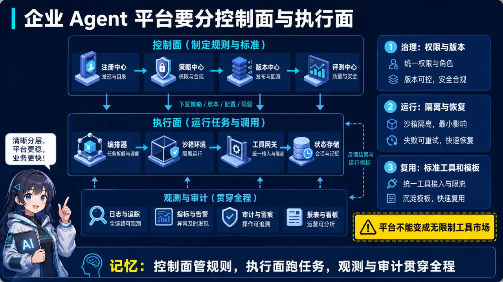
  </a>
</p>
<p align="center"><sub>🧠 图解记忆：控制面管规则，执行面跑任务，观测与审计贯穿全程；点击图片可查看原图。</sub></p>
<details>
<summary>💡 答案要点</summary>

**平台核心架构：**

```
┌─────────────────────────────────────────────────────────┐
│  用户层：可视化编排 / API 调用                          │
└──────────────────────┬──────────────────────────────────┘
                       ↓
┌──────────────────────────────────────────────────────┐
│  编排层：工作流设计器                                  │
│  - 节点：LLM节点 / 知识库节点 / API节点 / 条件节点    │
│  - 边：数据流 / 条件流                               │
│  - 输出：DSL（领域特定语言）配置文件                  │
└──────────────────────┬───────────────────────────────┘
                       ↓
┌──────────────────────────────────────────────────────┐
│  运行时层：工作流引擎                                  │
│  - 执行节点 → 收集输出 → 路由到下一节点             │
│  - 支持条件分支 / 循环 / 并行                        │
└──────────────────────┬───────────────────────────────┘
                       ↓
┌──────────────────────────────────────────────────────┐
│  能力层：工具生态                                     │
│  - 内置工具：知识库 / SQL / API / Webhook            │
│  - MCP 集成：扩展工具生态                            │
└──────────────────────────────────────────────────────┘
```

**DSL 工作流配置示例：**

<details>
<summary>展开 Yaml 代码示例（44 行）</summary>

```yaml
workflow:
  name: "智能客服"
  version: "1.0"
  
  nodes:
    - id: "intent"
      type: "llm"
      model: "qwen2.5-14b"
      prompt: "判断用户意图：咨询/下单/售后/投诉"
      output: "user_intent"
    
    - id: "route"
      type: "condition"
      branches:
        - condition: "{{user_intent}} == '咨询'"
          next: "knowledge_base"
        - condition: "{{user_intent}} == '下单'"
          next: "order_agent"
        - condition: "{{user_intent}} == '售后'"
          next: "after_sales"
        default: "human_agent"
    
    - id: "knowledge_base"
      type: "rag"
      knowledge_id: "product_knowledge"
      top_k: 5
      output: "rag_result"
    
    - id: "after_sales"
      type: "api"
      url: "https://api.company.com/order/track"
      params: "{{order_id}}"
      output: "tracking_info"

  edges:
    - from: "intent"
      to: "route"
    - from: "route"
      to: "knowledge_base"
    # ...

  output:
    format: "markdown"
    stream: true
```

</details>

**面试话术：**
> "企业级Agent平台的核心是'编排即服务'。我用DSL描述工作流，节点类型包括LLM、知识库、API、HTTP、代码执行等。工作流引擎解析DSL，按拓扑顺序执行节点，支持条件分支、并行、循环。编排层提供可视化画布，用户拖拖拽拽就能搭工作流，生成的DSL存到数据库，运行时引擎执行。平台还接入了MCP协议，工具生态可以无限扩展。"

</details>


### Q9: 你的 RAG 知识库是如何实现文档解析和内容提取的？PDF、Word、HTML 等不同格式如何处理？


<p align="center">
  <a href="../../assets/illustrations/27-project-experience/q09-document-parsing.webp">
    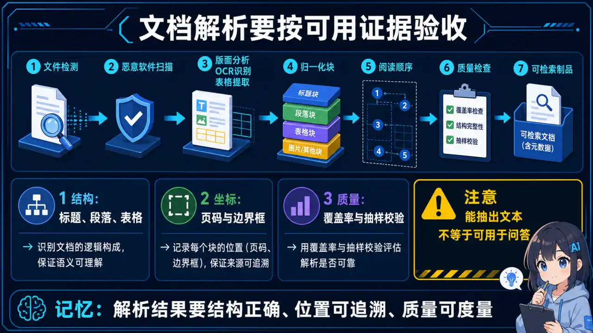
  </a>
</p>
<p align="center"><sub>🧠 图解记忆：解析结果要结构正确、位置可追溯、质量可度量；点击图片可查看原图。</sub></p>
<details>
<summary>💡 答案要点</summary>

**为什么文档解析是 RAG 项目的基础能力？**

```
"Garbage in, Garbage out" — 如果文档解析质量差，Embedding 就建立在错误内容上

实际项目经验：
- 简历解析：表格布局、多栏设计、照片都要识别
- 合同解析：法务条款、签名位置、日期都要提取
- 论文解析：数学公式、参考文献、图表标题都是关键信息
```

**2026年文档解析技术栈：**

| 格式 | 推荐工具 | 难点 |
|------|----------|------|
| **PDF（扫描件）** | PaddleOCR + 布局检测 | 旋转、阴影、水印 |
| **PDF（文字版）** | PyMuPDF / pdfplumber | 表格、多栏、页眉页脚 |
| **Word (.docx)** | python-docx / Mammoth | 宏、嵌入对象、样式继承 |
| **HTML** | BeautifulSoup / Trafilatura | 广告移除、JS 渲染内容 |
| **Markdown** | 正则 + 语法解析 | 层级结构、代码块 |

**生产级 PDF 解析 pipeline：**

<details>
<summary>展开 Python 代码示例（54 行）</summary>

```python
from paddleocr import PaddleOCR
from pdf2image import convert_from_path
import fitz  # PyMuPDF

def parse_pdf_advanced(pdf_path: str) -> list[dict]:
    """
    生产级 PDF 解析：自动识别扫描件 / 文字版 / 表格
    """
    results = []
    
    # Step 1: 判断是扫描件还是文字版
    doc = fitz.open(pdf_path)
    first_page_text = doc[0].get_text()
    is_scanned = len(first_page_text.strip()) < 100  # 文字太少 → 扫描件
    
    if is_scanned:
        # 扫描件：用 PaddleOCR 识别
        ocr = PaddleOCR(use_angle_cls=True, lang='ch')
        images = convert_from_path(pdf_path)
        
        for page_num, image in enumerate(images):
            result = ocr.ocr(np.array(image), cls=True)
            for line in result[0]:
                results.append({
                    "page": page_num + 1,
                    "text": line[1][0],
                    "bbox": line[0],
                    "confidence": line[1][1]
                })
    else:
        # 文字版：用 PyMuPDF 提取文字 + 表格
        for page_num, page in enumerate(doc):
            blocks = page.get_text("blocks")
            tables = page.extract_tables()
            
            for block in blocks:
                if block[4].strip():  # 非空文本块
                    results.append({
                        "page": page_num + 1,
                        "text": block[4],
                        "bbox": block[:4],
                        "type": "text"
                    })
            
            # 表格单独处理
            for table in tables:
                table_text = table_to_markdown(table)
                results.append({
                    "page": page_num + 1,
                    "text": table_text,
                    "type": "table"
                })
    
    return results
```

</details>

**表格解析专项（合同、财务报表）：**

```python
importtabula  # Java 写的表格提取，准确性高
import camelot  # Python 表格提取，API 更友好

def extract_tables_with_camelot(pdf_path: str) -> list[str]:
    """用 camelot 提取表格，转 Markdown"""
    tables = camelot.read_pdf(pdf_path, pages='all', flavor='stream')
    
    markdown_tables = []
    for table in tables:
        # camelot 会自动检测表格边界
        df = table.df
        # 转成 Markdown 格式，方便后续 Chunk
        md = df.to_markdown(index=False)
        markdown_tables.append(md)
    
    return markdown_tables
```

**面试话术：**
> **示例表达（仅在能用本人经历或可复现实验佐证时使用）：** "我的项目里 PDF 解析遇到过两个坑：一是扫描件用纯文字提取是空的，必须上 OCR；二是合同表格用 naive 提取会把一格拆成多格。后来我用了'分层解析'策略——先判断是扫描件还是文字版，再分别走 PaddleOCR 和 PyMuPDF，表格再用 Camelot 二次提取。生产环境准确率从 70% 提到了 95%。简历、合同、论文不同文档类型要选对工具，不能一套方案打天下。"

</details>

### Q10: RAG 知识库如何处理文档更新和版本管理？用户修改了文档后，索引如何同步？


<p align="center">
  <a href="../../assets/illustrations/27-project-experience/q10-rag-document-versioning.webp">
    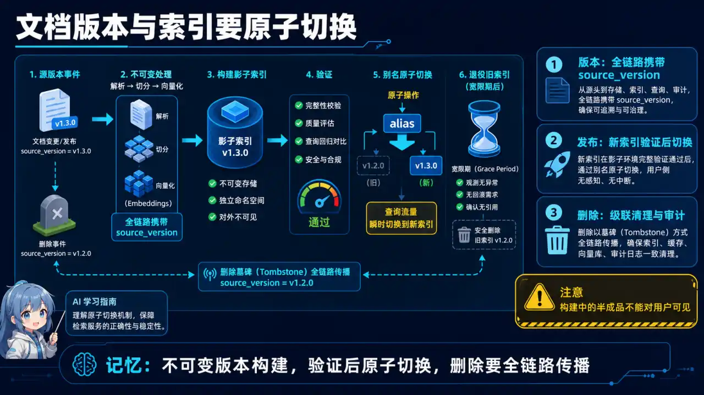
  </a>
</p>
<p align="center"><sub>🧠 图解记忆：用不可变版本构建，验证后原子切换，删除则全链路传播；点击图片可查看原图。</sub></p>
<details>
<summary>💡 答案要点</summary>

**为什么版本管理是生产级 RAG 的必备能力？**

```
文档更新场景：
- 用户上传了新版本合同，覆盖旧版本
- 知识库文章修改，但答案还是基于旧内容
- FAQ 更新，Bot 回答还是老答案

→ 如果索引不更新，RAG 会用过期知识回答，误导用户
```

**三种文档更新策略：**

**策略1：基于时间戳的增量更新（适合新闻、博客）**

<details>
<summary>展开 Python 代码示例（37 行）</summary>

```python
class TimeBasedIndexer:
    """基于文档修改时间戳的增量索引"""
    
    def __init__(self, vector_store, embedding_model):
        self.vector_store = vector_store
        self.embedding_model = embedding_model
    
    def sync_knowledge_base(self, docs_path: str):
        """
        每次同步：
        1. 扫描文档目录，记录文件修改时间
        2. 对比上次同步记录，找出'新增/修改'的文件
        3. 只对变化的文件重新计算 Embedding + 索引
        """
        current_state = self._scan_files(docs_path)
        previous_state = self._load_previous_state()  # {"file": "mtime"}
        
        # 找出增量
        changed_files = {
            f: mtime for f, mtime in current_state.items()
            if f not in previous_state or previous_state[f] != mtime
        }
        
        deleted_files = set(previous_state.keys()) - set(current_state.keys())
        
        # 删除已移除文档的索引
        for f in deleted_files:
            doc_id = self._get_doc_id(f)
            self.vector_store.delete(doc_id)
        
        # 只索引变化的文档
        for f in changed_files:
            chunks = self._parse_and_chunk(f)
            vectors = self.embedding_model.encode(chunks)
            self.vector_store.add(doc_id=self._get_doc_id(f), vectors=vectors)
        
        self._save_state(current_state)
```

</details>

**策略2：全文检索 + 向量检索双保险（适合版本敏感场景）**

<details>
<summary>展开 Python 代码示例（39 行）</summary>

```python
class HybridIndexer:
    """向量检索 + 全文检索双保险，版本敏感场景"""
    
    def __init__(self):
        self.vector_store = ChromaDB()      # 向量检索
        self.fulltext_store = Elasticsearch()  # 全文检索
        self.metadata_store = SQLite()      # 版本元数据
    
    def index_document(self, doc_id: str, content: str, version: str):
        # 1. 向量索引（用于语义检索）
        vector = self.embedding_model.encode(content)
        self.vector_store.upsert(doc_id, vector)
        
        # 2. 全文索引（用于精确关键词检索 + 版本对比）
        self.fulltext_store.index(doc_id, content, version=version)
        
        # 3. 元数据记录版本（用于版本溯源）
        self.metadata_store.put(doc_id, version=version, indexed_at=datetime.now())
    
    def retrieve(self, query: str, user_version: str = None):
        """
        检索时：
        - 向量检索保证语义理解
        - 全文检索保证版本最新
        - 元数据校验版本一致性
        """
        # 向量检索 Top-K
        vector_results = self.vector_store.search(query, top_k=10)
        
        # 过滤过期版本
        if user_version:
            fresh_results = []
            for r in vector_results:
                indexed_version = self.metadata_store.get(r.doc_id)["version"]
                if indexed_version == user_version:
                    fresh_results.append(r)
            return fresh_results
        
        return vector_results
```

</details>

**策略3：事件驱动实时更新（适合高变更频率知识库）**

```python
# 用 Watchdog 监控文件系统变化，实时触发索引更新
from watchdog.observers import Observer
from watchdog.events import FileSystemEventHandler

class KnowledgeBaseWatcher(FileSystemEventHandler):
    """监控知识库目录，文件变化自动触发索引更新"""
    
    def __init__(self, indexer: TimeBasedIndexer):
        self.indexer = indexer
    
    def on_modified(self, event):
        if event.is_directory:
            return
        if event.src_path.endswith(('.pdf', '.docx', '.md')):
            # 延迟防抖（避免频繁触发）
            self.debounce(event.src_path, delay_seconds=2)
    
    def debounce(self, path, delay_seconds):
        import threading
        timer = threading.Timer(delay_seconds, self._do_index, args=[path])
        timer.start()
    
    def _do_index(self, path):
        print(f"文档变更检测: {path}，触发索引更新")
        self.indexer.sync_single_file(path)
```

**生产选型建议：**

| 场景 | 推荐策略 | 原因 |
|------|----------|------|
| 静态知识库（手册、文档） | 定时增量同步 | 变化少，小时级同步足够 |
| 高变更知识库（FAQ、新闻） | 事件驱动实时 | 变化频繁，需要秒级响应 |
| 版本敏感（合同、法务） | 全文+向量双保险 | 需要版本溯源和对比 |

**面试话术：**
> "文档更新是生产 RAG 的高频痛点。我的经验是'分层更新'：变化频率低的用定时任务（每小时扫一次），变化高的用文件监控实时触发。最关键的是版本溯源——用户问'这份合同什么时候更新的'，你得能回答出来。我用了 SQLite 存元数据（版本号、更新时间），每次检索时校验版本，过期内容直接过滤掉。这是很多 demo 级 RAG 不会考虑但生产必须解决的问题。"

</details>

### Q11: 讲一次 AI 功能上线失败或效果回退，你如何复盘？


<p align="center">
  <a href="../../assets/illustrations/27-project-experience/q11-ai-failure-postmortem.webp">
    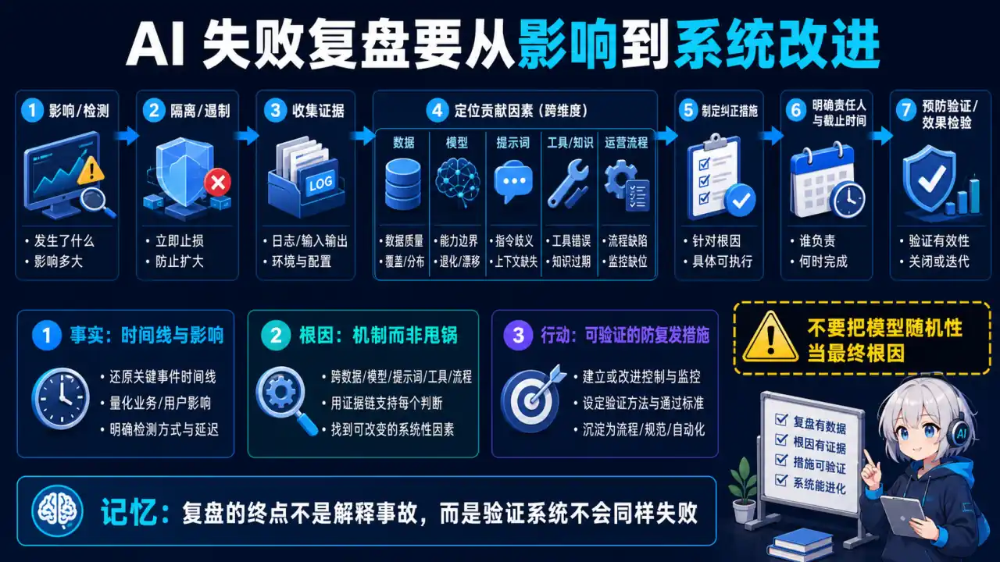
  </a>
</p>
<p align="center"><sub>🧠 图解记忆：复盘终点不是解释事故，而是验证系统不会以同样方式失败；点击图片可查看原图。</sub></p>
<details>
<summary>💡 答案要点</summary>

不要只讲“修了一个 bug”。完整回答应覆盖：

1. **影响**：用户范围、持续时间、质量/错误率/成本变化；
2. **发现**：监控告警、用户反馈还是人工抽检发现，为什么没有更早发现；
3. **根因**：区分直接触发因素和系统性原因，例如评测集缺口、配置不可回滚或权限边界错误；
4. **处置**：止损、回滚、数据修复和用户沟通；
5. **预防**：新增测试、门禁、监控和责任人，并验证措施真的生效。

回答时只使用自己能解释口径的真实数据。如果没有线上事故，可以讲一次被评测门禁拦住的回退，并说明如果进入生产会造成什么影响。

</details>

### Q12: 如何证明一个 AI 项目真的产生了业务价值？


<p align="center">
  <a href="../../assets/illustrations/27-project-experience/q12-ai-business-value.webp">
    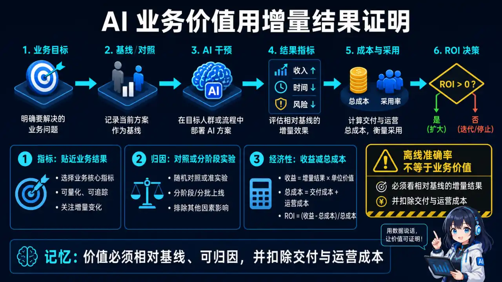
  </a>
</p>
<p align="center"><sub>🧠 图解记忆：价值必须相对基线、可归因，并扣除交付与运营成本；点击图片可查看原图。</sub></p>
<details>
<summary>💡 答案要点</summary>

先定义业务结果，再选模型指标。客服场景可能看一次解决率、转人工率和满意度；研发工具可能看任务完成率、采纳率和返工；审核系统可能看漏放、误杀和人工工作量。

避免把“调用量”“生成 Token 数”“模型分数上涨”直接当成价值。应说明基线、实验组、观察窗口、护栏指标和归因限制。若不能做随机实验，可使用分阶段发布、匹配对照或差分方法，但要承认混杂因素。

成本也属于结果：比较单位成功任务成本，而不只是单次调用价格。

</details>

### Q13: 项目中什么时候应该不用 LLM，或者从 Agent 降级为 Workflow？


<p align="center">
  <a href="../../assets/illustrations/27-project-experience/q13-when-not-to-use-llm.webp">
    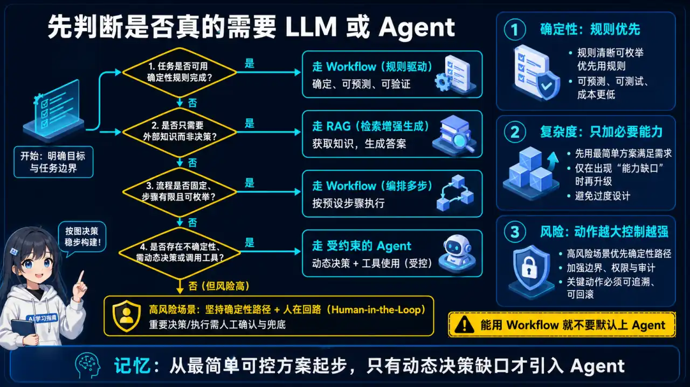
  </a>
</p>
<p align="center"><sub>🧠 图解记忆：从最简单可控方案起步，只有动态决策缺口才引入 Agent；点击图片可查看原图。</sub></p>
<details>
<summary>💡 答案要点</summary>

当输入结构稳定、规则明确、错误代价高、延迟预算很低或缺少可靠评测时，优先考虑规则、小模型或确定性工作流。只有在开放式语义理解、长尾输入或动态决策带来可测收益时，才增加 LLM/Agent 自主性。

回答要给出渐进式方案：规则/检索 → 单次 LLM → 有限工具工作流 → 带循环的 Agent。每升一级都要求新的评测、权限、停止条件和降级路径。能主动说明“不使用 AI”的边界，比一味堆模型更能体现工程判断。

</details>

---

### Q14: 垂直行业 AI 项目（如律所）从 0 到 1 搭 MVP，怎么抓大放小？哪些模块先行？


<p align="center">
  <a href="../../assets/illustrations/27-project-experience/q14-vertical-ai-mvp.webp">
    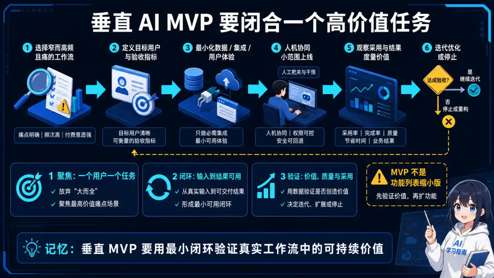
  </a>
</p>
<p align="center"><sub>🧠 图解记忆：垂直 MVP 要用最小闭环验证真实工作流中的可持续价值；点击图片可查看原图。</sub></p>
> 2026 年项目深挖高频题：面试官想听的不是“我用了 LangChain”，而是你面对一个资源有限的垂直行业场景，怎么选场景、拆模块、控风险。用“律所 AI”当例子讲通用方法，能同时体现行业理解 + 工程取舍。

<details>
<summary>💡 答案要点</summary>

**核心原则：抓大放小 = 先做价值最大、数据最全、效果最好评的三个象限，其余一律后置。**

**第一步：场景排序（用三个维度打分）**

```
维度：①业务价值（省人力/增收） ②数据可得性（有没有现成语料） ③效果可评测（对错边界清不清晰）

律所场景打分示例：
- 客服接待（案由咨询/预约/进度查询）：价值高、数据足（历史聊天记录）、可评测（转人工率/满意度）→ 先行
- 法律知识问答（法条/案例检索）：价值中高、数据足（公开法条+判决书）、可评测（检索命中率）→ 次之
- 文书辅助（合同审查/起诉状起草）：价值高、数据弱（文书涉密）、风险高（法律后果）→ 后置，先做人工审校的半自动
```

**第二步：MVP 只做两件事（客服 + 法律问答），砍掉什么要明说：**

| 砍掉/后置 | 原因 |
|-----------|------|
| 文书自动生成 | 出错有法律后果，且涉密数据清洗合规周期长 |
| 多租户/复杂权限 | MVP 阶段单所试点即可 |
| 全渠道接入 | 先打通一个入口（官网/公众号） |
| Agent 全自主 | 先人工兜底，再逐步放开 |

**第三步：数据准备是垂直行业的隐形工期（最容易踩坑）：**

```
法律问答的 RAG 落地时间线：
公开法条 + 判决书 → 格式归一（PDF/扫描件解析）→ 清洗（脱敏！）
→ 切分策略 → 入库 → 检索评测 → 律师人工抽检

坑：
- 判决书格式千奇百怪，解析器要反复调
- 涉密文书必须脱敏，合规审查本身耗时间
- “律师觉得答得不对”才是真评测标准，光靠 RAGAS 分数不够
```

**第四步：落地节奏——人工兜底 → 半自动 → 全自动：**

```
阶段1：AI 生成草稿 + 律师人工修改（积累标注数据）
阶段2：结构化数据（案由/法条/时效）AI 直接答，开放性问题转人工
阶段3：常见问题全自动 + 自动回填知识库 + 效果看板
```

**面试话术：**
> “垂直行业 MVP 我的思路是抓大放小：用价值、数据、可评测三个维度给场景排序。以律所为例，客服接待和法条问答先行——高频、语料足、对错能评；文书生成后置，因为出错有法律后果、数据又涉密，合规清洗周期长。数据准备是隐性工期，判决书解析、脱敏、律师人工抽检一样不能少。节奏上先人工兜底积累标注，再半自动，最后全自动，每一步都用线上数据回流评测集，证明效果真的在涨，才敢放开。"

</details>

---

## 更新记录

| 日期 | 更新内容 |
|------|----------|
| 2026-08-14 | 新增 Q14 垂直行业 AI MVP 搭建（场景排序/模块取舍/数据工期/人工兜底节奏） |
