# 🧪 测试 Harness 与 LLM 评测面试题（Test Harness / Mock & Stub / Eval Harness）

> **面试优先顺序（通用 AI 应用开发岗位）**：Q1、Q2、Q4、Q5、Q6、Q7、Q8、Q11、Q12、Q13、Q14、Q15。其余题目用于进阶或特定岗位拓展；实际频率会随岗位和面试轮次变化，产品版本资讯不应当作通用必考题。

> **难度：** ⭐⭐⭐
> **更新：** 2026-08-13
> **考点：** Test Harness、mock/stub/fake/spy、fixture、flaky 治理、特征测试、契约测试、LLM Eval Harness、评测集建设、灰度评测、Agent 轨迹评测

## 📋 目录

1. [Test Harness 基础认知](#一test-harness-基础认知)
2. [Test Harness 工程实践 10 问](#二test-harness-工程实践-10-问q1-q10)
3. [LLM 评测 Harness](#三llm-评测-harnessq11-q16)
4. [Agent 运行治理与回归评测](#四agent-运行治理与回归评测q17-q19)
5. [加分话术与简历写法](#五加分话术与简历写法)

## 一、Test Harness 基础认知

> 面试官问 harness，第一层考定义，第二层考组成，第三层考"你和它的真实关系"。简历写"熟悉单元测试、参与过 CI 集成"的人，最容易被这道题卡住——不是技术不行，是没想过"测试"本身也是会被深挖的系统设计题。

**标准定义：** Test Harness（测试夹具/测试台）是一套把被测代码"装进去跑起来"的基础设施，包含五个部分：

| 要素 | 职责 | 示例 |
|------|------|------|
| 测试运行器 | 收集并执行用例 | Go testing / pytest / JUnit |
| 测试数据 | 固定、可复现的输入 | fixture、fixture 文件、YAML 数据集 |
| 断言逻辑 | 校验实际输出与期望一致 | testify / assert |
| 依赖替身 | 隔离外部依赖 | stub / mock / fake / spy |
| 结果报告 | 汇总通过率、覆盖率、耗时 | 覆盖率报告、CI 报告 |

**核心职责三个词：可重复、可隔离、可自动化。**

**和测试框架的区别（最容易被绕晕、最爱考的点）：**

- 测试框架（pytest / JUnit / Go testing）是"语言层面的工具"，提供断言、收集用例、跑用例的能力；
- Test Harness 是"工程层面的系统"，在框架之上，负责把被测模块和外部依赖（数据库、网络、文件、时间）剥离开，让测试在任何环境、任何顺序下跑，结果都一样。

> 一句话记忆：**框架管"怎么跑"，harness 管"跑得干不干净、靠不靠谱"。**

**为什么需要它：** 没有 harness，你的测试依赖本地数据库、依赖网络、依赖环境变量，今天能过明天挂，换个同事机器就红——这种测试比没有测试还可怕，因为它给你虚假的安全感。

**和测试脚本的区别：** 脚本是"一次性验证"，harness 是"可持续运行、可重复、可集成进 CI 的工程系统"。pytest + fixture + mock + 覆盖率报告 + Jenkins/GitHub Actions 触发，这一整套才是 harness。

## 二、Test Harness 工程实践 10 问（Q1-Q10）

### Q1: 什么是 test harness？和测试脚本有什么区别？


<p align="center">
  <a href="../../assets/illustrations/28-test-harness-evaluation/q01-test-harness.webp">
    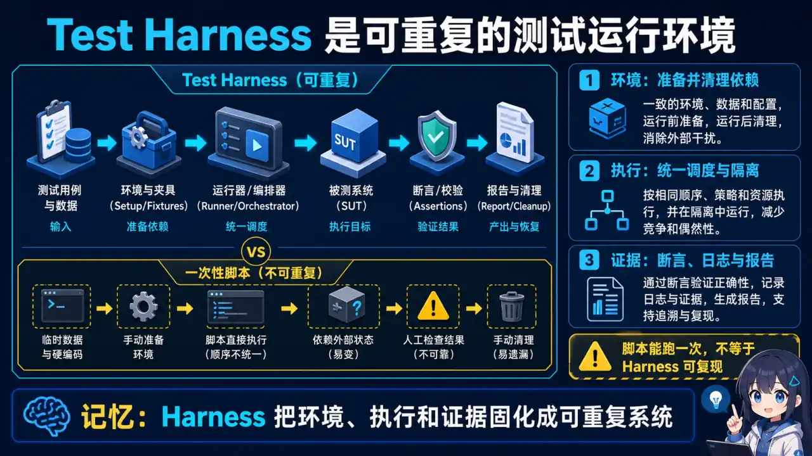
  </a>
</p>
<p align="center"><sub>🧠 图解记忆：Harness 把环境、执行和证据固化成可重复系统；点击图片可查看原图。</sub></p>
**❌ 错误回答：** 就是写测试的代码。

**✅ 参考要点：**
- 先给定义：一套支持被测代码运行的基础设施，五要素（运行器/数据/断言/替身/报告）；
- 对比测试脚本：脚本是"一次性验证"，harness 是"可持续运行、可重复、可集成进 CI 的工程系统"；
- 举例：pytest + fixture + mock + 覆盖率报告 + CI 触发，这一整套才是 harness；Go 项目同理是 `go test` + testify + testcontainers + GitHub Actions。

**常见追问：**
1. 你项目里的测试是"能跑"还是"harness 级"？——问的是你有没有隔离外部依赖、有没有 CI 集成
2. harness 和测试框架的分工边界在哪？

---

### Q2: 如何设计一个可重复运行的 harness？（系统设计题）


<p align="center">
  <a href="../../assets/illustrations/28-test-harness-evaluation/q02-repeatable-harness.webp">
    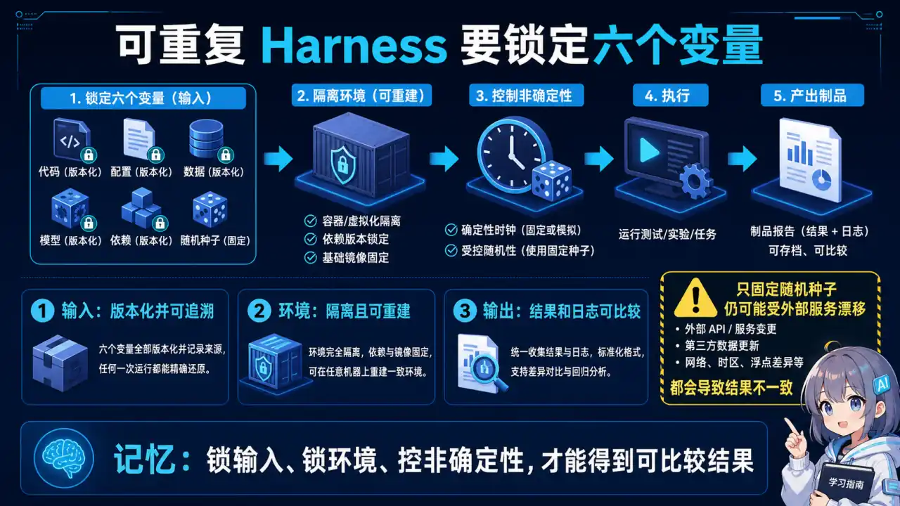
  </a>
</p>
<p align="center"><sub>🧠 图解记忆：锁输入、锁环境、控非确定性，才能得到可比较结果；点击图片可查看原图。</sub></p>
按这四条答基本满分：

1. **确定性：** 固定随机种子、固定时区、固定 locale，禁止依赖"当前时间"做断言（用注入的 Clock）；
2. **隔离性：** 每个用例独立数据，跑完清理现场（teardown），不留脏数据；
3. **顺序无关：** 用例之间无共享可变状态，能并行就并行；
4. **环境无关：** 数据库用内存版或测试容器，网络用替身，环境变量在 fixture 里统一注入。

**加分项：** 说出"幂等性"（同一用例跑 N 次结果一致）和"可定位性"（失败时能一眼看出是哪个用例、哪条数据、哪个断言挂了）。

**面试话术：**
> "我会把 harness 当产品设计：确定性靠固定种子和注入时钟，隔离性靠每用例独立数据 + teardown，顺序无关靠无共享可变状态，环境无关靠内存库和网络替身。再加幂等和可定位——失败日志要能直接定位到用例、数据和断言。"

---

### Q3: fixture 的生命周期和作用域怎么控制？


<p align="center">
  <a href="../../assets/illustrations/28-test-harness-evaluation/q03-fixture-lifecycle.webp">
    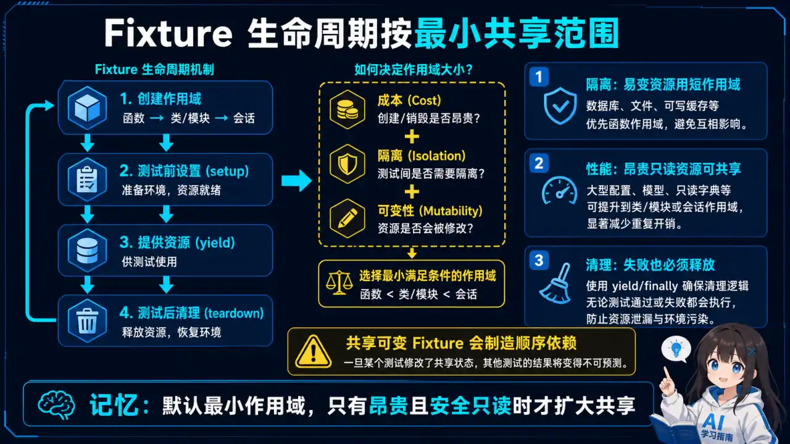
  </a>
</p>
<p align="center"><sub>🧠 图解记忆：Fixture 默认取最小作用域，只有昂贵且安全只读时才扩大共享；点击图片可查看原图。</sub></p>
**生命周期：** setup（准备）→ 执行 → teardown（清理）。

- pytest 用 `yield` 实现"执行前准备 + 执行后清理"（yield 前是 setup，yield 后是 teardown）；
- Go 里对应 `t.Cleanup` / `TestMain`，或 `setup()` / `teardown()` 成对函数。

**作用域（pytest）：** function（默认，每个用例独立）、class、module、session（全进程共享一次）。

**选择逻辑：** 共享成本高的（连库、起服务）往上提，有状态的往下沉。session 级共享要小心状态污染，function 级最安全但最慢。

**加分项：** 说出"fixture 依赖注入"——fixture 可以依赖另一个 fixture，pytest 自动解析依赖图。

**常见追问：** session 级共享的数据库连接如何防止状态污染？（每个用例独立事务/独立 schema，或用 savepoint 回滚）

---

### Q4: mock、stub、fake、spy 的区别？什么时候用哪个？（必考）


<p align="center">
  <a href="../../assets/illustrations/28-test-harness-evaluation/q04-test-doubles.webp">
    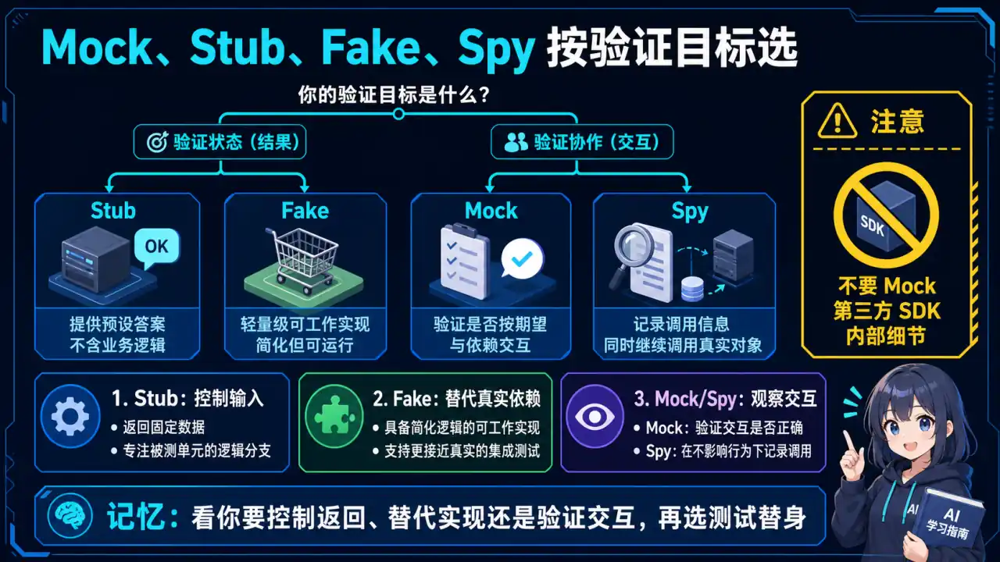
  </a>
</p>
<p align="center"><sub>🧠 图解记忆：先明确要控制返回、替代实现还是观察交互，再选择测试替身；点击图片可查看原图。</sub></p>
> 就是开场那道题，必须能脱口而出。

| 替身 | 行为 | 典型用途 |
|------|------|----------|
| **stub（桩）** | 只返回预设结果，不记录调用 | 把外部依赖换成固定答案 |
| **fake（替身）** | 有真实逻辑的简化实现（内存版数据库、假 HTTP 服务），行为接近真实 | 模拟真实行为 |
| **mock（模拟）** | stub + 验证，能断言"这个方法被调用了几次、传了什么参数" | 验证调用关系 |
| **spy（间谍）** | 包装真实对象，记录调用但不替换逻辑 | 在真实对象上做观察 |

**选型口诀：**
- 只想要固定返回值 → **stub**
- 要验证"调没调、调了几次、传了什么参数" → **mock**
- 要模拟真实行为 → **fake**
- 要在真实对象上做观察 → **spy**

**工程取舍：** mock 过多会把测试绑死在实现细节上（重构时测试跟着碎），倾向"接口 + fake"；但需要验证时序/调用次数时 mock 不可替代。原则：**能 fake 不 mock，能 stub 不 mock。**

**常见追问：** 什么时候 mock 会害了你？（接口变动频繁、过度验证内部实现导致重构成本高、测试与实现强耦合）

---

### Q5: 测试里依赖数据库/网络/时间/文件，怎么隔离？


<p align="center">
  <a href="../../assets/illustrations/28-test-harness-evaluation/q05-dependency-isolation.webp">
    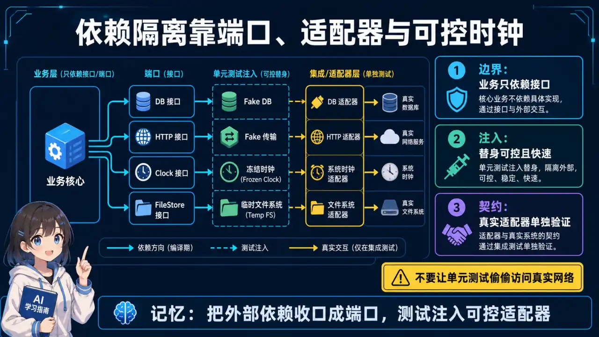
  </a>
</p>
<p align="center"><sub>🧠 图解记忆：把外部依赖收口成端口，测试注入可控适配器；点击图片可查看原图。</sub></p>
| 外部依赖 | 隔离手段 |
|----------|----------|
| 数据库 | 内存库（SQLite `:memory:` / H2）+ 测试容器（Testcontainers）跑真实引擎 |
| 网络 | HTTP 层用 stub/mock，或起本地 WireMock 假服务 |
| 时间 | 注入 Clock 接口，测试里传固定时间，禁止直接 `time.Now()` |
| 文件 | 临时目录 + 跑完删除，用 `tmp_path` 这类自带清理的 fixture |

**一句话原则：** 所有外部依赖都走"接口 + 替身"，被测代码不感知测试环境。

**面试话术：**
> "外部依赖一律走接口注入：数据库用内存库或 Testcontainers，网络用 stub 或 WireMock，时间用 Clock 注入，文件用自带清理的临时目录。被测代码根本不感知自己在测试环境里。"

---

### Q6: 测试经常随机挂（flaky），怎么治理？（高频追问，体现工程经验）


<p align="center">
  <a href="../../assets/illustrations/28-test-harness-evaluation/q06-flaky-test-governance.webp">
    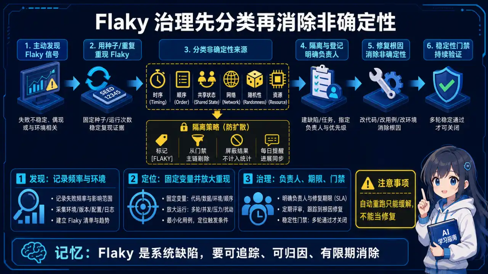
  </a>
</p>
<p align="center"><sub>🧠 图解记忆：Flaky 是系统缺陷，必须可追踪、可归因并限期消除；点击图片可查看原图。</sub></p>
1. **先复现：** 记录失败时的完整上下文（seed、数据、顺序）；
2. **找根因：** 90% 是共享状态污染（全局变量、静态单例、缓存未清理）、时序依赖（sleep、异步没等）、外部依赖抖动；
3. **三板斧：** 隔离数据、注入时钟、替身代替真实网络；
4. **兜底机制：** 重试要谨慎——重试是止痛药不是解药，先治根因；
5. **加分项：** 在 CI 里对 flaky 测试单独标记统计，连续挂 N 次自动禁用以止损，但不删、要修复。

**工程取舍：** 直接删 flaky 测试是最差解（丢掉防护）；无限重试掩盖问题（测试变绿但失去意义）；正确做法是"标记 + 统计 + 修根因 + 复启用"。

**验证方法：** 以 flaky 率作为 harness 质量指标（目标示例：<1%），CI 里统计每测试的失败率。

---

### Q7: 接手一堆没有测试的老代码，怎么补 harness？（考察落地能力）


<p align="center">
  <a href="../../assets/illustrations/28-test-harness-evaluation/q07-legacy-code-harness.webp">
    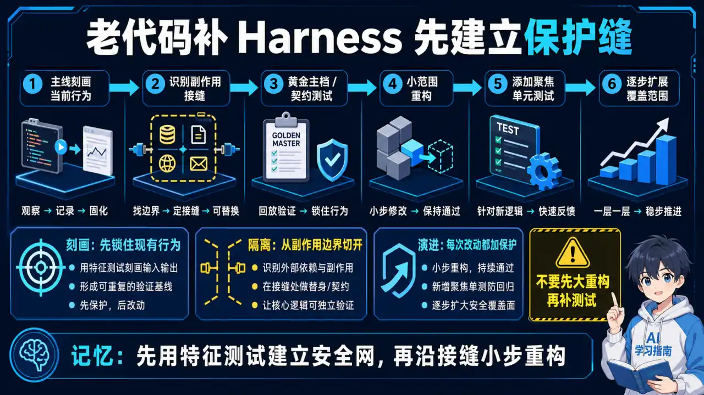
  </a>
</p>
<p align="center"><sub>🧠 图解记忆：先用特征测试建立保护缝，再沿接缝小步重构；点击图片可查看原图。</sub></p>
1. **从入口层（接口/控制器）开始，** 先做"冒烟 harness"保证能跑；
2. **用特征测试（characterization test）：** 记录当前行为，断言"行为不变"，重构时兜底——不知道对不对，先锁住"不变得更糟"；
3. **先补最高风险路径（支付、鉴权、核心算法），** 不要追求全覆盖；
4. **边补边拆：** 把难测的静态依赖改成可注入，一次只动一小步；
5. **一句话：** harness 是重构的安全网，先有网再动刀。

**面试话术：**
> "老代码补测试我不追求覆盖率，先做冒烟 harness 保证能跑，再用特征测试锁住当前行为当安全网，优先补支付、鉴权这类高风险路径，边补边把静态依赖改成可注入。先有网再动刀。"

---

### Q8: 集成测试的 harness 怎么设计？真实依赖还是替身？


<p align="center">
  <a href="../../assets/illustrations/28-test-harness-evaluation/q08-integration-test-harness.webp">
    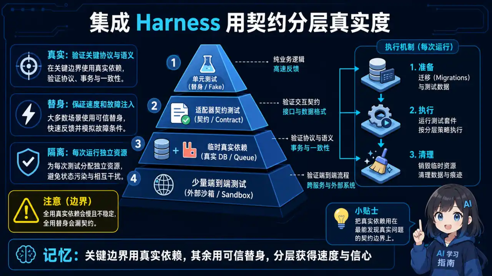
  </a>
</p>
<p align="center"><sub>🧠 图解记忆：关键边界用真实依赖，其余用可靠替身，分层获得速度与信心；点击图片可查看原图。</sub></p>
**原则：** 越接近真实越好，但用成本平衡。

**分层做法：**

| 测试层级 | 依赖策略 |
|----------|----------|
| 单元测试 | 全替身 |
| 集成测试 | Testcontainers 起真实中间件（Redis/MySQL/Kafka） |
| 端到端 | 只对关键链路 |

**区分两类：** "测试被测代码"用替身，"测试系统协作"用真实。

**加分项：** 说出"契约测试"——用 Pact 之类的工具，服务间只验证接口契约，不用真联调，解决"两边都过、联调就挂"的问题。

**常见追问：** Testcontainers 的启动成本怎么控制？（共享容器、session 级复用；或按模块分组）

---

### Q9: 怎么衡量一个 harness 本身好不好？（考察质量意识）


<p align="center">
  <a href="../../assets/illustrations/28-test-harness-evaluation/q09-harness-quality.webp">
    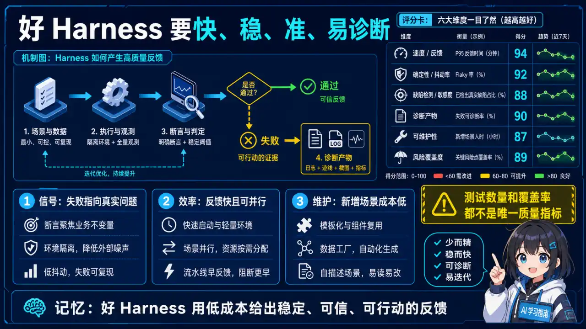
  </a>
</p>
<p align="center"><sub>🧠 图解记忆：好 Harness 以低成本给出稳定、可信且可行动的反馈；点击图片可查看原图。</sub></p>
**三个核心指标：**

| 指标 | 目标（示例/常见经验值） | 说明 |
|------|------------------------|------|
| 覆盖率 | 行/分支覆盖，别只看行覆盖率 | 分支覆盖更能暴露漏测分支 |
| 稳定性 | flaky 率 < 1% | 随机挂的测试比没有更糟 |
| 耗时 | 单测 < 1s/个，全量 < 10 分钟 | 超过这个量级开发就不愿意跑了 |

**两个加分指标：** 故障定位时间（测试挂了多少人能自己定位）和维护成本（每次改代码要动多少测试）。

**一句话原则：** 测试是给开发减负的，不是增负的——维护成本过高的测试，会被团队悄悄删掉。

---

### Q10: 参数化测试和数据驱动怎么落地？


<p align="center">
  <a href="../../assets/illustrations/28-test-harness-evaluation/q10-parameterized-testing.webp">
    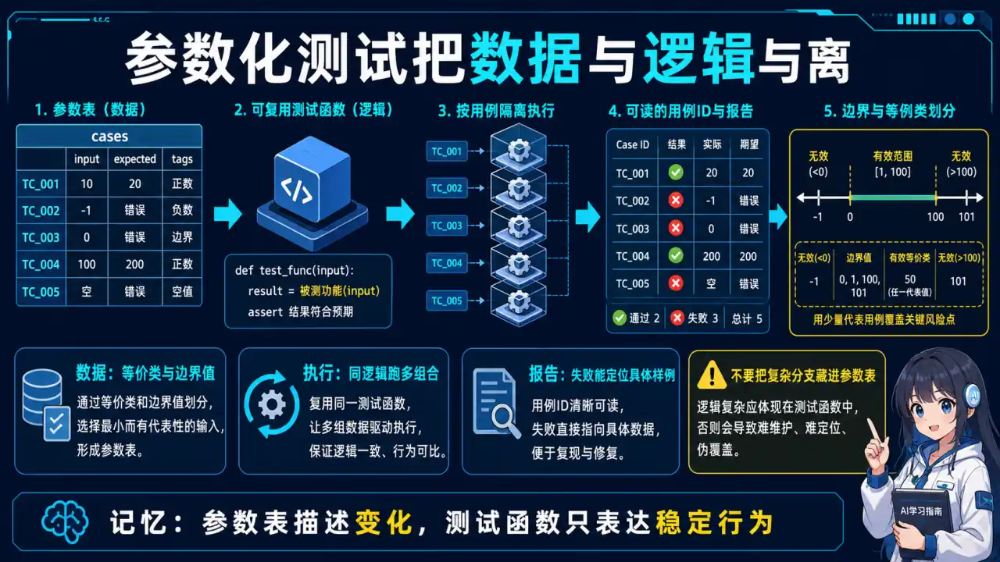
  </a>
</p>
<p align="center"><sub>🧠 图解记忆：参数表描述变化，测试函数只表达稳定行为；点击图片可查看原图。</sub></p>
**目的：** 同一段逻辑，多组输入输出，一组用例。

**落地方式：**
- pytest：`@pytest.mark.parametrize`
- Java：`@ParameterizedTest`
- Go：`t.Run` + table-driven（表驱动测试，Go 社区标准写法）

**Go 表驱动示例（可运行示例）：**

```go
func TestCalculatePrice(t *testing.T) {
    tests := []struct {
        name   string
        input  float64
        coupon float64
        want   float64
    }{
        {"normal", 100, 20, 80},
        {"zero", 0, 20, 0},
        {"over-deduct", 10, 20, 0},
    }
    for _, tt := range tests {
        t.Run(tt.name, func(t *testing.T) {
            if got := CalculatePrice(tt.input, tt.coupon); got != tt.want {
                t.Errorf("got %v, want %v", got, tt.want)
            }
        })
    }
}
```

**数据放哪：** 简单数据放代码里，复杂数据放 YAML/JSON 外部文件，测试数据统一管理。

**边界思维：** 正常值、边界值、异常值、空值都要覆盖——说出这几个词，面试官就知道你写过真测试。

## 三、LLM 评测 Harness（Q11-Q16）

> 面 AI 后端 / RAG / Agent 岗，这部分才是拉开差距的地方。传统 harness 测的是"代码逻辑对不对"，LLM 评测 harness 测的是"模型输出好不好"——后者没有确定的正确答案，问题维度完全不同。

**为什么 AI 项目必须要有 eval harness：**
- 大模型输出是概率的，改一个 prompt、换一个模型版本，效果是涨是跌，不测永远不知道；
- 业务方一句"效果变差了"，你没有评测集就无从定位是检索问题、prompt 问题还是模型问题；
- 面试里"我用评测集管理 RAG 质量"和"我调参靠感觉"，是两个档次的回答。

**一套完整的 LLM eval harness 五件套：**

| 组件 | 职责 |
|------|------|
| 评测集 | 一组带标注的输入-期望输出（问题 + 标准答案/判定标准） |
| 运行器 | 批量把评测集喂给模型/RAG 系统，跑出结果 |
| 指标 | 离线：准确率、召回、忠实度、答案相关性；线上：点击、采纳率、成本 |
| 报告 | 每次改动自动出一份对比报告，diff 到上一版，红了就回滚 |
| CI 集成 | 评测集 + 跑批 + 报告封装进 CI，改动即回归 |

**常用工具（面试点名说工具名，非常加分）：**
- **lm-evaluation-harness：** EleutherAI 出品，评测主流开源模型的标准工具；
- **OpenAI Evals：** 写 eval 用例、跑对比评测的框架；
- **RAGAS：** 专门评测 RAG 四维指标——忠实度、答案相关性、上下文相关性、噪声鲁棒性（四个指标详解见 [09 · 安全与评估 Q6](../09-ai-safety-evaluation/)）；
- **自建：** 把评测集 + 跑批 + 报告封装进自己的 CI，就是生产级做法。

**评测集怎么建（最容易露馅的问题，认真记）：**
1. **从真实线上日志挖**（用户真实问题，不是拍脑袋编的）；
2. **按维度分层：** 简单/中等/难，覆盖不同业务场景；
3. **每类问题配判定标准**（期望答案要点），宁可少而准，不要多而水；
4. **版本化管理，** 测试集和开发集分开，防止调参时"背题"；
5. **定期抽检人工复核，** 防止标注质量漂移。

**灰度评测（高级考点）：** 线上新模型先 Shadow 模式（影子流量，新旧并行跑，结果对拍不计费不展示），指标稳了再 Canary（小流量放量），最后全量。这套词说出来，面试官就知道你真上过生产。（RAG 灰度发布详细流程见 [20 · RAG 高级优化 Q28](../20-rag-advanced-optimization/)）

### Q11: 你的 RAG 项目效果怎么评测？


<p align="center">
  <a href="../../assets/illustrations/28-test-harness-evaluation/q11-rag-eval-harness.webp">
    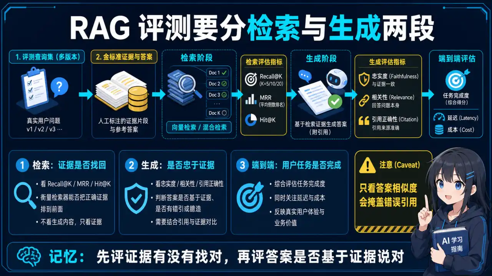
  </a>
</p>
<p align="center"><sub>🧠 图解记忆：先评证据有没有找对，再评答案是否基于证据说对；点击图片可查看原图。</sub></p>
**先分两层：** 检索层（top-k 命中率、召回率）+ 生成层（忠实度、相关性）。

**工具点名：** RAGAS 四个指标 + 自己标注的评测集。

**关键话术：**
> "每次改 chunk 策略、embedding 模型、重排逻辑，都跑一遍固定评测集，用报告说话，不用感觉说话。"

**加分项：** 提"线上反馈回流"——用户点踩/追问回流成新评测用例，评测集越用越准。

> 关联主答案：RAGAS 四指标定义与优化见 [09 · 安全与评估 Q6](../09-ai-safety-evaluation/)；RAG 系统化评估与跷跷板见 [20 · RAG 高级优化 Q27](../20-rag-advanced-optimization/)。

---

### Q12: 离线评测和线上评测有什么区别？


<p align="center">
  <a href="../../assets/illustrations/28-test-harness-evaluation/q12-offline-vs-online-eval.webp">
    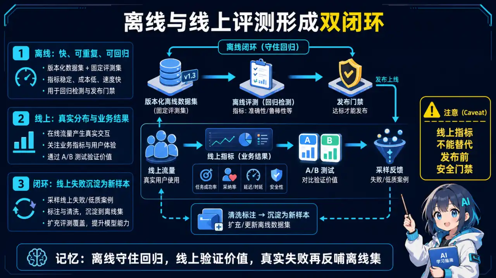
  </a>
</p>
<p align="center"><sub>🧠 图解记忆：离线守住回归，线上验证价值，真实失败再反哺离线集；点击图片可查看原图。</sub></p>
| 维度 | 离线评测 | 线上评测 |
|------|----------|----------|
| 速度/成本 | 快、便宜、可重复 | 慢、贵、真实 |
| 评测对象 | 模型能力（评测集批量跑） | 用户行为（点击率、采纳率、留存） |
| 结论 | 测"能力"，不测"用户行为" | 测"真实效果" |

**结论：** 离线筛选，线上验证——离线过了才上灰度，线上数据再回流补离线集，形成闭环。

**面试话术：**
> "离线评测快、便宜、可重复，但测的是模型能力不是用户行为；线上用灰度看点击率、采纳率。我的做法是离线筛选、线上验证，线上数据再回流补离线评测集，形成闭环。"

---

### Q13: 怎么建评测集？怎么防止评测集被"背题"（过拟合/数据泄漏）？


<p align="center">
  <a href="../../assets/illustrations/28-test-harness-evaluation/q13-eval-set-leakage.webp">
    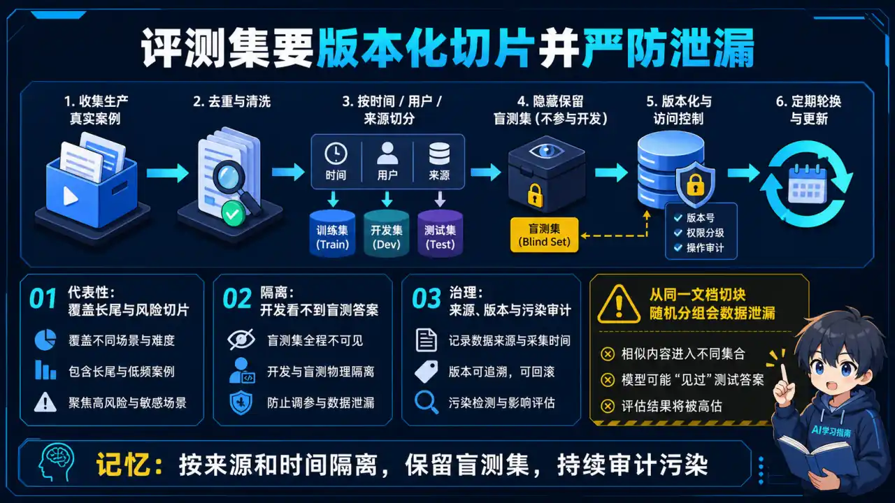
  </a>
</p>
<p align="center"><sub>🧠 图解记忆：按来源和时间隔离，保留盲测集，并持续审计污染；点击图片可查看原图。</sub></p>
**防背题四招：**
1. 开发集和测试集严格分开，测试集只在最终验证时用一次；
2. 定期从线上抽新问题加入测试集，让评测集"长新题"；
3. 人工抽检模型在测试集上的表现，防止"评测集分数高、实际一塌糊涂"；
4. 一句话：评测集是你的考试卷，平时练的是模拟卷，别拿考试卷当练习卷。

> 关联主答案：红队测试集构建与泄漏防范见 [09 · 安全与评估 Q9](../09-ai-safety-evaluation/)。

---

### Q14: 离线评测分高，线上效果却变差了，怎么排查？（经典"评测跷跷板"）


<p align="center">
  <a href="../../assets/illustrations/28-test-harness-evaluation/q14-eval-seesaw.webp">
    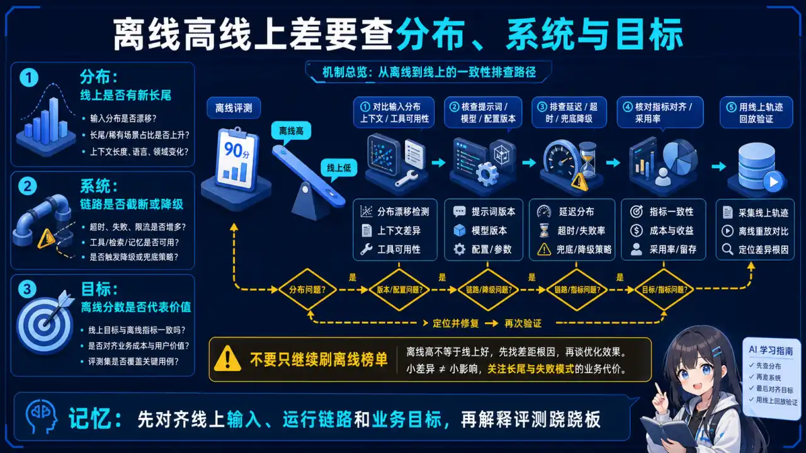
  </a>
</p>
<p align="center"><sub>🧠 图解记忆：先对齐线上输入、运行链路和业务目标，再解释评测跷跷板；点击图片可查看原图。</sub></p>
> "跷跷板效应"的系统化处理见 [20 · RAG 高级优化 Q27](../20-rag-advanced-optimization/)，本节给排查清单。

**排查顺序：**
1. **先怀疑评测集偏差：** 离线问题分布和线上真实流量不一致（太简单/太偏）；
2. **再看指标错位：** 离线测的是忠实度，线上用户关心的是速度/成本/能不能过审；
3. **排查环境差异：** 线上检索库更新了吗？上下文长度截断了吗？prompt 版本一致吗？

**结论：** 离线评测只能筛出"明显变差"，筛不出"线上细节"——所以必须灰度。

---

### Q15: Agent 类应用（会调工具的）怎么评测？（最前沿，答出来直接拉开差距）


<p align="center">
  <a href="../../assets/illustrations/28-test-harness-evaluation/q15-agent-trajectory-eval.webp">
    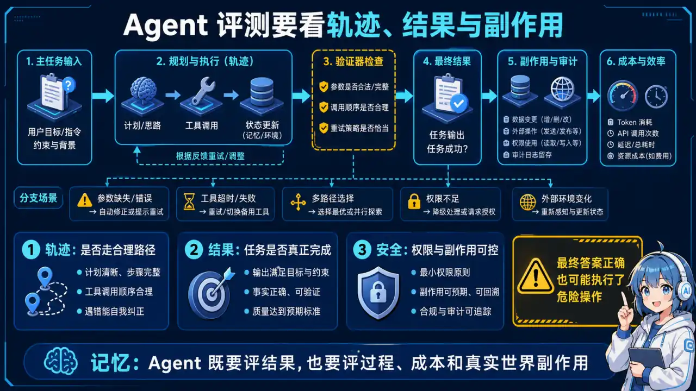
  </a>
</p>
<p align="center"><sub>🧠 图解记忆：Agent 既要评结果，也要评轨迹、成本与真实世界副作用；点击图片可查看原图。</sub></p>
**不能只看最终答案，要看轨迹：** 工具调对了没、参数传对了没、失败后有没有兜底。

**评测维度：** 工具调用准确率、多轮任务完成率、兜底成功率、成本，以及隐私泄露、越权操作、财产/数据损失等真实世界副作用。

**任务成功和行为安全必须拆开：** Agent 可能完成了订票、发邮件或修改文件，但过程中使用了越权工具、泄露了敏感信息，或在没有确认的情况下执行了不可逆操作。R-Judge 的思路是把完整多轮交互记录映射成安全标签和风险描述，评估的是模型能否识别轨迹中的行为风险，而不是只看最终回复是否“无害”。

建议每条轨迹至少记录：

- 用户目标、每轮 observation / thought 摘要 / action；
- 工具身份、参数摘要、权限判定和真实副作用；
- 最终任务状态与独立的 `safe / unsafe` 标签；
- 风险发生在哪一步、属于哪类风险、是否本可通过确认或权限策略阻断。

安全 Judge 要用人工标注校准，并分别报告任务成功率与风险识别指标；不能把二者合成一个总分，否则高任务完成率可能掩盖严重安全事故。

**落地方法：** 把"期望的调用序列"写进用例，跑批后对比实际调用轨迹。

**加分项：** 提到"状态自检 harness"——Agent 每步都输出结构化日志，评测时回放日志就能定位是哪一步错了。

**示例（伪代码）：**

```
用例: "帮我订明天去上海的机票"
期望轨迹: [search_flights(city=上海, date=明天), book_flight(flight_id)]
实际轨迹: [search_flights(city=上海, date=明天), search_flights(city=上海, date=明天), book_flight(flight_id)]
判定: 工具调用准确率 2/3（第二次 search_flights 为冗余调用）→ 需优化
```

**面试话术：**
> "Agent 评测不能只看最终答案，我会把期望的工具调用序列写进用例，跑批后对比实际轨迹，看工具调对没、参数传对没、失败有没有兜底，再加成本维度。Agent 每步输出结构化日志，评测时回放日志就能定位是哪一步错了。"

> 关联主答案：Agent 评估指标与 A/B 测试见 [23 · Agent 可观测性 Q7](../23-agent-observability/)。

**参考资料：** [R-Judge：Benchmarking Safety Risk Awareness for LLM Agents](https://arxiv.org/abs/2401.10019) · [课程实验与课件索引](../references/dive-into-llms-reading-list.md#10-agent-安全评测高优先级)

---

### Q16: Harness 作为 Agent 的"安全沙箱"怎么理解？权限管控和自动化评测如何落地？（2026 高频）


<p align="center">
  <a href="../../assets/illustrations/28-test-harness-evaluation/q16-agent-safety-harness.webp">
    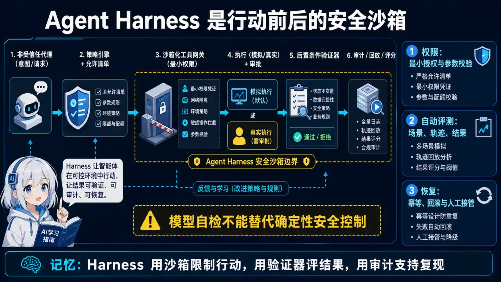
  </a>
</p>
<p align="center"><sub>🧠 图解记忆：用沙箱限制行动，用验证器评结果，用审计支持复现；点击图片可查看原图。</sub></p>
> 面 Agent 岗最容易被追问的一题：Agent 有工具调用能力后，Harness 就不只是"测试台"了，它还承担"安全边界"职责。能讲清"安全沙箱 = 权限管控 + 自动化评测"双重定位的候选人，直接和只会写单测的人拉开差距。

<details>
<summary>💡 答案要点</summary>

**一句话本质：**

> Agent Harness = 安全沙箱（约束 Agent 能做什么）+ 评测台（验证 Agent 做得好不好）。前者管权限边界，后者管质量边界，两者共用同一套"工具调用可观测"基础设施。

**为什么 Agent 比传统服务更需要沙箱：**

```
传统服务：输入 → 固定代码路径 → 输出（行为可穷举、可审计）
Agent：输入 → LLM 自主决策 → 调用任意工具 → 副作用（行为不可穷举）

风险：LLM 可能被 prompt injection 劫持、可能选错工具、可能用错参数
→ 必须把 Agent 的行为空间框在沙箱里，而不是事后追责
```

**权限管控四件套（回答必带）：**

| 手段 | 做法 | 拦截对象 |
|------|------|----------|
| **工具白名单** | Agent 只能调用注册过的工具，未注册一律拒绝 | 模型自己发明/拼接工具调用 |
| **最小权限** | 每个工具声明所需 scope，读的不能写、写的不能删 | 越权操作（OWASP MCP02 Scope Creep） |
| **沙箱隔离** | 危险工具（bash/文件写/网络请求）跑在容器/子进程/受限环境，限制网络出口 | 注入指令触发的破坏性操作 |
| **HITL + 审计** | 高风险操作（转账、删除、外发）必须人工审批；全链路结构化日志可回放 | 不可逆副作用 + 事后无法溯源 |

```python
# 沙箱化工具调用伪代码
class AgentHarness:
    def call_tool(self, agent_id, tool_name, args):
        # 1. 白名单校验
        if tool_name not in self.tool_registry:
            raise ToolNotAllowed(tool_name)
        # 2. 权限校验（scope 最小化）
        scope = self.tool_registry[tool_name].required_scope
        if not self.has_scope(agent_id, scope):
            raise PermissionDenied(tool_name)
        # 3. 危险操作人审
        if self.tool_registry[tool_name].needs_approval(args):
            return self.request_human_approval(agent_id, tool_name, args)
        # 4. 沙箱执行 + 结构化日志（供评测回放）
        with self.sandbox(tool_name) as box:
            result = box.execute(tool_name, args)
        self.audit.append(agent_id, tool_name, args, result)
        return result
```

**自动化评测怎么和沙箱结合（闭环）：**

```
评测集（含期望的工具调用序列）
   → 沙箱内跑 Agent
   → 对比实际轨迹 vs 期望轨迹（工具选对没、参数传对没、有没有多余调用）
   → 触发规则：越权尝试（未授权工具被调用）直接判失败 + 告警
   → 回归报告，红了就回滚
```

**两个加分视角：**

1. **红队化**：把"恶意输入/注入样本"也纳入评测集，沙箱评测 = 功能回归 + 安全回归一起跑（呼应 OWASP Agent Top 10 的 Prompt Injection）。
2. **成本上限**：沙箱同时约束 token/调用次数预算，防"成本攻击"（Agent09）——每个会话设调用次数和金额上限，超限熔断。

**面试话术：**
> "我理解的 Harness 在 Agent 场景下是双重定位：安全沙箱 + 评测台。安全上做四件事——工具白名单、最小权限 scope、危险操作容器隔离、高风险动作人工审批加审计；评测上把期望的工具调用序列写进用例，沙箱里跑完对比实际轨迹，越权尝试直接判失败。安全评测和功能评测共用同一套日志，红队注入样本也进评测集，这样每次改动跑一遍就等于安全回归。"

</details>

## 四、Agent 运行治理与回归评测（Q17-Q19）

### Q17: Agent 运行治理（Harness）的五大维度是什么？权限、熔断、上下文隔离、审计、生命周期各解决什么问题？

> 面试官问"Agent 上线后怎么保证它不乱来"，就是在问 Harness。光答"用了 LangGraph"没用，要能说出运行期护栏的完整维度。

<details>
<summary>💡 答案要点</summary>

**核心认知：** Agent 能自主调工具之后，运行期必须有护栏（Guardrails），不能指望模型自觉。Harness（运行治理）就是这套护栏，五大维度：

| 维度 | 解决什么问题 | 落地手段 |
|------|-------------|----------|
| **权限** | 谁能调什么工具、什么数据范围 | 工具白名单、最小权限 scope、用户/租户级授权 |
| **熔断** | 工具连续失败、调用超支 | 失败次数阈值、超时重试上限、成本/调用次数上限 |
| **上下文隔离** | 用户数据串号、上下文污染 | 每会话独立上下文、租户数据隔离、敏感信息脱敏 |
| **审计** | 出问题能追溯、能复盘 | 全链路日志、工具调用记录、决策理由（trace）落库 |
| **生命周期** | Agent 何时启动/停止/回收 | 会话超时回收、任务取消、资源释放 |

**每个维度一句话定位：**

- **权限**：先问"这个工具这个 Agent 能不能调"，拒绝要显式、要有审计；
- **熔断**：先问"这个工具还靠不靠谱"，连续失败就降级，别让 Agent 反复撞墙；
- **上下文隔离**：先问"这份数据是哪个用户的"，多租户场景串号是最高危事故；
- **审计**：先问"这次执行到底发生了什么"，没有审计就没有复盘和追责；
- **生命周期**：先问"这个 Agent 会话什么时候该死"，不回收就是资源黑洞。

**一次请求经过 Harness 的时序：**

```
用户请求 → 鉴权（权限：这个 Agent 能调哪些工具？）
  → 工具调用（熔断：该工具是否已熔断？超时/重试上限检查）
  → 数据读取（上下文隔离：会话上下文独立，租户数据隔离）
  → 全链路记录（审计：trace + 工具参数 + 结果 + 决策理由）
  → 任务结束（生命周期：释放会话资源，超时回收）
```

**面试话术：**
> "我把 Agent 运行治理拆成五个维度：权限管谁能调什么工具、熔断管工具靠不靠谱、上下文隔离管数据不串号、审计管能追溯、生命周期管资源回收。任何一个维度缺失，生产环境都会出事——没权限会越权，没熔断会重复撞墙烧钱，没隔离会串号，没审计出问题没法复盘，没生命周期会话泄漏。我的原则是：Agent 越自由，护栏越要硬。"

</details>

### Q18: 工具连续失败或重复调用，系统在哪里熔断？幂等、超时重试、熔断、审计怎么设计？

> 高频追问：Agent 里 LLM 可能反复生成同一个 tool_call，工具也可能超时/报错——重复调用和连续失败在"哪一层"被拦住？答案要分两层：模型层去重 + 平台层熔断。

<details>
<summary>💡 答案要点</summary>

**先定位问题（两层失败/重复）：**

```
模型层：LLM 生成 tool_call 时可能重复调用同一个工具（参数相同）
平台层：工具本身超时、报错、依赖的服务挂了
→ 两个层面都要治理，缺一不可
```

**第一层：模型层去重（防重复调用）**

- 相同工具 + 相同参数在短时间内只执行一次，后续调用直接返回缓存结果；
- 工具调用结果回填上下文，让 LLM 看到"已经调用过"，减少重复生成；
- 关键：去重键要包含参数 hash + 会话 id，避免跨会话误命中。

**第二层：平台层熔断（防连续失败）**

```
超时（每次调用设 timeout，如 5s）
  → 重试（指数退避，上限 N 次，如 3 次）
  → 熔断（连续失败 N 次后熔断该工具，直接走降级路径）
  → 恢复（半开状态探测，成功后逐步恢复）
```

**幂等设计（工具侧最重要）：**

- 工具接口设计成幂等：同一个 request_id 重复提交，结果一致、不产生副作用；
- Go 侧落地：request_id 查重 + 数据库唯一约束（如唯一索引 on request_id）；
- 这样即使去重失败导致重复调用，业务数据也不会错。

**错误返回协议（让 LLM 能判断）：**

- 工具错误要结构化返回：错误码 + 可恢复标记（RETRYABLE / NON_RETRYABLE）；
- 可恢复错误 → LLM 可以重试或换参数；不可恢复 → 直接降级/转人工，别让模型瞎试。

**审计：** 每次调用记录 agent_id、tool_name、参数摘要、结果、耗时、是否重试/熔断，供复盘和成本归因。

**状态机（熔断器）：**

```
CLOSED（正常）→ 连续失败 ≥ N → OPEN（熔断，直接降级）
OPEN → 冷却期后 → HALF_OPEN（放少量探测请求）
HALF_OPEN → 成功 → CLOSED（恢复）；失败 → OPEN（继续熔断）
```

**面试话术：**
> "工具调用治理我分两层：模型层去重——相同参数短时间只执行一次，结果回填上下文，防 LLM 重复生成 tool_call；平台层熔断——超时、指数退避重试、连续失败熔断、半开恢复，熔断后走降级路径。工具本身必须幂等，request_id 加唯一约束，这样即使去重失效，重复调用也不产生副作用。错误返回带 RETRYABLE 标记，让模型知道能不能重试。每次调用全量审计，出问题能复盘。"

</details>

### Q19: Prompt 或 Skill 改了一版，怎么证明效果没有退化？（基线 + 回归评测）

> "Prompt 改了一版，怎么证明效果没有退化？"——2026 年必考题。答案核心就两个词：基线和回归。没有评测集，所有 Prompt 改动都是玄学。

<details>
<summary>💡 答案要点</summary>

**核心方法：基线（Baseline）+ 回归测试集（Regression Set）**

```
改动前：全量跑一遍评测集 → 记录每个用例得分（基线）
改动后：全量重跑 → 逐用例对比
判定：总分不降 + 关键场景不降 + 目标问题确实修复 → 才允许上线
```

**评测集怎么建（防"背题"）：**

1. 覆盖典型场景 + 边界场景 + 历史线上问题（踩过的坑必须进集）；
2. 分场景打标签（意图识别、合同提取、风险判断…），按场景分别看得分；
3. 防数据泄漏：线上新问题不能偷偷塞进评测集"刷分"，评测集要冻结版本；
4. 定期补充，但补充要记录，基线版本和评测集版本一一对应。

**评测维度（按应用类型分）：**

| 应用类型 | 评测维度 | 常用指标 |
|----------|----------|----------|
| RAG | 检索相关性 + 回答事实一致性 | Recall@k、MRR、Faithfulness、正确率 |
| Skill | 结构化输出校验通过率 + 工具调用准确率 | Schema 通过率、工具选对率、参数正确率 |
| Agent | 轨迹级评测（工具序列 + 最终结果） | 任务完成率、轨迹匹配率、兜底成功率 |

**工具：** DeepEval、Ragas、lm-evaluation-harness（离线批量跑，进 CI）。

**灰度兜底（离线评测过了不代表线上稳）：**

- 新版本小流量（如 10%）对比线上版本，看真实用户反馈指标；
- 关键业务加人工抽检（如法务、客服场景的转人工率）。

**面试话术：**
> "Prompt 改动我走基线+回归流程：评测集覆盖典型、边界和历史问题场景并冻结版本，改动前全量跑一遍记基线，改完重跑逐用例对比，总分和关键场景不降、目标问题修复才放行。RAG 场景分两维——检索相关性用 Recall@k/MRR，回答事实一致性用 Faithfulness；Skill 场景看输出 Schema 通过率和工具调用准确率。离线评测过了再小流量灰度，双保险。这套流程跑下来，Prompt 优化就从玄学变成了可验证的工程。"

</details>

## 五、加分话术与简历写法

**面试答题万能框架（所有 harness 题通用）：**
1. 先给定义：一句话说清是什么；
2. 再讲为什么：解决什么问题；
3. 然后举例子：我项目里具体怎么做的（有数据最好）；
4. 最后说坑：我踩过什么坑、怎么解决的。

这个"定义-动机-实例-坑"四步法，比背答案高级得多。简历 STAR 写法与量化原则见 [16 · 简历与面试技巧](../16-resume-interview-tips/)。

**harness 专属简历写法（数字 + 工具名 + 结果，三样齐了面试官就追不动了）：**

- ❌ 熟悉 pytest，会写单元测试
- ✅ 搭建项目级 Test Harness：基于 pytest 实现 fixture 数据隔离 + mock 外部依赖，单测 flaky 率从 [你的基线] 降到 [你的结果]，接入 CI 全量 [你的耗时] 跑完

- ❌ 熟悉 RAG 开发
- ✅ 自建 RAG 评测集（[你的数量]+ 真实线上问题）与 Eval Harness，接入灰度发布，chunk 策略调优后检索召回率提升 [你的结果]

> ⚠️ 数字必须是你的真实数据（参考 [内容质量规范](../../CONTENT_QUALITY.md)），面试前把 [占位符] 全部替换成可解释口径的数字。

---

## 更新记录

| 日期 | 更新内容 |
|------|----------|
| 2026-08-18 | 新增 Q17-Q19 Agent 运行治理五大维度（权限/熔断/隔离/审计/生命周期）、工具调用熔断与幂等设计、Prompt/Skill 回归评测（基线 + 评测集） |
| 2026-08-14 | 新增 Q16 Agent 安全沙箱 Harness（权限管控四件套 + 评测闭环 + 红队化） |
| 2026-08-13 | 新增模块：Test Harness 与 LLM 评测 Harness 15 题，已按仓库规范重写 |

---

*内容治理：2026-08-13 | 对已覆盖考点（RAGAS 四指标、RAG 灰度、Agent 评估、STAR 简历）链接主答案，只保留新增考察角度*
